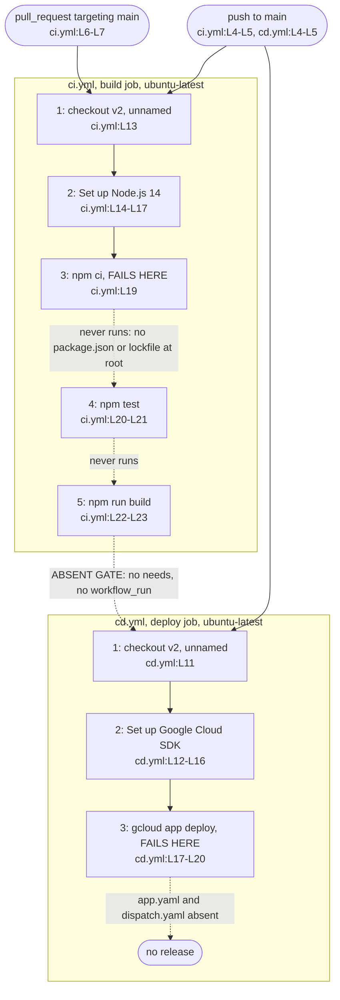

# GitHub Actions Workflows (`.github/workflows/`)

## Purpose

`.github/workflows/` defines every automated job GitHub runs for this repository. `ci.yml` validates pushes and pull requests targeting `main`
(`ci.yml:L3-L7`), while `cd.yml` deploys pushes to `main` (`cd.yml:L3-L5`). Continuous Integration (CI) is the automated build and test pass on each change;
Continuous Deployment (CD) is the automated release pass after a merge. Neither workflow finishes as committed, because the CI job fails at its install step
(`ci.yml:L19`) and the CD job fails at its deploy step (`cd.yml:L19-L20`).

## Key Components

| Component | Type | Location | Description |
| --- | --- | --- | --- |
| `CI` | Workflow | `ci.yml:L1` | Validation workflow. Fires on push and on pull request against `main` (`ci.yml:L3-L7`) |
| `build` | Job | `ci.yml:L10-L23` | The only job in `ci.yml`. Runs on `ubuntu-latest` (`ci.yml:L11`) across five steps |
| Checkout, unnamed | Step 1 of 5 | `ci.yml:L13` | Bare `- uses: actions/checkout@v2` with no `name:` key, so the run log shows the action reference |
| `Set up Node.js` | Step 2 of 5 | `ci.yml:L14-L17` | Installs Node.js 14 through `actions/setup-node@v2` (`ci.yml:L15`, `:L17`) |
| `Install dependencies` | Step 3 of 5 | `ci.yml:L18-L19` | Runs `npm ci` at the checkout root. Exits non-zero, so steps 4 and 5 never start |
| `Run tests` | Step 4 of 5 | `ci.yml:L20-L21` | Runs `npm test`. Unreachable |
| `Build` | Step 5 of 5 | `ci.yml:L22-L23` | Runs `npm run build`. Unreachable, and no step uploads the output |
| `CD` | Workflow | `cd.yml:L1` | Deployment workflow. Fires on push to `main` only (`cd.yml:L3-L5`) |
| `deploy` | Job | `cd.yml:L8-L20` | The only job in `cd.yml`. Runs on `ubuntu-latest` (`cd.yml:L9`) across three steps |
| Checkout, unnamed | Step 1 of 3 | `cd.yml:L11` | Bare `- uses: actions/checkout@v2` with no `name:` key |
| `Set up Google Cloud SDK` | Step 2 of 3 | `cd.yml:L12-L16` | Authenticates the Google Cloud software development kit (SDK) from two repository secrets (`cd.yml:L15-L16`) |
| `Deploy to Google Cloud` | Step 3 of 3 | `cd.yml:L17-L20` | One step holding two `gcloud app deploy` commands inside a block scalar (`cd.yml:L18-L20`) |

## Architecture Fit

No heading in the specification corpus places these two workflows. `documentation/Technical Specifications.md` carries five unnumbered top-level headings, and
none covers release automation: `INTRODUCTION` (L3), `SYSTEM ARCHITECTURE` (L125), `SYSTEM DESIGN` (L300), `TECHNOLOGY STACK` (L523) and
`SECURITY CONSIDERATIONS` (L620). A case-insensitive search of that document for `deploy`, `pipeline`, `GitHub Action` and `continuous` returns zero matches. The
nearest heading, `## THIRD-PARTY SERVICES` (`documentation/Technical Specifications.md:L587`), names Google Cloud Functions as the serverless compute platform
(`:L591`), not the App Engine target that `cd.yml:L19-L20` deploys to.

One specification line does reach release automation, and that line names a different platform. `documentation/Software Requirements Specifications (SRS).md:L617`,
under the `## QUALITY` heading, states that CI/CD pipelines should use Google Cloud Build. `documentation/Software Project Proposal.md:L257` lists continuous
integration and deployment pipelines as a scope item without naming a tool. The committed repository implements GitHub Actions instead (`ci.yml:L1`, `cd.yml:L1`).
Google Cloud Build is declared intent, and GitHub Actions is implemented reality.

For the repository-wide map of the six top-level areas and how they connect, see [`../../docs/architecture-overview.md`](../../docs/architecture-overview.md).

## Dependencies

Three distinct Actions appear across four call sites, because `actions/checkout@v2` runs in both workflows (`ci.yml:L13`, `cd.yml:L11`). All three pins are
deprecated.

### External

| Dependency | Version | Used at | Status |
| --- | --- | --- | --- |
| `actions/checkout@v2` | v2 | `ci.yml:L13`, `cd.yml:L11` | Deprecated pin, superseded |
| `actions/setup-node@v2` | v2 | `ci.yml:L15` | Deprecated pin, superseded |
| `google-github-actions/setup-gcloud@v0.2.0` | v0.2.0 | `cd.yml:L13` | Deprecated pin, superseded |
| `ubuntu-latest` runner image | Unpinned label | `ci.yml:L11`, `cd.yml:L9` | Floating. The image contents change without any repository change |

### Internal

No workflow imports a repository module. Each internal dependency below is a file path that a shell command assumes exists.

| Path | Assumed by | Present in the repository |
| --- | --- | --- |
| `package.json` at the checkout root | `npm ci` (`ci.yml:L19`), `npm test` (`:L21`), `npm run build` (`:L23`) | ABSENT. The only manifest is `frontend/package.json` |
| A lockfile at the checkout root | `npm ci` (`ci.yml:L19`) | ABSENT. No `package-lock.json`, `yarn.lock` or `pnpm-lock.yaml` is committed |
| `frontend/package.json` scripts | `npm test`, `npm run build` (`ci.yml:L21`, `:L23`) | PRESENT (`frontend/package.json:L31-L38`), and unreachable because no step sets `working-directory` |
| `app.yaml` | `cd.yml:L19` | ABSENT at every path |
| `dispatch.yaml` | `cd.yml:L20` | ABSENT at every path |

## Configuration

| Setting | Declared at | Value | Status |
| --- | --- | --- | --- |
| `secrets.GCP_PROJECT_ID` | `cd.yml:L15` | Repository secret, injected at run time | CONSUMED |
| `secrets.GCP_SA_KEY` | `cd.yml:L16` | Repository secret, injected at run time | CONSUMED |
| `node-version` | `ci.yml:L17` | `'14'` | CONSUMED |
| Push branch filter | `ci.yml:L4-L5`, `cd.yml:L4-L5` | `main` | CONSUMED by both workflows |
| Pull request branch filter | `ci.yml:L6-L7` | `main` | CONSUMED by `ci.yml` only. `cd.yml` declares none |
| `working-directory` | Nowhere | None | NEVER SET, so every `run:` executes at the checkout root |
| `env:` | Nowhere | None | NEVER DECLARED |
| `permissions` | Nowhere | None | NEVER DECLARED, so both jobs take the default token scope |
| Dependency `cache` | Nowhere | None | NEVER CONFIGURED, so each run resolves packages from scratch |

Both secret values stay outside the repository. `cd.yml:L15-L16` reads them through the `${{ secrets.NAME }}` expression, so no credential is committed.

## Data Flows

A change to `main` starts both workflows independently. GitHub runs `ci.yml` on push and on pull request (`ci.yml:L3-L7`), and `cd.yml` on push only
(`cd.yml:L3-L5`). Neither workflow references the other, because neither file declares `needs:` or `workflow_run`. A push to `main` therefore attempts a
deployment whether or not validation passed.



Dashed edges mark relationships that cannot complete as committed.

## Design Patterns

Four patterns hold across the two files, and one expected pattern is missing.

Trigger scoping follows purpose. `ci.yml` fires on push and on pull request against `main` (`ci.yml:L3-L7`), so a contributor gets validation before a merge.
`cd.yml` fires on push to `main` only (`cd.yml:L3-L5`), so a pull request never starts a release.

Each workflow declares a single job. `ci.yml` declares `build` (`ci.yml:L10`) and `cd.yml` declares `deploy` (`cd.yml:L8`). Both jobs run on `ubuntu-latest`
(`ci.yml:L11`, `cd.yml:L9`).

Cloud authentication arrives through injected secrets rather than committed files. The SDK step reads `project_id` and `service_account_key` from repository
secrets (`cd.yml:L15-L16`).

Every action carries an explicit version pin (`ci.yml:L13`, `:L15`, `cd.yml:L11`, `:L13`). The runner label does not, so `ubuntu-latest` floats.

The missing pattern is a gate between validation and deployment. Nothing makes `cd.yml` wait for `ci.yml`, so a push to `main` (`cd.yml:L3-L5`) starts both jobs
at the same time.

## Known Limitations

Neither workflow can complete as committed. The `build` job stops at step 3 of 5 (`ci.yml:L19`), and the `deploy` job stops at step 3 of 3 (`cd.yml:L17-L20`).
Every claim below was checked against the two workflow files and the 61-file tracked set.

### `ci.yml`

- `npm ci` runs at the checkout root (`ci.yml:L19`), where no `package.json` exists. The only manifest is `frontend/package.json`, and no step sets
  `working-directory` in either file. The step exits non-zero, so `npm test` (`ci.yml:L21`) and `npm run build` (`ci.yml:L23`) never run.
- Scoping the command to `frontend/` would still fail, because no lockfile is committed. `npm ci` requires one, and the repository holds no
  `package-lock.json`, `yarn.lock` or `pnpm-lock.yaml`. Running `npm install` inside `frontend/` does succeed.
- The front-door install instructions and the CI command disagree. `README.md:L35-L36` documents `cd frontend` followed by `npm install`, while `ci.yml:L19`
  runs `npm ci` at the root. Different directory, different command.
- No job runs Python. All 18 committed Python files go unexercised, including the three test modules under `backend/tests/`.
- No lint gate and no type-check gate exist, although both tools are already configured. `frontend/package.json:L36` defines a `lint` script, and
  `frontend/tsconfig.json:L25` sets `"noEmit": true`, which supports a standalone type check.
- `actions/checkout@v2` (`ci.yml:L13`) and `actions/setup-node@v2` (`ci.yml:L15`) are deprecated pins.
- Node 14 (`ci.yml:L17`) is past end of life, and three files declare the floor while nothing enforces it: `README.md:L22`, `ci.yml:L17`, and
  `infrastructure/docker/frontend.Dockerfile:L2`. `frontend/package.json` declares no `engines` field, and no `.nvmrc` is committed.
- The `build` job runs one configuration with no caching and no explicit token scope. Neither file declares `strategy`, `matrix`, `cache`,
  `permissions`, `env:`, `if:`, `timeout-minutes`, `continue-on-error`, `concurrency`, `schedule`, `workflow_dispatch`, `defaults`, `container`, `services:`
  and `outputs:`.

### `cd.yml`

- Both deployment descriptors are absent, so the deploy cannot succeed. `cd.yml:L19` deploys `app.yaml` and `cd.yml:L20` deploys `dispatch.yaml`. Neither
  filename appears anywhere in the 61-file tracked set.
- `google-github-actions/setup-gcloud@v0.2.0` (`cd.yml:L13`) is a deprecated pin.
- No validation gates the deployment. A push to `main` starts `deploy` (`cd.yml:L3-L5`) whatever the `ci.yml` result, and both files contain zero occurrences
  of `needs:` and `workflow_run`. Because `ci.yml` already fails at `ci.yml:L19`, nothing is validated before a deploy is attempted.
- No rollback step, no environment protection and no artifact handoff exist. Both files contain zero occurrences of `environment`, `upload-artifact` and
  `download-artifact`. `ci.yml:L23` builds the frontend and discards the result, while `cd.yml` deploys from a fresh checkout (`cd.yml:L11`).
- Nothing in the repository provisions the deploy target. `cd.yml:L19-L20` deploys to Google App Engine, and a search of `infrastructure/terraform/` for
  `app_engine` and `appengine` returns zero matches. The Terraform root declares one provider, `google` (`infrastructure/terraform/main.tf:L9`), and four
  resources: `google_compute_network.word_network` (`:L19`), `google_compute_subnetwork.word_subnet` (`:L25`),
  `google_compute_firewall.allow_internal` (`:L35`) and `google_storage_bucket.word_documents` (`:L50`).
- Neither workflow publishes documentation. GitHub renders the Markdown in this repository directly, so no documentation build step exists.

### Markers and comments

Both files carry zero `HUMAN ASSISTANCE NEEDED` markers and zero `TODO` markers. A zero marker count is not a clean bill of health here. The authors left no
notes in either file, so every defect above came from reading the two workflow files rather than from a marker.

Neither `ci.yml` nor `cd.yml` receives an inline comment in this documentation pass. For the reasoning behind that choice, see
[`../../docs/decision-log.md`](../../docs/decision-log.md).

### Two pitfalls a contributor meets first

- Every pull request targeting `main` runs `ci.yml` (`ci.yml:L6-L7`), so a contributor watches CI fail at `ci.yml:L19` for a reason unrelated to the change
  under review.
- Following `README.md:L35-L36` produces a working `frontend/` install, which is not what CI runs at `ci.yml:L19`. A green local install and a red CI run agree
  with each other here.

For the consolidated defect register covering the whole repository, see [`../../docs/troubleshooting.md`](../../docs/troubleshooting.md). For the end-to-end
deployment story, including the cloud-provider question, see [`../../docs/deployment-guide.md`](../../docs/deployment-guide.md). For prerequisites and first-run
setup, see [`../../docs/onboarding.md`](../../docs/onboarding.md).

## Usage Examples

### Triggering the workflows

Push to `main` and both workflows start. Open a pull request against `main` and only `ci.yml` starts. The block below is `ci.yml:L3-L7` verbatim.

```yaml
on:
  push:
    branches: [ main ]
  pull_request:
    branches: [ main ]
```

A run started either way stops at step 3, `npm ci` (`ci.yml:L19`), because the checkout root holds no `package.json`.

### Reproducing the CI install failure

Run the CI install command from the repository root:

```bash
npm ci
```

The command reproduces `ci.yml:L19` and fails the same way, because the repository root holds no `package.json`. The only manifest is `frontend/package.json`.
Running `cd frontend` then `npm install`, as `README.md:L35-L36` documents, succeeds instead, and that success does not predict a green CI run.

### What the deploy step runs

```bash
gcloud app deploy app.yaml --quiet
gcloud app deploy dispatch.yaml --quiet
```

Both commands come from the single step at `cd.yml:L17-L20`, and both fail, because neither `app.yaml` nor `dispatch.yaml` is committed anywhere in the
repository.
