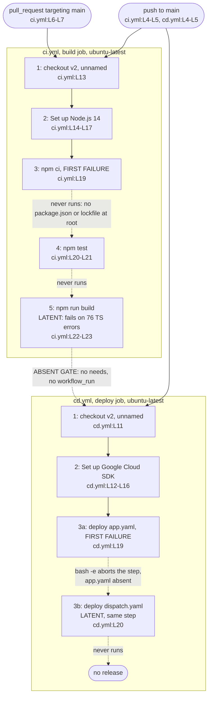

# GitHub Actions Workflows (`.github/workflows/`)

## Purpose

`.github/workflows/` defines every automated job GitHub runs for this repository. `ci.yml` validates pushes and pull requests targeting `main`
(`ci.yml:L3-L7`), while `cd.yml` deploys pushes to `main` (`cd.yml:L3-L5`). Continuous Integration (CI) is the automated build and test pass on each change;
Continuous Deployment (CD) is the automated release pass after a merge. Neither workflow finishes as committed. The CI job fails at its install step
(`ci.yml:L19`), and the CD job fails on the first command of its deploy step (`cd.yml:L19`), which leaves the second command (`cd.yml:L20`) unreached.

## Key Components

| Component | Type | Location | Description |
| --- | --- | --- | --- |
| `CI` | Workflow | `ci.yml:L1` | Validation workflow. Fires on push and on pull request against `main` (`ci.yml:L3-L7`) |
| `build` | Job | `ci.yml:L10-L23` | The only job in `ci.yml`. Runs on `ubuntu-latest` (`ci.yml:L11`) across five steps |
| Checkout, unnamed | Step 1 of 5 | `ci.yml:L13` | Bare `- uses: actions/checkout@v2` with no `name:` key, so the run log shows the action reference |
| `Set up Node.js` | Step 2 of 5 | `ci.yml:L14-L17` | Installs Node.js 14 through `actions/setup-node@v2` (`ci.yml:L15`, `:L17`) |
| `Install dependencies` | Step 3 of 5 | `ci.yml:L18-L19` | Runs `npm ci` at the checkout root. Exits non-zero, so steps 4 and 5 never start |
| `Run tests` | Step 4 of 5 | `ci.yml:L20-L21` | Runs `npm test`. Unreachable |
| `Build` | Step 5 of 5 | `ci.yml:L22-L23` | Runs `npm run build`. Unreachable, and would fail on the 76 TypeScript errors if reached. No step uploads the output |
| `CD` | Workflow | `cd.yml:L1` | Deployment workflow. Fires on push to `main` only (`cd.yml:L3-L5`) |
| `deploy` | Job | `cd.yml:L8-L20` | The only job in `cd.yml`. Runs on `ubuntu-latest` (`cd.yml:L9`) across three steps |
| Checkout, unnamed | Step 1 of 3 | `cd.yml:L11` | Bare `- uses: actions/checkout@v2` with no `name:` key |
| `Set up Google Cloud SDK` | Step 2 of 3 | `cd.yml:L12-L16` | Authenticates the Google Cloud software development kit (SDK) from two repository secrets (`cd.yml:L15-L16`) |
| `Deploy to Google Cloud` | Step 3 of 3 | `cd.yml:L17-L20` | One step holding two `gcloud app deploy` commands inside a block scalar (`cd.yml:L18-L20`). GitHub runs a `run:` block on Linux through `bash -e`, so the first non-zero exit aborts the step and `cd.yml:L20` never executes |

## Architecture Fit

No heading in the specification corpus places these two workflows. `documentation/Technical Specifications.md` carries five unnumbered top-level headings, and
none covers release automation: `INTRODUCTION` (L3), `SYSTEM ARCHITECTURE` (L125), `SYSTEM DESIGN` (L300), `TECHNOLOGY STACK` (L523) and
`SECURITY CONSIDERATIONS` (L620). A case-insensitive search of that document for `deploy`, `pipeline`, `GitHub Action` and `continuous` returns zero matches. The
nearest heading, `## THIRD-PARTY SERVICES` (`documentation/Technical Specifications.md:L587`), names Google Cloud Functions as the serverless compute platform
(`:L591`), not the App Engine target that `cd.yml:L19-L20` deploys to.

One specification line does reach release automation, and that line names a different platform. `documentation/Software Requirements Specifications (SRS).md:L617`,
under the `## QUALITY` heading, states that CI/CD pipelines should use Google Cloud Build, and `documentation/Software Project Proposal.md:L257` lists such
pipelines as a scope item without naming a tool. The committed repository implements GitHub Actions instead (`ci.yml:L1`, `cd.yml:L1`), so Google Cloud Build is
declared intent and GitHub Actions is implemented reality.

For the repository-wide map of the six top-level areas and how they connect, see [`../../docs/architecture-overview.md`](../../docs/architecture-overview.md).

## Dependencies

Three distinct Actions appear across four call sites, because `actions/checkout@v2` runs in both workflows (`ci.yml:L13`, `cd.yml:L11`). All three references are
deprecated, and all three are mutable tags rather than immutable pins.

### External

| Dependency | Version | Used at | Status |
| --- | --- | --- | --- |
| `actions/checkout@v2` | `v2` tag | `ci.yml:L13`, `cd.yml:L11` | Deprecated and superseded. A tag is mutable, so the owner can repoint it at different code |
| `actions/setup-node@v2` | `v2` tag | `ci.yml:L15` | Deprecated and superseded. Mutable tag |
| `google-github-actions/setup-gcloud@v0.2.0` | `v0.2.0` tag | `cd.yml:L13` | Deprecated and superseded. Mutable tag, and this is the step that receives the service-account key |
| `ubuntu-latest` runner image | Unpinned label | `ci.yml:L11`, `cd.yml:L9` | Floating. The image contents change without any repository change |

Only a full-length commit Secure Hash Algorithm (SHA) reference is immutable. Each tag above resolves at run time to whatever commit it then points at, so nothing
in this repository fixes the code that runs in a job.

### Internal

No workflow imports a repository module. Each internal dependency below is a file path that a shell command assumes exists.

| Path | Assumed by | Present in the repository |
| --- | --- | --- |
| `package.json` at the checkout root | `npm ci` (`ci.yml:L19`), `npm test` (`:L21`), `npm run build` (`:L23`) | ABSENT. The only manifest is `frontend/package.json` |
| A lockfile at the checkout root | `npm ci` (`ci.yml:L19`) | ABSENT. No `package-lock.json`, `yarn.lock` or `pnpm-lock.yaml` is committed |
| `frontend/package.json` scripts | `npm test`, `npm run build` (`ci.yml:L21`, `:L23`) | PRESENT (`frontend/package.json:L31-L38`), and unreachable because no step sets `working-directory` |
| `app.yaml` | `cd.yml:L19` | ABSENT at every path |
| `dispatch.yaml` | `cd.yml:L20` | ABSENT at every path |

## Configuration

| Setting | Declared at | Value | Status |
| --- | --- | --- | --- |
| `secrets.GCP_PROJECT_ID` | `cd.yml:L15` | Repository secret, injected at run time | CONSUMED |
| `secrets.GCP_SA_KEY` | `cd.yml:L16` | Repository secret, injected at run time | CONSUMED. A long-lived user-managed service account key. See Supply chain and workflow identity below |
| `node-version` | `ci.yml:L17` | `'14'` | CONSUMED |
| Push branch filter | `ci.yml:L4-L5`, `cd.yml:L4-L5` | `main` | CONSUMED by both workflows |
| Pull request branch filter | `ci.yml:L6-L7` | `main` | CONSUMED by `ci.yml` only. `cd.yml` declares none |
| `working-directory` | Nowhere | None | NEVER SET, so every `run:` executes at the checkout root |
| `env:` | Nowhere | None | NEVER DECLARED |
| `permissions` | Nowhere | None | NEVER DECLARED. Both jobs take whatever the repository or organization default grants, so least privilege is not pinned by anything in these files. An explicit `permissions` block, narrowed per job, is what would pin it |
| Dependency `cache` | Nowhere | None | NEVER CONFIGURED, so each run resolves packages from scratch |

Both secret values stay outside the repository. `cd.yml:L15-L16` reads them through the `${{ secrets.NAME }}` expression, so no credential is committed.

Keeping the key out of the repository is not the same as containing it. `secrets.GCP_SA_KEY` (`cd.yml:L16`) is handed to the mutable tag
`google-github-actions/setup-gcloud@v0.2.0` (`cd.yml:L13`), in a job whose token scope is never narrowed, so whoever controls that tag controls code running beside the key.

## Data Flows

A change to `main` starts both workflows independently. GitHub runs `ci.yml` on push and on pull request (`ci.yml:L3-L7`), and `cd.yml` on push only
(`cd.yml:L3-L5`). Neither workflow references the other, because neither file declares `needs:` or `workflow_run`. A push to `main` therefore attempts a
deployment whether or not validation passed.



Dashed edges mark relationships that cannot complete as committed.

## Design Patterns

Four patterns hold across the two files, and one expected pattern is missing.

Trigger scoping follows purpose. `ci.yml` fires on push and on pull request against `main` (`ci.yml:L3-L7`), and `cd.yml` fires on push to `main` only
(`cd.yml:L3-L5`), so a pull request never starts a release. A pull request starts CI, which fails at installation before validating the change.

Each workflow declares a single job. `ci.yml` declares `build` (`ci.yml:L10`) and `cd.yml` declares `deploy` (`cd.yml:L8`). Both jobs run on `ubuntu-latest`
(`ci.yml:L11`, `cd.yml:L9`).

Cloud authentication arrives through injected secrets rather than committed files. The SDK step reads `project_id` and `service_account_key` from repository
secrets (`cd.yml:L15-L16`).

Every action carries an explicit version reference (`ci.yml:L13`, `:L15`, `cd.yml:L11`, `:L13`). Every one of those references is a mutable tag rather than a
commit SHA, so none of them pins the code that runs. The runner label carries no version at all, so `ubuntu-latest` floats as well.

The missing pattern is a gate between validation and deployment. Nothing makes `cd.yml` wait for `ci.yml`, so a push to `main` (`cd.yml:L3-L5`) starts both jobs
at the same time.

## Known Limitations

Neither workflow can complete as committed. The `build` job stops at step 3 of 5 (`ci.yml:L19`), and the `deploy` job stops on the first command of step 3 of 3
(`cd.yml:L19`). Every claim below was checked against the two workflow files and the tracked tree.

The table separates the blocker a run actually hits from the latent blockers behind it. A latent blocker is real and unfixed but never reached, so clearing the
first blocker exposes the next one rather than producing a green run.

| Workflow | Limitation | Evidence |
| --- | --- | --- |
| `ci.yml` | `npm ci` runs at the checkout root, where no `package.json` exists | `ci.yml:L19`. The only manifest is `frontend/package.json`, and no step sets `working-directory` in either file. The step exits non-zero, so `npm test` (`ci.yml:L21`) and `npm run build` (`ci.yml:L23`) never run |
| `ci.yml` | Scoping the command to `frontend/` would still fail, because no lockfile is committed | `npm ci` requires one, and the repository holds no `package-lock.json`, `yarn.lock` or `pnpm-lock.yaml`. Running `npm install` inside `frontend/` does succeed |
| `ci.yml` | The front-door install instructions and the CI command disagree | `README.md:L35-L36` documents `cd frontend` followed by `npm install`, while `ci.yml:L19` runs `npm ci` at the root: different directory, different command |
| `ci.yml` | No job runs Python | All 18 committed Python files go unexercised, including the three test modules under `backend/tests/` |
| `ci.yml` | LATENT: the `Build` step would fail even once installation is fixed | `npm run build` (`ci.yml:L23`) runs `react-scripts build` (`frontend/package.json:L33`), which type-checks the project and treats a TypeScript error as a build failure. Create React App downgrades those errors to warnings only when `TSC_COMPILE_ON_ERROR=true` is set, and no committed file sets it, because no `.env` file exists. `npx tsc --noEmit` reports 76 errors, so the build step fails on the second attempt at a green run |
| `ci.yml` | No dedicated lint step and no dedicated type-check step exist, although both tools are already configured | `frontend/package.json:L36` defines a `lint` script, and `frontend/tsconfig.json:L25` sets `"noEmit": true`, which supports a standalone type check. The `Build` step type-checks as a side effect, which reports the errors at the wrong stage and gives no separate signal |
| `ci.yml` | Two deprecated action pins | `actions/checkout@v2` (`ci.yml:L13`) and `actions/setup-node@v2` (`ci.yml:L15`) |
| `ci.yml` | Node 14 reached end of life on 30 April 2023 and is unsupported as of 6 August 2026, per [Node.js previous releases](https://nodejs.org/en/about/previous-releases) | `ci.yml:L17`. Three files declare the floor while nothing enforces it: `README.md:L22`, `ci.yml:L17` and `infrastructure/docker/frontend.Dockerfile:L2`. No `engines` field and no `.nvmrc` is committed |
| both | The `build` job runs one configuration with no caching and no explicit token scope | Neither file declares `strategy`, `matrix`, `cache`, `permissions`, `env:`, `if:`, `timeout-minutes`, `continue-on-error`, `concurrency`, `schedule`, `workflow_dispatch`, `defaults`, `container`, `services:` or `outputs:` |
| `cd.yml` | Both deployment descriptors are absent, so the deploy cannot succeed | `cd.yml:L19` deploys `app.yaml` and `cd.yml:L20` deploys `dispatch.yaml`. Neither filename appears anywhere in the tracked tree |
| `cd.yml` | The two commands share one step, and only the first runs | GitHub executes a `run:` block on a Linux runner through `bash -e` by default, so the first non-zero exit ends the step. `cd.yml:L19` is the failure a run reports, and `cd.yml:L20` is LATENT: the missing `dispatch.yaml` never gets a chance to be reported. Supplying `app.yaml` alone therefore moves the failure to `cd.yml:L20` rather than producing a release |
| `cd.yml` | A deprecated, mutable action pin on the step the service-account key passes through | `google-github-actions/setup-gcloud@v0.2.0` (`cd.yml:L13`). See the Dependencies note above on supply chain exposure |
| `cd.yml` | No validation gates the deployment | A push to `main` starts `deploy` (`cd.yml:L3-L5`) whatever the `ci.yml` result, and both files contain zero occurrences of `needs:` and `workflow_run`. Because `ci.yml` already fails at `ci.yml:L19`, nothing is validated before a deploy is attempted |
| `cd.yml` | No rollback step, no environment protection and no artifact handoff exist | Both files contain zero occurrences of `environment`, `upload-artifact` and `download-artifact`. `ci.yml:L23` would discard its build output, and `cd.yml` deploys from a fresh checkout (`cd.yml:L11`) |
| `cd.yml` | Nothing in the repository provisions the deploy target | `cd.yml:L19-L20` deploys to Google App Engine, and a search of `infrastructure/terraform/` for `app_engine` and `appengine` returns zero matches. The Terraform root declares one provider, `google` (`infrastructure/terraform/main.tf:L9`), and four resources: a network (`:L19`), a subnetwork (`:L25`), a firewall rule (`:L35`) and a storage bucket (`:L50`) |
| both | Neither workflow publishes documentation | GitHub renders the Markdown in this repository directly, so no documentation build step exists |

### Supply chain and workflow identity

| Concern | Committed state, and the prerequisite for fixing it |
| --- | --- |
| Action references are mutable | `actions/checkout@v2` (`ci.yml:L13`, `cd.yml:L11`), `actions/setup-node@v2` (`ci.yml:L15`) and `google-github-actions/setup-gcloud@v0.2.0` (`cd.yml:L13`) name tags, not pins. Anyone with write access to an action repository can move or delete a tag. A tag therefore names whatever bytes it currently points at rather than a fixed release. Only a full-length commit SHA is an immutable reference, which is [GitHub's stated position](https://docs.github.com/en/actions/reference/security/secure-use). In the March 2025 `tj-actions/changed-files` compromise, tags v1 through v45.0.7 were repointed at a single malicious commit on 14 and 15 March 2025. The fix shipped in v46.0.1 ([CVE-2025-30066](https://github.com/advisories/GHSA-mrrh-fwg8-r2c3), [CISA alert](https://www.cisa.gov/news-events/alerts/2025/03/18/supply-chain-compromise-third-party-tj-actionschanged-files-cve-2025-30066-and-reviewdogaction)). A moved tag is the failure mode this leaves open. Replacing each tag with a reviewed full commit SHA, and recording the resolved version in a comment beside it, is the prerequisite. |
| No least-privilege token scope | Neither file declares a `permissions:` block at workflow or job level, so both jobs receive the default `GITHUB_TOKEN` scope. `ci.yml` needs `contents: read` alone, and `cd.yml` needs `contents: read` plus `id-token: write` if it moves to federated identity. Declaring the minimum explicitly in both files is the prerequisite. |
| A long-lived key authenticates the deploy | `cd.yml:L16` passes `secrets.GCP_SA_KEY` to `setup-gcloud`. A user-managed service account key is long-lived, does not expire by default, and grants its permissions to anyone who obtains it. That makes it a high-value target, and it has to be rotated and audited by hand. |
| No federated identity is configured | Workload Identity Federation is the preferred model: it exchanges the OpenID Connect token GitHub issues for short-lived Google credentials and removes key management entirely. The model needs `permissions: id-token: write` on the job, plus a workload identity pool and provider on the Google side. The provider also needs an attribute condition restricting it to this repository, because an unconditioned provider lets any repository authenticate. None of the three exists today. |

Every row above is deployment work rather than documentation work, and
[`../../docs/deployment-guide.md`](../../docs/deployment-guide.md) carries the sequence.

### Markers and comments

Both files carry zero `HUMAN ASSISTANCE NEEDED` markers and zero `TODO` markers. A zero marker count is not a clean bill of health here. The authors left no
notes, so every defect above came from reading the two workflow files rather than from a marker.

Neither `ci.yml` nor `cd.yml` receives an inline comment in this documentation pass, because both are configuration files with no logic and are documented here
instead.

### Two pitfalls a contributor meets first

- Every pull request targeting `main` runs `ci.yml` (`ci.yml:L6-L7`), so a contributor watches CI fail at `ci.yml:L19` for a reason unrelated to the change
  under review.
- Following `README.md:L35-L36` produces a working `frontend/` install, which is not what CI runs at `ci.yml:L19`, so a green local install predicts nothing.

For the consolidated defect register covering the whole repository, see [`../../docs/troubleshooting.md`](../../docs/troubleshooting.md). For the end-to-end
deployment story, including the cloud-provider question, see [`../../docs/deployment-guide.md`](../../docs/deployment-guide.md). For prerequisites and first-run
setup, see [`../../docs/onboarding.md`](../../docs/onboarding.md).

## Usage Examples

### Triggering the workflows

Push to `main` and both workflows start. Open a pull request against `main` and only `ci.yml` starts. The block below is `ci.yml:L3-L7` verbatim.

```yaml
on:
  push:
    branches: [ main ]
  pull_request:
    branches: [ main ]
```

A run started either way stops at step 3, `npm ci` (`ci.yml:L19`), because the checkout root holds no `package.json`.

### Reproducing the CI install failure

Run the CI install command from the repository root:

```bash
npm ci
```

The command reproduces `ci.yml:L19` and fails the same way, because the root holds no `package.json` and the only manifest is `frontend/package.json`. Running
`cd frontend` then `npm install`, as `README.md:L35-L36` documents, succeeds instead, and that success predicts nothing about CI.

### What the deploy step runs

The two commands below are quoted as workflow reference only. Do not run them against a real project. `gcloud app deploy` publishes to Google App Engine under
whatever account and project the local `gcloud` configuration happens to hold. `--quiet` suppresses the confirmation prompt, and an App Engine deployment
cannot be undone by re-running the command.

If you must execute them to study the failure, use a disposable non-production project, confirm the active identity first
with `gcloud config list account` and `gcloud config get-value project`. Name the target explicitly with `--project=<disposable-project-id>` rather than
relying on the ambient default.

```bash
# Workflow reference. Run only against a disposable non-production project.
gcloud app deploy app.yaml --quiet --project=<disposable-project-id>
gcloud app deploy dispatch.yaml --quiet --project=<disposable-project-id>
```

Both commands come from the single step at `cd.yml:L17-L20`, and neither `app.yaml` nor `dispatch.yaml` is committed anywhere in the repository. Only the first
command runs. GitHub executes the block through `bash -e`, so the non-zero exit at `cd.yml:L19` ends the step and the second command at `cd.yml:L20` never starts.
A run log therefore shows one failure, not two.
