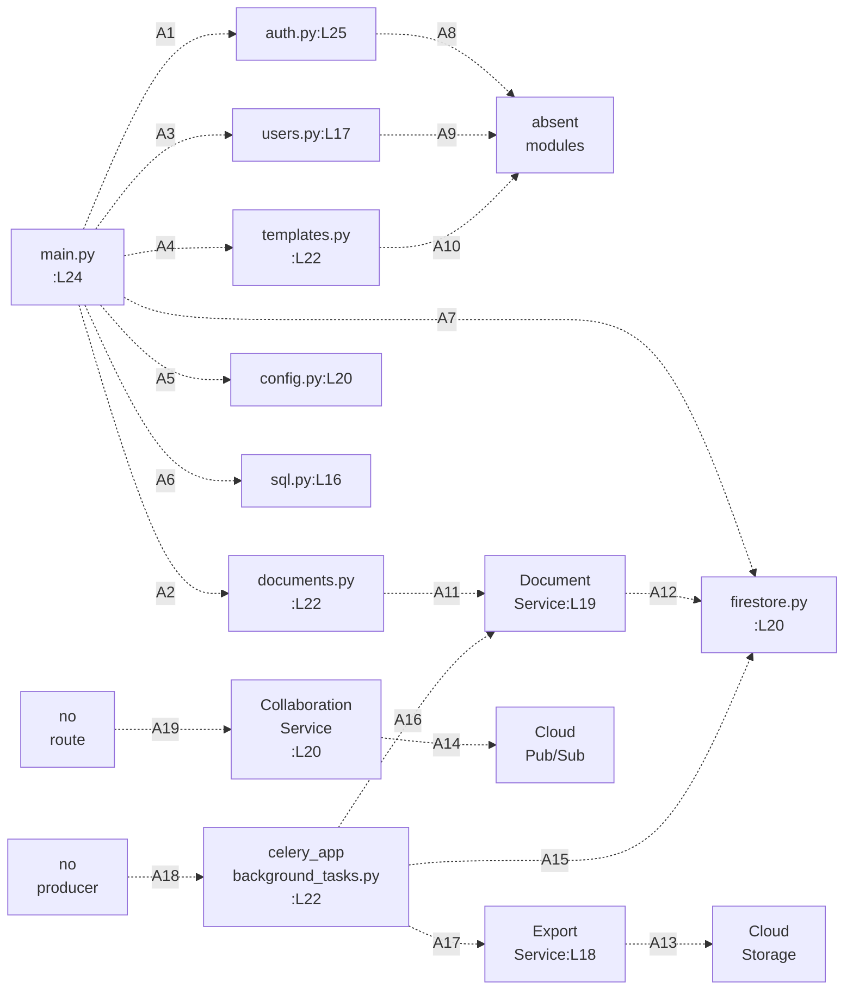

# backend/app

The FastAPI application package. Fifteen Python modules, 1,675 physical lines at the current branch head, 13 top-level classes
and 43 function and method definitions, documented as committed.

## Purpose

`backend/app` holds the server side of the application. The fifteen modules cover one composition root, four route modules, two
persistence adapters, three domain services, the Pydantic validation contracts, and one Celery task module. The route modules
publish the application programming interface (API) over the hypertext transfer protocol (HTTP).

`main.py` builds the application object at `main.py:L24` and mounts all four routers at `main.py:L80-L83`. The package does not
run as committed. `import app.main` raises `ImportError: cannot import name 'settings' from 'app.core.config'` through
`main.py:L16` then `api/auth.py:L19`, and only 3 of the 15 modules import successfully.

## Key Components

| Component | Type | Location | Description |
| --- | --- | --- | --- |
| `app` | FastAPI instance | `main.py:L24` | The application object. Constructed with no arguments, so no title, version or docs URL is set at construction. |
| `startup_event` | Async lifecycle handler | `main.py:L27` | Awaits `init_db()` at L42 and checks `db.is_connected()` at L45. Catches every exception at L50 and prints it at L51, so startup continues after a failed check. |
| `shutdown_event` | Async lifecycle handler | `main.py:L55` | Awaits `db.close()` at L65 on the client built at `db/firestore.py:L20`. No manifest pins `google-cloud-firestore`, so whether `close()` exists and whether it returns something `await` accepts both depend on the resolved client surface. |
| Cross-origin resource sharing (CORS) | Middleware call | `main.py:L71-L77` | Registers the CORS middleware. Reads `settings.ALLOWED_ORIGINS` at L73 and allows all methods and headers. |
| Router mounts | Four `include_router` calls | `main.py:L80-L83` | All four routers mount with no prefix, in the order auth, documents, users, templates. |
| Title and version | Attribute assignment | `main.py:L86-L87` | Set after the middleware and routers are already installed. |
| `api/` | Sub-package, 4 modules | `api/auth.py:L25`, `api/documents.py:L22`, `api/users.py:L17`, `api/templates.py:L22` | 14 HTTP handlers across four `APIRouter` objects, each exported as the bare name `router`. See [api/README.md](api/README.md). |
| `core/` | Sub-package, 2 modules | `core/config.py:L20`, `core/security.py:L25` | The `Settings` model plus the JSON Web Token (JWT) and password-hashing primitives. See [core/README.md](core/README.md). |
| `db/` | Sub-package, 2 modules | `db/firestore.py:L20`, `db/sql.py:L16` | Two persistence adapters. Both construct their client or engine at import time. See [db/README.md](db/README.md). |
| `schema/` | Sub-package, 2 modules | `schema/document.py:L16`, `schema/user.py:L17` | Nine Pydantic models covering documents, versions and users. See [schema/README.md](schema/README.md). |
| `services/` | Sub-package, 3 modules | `services/document_service.py:L19`, `services/collaboration_service.py:L20`, `services/export_service.py:L18` | `DocumentService`, `CollaborationService` and `ExportService`. See [services/README.md](services/README.md). |
| `tasks/` | Sub-package, 1 module | `tasks/background_tasks.py:L22` | One Celery application and three tasks. See [tasks/README.md](tasks/README.md). |

## Architecture Fit

The committed layering matches the tiers that `documentation/Technical Specifications.md, SYSTEM ARCHITECTURE > HIGH-LEVEL
ARCHITECTURE DIAGRAM (L140)` lays out. Routers under `api/` call services under `services/`, services reach persistence through
`db/`, and `core/` and `schema/` serve every tier. The dependency direction never inverts: no module under `db/` imports from
`services/` or `api/`. Repository-wide layering sits in
[../../docs/architecture-overview.md](../../docs/architecture-overview.md).

Three divergences from that specification change how a reader should read the package. Each one below states a fact about the
committed code, not a claim on the specification's authority.

First, the specification diagrams a prefixed route surface. `documentation/Technical Specifications.md, SYSTEM DESIGN > API
DESIGN (L402)` places every route under `/auth`, `/documents`, `/users` or `/templates` in its diagram at L406-L433. The
committed code mounts all four routers with no prefix at `main.py:L80-L83`, so every route lands at the application root, which
is what makes the documents and templates paths collide.

Second, the specification names twelve backend components and the package implements three. `documentation/Technical
Specifications.md, SYSTEM ARCHITECTURE > COMPONENT DIAGRAMS > Backend Components (L201)` diagrams AuthService, DocumentService,
CollaborationService, ExportService, DocumentRepository, VersionControl, WebSocketManager, ConflictResolver, PDFGenerator,
DOCXGenerator, UserManager and PermissionChecker at L118-L132. Three exist as code: `DocumentService` at
`services/document_service.py:L19`, `CollaborationService` at `services/collaboration_service.py:L20` and `ExportService` at
`services/export_service.py:L18`. The other nine names have no implementing file.

Third, the specification names a server the package never uses. `documentation/Technical Specifications.md, TECHNOLOGY STACK >
FRAMEWORKS AND LIBRARIES > Backend (L548)` lists Gunicorn at L555. No module imports it, and
`infrastructure/docker/backend.Dockerfile:L20` runs uvicorn instead.

## Dependencies

Ten of the import statements below do not resolve. Contract shapes are covered in
[../../docs/data-model.md](../../docs/data-model.md), and the external services these packages reach are covered in
[../../docs/integration-guide.md](../../docs/integration-guide.md).

### Internal

| Imported name | Import site | Resolves | Evidence |
| --- | --- | --- | --- |
| `auth_router` from `app.api.auth` | `main.py:L16` | No | The module exports the bare name `router` at `api/auth.py:L25`. |
| `documents_router` from `app.api.documents` | `main.py:L17` | No | The module exports `router` at `api/documents.py:L22`. |
| `users_router` from `app.api.users` | `main.py:L18` | No | The module exports `router` at `api/users.py:L17`. |
| `templates_router` from `app.api.templates` | `main.py:L19` | No | The module exports `router` at `api/templates.py:L22`. |
| `settings` from `app.core.config` | `main.py:L20` | No | `core/config.py` defines the `Settings` class at L20 and a `get_settings` factory at L61, and no module-level instance. |
| `db` from `app.db.firestore` | `main.py:L21` | Yes | `db/firestore.py:L20` builds the client at import time. |
| `init_db` from `app.db.sql` | `main.py:L22` | No | `db/sql.py` declares `engine`, `SessionLocal`, `Base` and `get_db`, and no `init_db`. |
| `UserService` from `app.services.user_service` | `api/auth.py:L21`, `api/users.py:L14` | No | No file exists at `backend/app/services/user_service.py`. |
| `Template`, `TemplateCreate`, `TemplateUpdate` from `app.schema.template` | `api/templates.py:L17` | No | No file exists at `backend/app/schema/template.py`. |
| `TemplateService` from `app.services.template_service` | `api/templates.py:L18` | No | No file exists at `backend/app/services/template_service.py`. |
| `app.schema.document`, `app.schema.user` | `api/documents.py:L17`, `api/users.py:L13` | Yes | Both schema modules import cleanly and are 2 of the 3 modules that do. |
| Sub-packages `api/`, `core/`, `db/`, `schema/`, `services/`, `tasks/` | `main.py:L16-L22` and the routers | Partly | Documented in [api/README.md](api/README.md), [core/README.md](core/README.md), [db/README.md](db/README.md), [schema/README.md](schema/README.md), [services/README.md](services/README.md) and [tasks/README.md](tasks/README.md). |

### External

**This section publishes no supported package set, because no supported set exists.** No dependency manifest and no lock file is
committed anywhere in the repository, so nothing here is pinned, reviewed or reproducible. The two tables below record what the
code *requires*, split by how a reader can discover it. A "Floor" of unestablished means the repository fixes nothing rather
than that any release is safe.

Published advisories reach several of these distributions, and the missing pin cannot exclude any of them. The complete list
sits in the [dated register](../../docs/troubleshooting.md#the-dated-dependency-and-advisory-register), which is the only place
in this documentation set that carries an advisory identifier or a version floor. One entry needs stating here, because it
concerns the two verifying call sites this package owns. `python-jose` releases through 3.3.0 carry
[CVE-2024-33663](https://github.com/advisories/GHSA-6c5p-j8vq-pqhj), an algorithm confusion weakness with OpenSSH ECDSA and
other key formats, fixed in 3.4.0. The advisory concerns verification rather than signing, so the exposed calls would be
`jwt.decode` at `core/security.py:L123` and `api/auth.py:L53`, not the `jwt.encode` calls at `core/security.py:L54` and
`api/auth.py:L95-L99`.

**Whether this repository is exposed cannot be established here, and three preconditions decide it.** The installed release
would have to be 3.3.0 or earlier, and no committed file pins one. The verification key would have to be in a format the
confusion applies to, and `core/config.py:L42` declares `SECRET_KEY: str` with no value and no format requirement. The algorithm
list would have to admit the confused algorithm, and both decode calls pass `algorithms=[settings.ALGORITHM]`, a single value
that `core/config.py:L44` also leaves undeclared. Read the advisory as a reason to pin and review, not as a demonstrated path
into this code.

**A reviewed manifest and lock file, with a tested compatibility and security matrix that satisfies the applicable advisories,
is required future work**, recorded in the [onboarding guide](../../docs/onboarding.md). The [decision
log](../../docs/decision-log.md) records the inference choices below.

**One inventory, three categories.** The import graph requires seventeen distributions: ten named by an `import` statement and
seven runtime companions that no import names. Thirteen of the seventeen need naming to a package manager, because `starlette`,
`ecdsa`, `rsa` and `pyasn1` arrive transitively.

Four more sit outside it, selected by configuration rather than code. Those are a PostgreSQL driver, a Redis client,
`cryptography`, and `python-dotenv`, which `Config.env_file` at `core/config.py:L58` selects and which is needed only once that
file exists ([Pydantic 1.10](https://docs.pydantic.dev/1.10/usage/settings/)). An install command names seventeen: the thirteen
plus these four. Every dependency count in this set refers to this model.

**Directly imported distributions.** An `import` statement names each one, so a reader finds it by grep and a resolver reports
it by name. The ten a direct import names:

| Distribution | Constraint | Establishing code fact |
| --- | --- | --- |
| fastapi | 0.89.0 or newer | Response models come from return annotations. No `response_model=` argument appears on any of the 14 handlers. |
| pydantic | 1.x only | `BaseSettings` is imported from the main package at `core/config.py:L17`, `orm_mode = True` appears at `schema/user.py:L81`, and `.dict(exclude_unset=True)` at `services/document_service.py:L152` is the version 1 API. |
| sqlalchemy | 1.4 or newer | `declarative_base` is imported from `sqlalchemy.orm` at `db/sql.py:L13` and called at L19. Version 1.3 exposed that name from `sqlalchemy.ext.declarative` instead. |
| python-jose | Unestablished | `from jose import jwt` at `core/security.py:L16` and `api/auth.py:L16`, with `except jwt.JWTError` at `core/security.py:L127`. |
| passlib with a bcrypt backend | Unestablished | `from passlib.context import CryptContext` at `core/security.py:L17` and `api/auth.py:L17`, used with `schemes=['bcrypt']` at `core/security.py:L22`. |
| google-cloud-firestore | Unestablished | `from google.cloud.firestore import Client` at `db/firestore.py:L14` and `services/document_service.py:L14`. |
| google-auth | Unestablished | `from google.auth import default` at `db/firestore.py:L15`. |
| google-cloud-pubsub | Unestablished | `from google.cloud.pubsub_v1 import PublisherClient, SubscriberClient` at `services/collaboration_service.py:L16`. |
| google-cloud-storage | Unestablished | `from google.cloud.storage import Client` at `services/export_service.py:L14` and `tasks/background_tasks.py:L15`. |
| celery | Unestablished | `from celery import Celery` at `tasks/background_tasks.py:L14`, instantiated at L22. |

**Runtime companions that no import statement names.** These cannot be discovered by grepping the source, which is what makes a
first environment build fail repeatedly rather than once.

| Distribution | Floor | Why the runtime needs it |
| --- | --- | --- |
| uvicorn | Unestablished | Serves the application. `infrastructure/docker/backend.Dockerfile:L20` runs it and root `README.md:L55` names it, and no module imports it. |
| starlette | Whatever fastapi resolves | `services/collaboration_service.py:L15` imports `WebSocket` and `WebSocketDisconnect`, which FastAPI re-exports from Starlette. |
| python-multipart | Unestablished | Blocks a route rather than a build. `OAuth2PasswordRequestForm`, imported at `api/auth.py:L15` and used at `:L66`, parses a form body through it, and FastAPI does not install it by default. |
| bcrypt | Unestablished | `core/security.py:L22` and `api/auth.py:L24` build a `CryptContext` with the bcrypt scheme, and passlib does not depend on bcrypt. |
| ecdsa, rsa, pyasn1 | Unestablished | Transitive closure of `python-jose`, pulled in for its signing backends. |

Nothing pins either set. Setup steps belong in [../../docs/onboarding.md](../../docs/onboarding.md).

## Configuration

Every setting arrives through the `Settings` model at `core/config.py:L20`. Nine fields are declared at
`core/config.py:L40-L48`, and six more are read from a `settings` object that never declares them. No field carries an explicit
default.

The two `Optional[str]` fields at L45 and L46 take an implicit `None` under Pydantic 1.x, so exactly seven of the nine are
required at instantiation. `Config.env_file` at `core/config.py:L58` points at a `.env` file that is not committed, and names it
relatively. The path therefore resolves against the working directory of the process rather than this package.
[core/README.md](core/README.md) classifies all fifteen.

| Setting | Status | Location | Read by |
| --- | --- | --- | --- |
| `SECRET_KEY`, `ALGORITHM`, `ACCESS_TOKEN_EXPIRE_MINUTES` | DECLARED | `core/config.py:L42-L44` | `api/auth.py:L53`, `L94-L98`; `core/security.py:L52-L54`, `L123` |
| `DATABASE_URL` | DECLARED | `core/config.py:L47` | `db/sql.py:L16`, at import time |
| `GOOGLE_CLOUD_PROJECT` | DECLARED | `core/config.py:L45` | `db/firestore.py:L20`, at import time |
| `REDIS_URL` | DECLARED | `core/config.py:L48` | `tasks/background_tasks.py:L22`, at import time |
| `PROJECT_NAME`, `API_V1_STR`, `GOOGLE_APPLICATION_CREDENTIALS` | DECLARED, never read | `core/config.py:L40`, `L41`, `L46` | Nothing. No module dereferences any of the three. |
| `ALLOWED_ORIGINS` | READ-BUT-NEVER-DECLARED | First read at `main.py:L73` | The CORS middleware registration at `main.py:L71-L77` |
| `PROJECT_ID` | READ-BUT-NEVER-DECLARED | First read at `services/collaboration_service.py:L69` | Pub/Sub topic and subscription paths, also `:L70`, `:L124` and `:L149` |
| `STORAGE_BUCKET_NAME` | READ-BUT-NEVER-DECLARED | First read at `services/export_service.py:L60` | Both export methods, also L92 |
| `SIGNED_URL_EXPIRATION` | READ-BUT-NEVER-DECLARED | First read at `services/export_service.py:L68` | Both export methods, also L100 |
| `EXPORT_BUCKET_NAME` | READ-BUT-NEVER-DECLARED | First read at `tasks/background_tasks.py:L62` | The export task at `tasks/background_tasks.py:L25` |
| `DOCUMENT_BUCKET_NAME` | READ-BUT-NEVER-DECLARED | Read once, at `tasks/background_tasks.py:L107` | The retention sweep `cleanup_expired_documents`, declared at `tasks/background_tasks.py:L73`. The statistics task at `:L116` does not read it. |

## Data Flows

A request would enter through one of the four routers, the router would call a service, and the service would read or write
Firestore through the module-level client at `db/firestore.py:L20`. That is the declared design, and **none of it executes as
committed**.

The first import blocker decides everything downstream. `main.py:L16` reaches `api/auth.py`, whose `:L19` requests a `settings`
singleton that `core/config.py` never creates, so package import raises `ImportError` before any router registers. Client
construction is therefore **conditional** on that one repair: `db/firestore.py:L20` builds the Firestore client and
`db/sql.py:L16` opens the SQLAlchemy engine only once the settings import resolves. Neither line runs today. Every business-flow
edge below is likewise unreachable as committed, because no route is registered to originate one.

Read the edges accordingly. **Every edge below is dashed**, because each one either fails to resolve or cannot execute as
committed, and every label names the reason.



The nineteen keys resolve as follows. `A1` through `A7` are the seven import statements the composition root runs before it
registers anything, and each one is the line that fails.

| Key | Edge | What the code does | Why it does not resolve |
| --- | --- | --- | --- |
| A1 | `main.py` to `api/auth.py` | `main.py:L16` runs `from app.api.auth import auth_router` | `auth.py:L25` exports the bare name `router`, not `auth_router` |
| A2 | `main.py` to `api/documents.py` | `main.py:L17` requests `documents_router` | `documents.py:L22` exports `router` |
| A3 | `main.py` to `api/users.py` | `main.py:L18` requests `users_router` | `users.py:L17` exports `router` |
| A4 | `main.py` to `api/templates.py` | `main.py:L19` requests `templates_router` | `templates.py:L22` exports `router` |
| A5 | `main.py` to `core/config.py` | `main.py:L20` runs `from app.core.config import settings` | `config.py:L20` declares the `Settings` class and creates no module-level instance |
| A6 | `main.py` to `db/sql.py` | `main.py:L22` runs `from app.db.sql import init_db` | `sql.py` defines no `init_db` |
| A7 | `main.py` to `db/firestore.py` | `main.py:L21` runs `from app.db.firestore import db` | The module body raises first at `firestore.py:L16`, which imports the same absent `settings` |
| A8 | `api/auth.py` to the absent modules | `auth.py:L21` runs `from app.services.user_service import UserService` | `app/services/user_service.py` does not exist, and this is the import that fails first and stops the whole package |
| A9 | `api/users.py` to the absent modules | `users.py:L14` requests the same `UserService` | Same absent module |
| A10 | `api/templates.py` to the absent modules | `templates.py:L17` imports from `app.schema.template` and `:L18` from `app.services.template_service` | Neither module exists |
| A11 | `api/documents.py` to `DocumentService` | `documents.py` constructs the service and calls it per handler | No route ever registers, because the package import fails at A8 |
| A12 | `DocumentService` to the Firestore client | `document_service.py:L16` imports `db` and `:L40` assigns it to `self.db` | The client is never constructed. See [db/README.md](db/README.md) |
| A13 | `ExportService` to Cloud Storage | `export_service.py` uploads the rendered object | No upload executes, and the payload is a literal placeholder string |
| A14 | `CollaborationService` to Cloud Pub/Sub | `collaboration_service.py:L20` would publish and subscribe per document | No route and no WebSocket endpoint constructs the class |
| A15 | `tasks` to the Firestore client | the retention sweep and the statistics task open collections on `db` | No worker runs and no broker exists |
| A16 | `tasks` to `DocumentService` | `background_tasks.py:L56` and `:L135` call `get_document` | Same. `:L135` also passes one argument against two |
| A17 | `tasks` to `ExportService` | `background_tasks.py:L59` calls `convert_document` | `ExportService` declares no `convert_document` |
| A18 | no producer to `celery_app` | nothing | The repository contains zero `.delay`, zero `.apply_async` and zero `send_task` calls |
| A19 | no route to `CollaborationService` | nothing | Zero WebSocket routes exist under `backend/`, so the class is never reached |

Firestore carries the persistence. The SQLAlchemy path at `db/sql.py:L16-L21` builds an engine, a session factory and a
declarative base that nothing subclasses and no module calls. Both adapters work at import time, so `db/firestore.py:L20`
resolves credentials and `db/sql.py:L16` opens an engine as soon as either module loads.

## Design Patterns

`main.py` is a composition root. The module builds the application at `main.py:L24`, registers middleware at `main.py:L71-L77`
and mounts routers at `main.py:L80-L83`, and holds no business logic of its own. Each router owns one resource, so
`api/documents.py`, `api/users.py`, `api/templates.py` and `api/auth.py` each publish a single family of paths. The Pydantic
models under `schema/` validate at the boundary: `api/documents.py:L17` imports `Document`, `DocumentCreate` and
`DocumentUpdate`. The handler signatures convert an incoming body into a checked model before any service sees it.

Persistence goes through a module-level singleton. `db/firestore.py:L20` constructs one Firestore client at import, and
`main.py:L21`, `services/document_service.py:L16` and `tasks/background_tasks.py:L17` all import that same object. The service
tier owns ownership-based authorization. `services/document_service.py` compares the stored `user_id` against the caller at
L108, L148 and L184, then raises rather than returning a filtered result. The layering runs `api/` to `services/` to `db/`, with
`core/` and `schema/` available to every tier.

No repository abstraction sits over the two persistence adapters. `services/document_service.py:L16` imports the Firestore
client directly and calls `db.collection` inline, and the four adapter helpers at `db/firestore.py:L22`, `L45`, `L64` and `L79`
have no caller. A service needing the SQLAlchemy path would import `db/sql.py` itself, and none does.

## Known Limitations

One absent line accounts for nine of the twelve import failures. `core/config.py` declares the `Settings` class at L20 and a
`get_settings` factory at L61, and never creates the module-level `settings` instance that eight modules import by name. The
items below are the package-level defects with their evidence. Repository-wide defect evidence sits in
[../../docs/troubleshooting.md](../../docs/troubleshooting.md).

Six limitations hold for the package as a whole rather than for one module, and every one is an absent control rather than a
misconfiguration. Each is unexploitable while import fails, and each becomes live the moment it is repaired.

| Package-wide gap | Evidence |
| --- | --- |
| No authentication on the two public routes and no rate limit on any route. `main.py:L71` adds one middleware and it is CORS | `api/auth.py:L65` and `:L102` are public; no limiter, dependency or proxy configuration is committed |
| Object authorization is attempted on three handlers only. Of the fourteen routes, twelve require a bearer token and two are public, and nine of the twelve protected ones decide access on a valid token alone | Comparisons attempted at `api/documents.py:L92`, `:L121`, `:L147`; none on create, list, the two profile routes or the five template routes. `api/auth.py:L65` and `:L102` are the two public routes |
| CORS origins come from a field no settings class declares, alongside credentialed access and full wildcards | `main.py:L73` reads `settings.ALLOWED_ORIGINS`, absent from `core/config.py:L40-L48`; `:L74` sets `allow_credentials=True`, `:L75-L76` allow every method and header |
| The JWT secret, algorithm and lifetime are unconstrained, and tokens carry no issuer, audience or identifier | `core/config.py:L42`, `:L44`, `:L43` declare bare types with no validator; `api/auth.py:L95-L99` encodes only `sub` and `exp` |
| No explicitly raised 401 carries a `WWW-Authenticate: Bearer` challenge | Six explicit raises set no `headers`: `api/auth.py:L55-L56`, `:L58`, `:L91-L92`, `core/security.py:L126`, `:L128`, `:L133`. The scheme itself is the exception. `OAuth2PasswordBearer` at `api/auth.py:L23` and `core/security.py:L23` leaves `auto_error` at its default. A missing or non-bearer `Authorization` header is therefore answered by FastAPI with its own 401 carrying the challenge, before any handler runs |
| No request body bound and no field length bound anywhere | Neither `schema/document.py` nor `schema/user.py` contains a single `Field(` call, and no middleware limits a body |

[core/README.md](core/README.md) carries the token contract in full and [api/README.md](api/README.md) carries the per-handler
table.

- **`import app.main` raises `ImportError`.** The chain runs `main.py:L16` to `api/auth.py:L19`, reporting `cannot import name
'settings' from 'app.core.config'`. Exactly three modules import: `app.core.config`, `app.schema.document` and
`app.schema.user`. The other twelve fail. Byte compilation is unaffected, and `python -m compileall backend/app` exits 0.
- **Eight modules import the absent singleton:** `main.py:L20`, `api/auth.py:L19`, `db/firestore.py:L16`, `db/sql.py:L14`,
`services/collaboration_service.py:L18`, `services/document_service.py:L17`, `services/export_service.py:L16` and
`tasks/background_tasks.py:L16`. Seven dereference it; `services/document_service.py:L17` imports it and never uses it.
`core/security.py:L20` imports the `get_settings` factory instead, which exists and runs at L49 and L123.
- **Five more names are imported and never defined.** `main.py:L16-L19` requests `auth_router`, `documents_router`,
`users_router` and `templates_router`, while the modules export the bare name `router` at `api/auth.py:L25`,
`api/documents.py:L22`, `api/users.py:L17` and `api/templates.py:L22`. `main.py:L22` imports `init_db` and `:L42` awaits it,
while `db/sql.py` declares `engine`, `SessionLocal`, `Base` and `get_db` and nothing else.
- **All five template routes are unreachable.** `api/documents.py` registers `/` twice and `/{document_id}` three times, at L24,
L49, L68, L96 and L126. `api/templates.py` registers the same five shapes with `/{template_id}` at L24, L42, L59, L86 and L112.
Starlette path parameters are positional, so both identifier paths compile to one pattern. `main.py:L81` mounts documents before
`:L83` mounts templates, neither with a prefix, and the first wins every match.
- **The `app` package boundary exists only by convention.** No `__init__.py` file exists anywhere under `backend/`, so `app` and
its six sub-packages are implicit namespace packages, while every module imports by absolute `app.*` path.

- The container image moves that boundary. `infrastructure/docker/backend.Dockerfile:L5` sets `WORKDIR /app`, `L14` copies
`./app` into `/app`, and `L20` starts `uvicorn main:app`. The modules land at the filesystem root rather than beneath an `app`
package, so the `app.*` prefix cannot resolve inside the image as built. `L8` of the same file copies a `requirements.txt` that
exists nowhere in the repository. See [../../docs/deployment-guide.md](../../docs/deployment-guide.md).
- **Both lifecycle handlers are broken.** `main.py:L45` calls `db.is_connected()`, which the Firestore client does not provide.
`main.py:L50` catches every exception and `main.py:L51` prints it, so startup completes and the application serves requests
against connections it never verified. `main.py:L65` awaits `db.close()`. A synchronous `close()` returns `None`, and `await
None` raises `TypeError`; nothing pins the client, so its transport state is unestablished.
- **Six settings are read and never declared,** starting with `settings.ALLOWED_ORIGINS` at `main.py:L73`, and three declared
fields are never read: `PROJECT_NAME`, `API_V1_STR` and `GOOGLE_APPLICATION_CREDENTIALS`, at `core/config.py:L40`, `L41` and
`L46`.
- **Three code paths have no caller.** The Celery queue at `tasks/background_tasks.py:L22` has no producer, because no `.delay`
or `.apply_async` call exists anywhere. `CollaborationService` at `services/collaboration_service.py:L20` has no route, because
no WebSocket endpoint is registered in `main.py` or under `api/` and no package module imports the class. The four adapter
helpers at `db/firestore.py:L22`, `L45`, `L64` and `L79` have no caller, because services use the raw client instead.
- **Undefined names raise in two different places, and the difference decides how each is diagnosed.** A name in a signature is
evaluated when Python executes the `def`. `Optional` at `core/security.py:L25` and `User` at `:L90` each raise `NameError` while
`app.core.security` is still loading, and `L25` raises first. A name in a function body raises only under exercise:
`UserService` at `core/security.py:L130`, and `datetime` at `tasks/background_tasks.py:L96` and `:L146` against the
`timedelta`-only import at `:L20`.
- **Nine `HUMAN ASSISTANCE NEEDED` markers and six `TODO` markers stand in the package.** Markers sit at `main.py:L38`,
`api/users.py:L54`, `core/security.py:L86`, `services/collaboration_service.py:L42` and `L131`,
`services/document_service.py:L114`, `services/export_service.py:L38`, and `tasks/background_tasks.py:L49` and `L91`. The `TODO`
markers sit at `main.py:L49` and `L68`, and `services/export_service.py:L57`, `L62`, `L89` and `L94`.
- **Two instructions in the root `README.md` do not work against this package.** `L42` directs a reader to `pip install -r
requirements.txt`, and no such file exists. `L55` starts `uvicorn main:app` from `backend`, while the application object lives
at `backend/app/main.py`. The root README is reference material here and receives no edit.

## Usage Examples

`main.py` declares the surface below. The module cannot be imported, because `main.py:L16` fails through `api/auth.py:L19`, so
nothing here is reachable today.

```python
app = FastAPI()
async def startup_event(): ...            # L27: awaits init_db, checks Firestore
async def shutdown_event(): ...           # L55: awaits db.close
app.add_middleware(CORSMiddleware, ...)   # L71-L77: allow_origins from settings
app.include_router(auth_router)           # L80: mounted with no prefix
app.include_router(documents_router)
app.include_router(users_router)
app.include_router(templates_router)
```

Reproduce the import failure from `backend`, the root that makes the `app.*` prefix resolvable, by running `cd backend` and then
`python -c "import app.main"`. The command prints the chain that stops every other backend task:

```text
File "app/main.py", line 16, in <module>
    from app.api.auth import auth_router
File "app/api/auth.py", line 81, in <module>
    from app.core.config import settings
ImportError: cannot import name 'settings' from 'app.core.config'
```

Two schema modules do import, so the document contract is the one part of the package a reader can exercise directly.
`DocumentCreate` at `schema/document.py:L30` inherits `title`, `content` and `owner_id` from `DocumentBase` at
`schema/document.py:L26-L28`.

```python
from app.schema.document import DocumentCreate

draft = DocumentCreate(title="Quarterly report", content="")
print(draft.owner_id)   # None: owner_id defaults at schema/document.py:L28
```

The example above runs. `owner_id` carries a default, so a payload validates without the ownership field that
`services/document_service.py:L108` compares against. The three modules under `backend/tests/` are not a usable example source,
however: they import absent modules and mix incompatible import roots. They also assert a 201 response where no handler in the
package sets `status_code=`, so every handler returns 200 on success. Setup and prerequisites belong in
[../../docs/onboarding.md](../../docs/onboarding.md).
