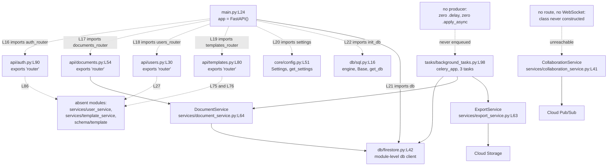

# backend/app

The FastAPI application package. Fifteen Python modules, 3,055 physical lines, 13
top-level classes and 43 function and method definitions, documented as committed.

## Purpose

`backend/app` holds the server side of the application. The fifteen modules cover one
composition root, four route modules, two persistence adapters, three domain services, the
Pydantic validation contracts, and one Celery task module. The route modules publish the
application programming interface (API) over the hypertext transfer protocol (HTTP).

`main.py` builds the application object at `main.py:L24` and mounts all four routers at
`main.py:L125-L128`. The package does not run as committed. `import app.main` raises
`ImportError: cannot import name 'settings' from 'app.core.config'` through `main.py:L16`
then `api/auth.py:L84`, and only 3 of the 15 modules import successfully.

## Key Components

| Component | Type | Location | Description |
| --- | --- | --- | --- |
| `app` | FastAPI instance | `main.py:L24` | The application object. Constructed with no arguments, so no title, version or docs URL is set at construction. |
| `startup_event` | Async lifecycle handler | `main.py:L27` | Awaits `init_db()` at L60 and checks `db.is_connected()` at L63. Catches every exception at L68 and prints it at L69, so startup continues after a failed check. |
| `shutdown_event` | Async lifecycle handler | `main.py:L73` | Awaits `db.close()` at L110. The Firestore `close()` is synchronous and returns `None`, which `await` cannot suspend on. |
| Cross-origin resource sharing (CORS) | Middleware call | `main.py:L116-L122` | Registers the CORS middleware. Reads `settings.ALLOWED_ORIGINS` at L118 and allows all methods and headers. |
| Router mounts | Four `include_router` calls | `main.py:L125-L128` | All four routers mount with no prefix, in the order auth, documents, users, templates. |
| Title and version | Attribute assignment | `main.py:L131-L132` | Set after the middleware and routers are already installed. |
| `api/` | Sub-package, 4 modules | `api/auth.py:L90`, `api/documents.py:L54`, `api/users.py:L30`, `api/templates.py:L80` | 14 HTTP handlers across four `APIRouter` objects, each exported as the bare name `router`. See [api/README.md](api/README.md). |
| `core/` | Sub-package, 2 modules | `core/config.py:L51`, `core/security.py:L50` | The `Settings` model plus the JSON Web Token (JWT) and password-hashing primitives. See [core/README.md](core/README.md). |
| `db/` | Sub-package, 2 modules | `db/firestore.py:L42`, `db/sql.py:L16` | Two persistence adapters. Both construct their client or engine at import time. See [db/README.md](db/README.md). |
| `schema/` | Sub-package, 2 modules | `schema/document.py:L57`, `schema/user.py:L71` | Nine Pydantic models covering documents, versions and users. See [schema/README.md](schema/README.md). |
| `services/` | Sub-package, 3 modules | `services/document_service.py:L64`, `services/collaboration_service.py:L41`, `services/export_service.py:L63` | `DocumentService`, `CollaborationService` and `ExportService`. See [services/README.md](services/README.md). |
| `tasks/` | Sub-package, 1 module | `tasks/background_tasks.py:L98` | One Celery application and three tasks. See [tasks/README.md](tasks/README.md). |

## Architecture Fit

The committed layering matches the tiers that
`documentation/Technical Specifications.md, SYSTEM ARCHITECTURE > HIGH-LEVEL ARCHITECTURE DIAGRAM (L140)`
lays out. Routers under `api/` call services under `services/`, services reach persistence
through `db/`, and `core/` and `schema/` serve every tier. The dependency direction never
inverts: no module under `db/` imports from `services/` or `api/`. Repository-wide layering
sits in [../../docs/architecture-overview.md](../../docs/architecture-overview.md).

Three divergences from that specification change how a reader should read the package. Each
one below states a fact about the committed code, not a claim on the specification's
authority.

First, the specification diagrams a prefixed route surface.
`documentation/Technical Specifications.md, SYSTEM DESIGN > API DESIGN (L402)` places every
route under `/auth`, `/documents`, `/users` or `/templates` in its diagram at L406-L433.
The committed code mounts all four routers with no prefix at `main.py:L125-L128`, so every
route lands at the application root, which is what makes the documents and templates paths
collide.

Second, the specification names twelve backend components and the package implements three.
`documentation/Technical Specifications.md, SYSTEM ARCHITECTURE > COMPONENT DIAGRAMS > Backend Components (L201)`
diagrams AuthService, DocumentService, CollaborationService, ExportService,
DocumentRepository, VersionControl, WebSocketManager, ConflictResolver, PDFGenerator,
DOCXGenerator, UserManager and PermissionChecker at L203-L217. Three exist as code:
`DocumentService` at `services/document_service.py:L64`, `CollaborationService` at
`services/collaboration_service.py:L41` and `ExportService` at
`services/export_service.py:L63`. The other nine names have no implementing file.

Third, the specification names a server the package never uses.
`documentation/Technical Specifications.md, TECHNOLOGY STACK > FRAMEWORKS AND LIBRARIES > Backend (L548)`
lists Gunicorn at L555. No module imports it, and
`infrastructure/docker/backend.Dockerfile:L20` runs uvicorn instead.

## Dependencies

Ten of the import statements below do not resolve. Contract shapes are covered in
[../../docs/data-model.md](../../docs/data-model.md), and the external services these
packages reach are covered in
[../../docs/integration-guide.md](../../docs/integration-guide.md).

### Internal

| Imported name | Import site | Resolves | Evidence |
| --- | --- | --- | --- |
| `auth_router` from `app.api.auth` | `main.py:L16` | No | The module exports the bare name `router` at `api/auth.py:L90`. |
| `documents_router` from `app.api.documents` | `main.py:L17` | No | The module exports `router` at `api/documents.py:L54`. |
| `users_router` from `app.api.users` | `main.py:L18` | No | The module exports `router` at `api/users.py:L30`. |
| `templates_router` from `app.api.templates` | `main.py:L19` | No | The module exports `router` at `api/templates.py:L80`. |
| `settings` from `app.core.config` | `main.py:L20` | No | `core/config.py` defines the `Settings` class at L51 and a `get_settings` factory at L126, and no module-level instance. |
| `db` from `app.db.firestore` | `main.py:L21` | Yes | `db/firestore.py:L42` builds the client at import time. |
| `init_db` from `app.db.sql` | `main.py:L22` | No | `db/sql.py` declares `engine`, `SessionLocal`, `Base` and `get_db`, and no `init_db`. |
| `UserService` from `app.services.user_service` | `api/auth.py:L86`, `api/users.py:L27` | No | No file exists at `backend/app/services/user_service.py`. |
| `Template`, `TemplateCreate`, `TemplateUpdate` from `app.schema.template` | `api/templates.py:L75` | No | No file exists at `backend/app/schema/template.py`. |
| `TemplateService` from `app.services.template_service` | `api/templates.py:L76` | No | No file exists at `backend/app/services/template_service.py`. |
| `app.schema.document`, `app.schema.user` | `api/documents.py:L49`, `api/users.py:L26` | Yes | Both schema modules import cleanly and are 2 of the 3 modules that do. |
| Sub-packages `api/`, `core/`, `db/`, `schema/`, `services/`, `tasks/` | `main.py:L16-L22` and the routers | Partly | Documented in [api/README.md](api/README.md), [core/README.md](core/README.md), [db/README.md](db/README.md), [schema/README.md](schema/README.md), [services/README.md](services/README.md) and [tasks/README.md](tasks/README.md). |

### External

Seventeen Python Package Index distributions are required: eleven that a direct import
names, and six more that only the runtime closure needs. No dependency manifest is
committed anywhere in the repository, so every floor below is inferred from a code fact.
[../../docs/decision-log.md](../../docs/decision-log.md) records the inference choices.

| Distribution | Floor | Establishing code fact |
| --- | --- | --- |
| fastapi | 0.89.0 or newer | Response models come from return annotations. No `response_model=` argument appears on any of the 14 handlers. |
| pydantic | 1.x only | `BaseSettings` is imported from the main package at `core/config.py:L48`, `orm_mode = True` appears at `schema/user.py:L177`, and `.dict(exclude_unset=True)` at `services/document_service.py:L247` is the version 1 API. |
| sqlalchemy | 1.4 or newer | `declarative_base` is imported from `sqlalchemy.orm` at `db/sql.py:L13` and called at L19. Version 1.3 exposed that name from `sqlalchemy.ext.declarative` instead. |
| python-jose | Any | `from jose import jwt` at `core/security.py:L41` and `api/auth.py:L81`, with `except jwt.JWTError` at `core/security.py:L185`. |
| passlib with a bcrypt backend | Any | `from passlib.context import CryptContext` at `core/security.py:L42` and `api/auth.py:L82`, used with `schemes=['bcrypt']` at `core/security.py:L47`. |
| google-cloud-firestore | Any | `from google.cloud.firestore import Client` at `db/firestore.py:L36` and `services/document_service.py:L59`. |
| google-auth | Any | `from google.auth import default` at `db/firestore.py:L37`. |
| google-cloud-pubsub | Any | `from google.cloud.pubsub_v1 import PublisherClient, SubscriberClient` at `services/collaboration_service.py:L37`. |
| google-cloud-storage | Any | `from google.cloud.storage import Client` at `services/export_service.py:L59` and `tasks/background_tasks.py:L91`. |
| celery | 4 or 5 | `from celery import Celery` at `tasks/background_tasks.py:L90`, instantiated at L98. |
| uvicorn | Any | No module imports it. `infrastructure/docker/backend.Dockerfile:L20` runs it, and root `README.md:L55` names it. |

The six remaining distributions are starlette, python-multipart, bcrypt, ecdsa, rsa and
pyasn1, and no import names any of them. One of the six blocks a route rather than a build:
`OAuth2PasswordRequestForm`, imported at `api/auth.py:L80` and used at `api/auth.py:L171`,
parses a form body and needs python-multipart, which FastAPI does not install by default.
Because nothing pins the set, a first environment build fails once per missing distribution
rather than once in total. Setup steps belong in
[../../docs/onboarding.md](../../docs/onboarding.md).

## Configuration

Every setting arrives through the `Settings` model at `core/config.py:L51`. Nine fields are
declared at `core/config.py:L111-L119`, and six more are read from a `settings` object that
never declares them. No field carries an explicit default. The two `Optional[str]` fields
at L116 and L117 take an implicit `None` under Pydantic 1.x, so exactly seven of the nine
are required at instantiation. `Config.env_file` at `core/config.py:L123` points at a
`.env` file that is not committed. [core/README.md](core/README.md) classifies all fifteen.

| Setting | Status | Location | Read by |
| --- | --- | --- | --- |
| `SECRET_KEY`, `ALGORITHM`, `ACCESS_TOKEN_EXPIRE_MINUTES` | DECLARED | `core/config.py:L113-L115` | `api/auth.py:L158`, `L237-L241`; `core/security.py:L79-L81`, `L181` |
| `DATABASE_URL` | DECLARED | `core/config.py:L118` | `db/sql.py:L16`, at import time |
| `GOOGLE_CLOUD_PROJECT` | DECLARED | `core/config.py:L116` | `db/firestore.py:L42`, at import time |
| `REDIS_URL` | DECLARED | `core/config.py:L119` | `tasks/background_tasks.py:L98`, at import time |
| `PROJECT_NAME`, `API_V1_STR`, `GOOGLE_APPLICATION_CREDENTIALS` | DECLARED, never read | `core/config.py:L111`, `L112`, `L117` | Nothing. No module dereferences any of the three. |
| `ALLOWED_ORIGINS` | READ-BUT-NEVER-DECLARED | First read at `main.py:L118` | The CORS middleware registration at `main.py:L116-L122` |
| `PROJECT_ID` | READ-BUT-NEVER-DECLARED | First read at `services/collaboration_service.py:L115` | Pub/Sub topic and subscription paths, also L116, L204 and L235 |
| `STORAGE_BUCKET_NAME` | READ-BUT-NEVER-DECLARED | First read at `services/export_service.py:L154` | Both export methods, also L228 |
| `SIGNED_URL_EXPIRATION` | READ-BUT-NEVER-DECLARED | First read at `services/export_service.py:L162` | Both export methods, also L236 |
| `EXPORT_BUCKET_NAME` | READ-BUT-NEVER-DECLARED | First read at `tasks/background_tasks.py:L141` | The export task at `tasks/background_tasks.py:L101` |
| `DOCUMENT_BUCKET_NAME` | READ-BUT-NEVER-DECLARED | First read at `tasks/background_tasks.py:L278` | The statistics task at `tasks/background_tasks.py:L287` |

## Data Flows

A request enters through one of the four routers, the router calls a service, and the
service reads or writes Firestore through the module-level client at `db/firestore.py:L42`.
Dashed edges below mark an import or a path that cannot resolve.



Firestore carries the persistence. The SQLAlchemy path at `db/sql.py:L16-L21` builds an
engine, a session factory and a declarative base that nothing subclasses and no module
calls. Both adapters work at import time, so `db/firestore.py:L42` resolves credentials and
`db/sql.py:L16` opens an engine as soon as either module loads.

## Design Patterns

`main.py` is a composition root. The module builds the application at `main.py:L24`,
registers middleware at `main.py:L116-L122` and mounts routers at `main.py:L125-L128`, and
holds no business logic of its own. Each router owns one resource, so `api/documents.py`,
`api/users.py`, `api/templates.py` and `api/auth.py` each publish a single family of paths.
The Pydantic models under `schema/` validate at the boundary: `api/documents.py:L49`
imports `Document`, `DocumentCreate` and `DocumentUpdate`, and the handler signatures
convert an incoming body into a checked model before any service sees it.

Persistence goes through a module-level singleton. `db/firestore.py:L42` constructs one
Firestore client at import, and `main.py:L21`, `services/document_service.py:L61` and
`tasks/background_tasks.py:L93` all import that same object. The service tier owns
ownership-based authorization. `services/document_service.py` compares the stored `user_id`
against the caller at L177, L243 and L282, then raises rather than returning a filtered
result. The layering runs `api/` to `services/` to `db/`, with `core/` and `schema/`
available to every tier.

No repository abstraction sits over the two persistence adapters.
`services/document_service.py:L61` imports the Firestore client directly and calls
`db.collection` inline, and the four adapter helpers at `db/firestore.py:L44`, `L72`, `L94`
and `L112` have no caller. A service needing the SQLAlchemy path would import `db/sql.py`
itself, and none does.

## Known Limitations

One absent line accounts for nine of the twelve import failures. `core/config.py` declares
the `Settings` class at L51 and a `get_settings` factory at L126, and never creates the
module-level `settings` instance that eight modules import by name. The items below are the
package-level defects with their evidence. Repository-wide defect evidence sits in
[../../docs/troubleshooting.md](../../docs/troubleshooting.md).

- **`import app.main` raises `ImportError`.** The chain runs `main.py:L16` to
  `api/auth.py:L84`, reporting `cannot import name 'settings' from 'app.core.config'`.
  Exactly three modules import: `app.core.config`, `app.schema.document` and
  `app.schema.user`. The other twelve fail. Byte compilation is unaffected, and
  `python -m compileall backend/app` exits 0.
- **Eight modules import the absent singleton:** `main.py:L20`, `api/auth.py:L84`,
  `db/firestore.py:L38`, `db/sql.py:L14`, `services/collaboration_service.py:L39`,
  `services/document_service.py:L62`, `services/export_service.py:L61` and
  `tasks/background_tasks.py:L92`. Seven dereference it;
  `services/document_service.py:L62` imports it and never uses it. `core/security.py:L45`
  imports the `get_settings` factory instead, which exists and runs at L74 and L179.
- **Four router imports name symbols that do not exist.** `main.py:L16-L19` requests
  `auth_router`, `documents_router`, `users_router` and `templates_router`, while the
  modules export the bare name `router` at `api/auth.py:L90`, `api/documents.py:L54`,
  `api/users.py:L30` and `api/templates.py:L80`.
- **`init_db` does not exist.** `main.py:L22` imports the name and `main.py:L60` awaits it.
  `db/sql.py` declares `engine`, `SessionLocal`, `Base` and `get_db`, and nothing else.
- **All five template routes are unreachable.** `api/documents.py` registers `/` twice and
  `/{document_id}` three times, at L56, L114, L148, L191 and L240. `api/templates.py`
  registers the same five shapes with `/{template_id}`, at L82, L123, L156, L200 and L259.
  Starlette path parameters are positional, so both identifier paths compile to one pattern.
  `main.py:L126` mounts documents before `main.py:L128` mounts templates, neither with a
  prefix, and the first registration wins every match.
- **The `app` package boundary exists only by convention.** No `__init__.py` file exists
  anywhere under `backend/`, so `app` and its six sub-packages are implicit namespace
  packages, while every module imports by absolute `app.*` path. The container image moves
  that boundary. `infrastructure/docker/backend.Dockerfile:L5` sets `WORKDIR /app`, `L14`
  copies `./app` into `/app`, and `L20` starts `uvicorn main:app`. The modules land at the
  filesystem root rather than beneath an `app` package, so the `app.*` prefix cannot resolve
  inside the image as built. `L8` of the same file copies a `requirements.txt` that exists
  nowhere in the repository. See
  [../../docs/deployment-guide.md](../../docs/deployment-guide.md).
- **Both lifecycle handlers are broken.** `main.py:L63` calls `db.is_connected()`, which the
  Firestore client does not provide. `main.py:L68` catches every exception and `main.py:L69`
  prints it, so startup completes and the application serves requests against connections it
  never verified. `main.py:L110` awaits `db.close()`. The inherited `close` is synchronous,
  so the call shuts the transport, returns `None`, and `await` then raises `TypeError`.
- **Six settings are read and never declared,** starting with `settings.ALLOWED_ORIGINS` at
  `main.py:L118`. Three declared fields are never read: `PROJECT_NAME`, `API_V1_STR` and
  `GOOGLE_APPLICATION_CREDENTIALS`, at `core/config.py:L111`, `L112` and `L117`.
- **Three code paths have no caller.** The Celery queue at `tasks/background_tasks.py:L98`
  has no producer, because no `.delay` or `.apply_async` call exists in the repository.
  `CollaborationService` at `services/collaboration_service.py:L41` has no route, because
  no WebSocket endpoint is registered in `main.py` or under `api/` and no package module
  imports the class. The four adapter helpers at `db/firestore.py:L44`, `L72`, `L94` and
  `L112` have no caller, because services use the raw client instead.
- **Two undefined names raise at execution rather than at import.** `core/security.py:L50`
  annotates a default with `Optional`, which the module never imports, so importing
  `app.core.security` raises `NameError: name 'Optional' is not defined`.
  `tasks/background_tasks.py:L96` imports `timedelta` only, and `L267` and `L321` call
  `datetime.now()`.
- **Nine `HUMAN ASSISTANCE NEEDED` markers and six `TODO` markers stand in the package.**
  Markers sit at `main.py:L56`, `api/users.py:L76`, `core/security.py:L115`,
  `services/collaboration_service.py:L73` and `L211`, `services/document_service.py:L183`,
  `services/export_service.py:L85`, and `tasks/background_tasks.py:L128` and `L262`. The
  one in `main.py` reads
  `# The following code block has a confidence level below 0.8 and may need review`. The
  `TODO` markers sit at `main.py:L67` and `L113`, and `services/export_service.py:L151`,
  `L156`, `L225` and `L230`.
- **Two instructions in the root `README.md` do not work against this package.**
  `L42` directs a reader to run `pip install -r requirements.txt`, and no such file exists
  in the repository. `L55` directs a reader to start `uvicorn main:app` from `backend`,
  while the application object lives at `backend/app/main.py`. The root README is reference
  material here and receives no edit.

## Usage Examples

`main.py` declares the surface below. The module cannot be imported, because
`main.py:L16` fails through `api/auth.py:L84`, so nothing here is reachable today.

```python
app = FastAPI()                           # L24: the application object
async def startup_event(): ...            # L27: awaits init_db, checks Firestore
async def shutdown_event(): ...           # L73: awaits db.close
app.add_middleware(CORSMiddleware, ...)   # L116-L122: allow_origins from settings
app.include_router(auth_router)           # L125: mounted with no prefix
app.include_router(documents_router)      # L126
app.include_router(users_router)          # L127
app.include_router(templates_router)      # L128
```

Reproduce the import failure from the `backend` directory, which is the root that makes the
`app.*` prefix resolvable:

```bash
cd backend
python -c "import app.main"
```

The command prints the chain that stops every other backend task:

```text
File "app/main.py", line 16, in <module>
    from app.api.auth import auth_router
File "app/api/auth.py", line 84, in <module>
    from app.core.config import settings
ImportError: cannot import name 'settings' from 'app.core.config'
```

Two schema modules do import, so the document contract is the one part of the package a
reader can exercise directly. `DocumentCreate` at `schema/document.py:L70` inherits
`title`, `content` and `owner_id` from `DocumentBase` at `schema/document.py:L66-L68`.

```python
from app.schema.document import DocumentCreate

draft = DocumentCreate(title="Quarterly report", content="")
print(draft.owner_id)   # None: owner_id defaults at schema/document.py:L68
```

The example above runs. `owner_id` carries a default, so a payload validates without the
ownership field that `services/document_service.py:L177` compares against.

The three modules under `backend/tests/` are not a usable example source. They import
absent modules, mix incompatible import roots, and assert a 201 response where no handler
in the package sets `status_code=`, so every handler returns 200 on success. Environment
setup and prerequisites belong in [../../docs/onboarding.md](../../docs/onboarding.md).
