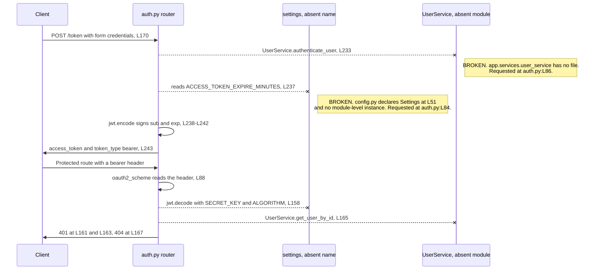
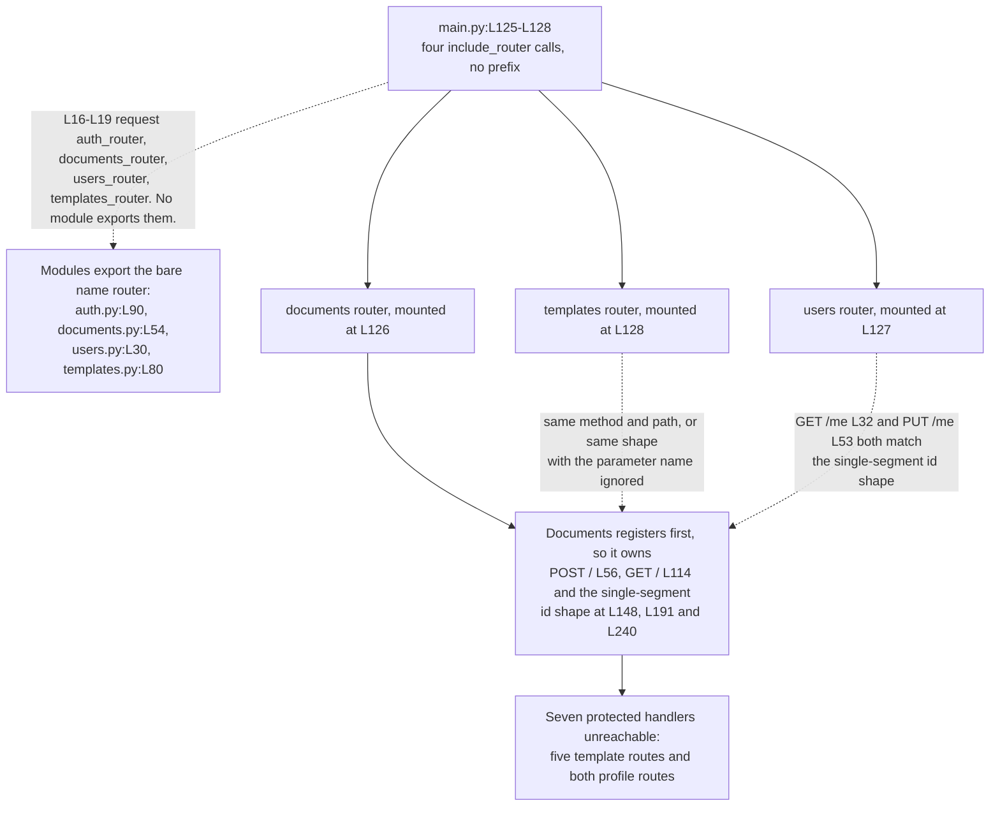

# backend/app/api

## Purpose

The directory holds the HyperText Transfer Protocol (HTTP) Application Programming
Interface (API) of the backend. Four modules each build one FastAPI `APIRouter` and register
the fourteen handlers that answer requests. `auth.py` issues tokens, `documents.py` covers
documents, `users.py` covers the current profile, and `templates.py` covers templates. The
handler families behave differently, so the tables below give per-handler detail rather than
one universal rule. None of the fourteen answers a request as committed, and the Reachability
column below names the reason for each one.

## Key Components

| Component | Type | Location | Description |
| --- | --- | --- | --- |
| `router` | `APIRouter` instance | `auth.py:L90` | Carries the two public authentication routes. `main.py:L16` imports the name `auth_router` from this module. |
| `router` | `APIRouter` instance | `documents.py:L54` | Carries five document routes. `main.py:L17` imports the name `documents_router`. |
| `router` | `APIRouter` instance | `users.py:L30` | Carries two profile routes. `main.py:L18` imports the name `users_router`. |
| `router` | `APIRouter` instance | `templates.py:L80` | Carries five template routes. `main.py:L19` imports the name `templates_router`. |
| `get_current_user` | Async dependency | `auth.py:L92` | Decodes the bearer token at L158 and loads the user at L165. Guards all twelve protected handlers. A second function of the same name sits at `core/security.py:L119`. |
| `oauth2_scheme` | `OAuth2PasswordBearer` | `auth.py:L88` | Extracts the bearer token. Constructed with `tokenUrl='token'`, matching the `POST /token` path at `auth.py:L170`. |
| `pwd_context` | `CryptContext` | `auth.py:L89` | Configured with `schemes=['bcrypt']`. Hashes a registration password at `auth.py:L326`. |
| Per-handler service objects | `DocumentService`, `TemplateService`, `UserService` | `documents.py:L110`, `templates.py:L119`, `users.py:L79` | Eleven of the fourteen handlers construct their own service instance. `auth.py` calls `UserService` methods on the class instead, at L165, L233, L322 and L327, and `get_current_user_info` at `users.py:L33` calls no service at all. |

The four routers publish fourteen handlers. Twelve declare
`current_user: User = Depends(get_current_user)` and two declare none, so the split measures
14 handlers, 12 protected, 2 public. No handler supplies `status_code=` on its decorator,
verified across all fourteen, so every success returns HTTP 200 by FastAPI default. The three
assertions expecting 201 at `../../tests/test_api.py:L37`, `:L53` and `:L64` do not describe
committed behaviour.

| Method | Path | Declaring file and handler | Authentication | Success status | Reachability |
| --- | --- | --- | --- | --- | --- |
| POST | `/token` | `auth.py:L170`, `login_for_access_token` at L171 | Public | 200 | No. `auth.py:L84` fails on import first. |
| POST | `/register` | `auth.py:L245`, `register_user` at L246 | Public | 200 | No. Same import failure at `auth.py:L84`. |
| POST | `/` | `documents.py:L56`, `create_document` at L57 | `Depends(get_current_user)` | 200 | No. `documents.py:L51` fails through `auth.py:L84`. |
| GET | `/` | `documents.py:L114`, `get_documents` at L115 | `Depends(get_current_user)` | 200 | No. Same transitive failure at `documents.py:L51`. |
| GET | `/{document_id}` | `documents.py:L148`, `get_document` at L149 | `Depends(get_current_user)` | 200 | No. Same transitive failure at `documents.py:L51`. |
| PUT | `/{document_id}` | `documents.py:L191`, `update_document` at L192 | `Depends(get_current_user)` | 200 | No. Same transitive failure at `documents.py:L51`. |
| DELETE | `/{document_id}` | `documents.py:L240`, `delete_document` at L241 | `Depends(get_current_user)` | 200 | No. Same transitive failure at `documents.py:L51`. |
| GET | `/me` | `users.py:L32`, `get_current_user_info` at L33 | `Depends(get_current_user)` | 200 | No. `users.py:L27` requests an absent module, and `documents.py:L148` already holds this shape. |
| PUT | `/me` | `users.py:L53`, `update_user` at L54 | `Depends(get_current_user)` | 200 | No. Same import failure at `users.py:L27`, and `documents.py:L191` already holds this shape. |
| POST | `/` | `templates.py:L82`, `create_template` at L83 | `Depends(get_current_user)` | 200 | No. `templates.py:L75` requests an absent module, and `documents.py:L56` already holds this shape. |
| GET | `/` | `templates.py:L123`, `get_templates` at L124 | `Depends(get_current_user)` | 200 | No. Same failure at `templates.py:L75`, and `documents.py:L114` already holds this shape. |
| GET | `/{template_id}` | `templates.py:L156`, `get_template` at L157 | `Depends(get_current_user)` | 200 | No. Same failure at `templates.py:L75`, and `documents.py:L148` already holds this shape. |
| PUT | `/{template_id}` | `templates.py:L200`, `update_template` at L201 | `Depends(get_current_user)` | 200 | No. Same failure at `templates.py:L75`, and `documents.py:L191` already holds this shape. |
| DELETE | `/{template_id}` | `templates.py:L259`, `delete_template` at L260 | `Depends(get_current_user)` | 200 | No. Same failure at `templates.py:L75`, and `documents.py:L240` already holds this shape. |

One failure precedes every entry in that column. `main.py:L16-L19` requests `auth_router`,
`documents_router`, `users_router` and `templates_router`, while all four modules export the
bare name `router` at `auth.py:L90`, `documents.py:L54`, `users.py:L30` and `templates.py:L80`.
The composition root binds no router at all.

Two of the fourteen return a collection, and neither offers a way to bound it. `GET /` at
`documents.py:L114` declares `-> List[Document]` and `GET /` at `templates.py:L123` declares
`-> List[Template]`, and both take `current_user` alone. Page-size, offset, cursor, sort and
field-projection parameters number zero across the directory, and no handler declares a `Query(`
parameter. Nothing bounds a result set further down either, since `backend/app/` holds no
`.limit(`, `offset`, `start_after` or cursor call. Once the binding failures clear, each list
response therefore materializes every matching record and serializes each one whole, including
the full `content` string `DocumentBase` declares at `schema/document.py:L67`. Response size
then tracks both the number of documents a caller owns and the length of each.

## Architecture Fit

The committed code places this directory at the entry tier, and `documentation/Technical Specifications.md, SYSTEM
DESIGN > API DESIGN (L402)` places the same responsibility there. Handlers accept a validated model, delegate to a
service class, and return the service result. Repository-wide layering sits in
[../../../docs/architecture-overview.md](../../../docs/architecture-overview.md).

The specification and the committed code diverge on the route surface. That file diagrams
every path behind a prefix at `Technical Specifications.md:L406-L433`, grouping routes under
`/auth`, `/documents`, `/users` and `/templates`. The committed code mounts all four routers
with no prefix at `main.py:L125-L128`, so every path lands at the application root. The
prefix absence is what puts the document and template paths on the same addresses.

Four routes the specification declares have no committed handler: `POST /logout` at
`Technical Specifications.md:L414`, `POST /refresh` at `:L415`, `POST /documents/{id}/share`
at `:L422` and `GET /users/{id}/documents` at `:L426`. One committed route runs the other way.
`POST /register` at `auth.py:L245` has no counterpart anywhere in that diagram.

The specification's own handler example sits at `Technical Specifications.md:L437-L445` and
differs from the committed handlers in two measurable ways. `:L438` declares
`response_model=Document`, and no handler in this directory passes `response_model=`. `:L443`
passes `current_user.id` to the service, while `documents.py:L111` passes the whole
`current_user` object. Both statements describe the committed code against the declared
intent, and neither treats the specification as a record of behaviour.

## Dependencies

Four internal imports name modules or symbols that do not exist, and the routers stop at the
first one. Contract shapes sit in [../../../docs/data-model.md](../../../docs/data-model.md),
and the external services the service tier reaches sit in
[../../../docs/integration-guide.md](../../../docs/integration-guide.md). The package-wide
import census and the `app` package boundary belong to [../README.md](../README.md).

### Internal

| Imported name | Import site | Resolves | Evidence |
| --- | --- | --- | --- |
| `settings` from `app.core.config` | `auth.py:L84` | No | `core/config.py` declares the `Settings` class at L51 and a `get_settings` factory at L126, and never creates a module-level instance. |
| `UserService` from `app.services.user_service` | `auth.py:L86`, `users.py:L27` | No | No file exists at `backend/app/services/user_service.py`. |
| `Template`, `TemplateCreate`, `TemplateUpdate` from `app.schema.template` | `templates.py:L75` | No | No file exists at `backend/app/schema/template.py`. |
| `TemplateService` from `app.services.template_service` | `templates.py:L76` | No | No file exists at `backend/app/services/template_service.py`. |
| `User`, `UserCreate`, `UserUpdate` from `app.schema.user` | `auth.py:L85`, `documents.py:L52`, `templates.py:L78`, `users.py:L26` | Yes | `schema/user.py` declares `UserCreate` at L84 and the `User` read model at L114. |
| `Document`, `DocumentCreate`, `DocumentUpdate` from `app.schema.document` | `documents.py:L49` | Yes | `schema/document.py` declares `DocumentBase` at L57 and `Document` at L98. |
| `DocumentService` from `app.services.document_service` | `documents.py:L50` | Yes | `services/document_service.py` declares the class and four async methods. The module then fails at its own L62, which imports the absent `settings`. |
| `get_current_user` from `app.api.auth` | `documents.py:L51`, `templates.py:L77`, `users.py:L28` | Yes as a name | `auth.py:L92` defines the function. The import still fails, because loading `app.api.auth` runs its L84 first. |

### External

No Python dependency manifest is committed anywhere in the repository, so each entry below
carries an inferred floor and the code fact that establishes the floor. The full
thirteen-distribution set sits in [../README.md](../README.md), which is the repository's
single authoritative Python dependency inventory.

| Distribution | Floor | Establishing code fact |
| --- | --- | --- |
| fastapi | 0.89.0 or newer | Response models come from return annotations such as `-> Document` at `documents.py:L149`. No handler passes `response_model=`, which earlier versions required for a documented response body. |
| python-multipart | Unestablished | `OAuth2PasswordRequestForm`, imported at `auth.py:L80` and used at `auth.py:L171`, parses a form body. FastAPI does not install the parser by default. |
| python-jose | Unestablished | `from jose import JWTError, jwt` at `auth.py:L81`, with `jwt.decode` at L158, `jwt.encode` at L238 and `except JWTError` at L162. |
| passlib with a bcrypt backend | Unestablished | `from passlib.context import CryptContext` at `auth.py:L82`, constructed with `schemes=['bcrypt']` at L89 and called at L326. |
| pydantic | 1.x only | The request and response models come from `schema/user.py` and `schema/document.py`, and `schema/user.py:L177` sets `orm_mode = True`, which version 1 defines. |

Two standard-library imports complete the set. `auth.py:L83` imports `datetime` and
`timedelta`, used at L237 and L239. `documents.py:L48` and `templates.py:L74` import
`typing.List` for the return annotations at `documents.py:L115` and `templates.py:L124`.

## Configuration

The directory reads three settings, all through the `settings` name that `auth.py:L84`
imports and that `core/config.py` never creates, so every read raises before the value
matters. `../README.md` classifies all fifteen settings the package touches.

| Entry | Status | Declared at | Read at |
| --- | --- | --- | --- |
| `settings.SECRET_KEY` | DECLARED | `core/config.py:L113` | `auth.py:L158` verifies the token signature, `auth.py:L240` signs a new token. |
| `settings.ALGORITHM` | DECLARED | `core/config.py:L115` | `auth.py:L158` limits accepted algorithms to a single-item list, `auth.py:L241` selects the signing algorithm. |
| `settings.ACCESS_TOKEN_EXPIRE_MINUTES` | DECLARED | `core/config.py:L114` | `auth.py:L237` builds the token lifetime. |
| `oauth2_scheme` `tokenUrl` | Module constant, not a setting | `auth.py:L88` | Fixed as `'token'`. The value matches the committed `POST /token` at `auth.py:L170`, so the interactive documentation points at a real path. |

All three settings are declared with bare type annotations and no defaults, so the model requires each one at
instantiation. No `.env` file is committed for them to load from.

## Data Flows

Two flows describe everything this directory does. The first mints a token. A client posts form
credentials to `POST /token`, `auth.py:L233` checks them, `auth.py:L238-L242` signs a JSON Web
Token (JWT) carrying `sub` and `exp`, and `auth.py:L243` returns it with the literal type
`bearer`. The second flow guards a request: `oauth2_scheme` at `auth.py:L88` lifts the bearer
token from the header, `auth.py:L158` decodes it, and `auth.py:L165` loads the user the handler
receives as `current_user`. Both flows cross two boundaries that carry no implementation. The
signing and decoding steps read `settings`, which `auth.py:L84` imports and `core/config.py`
never defines. The credential check and the user lookup call `UserService`, which `auth.py:L86`
imports from a module with no file.



Dispatch never begins, and two separate faults stop it. `main.py:L16-L19` requests four
`*_router` names that no module exports, so the composition root binds nothing. Past that
name mismatch, the mounted paths overlap: `main.py:L125-L128` passes no `prefix=` on any of
its four `include_router` calls, verified across all four.

The overlap takes three forms. Static paths collide directly: `POST /` at `documents.py:L56`
and `POST /` at `templates.py:L82` are the same method on the same path, and `GET /` at
`documents.py:L114` and `templates.py:L123` repeat the pair. Dynamic paths collide
positionally, because Starlette matches a path template by shape rather than by parameter
name. `/{document_id}` and `/{template_id}` both compile to one single-segment template, so
the differing parameter name changes nothing about matching. A literal path collides with a
dynamic one for the same reason: `GET /me` at `users.py:L32` and `PUT /me` at `:L53` are
single-segment paths, and the earlier `GET /{document_id}` at `documents.py:L148` and
`PUT /{document_id}` at `:L191` match them with `document_id` bound to the string `me`.
Registration order resolves every collision in favour of the documents router, so five
template handlers and both profile handlers are unreachable through the assembled
application, seven of the twelve protected handlers in total.



## Design Patterns

Each module owns one resource, so the directory applies router-per-resource. Four `APIRouter`
instances exist, at `auth.py:L90`, `documents.py:L54`, `users.py:L30` and `templates.py:L80`.

Authentication arrives by dependency injection. Twelve handlers declare
`current_user: User = Depends(get_current_user)`, so FastAPI resolves the token before the
handler body runs. All twelve resolve the local function at `auth.py:L92`, imported at
`documents.py:L51`, `templates.py:L77` and `users.py:L28`.

Document authorization is duplicated rather than owned by one tier. Three router branches compare
`document.user_id` against `current_user.id` at `documents.py:L187`, `:L235` and `:L282`, raising
403 at `:L188`, `:L236` and `:L283`. The service repeats the same comparison at
`services/document_service.py:L177`, `:L243` and `:L282`. Nothing reconciles the two, and no
template or profile handler performs an object-level check at all.

Eleven handlers construct a service per request, and three do not. Every document handler builds a
fresh `DocumentService()` in its own body at `documents.py:L110`, `:L144`, `:L185`, `:L233` and
`:L280`, the template handlers repeat the pattern at `templates.py:L119`, `:L152`, `:L194`, `:L253`
and `:L308`, and `update_user` builds a `UserService()` at `users.py:L79`. The two `auth.py`
handlers call `UserService` on the class at L165, L233, L322 and L327, and `users.py:L33` calls none.

Validation happens at the boundary where a body exists. Six handlers name a Pydantic model, so
`documents.py:L57` accepts a `DocumentCreate` and `users.py:L54` accepts a `UserUpdate`, and FastAPI
rejects a malformed body first. `auth.py:L171` takes an `OAuth2PasswordRequestForm` instead, and the
seven GET and DELETE handlers declare no body at all. Return annotations carry the response contract,
as at `documents.py:L149` with `-> Document` and `documents.py:L115` with `-> List[Document]`.

## Known Limitations

Every item below states the committed condition and cites it. None of the four modules imports, so none of the
fourteen handlers registers. Repository-wide defect evidence sits in
[../../../docs/troubleshooting.md](../../../docs/troubleshooting.md).

### Security controls absent from this directory

Nine controls are absent from every handler here. Each is an absent control rather than a misconfiguration, none produces
an error message, and each becomes live the moment the import failure is repaired.

| # | Absent control | Evidence |
| --- | --- | --- |
| 1 | Rate limiting or throttling on any route, including the two public ones | `main.py:L116` adds one middleware and it is CORS. No limiter, dependency or proxy configuration is committed. The public routes are `auth.py:L170` (`POST /token`) and `:L245` (`POST /register`) |
| 2 | A request body size limit | No handler, middleware or server flag bounds a body. `schema/document.py:L67` declares `content` as a bare `str` |
| 3 | Field length or format bounds on any model field | Neither `schema/document.py` nor `schema/user.py` contains a single `Field(` call, so no `max_length`, `min_length` or pattern applies. `schema/user.py:L80` declares `email: str` rather than an email type |
| 4 | A server-side password policy on registration | `schema/user.py:L94` declares `password: str` with no constraint and `auth.py:L326` hashes whatever arrives. The only policy in the repository is client-side, at `frontend/src/utils/validation.ts:L44-L50`, and a client-side check is not a control |
| 5 | Responses that do not distinguish known accounts | Registration answers a known address with 400 `Email already registered` at `auth.py:L323-L324`. Login is correctly uniform, answering 401 `Incorrect username or password` at `:L234-L235`, so registration is the enumeration oracle |
| 6 | Any check on `is_active` before a token is honoured | `schema/user.py:L172` declares the field and no code path reads it. `auth.py:L165` loads the user and `:L168` returns it immediately, so a deactivated account keeps full access for the life of its token |
| 7 | A `WWW-Authenticate: Bearer` header on any 401 | Three 401 sites in this directory set no `headers`: `auth.py:L160-L161`, `:L163` and `:L234-L235`. The duplicate dependency at `core/security.py:L184`, `:L186` and `:L191` behaves the same way |
| 8 | Any constraint on the JWT secret, algorithm, lifetime or claim set | `core/config.py:L113`, `:L115` and `:L114` declare `SECRET_KEY`, `ALGORITHM` and `ACCESS_TOKEN_EXPIRE_MINUTES` as bare types with no validator or allowed-value list. `auth.py:L238-L242` encodes exactly `sub` and `exp`, so no issuer, audience or token identifier exists and no issued token can be revoked before `exp` |
| 9 | Object-level authorization on any template route | `templates.py:L195`, `:L254` and `:L309` delegate to a `TemplateService` that no file defines, and the 404 details at `:L197`, `:L256` and `:L311` read `Template not found or user not authorized`, promising a check no committed code performs |

[../core/README.md](../core/README.md) carries the full token security contract, and
[../../../docs/troubleshooting.md](../../../docs/troubleshooting.md) carries the same nine entries in repository-wide
order alongside the frontend and infrastructure gaps.

`auth.py` limitations:

- **The module cannot import.** `auth.py:L84` requests the `settings` name from `app.core.config`, which declares only
  the `Settings` class at `core/config.py:L51` and the `get_settings` factory at L126. L84 raises first. `auth.py:L86`
  requests `app.services.user_service`, a module with no file, and would raise next.
- **A second `get_current_user` exists.** `auth.py:L92` defines one and `core/security.py:L119` defines another.
  `documents.py:L51`, `templates.py:L77` and `users.py:L28` import the local one, so the `auth.py` contract governs
  all twelve protected routes.
- **The two definitions disagree on status and on wording.** `auth.py:L167` raises 404 for a missing user and
  `core/security.py:L191` raises 401 for the same condition, both with the detail `User not found`. The invalid-token
  branches also differ: `auth.py:L161` and `:L163` read `Invalid authentication credentials`, while
  `core/security.py:L184` and `:L186` read `Could not validate credentials`. `core/security.py` uses the
  `status.HTTP_401_UNAUTHORIZED` constant and `auth.py` uses bare integers.
- **Four calls treat `UserService` as a class rather than an instance**, at `auth.py:L165`, `:L233`, `:L322` and `:L327`,
  calling methods directly on the imported name. The module holding that class does not exist, so its declared signatures
  cannot be read. **The token is also signed inline**: `auth.py:L238-L242` calls `jwt.encode` in the handler body and
  duplicates `create_access_token` at `core/security.py:L50`, which no module in this directory imports.
- **The read model declares no field for the password hash, and that does not exclude exposure.** `auth.py:L326` computes
  the hash and `:L327` passes it to the absent `UserService.create_user`. `UserCreate` does declare `password`, at
  `schema/user.py:L94`, and the `User` read model at `schema/user.py:L114` declares `id`, `created_at`, `updated_at`,
  `is_active` and `is_superuser` at L169-L173 and no field able to hold a hash. A model without a field is not a filter on
  this route. The register handler at `auth.py:L246` declares no return annotation, and its decorator at `:L245` sets no
  `response_model`. FastAPI applies no output contract, so whatever the absent service returns passes through unchanged.
  **Hash exposure on the registration route cannot be ruled out**, and stays unknown until both the service and a response
  contract exist. Separately, **two validated fields are dropped**: `:L327` passes only `user.email` and
  `hashed_password`, so the `username` and `full_name` that `UserCreate` validates at `schema/user.py:L81-L82` are lost.

`documents.py` limitations:

- **A `User` object is passed where a string is declared.** `documents.py:L111` hands the whole `current_user` to
  `create_document`, whose second parameter is declared `user_id: str` at `services/document_service.py:L74`.
- **One called method does not exist.** `documents.py:L145` calls `DocumentService.get_documents`, while that class declares
  `create_document` at `services/document_service.py:L74`, `get_document` at L125, `update_document` at L185 and
  `delete_document` at L254 and nothing else.
- **Five call sites pass too few arguments.** `documents.py:L186`, `:L234` and `:L281` call
  `get_document(document_id)` with one argument, while
  `services/document_service.py:L125` declares two parameters after `self`.
  `documents.py:L237` passes two arguments to `update_document`, which declares three after
  `self` at `services/document_service.py:L185`. `documents.py:L284` passes one argument to
  `delete_document`, which declares two at `services/document_service.py:L254`.
- **The ownership check reads a field the contract does not declare.**
  `documents.py:L187`, `:L235` and `:L282` read `document.user_id`, while
  `schema/document.py:L68` declares `owner_id: Optional[str] = None` on `DocumentBase`, which
  `Document` inherits at `schema/document.py:L98`. The name `user_id` appears at
  `schema/document.py:L137`, on `DocumentVersion` only. `owner_id` carries a default, so a
  `Document` validates without the field the authorization check compares. Field naming
  across the two languages sits in
  [../../../docs/data-model.md](../../../docs/data-model.md). Choosing a canonical name
  belongs in the planned, not yet committed [decision log](../../../docs/decision-log.md).

`templates.py` limitations:

- **Both first-party imports name absent modules.** `templates.py:L75` requests `Template`,
  `TemplateCreate` and `TemplateUpdate` from `app.schema.template`, and `templates.py:L76`
  requests `TemplateService` from `app.services.template_service`. Neither file exists.
  Import fails before the decorators at L82, L123, L156, L200 and L259 execute, so the five
  handlers never register.
- **All five template routes are shadowed as well.** Registration order at `main.py:L126` and
  `main.py:L128` gives every colliding path to the documents router, as the Data Flows
  section sets out.
- **Object authorization is unimplemented and unverifiable here.** Every template handler carries
  `Depends(get_current_user)`, so a caller is authenticated, and no handler compares the template
  against that caller. The absent `TemplateService` means no committed file could supply the check.

`users.py` limitations:

- **Both handlers are synchronous.** `users.py:L33` and `users.py:L54` declare `def`, the
  only two of the fourteen handlers that are not `async def`.
- **The call at `users.py:L80` is not awaited, and nothing establishes what it returns.**
  `user_service.update_user` belongs to a class that does not exist, so no committed code fixes
  whether the method is `async def` or a plain `def`. Should the eventual implementation be
  `async def`, the synchronous handler would bind a coroutine object to `updated_user`. A
  coroutine object is always truthy, so the guard at `users.py:L81` would never take its 400
  branch at `users.py:L82`. `users.py:L83` would then return a coroutine where the signature
  declares `User`. Should the implementation be synchronous, the handler would work as written.
  The service contract is unknown until `app.services.user_service` exists.
- **The service module is absent.** `users.py:L27` requests `app.services.user_service`, and
  no file exists at that path.
- **Both profile routes are shadowed.** `documents.py:L148` and `:L191` register the same
  single-segment shape earlier at `main.py:L126`, so neither `/me` route ever runs.
- **The directory's only assistance marker sits here.** `users.py:L76` carries
  `# HUMAN ASSISTANCE NEEDED`, with companion lines at `:L77` and `:L78` recording that the
  `UserService.update_user` contract is unverified. No `TODO` marker exists anywhere in this
  directory.

Twelve explicit `raise HTTPException` statements exist across the four modules, and no others:

| Status | Sites | Condition |
| --- | --- | --- |
| 400 | `auth.py:L324`, `users.py:L82` | Email already registered; user update returned falsy. |
| 401 | `auth.py:L161`, `:L163`, `:L235` | Token missing a `sub` claim; token failed to decode; credentials rejected. |
| 403 | `documents.py:L188`, `:L236`, `:L283` | The ownership comparison failed on read, update and delete. |
| 404 | `auth.py:L167`, `templates.py:L197`, `:L256`, `:L311` | User not found; template not found on read, update and delete. |

The committed test module diverges from every path above. `../../tests/test_api.py` calls `/auth/login` at L26 and L31,
`/documents/` at L36, `/documents/{id}` at L46, `/users/` at L52, `/users/{id}` at L57, `/templates/` at L63 and
`/templates/{id}` at L73. The committed authentication path is `POST /token` at `auth.py:L170`, and
`main.py:L125-L128` mounts every router without a prefix. `POST /users/` and `GET /users/{id}` have no committed counterpart at all, and the 201 assertions at L37, L53 and L64 expect a status no decorator sets.

## Usage Examples

No route below answers a request. Importing any of the four modules stops at `auth.py:L84`, so
no router binds. The two schema constructions at the end of this section do run, because both
schema modules import cleanly, and the route table above carries every declared path.

Reproduce the blocking failure from the `backend` directory:

```bash
cd backend
python -c "import app.api.auth"
```

Once the third-party distributions resolve, the command prints the failure that stops every
route here. A machine without them stops earlier, at `auth.py:L79`.

```text
File "app/api/auth.py", line 84, in <module>
    from app.core.config import settings
ImportError: cannot import name 'settings' from 'app.core.config'
```

The two request contracts come from the declared models. `UserCreate` inherits `email`,
`username` and `full_name` from `UserBase` at `schema/user.py:L80-L82` and adds `password` at
L94. `DocumentCreate` at `schema/document.py:L70` inherits `title`, `content` and `owner_id`
from `DocumentBase` at `schema/document.py:L66-L68`. The `POST /token` request carries no JSON
body, because `OAuth2PasswordRequestForm` at `auth.py:L171` reads both fields from a form.

```python
from app.schema.document import DocumentCreate
from app.schema.user import UserCreate

# These schema objects are runnable; only the routes that consume them are blocked.
UserCreate(
    email="user@example.com",
    username="user",
    password="...",             # schema/user.py:L94, hashed at auth.py:L326
)                               # full_name defaults to None at schema/user.py:L82

DocumentCreate(
    title="Quarterly report",
    content="",
)                               # owner_id defaults to None at schema/document.py:L68
```

`owner_id` carries a default, so the body above validates while the ownership comparison at
`documents.py:L187` reads `user_id` instead. Setup steps and prerequisites belong in
[../../../docs/onboarding.md](../../../docs/onboarding.md).
