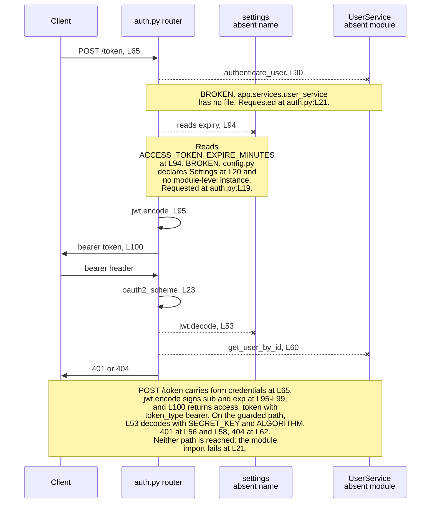
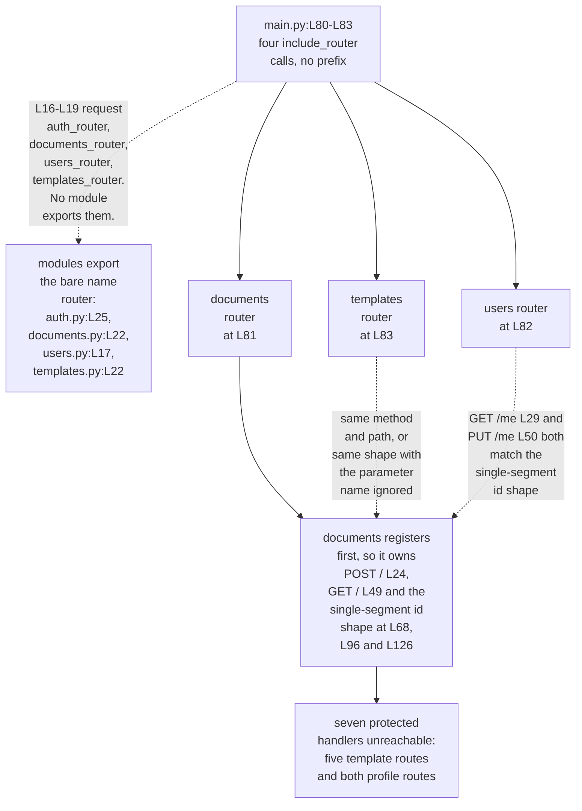

# backend/app/api

## Purpose

The directory holds the HyperText Transfer Protocol (HTTP) Application Programming Interface (API) of the backend. Four
modules each build one FastAPI `APIRouter` and register the fourteen handlers that answer requests. `auth.py` issues tokens,
`documents.py` covers documents, `users.py` covers the current profile, and `templates.py` covers templates. The handler
families behave differently, so the tables below give per-handler detail rather than one universal rule. None of the fourteen
answers a request as committed, and the Reachability column names each reason.

## Key Components

| Component | Type | Location | Description |
| --- | --- | --- | --- |
| `router` | `APIRouter` instance | `auth.py:L25` | Carries the two public authentication routes. `main.py:L16` imports the name `auth_router` from this module. |
| `router` | `APIRouter` instance | `documents.py:L22` | Carries five document routes. `main.py:L17` imports the name `documents_router`. |
| `router` | `APIRouter` instance | `users.py:L17` | Carries two profile routes. `main.py:L18` imports the name `users_router`. |
| `router` | `APIRouter` instance | `templates.py:L22` | Carries five template routes. `main.py:L19` imports the name `templates_router`. |
| `get_current_user` | Async dependency | `auth.py:L27` | Decodes the bearer token at L53 and loads the user at L60. Guards all twelve protected handlers. A second function of the same name sits at `core/security.py:L119`. |
| `oauth2_scheme` | `OAuth2PasswordBearer` | `auth.py:L23` | Extracts the bearer token. Constructed with `tokenUrl='token'`, matching the `POST /token` path at `auth.py:L65`. |
| `pwd_context` | `CryptContext` | `auth.py:L24` | Configured with `schemes=['bcrypt']`. Hashes a registration password at `auth.py:L139`. |
| Per-handler service objects | `DocumentService`, `TemplateService`, `UserService` | `documents.py:L45`, `templates.py:L38`, `users.py:L57` | Eleven of the fourteen handlers construct their own service instance. `auth.py` calls `UserService` methods on the class instead, at L60, L90, L127 and L132, and `get_current_user_info` at `users.py:L20` calls no service at all. |

The four routers publish fourteen handlers. Twelve declare `current_user: User = Depends(get_current_user)` and two declare
none, so the split measures 14 handlers, 12 protected, 2 public. No handler supplies `status_code=` on its decorator,
verified across all fourteen, so every success returns HTTP 200 by FastAPI default. The three assertions expecting 201 at
`../../tests/test_api.py:L37`, `:L53` and `:L64` do not describe committed behaviour.

| Method | Path | Declaring file and handler | Authentication | Success status | Reachability |
| --- | --- | --- | --- | --- | --- |
| POST | `/token` | `auth.py:L65`, `login_for_access_token` at L66 | Public | 200 | No. `auth.py:L19` fails on import first. |
| POST | `/register` | `auth.py:L102`, `register_user` at L103 | Public | 200 | No. Same import failure at `auth.py:L19`. |
| POST | `/` | `documents.py:L24`, `create_document` at L25 | `Depends(get_current_user)` | 200 | No. `documents.py:L19` fails through `auth.py:L19`. |
| GET | `/` | `documents.py:L49`, `get_documents` at L50 | `Depends(get_current_user)` | 200 | No. Same transitive failure at `documents.py:L19`. |
| GET | `/{document_id}` | `documents.py:L68`, `get_document` at L69 | `Depends(get_current_user)` | 200 | No. Same transitive failure at `documents.py:L19`. |
| PUT | `/{document_id}` | `documents.py:L96`, `update_document` at L97 | `Depends(get_current_user)` | 200 | No. Same transitive failure at `documents.py:L19`. |
| DELETE | `/{document_id}` | `documents.py:L126`, `delete_document` at L127 | `Depends(get_current_user)` | 200 | No. Same transitive failure at `documents.py:L19`. |
| GET | `/me` | `users.py:L19`, `get_current_user_info` at L20 | `Depends(get_current_user)` | 200 | No. `users.py:L14` requests an absent module, and `documents.py:L68` already holds this shape. |
| PUT | `/me` | `users.py:L32`, `update_user` at L33 | `Depends(get_current_user)` | 200 | No. Same import failure at `users.py:L14`, and `documents.py:L96` already holds this shape. |
| POST | `/` | `templates.py:L24`, `create_template` at L25 | `Depends(get_current_user)` | 200 | No. `templates.py:L17` requests an absent module, and `documents.py:L24` already holds this shape. |
| GET | `/` | `templates.py:L42`, `get_templates` at L43 | `Depends(get_current_user)` | 200 | No. Same failure at `templates.py:L17`, and `documents.py:L49` already holds this shape. |
| GET | `/{template_id}` | `templates.py:L59`, `get_template` at L60 | `Depends(get_current_user)` | 200 | No. Same failure at `templates.py:L17`, and `documents.py:L68` already holds this shape. |
| PUT | `/{template_id}` | `templates.py:L86`, `update_template` at L87 | `Depends(get_current_user)` | 200 | No. Same failure at `templates.py:L17`, and `documents.py:L96` already holds this shape. |
| DELETE | `/{template_id}` | `templates.py:L112`, `delete_template` at L113 | `Depends(get_current_user)` | 200 | No. Same failure at `templates.py:L17`, and `documents.py:L126` already holds this shape. |

One failure precedes every entry in that column. `main.py:L16-L19` requests `auth_router`, `documents_router`, `users_router`
and `templates_router`, while all four modules export the bare name `router` at `auth.py:L25`, `documents.py:L22`,
`users.py:L17` and `templates.py:L22`. The composition root binds no router at all.

Two of the fourteen return a collection, and neither offers a way to bound it. `GET /` at `documents.py:L49` declares `->
List[Document]` and `GET /` at `templates.py:L42` declares `-> List[Template]`, and both take `current_user` alone.
Page-size, offset, cursor, sort and field-projection parameters number zero across the directory, and no handler declares a
`Query(` parameter. Nothing bounds a result set further down either, since `backend/app/` holds no `.limit(`, `offset`,
`start_after` or cursor call.

What a list response would actually contain cannot be stated from this repository. Neither list handler has a service method
behind it: `documents.py:L65` calls `get_documents`, which `DocumentService` does not define, and `templates.py` delegates to
a `TemplateService` that no file declares. The API surface offers no bound on a result set, and the query behaviour behind it
is unknown until those methods exist.

## Architecture Fit

The committed code places this directory at the entry tier, and `documentation/Technical Specifications.md, SYSTEM DESIGN >
API DESIGN (L402)` places the same responsibility there. Handlers accept a validated model, delegate to a service class, and
return the service result. Repository-wide layering sits in
[../../../docs/architecture-overview.md](../../../docs/architecture-overview.md).

The specification and the committed code diverge on the route surface. That file diagrams every path behind a prefix at
`Technical Specifications.md:L406-L433`, grouping routes under `/auth`, `/documents`, `/users` and `/templates`. The
committed code mounts all four routers with no prefix at `main.py:L80-L83`, so every path lands at the application root. The
prefix absence is what puts the document and template paths on the same addresses.

Four routes the specification declares have no committed handler: `POST /logout` at `Technical Specifications.md:L414`, `POST
/refresh` at `:L415`, `POST /documents/{id}/share` at `:L422` and `GET /users/{id}/documents` at `:L426`. One committed route
runs the other way. `POST /register` at `auth.py:L102` has no counterpart anywhere in that diagram.

The specification's own handler example sits at `Technical Specifications.md:L437-L445` and differs from the committed
handlers in two measurable ways. `:L438` declares `response_model=Document`, and no handler in this directory passes
`response_model=`. `:L443` passes `current_user.id` to the service, while `documents.py:L46` passes the whole `current_user`
object. Both statements describe the committed code against the declared intent, and neither treats the specification as a
record of behaviour.

## Dependencies

Four internal imports name modules or symbols that do not exist, and the routers stop at the first one. Contract shapes sit
in [../../../docs/data-model.md](../../../docs/data-model.md), and the external services the service tier reaches sit in
[../../../docs/integration-guide.md](../../../docs/integration-guide.md). The package-wide import census and the `app`
package boundary belong to [../README.md](../README.md).

### Internal

| Imported name | Import site | Resolves | Evidence |
| --- | --- | --- | --- |
| `settings` from `app.core.config` | `auth.py:L19` | No | `core/config.py` declares the `Settings` class at L20 and a `get_settings` factory at L61, and never creates a module-level instance. |
| `UserService` from `app.services.user_service` | `auth.py:L21`, `users.py:L14` | No | No file exists at `backend/app/services/user_service.py`. |
| `Template`, `TemplateCreate`, `TemplateUpdate` from `app.schema.template` | `templates.py:L17` | No | No file exists at `backend/app/schema/template.py`. |
| `TemplateService` from `app.services.template_service` | `templates.py:L18` | No | No file exists at `backend/app/services/template_service.py`. |
| `User`, `UserCreate`, `UserUpdate` from `app.schema.user` | `auth.py:L20`, `documents.py:L20`, `templates.py:L20`, `users.py:L13` | Yes | `schema/user.py` declares `UserCreate` at L30 and the `User` read model at L56. |
| `Document`, `DocumentCreate`, `DocumentUpdate` from `app.schema.document` | `documents.py:L17` | Yes | `schema/document.py` declares `DocumentBase` at L16 and `Document` at L51. |
| `DocumentService` from `app.services.document_service` | `documents.py:L18` | Yes | `services/document_service.py` declares the class and four async methods. The module then fails at its own L17, which imports the absent `settings`. |
| `get_current_user` from `app.api.auth` | `documents.py:L19`, `templates.py:L19`, `users.py:L15` | Yes as a name | `auth.py:L27` defines the function. The import still fails, because loading `app.api.auth` runs its L19 first. |

### External

No Python dependency manifest is committed anywhere in the repository, so each entry below carries an inferred floor and the
code fact that establishes the floor. The full inventory sits in [../README.md](../README.md), which defines the categories
and counts this documentation set uses and is the repository's single authoritative Python dependency record.

| Distribution | Floor | Establishing code fact |
| --- | --- | --- |
| fastapi | 0.89.0 or newer | Response models come from return annotations such as `-> Document` at `documents.py:L69`. No handler passes `response_model=`, which earlier versions required for a documented response body. |
| python-multipart | Unestablished | `OAuth2PasswordRequestForm`, imported at `auth.py:L15` and used at `auth.py:L66`, parses a form body. FastAPI does not install the parser by default. |
| python-jose | Unestablished | `from jose import JWTError, jwt` at `auth.py:L16`, with `jwt.decode` at L53, `jwt.encode` at L95 and `except JWTError` at L57. |
| passlib with a bcrypt backend | Unestablished | `from passlib.context import CryptContext` at `auth.py:L17`, constructed with `schemes=['bcrypt']` at L24 and called at L131. |
| pydantic | 1.x only | The request and response models come from `schema/user.py` and `schema/document.py`, and `schema/user.py:L81` sets `orm_mode = True`, which version 1 defines. |

Two standard-library imports complete the set. `auth.py:L18` imports `datetime` and `timedelta`, used at L94 and L96.
`documents.py:L16` and `templates.py:L16` import `typing.List` for the return annotations at `documents.py:L50` and
`templates.py:L43`.

## Configuration

The directory reads three settings, all through the `settings` name that `auth.py:L19` imports and that `core/config.py`
never creates, so every read raises before the value matters. `../README.md` classifies all fifteen settings the package
touches.

| Entry | Status | Declared at | Read at |
| --- | --- | --- | --- |
| `settings.SECRET_KEY` | DECLARED | `core/config.py:L42` | `auth.py:L53` verifies the token signature, `auth.py:L97` signs a new token. |
| `settings.ALGORITHM` | DECLARED | `core/config.py:L44` | `auth.py:L53` limits accepted algorithms to a single-item list, `auth.py:L98` selects the signing algorithm. |
| `settings.ACCESS_TOKEN_EXPIRE_MINUTES` | DECLARED | `core/config.py:L43` | `auth.py:L94` builds the token lifetime. |
| `oauth2_scheme` `tokenUrl` | Module constant, not a setting | `auth.py:L23` | Fixed as `'token'`. The value matches the committed `POST /token` at `auth.py:L65`, so the interactive documentation points at a real path. |

All three settings are declared with bare type annotations and no defaults, so the model requires each one at instantiation.
No `.env` file is committed for them to load from.

## Data Flows

Two flows describe everything this directory does. The first mints a token. A client posts form credentials to `POST /token`,
`auth.py:L90` checks them, `auth.py:L95-L99` signs a JSON Web Token (JWT) carrying `sub` and `exp`, and `auth.py:L100`
returns it with the literal type `bearer`. The second flow guards a request: `oauth2_scheme` at `auth.py:L23` lifts the
bearer token from the header, `auth.py:L53` decodes it, and `auth.py:L60` loads the user the handler receives as
`current_user`.

Both flows cross two boundaries that carry no implementation. The signing and decoding steps read `settings`, which
`auth.py:L19` imports and `core/config.py` never defines. The credential check and the user lookup call `UserService`, which
`auth.py:L21` imports from a module with no file.



Dispatch never begins, and two separate faults stop it. `main.py:L16-L19` requests four `*_router` names that no module
exports, so the composition root binds nothing. Past that name mismatch, the mounted paths overlap: `main.py:L80-L83` passes
no `prefix=` on any of its four `include_router` calls, verified across all four.

The overlap takes three forms. Static paths collide directly. `POST /` at `documents.py:L24` and `POST /` at
`templates.py:L24` are the same method on the same path, and `GET /` at `documents.py:L49` and `templates.py:L42` repeat
the pair. Dynamic paths collide positionally, because Starlette matches a path template by shape rather than by parameter name.
`/{document_id}` and `/{template_id}` both compile to one single-segment template, so the differing parameter name changes
nothing about matching.

A literal path collides with a dynamic one for the same reason: `GET /me` at `users.py:L19` and `PUT /me` at `:L32` are
single-segment paths. The earlier `GET /{document_id}` at `documents.py:L68` and `PUT /{document_id}` at `:L96` match them
with `document_id` bound to the string `me`. Registration order resolves every collision in favour of the documents router.
Five template handlers and both profile handlers are therefore unreachable through the assembled application, seven of the
twelve protected handlers in total.



## Design Patterns

Each module owns one resource, so the directory applies router-per-resource. Four `APIRouter` instances exist, at
`auth.py:L25`, `documents.py:L22`, `users.py:L17` and `templates.py:L22`.

Authentication arrives by dependency injection. Twelve handlers declare `current_user: User = Depends(get_current_user)`, so
FastAPI resolves the token before the handler body runs. All twelve resolve the local function at `auth.py:L27`, imported at
`documents.py:L19`, `templates.py:L19` and `users.py:L15`.

Declaring the token dependency is not enforcing object authorization. Twelve handlers declare it, and three attempt an object check:
`documents.py:L92`, `:L121` and `:L147` compare `document.user_id` against `current_user.id`, raising 403 at `:L93`, `:L122` and `:L148`.
Of the other nine, two are self-scoped (`users.py` GET and PUT `/me`), one is create, which fails before it persists, and six leave
scope unestablished. The service repeats the comparison at `services/document_service.py:L108`, `:L148` and `:L184`, reconciled by nothing.

Eleven handlers construct a service per request, and three do not. Every document handler builds a fresh `DocumentService()`
in its own body at `documents.py:L45`, `:L64`, `:L90`, `:L119` and `:L145`. The template handlers repeat the pattern at
`templates.py:L38`, `:L55`, `:L80`, `:L106` and `:L130`, and `update_user` builds a `UserService()` at `users.py:L57`. The
two `auth.py` handlers call `UserService` on the class at L60, L90, L127 and L132, and `users.py:L20` calls none.

Validation happens at the boundary where a body exists. Six handlers name a Pydantic model, so `documents.py:L25` accepts a
`DocumentCreate` and `users.py:L33` accepts a `UserUpdate`, and FastAPI rejects a malformed body first. `auth.py:L66` takes
an `OAuth2PasswordRequestForm` instead, and the seven GET and DELETE handlers declare no body at all. Return annotations
carry the response contract, as at `documents.py:L69` with `-> Document` and `documents.py:L50` with `-> List[Document]`.

## Known Limitations

Every item below states the committed condition and cites it. None of the four modules imports, so none of the fourteen
handlers registers. Repository-wide defect evidence sits in
[../../../docs/troubleshooting.md](../../../docs/troubleshooting.md).

### Security controls absent from this directory

Nine controls are absent from every handler here. Each is an absent control rather than a misconfiguration, none produces an
error message, and each becomes live the moment the import failure is repaired.

| # | Absent control | Evidence |
| --- | --- | --- |
| 1 | Rate limiting or throttling on any route, including the two public ones | `main.py:L71` adds one middleware and it is CORS. No limiter, dependency or proxy configuration is committed. The public routes are `auth.py:L65` (`POST /token`) and `:L102` (`POST /register`) |
| 2 | A request body size limit | No handler, middleware or server flag bounds a body. `schema/document.py:L27` declares `content` as a bare `str` |
| 3 | Field length or format bounds on any model field | Neither `schema/document.py` nor `schema/user.py` contains a single `Field(` call, so no `max_length`, `min_length` or pattern applies. `schema/user.py:L26` declares `email: str` rather than an email type |
| 4 | A server-side password policy on registration | `schema/user.py:L38` declares `password: str` with no constraint and `auth.py:L139` hashes whatever arrives. The only policy in the repository is client-side, at `frontend/src/utils/validation.ts:L36-L42`, and a client-side check is not a control |
| 5 | Responses that do not distinguish known accounts | Registration answers a known address with 400 `Email already registered` at `auth.py:L136-L137`. Login is correctly uniform, answering 401 `Incorrect username or password` at `:L91-L92`, so registration is the enumeration oracle |
| 6 | Any check on `is_active` before a token is honoured | `schema/user.py:L71` declares the field and no code path reads it. `auth.py:L60` loads the user and `:L63` returns it immediately, so a deactivated account keeps full access for the life of its token |
| 7 | A `WWW-Authenticate: Bearer` header on an explicitly raised 401 | Three 401 sites in this directory set no `headers`: `auth.py:L55-L56`, `:L58` and `:L91-L92`. The duplicate dependency at `core/security.py:L155`, `:L157` and `:L162` behaves the same way. The scheme itself does send the challenge. `OAuth2PasswordBearer` at `auth.py:L23` keeps the default `auto_error`. A request with no `Authorization` header, or one that is not bearer, therefore receives 401 `Not authenticated` with the header attached and never reaches a handler |
| 8 | Any constraint on the JWT secret, algorithm, lifetime or claim set | `core/config.py:L42`, `:L44` and `:L43` declare `SECRET_KEY`, `ALGORITHM` and `ACCESS_TOKEN_EXPIRE_MINUTES` as bare types with no validator or allowed-value list. `auth.py:L95-L99` encodes exactly `sub` and `exp`, so no issuer, audience or token identifier exists and no issued token can be revoked before `exp` |
| 9 | Object-level authorization on any template route | `templates.py:L81`, `:L107` and `:L131` delegate to a `TemplateService` that no file defines. The 404 detail at `:L83` reads `Template not found`, while `:L109` and `:L133` read `Template not found or user not authorized`, so two of the three messages promise a check no committed code performs |

[../core/README.md](../core/README.md) carries the full token security contract, and
[../../../docs/troubleshooting.md](../../../docs/troubleshooting.md) covers the same ground in repository-wide order,
alongside the frontend and infrastructure gaps. Its backend register runs to twelve numbered entries rather than nine. The
register splits this directory's entries 8 and 9, then adds a declared-CORS-origin entry and a handler-count entry that
belong to the package rather than to these four routers.

`auth.py` limitations:

- **The module cannot import.** `auth.py:L19` requests the `settings` name from `app.core.config`, which declares only the
`Settings` class at `core/config.py:L20` and the `get_settings` factory at L61. L19 raises first. `auth.py:L21` requests
`app.services.user_service`, a module with no file, and would raise next.
- **A second `get_current_user` exists.** `auth.py:L27` defines one and `core/security.py:L119` defines another.
`documents.py:L19`, `templates.py:L19` and `users.py:L15` import the local one, so the `auth.py` contract governs all twelve
protected routes.
- **The two definitions disagree on status and on wording.** `auth.py:L62` raises 404 for a missing user and
`core/security.py:L162` raises 401 for the same condition, both with the detail `User not found`. The invalid-token branches
also differ: `auth.py:L56` and `:L58` read `Invalid authentication credentials`, while `core/security.py:L155` and `:L157`
read `Could not validate credentials`. `core/security.py` uses the `status.HTTP_401_UNAUTHORIZED` constant and `auth.py` uses
bare integers.
- **Four calls treat `UserService` as a class rather than an instance**, at `auth.py:L60`, `:L90`, `:L135` and `:L140`,
calling methods directly on the imported name. The module holding that class does not exist, so its declared signatures
cannot be read. **The token is also signed inline**: `auth.py:L95-L99` calls `jwt.encode` in the handler body and duplicates
`create_access_token` at `core/security.py:L25`, which no module in this directory imports.
- **The read model declares no field for the password hash, and that does not exclude exposure.** `auth.py:L139` computes the
hash and `:L140` passes it to the absent `UserService.create_user`. `UserCreate` does declare `password`, at
`schema/user.py:L38`, and the `User` read model at `schema/user.py:L56` declares `id`, `created_at`, `updated_at`,
`is_active` and `is_superuser` at L68-L72 and no field able to hold a hash. A model without a field is not a filter on this
route.

- The register handler at `auth.py:L103` declares no return annotation, and its decorator at `:L102` sets no
`response_model`. FastAPI applies no output contract, so whatever the absent service returns passes through unchanged. **Hash
exposure on the registration route cannot be ruled out**, and stays unknown until both the service and a response contract
exist. Separately, **two validated fields are dropped**: `:L140` passes only `user.email` and `hashed_password`, so the
`username` and `full_name` that `UserCreate` validates at `schema/user.py:L27-L28` are lost.

`documents.py` limitations:

- **A `User` object is passed where a string is declared.** `documents.py:L46` hands the whole `current_user` to
`create_document`, whose second parameter is declared `user_id: str` at `services/document_service.py:L42`.
- **One called method does not exist.** `documents.py:L65` calls `DocumentService.get_documents`, while that class declares
`create_document` at `services/document_service.py:L42`, `get_document` at L78, `update_document` at L116 and
`delete_document` at L159 and nothing else.
- **Five call sites pass too few arguments.** `documents.py:L91`, `:L120` and `:L146` call `get_document(document_id)` with
one argument, while `services/document_service.py:L78` declares two parameters after `self`. `documents.py:L123` passes two
arguments to `update_document`, which declares three after `self` at `services/document_service.py:L116`. `documents.py:L149`
passes one argument to `delete_document`, which declares two at `services/document_service.py:L159`.
- **The ownership check reads a field the contract does not declare.** `documents.py:L92`, `:L121` and `:L147` read
`document.user_id`, while `schema/document.py:L28` declares `owner_id: Optional[str] = None` on `DocumentBase`, which
`Document` inherits at `schema/document.py:L51`. The name `user_id` appears at `schema/document.py:L84`, on `DocumentVersion`
only. `owner_id` carries a default, so a `Document` validates without the field the authorization check compares.

- Field naming across the two languages sits in [../../../docs/data-model.md](../../../docs/data-model.md). The [decision
log](../../../docs/decision-log.md) records why this documentation names no canonical field, as decision row 7.

`templates.py` limitations:

- **Both first-party imports name absent modules.** `templates.py:L17` requests `Template`, `TemplateCreate` and
`TemplateUpdate` from `app.schema.template`, and `templates.py:L18` requests `TemplateService` from
`app.services.template_service`. Neither file exists. Import fails before the decorators at L24, L42, L59, L86 and L112
execute, so the five handlers never register.
- **All five template routes are shadowed as well.** Registration order at `main.py:L81` and `main.py:L83` gives every
colliding path to the documents router, as the Data Flows section sets out.
- **Object authorization is unimplemented and unverifiable here.** Every template handler carries
`Depends(get_current_user)`, so a caller is authenticated, and no handler compares the template against that caller. The
absent `TemplateService` means no committed file could supply the check.

`users.py` limitations:

- **Both handlers are synchronous.** `users.py:L20` and `users.py:L33` declare `def`, the only two of the fourteen handlers
that are not `async def`.
- **The call at `users.py:L58` is not awaited, and nothing establishes what it returns.** `user_service.update_user` belongs
to a class that does not exist, so nothing fixes whether it is `async def` or a plain `def`. An `async def` implementation
would bind a coroutine to `updated_user`, and a coroutine is always truthy. The guard at `users.py:L59` would therefore never
take its 400 branch at `:L60`, and `:L61` would return a coroutine where the signature declares `User`. A synchronous
implementation would work as written.
- **The service module is absent.** `users.py:L14` requests `app.services.user_service`, and no file exists at that path.
- **Both profile routes are shadowed.** `documents.py:L68` and `:L96` register the same single-segment shape earlier at
`main.py:L81`, so neither `/me` route ever runs.
- **The directory's only assistance marker sits here.** `users.py:L54` carries `# HUMAN ASSISTANCE NEEDED`, with companion
lines at `:L55` and `:L56` recording that the `UserService.update_user` contract is unverified. No `TODO` marker exists
anywhere in this directory.

Twelve explicit `raise HTTPException` statements exist across the four modules, and no others:

| Status | Sites | Condition |
| --- | --- | --- |
| 400 | `auth.py:L137`, `users.py:L60` | Email already registered; user update returned falsy. |
| 401 | `auth.py:L56`, `:L58`, `:L92` | Token missing a `sub` claim; token failed to decode; credentials rejected. |
| 403 | `documents.py:L93`, `:L122`, `:L148` | The ownership comparison failed on read, update and delete. |
| 404 | `auth.py:L62`, `templates.py:L83`, `:L109`, `:L133` | User not found; template not found on read, update and delete. |

The committed test module diverges from every path above. [../../tests/README.md](../../tests/README.md) carries that
divergence in full: seven asserted paths that no router registers, and 201 assertions against handlers whose decorators set
no `status_code`.

## Usage Examples

No route below answers a request. Importing any of the four modules stops at `auth.py:L19`, so no router binds. The two
schema constructions at the end of this section do run, because both schema modules import cleanly, and the route table above
carries every declared path.

Reproduce the blocking failure from the `backend` directory:

```bash
cd backend
python -c "import app.api.auth"
```

Once the third-party distributions resolve, the command prints the failure that stops every route here. A machine without
them stops earlier, at `auth.py:L14`.

```text
File "app/api/auth.py", line 81, in <module>
    from app.core.config import settings
ImportError: cannot import name 'settings' from 'app.core.config'
```

The two request contracts come from the declared models. `UserCreate` inherits `email`, `username` and `full_name` from
`UserBase` at `schema/user.py:L26-L28` and adds `password` at L38. `DocumentCreate` at `schema/document.py:L30` inherits
`title`, `content` and `owner_id` from `DocumentBase` at `schema/document.py:L26-L28`. The `POST /token` request carries no
JSON body, because `OAuth2PasswordRequestForm` at `auth.py:L66` reads both fields from a form.

```python
from app.schema.document import DocumentCreate
from app.schema.user import UserCreate

# These schema objects are runnable; only the routes that consume them are blocked.
UserCreate(
    email="user@example.com",
    username="user",
    password="...",             # schema/user.py:L38, hashed at auth.py:L139
)                               # full_name defaults to None at schema/user.py:L28

DocumentCreate(
    title="Quarterly report",
    content="",
)                               # owner_id defaults to None at schema/document.py:L28
```

`owner_id` carries a default, so the body above validates while the ownership comparison at `documents.py:L92` reads
`user_id` instead. Setup steps and prerequisites belong in [../../../docs/onboarding.md](../../../docs/onboarding.md).
