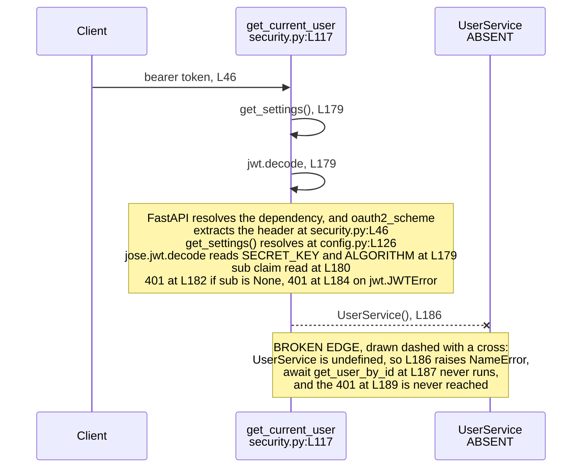

# backend/app/core

## Purpose

`core/` holds two modules: application configuration and the authentication primitives. `config.py` declares a Pydantic
`BaseSettings` model with nine configuration keys at `config.py:L51-L119`, plus a `get_settings()` factory at
`config.py:L126`. `security.py` declares a password-hashing context at `security.py:L45`, a bearer-token scheme at
`security.py:L46`, and four functions covering JSON Web Token (JWT) issuance, password verification, password hashing,
and request-time user resolution. Nothing in the repository imports `app.core.security`. A search for `core.security`
across every committed source and configuration file returns no result, so all four functions in that module have zero
callers. The twelve protected routes take their `get_current_user` dependency from `app.api.auth` instead, at
`api/documents.py:L48`, `api/templates.py:L72` and `api/users.py:L25`. `config.py` is consumed; `security.py` is not.

## Key Components

| Component | Type | Location | Description |
| --- | --- | --- | --- |
| `Settings` | Pydantic `BaseSettings` model | `config.py:L51` | Declares nine configuration keys at `L111-L119`. Seven are strictly required and two default to `None`. |
| `Settings.Config` | Nested Pydantic configuration class | `config.py:L121` | Sets `env_file = ".env"` at `L123` and `env_file_encoding = "utf-8"` at `L124`. The named `.env` file is not committed. |
| `get_settings` | Factory function | `config.py:L126` | Returns a fresh `Settings` instance at `L140`. Performs no caching. |
| `pwd_context` | Module-level `CryptContext` | `security.py:L45` | Configured with `schemes=['bcrypt']` and `deprecated='auto'`. Backs both password functions. |
| `oauth2_scheme` | Module-level `OAuth2PasswordBearer` | `security.py:L46` | Configured with `tokenUrl='token'`, which matches the `POST /token` route at `api/auth.py:L167`. |
| `create_access_token` | Function | `security.py:L48` | Signs a JWT. Reads `ACCESS_TOKEN_EXPIRE_MINUTES` at `L77` and calls `jwt.encode` with `SECRET_KEY` and `ALGORITHM` at `L79`. |
| `verify_password` | Function | `security.py:L82` | Delegates to `pwd_context.verify` at `L96` and returns `bool`. |
| `get_password_hash` | Function | `security.py:L98` | Delegates to `pwd_context.hash` at `L111` and returns `str`. |
| `get_current_user` | Async FastAPI dependency | `security.py:L117` | Decodes the bearer token at `L179` and resolves a user through `UserService` at `L186-L187`. Carries the package's only marker directly above, at `L115-L118`. |

## Architecture Fit

`core/` is the shared foundation layer of the backend. Both the Application Programming Interface (API) routers and the
persistence adapters depend on it, and it depends on nothing inside the application. `config.py` sits at the bottom of
every import chain: eight modules request a `settings` object from it, and `security.py:L43` requests the `get_settings`
factory. Package composition and the wider import graph are documented in [../README.md](../README.md), and the
system-wide view sits in [../../../docs/architecture-overview.md](../../../docs/architecture-overview.md). The
in-repository specification is a comparison point here, not ground truth. The relevant heading is
`SECURITY CONSIDERATIONS > AUTHENTICATION AND AUTHORIZATION`, which opens at
`documentation/Technical Specifications.md:L622`. That section names Google Cloud Identity Platform and Cloud Identity
and Access Management (IAM) at `documentation/Technical Specifications.md:L624`. The same section names Multi-Factor
Authentication (MFA) at `documentation/Technical Specifications.md:L628-L630`, Single Sign-On (SSO) at
`documentation/Technical Specifications.md:L632`, and Role-Based Access Control (RBAC) with the roles Reader, Editor and
Admin at `documentation/Technical Specifications.md:L646-L647`. Its `Implementation` subsection at
`documentation/Technical Specifications.md:L662` carries a sequence diagram at
`documentation/Technical Specifications.md:L664-L680` whose participants are User, Frontend, AuthService,
GoogleCloudIdentity and Backend. The divergence is one of model, not of mechanism. The specification does name JSON Web
Tokens, at `documentation/Technical Specifications.md:L655` under API access control, and the committed code does issue
them. What the code omits is everything the specification wraps around them. `security.py:L45` and `security.py:L98`
hash passwords locally with bcrypt, `security.py:L79` signs tokens locally with `python-jose`, and no module references
an Identity Platform, an MFA challenge or an SSO provider. The committed code therefore implements a local credential
model where the specification describes a federated one. Role handling needs one qualification. Two role-adjacent
artifacts exist outside this package: `schema/user.py:L173` declares an `is_superuser: bool` that no code path reads,
and `tasks/background_tasks.py:L283` names a `document_permissions` Firestore collection. Neither is a role model. The
authorization the backend actually performs is a single owner-equality check in the service tier, under the three
`# Check user permissions` comments at `services/document_service.py:L174`, `:L240` and `:L279`.

## Dependencies

### Internal

| Dependency | Direction | Location | State |
| --- | --- | --- | --- |
| `app.core.config.get_settings` | `security.py` imports from `config.py` | Defined at `config.py:L126`, imported at `security.py:L43` | Resolves. Called at `security.py:L72` and `security.py:L177`. |
| `app.core.config.settings` | Eight modules import from `config.py` | `api/auth.py:L81`, `db/firestore.py:L36`, `db/sql.py:L14`, `main.py:L20`, `services/collaboration_service.py:L39`, `services/document_service.py:L60`, `services/export_service.py:L61`, `tasks/background_tasks.py:L92` | Does not resolve. `config.py` never creates a module-level `settings` instance. |
| `Optional` | Used by `security.py` | `security.py:L48`, inside `Optional[timedelta]` | Undefined. `security.py` imports nothing from `typing`. |
| `User` | Used by `security.py` | `security.py:L117`, the return annotation | Undefined. Declared in `schema/user.py:L114` and never imported here. |
| `UserService` | Used by `security.py` | `security.py:L186` | Undefined. No `app.services.user_service` module exists. |

Seven of the eight modules above dereference the `settings` object; `services/document_service.py:L60` imports it and
never uses it. `config.py` itself has no unresolved import: `pydantic` at `L48` and `typing.Optional` at `L49` both
resolve, and `Optional` is genuinely used at `L116` and `L117`. Contract definitions are documented in
[../../../docs/data-model.md](../../../docs/data-model.md).

### External

Only the four distributions these two modules import are listed. Package-wide version floors across the whole backend
live in [../README.md](../README.md), and the external services the backend reaches sit in
[../../../docs/integration-guide.md](../../../docs/integration-guide.md).

| Distribution | Constraint | Evidence in this package |
| --- | --- | --- |
| `pydantic` | 1.x only | `config.py:L48` imports `BaseSettings` from the main package. Version 2 moved that class to the separate `pydantic-settings` distribution. |
| `python-jose` | Unestablished | `security.py:L39` imports `jwt` from `jose`, `security.py:L79` calls `jwt.encode`, `security.py:L179` calls `jwt.decode`, and `security.py:L183` catches `jwt.JWTError`. |
| `passlib` with a bcrypt backend | Unestablished | `security.py:L40` imports `CryptContext`, and `security.py:L45` configures it with `schemes=['bcrypt']`. |
| `fastapi` | Unestablished | `security.py:L41` imports `Depends`, `HTTPException` and `status`; `security.py:L42` imports `OAuth2PasswordBearer`. |

No manifest and no lock file is committed anywhere in `backend/`, so each row records what the code requires.
"Unestablished" means nothing pins the distribution, not that any release is safe.

## Configuration

Fifteen configuration keys reach the backend through the `Settings` model. Nine are declared at `config.py:L111-L119`.
Six more are read from a `settings` object by other modules and are declared nowhere, so each one raises
`AttributeError` even after the absent singleton is restored. The Status column below classifies all fifteen.

| Key | Status | Declared at | Read at |
| --- | --- | --- | --- |
| `PROJECT_NAME` | DECLARED | `config.py:L111` | No consumer. `main.py:L131` sets `app.title` from the string literal `"Microsoft Word Backend"`. |
| `API_V1_STR` | DECLARED | `config.py:L112` | No consumer anywhere in the repository. The name appears exactly once, at its own declaration. |
| `SECRET_KEY` | DECLARED | `config.py:L113` | `security.py:L79`, `:L179`; `api/auth.py:L155`, `:L237` |
| `ACCESS_TOKEN_EXPIRE_MINUTES` | DECLARED | `config.py:L114` | `security.py:L77`; `api/auth.py:L234` |
| `ALGORITHM` | DECLARED | `config.py:L115` | `security.py:L79`, `:L179`; `api/auth.py:L155`, `:L238` |
| `GOOGLE_CLOUD_PROJECT` | DECLARED | `config.py:L116` | `db/firestore.py:L40`, at import time |
| `GOOGLE_APPLICATION_CREDENTIALS` | DECLARED | `config.py:L117` | Never dereferenced through `settings`. See the note below. |
| `DATABASE_URL` | DECLARED | `config.py:L118` | `db/sql.py:L16`, at import time |
| `REDIS_URL` | DECLARED | `config.py:L119` | `tasks/background_tasks.py:L98`, as the Celery broker argument |
| `ALLOWED_ORIGINS` | READ-BUT-NEVER-DECLARED | Nowhere | `main.py:L118`, as the Cross-Origin Resource Sharing (CORS) allow-list |
| `PROJECT_ID` | READ-BUT-NEVER-DECLARED | Nowhere | `services/collaboration_service.py:L120`, `:L121`, `:L209`, `:L245` |
| `STORAGE_BUCKET_NAME` | READ-BUT-NEVER-DECLARED | Nowhere | `services/export_service.py:L154`, `:L228` |
| `SIGNED_URL_EXPIRATION` | READ-BUT-NEVER-DECLARED | Nowhere | `services/export_service.py:L162`, `:L236` |
| `EXPORT_BUCKET_NAME` | READ-BUT-NEVER-DECLARED | Nowhere | `tasks/background_tasks.py:L141` |
| `DOCUMENT_BUCKET_NAME` | READ-BUT-NEVER-DECLARED | Nowhere | `tasks/background_tasks.py:L278` |

Four details qualify the table.

**Seven of the nine declared keys are strictly required, not nine.** No field carries an explicit default. Under
Pydantic 1.x, however, an `Optional[X]` field without a default is not required and receives an implicit `None`. That
covers `GOOGLE_CLOUD_PROJECT` at `config.py:L116` and `GOOGLE_APPLICATION_CREDENTIALS` at `config.py:L117`, both
annotated `Optional[str]`. The remaining seven raise `ValidationError` when absent.

**`GOOGLE_APPLICATION_CREDENTIALS` is unread through `settings` yet still load-bearing.** The settings field is never
dereferenced. The like-named operating-system environment variable is read directly by the Google authentication library
through Application Default Credentials (ADC) at `db/firestore.py:L39`, where `credentials, project = default()` runs at
import time. `scripts/deploy.sh:L4` aborts the deploy when that variable is unset. Removing the field would change
nothing; unsetting the environment variable breaks both Firestore and the deploy script.

**No `.env` file is committed.** `config.py:L123` points `env_file` at `.env`, and no such file exists in the
repository, so every required key must arrive from the process environment.

**`SIGNED_URL_EXPIRATION` has no declared type, no default and no bound.** The key
sets the lifetime of a bearer credential. A signed URL needs no authentication:
whoever holds the link downloads the object until the link expires. The key is
absent from `Settings` entirely, so `config.py:L111-L119` constrains nothing about
it. `Settings` declares no `int`, `timedelta` or `datetime` annotation for it. It
declares no `Field` with `le` or `ge`, and no validator, so nothing here caps the
value the process environment supplies. Two consequences follow once the key
arrives. A unit mistake passes silently, because the Google client reads a bare
integer as seconds while a `timedelta` or a `datetime` means something else. An
over-long lifetime passes too. The only ceiling that exists lives in the client
library rather than here. `Blob.generate_signed_url` rejects a version 4 expiry
above seven days, and that is a library limit rather than a project policy.
No signed URL is generated today, so this is a latent gap rather than a live
exposure. Three barriers sit in front of it, in order. `services/export_service.py`
imports the absent `settings` singleton, so the module fails at import.
`export_service.py:L154` then reads the undeclared `STORAGE_BUCKET_NAME`.
`export_service.py:L162` then reads the undeclared `SIGNED_URL_EXPIRATION`. Version 4
signing then needs a credential that can sign, and two routes qualify. A
service-account private key signs locally. A principal holding
`iam.serviceAccounts.signBlob` signs through the Identity and Access Management
(IAM) API instead, which the Google Cloud Storage client uses when the call
supplies `service_account_email` and `access_token`. `export_service.py:L160-L164`
supplies neither, and passes no `credentials`, so signing falls to whatever
Application Default Credentials resolves at `db/firestore.py:L39`. A key-file
credential carries a private key and signs. A metadata-server credential carries
only a token, so local signing raises and the IAM route is unavailable because the
call names no service account. The outcome therefore depends on the credential the
environment supplies, and this repository fixes neither the credential type nor the
signing route. The
[services README](../services/README.md) and the
[integration guide](../../../docs/integration-guide.md) carry the same gap from the
call-site and integration views.

## Data Flows

Two flows pass through this package. Configuration flows outward: a caller invokes `get_settings()` at `config.py:L126`,
and a fresh `Settings` instance returns at `config.py:L140`. Pydantic reads the process environment and the absent
`.env` file named at `config.py:L123`.

Token validation is the longer flow, and it stops before it finishes. FastAPI extracts the bearer token through
`Depends(oauth2_scheme)` at `security.py:L117`, against the scheme declared at `security.py:L46`. `get_settings()` runs
at `security.py:L177`. `jwt.decode` verifies the signature at `security.py:L179` using `SECRET_KEY` and `ALGORITHM`. The
`sub` claim is read at `security.py:L180`.

A missing subject raises 401 at `security.py:L182`, and a `jwt.JWTError` raises 401 at `security.py:L184`.
`UserService()` is then instantiated at `security.py:L186` and `get_user_by_id` is awaited at `security.py:L187`. A
`None` result raises 401 at `security.py:L189`, and the user returns at `security.py:L190`.

The flow reaches `security.py:L186` and stops. `UserService` is undefined, so the lookup raises `NameError` instead of
returning a user.



## Design Patterns

`core/` applies five patterns. Configuration uses a settings object: one Pydantic `BaseSettings` model at
`config.py:L51` gathers every key, so no module reads the environment directly. Access to that model runs through a
factory, `get_settings()` at `config.py:L126`, rather than an exported instance.

Two primitives are module-level singletons constructed at import: `pwd_context` at `security.py:L45` and `oauth2_scheme`
at `security.py:L46`. Authentication arrives by dependency injection, through `Depends(oauth2_scheme)` in the
`get_current_user` signature at `security.py:L117`. Token validation is stateless: `jwt.decode` at `security.py:L179`
verifies a signature and reads a claim, with no session store and no revocation list. One absence shapes runtime
behavior. `get_settings()` performs no caching. The module declares no `functools.lru_cache` decorator and holds no
module-level memo, so every call constructs a new `Settings` instance and re-reads the environment. `security.py` calls
it twice, at `security.py:L72` and `security.py:L177`, which means one construction per token issued and one per request
validated.

## Known Limitations

The largest limitation comes first. Nothing imports `app.core.security`, so every defect below sits in code that no
request path reaches. Repository-wide defect evidence sits in
[../../../docs/troubleshooting.md](../../../docs/troubleshooting.md), and judgement calls made while writing this
documentation are recorded in [../../../docs/decision-log.md](../../../docs/decision-log.md).

### Token security contract

Two `get_current_user` definitions exist and only one is reached. The table below states what the token contract does
**not** constrain, for both the issuing path here and the validating dependency that the twelve protected routes
actually import from `app.api.auth`. Every row is an absent control rather than a misconfiguration.

| Control | State | Evidence |
| --- | --- | --- |
| Secret strength or rotation | Absent | `config.py:L113` declares `SECRET_KEY: str` with no validator, minimum length or rotation hook. `security.py:L79` and `api/auth.py:L235-L239` sign with whatever value loads |
| Algorithm allow-list | Absent | `config.py:L115` declares `ALGORITHM: str` with no allowed-value check. Both `security.py:L79` and the decode at `api/auth.py:L155` pass the value straight through, so configuration alone selects the algorithm |
| Bounded token lifetime | Absent | `config.py:L114` declares `ACCESS_TOKEN_EXPIRE_MINUTES` with no ceiling. `security.py:L74-L77` computes `expire` from it, so an arbitrarily long lifetime is accepted |
| Issuer (`iss`) and audience (`aud`) claims | Absent | `api/auth.py:L235-L239` encodes exactly `sub` and `exp`. The decode at `:L155` reads `sub` only, and `security.py:L179` does the same, so a token cannot be scoped to one service or audience |
| Token identifier (`jti`) and revocation | Absent | No claim identifies a token and no store records issued or withdrawn tokens, so an issued token stays valid until `exp` |
| Inactive-account rejection | Absent in the dependency routes use | `api/auth.py:L162` loads the user and `:L165` returns it with no check, while `app/schema/user.py:L172` declares `is_active`. `security.py:L186-L189` behaves the same way, so a deactivated account keeps access |
| `WWW-Authenticate: Bearer` on an explicitly raised 401 | Absent | Six explicitly raised 401 responses set no `headers`: `api/auth.py:L157-L158`, `:L160`, `:L231-L232`, and `security.py:L182`, `:L184`, `:L189` |
| `WWW-Authenticate: Bearer` on a missing-header 401 | Present, from the framework | `security.py:L46` and `api/auth.py:L85` construct `OAuth2PasswordBearer` without `auto_error=False`, so FastAPI answers a missing or non-bearer `Authorization` header itself, with 401 `Not authenticated` and the challenge attached. Only the raises inside the dependency bodies omit it |
| Reviewed cryptography dependency floor | Absent | No backend manifest or lock file is committed, so nothing pins `python-jose`. Releases through 3.3.0 carry CVE-2024-33663, an algorithm confusion weakness fixed in 3.4.0, and the unconstrained `ALGORITHM` above is exactly the condition that advisory concerns |

A safe floor cannot be asserted from this repository, because no committed file names a version. Establishing one
belongs to the reviewed manifest and lock recorded as future work in
[../../../docs/onboarding.md](../../../docs/onboarding.md).

- **The whole `security.py` module is unconsumed.** A search for `core.security` across every tracked file returns no
  result. `create_access_token` (`security.py:L48`), `verify_password` (`security.py:L82`) and `get_password_hash`
  (`security.py:L98`) appear only at their own definitions and have zero callers. The twelve protected routes import
  `get_current_user` from `app.api.auth` at `api/documents.py:L48`, `api/templates.py:L72` and `api/users.py:L25`.
- **No module-level `settings` instance exists.** `config.py` declares the `Settings` class at `L51` and the
  `get_settings` factory at `L126`, and never creates a `settings` object. Eight modules import one by name, listed
  under Dependencies above. That single absent line is the root cause of the backend's import failure; the full chain is
  documented in [../README.md](../README.md).
- **Three undefined names in `security.py` fail at three different moments.** Python evaluates annotations when the
  `def` statement runs, and no module here uses `from __future__ import annotations`.
  - `Optional` at `security.py:L48`, inside `Optional[timedelta]`, raises `NameError: name 'Optional' is not
    defined` **at module import time**.
  - `User` at `security.py:L117`, the return annotation, is also an import-time failure, but execution never reaches
    it because `L48` raises first.
  - `UserService` at `security.py:L186` sits inside a function body and raises at **first call**, not at import.
- **`except jwt.JWTError` at `security.py:L183` is correct and is not a defect.** The attribute resolves against
  `python-jose`, which exposes `JWTError` on the `jwt` module imported at `security.py:L39`. `api/auth.py:L78`
  imports the same exception by bare name and catches it at `api/auth.py:L159`. Both forms work.
- **The package's only marker is a four-line `HUMAN ASSISTANCE NEEDED` block at `security.py:L115-L118`**, directly
  above `get_current_user`. The block reads: "This function needs to be reviewed and potentially modified to ensure it
  correctly integrates with the User model and UserService. The exact implementation may vary depending on how these are
  set up in your project." `backend/app/core` contains zero `TODO` comments.
- **Token issuance and user resolution each exist twice, and the copy outside this package is the one in use.**
  `create_access_token` at `security.py:L48-L80` is duplicated by the inlined `jwt.encode` call at
  `api/auth.py:L235-L239`. `get_current_user` at `security.py:L117` is duplicated at `api/auth.py:L89`.
- **The two copies of `get_current_user` disagree on status code and on message.** For a user that cannot be found,
  `security.py:L189` raises 401 with detail "User not found" while `api/auth.py:L164` raises 404. On the
  invalid-credentials path, `security.py:L182` and `:L184` use "Could not validate credentials" while `api/auth.py:L158`
  and `:L160` use "Invalid authentication credentials".
- **The absent `UserService` is called two incompatible ways.** `security.py:L186-L187` instantiates the class and
  awaits an instance method, while `api/auth.py:L162`, `:L230`, `:L319` and `:L324` call methods on the class unbound.
  Any future implementation must satisfy one form or the other.
- **Two configuration access paths exist and one works.** `security.py:L43` imports the `get_settings` factory, which
  `config.py:L126` defines. Eight other modules import the `settings` singleton, which `config.py` does not define.
- **Three declared keys have no consumer.** `PROJECT_NAME` at `config.py:L111` is unread because `main.py:L131` uses a
  string literal. `API_V1_STR` at `config.py:L112` appears once, at its own declaration.
  `GOOGLE_APPLICATION_CREDENTIALS` at `config.py:L117` is never dereferenced through `settings`, though the like-named
  environment variable is read by ADC at `db/firestore.py:L39` and guarded at `scripts/deploy.sh:L4`.
- **401 is the only status code in this package**, raised at `security.py:L182`, `:L184` and `:L189`. No 403, 404 or 400
  appears in either module, so ownership checks and duplicate-registration handling live elsewhere.

Deployment consequences of the absent `.env` file and the unset credential variable are documented in
[../../../docs/deployment-guide.md](../../../docs/deployment-guide.md).

## Usage Examples

Both examples below fail at the import statement. Importing `app.core.security` raises
`NameError: name 'Optional' is not defined` at `security.py:L48`, before any function in the module becomes callable.
Each example shows the declared contract, taken from the signature at its cited line.

`create_access_token` at `security.py:L48` takes a payload dictionary and an optional lifetime, and returns the encoded
token as `str`.

```python
from datetime import timedelta

from app.core.security import create_access_token

# Default lifetime, taken from settings.ACCESS_TOKEN_EXPIRE_MINUTES at security.py:L77
token = create_access_token({"sub": "user-123"})

# Explicit lifetime, which skips the settings read at security.py:L77
short_lived = create_access_token({"sub": "user-123"}, timedelta(minutes=5))
```

The call above cannot execute: the import raises `NameError` at `security.py:L48`. Both forms also require `SECRET_KEY`
and `ALGORITHM` in the environment, because `jwt.encode` at `security.py:L79` reads them from a freshly constructed
`Settings`.

`get_current_user` at `security.py:L117` is a FastAPI dependency, not a function to call directly. Its only parameter is
the bearer token, supplied by `Depends(oauth2_scheme)`, so a route declares it as a dependency instead.

```python
from fastapi import APIRouter, Depends

from app.core.security import get_current_user

router = APIRouter()


@router.get("/profile")
async def read_profile(current_user=Depends(get_current_user)):
    return current_user
```

The route above cannot execute either: the import raises `NameError` at `security.py:L48`, and reaching
`security.py:L186` would raise a second `NameError` for the undefined `UserService`. No route in this repository depends
on this function, so the example shows intended use with no in-repository call site. The twelve routes that do guard
access use the copy at `api/auth.py:L89`.

`get_settings()` at `config.py:L126` is the one construct in this package that runs today. The import
`from app.core.config import get_settings` resolves, and the call returns a `Settings` instance whenever the seven
required keys are in the environment. `verify_password` at `security.py:L82` and `get_password_hash` at
`security.py:L98` are single-line wrappers over `pwd_context` and carry no example here. For environment setup and a
first run, see [../../../docs/onboarding.md](../../../docs/onboarding.md).
