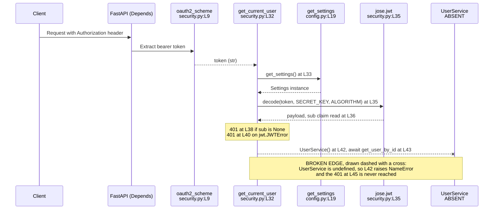

# backend/app/core

## Purpose

`core/` holds two modules: application configuration and the authentication
primitives. `config.py` declares a Pydantic `BaseSettings` model with nine
configuration keys at `config.py:L4-L13`, plus a `get_settings()` factory at
`config.py:L19`. `security.py` declares a password-hashing context at
`security.py:L8`, a bearer-token scheme at `security.py:L9`, and four functions
covering JSON Web Token (JWT) issuance, password verification, password hashing,
and request-time user resolution.

Nothing in the repository imports `app.core.security`. A search for
`core.security` across every tracked file returns no result, so all four
functions in that module have zero callers. The twelve protected routes take
their `get_current_user` dependency from `app.api.auth` instead, at
`api/documents.py:L5`, `api/templates.py:L5` and `api/users.py:L4`. `config.py`
is consumed; `security.py` is not.

## Key Components

| Component | Type | Location | Description |
| --- | --- | --- | --- |
| `Settings` | Pydantic `BaseSettings` model | `config.py:L4` | Declares nine configuration keys at `L5-L13`. Seven are strictly required and two default to `None`. |
| `Settings.Config` | Nested Pydantic configuration class | `config.py:L15` | Sets `env_file = ".env"` at `L16` and `env_file_encoding = "utf-8"` at `L17`. The named `.env` file is not committed. |
| `get_settings` | Factory function | `config.py:L19` | Returns a fresh `Settings` instance at `L20`. Performs no caching. |
| `pwd_context` | Module-level `CryptContext` | `security.py:L8` | Configured with `schemes=['bcrypt']` and `deprecated='auto'`. Backs both password functions. |
| `oauth2_scheme` | Module-level `OAuth2PasswordBearer` | `security.py:L9` | Configured with `tokenUrl='token'`, which matches the `POST /token` route at `api/auth.py:L28`. |
| `create_access_token` | Function | `security.py:L11` | Signs a JWT. Reads `ACCESS_TOKEN_EXPIRE_MINUTES` at `L17` and calls `jwt.encode` with `SECRET_KEY` and `ALGORITHM` at `L19`. |
| `verify_password` | Function | `security.py:L22` | Delegates to `pwd_context.verify` at `L23` and returns `bool`. |
| `get_password_hash` | Function | `security.py:L25` | Delegates to `pwd_context.hash` at `L26` and returns `str`. |
| `get_current_user` | Async FastAPI dependency | `security.py:L32` | Decodes the bearer token at `L35` and resolves a user through `UserService` at `L42-L43`. Carries the package's only marker directly above, at `L28-L31`. |

## Architecture Fit

`core/` is the shared foundation layer of the backend. Both the Application
Programming Interface (API) routers and the persistence adapters depend on it,
and it depends on nothing inside the application. `config.py` sits at the bottom
of every import chain: eight modules request a `settings` object from it, and
`security.py:L6` requests the `get_settings` factory. Package composition and the
wider import graph are documented in [../README.md](../README.md), and the
system-wide view sits in
[../../../docs/architecture-overview.md](../../../docs/architecture-overview.md).

The in-repository specification is a comparison point here, not ground truth. The
relevant heading is `SECURITY CONSIDERATIONS > AUTHENTICATION AND AUTHORIZATION`,
which opens at `documentation/Technical Specifications.md:L622`. That section
names Google Cloud Identity Platform and Cloud Identity and Access Management
(IAM) at `L624`. The same section names Multi-Factor Authentication (MFA) at
`L628-L630`, Single Sign-On (SSO) at `L632`, and Role-Based Access Control (RBAC)
with the roles Reader, Editor and Admin at `L646-L647`. Its `Implementation`
subsection at `L662` carries a sequence diagram at `L664-L680` whose participants
are User, Frontend, AuthService, GoogleCloudIdentity and Backend.

The divergence is one of model, not of mechanism. The specification does name
JSON Web Tokens, at `L655` under API access control, and the committed code does
issue them. What the code omits is everything the specification wraps around
them. `security.py:L8` and `security.py:L25` hash passwords locally with bcrypt,
`security.py:L19` signs tokens locally with `python-jose`, and no module
references an Identity Platform, an MFA challenge or an SSO provider. The
committed code therefore implements a local credential model where the
specification describes a federated one.

Role handling needs one qualification. Two role-adjacent artifacts exist outside
this package: `schema/user.py:L24` declares an `is_superuser: bool` that no code
path reads, and `tasks/background_tasks.py:L59` names a `document_permissions`
Firestore collection. Neither is a role model. The authorization the backend
actually performs is a single owner-equality check in the service tier, under the
three `# Check user permissions` comments at `services/document_service.py:L34`,
`:L51` and `:L71`.

## Dependencies

### Internal

| Dependency | Direction | Location | State |
| --- | --- | --- | --- |
| `app.core.config.get_settings` | `security.py` imports from `config.py` | Defined at `config.py:L19`, imported at `security.py:L6` | Resolves. Called at `security.py:L12` and `security.py:L33`. |
| `app.core.config.settings` | Eight modules import from `config.py` | `api/auth.py:L6`, `db/firestore.py:L3`, `db/sql.py:L3`, `main.py:L7`, `services/collaboration_service.py:L4`, `services/document_service.py:L5`, `services/export_service.py:L3`, `tasks/background_tasks.py:L3` | Does not resolve. `config.py` never creates a module-level `settings` instance. |
| `Optional` | Used by `security.py` | `security.py:L11`, inside `Optional[timedelta]` | Undefined. `security.py` imports nothing from `typing`. |
| `User` | Used by `security.py` | `security.py:L32`, the return annotation | Undefined. Declared in `schema/user.py:L19` and never imported here. |
| `UserService` | Used by `security.py` | `security.py:L42` | Undefined. No `app.services.user_service` module exists. |

Seven of the eight modules above dereference the `settings` object;
`services/document_service.py:L5` imports it and never uses it. `config.py`
itself has no unresolved import: `pydantic` at `L1` and `typing.Optional` at `L2`
both resolve, and `Optional` is genuinely used at `L10` and `L11`. Contract
definitions are documented in
[../../../docs/data-model.md](../../../docs/data-model.md).

### External

Only the four distributions these two modules import are listed. Package-wide
version floors across the whole backend live in [../README.md](../README.md), and
the external services the backend reaches sit in
[../../../docs/integration-guide.md](../../../docs/integration-guide.md).

| Distribution | Constraint | Evidence in this package |
| --- | --- | --- |
| `pydantic` | 1.x only | `config.py:L1` imports `BaseSettings` from the main package. Version 2 moved that class to the separate `pydantic-settings` distribution. |
| `python-jose` | Any | `security.py:L2` imports `jwt` from `jose`, `security.py:L19` calls `jwt.encode`, `security.py:L35` calls `jwt.decode`, and `security.py:L39` catches `jwt.JWTError`. |
| `passlib` with a bcrypt backend | Any | `security.py:L3` imports `CryptContext`, and `security.py:L8` configures it with `schemes=['bcrypt']`. |
| `fastapi` | Any | `security.py:L4` imports `Depends`, `HTTPException` and `status`; `security.py:L5` imports `OAuth2PasswordBearer`. |

No dependency manifest is committed anywhere in `backend/`, so each constraint
above rests on the code evidence beside it.

## Configuration

Fifteen configuration keys reach the backend through the `Settings` model. Nine
are declared at `config.py:L5-L13`. Six more are read from a `settings` object by
other modules and are declared nowhere, so each one raises `AttributeError` even
after the absent singleton is restored. The Status column below classifies all
fifteen.

| Key | Status | Declared at | Read at |
| --- | --- | --- | --- |
| `PROJECT_NAME` | DECLARED | `config.py:L5` | No consumer. `main.py:L55` sets `app.title` from the string literal `"Microsoft Word Backend"`. |
| `API_V1_STR` | DECLARED | `config.py:L6` | No consumer anywhere in the repository. The name appears exactly once, at its own declaration. |
| `SECRET_KEY` | DECLARED | `config.py:L7` | `security.py:L19`, `:L35`; `api/auth.py:L16`, `:L37` |
| `ACCESS_TOKEN_EXPIRE_MINUTES` | DECLARED | `config.py:L8` | `security.py:L17`; `api/auth.py:L34` |
| `ALGORITHM` | DECLARED | `config.py:L9` | `security.py:L19`, `:L35`; `api/auth.py:L16`, `:L38` |
| `GOOGLE_CLOUD_PROJECT` | DECLARED | `config.py:L10` | `db/firestore.py:L7`, at import time |
| `GOOGLE_APPLICATION_CREDENTIALS` | DECLARED | `config.py:L11` | Never dereferenced through `settings`. See the note below. |
| `DATABASE_URL` | DECLARED | `config.py:L12` | `db/sql.py:L5`, at import time |
| `REDIS_URL` | DECLARED | `config.py:L13` | `tasks/background_tasks.py:L9`, as the Celery broker argument |
| `ALLOWED_ORIGINS` | READ-BUT-NEVER-DECLARED | Nowhere | `main.py:L42`, as the Cross-Origin Resource Sharing (CORS) allow-list |
| `PROJECT_ID` | READ-BUT-NEVER-DECLARED | Nowhere | `services/collaboration_service.py:L20`, `:L21`, `:L50`, `:L60` |
| `STORAGE_BUCKET_NAME` | READ-BUT-NEVER-DECLARED | Nowhere | `services/export_service.py:L16`, `:L35` |
| `SIGNED_URL_EXPIRATION` | READ-BUT-NEVER-DECLARED | Nowhere | `services/export_service.py:L24`, `:L43` |
| `EXPORT_BUCKET_NAME` | READ-BUT-NEVER-DECLARED | Nowhere | `tasks/background_tasks.py:L26` |
| `DOCUMENT_BUCKET_NAME` | READ-BUT-NEVER-DECLARED | Nowhere | `tasks/background_tasks.py:L54` |

Three details qualify the table.

**Seven of the nine declared keys are strictly required, not nine.** No field
carries an explicit default. Under Pydantic 1.x, however, an `Optional[X]` field
without a default is not required and receives an implicit `None`. That covers
`GOOGLE_CLOUD_PROJECT` at `config.py:L10` and `GOOGLE_APPLICATION_CREDENTIALS` at
`config.py:L11`, both annotated `Optional[str]`. The remaining seven raise
`ValidationError` when absent.

**`GOOGLE_APPLICATION_CREDENTIALS` is unread through `settings` yet still
load-bearing.** The settings field is never dereferenced. The like-named
operating-system environment variable is read directly by the Google
authentication library through Application Default Credentials (ADC) at
`db/firestore.py:L6`, where `credentials, project = default()` runs at import
time. `scripts/deploy.sh:L4` aborts the deploy when that variable is unset.
Removing the field would change nothing; unsetting the environment variable
breaks both Firestore and the deploy script.

**No `.env` file is committed.** `config.py:L16` points `env_file` at `.env`, and
no such file exists in the repository, so every required key must arrive from the
process environment.

## Data Flows

Two flows pass through this package. Configuration flows outward: a caller
invokes `get_settings()` at `config.py:L19`, and a fresh `Settings` instance
returns at `config.py:L20`. Pydantic reads the process environment and the absent
`.env` file named at `config.py:L16`.

Token validation is the longer flow, and it stops before it finishes. FastAPI
extracts the bearer token through `Depends(oauth2_scheme)` at `security.py:L32`,
against the scheme declared at `security.py:L9`. `get_settings()` runs at
`security.py:L33`. `jwt.decode` verifies the signature at `security.py:L35` using
`SECRET_KEY` and `ALGORITHM`. The `sub` claim is read at `security.py:L36`.

A missing subject raises 401 at `security.py:L38`, and a `jwt.JWTError` raises
401 at `security.py:L40`. `UserService()` is then instantiated at
`security.py:L42` and `get_user_by_id` is awaited at `security.py:L43`. A `None`
result raises 401 at `security.py:L45`, and the user returns at
`security.py:L46`.

The flow reaches `security.py:L42` and stops. `UserService` is undefined, so the
lookup raises `NameError` instead of returning a user.



## Design Patterns

`core/` applies five patterns. Configuration uses a settings object: one Pydantic
`BaseSettings` model at `config.py:L4` gathers every key, so no module reads the
environment directly. Access to that model runs through a factory,
`get_settings()` at `config.py:L19`, rather than an exported instance.

Two primitives are module-level singletons constructed at import: `pwd_context`
at `security.py:L8` and `oauth2_scheme` at `security.py:L9`. Authentication
arrives by dependency injection, through `Depends(oauth2_scheme)` in the
`get_current_user` signature at `security.py:L32`. Token validation is stateless:
`jwt.decode` at `security.py:L35` verifies a signature and reads a claim, with no
session store and no revocation list.

One absence shapes runtime behavior. `get_settings()` performs no caching. The
module declares no `functools.lru_cache` decorator and holds no module-level
memo, so every call constructs a new `Settings` instance and re-reads the
environment. `security.py` calls it twice, at `security.py:L12` and
`security.py:L33`, which means one construction per token issued and one per
request validated.

## Known Limitations

The largest limitation comes first. Nothing imports `app.core.security`, so every
defect below sits in code that no request path reaches. Repository-wide defect
evidence sits in
[../../../docs/troubleshooting.md](../../../docs/troubleshooting.md), and
judgement calls made while writing this documentation are recorded in
[../../../docs/decision-log.md](../../../docs/decision-log.md).

- **The whole `security.py` module is unconsumed.** A search for `core.security`
  across every tracked file returns no result. `create_access_token`
  (`security.py:L11`), `verify_password` (`security.py:L22`) and
  `get_password_hash` (`security.py:L25`) appear only at their own definitions
  and have zero callers. The twelve protected routes import `get_current_user`
  from `app.api.auth` at `api/documents.py:L5`, `api/templates.py:L5` and
  `api/users.py:L4`.
- **No module-level `settings` instance exists.** `config.py` declares the
  `Settings` class at `L4` and the `get_settings` factory at `L19`, and never
  creates a `settings` object. Eight modules import one by name, listed under
  Dependencies above. That single absent line is the root cause of the backend's
  import failure; the full chain is documented in [../README.md](../README.md).
- **Three undefined names in `security.py` fail at three different moments.**
  Python evaluates annotations when the `def` statement runs, and no module here
  uses `from __future__ import annotations`.
  - `Optional` at `security.py:L11`, inside `Optional[timedelta]`, raises
    `NameError: name 'Optional' is not defined` **at module import time**.
  - `User` at `security.py:L32`, the return annotation, is also an import-time
    failure, but execution never reaches it because `L11` raises first.
  - `UserService` at `security.py:L42` sits inside a function body and raises at
    **first call**, not at import.
- **`except jwt.JWTError` at `security.py:L39` is correct and is not a defect.**
  The attribute resolves against `python-jose`, which exposes `JWTError` on the
  `jwt` module imported at `security.py:L2`. `api/auth.py:L3` imports the same
  exception by bare name and catches it at `api/auth.py:L20`. Both forms work.
- **The package's only marker is a four-line `HUMAN ASSISTANCE NEEDED` block at
  `security.py:L28-L31`**, directly above `get_current_user`. The block reads:
  "This function needs to be reviewed and potentially modified to ensure it
  correctly integrates with the User model and UserService. The exact
  implementation may vary depending on how these are set up in your project."
  `backend/app/core` contains zero `TODO` comments.
- **Token issuance and user resolution each exist twice, and the copy outside
  this package is the one in use.** `create_access_token` at
  `security.py:L11-L20` is duplicated by the inlined `jwt.encode` call at
  `api/auth.py:L35-L39`. `get_current_user` at `security.py:L32` is duplicated at
  `api/auth.py:L14`.
- **The two copies of `get_current_user` disagree on status code and on message.**
  For a user that cannot be found, `security.py:L45` raises 401 with detail
  "User not found" while `api/auth.py:L25` raises 404. On the invalid-credentials
  path, `security.py:L38` and `:L40` use "Could not validate credentials" while
  `api/auth.py:L19` and `:L21` use "Invalid authentication credentials".
- **The absent `UserService` is called two incompatible ways.**
  `security.py:L42-L43` instantiates the class and awaits an instance method,
  while `api/auth.py:L23`, `:L30`, `:L44` and `:L49` call methods on the class
  unbound. Any future implementation must satisfy one form or the other.
- **Two configuration access paths exist and one works.** `security.py:L6`
  imports the `get_settings` factory, which `config.py:L19` defines. Eight other
  modules import the `settings` singleton, which `config.py` does not define.
- **Three declared keys have no consumer.** `PROJECT_NAME` at `config.py:L5` is
  unread because `main.py:L55` uses a string literal. `API_V1_STR` at
  `config.py:L6` appears once, at its own declaration. `GOOGLE_APPLICATION_CREDENTIALS`
  at `config.py:L11` is never dereferenced through `settings`, though the
  like-named environment variable is read by ADC at `db/firestore.py:L6` and
  guarded at `scripts/deploy.sh:L4`.
- **401 is the only status code in this package**, raised at `security.py:L38`,
  `:L40` and `:L45`. No 403, 404 or 400 appears in either module, so ownership
  checks and duplicate-registration handling live elsewhere.

Deployment consequences of the absent `.env` file and the unset credential
variable are documented in
[../../../docs/deployment-guide.md](../../../docs/deployment-guide.md).

## Usage Examples

Both examples below fail at the import statement. Importing
`app.core.security` raises `NameError: name 'Optional' is not defined` at
`security.py:L11`, before any function in the module becomes callable. Each
example shows the declared contract, taken from the signature at its cited line.

`create_access_token` at `security.py:L11` takes a payload dictionary and an
optional lifetime, and returns the encoded token as `str`.

```python
from datetime import timedelta

from app.core.security import create_access_token

# Default lifetime, taken from settings.ACCESS_TOKEN_EXPIRE_MINUTES at security.py:L17
token = create_access_token({"sub": "user-123"})

# Explicit lifetime, which skips the settings read at security.py:L17
short_lived = create_access_token({"sub": "user-123"}, timedelta(minutes=5))
```

The call above cannot execute: the import raises `NameError` at
`security.py:L11`. Both forms also require `SECRET_KEY` and `ALGORITHM` in the
environment, because `jwt.encode` at `security.py:L19` reads them from a freshly
constructed `Settings`.

`get_current_user` at `security.py:L32` is a FastAPI dependency, not a function
to call directly. Its only parameter is the bearer token, supplied by
`Depends(oauth2_scheme)`, so a route declares it as a dependency instead.

```python
from fastapi import APIRouter, Depends

from app.core.security import get_current_user

router = APIRouter()


@router.get("/profile")
async def read_profile(current_user=Depends(get_current_user)):
    return current_user
```

The route above cannot execute either: the import raises `NameError` at
`security.py:L11`, and reaching `security.py:L42` would raise a second
`NameError` for the undefined `UserService`. No route in this repository depends
on this function, so the example shows intended use with no in-repository call
site. The twelve routes that do guard access use the copy at `api/auth.py:L14`.

`get_settings()` at `config.py:L19` is the one construct in this package that
runs today. The import `from app.core.config import get_settings` resolves, and
the call returns a `Settings` instance whenever the seven required keys are in the
environment. `verify_password` at `security.py:L22` and `get_password_hash` at
`security.py:L25` are single-line wrappers over `pwd_context` and carry no
example here. For environment setup and a first run, see
[../../../docs/onboarding.md](../../../docs/onboarding.md).
