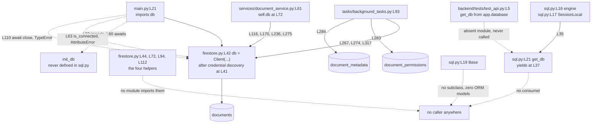

# backend/app/db

Two modules hold the whole persistence layer. `firestore.py` builds a Google Cloud Firestore
client plus four helper functions, and `sql.py` builds a SQLAlchemy engine, a session factory
and a declarative base. Both act at import time. Every `Lnn` locator below numbers the file
at the current branch head, which includes the comment blocks this pass added.

## Purpose

`backend/app/db` holds the two low-level persistence entry points, and no abstraction unifies
them. `firestore.py:L42` constructs one Firestore client, and the four helpers at
`firestore.py:L44`, `L72`, `L94` and `L112` cover create, read, update and delete work against a
collection the caller names. `sql.py:L16` opens a SQLAlchemy engine, `sql.py:L17` binds a session
factory, and `sql.py:L19` declares a base class for models. The Firestore client is reachable,
and three modules import it and then call it directly. The four helpers and the entire
SQLAlchemy path are dead: no module imports a helper, no class subclasses `Base`, and `get_db`
at `sql.py:L21` has no consumer.

## Key Components

| Component | Type | Location | Description |
| --- | --- | --- | --- |
| `db` | Firestore `Client` instance | `firestore.py:L42` | The single client the backend uses. Built at import time from `settings.GOOGLE_CLOUD_PROJECT`. Imported by `main.py:L21`, `services/document_service.py:L61` and `tasks/background_tasks.py:L93`. |
| `get_document` | Function, synchronous | `firestore.py:L44` | Reads one document from a named collection. Returns the stored fields at L69 and `None` at L70. No module imports it. |
| `create_document` | Function, synchronous | `firestore.py:L72` | Adds a document to a collection at L91 and returns the generated identifier at L92. No module imports it. |
| `update_document` | Function, synchronous | `firestore.py:L94` | Merges the supplied fields into an existing document at L110. Returns `None`. No module imports it. |
| `delete_document` | Function, synchronous | `firestore.py:L112` | Deletes one document at L127. Returns `None`. No module imports it. |
| `engine` | SQLAlchemy `Engine` | `sql.py:L16` | Built at import time from `settings.DATABASE_URL`. Bound to `SessionLocal` at L17 and referenced nowhere else. |
| `SessionLocal` | Session factory | `sql.py:L17` | Configured with `autocommit=False` and `autoflush=False`, so a caller must commit explicitly. Called only at `sql.py:L35`. |
| `Base` | Declarative base class | `sql.py:L19` | The parent class for Object-Relational Mapping (ORM) models. No class in the repository subclasses it. |
| `get_db` | Generator function | `sql.py:L21` | Yields one session at L37 and closes it in a `finally` block at L38-L39. No caller requests it. |

## Architecture Fit

The specification places two databases behind this folder, and the committed code delivers one.
`documentation/Technical Specifications.md, SYSTEM DESIGN > DATABASE DESIGN (L315)` describes a
hybrid at L317 and restates it at L400. Google Cloud Firestore, a non-relational store, holds
flexible documents, and Google Cloud SQL, a relational store, holds structured data. The
committed code matches the Firestore half, and `services/document_service.py` and
`tasks/background_tasks.py` read and write through the client at `firestore.py:L42`.

The Cloud SQL half exists as declarations only.
`documentation/Technical Specifications.md, SYSTEM DESIGN > DATABASE DESIGN > Google Cloud SQL (Relational) (L356)`
diagrams five tables at L359-L397: USERS, DOCUMENTS carrying `owner_id` at L375, TEMPLATES,
DOCUMENT_PERMISSIONS at L387-L391, and TEMPLATE_PERMISSIONS. Zero of the five have an
implementing class, because nothing subclasses `Base` at `sql.py:L19`.

One of those tables crossed the boundary. The specification models DOCUMENT_PERMISSIONS as a
relational table at L387-L391, while `tasks/background_tasks.py:L283` reaches
`document_permissions` as a Firestore collection. The specification also lists four Firestore
collections at L330-L354, named Documents, Versions, Comments and Users, and the code touches
`documents`, `document_permissions` and `document_metadata` instead. Repository-wide layering
sits in [../../../docs/architecture-overview.md](../../../docs/architecture-overview.md).

## Dependencies

Four import statements touching this folder do not resolve. External service reachability sits
in [../../../docs/integration-guide.md](../../../docs/integration-guide.md), contract shapes sit
in [../../../docs/data-model.md](../../../docs/data-model.md), and the package-wide floor set
for all seventeen required distributions sits in [../README.md](../README.md).

### Internal

| Imported name | Import site | Resolves | Evidence |
| --- | --- | --- | --- |
| `settings` from `app.core.config` | `firestore.py:L38` | No | `core/config.py` declares the `Settings` class at L51 and a `get_settings` factory at L126, and creates no module-level instance. |
| `settings` from `app.core.config` | `sql.py:L14` | No | The same absent name. Importing either module raises `ImportError: cannot import name 'settings' from 'app.core.config'`. |
| `db` from `app.db.firestore` | `main.py:L21`, `services/document_service.py:L61`, `tasks/background_tasks.py:L93` | Yes | `firestore.py:L42` defines the name. Each consumer then calls the client directly rather than through a helper. |
| `init_db` from `app.db.sql` | `main.py:L22` | No | `sql.py` declares `engine`, `SessionLocal`, `Base` and `get_db`, and declares no `init_db`. `main.py:L60` awaits the absent name. |
| `get_db` from `app.database` | `backend/tests/test_api.py:L5` | No | The import names `app.database`, not `app.db.sql`, and no file exists at `backend/app/database.py`. The test module never calls the name. |

### External

| Distribution | Floor | Establishing code fact |
| --- | --- | --- |
| `google-cloud-firestore` | Any | `from google.cloud.firestore import Client` at `firestore.py:L36`, constructed at `firestore.py:L42`. |
| `google-auth` | Any | `from google.auth import default` at `firestore.py:L37`, called at `firestore.py:L41`. |
| `sqlalchemy` | 1.4 or newer | `declarative_base` is imported from `sqlalchemy.orm` at `sql.py:L13` and called at `sql.py:L19`. Version 1.3 exposed that name from `sqlalchemy.ext.declarative` instead. |

No dependency manifest is committed anywhere in the repository, so each floor above rests on
a code fact rather than on a pin. Inference choices sit in
[../../../docs/decision-log.md](../../../docs/decision-log.md).

## Configuration

Each module reads exactly one setting, and both settings are declared.
[../core/README.md](../core/README.md) classifies all fifteen settings the backend reads.

| Setting | Status | Declared at | Read at |
| --- | --- | --- | --- |
| `GOOGLE_CLOUD_PROJECT` | DECLARED | `core/config.py:L116`, typed `Optional[str]` | `firestore.py:L42`, at import time |
| `DATABASE_URL` | DECLARED | `core/config.py:L118`, typed `str` | `sql.py:L16`, at import time |

`Optional[str]` carries an implicit `None` under Pydantic 1.x, so a `Settings` instance can
leave `GOOGLE_CLOUD_PROJECT` unset and `firestore.py:L42` can then build the client with
`project=None`. The inner `Config` class at `core/config.py:L121` sets `env_file` to `.env` at
`core/config.py:L123`, and the repository commits no `.env` file.

## Data Flows

Consumers bypass the helpers in this folder and hold the client instead.
`services/document_service.py:L72` assigns the imported client to `self.db`, and the Celery tasks
in [../tasks/README.md](../tasks/README.md) call the same client on three collections. Nothing
flows through `sql.py`. Solid edges below carry call sites, and dashed edges mark the rest.



## Design Patterns

Four patterns appear across the two modules, and one expected pattern does not.
`firestore.py:L42` builds a module-level singleton, so one client exists per process and every
importer shares it. The four helpers wrap that client thinly and synchronously, each resolving a
document reference at `firestore.py:L66`, `L91`, `L109` or `L126` and then making one client call.
`sql.py:L21` follows the per-request session generator pattern, closing the session in a `finally`
block at L38-L39 so the connection returns to the pool on every path including an exception.
`sql.py:L19` declares an Object-Relational Mapping base class for models that nobody wrote.

No repository abstraction sits over the two persistence paths.
`services/document_service.py:L72` holds the raw Firestore client and calls
`self.db.collection('documents')` inline, and a service needing the relational path would import
`sql.py` itself. Service-tier detail sits in [../services/README.md](../services/README.md).

## Known Limitations

Zero `HUMAN ASSISTANCE NEEDED` markers and zero `TODO` markers sit in this folder, and the single
`#` comment at `firestore.py:L40` labels the client construction. Every defect below comes from
reading the two modules and their callers. No database is provisioned for either path, and
[../../../docs/deployment-guide.md](../../../docs/deployment-guide.md) holds that evidence.
Repository-wide defects sit in
[../../../docs/troubleshooting.md](../../../docs/troubleshooting.md).

- **Neither module imports.** `firestore.py:L38` and `sql.py:L14` both request a `settings`
  singleton from `app.core.config`. That module declares the `Settings` class at
  `core/config.py:L51` and a `get_settings` factory at `core/config.py:L126`, and creates no
  instance, so importing either module raises `ImportError`.
- **Import-time credential discovery serves nothing.** `firestore.py:L41` runs Application
  Default Credentials (ADC) discovery and binds `credentials` and `project`. No line in the
  repository reads either name, because `firestore.py:L42` takes the project from
  `settings.GOOGLE_CLOUD_PROJECT` instead. Importing the module still demands resolvable
  Google credentials.
- **No module imports the four helpers.** A repository-wide search for an import of
  `get_document`, `create_document`, `update_document` or `delete_document` returns nothing. Only
  the `db` client leaves this folder, to `main.py:L21`, `services/document_service.py:L61` and
  `tasks/background_tasks.py:L93`.
- **`get_document` contradicts its own annotation.** `firestore.py:L44` declares `-> dict`,
  and `firestore.py:L70` returns `None` when the snapshot does not exist. A caller that
  trusts the annotation and subscripts the result raises `TypeError` for a missing document.
- **None of the four helpers handles failure.** No transaction, no retry policy, no timeout and
  no `except` clause appears anywhere in `firestore.py:L44-L127`. A transport error or a
  permission error reaches the caller unchanged.
- **`create_document` binds a tuple to the name `doc_ref`.** `firestore.py:L91` assigns the
  result of `add(data)`, and Firestore returns that call as a `(timestamp, reference)` tuple.
  `firestore.py:L92` indexes position one to reach `.id`.
- **`get_db` returns a generator rather than a `Session`.** `sql.py:L21` annotates
  `-> Session`, and `sql.py:L37` yields, so a direct call produces a generator object.
  FastAPI resolves generator dependencies, and no dependency declaration names this one.
- **The SQLAlchemy path is dead.** `Base` at `sql.py:L19` has no subclass, so the repository
  holds zero Object-Relational Mapping models, and `get_db` at `sql.py:L21` has no consumer.
  `backend/tests/test_api.py:L5` imports a same-named symbol from the absent module
  `app.database` and never calls it. No migration tooling pairs with `Base` either, because
  neither `alembic.ini` nor a migration directory is tracked anywhere.
- **`sql.py` opens the engine at import time.** `sql.py:L16` calls `create_engine`, so a missing
  or malformed `DATABASE_URL` fails on import rather than at first query.
- **`main.py` expects three things from this folder that do not exist.** `main.py:L22` imports
  `init_db` and `main.py:L60` awaits it, and `sql.py` defines no such name. `main.py:L63` calls
  `db.is_connected()`, which the Firestore `Client` does not define, so that call raises
  `AttributeError`. `main.py:L110` awaits `db.close()`, and the inherited `close` is synchronous,
  so the call shuts the transport, returns `None`, and the `await` then raises `TypeError`.

## Usage Examples

`get_document` and `create_document` are the primary helpers, and both examples below match the
signatures declared at `firestore.py:L44` and `firestore.py:L72`. `update_document` and
`delete_document` take the same two-line shape, so neither receives an example.

Reading one document:

```python
# Declared at firestore.py:L44 as get_document(collection: str, document_id: str) -> dict
from app.db.firestore import get_document

fields = get_document("documents", "abc123")

# firestore.py:L70 returns None for a missing document, despite the -> dict
# annotation at firestore.py:L44. Subscripting None raises TypeError, so guard.
title = fields["title"] if fields is not None else None
```

The call above cannot run. `firestore.py:L38` imports the absent `settings` singleton, so the
import statement raises `ImportError` before any later line executes.

Creating one document:

```python
# Declared at firestore.py:L72 as create_document(collection: str, data: dict) -> str
from app.db.firestore import create_document

document_id = create_document(
    "documents",
    {"title": "Quarterly report", "content": "", "user_id": "user-42"},
)
```

The same `ImportError` blocks this call, and no code path in the repository invokes the helper.
Field names for a document body sit in
[../../../docs/data-model.md](../../../docs/data-model.md) and
[../schema/README.md](../schema/README.md). Reproduce either failure from `backend/`:

```bash
python -c "import app.db.firestore"   # app.db.sql fails the same way, at sql.py:L14
# ImportError: cannot import name 'settings' from 'app.core.config'
```

Setup and remediation steps sit in [../../../docs/onboarding.md](../../../docs/onboarding.md).
