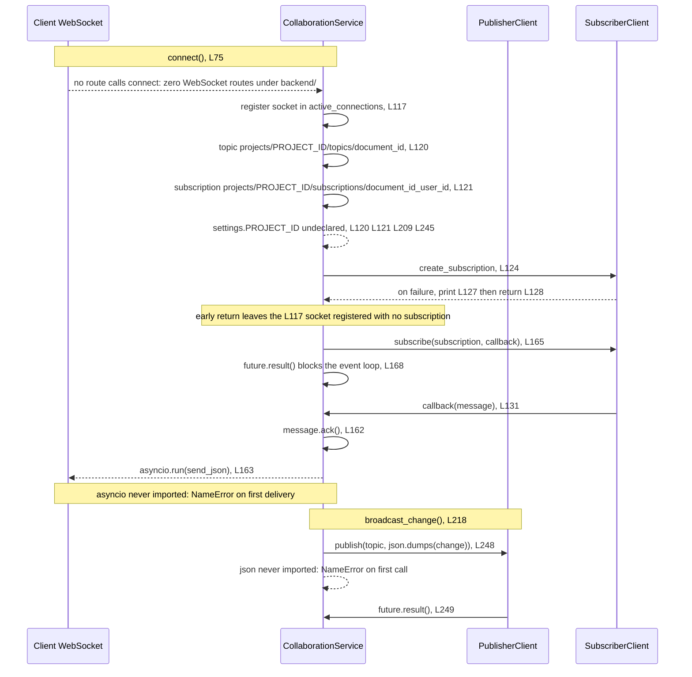
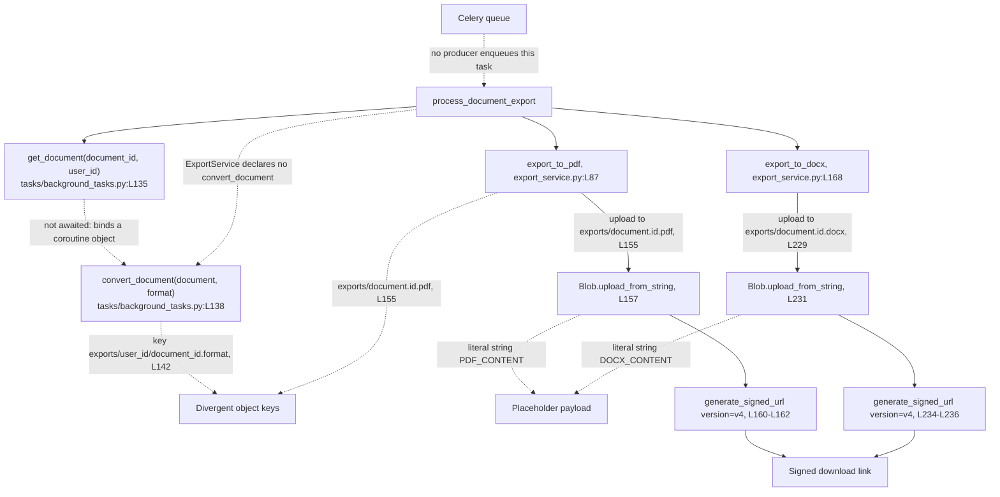

# backend/app/services

## Purpose

The service layer holds the three domain classes that sit between the routers described in
[../api/README.md](../api/README.md) and Google Cloud. `DocumentService` reads and writes document
records in Firestore and decides access by comparing a stored `user_id` against the caller.
`CollaborationService` registers editor sockets and moves edits over Cloud Pub/Sub, one topic per
document. `ExportService` uploads an export artifact to Google Cloud Storage and returns a signed
download link. None of the three runs as committed, because each imports a `settings` object that
`app.core.config` never creates, at `document_service.py:L62`, `collaboration_service.py:L39` and
`export_service.py:L61`.

## Key Components

Three classes and thirteen `def` statements. Line locators below point at the committed files as
they stand today.

| Component | Type | Location | Description |
| --- | --- | --- | --- |
| `DocumentService` | Class | `document_service.py:L64` | Document create, read, update and delete against the `documents` Firestore collection. Declares four public methods and no `get_documents`. |
| `DocumentService.__init__` | Constructor | `document_service.py:L70` | Binds the shared Firestore client to `self.db` at L72. Takes no arguments, so the client cannot be substituted for a test double. |
| `create_document` | Async method | `document_service.py:L74` | Rejects an empty title or body with HTTP 400 at L113, writes `user_id` at L118 and the generated `id` at L119, then persists at L120 and returns `Document(**doc_data)` at L123. |
| `get_document` | Async method | `document_service.py:L125` | Declares `(document_id: str, user_id: str)`. Raises 404 at L174 when the record is absent and 403 at L178 when `user_id` does not match. Returns the record at L181. |
| `update_document` | Async method | `document_service.py:L185` | Declares `(document_id, document: DocumentUpdate, user_id)`. Runs three Firestore operations: read at L237, write at L248, re-read at L251. Serializes with `.dict(exclude_unset=True)` at L247. |
| `delete_document` | Async method | `document_service.py:L254` | Declares `(document_id: str, user_id: str)`. Deletes at L286 and returns the literal `True` at L289 whatever the delete did. |
| `CollaborationService` | Class | `collaboration_service.py:L41` | Socket registry plus Pub/Sub publish and subscribe. No application module imports this class. |
| `CollaborationService.__init__` | Constructor | `collaboration_service.py:L67` | Builds a `PublisherClient` at L69 and a `SubscriberClient` at L70, then sets `active_connections = {}` at L71. Both clients are built eagerly. |
| `connect` | Async method | `collaboration_service.py:L75` | Registers the socket at L117, derives the topic at L120 and the subscription at L121, creates the subscription at L124, subscribes at L165, then blocks on `future.result()` at L168. |
| `callback` | Nested function | `collaboration_service.py:L131` | Closure passed to `subscribe` at L165. Calls `message.ack()` at L162, then `asyncio.run(websocket.send_json(...))` at L163. |
| `disconnect` | Async method | `collaboration_service.py:L173` | Removes the socket from the registry at L203 to L206 and deletes the subscription at L211. |
| `broadcast_change` | Async method | `collaboration_service.py:L218` | Publishes a JavaScript Object Notation (JSON) encoded change to the document topic at L248 and waits on the publish future at L249. |
| `ExportService` | Class | `export_service.py:L63` | Uploads export artifacts and returns signed links. Declares two methods and no `convert_document`. |
| `ExportService.__init__` | Constructor | `export_service.py:L69` | Builds a Cloud Storage `Client()` at L83. Construction runs at instantiation, so a missing credential fails there rather than at first upload. |
| `export_to_pdf` | Method | `export_service.py:L87` | Plain `def`. Uploads the literal string `"PDF_CONTENT"` at L157 to `exports/{document.id}.pdf`, then returns a version 4 signed uniform resource locator (URL) built at L160 to L162. |
| `export_to_docx` | Method | `export_service.py:L168` | Plain `def`. Uploads the literal string `"DOCX_CONTENT"` at L231 to `exports/{document.id}.docx`, then returns a version 4 signed URL built at L234 to L236. |

## Architecture Fit

The specification places these three classes in the service tier below the application programming
interface (API) gateway, and the committed code matches that placement for all three. The router
constructs a service and calls a method, and the service owns the cloud call. See
[../../../docs/architecture-overview.md](../../../docs/architecture-overview.md) for the tier map
across the whole repository.

The placement matches, and the surrounding components do not exist.
`documentation/Technical Specifications.md, SYSTEM ARCHITECTURE > COMPONENT DIAGRAMS > Backend
Components (L201-L217)` names twelve backend components. Three of them exist as code, and all three
live in this folder: `DocumentService`, `CollaborationService` and `ExportService`. The other nine
have no implementing file anywhere in the repository.

Six of the nine absent components sit directly beneath the three that exist. The specification draws
`DocumentRepository` and `VersionControl` under `DocumentService`, and `DocumentService` instead
calls `self.db.collection('documents')` inline at L116, L170, L236 and L275. No repository layer
stands between the service and Firestore, and the four module-level helpers at
`../db/firestore.py:L44`, `:L72`, `:L94` and `:L112`, described in
[../db/README.md](../db/README.md), go unused. The specification draws `WebSocketManager` and
`ConflictResolver` under `CollaborationService`, and neither exists, so nothing merges two concurrent
edits. The specification draws `PDFGenerator` and `DOCXGenerator` under `ExportService`, and neither
exists, so L157 and L231 upload literal strings.

Reachability differs sharply across the three. Every `DocumentService` method has a caller in
`../api/documents.py`, at L111, L145, L186, L234, L237, L281 and L284. `ExportService` has exactly
one application importer, `../tasks/background_tasks.py:L95`, so the only path to an export runs
through a Celery task. `CollaborationService` has none: no application module imports the class,
and no WebSocket route exists anywhere under `backend/`.

## Dependencies

The Pydantic contracts these services accept and return are described in
[../schema/README.md](../schema/README.md), and the cross-language drift in the ownership field is
described in [../../../docs/data-model.md](../../../docs/data-model.md). Firestore, Cloud Storage and
Pub/Sub are described in
[../../../docs/integration-guide.md](../../../docs/integration-guide.md).

### Internal

| Imported or expected name | Site | Resolves | Evidence |
| --- | --- | --- | --- |
| `db` from `app.db.firestore` | `document_service.py:L61` | Yes | `../db/firestore.py:L42` builds the client at import time. `DocumentService` binds it at L72. |
| `Document`, `DocumentCreate`, `DocumentUpdate` from `app.schema.document` | `document_service.py:L60` | Yes | Declared at `../schema/document.py:L98`, `:L70` and `:L84`. |
| `Document` from `app.schema.document` | `collaboration_service.py:L38` | Yes, and unused | No code line and no type annotation in the module uses the name. |
| `Document` from `app.schema.document` | `export_service.py:L60` | Yes | Both methods read `document.id` at L155 and L229. |
| `settings` from `app.core.config` | `document_service.py:L62`, `collaboration_service.py:L39`, `export_service.py:L61` | No | `../core/config.py` declares the `Settings` class at L51 and no module-level instance. All three modules fail at import. |
| `Client` from `google.cloud.firestore` | `document_service.py:L59` | Yes, and unused | The module never names `Client` again. Only the pre-built `db` is used. |
| `WebSocketDisconnect` from `fastapi` | `collaboration_service.py:L36` | Yes, and unused | No `except WebSocketDisconnect` clause exists in the module. |
| `asyncio` | Used at `collaboration_service.py:L163` | No | No import statement for `asyncio` exists. The name raises `NameError` on the first message delivered, not at import. |
| `json` | Used at `collaboration_service.py:L248` | No | No import statement for `json` exists. The name raises `NameError` on the first `broadcast_change` call, not at import. |
| `DocumentService.get_documents` | Called at `../api/documents.py:L145` | No | The class declares four methods at L74, L125, L185 and L254, and no `get_documents`. |
| `ExportService.convert_document` | Called at `../tasks/background_tasks.py:L138` | No | The class declares `export_to_pdf` at L87 and `export_to_docx` at L168, and no `convert_document`. |
| `app.services.user_service` | Imported at `../api/auth.py:L86` and `../api/users.py:L27` | No | No `user_service.py` exists in this folder. |
| `app.services.template_service` | Imported at `../api/templates.py:L76` | No | No `template_service.py` exists in this folder. |

Five modules are imported from the `app.services.*` namespace and three exist. The two absent names
are `user_service` and `template_service`.

### External

Only the four distributions this folder's own imports establish. The package-wide inferred floor,
covering FastAPI, SQLAlchemy, python-jose, passlib, google-auth, Celery and uvicorn, lives in
[../README.md](../README.md). No Python dependency manifest is committed anywhere in the repository,
so every floor below is inferred from code.

| Package | Floor | Establishing code fact |
| --- | --- | --- |
| `google-cloud-firestore` | Any | `from google.cloud.firestore import Client` at `document_service.py:L59`, plus the `db` client the module binds at L72. |
| `google-cloud-pubsub` | Any | `from google.cloud.pubsub_v1 import PublisherClient, SubscriberClient` at `collaboration_service.py:L37`. The `pubsub_v1` path is the version 1 client surface. |
| `google-cloud-storage` | Any | `from google.cloud.storage import Client` at `export_service.py:L59`. `Blob.generate_signed_url` accepts `version="v4"` at L161 and L235. |
| `pydantic` | 1.x only | `document.dict(exclude_unset=True)` at `document_service.py:L247` is the version 1 method name. Pydantic 2 renamed it to `model_dump`. |

## Configuration

Three settings reach this folder, and none of the three is declared. `../core/config.py` declares
nine fields at L111 to L119, and no line in that file declares any of the names below.

| Setting | Read at | Status |
| --- | --- | --- |
| `PROJECT_ID` | `collaboration_service.py:L120`, `:L121`, `:L209`, `:L245` | READ-BUT-NEVER-DECLARED |
| `STORAGE_BUCKET_NAME` | `export_service.py:L154`, `:L228` | READ-BUT-NEVER-DECLARED |
| `SIGNED_URL_EXPIRATION` | `export_service.py:L162`, `:L236` | READ-BUT-NEVER-DECLARED |

Each name would raise `AttributeError` against a `Settings` instance, and the import of `settings`
fails first, so no caller reaches the attribute error today.
[../core/README.md](../core/README.md) carries the full fifteen-setting register with the declared
and undeclared split for the backend.

## Data Flows

Document reads and writes flow one way: a router constructs `DocumentService`, the method calls
Firestore, and the method returns a `Document` model. Collaboration and export both fan out through
a Google Cloud service, and both diagrams below mark the broken edges with dashed lines.

Diagram 1 traces one editor session through `connect` at L75 and one edit through
`broadcast_change` at L218.



Diagram 2 traces the export path. The task tier that drives it is documented in
[../tasks/README.md](../tasks/README.md), and the absent Redis broker and worker process are
documented in
[../../../docs/deployment-guide.md](../../../docs/deployment-guide.md).



The two object key layouts do not agree. `ExportService` writes `exports/{document.id}.pdf` at L155
and `exports/{document.id}.docx` at L229, while `../tasks/background_tasks.py:L142` writes
`exports/{user_id}/{document_id}.{export_format}`. One artifact, two addresses.

## Design Patterns

Eight patterns are visible in the three modules.

Ownership-based authorization through a `user_id` comparison. `DocumentService` decides access in
the service, not in a policy object, and the comparison appears three times: L177, L243 and L282.

Async signatures wrapping a synchronous software development kit (SDK). Seven of the nine public
methods in this folder are `async def`, and every Firestore and Pub/Sub call inside them is
synchronous and blocking. `future.result()` at `collaboration_service.py:L168` blocks the event loop
for the lifetime of the subscription.

Read-modify-read update. `update_document` costs three Firestore operations for one edit: the read
at L237, the write at L248, and the re-read at L251.

Per-document Pub/Sub topic and subscription fan-out. One topic per document at
`projects/{PROJECT_ID}/topics/{document_id}`, L120 and L245. One subscription per document and user
pair at `projects/{PROJECT_ID}/subscriptions/{document_id}_{user_id}`, L121 and L209.

Per-process in-memory connection registry. `active_connections` at `collaboration_service.py:L71` is
a plain dictionary with no lock and no shared store, so a second worker process sees none of the
sockets the first one holds.

Acknowledge-before-send message handling. `message.ack()` at L162 runs before
`websocket.send_json(...)` at L163, so Pub/Sub treats a delivery as settled before the client
receives it and will not redeliver it.

Eager client construction in `__init__`. `PublisherClient` and `SubscriberClient` at
`collaboration_service.py:L69` and `:L70`, and the Cloud Storage `Client()` at
`export_service.py:L83`, all run at instantiation.

Placeholder-payload export. Both export methods upload a literal string, `"PDF_CONTENT"` at L157 and
`"DOCX_CONTENT"` at L231, under the correct content types.

Three patterns a reader might expect are absent. No service inherits a common base class. No service
is registered in a dependency container, and FastAPI's `Depends` never yields one. Every handler
constructs its own instance per request, at `../api/documents.py:L110`, `:L144`, `:L185`, `:L233` and
`:L280`.

The order of the two ownership checks decides which status code a caller receives. The sequence
below traces that order line by line.

`create_document` writes the compared value. L118 sets `doc_data['user_id'] = user_id` from the
caller's argument, and L120 persists that dictionary. Every later comparison reads that stored key.

Existence is checked first in all three guarded methods. `if not doc.exists` runs at L173, L239 and
L278, and each raises HTTP 404 immediately after, at L174, L240 and L279. Ownership is never
evaluated for a document that does not exist.

Ownership is checked second. `doc.to_dict()['user_id'] != user_id` runs at L177, L243 and L282, and
each raises HTTP 403 at L178, L244 and L283. A caller asking for another user's document therefore
receives 403, and a caller asking for a document that was never stored receives 404. The two cases
are distinguishable from outside, so any authenticated caller can learn whether a given identifier
exists.

Two facts change what the comparison actually reads. The stored key is `user_id`, written at L118,
while the `Document` contract declares `owner_id` at `../schema/document.py:L68`. The comparison
reads the raw Firestore dictionary rather than the model, so the comparison itself works on the
stored key, and the routers that read `.user_id` off a returned `Document` do not.

## Known Limitations

Four `HUMAN ASSISTANCE NEEDED` markers and four `TODO` markers live in this folder, eight in total
and more than any other directory in the backend package. All eight are preserved in place. The four
markers read:

```text
document_service.py:L183-L184
    # HUMAN ASSISTANCE NEEDED
    # This function might need additional error handling and validation

collaboration_service.py:L73-L74
    # HUMAN ASSISTANCE NEEDED
    # The following method has a confidence level of 0.6 and may need adjustments for production readiness

collaboration_service.py:L216-L217
    # HUMAN ASSISTANCE NEEDED
    # The following method has a confidence level of 0.7 and may need adjustments for production readiness

export_service.py:L85-L86
    # HUMAN ASSISTANCE NEEDED
    # The following methods have a low confidence score and may require additional implementation details or error handling
```

The `export_service.py:L85` marker says "methods", plural, so it annotates both `export_to_pdf` at
L87 and `export_to_docx` at L168. All four `TODO` markers sit in the same file: L151, L156, L225 and
L230.

Nine call sites violate a contract this folder declares. None is repaired here.

| Call site | Defect |
| --- | --- |
| `../api/documents.py:L111` | Passes `current_user`, a `User` object, where `create_document` declares `user_id: str` at L74. The specification's own example at `documentation/Technical Specifications.md:L443` passes `current_user.id`, a string, so the specification contradicts the committed call. |
| `../api/documents.py:L145` | Calls `get_documents`, which `DocumentService` does not define. |
| `../api/documents.py:L186`, `:L234`, `:L281` | Call `get_document(document_id)` with one argument against the two-argument signature at L125. |
| `../tasks/background_tasks.py:L310` | The fourth one-argument `get_document` call site. |
| `../tasks/background_tasks.py:L135` | Correct arity, and not awaited on an `async def`, so the name binds a coroutine object that L138 passes onward. |
| `../api/documents.py:L237` | Supplies two of the three arguments `update_document` declares at L185, omitting `user_id`. |
| `../api/documents.py:L284` | Supplies one of the two arguments `delete_document` declares at L254, omitting `user_id`. |
| `../api/documents.py:L187`, `:L235`, `:L282` | Read `.user_id` off a `Document` that declares `owner_id` at `../schema/document.py:L68`. |
| `../tasks/background_tasks.py:L138` | Calls `convert_document`, which `ExportService` does not define. |

Beyond the call sites:

- **The collaboration path is unreachable.** No application module imports
  `CollaborationService`, and no WebSocket route exists anywhere under `backend/`. The only
  references are `../../tests/test_services.py:L4` and `:L39`, through a bare `services.*` import
  root that does not resolve. Nothing constructs the class, so `connect`, `disconnect` and
  `broadcast_change` never run.
- **The export methods write literal strings.** L157 uploads `"PDF_CONTENT"` and L231 uploads
  `"DOCX_CONTENT"`. No conversion code exists in either method. The upload and the version 4 signed
  URL are the parts that would work; the document conversion is the part that does not.
- **Three sites fail Pydantic validation on missing timestamps.** `../schema/document.py` declares
  `created_at` at L113 and `updated_at` at L114 as required. `create_document` assembles `doc_data`
  at L117 to L119 without either field, so `Document(**doc_data)` at L123 raises. Nothing ever
  writes those two fields to Firestore, so the reads at L181 and L252 raise for the same reason.
- **Two sibling service modules are imported and absent.** `app.services.user_service` at
  `../api/auth.py:L86` and `../api/users.py:L27`, and `app.services.template_service` at
  `../api/templates.py:L76`.
- **Two undefined names raise at first call, not at import.** `asyncio` at
  `collaboration_service.py:L163` and `json` at `:L248`. Neither module is imported, and both uses
  sit inside function bodies.
- **A failed subscription leaves a registered socket.** L127 prints and L128 returns, while the
  socket registered at L117 stays in `active_connections` with no subscription behind it.
- **Four imports are unused.** `Client` at `document_service.py:L59` and `settings` at `:L62`, which
  the module never dereferences, plus `WebSocketDisconnect` at `collaboration_service.py:L36` and
  `Document` at `:L38`.
- **`delete_document` reports success unconditionally.** L289 returns the literal `True` whatever
  `doc_ref.delete()` at L286 did.
- **The folder is inconsistent on `async`.** Both `ExportService` methods are plain `def` at L87 and
  L168, while the seven public methods in the other two modules are all `async def`.

Every defect above is listed with its symptom and remediation in
[../../../docs/troubleshooting.md](../../../docs/troubleshooting.md). Judgement calls behind the
documentation choices are recorded in
[../../../docs/decision-log.md](../../../docs/decision-log.md).

## Usage Examples

Every example below uses a signature declared in the committed code. No example runs today, and each
one names the defect that stops it. Setup steps live in
[../../../docs/onboarding.md](../../../docs/onboarding.md).

Reading a document with the two-argument signature declared at `document_service.py:L125`:

```python
from app.services.document_service import DocumentService

service = DocumentService()
document = await service.get_document("abc123", "user-42")
```

The import fails at `document_service.py:L62`, which requests a `settings` name that
`app.core.config` never defines. Given that name, `Document(**doc.to_dict())` at L181 then raises
because no stored record carries the required `created_at` and `updated_at` fields.

Creating a document, per the signature at `document_service.py:L74`:

```python
from app.schema.document import DocumentCreate
from app.services.document_service import DocumentService

service = DocumentService()
draft = DocumentCreate(title="Quarterly report", content="Opening paragraph.")
created = await service.create_document(draft, "user-42")
```

The second argument is a string, matching the declared `user_id: str`. The committed router at
`../api/documents.py:L111` passes the whole `User` object instead. The same import failure at L62
applies, and `Document(**doc_data)` at L123 raises on the two missing timestamp fields.

`CollaborationService` has no usage example. No route constructs the class and no WebSocket endpoint
exists under `backend/`, so no example can show the class in service. An example calling `connect`
directly would raise `NameError` for `asyncio` at L163 on the first delivered message, and an example
calling `broadcast_change` would raise `NameError` for `json` at L248.

Exporting to Portable Document Format (PDF), per the signature at `export_service.py:L87`:

```python
from app.services.export_service import ExportService

service = ExportService()
signed_url = service.export_to_pdf(document)
```

The method is a plain `def`, so no `await` belongs here. The import fails at `export_service.py:L61`
on the same absent `settings` name. Given that name, `settings.STORAGE_BUCKET_NAME` at L154 raises
`AttributeError`, and given that field, the upload at L157 stores the literal string `"PDF_CONTENT"`
rather than a PDF.

The three test modules under `../../tests/` cannot supply a working example, and
[../../tests/README.md](../../tests/README.md) documents their state.
`../../tests/test_services.py:L4` imports through a bare `services.*` root that does not resolve,
and L6 and L7 import `models.document` and `models.user`, neither of which exists. The suite calls
`add_collaborator` at L44, `remove_collaborator` at L50 and `get_collaborators` at L55, and no
service in this folder defines any of the three. L63 and L71 patch
`services.export_service.generate_pdf` and `generate_docx`, and neither function exists.
