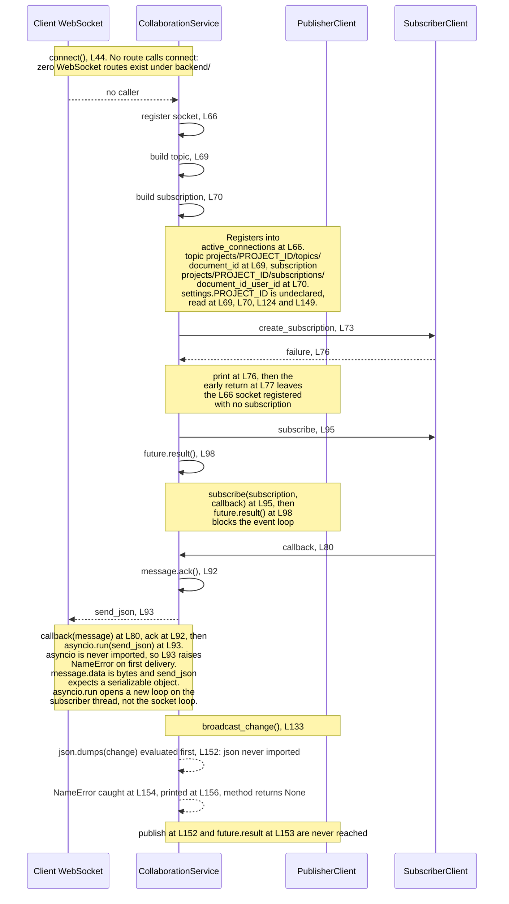
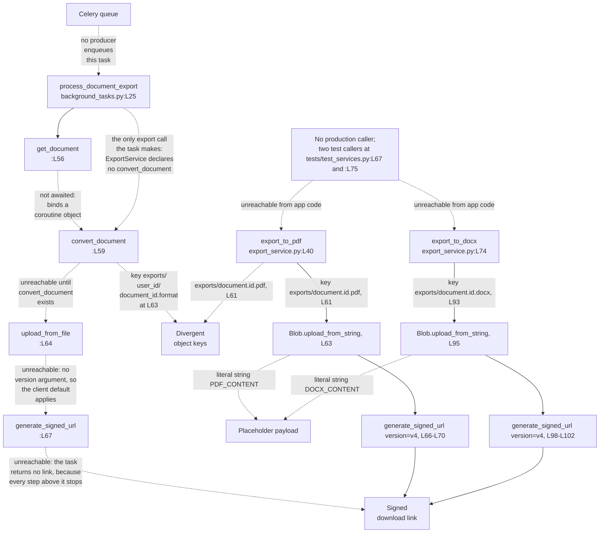

# backend/app/services

## Purpose

The service layer holds the three domain classes that sit between the routers described in
[../api/README.md](../api/README.md) and Google Cloud. `DocumentService` reads and writes document records in
Firestore and decides access by comparing a stored `user_id` against the caller. `CollaborationService` registers
editor sockets and moves edits over Cloud Pub/Sub, one topic per document. `ExportService` uploads an export artifact
to Google Cloud Storage and returns a signed download link. None of the three runs as committed, because each imports
a `settings` object that `app.core.config` never creates, at `document_service.py:L17`, `collaboration_service.py:L18`
and `export_service.py:L16`.

## Key Components

Three classes and thirteen `def` statements, located against the committed files as they stand today.

| Component | Type | Location | Description |
| --- | --- | --- | --- |
| `DocumentService` | Class | `document_service.py:L19` | Document create, read, update and delete against the `documents` Firestore collection. Declares four public methods and no `get_documents`. |
| `DocumentService.__init__` | Constructor | `document_service.py:L33` | Binds the shared Firestore client to `self.db` at L40. Takes no arguments, so the client cannot be substituted for a test double. |
| `create_document` | Async method | `document_service.py:L42` | Rejects an empty title or body with HTTP 400 at L66, sets `user_id` at L71 and the generated `id` at L72, then calls `set` at L73. The router passes a `User`, which Firestore cannot encode, so L73 raises before the write is sent and the return at L76 is never reached. |
| `get_document` | Async method | `document_service.py:L78` | Declares `(document_id: str, user_id: str)`. Raises 404 at L105 when the record is absent and 403 at L109 when `user_id` does not match. Returns the record at L112. |
| `update_document` | Async method | `document_service.py:L116` | Declares `(document_id, document: DocumentUpdate, user_id)`. Runs three Firestore operations: read at L142, write at L153, re-read at L156. Serializes with `.dict(exclude_unset=True)` at L152. |
| `delete_document` | Async method | `document_service.py:L159` | Declares `(document_id: str, user_id: str)`. Deletes at L188 and returns the literal `True` at L191 whatever the delete did. |
| `CollaborationService` | Class | `collaboration_service.py:L20` | Socket registry plus Pub/Sub publish and subscribe. No application module imports this class. |
| `CollaborationService.__init__` | Constructor | `collaboration_service.py:L32` | Builds a `PublisherClient` at L38 and a `SubscriberClient` at L39, then sets `active_connections = {}` at L40. Both clients are built eagerly. |
| `connect` | Async method | `collaboration_service.py:L44` | Registers the socket at L66, derives the topic at L69 and the subscription at L70, creates the subscription at L73, subscribes at L95, then blocks on `future.result()` at L98. L66 keys by user, so a second socket for the same document and user replaces the first without closing it, and the shared name at L70 makes the second `create_subscription` answer `AlreadyExists`, which L76 prints before L77 returns. |
| `callback` | Nested function | `collaboration_service.py:L80` | Closure passed to `subscribe` at L95. Calls `message.ack()` at L92, then `asyncio.run(websocket.send_json(...))` at L93. |
| `disconnect` | Async method | `collaboration_service.py:L103` | Removes the socket from the registry at L118 to L121 and deletes the subscription at L126. L124 rebuilds the name from the document and user alone, so L126 deletes the subscription every socket for that pair shares. |
| `broadcast_change` | Async method | `collaboration_service.py:L133` | Publishes a JavaScript Object Notation (JSON) encoded change to the document topic at L152 and waits on the publish future at L153. |
| `ExportService` | Class | `export_service.py:L18` | Uploads export artifacts and returns signed links. Declares two methods and no `convert_document`. |
| `ExportService.__init__` | Constructor | `export_service.py:L29` | Builds a Cloud Storage `Client()` at L36. Construction runs at instantiation, so a missing credential fails there rather than at first upload. |
| `export_to_pdf` | Method | `export_service.py:L40` | Plain `def`. Uploads the literal string `"PDF_CONTENT"` at L63 to `exports/{document.id}.pdf`, then returns a version 4 signed uniform resource locator (URL) built at L66 to L68. |
| `export_to_docx` | Method | `export_service.py:L74` | Plain `def`. Uploads the literal string `"DOCX_CONTENT"` at L95 to `exports/{document.id}.docx`, then returns a version 4 signed URL built at L98 to L100. |

## Architecture Fit

The specification places these three classes in the service tier below the application programming
interface (API) gateway, and the committed code matches that placement for all three. Each class
owns its own cloud call, and the three differ in who reaches them. `DocumentService` is the only one
a router constructs, at `../api/documents.py:L45`, `:L64`, `:L90`, `:L119` and `:L145`.

`ExportService` is constructed once, by the task module at `../tasks/background_tasks.py:L52`, and
no handler calls either of its methods. `CollaborationService` is constructed nowhere: no route,
task or module in the tree names it. See
[../../../docs/architecture-overview.md](../../../docs/architecture-overview.md) for the tier map.

The placement matches, and the surrounding components do not exist.
`documentation/Technical Specifications.md, SYSTEM ARCHITECTURE > COMPONENT DIAGRAMS > Backend Components (L201-L217)`
names twelve backend components. Three of them exist as code, and all three live in this folder: `DocumentService`,
`CollaborationService` and `ExportService`. The other nine have no implementing file anywhere in the repository.

Six of the nine absent components sit directly beneath the three that exist. The specification draws
`DocumentRepository` and `VersionControl` under `DocumentService`, and `DocumentService` instead calls
`self.db.collection('documents')` inline at L69, L101, L141 and L177. No repository layer stands between the service
and Firestore, and the four module-level helpers at `../db/firestore.py:L22`, `:L45`, `:L64` and `:L79`, described in
[../db/README.md](../db/README.md), go unused. The specification draws `WebSocketManager` and `ConflictResolver` under
`CollaborationService`, and neither exists, so nothing merges two concurrent edits. The specification draws
`PDFGenerator` and `DOCXGenerator` under `ExportService`, and neither exists, so L63 and L95 upload literal strings.

Reachability differs sharply across the three. Every `DocumentService` method has a caller in `../api/documents.py`,
at L46, L65, L91, L120, L123, L146 and L149. `ExportService` has exactly one application importer,
`../tasks/background_tasks.py:L19`, so the only path to an export runs through a Celery task. `CollaborationService`
has none: no application module imports the class, and no WebSocket route exists under `backend/`.

## Dependencies

The Pydantic contracts these services accept and return are described in
[../schema/README.md](../schema/README.md), and the cross-language drift in the ownership field in
[../../../docs/data-model.md](../../../docs/data-model.md). Firestore, Cloud Storage and Pub/Sub are
described in [../../../docs/integration-guide.md](../../../docs/integration-guide.md).

### Internal

| Imported or expected name | Site | Resolves | Evidence |
| --- | --- | --- | --- |
| `db` from `app.db.firestore` | `document_service.py:L16` | Yes | `../db/firestore.py:L20` builds the client at import time. `DocumentService` binds it at L45. |
| `Document`, `DocumentCreate`, `DocumentUpdate` from `app.schema.document` | `document_service.py:L15` | Yes | Declared at `../schema/document.py:L51`, `:L30` and `:L39`. |
| `Document` from `app.schema.document` | `collaboration_service.py:L17` | Yes, and unused | No code line and no type annotation in the module uses the name. |
| `Document` from `app.schema.document` | `export_service.py:L15` | Yes | Both methods read `document.id` at L61 and L93. |
| `settings` from `app.core.config` | `document_service.py:L17`, `collaboration_service.py:L18`, `export_service.py:L16` | No | `../core/config.py` declares the `Settings` class at L20 and no module-level instance. All three modules fail at import. |
| `Client` from `google.cloud.firestore` | `document_service.py:L14` | Yes, and unused | The module never names `Client` again. Only the pre-built `db` is used. |
| `WebSocketDisconnect` from `fastapi` | `collaboration_service.py:L15` | Yes, and unused | No `except WebSocketDisconnect` clause exists in the module. |
| `asyncio` | Used at `collaboration_service.py:L93` | No | No import statement for `asyncio` exists. The name raises `NameError` on the first message delivered, not at import. |
| `json` | Used at `collaboration_service.py:L152` | No | No import statement for `json` exists. The name raises `NameError` on the first `broadcast_change` call, not at import. |
| `DocumentService.get_documents` | Called at `../api/documents.py:L65` | No | The class declares four methods at L42, L78, L116 and L159, and no `get_documents`. |
| `ExportService.convert_document` | Called at `../tasks/background_tasks.py:L59` | No | The class declares `export_to_pdf` at L40 and `export_to_docx` at L74, and no `convert_document`. |
| `app.services.user_service` | Imported at `../api/auth.py:L21` and `../api/users.py:L14` | No | No `user_service.py` exists in this folder. |
| `app.services.template_service` | Imported at `../api/templates.py:L18` | No | No `template_service.py` exists in this folder. |

Five modules are imported from the `app.services.*` namespace and three exist. The two absent names
are `user_service` and `template_service`.

### External

Only the four distributions this folder's own imports establish. The package-wide inferred set,
covering FastAPI, SQLAlchemy, python-jose, passlib, google-auth, Celery and uvicorn, lives in
[../README.md](../README.md). No Python manifest is committed, so every floor below is inferred.

| Package | Floor | Establishing code fact |
| --- | --- | --- |
| `google-cloud-firestore` | Unestablished | `from google.cloud.firestore import Client` at `document_service.py:L14`, plus the `db` client the module binds at L40. |
| `google-cloud-pubsub` | Unestablished | `from google.cloud.pubsub_v1 import PublisherClient, SubscriberClient` at `collaboration_service.py:L16`. The `pubsub_v1` path is the version 1 client surface. |
| `google-cloud-storage` | Unestablished | `from google.cloud.storage import Client` at `export_service.py:L14`. `Blob.generate_signed_url` accepts `version="v4"` at L67 and L99. |
| `pydantic` | 1.x only | `document.dict(exclude_unset=True)` at `document_service.py:L152` is the version 1 method name. Pydantic 2 renamed it to `model_dump`. |

## Configuration

Three settings reach this folder, and none of the three is declared. `../core/config.py` declares
nine fields at L40 to L48, and no line in that file declares any of the names below.

| Setting | Read at | Status |
| --- | --- | --- |
| `PROJECT_ID` | `collaboration_service.py:L69`, `:L70`, `:L124`, `:L149` | READ-BUT-NEVER-DECLARED |
| `STORAGE_BUCKET_NAME` | `export_service.py:L60`, `:L92` | READ-BUT-NEVER-DECLARED |
| `SIGNED_URL_EXPIRATION` | `export_service.py:L68`, `:L100` | READ-BUT-NEVER-DECLARED |

Each name would raise `AttributeError` against a `Settings` instance, and the import of `settings`
fails first, so no caller reaches the attribute error today.
[../core/README.md](../core/README.md) carries the full fifteen-setting register for the backend.

## Data Flows

Document reads and writes flow one way: a router constructs `DocumentService`, the method calls Firestore, and the
method returns a `Document` model. Collaboration and export both fan out through a Google Cloud service, and both
diagrams below mark the broken edges with dashed lines.

Diagram 1 traces one editor session through `connect` at L44 and one edit through `broadcast_change` at L133.



Diagram 2 traces the export path. The task tier that drives it is documented in
[../tasks/README.md](../tasks/README.md), and the absent Redis broker and worker process in
[../../../docs/deployment-guide.md](../../../docs/deployment-guide.md).

**No export artifact is uploaded and no signed URL is produced by this repository.** The task tier makes exactly one
call into `ExportService`, naming a method the class never defines. The path raises before any upload or signing
statement is reached. `export_to_pdf` at `export_service.py:L40` and `export_to_docx` at `:L74` have zero
callers anywhere in `backend/app/`. The only callers in the repository are two test statements at
`../../tests/test_services.py:L67` and `:L75`, and both pass the integer `1` where a `Document` is
declared, bound at `:L27` and `:L73`.

The diagram below therefore draws the one call that exists, not the two that do not.



The two object key layouts do not agree. `ExportService` writes `exports/{document.id}.pdf` at L61 and
`exports/{document.id}.docx` at L93, while `../tasks/background_tasks.py:L63` writes
`exports/{user_id}/{document_id}.{export_format}`, so one artifact has two addresses.

## Design Patterns

Eight patterns are visible in the three modules.

Ownership-based authorization through a `user_id` comparison. `DocumentService` decides access in
the service rather than in a policy object, and the comparison appears three times, at L108, L148
and L184. All three subscript `doc.to_dict()['user_id']` directly, so a stored document missing
that key raises `KeyError` rather than returning 403, and FastAPI answers 500 because `KeyError`
is not an `HTTPException`.

Async signatures wrapping a synchronous software development kit (SDK). Seven of the nine public
methods are `async def`, and every Firestore and Pub/Sub call inside them is synchronous and
blocking. `future.result()` at `collaboration_service.py:L98` blocks the event loop for the
subscription's life. Read-modify-read update follows: `update_document` costs three Firestore
operations for one edit, the read at L142, the write at L153 and the re-read at L156.

Per-document Pub/Sub topic and subscription fan-out. One topic per document at
`projects/{PROJECT_ID}/topics/{document_id}`, L69 and L149. One subscription per document and user pair at
`projects/{PROJECT_ID}/subscriptions/{document_id}_{user_id}`, L70 and L124. The pattern assumes a topic that already
exists: no `create_topic` call sits anywhere in the repository, and `create_subscription` at L73 and `publish` at L152
both answer `NotFound` without one.

Per-process in-memory connection registry. `active_connections` at `collaboration_service.py:L40` is a plain dictionary
with no lock and no shared store, so a second worker process sees none of the sockets the first one holds. Keying by user
rather than by connection is what lets a second socket evict the first, so holding both would need a unique connection
identifier per socket and subscription ownership that is reference counted or idempotent.

Acknowledge-before-send message handling. `message.ack()` at L92 runs before `websocket.send_json(...)` at L93, so
Pub/Sub treats a delivery as settled before the client receives it and will not redeliver it.

Eager client construction in `__init__`. `PublisherClient` and `SubscriberClient` at `collaboration_service.py:L38` and
`:L39`, and the Cloud Storage `Client()` at `export_service.py:L36`, all run at instantiation. Placeholder-payload
export completes the set: both export methods upload a literal string, `"PDF_CONTENT"` at L63 and `"DOCX_CONTENT"` at
L95, under the correct content types.

Three patterns a reader might expect are absent. No service inherits a common base class, no service is registered in a
dependency container, and FastAPI's `Depends` never yields one. Every handler constructs its own instance per request,
at `../api/documents.py:L45`, `:L64`, `:L90`, `:L119` and `:L145`.

The order of the two checks decides which status code a caller receives, traced line by line
below. `create_document` writes the compared value: L71 sets `doc_data['user_id'] = user_id`
from the caller's argument and L73 persists that dictionary, so every later comparison reads
that stored key.

Existence is checked first in all three guarded methods. `if not doc.exists` runs at L104, L144
and L180, and each raises HTTP 404 immediately after, at L172, L127 and L145. Ownership is never
evaluated for a document that does not exist.

Ownership is checked second. `doc.to_dict()['user_id'] != user_id` runs at L108, L148 and L184, and each raises HTTP
403 at L109, L149 and L185. A caller asking for another user's document therefore receives 403, and a caller asking
for a document that was never stored receives 404. The two cases are distinguishable from outside, so any
authenticated caller can learn whether a given identifier exists.

Two facts change what the comparison actually reads. The stored key is `user_id`, written at L71,
while the `Document` contract declares `owner_id` at `../schema/document.py:L28`. The comparison
reads the raw Firestore dictionary rather than the model, so it works on the stored key. The routers
that read `.user_id` off a returned `Document` do not.

## Known Limitations

Four `HUMAN ASSISTANCE NEEDED` markers and four `TODO` markers live in this folder, eight in total and
more than any other backend directory. All eight are preserved in place. The four markers read:

| Location | Second line of the marker |
| --- | --- |
| `document_service.py:L114-L115` | `# This function might need additional error handling and validation` |
| `collaboration_service.py:L42-L43` | `# The following method has a confidence level of 0.6 and may need adjustments for production readiness` |
| `collaboration_service.py:L131-L132` | `# The following method has a confidence level of 0.7 and may need adjustments for production readiness` |
| `export_service.py:L38-L39` | `# The following methods have a low confidence score and may require additional implementation details or error handling` |

Each marker opens with `# HUMAN ASSISTANCE NEEDED` on its own first line. The `export_service.py:L38` marker says
"methods", plural, so it annotates both `export_to_pdf` at L40 and `export_to_docx` at L74. All four `TODO` markers
sit in the same file: L57, L62, L89 and L94.

Thirteen call sites violate a contract this folder declares, grouped below into nine rows
because two rows carry three sites each. None is repaired here.

| Call site | Defect |
| --- | --- |
| `../api/documents.py:L46` | Passes `current_user`, a `User` object, where `create_document` declares `user_id: str` at L42. The specification's own example at `documentation/Technical Specifications.md:L443` passes `current_user.id`, a string, so the specification contradicts the committed call. |
| `../api/documents.py:L65` | Calls `get_documents`, which `DocumentService` does not define. |
| `../api/documents.py:L91`, `:L120`, `:L146` | Call `get_document(document_id)` with one argument against the two-argument signature at L78. |
| `../tasks/background_tasks.py:L135` | The fourth one-argument `get_document` call site. |
| `../tasks/background_tasks.py:L56` | Correct arity, and not awaited on an `async def`, so the name binds a coroutine object that L59 passes onward. |
| `../api/documents.py:L123` | Supplies two of the three arguments `update_document` declares at L116, omitting `user_id`. |
| `../api/documents.py:L149` | Supplies one of the two arguments `delete_document` declares at L159, omitting `user_id`. |
| `../api/documents.py:L92`, `:L121`, `:L147` | Read `.user_id` off a `Document` that declares `owner_id` at `../schema/document.py:L28`. |
| `../tasks/background_tasks.py:L59` | Calls `convert_document`, which `ExportService` does not define. |

Beyond the call sites:

- **The collaboration path is unreachable.** No application module imports `CollaborationService`, and
  no WebSocket route exists anywhere under `backend/`. The only references are
  `../../tests/test_services.py:L4` and `:L39`, reached through a bare `services.*` import root that
  locates this file only while `backend/app/` sits on the import path. `connect`, `disconnect` and
  `broadcast_change` therefore never run.
- **The export methods write literal strings.** `export_service.py:L63` uploads `"PDF_CONTENT"` and
  `:L95` uploads `"DOCX_CONTENT"`, and no conversion code exists in either method. Neither the upload
  nor the version 4 signature completes today. `settings.STORAGE_BUCKET_NAME` at `:L60` is undeclared,
  and signing needs credentials able to sign bytes, meaning a private key or an IAM `signBlob` grant.
- **Three sites fail Pydantic validation on missing timestamps.** `../schema/document.py` declares
  `created_at` at L63 and `updated_at` at L64 as required, and `create_document` assembles
  `doc_data` at `document_service.py:L70` to `:L72` without either, so `Document(**doc_data)` at
  `:L76` raises. Nothing writes them to Firestore, so `:L112` and `:L157` raise for the same reason.
- **Two sibling service modules are imported and absent.** `app.services.user_service` at
  `../api/auth.py:L21` and `../api/users.py:L14`; `app.services.template_service` at `../api/templates.py:L18`.
- **Two undefined names raise at first call, not at import.** `asyncio` at
  `collaboration_service.py:L93` and `json` at `:L152`, neither imported. `:L154` catches the second
  and `:L156` prints it, so a publish failure never reaches the caller. A failed subscription is silent
  too: `:L76` prints, `:L77` returns, and the socket registered at `:L66` keeps its registry entry.
- **Four imports are unused.** `Client` at `document_service.py:L14` and `settings` at `:L17`, which the module never
  dereferences, plus `WebSocketDisconnect` at `collaboration_service.py:L15` and `Document` at `:L17`.
- **`delete_document` reports success unconditionally.** `document_service.py:L191` returns the literal `True`
  whatever `doc_ref.delete()` at `:L188` did. The value means the method reached its last line, not that a document
  was removed, and a Firestore delete of a missing document succeeds silently.
- **Both mutating methods check, then write, with nothing between.** `update_document` reads at
  `document_service.py:L142`, tests existence at `:L144` and ownership at `:L148`, then writes at
  `:L153` with no transaction and no precondition. `delete_document` repeats the shape at `:L178`,
  `:L180`, `:L184` and `:L188`. A concurrent owner change between the read and the write is silently
  overwritten, and a concurrent delete makes the `update()` fail on a document the check said existed.
- **The folder is inconsistent on `async`.** Both `ExportService` methods are plain `def` at `export_service.py:L40`
  and `:L74`, while the seven public methods in the other two modules are all `async def`.

Every defect above is listed with its symptom and remediation in
[../../../docs/troubleshooting.md](../../../docs/troubleshooting.md). Judgement calls behind the documentation choices
sit in the [decision log](../../../docs/decision-log.md).

## Usage Examples

Every example below uses a signature declared in the committed code. No example runs today, and each one names the
defect that stops it. Setup steps live in [../../../docs/onboarding.md](../../../docs/onboarding.md).

Creating a document and then reading it back, per the signatures declared at `document_service.py:L42` and `:L78`:

```python
import asyncio

from app.schema.document import DocumentCreate
from app.services.document_service import DocumentService


async def main() -> None:
    service = DocumentService()
    draft = DocumentCreate(title="Quarterly report", content="Opening paragraph.")
    created = await service.create_document(draft, "user-42")
    document = await service.get_document(created.id, "user-42")
    print(document.title)


asyncio.run(main())
```

Both second arguments are strings, matching the declared `user_id: str`. The committed router passes the whole `User`
object at `../api/documents.py:L46`, and calls `get_document` with one argument at `:L91`, `:L120` and `:L146`.

The import fails before `main` runs, and the first failure is one level down rather than in this module. `L16` imports
`app.db.firestore`, and `../db/firestore.py:L16` requests a `settings` name that `app.core.config` never defines. This
module then requests the same name directly at `L17`. Given that name, `Document(**doc_data)` at L76 raises on the two
missing timestamp fields, and `Document(**doc.to_dict())` at L112 raises for the same reason.

`CollaborationService` has no usage example. No route constructs the class and no WebSocket endpoint exists under
`backend/`, so no example can show the class in service. An example calling `connect` would stop at L69 with
`AttributeError` for the undeclared `settings.PROJECT_ID`, and an example calling `broadcast_change` would stop at L149
for the same reason. The `NameError` for `json` at L152 never reaches a caller, because L157 catches it and L156 prints
it.

Exporting to Portable Document Format (PDF), per the signature at `export_service.py:L40`. The method
takes a `Document`, so the example builds one first, supplying the two timestamp fields
`../schema/document.py:L63` and `:L64` declare as required:

```python
from datetime import datetime

from app.schema.document import Document
from app.services.export_service import ExportService

now = datetime.utcnow()
document = Document(id="doc-123", title="Quarterly report",
                    content="Opening paragraph.", created_at=now, updated_at=now)
signed_url = ExportService().export_to_pdf(document)
```

`Document` at `../schema/document.py:L51` requires `id`, `created_at` and `updated_at`, so the example supplies all
three. The method is a plain `def`, so no `await` belongs here. The import fails at `export_service.py:L16` on the
same absent `settings` name. Given that name, `settings.STORAGE_BUCKET_NAME` at L60 raises `AttributeError`, and
given that field, the upload at L63 stores the literal string `"PDF_CONTENT"` rather than a PDF.

The three test modules under `../../tests/` cannot supply a working example. `../../tests/test_services.py:L3-L5` imports
through a bare `services.*` root, which locates these three files only while `backend/app/` sits on the import path. The
suite also calls and patches five names no service in this folder defines. Those are `add_collaborator`,
`remove_collaborator` and `get_collaborators` on `CollaborationService`, plus the two patch targets
`services.export_service.generate_pdf` and `generate_docx`. [../../tests/README.md](../../tests/README.md) enumerates
every one.
