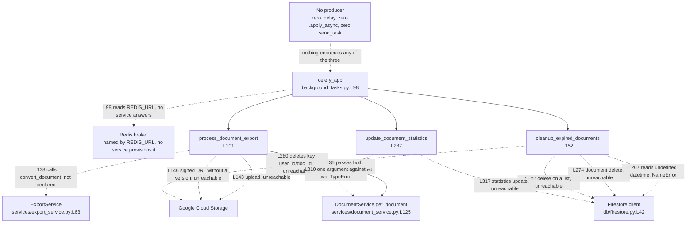

# backend/app/tasks

The Celery task tier. One module, `background_tasks.py`, holding 332 physical lines, one
Celery application, three task functions and no classes, documented as committed.

## Purpose

`backend/app/tasks` moves three jobs off the request path and onto a Celery queue. The three
are exporting a document to a file, deleting documents past their retention date, and
recounting a document's words and pages.

`background_tasks.py` builds the Celery application at `background_tasks.py:L98` and
registers the three tasks with the `@celery_app.task` decorator at `:L100`, `:L150` and
`:L286`. Four `@celery_app` decorators sit across those three functions, because
`cleanup_expired_documents` carries a second one at `:L151`.

The module does not import. `background_tasks.py:L92` requests `settings` from
`app.core.config`, which declares the `Settings` class at `core/config.py:L51` and a
`get_settings` factory at `:L126` and no module-level instance. L98 then reads
`settings.REDIS_URL` while the module body runs, so `import app.tasks.background_tasks`
raises `ImportError`.

Nothing enqueues these tasks. The repository holds no `.delay(` call, no `.apply_async`
call and no `send_task` call, and no module imports `background_tasks`.

## Key Components

| Component | Type | Location | Description |
| --- | --- | --- | --- |
| `celery_app` | Celery application instance | `background_tasks.py:L98` | Built at module scope as `Celery('microsoft_word', broker=settings.REDIS_URL)`. Carries a broker argument and no result backend. |
| `process_document_export` | Task function, three parameters, declared `-> str` | `background_tasks.py:L101`, decorated at `:L100` | Reads a document, converts it, uploads the file to Google Cloud Storage, and returns a signed Uniform Resource Locator (URL). Raises `AttributeError` at `:L138`, so the declared `str` never reaches a caller. |
| `cleanup_expired_documents` | Task function, no parameters, no return annotation | `background_tasks.py:L152`, decorated at `:L150` and `:L151` | Deletes every document past its retention date, plus that document's stored file, permission records and metadata record. Raises `NameError` at `:L267` before deleting anything. |
| `update_document_statistics` | Task function, one parameter, no return annotation | `background_tasks.py:L287`, decorated at `:L286` | Recounts words and pages and writes a `statistics` map onto the Firestore document. Raises `TypeError` at `:L310`. |

## Architecture Fit

The task tier sits beside the service tier and reaches persistence the same way a service
does. `background_tasks.py:L93` imports the module-level Firestore client built at
`db/firestore.py:L42`, and `:L94` imports `DocumentService` declared at
`services/document_service.py:L64`. No route module imports this one, so nothing in the
application programming interface (API) tier hands work to the queue. Repository-wide
layering sits in
[../../../docs/architecture-overview.md](../../../docs/architecture-overview.md), and the
package view sits in [../README.md](../README.md).

`documentation/Technical Specifications.md` anticipates both this tier and its broker. The
document names Celery as a distributed task queue for Python at `:L554`, under the
`TECHNOLOGY STACK > FRAMEWORKS AND LIBRARIES > Backend` heading at `L548`. The same
document names Redis on Google Cloud Memorystore at `:L584-L585`, under the
`TECHNOLOGY STACK > DATABASES` heading at `L563`. The document also names Google Cloud
Functions at `:L591`, under the `TECHNOLOGY STACK > THIRD-PARTY SERVICES` heading at
`L587`. The committed repository provisions no worker and no broker, and no committed file
uses Cloud Functions.
[../../../docs/deployment-guide.md](../../../docs/deployment-guide.md) carries the
infrastructure evidence.

The specification's export path differs from the committed one in two ways.
`documentation/Technical Specifications.md, SYSTEM ARCHITECTURE > SEQUENCE DIAGRAMS > Export Document Sequence (L241)`
diagrams six participants at `:L245-L250`: User, Frontend, API Gateway, ExportService,
DocumentService and Storage. No queue participant and no worker participant appears there.
The diagrammed flow is synchronous, with `A->>E: Process export` at `:L254` followed by
`E->>D: Fetch document` at `:L255`.

The committed code inverts both properties. `process_document_export` at
`background_tasks.py:L101` carries the `@celery_app.task` decorator at `:L100`, so a queue
stands between a caller and the work. The task reads from `DocumentService` itself at
`:L135` and then hands the result to `ExportService` at `:L138`, reversing the
ExportService-to-DocumentService direction the diagram shows.

## Dependencies

Three of the seven internal names below do not resolve, and one of the three stops the
module at import. Every external floor carries a code fact, because the repository commits
no backend dependency manifest, and
[../../../docs/decision-log.md](../../../docs/decision-log.md) records those inference
choices. [../services/README.md](../services/README.md) documents `DocumentService` and
`ExportService` themselves.
[../../../docs/integration-guide.md](../../../docs/integration-guide.md) labels the
external services these packages reach by reachability, and the absent worker, beat
scheduler and Memorystore instance sit in
[../../../docs/deployment-guide.md](../../../docs/deployment-guide.md).

### Internal

| Imported or called name | Site | Resolves | Evidence |
| --- | --- | --- | --- |
| `settings` from `app.core.config` | `background_tasks.py:L92` | No | `core/config.py` declares the `Settings` class at `:L51` and `get_settings` at `:L126`, and no module-level instance. `:L98` dereferences the name while the module body runs. |
| `db` from `app.db.firestore` | `background_tasks.py:L93` | Yes | `db/firestore.py:L42` builds the Firestore client at import time. |
| `DocumentService` from `app.services.document_service` | `background_tasks.py:L94` | Yes | Declared at `services/document_service.py:L64`. Both call sites are wrong: `:L135` never awaits the coroutine, and `:L310` passes one argument against two. |
| `ExportService` from `app.services.export_service` | `background_tasks.py:L95` | Yes | Declared at `services/export_service.py:L63`. The method `:L138` calls is not one of its two. |
| `convert_document` on `ExportService` | Called at `background_tasks.py:L138` | No | `services/export_service.py` declares `export_to_pdf` at `:L87` and `export_to_docx` at `:L168`, and no `convert_document`. |
| `timedelta` from `datetime` | `background_tasks.py:L96` | Yes | Read at `:L146` for the signed-URL expiry and at `:L151` for the decorator argument. |
| `datetime` | Read at `background_tasks.py:L267` and `:L321` | No | `:L96` imports `timedelta` alone. Both reads sit in function bodies, so each raises `NameError` at first call rather than at import. |

### External

| Distribution | Floor | Establishing code fact |
| --- | --- | --- |
| celery | 4 or 5 | `from celery import Celery` at `background_tasks.py:L90`, instantiated as `Celery('microsoft_word', broker=settings.REDIS_URL)` at `:L98`. |
| google-cloud-storage | Any | `from google.cloud.storage import Client` at `background_tasks.py:L91`. The module calls `bucket()` at `:L141` and `:L278`, `blob()` at `:L142` and `:L279`, `upload_from_file()` at `:L143`, `generate_signed_url()` at `:L146` and `delete()` at `:L280`. |
| redis | Any | `background_tasks.py:L98` builds a Redis broker URL. The package appears in no tracked file, so Celery reaches no broker until someone installs it. |

Raising the Celery floor cannot make `:L151` work. The `periodic_task` attribute that line
expects belongs to Celery 3, so no release at or above the floor above provides it.

## Configuration

`background_tasks.py` reads three settings, and `Settings` declares one of the three.
[../core/README.md](../core/README.md) classifies all fifteen settings the backend reads.

| Setting | Read at | Status |
| --- | --- | --- |
| `REDIS_URL` | `background_tasks.py:L98`, at import time | DECLARED at `core/config.py:L119` as `REDIS_URL: str`, with no default, so the field is required |
| `EXPORT_BUCKET_NAME` | `background_tasks.py:L141`, inside `process_document_export` | READ-BUT-NEVER-DECLARED |
| `DOCUMENT_BUCKET_NAME` | `background_tasks.py:L278`, inside `cleanup_expired_documents` | READ-BUT-NEVER-DECLARED |

`Settings` at `core/config.py:L51` declares nine fields at `:L111-L119`, and neither bucket
name is among them. Each undeclared read raises `AttributeError` on a `Settings` instance,
so the export task cannot name its bucket at `:L141` and the retention sweep cannot name
its bucket at `:L278`. No committed file supplies a value for either. `Config.env_file` at
`core/config.py:L123` points at a `.env` file that the repository does not commit.

## Data Flows

Every flow below starts at the Celery application at `background_tasks.py:L98` and ends in
Firestore or Google Cloud Storage. None of them runs, because no producer enqueues a task
and no committed file provisions the broker that `:L98` names. Dashed edges mark a call
that cannot complete as committed.



The export task writes one object key and the retention sweep reads another.
`process_document_export` builds `exports/{user_id}/{document_id}.{export_format}` at
`:L142`, while `cleanup_expired_documents` builds `{user_id}/{doc_id}` at `:L279`. A file
written by the first task is not found by the second, so the sweep at `:L280` addresses a
key no writer in the repository creates.

## Design Patterns

Four patterns are present in the code. `celery_app` at `background_tasks.py:L98` applies
task-queue offloading, moving work off the request path and onto a broker. `:L151` states
an intended scheduled retention sweep with `run_every=timedelta(days=1)`. `:L146` applies
signed-URL delivery, handing a caller a time-limited link instead of file bytes. `:L98`
also builds the application as a module-level instance during import, which is the same
import-time construction that `db/firestore.py:L42` uses for the Firestore client.

Six pieces that a working Celery deployment needs are absent, and each absence belongs to
this module rather than to Celery. No producer exists: no tracked file calls `.delay(`,
`.apply_async` or `send_task`. No worker descriptor and no beat schedule appears in the
repository, so the daily sweep `:L151` asks for has nothing to run it. `:L98` passes a
broker argument and no `backend` argument, so no result backend stores a return value, and
the `str` that `:L101` declares has nowhere to go. The three `@celery_app.task` decorators
at `:L100`, `:L150` and `:L286` pass no arguments, so no `autoretry_for`, `max_retries`,
`acks_late` or `time_limit` applies, and no task body holds a `try` block.

The retention sweep carries no idempotency guard either. The four deletes at `:L274`,
`:L280`, `:L283` and `:L284` run in sequence with no transaction and no compensating
action. A failure partway through leaves a document deleted while its stored file and its
metadata record survive.

## Known Limitations

The module carries two `HUMAN ASSISTANCE NEEDED` markers and no `TODO` markers. Both
markers open a task body, and both are reproduced verbatim below.

At `background_tasks.py:L128-L129`, opening `process_document_export`:

```python
    # HUMAN ASSISTANCE NEEDED
    # This function needs review for production readiness and error handling
```

At `background_tasks.py:L262-L263`, opening `cleanup_expired_documents`:

```python
    # HUMAN ASSISTANCE NEEDED
    # This function needs review for production readiness, error handling, and optimization
```

Failures arrive in three layers, and the first layer hides the other two. A reader who
repairs one layer meets the next.

1. **The module raises at import.** `background_tasks.py:L92` imports `settings`, which
   `app.core.config` never defines, and `:L98` dereferences it in the module body.
2. **The stacked decorator raises next.** `@celery_app.periodic_task` at `:L151` is not a
   Celery 4 or 5 application attribute, so evaluating that attribute raises
   `AttributeError` while the module body runs. `:L151` sits below `@celery_app.task` at
   `:L150`, so Python would apply `:L151` first, and neither application happens.
3. **Each task then fails on its own line.** The three first-failure points are `:L138`,
   `:L267` and `:L310`, listed per task below.

Per-task first failure and what the failure hides:

- **`process_document_export` raises `AttributeError` at `:L138`.** The call at `:L135`
  passes both required arguments, so argument binding succeeds, and `document` binds to a
  coroutine because the `async def` at `services/document_service.py:L125` is never
  awaited. `:L138` then calls `convert_document`, which `services/export_service.py`
  does not declare. `:L141`, `:L143`, `:L146` and the `return signed_url` at `:L148` never
  run, which is why the declared `-> str` at `:L101` delivers no value.
- **`cleanup_expired_documents` raises `NameError` at `:L267`.** `:L271`, `:L274`, `:L280`,
  `:L283` and `:L284` are all unreachable. The list `.delete()` at `:L283` is a real defect
  and is not the one that fires first.
- **`update_document_statistics` raises `TypeError` at `:L310`.** `get_document` declares
  `(self, document_id, user_id)` at `services/document_service.py:L125`, and `:L310` passes
  `document_id` alone. Python binds arguments at call time even for an `async def`, so the
  name `document` never binds at all. `:L313`, `:L314`, `:L317` and `:L321` are all
  unreachable, and the two defects at `:L314` and `:L321` surface only once `:L310` is
  fixed.

The remaining defects, each latent behind a failure above:

- **`:L283` calls `.delete()` on a list.**
  `db.collection('document_permissions').where('document_id', '==', doc_id).get()` returns
  a list of snapshots, and a list carries no `delete` method.
- **`:L314` reads `document.pages`, which no contract declares.** `Document` at
  `schema/document.py:L98` declares `id` at `:L112`, `created_at` at `:L113` and
  `updated_at` at `:L114`. The model inherits `title` at `:L66`, `content` at `:L67` and
  `owner_id` at `:L68` from `DocumentBase` at `:L57`. Six fields, and no `pages`.
- **`:L321` reads the undefined `datetime`,** as does `:L267`. `:L96` imports `timedelta`
  alone.
- **`:L146` generates a signed URL with no `version` argument,** so the call defaults to
  version 2. `services/export_service.py:L161` and `:L235` both pass `version="v4"` for
  the same kind of artifact, so the two paths sign differently.
- **Two object-key layouts describe the same artifact.** `:L142` writes
  `exports/{user_id}/{document_id}.{export_format}` and `:L279` deletes
  `{user_id}/{doc_id}`.
- **`:L264` binds `document_service` and no later line in `cleanup_expired_documents`
  reads it.** The name appears exactly once across the function body.
- **`:L141` and `:L278` read settings that `Settings` never declares,** so each raises
  `AttributeError` once the import failure clears.
- **The queue has no producer, no worker and no broker.** Nothing enqueues the three tasks,
  no worker process or beat scheduler appears in the repository, and no committed file
  provisions the Redis instance `:L98` names. Every task therefore stays unrun even after
  the code defects above are fixed.

The repository-wide defect register, with the same evidence grouped by symptom, sits in
[../../../docs/troubleshooting.md](../../../docs/troubleshooting.md).

## Usage Examples

The three declared task shapes are below, taken from each signature line. No example in
this section runs today, and one blocker covers all three. The module raises `ImportError`
at `background_tasks.py:L92`, so no name inside it can be reached.

```python
# background_tasks.py:L98
celery_app = Celery('microsoft_word', broker=settings.REDIS_URL)

# background_tasks.py:L101, decorated at L100
process_document_export(document_id: str, export_format: str, user_id: str) -> str

# background_tasks.py:L152, decorated at L150 and L151
cleanup_expired_documents()

# background_tasks.py:L287, decorated at L286
update_document_statistics(document_id: str)
```

A caller would enqueue the export task through the Celery task interface, naming the three
declared parameters:

```python
from app.tasks.background_tasks import process_document_export

process_document_export.delay(
    document_id="doc-1",
    export_format="pdf",
    user_id="user-1",
)
```

The call above cannot run. The import on its first line raises `ImportError` at
`background_tasks.py:L92`. No tracked file makes a call of this shape either: the
repository holds zero `.delay(` calls, zero `.apply_async` calls and zero `send_task`
calls, and no module imports `background_tasks`.

Reproduce the import failure from the `backend` directory, which is the root that makes the
`app.*` prefix resolvable:

```bash
cd backend
python -c "import app.tasks.background_tasks"
```

The command prints the chain that stops every task in this module:

```text
File "app/tasks/background_tasks.py", line 92, in <module>
    from app.core.config import settings
ImportError: cannot import name 'settings' from 'app.core.config'
```

A worker would attach to the application object by module path, and a second process would
run the daily sweep the decorator at `:L151` asks for:

```bash
celery -A app.tasks.background_tasks worker --loglevel=info
celery -A app.tasks.background_tasks beat --loglevel=info
```

Neither command works as committed. Both import the module and hit `:L92`, and both need
the Redis broker that `:L98` names and that no committed file provisions. The `beat`
command also has no schedule to read, because `:L151` raises rather than registering one.

Environment steps, version prerequisites and the order to repair these blockers in belong
in [../../../docs/onboarding.md](../../../docs/onboarding.md).
