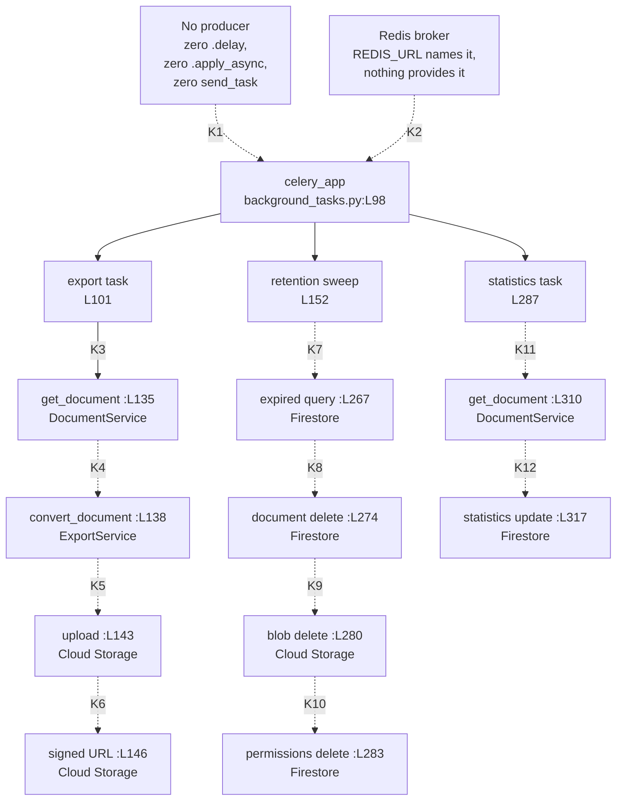

# backend/app/tasks

The Celery task tier. One module, `background_tasks.py`, holding 332 physical lines, one Celery application, three task functions and
no classes, documented as committed.

*Citation convention: an unqualified `:Lnnn` locator continues the file named most recently before it. Every locator numbers the
current branch head, which includes the docstrings this pass added.*

## Purpose

`backend/app/tasks` moves three jobs off the request path and onto a Celery queue. The three are exporting a document to a file,
deleting documents past their retention date, and recounting a document's words and pages.

`background_tasks.py` builds the Celery application at `background_tasks.py:L98` and registers the three tasks with the
`@celery_app.task` decorator at `:L100`, `:L150` and `:L286`. Four `@celery_app` decorators sit across those three functions, because
`cleanup_expired_documents` carries a second one at `:L151`.

The module does not import. `background_tasks.py:L92` requests `settings` from `app.core.config`, which declares the `Settings` class
at `core/config.py:L51` and a `get_settings` factory at `:L126` and no module-level instance, so `import app.tasks.background_tasks`
raises `ImportError`. `:L98` then reads `settings.REDIS_URL` while the module body runs.

Nothing enqueues these tasks. The repository holds no `.delay(` call, no `.apply_async` call and no `send_task` call, and no module
imports `background_tasks`.

## Key Components

| Component | Type | Location | Description |
| --- | --- | --- | --- |
| `celery_app` | Celery application instance | `background_tasks.py:L98` | Built at module scope as `Celery('microsoft_word', broker=settings.REDIS_URL)`. Carries a broker argument and no result backend. |
| `process_document_export` | Task function, three parameters, declared `-> str` | `background_tasks.py:L101`, decorated at `:L100` | Reads a document, converts it, uploads the file to Google Cloud Storage, and returns a signed Uniform Resource Locator (URL). Raises `AttributeError` at `:L138`, so the declared `str` never reaches a caller. |
| `cleanup_expired_documents` | Task function, no parameters, no return annotation | `background_tasks.py:L152`, decorated at `:L150` and `:L151` | Selects on `expiration_date` at `:L267` with no limit or cursor, then deletes each document, its stored file, its permission records and its metadata record. Builds a Storage `Client()` per record at `:L277`. Raises `NameError` at `:L267` before deleting anything. |
| `update_document_statistics` | Task function, one parameter, no return annotation | `background_tasks.py:L287`, decorated at `:L286` | Reads `content` at `:L313` and `pages` at `:L314`, then writes `statistics.word_count`, `.page_count` and `.last_updated` at `:L319` to `:L321`. Raises `TypeError` at `:L310`. |

## Architecture Fit

The task tier sits beside the service tier and reaches persistence the same way a service does. `background_tasks.py:L93` imports the
module-level Firestore client built at `db/firestore.py:L42`, and `:L94` imports `DocumentService` declared at
`services/document_service.py:L64`. No route module imports this one, so nothing in the application programming interface (API) tier
hands work to the queue. Repository-wide layering sits in
[../../../docs/architecture-overview.md](../../../docs/architecture-overview.md), the package view in [../README.md](../README.md).

`documentation/Technical Specifications.md` anticipates both this tier and its broker. The document names Celery as a distributed task
queue for Python at `:L554`, under the `TECHNOLOGY STACK > FRAMEWORKS AND LIBRARIES > Backend` heading at `L548`. The same document
names Redis on Google Cloud Memorystore at `:L584-L585`, under the `TECHNOLOGY STACK > DATABASES` heading at `L563`. The document also
names Google Cloud Functions at `:L591`, under the `TECHNOLOGY STACK > THIRD-PARTY SERVICES` heading at `L587`. The committed
repository provisions no worker and no broker, and no committed file uses Cloud Functions.
[../../../docs/deployment-guide.md](../../../docs/deployment-guide.md) carries the infrastructure evidence.

The specification's export path differs from the committed one in two ways.
`documentation/Technical Specifications.md, SYSTEM ARCHITECTURE > SEQUENCE DIAGRAMS > Export Document Sequence (L241)` diagrams six
participants at `:L245-L250`: User, Frontend, API Gateway, ExportService, DocumentService and Storage. No queue participant and no
worker participant appears there. The diagrammed flow is synchronous, with `A->>E: Process export` at `:L254` followed by
`E->>D: Fetch document` at `:L255`.

The committed code inverts both properties. `process_document_export` at `background_tasks.py:L101` carries the `@celery_app.task`
decorator at `:L100`, so a queue stands between a caller and the work. The task reads from `DocumentService` itself at `:L135` and
then hands the result to `ExportService` at `:L138`, reversing the ExportService-to-DocumentService direction the diagram shows.

## Dependencies

Three of the seven internal names below do not resolve, and one of the three stops the module at import. Every external floor carries
a code fact, because the repository commits no backend dependency manifest. The planned, not yet committed
[decision log](../../../docs/decision-log.md) will record those inference choices. [../services/README.md](../services/README.md)
documents `DocumentService` and `ExportService` themselves. [../../../docs/integration-guide.md](../../../docs/integration-guide.md)
labels the external services these packages reach by reachability, and the absent worker, beat scheduler and Memorystore instance sit
in [../../../docs/deployment-guide.md](../../../docs/deployment-guide.md).

### Internal

| Imported or called name | Site | Resolves | Evidence |
| --- | --- | --- | --- |
| `settings` from `app.core.config` | `background_tasks.py:L92` | No | `core/config.py` declares the `Settings` class at `:L51` and `get_settings` at `:L126`, and no module-level instance. `:L98` dereferences the name while the module body runs. |
| `db` from `app.db.firestore` | `background_tasks.py:L93` | Yes | `db/firestore.py:L40` builds the Firestore client at import time. |
| `DocumentService` from `app.services.document_service` | `background_tasks.py:L94` | Yes | Declared at `services/document_service.py:L62`. Both call sites are wrong: `background_tasks.py:L135` never awaits the coroutine, and `:L310` passes one argument against two. |
| `ExportService` from `app.services.export_service` | `background_tasks.py:L95` | Yes | Declared at `services/export_service.py:L63`. The method `:L138` calls is not one of its two. |
| `convert_document` on `ExportService` | Called at `background_tasks.py:L138` | No | `services/export_service.py` declares `export_to_pdf` at `:L87` and `export_to_docx` at `:L168`, and no `convert_document`. |
| `timedelta` from `datetime` | `background_tasks.py:L96` | Yes | Read at `:L146` for the signed-URL expiry and at `:L151` for the decorator argument. |
| `datetime` | Read at `background_tasks.py:L267` and `:L321` | No | `:L96` imports `timedelta` alone. Both reads sit in function bodies, so each raises `NameError` at first call rather than at import. |

### External

No Python dependency manifest and no lock file is committed anywhere, so each row records what the code requires rather than a
supported version. "Unestablished" means nothing here pins the distribution, and is not a statement that any release is safe. A
reviewed manifest and lock file is required future work.

| Distribution | Floor | Establishing code fact |
| --- | --- | --- |
| celery | 4 or 5 | `from celery import Celery` at `background_tasks.py:L90`, instantiated as `Celery('microsoft_word', broker=settings.REDIS_URL)` at `:L98`. |
| google-cloud-storage | Any | `from google.cloud.storage import Client` at `background_tasks.py:L91`. The module calls `bucket()` at `:L141` and `:L278`, `blob()` at `:L142` and `:L279`, `upload_from_file()` at `:L143`, `generate_signed_url()` at `:L146` and `delete()` at `:L280`. |
| redis | Any | `background_tasks.py:L98` builds a Redis broker URL. No dependency manifest declares the client library, because the repository commits no Python manifest at all, so Celery reaches no broker until someone installs it. |

Raising the Celery version cannot make `:L151` work. The `periodic_task` attribute that line expects belongs to Celery 3, so no
release in the 4 or 5 series provides it.

## Configuration

`background_tasks.py` reads three settings and `Settings` declares one. All fifteen backend settings are classified in
[../core/README.md](../core/README.md).

| Setting | Read at | Status |
| --- | --- | --- |
| `REDIS_URL` | `background_tasks.py:L98`, at import time | DECLARED at `core/config.py:L119` as `REDIS_URL: str`, with no default, so the field is required |
| `EXPORT_BUCKET_NAME` | `background_tasks.py:L141`, inside `process_document_export` | READ-BUT-NEVER-DECLARED |
| `DOCUMENT_BUCKET_NAME` | `background_tasks.py:L278`, inside `cleanup_expired_documents` | READ-BUT-NEVER-DECLARED |

`Settings` at `core/config.py:L51` declares nine fields at `:L111-L119`, and neither bucket name is among them. Each undeclared read
raises `AttributeError` on a `Settings` instance, so the export task cannot name its bucket at `background_tasks.py:L141` and the
retention sweep cannot name its bucket at `:L278`. No committed file supplies a value for either, and `Config.env_file` at
`core/config.py:L123` names a `.env` file the repository does not commit.

## Data Flows

Every flow below starts at the Celery application at `background_tasks.py:L98` and ends in Firestore or Google Cloud Storage. None
runs, because no producer enqueues a task and no committed file provisions the broker `:L98` names. Each column lists one task's
call sites in source order, an edge points to the next call site, and a dashed edge means the site it points to cannot complete as
committed. Every labelled edge carries a key, and the table under the diagram resolves each key to its call and its blocker.



Twelve edges carry a key. The three unlabelled edges from `celery_app` are the `@celery_app.task` registrations at `:L100`, `:L150`
and `:L286`. The retention sweep carries a second decorator, `@celery_app.periodic_task` at `:L151`, which is not a Celery 4 or 5
application method.

| Key | Edge | Call as committed | What stands in the way |
| --- | --- | --- | --- |
| K1 | No producer to `celery_app` | none. The repository contains zero `.delay`, zero `.apply_async` and zero `send_task` calls | Nothing enqueues any of the three tasks, so the queue has no producer |
| K2 | Redis broker to `celery_app` | `background_tasks.py:L98` passes `broker=settings.REDIS_URL` to `Celery` | No committed file provisions Redis. `REDIS_URL` is declared on `Settings`, but no Compose service and no Terraform resource creates a broker |
| K3 | `export task` to `get_document :L135` | `background_tasks.py:L135` calls `document_service.get_document(document_id, user_id)` | Nothing. This is the one call site that supplies both arguments declared at `document_service.py:L123`, which is why the edge is solid. The result is never awaited, and the task around it still cannot run |
| K4 | `get_document :L135` to `convert_document :L138` | `background_tasks.py:L138` calls `export_service.convert_document(document, export_format)` | `ExportService` declares only `__init__`, `export_to_pdf` and `export_to_docx`, so `convert_document` does not exist |
| K5 | `convert_document :L138` to `upload :L143` | `background_tasks.py:L143` calls `blob.upload_from_file(exported_file)` | Unreachable. `:L138` raises first |
| K6 | `upload :L143` to `signed URL :L146` | `background_tasks.py:L146` calls `blob.generate_signed_url(expiration=timedelta(hours=1))` | Unreachable, and the call omits `version="v4"` |
| K7 | `retention sweep` to `expired query :L267` | `background_tasks.py:L267` filters `expiration_date` against `datetime.now()` | `NameError`. `:L96` imports `timedelta` alone, so `datetime` is never bound |
| K8 | `expired query :L267` to `document delete :L274` | `background_tasks.py:L274` deletes one document by id | Unreachable. `:L267` raises first |
| K9 | `document delete :L274` to `blob delete :L280` | `background_tasks.py:L280` deletes the blob keyed `{user_id}/{doc_id}` built at `:L279` | Unreachable, and that key does not match the `exports/{user_id}/{document_id}.{export_format}` key the export task writes at `:L142` |
| K10 | `blob delete :L280` to `permissions delete :L283` | `background_tasks.py:L283` calls `.delete()` on the result of `.get()` | Unreachable, and `.get()` returns a list, which has no `.delete()` |
| K11 | `statistics task` to `get_document :L310` | `background_tasks.py:L310` calls `document_service.get_document(document_id)` | `TypeError`. One argument against the two declared at `document_service.py:L123` |
| K12 | `get_document :L310` to `statistics update :L317` | `background_tasks.py:L317` updates the document's `statistics` map | Unreachable, and the map reads `datetime.now()` at `:L321`, so this site carries the same `NameError` as K7 |

The export task writes one object key and the retention sweep reads another. `process_document_export` builds
`exports/{user_id}/{document_id}.{export_format}` at `:L142`, while `cleanup_expired_documents` builds `{user_id}/{doc_id}` at
`:L279`. A file written by the first task is not found by the second, so the sweep at `:L280` addresses a key no writer in the
repository creates.

Seven Firestore document fields cross this boundary. Three are written here and nowhere else, and two are read here with no writer
anywhere.

| Field | Task and site | Direction | Writer in the repository |
| --- | --- | --- | --- |
| `expiration_date` | `cleanup_expired_documents`, filter at `:L267` | Read | **None.** No committed line writes this field |
| `user_id` | `cleanup_expired_documents`, `doc.get('user_id')` at `:L271` | Read | `services/document_service.py:L116` |
| `content` | `update_document_statistics`, `:L313` | Read | `services/document_service.py:L118`, from `DocumentCreate` |
| `pages` | `update_document_statistics`, `:L314` | Read | **None.** No contract declares the field |
| `statistics.word_count` | `update_document_statistics`, `:L319` | Write | This task only |
| `statistics.page_count` | `update_document_statistics`, `:L320` | Write | This task only |
| `statistics.last_updated` | `update_document_statistics`, `:L321` | Write | This task only |

The retention sweep selects on a field nothing creates. `:L267` filters
`where('expiration_date', '<=', datetime.now())`, and no service method, no route handler and
no other task writes `expiration_date`. Once the `NameError` at `:L267` clears, the query
returns an empty result against every document ever stored, so the sweep deletes nothing
rather than the wrong records. The three `statistics` subfields at `:L319` to `:L321` sit
under one map key written at `:L317`, and no reader consumes them. Neither
`../schema/document.py` nor any frontend module names a `statistics` field.

## Design Patterns

Four patterns are present in the code. `celery_app` at `background_tasks.py:L98` applies task-queue offloading, moving work off the
request path and onto a broker. `:L151` states an intended scheduled retention sweep with `run_every=timedelta(days=1)`. `:L146`
applies signed-URL delivery, handing a caller a time-limited link instead of file bytes. `:L98` also builds the application as a
module-level instance during import, the same import-time construction `db/firestore.py:L42` uses for the Firestore client.

Six pieces that a working Celery deployment needs are absent, and each absence belongs to this module rather than to Celery. No
producer exists: no tracked file calls `.delay(`, `.apply_async` or `send_task`. No worker descriptor and no beat schedule appears in
the repository, so the daily sweep `background_tasks.py:L151` asks for has nothing to run it. `:L98` passes a broker argument and no
`backend` argument, so no result backend stores a return value, and the `str` that `:L101` declares has nowhere to go. The three
`@celery_app.task` decorators at `:L100`, `:L150` and `:L286` pass no arguments, so no `autoretry_for`, `max_retries`, `acks_late` or
`time_limit` applies, and no task body holds a `try` block.

The retention sweep carries no idempotency guard and deletes in an order that cannot be undone. Its loop body raises at five
successive points once the earlier layers clear: `:L271` on a record with no `user_id` key, `:L278` on the undeclared
`settings.DOCUMENT_BUCKET_NAME`, `:L280` on an object key no writer produces, `:L283` on `.delete()` against a list, and nothing at
all after `:L284`. The Firestore document goes first, at `:L274`, so every one of those raises leaves the record gone and its file,
permissions and metadata behind. No `try` guards the loop, so the first raise abandons every remaining expired document too.
[../../../docs/troubleshooting.md](../../../docs/troubleshooting.md#the-retention-sweep-fails-partway-and-leaves-records-behind)
traces each step and the state it leaves.

## Known Limitations

### Broker trust boundary

The queue is absent, and its absence is not a control. Every task here treats the message as trusted input. `:L101` declares
`document_id`, `export_format` and `user_id` as plain parameters, and no line in any task body checks any of the three. A publisher
that reaches the broker therefore chooses the identity the work runs under, and the worker runs that work with the ambient service
credentials `db/firestore.py:L39` discovers and `:L40` binds. The eight prerequisites below have to exist before any enqueue path is
exposed, and none exists today.

| Prerequisite | State as committed | Evidence |
| --- | --- | --- |
| Authenticated and authorized producers | Absent. The publisher asserts identity through `user_id`, and `:L135` calls `get_document(document_id, user_id)` on an `async def` without awaiting it, so the ownership comparison at `services/document_service.py:L177` never runs. Awaiting it would check only the pair the message supplied, so knowledge of any document identifier and its owner would authorize the export. | `:L101`, `:L135` |
| Broker transport security and access control | Unestablished. `:L98` reads `settings.REDIS_URL`, a bare string at `core/config.py:L119` with no scheme, credential or peer requirement, and no committed file provisions the instance, so no password, no access control list and no `rediss://` transport exists to review. | `:L98`, `core/config.py:L119` |
| Message schema and size validation | Absent. Celery binds the three declared arguments, and no body line validates the type, the length or the content of any of them. | `:L101` |
| `export_format` allow-listing | Absent. `:L138` hands the value to a conversion call and `:L142` interpolates it into the object key extension, so a publisher chooses the extension the stored object carries. | `:L138`, `:L142` |
| Object key confinement | Absent as committed, because the unawaited call at `:L135` leaves `user_id` unchecked before `:L142` builds `exports/{user_id}/{document_id}.{export_format}`. Awaiting the call would tie the prefix to the stored owner and would leave the extension segment publisher-controlled. | `:L142`, `:L143` |
| Idempotency | Absent. The three decorators pass no arguments, so no `acks_late`, `time_limit` or retry policy applies, and a redelivered message repeats the whole body, including the overwrite at `:L143` and the four deletes at `:L274`, `:L280`, `:L283` and `:L284`. | `:L100`, `:L150`, `:L286` |
| Least-privilege workers | Absent. `:L93` binds the module-level Firestore client, `:L141` and `:L277` construct Cloud Storage clients, and the sweep deletes documents, stored files, permission records and metadata, so a publisher who can enqueue reaches delete authority across the project. | `:L93`, `:L274`, `:L280`, `:L283`, `:L284` |
| Result confidentiality | `:L148` returns a signed URL, which is a bearer credential, and `:L98` configures no result backend, so no reviewed store and no retention rule covers the returned value. | `:L98`, `:L146`, `:L148` |

Two of those rows belong to a broker deployment rather than to this code: producer authentication and transport security are Redis
configuration, and no committed file provisions Redis. The other six are code changes in this module.

### Markers and per-file defects

The module carries two `HUMAN ASSISTANCE NEEDED` markers and no `TODO` markers. Both markers open a task body, and
both are reproduced verbatim below.

| Marker location | Opens | Guidance on the line below |
| --- | --- | --- |
| `background_tasks.py:L128-L129` | `process_document_export` | "This function needs review for production readiness and error handling" |
| `background_tasks.py:L262-L263` | `cleanup_expired_documents` | "This function needs review for production readiness, error handling, and optimization" |

Failures arrive in three layers, and the first hides the other two. A reader who repairs one layer meets the next.

1. **The module raises at import.** `background_tasks.py:L92` imports `settings`, which `app.core.config` never defines, and `:L98`
   dereferences it in the module body.
2. **The stacked decorator raises next.** `@celery_app.periodic_task` at `:L151` is not a Celery 4 or 5 application attribute, so
   evaluating that attribute raises `AttributeError` while the module body runs. `:L151` sits below `@celery_app.task` at `:L150`, so
   Python would apply `:L151` first, and neither application happens.
3. **Each task then fails on its own line.** The three first-failure points are `:L138`, `:L267` and `:L310`, listed per task below.

Per-task first failure and what the failure hides:

- **`process_document_export` raises `AttributeError` at `:L138`.** The call at `:L135` passes both required arguments, so binding
  succeeds, and `document` binds to a coroutine because the `async def` at `services/document_service.py:L123` is never awaited.
  `background_tasks.py:L138` then calls `convert_document`, which `services/export_service.py` does not declare.
  `background_tasks.py:L141`, `:L143`, `:L146` and the `return signed_url` at `:L148` never run, so the declared `-> str` at `:L101`
  delivers no value.
- **`cleanup_expired_documents` raises `NameError` at `background_tasks.py:L267`.** `:L271`, `:L274`, `:L280`, `:L283` and `:L284` are
  all unreachable. The list `.delete()` at `:L283` is a real defect and is not the one that fires first.
- **`update_document_statistics` raises `TypeError` at `background_tasks.py:L310`.** `get_document` declares
  `(self, document_id, user_id)` at `services/document_service.py:L123`, and `background_tasks.py:L310` passes `document_id` alone.
  Python binds arguments at call time even for an `async def`, so `document` never binds at all. `:L313`, `:L314`, `:L317` and `:L321`
  are all unreachable, and the two defects at `:L314` and `:L321` surface only once `:L310` is fixed.

The remaining defects, each latent behind a failure above:

- **`background_tasks.py:L283` calls `.delete()` on a list.**
  `db.collection('document_permissions').where('document_id', '==', doc_id).get()` returns a list of snapshots, and a list carries no
  `delete` method.
- **`background_tasks.py:L314` reads `document.pages`, which no contract declares.** `Document` at `schema/document.py:L98` declares
  `id` at `:L112`, `created_at` at `:L113` and `updated_at` at `:L114`. The model inherits `title` at `schema/document.py:L66`,
  `content` at `:L67` and `owner_id` at `:L68` from `DocumentBase` at `:L57`. Six fields, and no `pages`.
- **`background_tasks.py:L321` reads the undefined `datetime`,** as does `:L267`. `:L96` imports `timedelta` alone.
- **`background_tasks.py:L146` generates a signed URL with no `version` argument,** so the call defaults to version 2.
  `services/export_service.py:L161` and `:L235` both pass `version="v4"` for the same kind of artifact, so the two paths sign
  differently.
- **Two object-key layouts describe the same artifact,** `exports/{user_id}/{document_id}.{export_format}` at
  `background_tasks.py:L142` against `{user_id}/{doc_id}` at `:L279`, as the Data Flows section traces.
- **`background_tasks.py:L264` binds `document_service` and no later line in `cleanup_expired_documents` reads it.** The name appears
  exactly once across the body.
- **`background_tasks.py:L141` and `:L278` read settings that `Settings` never declares,** so each raises `AttributeError` once the
  import failure clears.
- **The queue has no producer, no worker and no broker,** so every task stays unrun even after the code defects above are fixed. The
  Design Patterns section lists the six missing deployment pieces with their evidence.

The repository-wide defect register, with the same evidence grouped by symptom, sits in
[../../../docs/troubleshooting.md](../../../docs/troubleshooting.md).

## Usage Examples

The three declared task shapes are below, taken from each signature line and shown with an elided body so the block parses. No example
here runs today: the module raises `ImportError` at `background_tasks.py:L92`, so no name inside it can be reached.

```python
# background_tasks.py:L98
celery_app = Celery('microsoft_word', broker=settings.REDIS_URL)

# background_tasks.py:L101, decorated at L100
def process_document_export(document_id: str, export_format: str, user_id: str) -> str: ...

# background_tasks.py:L152, decorated at L150 and L151
def cleanup_expired_documents(): ...

# background_tasks.py:L287, decorated at L286
def update_document_statistics(document_id: str): ...
```

A caller would enqueue the export task through the Celery task interface, naming the three declared parameters. **Do not run this
shape against a reachable broker.** The enqueue below is privileged: the publisher supplies all three arguments, and the worker adopts
the supplied `user_id` as the acting identity. `export_format` reaches the stored object key at `:L142`. Read it as the declared task
signature rather than as a usage pattern, and satisfy the eight prerequisites in [Broker trust boundary](#broker-trust-boundary)
before any producer is allowed to publish.

```python
from app.tasks.background_tasks import process_document_export

process_document_export.delay(
    document_id="doc-1",
    export_format="pdf",
    user_id="user-1",
)
```

The call above cannot run. The import on its first line raises `ImportError` at `background_tasks.py:L92`. No tracked file makes a
call of this shape either: the repository holds zero `.delay(`, zero `.apply_async` and zero `send_task` calls, and no module imports
`background_tasks`.

Reproduce the import failure from the `backend` directory, the root that makes the `app.*` prefix resolvable:

```bash
cd backend
python -c "import app.tasks.background_tasks"
```

The command prints the chain that stops every task in this module:

```text
File "app/tasks/background_tasks.py", line 92, in <module>
    from app.core.config import settings
ImportError: cannot import name 'settings' from 'app.core.config'
```

A worker would attach to the application object by module path, and a second process would run the daily sweep the decorator at
`:L151` asks for:

```bash
celery -A app.tasks.background_tasks worker --loglevel=info
celery -A app.tasks.background_tasks beat --loglevel=info
```

Neither command works as committed. Both import the module and hit `:L92`, and both need the Redis broker `:L98` names and no
committed file provisions. The `beat` command also has no schedule to read, because `:L151` raises rather than registering one.
Environment steps, version prerequisites and the repair order belong in [../../../docs/onboarding.md](../../../docs/onboarding.md).
