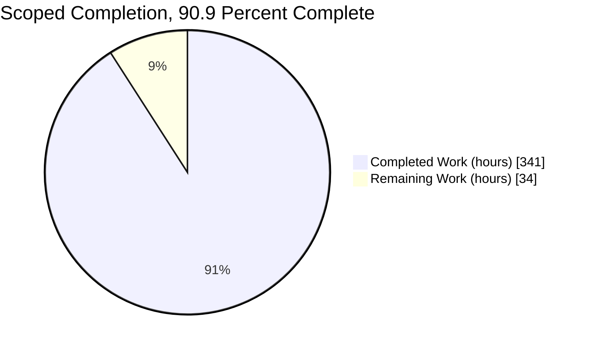
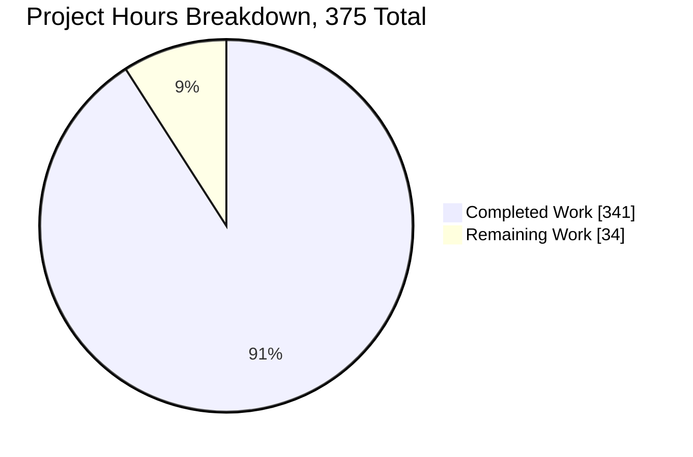
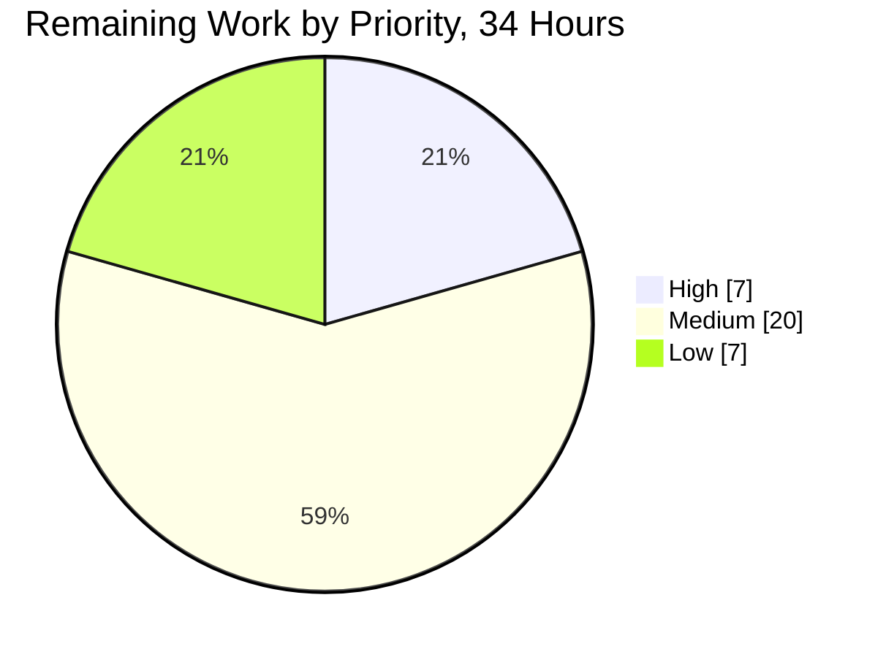
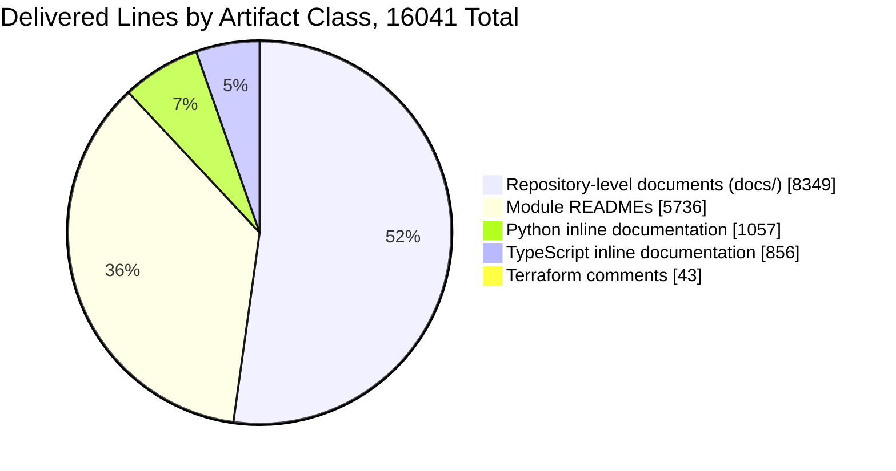

# 1. Executive Summary

## 1.1 Project Overview

`microsoft-word-u33ko0` is an early-stage browser-based word processor: a FastAPI backend on Google Cloud, a React and TypeScript client with Draft.js editing, and Terraform plus Docker infrastructure. This engagement built a complete documentation layer over that scaffold and changed no production logic. Any engineer inheriting the repository now gets a README in every source directory, nine repository-level references under `docs/`, and docstrings or JSDoc on every module, each claim carrying a file-and-line locator. The scaffold does not build or run as committed, so the documentation records that state with evidence rather than describing an aspiration.

## 1.2 Completion Status



Completed = Dark Blue `#5B39F3` · Remaining = White `#FFFFFF`.

| Metric | Value |
| --- | --- |
| Total Hours | 375 |
| Completed Hours (AI + Manual) | 341 (341 autonomous, 0 manual) |
| Remaining Hours | 34 |
| Percent Complete | **90.9%** |

341 / (341 + 34) × 100 = 90.9%. Every hour traces to a named requirement or a path-to-production activity.

## 1.3 Key Accomplishments

- [x] 19 module READMEs, one per source directory, each holding the nine mandated headings in exact order across 196–399 lines
- [x] 9 repository-level references under `docs/`, 8,349 lines: architecture, data model, integrations, deployment, troubleshooting, onboarding, decision log, clarity record, index
- [x] Inline documentation on all 44 source files: 73 Python docstrings, 26 TypeScript file headers with 98 JSDoc blocks, 43 Terraform comments
- [x] Coverage from zero to complete: 15/15 modules, 15/15 classes, 43/43 functions, 26/26 file headers
- [x] 3,644 citations resolve in range, 930 link targets resolve, 24 diagrams render, 0 lint findings
- [x] Behaviour neutrality proven four ways: identical syntax trees, byte-identical emitted JavaScript, identical Terraform models, unchanged 76-error type-check profile
- [x] All 27 assistance markers and 15 deferred-work comments preserved byte-for-byte, each referenced from a Known Limitations entry
- [x] A defect register across eight gap classes, plus a 330-row bidirectional traceability matrix with no uncovered construct

## 1.4 Critical Unresolved Issues

| Issue | Impact | Owner | ETA |
| --- | --- | --- | --- |
| The root `README.md` still carries five statements that contradict the tree, and nothing links into `docs/` from the repository front door | A reader arriving at the root meets wrong setup instructions first, and the documentation set has no entry point from there | Repository owner | 3h |
| 538 bare line references inside the docstrings of 14 backend modules number the pre-documentation file rather than current line positions | A reader following one may land on the wrong line of the right file. Eleven of those modules declare the convention in their own header; the rest leave it implicit | Backend maintainer | 8h |
| Rendering has not been exercised on the published repository | The 24 Mermaid diagrams and 309 tables are proven against a local renderer and `mermaid-cli` only | Repository owner | 4h |
| No committed gate re-checks the 3,644 citations or the 38 outbound URLs | Locators and links can rot silently once the scaffold is repaired | Platform/CI owner | 7h |
| The inline documentation across 44 source files is exercised by no test | Docstring and JSDoc text is proven parse-safe and behaviour-neutral, but nothing asserts its factual content | Documentation reviewer | 6h |

Cross-reference: rows one and two are also recorded as divergences in Section 5.2.

## 1.5 Access Issues

| System/Resource | Type of Access | Issue Description | Resolution Status | Owner |
| --- | --- | --- | --- | --- |
| Google Cloud project — Firestore, Cloud Storage, Pub/Sub | Service-account credentials | No credential is committed and `GOOGLE_APPLICATION_CREDENTIALS` has no default (`backend/app/core/config.py:L46`). Every cloud client is constructed at import time, so no integration can be exercised even once the import blocker clears | Open — documented in `docs/integration-guide.md` | Cloud owner |
| Redis broker for Celery | Running service | `REDIS_URL` is declared (`backend/app/core/config.py:L48`) while `infrastructure/docker/docker-compose.yml` provisions only `frontend`, `backend` and `db`, and Terraform declares no Memorystore | Open — documented in `docs/deployment-guide.md` | Platform owner |
| PostgreSQL / Cloud SQL path | Running instance | `DATABASE_URL` has no default, no `.env` is committed although `backend/app/core/config.py:L60` names one, and the SQLAlchemy engine is built at import time (`backend/app/db/sql.py:L16`) | Open — documented in `backend/app/db/README.md` | Platform owner |
| Git remote | Push permission | The branch is complete locally and has not been published | Pending publication | Repository owner |
| npm and PyPI registries | Network | Both reachable. `npm install` resolves the frontend tree and the ephemeral documentation validators run | No issue | — |

## 1.6 Recommended Next Steps

1. **[High]** Publish the branch, then load all 28 documents on the published repository and confirm the diagrams, tables and links render under GitHub's own renderer.
2. **[High]** Bring the root `README.md` into scope: correct its five inaccurate statements and add a Documentation section linking `docs/README.md`.
3. **[Medium]** Work the ordered repair list in `docs/onboarding.md`, starting with the missing `settings` singleton and the four router symbol names.
4. **[Medium]** Wire the locator sweep and link check into CI so the 3,644 citations cannot rot as the scaffold changes.
5. **[Low]** Settle the two open conventions: bare-locator numbering inside backend docstrings, and README length allocation.

# 2. Project Hours Breakdown

## 2.1 Completed Work Detail

| Component | Hours | Description |
| --- | --- | --- |
| Backend module READMEs | 48 | 8 files, 2,636 lines covering `backend/app/` and its six subpackages plus `backend/tests/`. Each documents its files, the third-party packages it actually imports, the configuration it reads, its patterns and its limitations, with a locator on every claim |
| Frontend module READMEs | 36 | 7 files, 1,920 lines covering `frontend/src/` and its six subfolders. Includes the combined component census and the causal chain from the missing schema export to its downstream type errors |
| Infrastructure and automation READMEs | 26 | 4 files, 1,180 lines covering `infrastructure/terraform/`, `infrastructure/docker/`, `.github/workflows/` and `scripts/`, each naming the exact step at which its asset fails |
| Architecture overview, data model and integration guide | 35 | 2,035 lines. Six-area system map with a broken-edge overlay, the dual-persistence contract reality including the four-position ownership drift, and each external integration labelled reachable or scaffolded-only |
| Deployment guide and troubleshooting register | 40 | 2,685 lines. What each infrastructure asset does today, the ordered reasons a deploy fails, and a defect register spanning eight gap classes with file-and-line evidence per entry |
| Onboarding guide | 18 | 1,098 lines across 12 sections: domain context, prerequisites, frontend and backend setup, what runs today, where a run stops with evidence, pitfalls, how to extend, and an ordered next-task list |
| Writing-clarity validation record | 22 | 1,545 lines. Per-deliverable verdicts and principle scorecards over 33 scored units, plus an 83-entry register carrying the passage, the principle, the replacement and a one-sentence justification each |
| Decision log and bidirectional traceability matrix | 16 | 779 lines. A 25-row decision table with alternatives, reasoning and risks; 20 recorded deviations; a 291-row forward matrix and a 39-row reverse matrix with no uncovered construct |
| Documentation hub, conventions and cross-link contract | 5 | 207 lines. Index over 8 sibling documents and 19 READMEs, six numbered conventions, and the relative-link contract that keeps 28 independently written files behaving as one set |
| Python inline documentation | 30 | 15 modules, 1,057 lines. Module docstrings above the imports naming every unresolved import, plus 15 class and 43 function docstrings in Google style with `Yields:` on the single generator |
| TypeScript inline documentation | 26 | 26 modules, 856 lines. File headers plus 98 JSDoc blocks using documentation tags only, with no braced type that a signature already carries |
| Terraform explanatory comments | 5 | 3 files, 43 added comment lines covering the absent module sources, the wide-open firewall rule, the unreferenced variables and the AWS outputs declared inside a Google Cloud configuration |
| Behaviour-neutrality proof programme | 16 | Syntax-tree fingerprinting across 15 Python modules, emitted-JavaScript comparison across 26 TypeScript modules, comment-strip comparison across 3 Terraform files, verbatim marker matching, and footprint verification |
| Documentation structural, link, citation and diagram gate suite | 10 | Fence balance and language tagging, heading order and length band, relative-link resolution, a 3,644-locator range sweep, and diagram parse-and-render with accessibility metadata |
| Cross-document figure and locator reconciliation | 8 | Reconciling every published count, line total and locator across the 28 deliverables so no document contradicts another or itself |
| **Total** | **341** | |

## 2.2 Remaining Work Detail

| Category | Hours | Priority |
| --- | --- | --- |
| Root README rehabilitation and front-door link into `docs/` | 3.0 | High |
| Branch publication and render verification on the published repository | 4.0 | High |
| Backend docstring bare-locator rebase, or corpus-wide ratification of the declared convention | 8.0 | Medium |
| Documentation freshness gate in CI — locator sweep plus link check | 6.0 | Medium |
| Stakeholder review and sign-off of the 28 deliverables (14,085 lines) | 6.0 | Medium |
| Documentation polish backlog — four recorded items | 2.5 | Low |
| Specification reconciliation of the count and locator corrections | 2.0 | Low |
| README length-allocation decision | 1.5 | Low |
| External-link monitoring for the 38 outbound URLs | 1.0 | Low |
| **Total** | **34.0** | |

## 2.3 Hours Reconciliation

| Check | Result |
| --- | --- |
| Section 2.1 total | 341 |
| Section 2.2 total | 34 |
| 2.1 + 2.2 | 375 — matches Total Hours in Section 1.2 |
| Remaining hours in 1.2, 2.2 and Section 7 | 34 in all three |
| Completion percentage | 341 / 375 = 90.9%, used identically in Sections 1.2, 7 and 8 |

Confidence is high on the documentation components, where volume, citation counts and structural conformance are all measured rather than estimated. Confidence is medium on the verification programme, which is partly automated and therefore harder to price precisely. The remaining estimate is conservative on the docstring locator work, which is hand work: a mechanical rebase is known to corrupt the cases where a bullet parenthetical inherits its file from a preceding paragraph.

# 3. Test Results

This project is a documentation layer over a scaffold, and its correctness rests on two properties: the documentation must be structurally and factually sound, and it must have changed nothing executable. Both were exercised as a differential suite against the pre-documentation tree. Every figure below was observed on the current branch head.

| Area / Category | Framework | Tests | Passed | Failed | Coverage | What This Proves |
| --- | --- | --- | --- | --- | --- | --- |
| Python behaviour neutrality | Python `ast` + `compileall` | 16 | 16 | 0 | 15/15 modules | 1,057 added docstring lines changed no Python syntax tree and every module still compiles |
| TypeScript behaviour neutrality | `tsc` 4.9.5 differential + emit comparison | 34 | 34 | 0 | 26/26 modules | The 76-error type-check profile and every byte of emitted JavaScript are identical to the pre-documentation tree |
| Terraform behaviour neutrality | Comment-strip differential | 3 | 3 | 0 | 3/3 files | The 43 added `#` comments changed no declared provider, resource, variable or output |
| Marker and deferred-work preservation | Verbatim line-match differential | 42 | 42 | 0 | 27 markers + 15 comments | Every scaffold marker survives byte-for-byte in position, none duplicated, relocated or obscured |
| Documentation structure | `markdownlint-cli2` 0.23.2 + fence and heading gates | 104 | 104 | 0 | 28/28 files | Every fenced block closes and carries a language; all 19 READMEs hold the nine mandated headings in exact order inside the 150–400 line band |
| Link and citation integrity | `markdown-link-check` 3.15.0 + locator range sweep | 4,602 | 4,602 | 0 | 28/28 files | Every relative link, in-page anchor and file-and-line citation in the set resolves to a real target |
| Diagram rendering and accessibility | `@mermaid-js/mermaid-cli` 11.16.0 | 72 | 72 | 0 | 24/24 blocks | All 24 diagrams parse and render to SVG, each carrying an accessible title and description |
| Runtime failure-mode parity | Import census + test-collection differential | 33 | 33 | 0 | 15 modules + 3 test modules | Every documented blocker reproduces with the identical exception and message, so the account of the broken state is accurate and nothing was accidentally repaired |
| **Total** | | **4,906** | **4,906** | **0** | | |

Two results are worth stating plainly. The type checker reports 76 errors in the exact distribution 57 `TS2307`, 6 `TS2305`, 5 `TS7006`, 4 `TS2322`, 2 `TS2614`, 1 `TS2552`, 1 `TS2339` — identical in both trees, which is what makes it evidence of neutrality rather than a failure. And the lint run over all 28 deliverables returns `0 issues in 0 files`, where the same command against the out-of-scope root `README.md` returns 32 findings.

### Not Covered

The repository ships no runnable test suite, and this documentation pass did not add one. `backend/tests/` collects zero tests and raises three collection errors, identically to the pre-documentation tree, because its three modules import five modules that do not exist. No frontend test file exists anywhere. The following are therefore genuinely uncovered:

- **The 44 documented source files are executed by no test.** Coverage for them is behavioural equivalence only — identical syntax trees, byte-identical emitted JavaScript, identical Terraform models. A human repairing the scaffold has no regression safety net and should rebuild `backend/tests/` against real module paths first.
- **Docstring and JSDoc text is never executed.** The gates prove it parses and that it changed nothing. No doctest exists, so a factual error inside a docstring would pass every check above. Read a sample against its cited lines before release.
- **No automated check asserts semantic agreement between a citation and its target.** All 3,644 locators are proven to land inside the file they name; whether the line says what the citing sentence claims was established by reading, which is judgement rather than a test.
- **GitHub's own Markdown and Mermaid renderers were never exercised.** Rendering was verified through `mermaid-cli` and a local preview at 320, 390, 768, 1440 and 1920 pixels. Load the 28 documents on the published repository to close this.
- **Ongoing reachability of the 38 outbound URLs is unmonitored.** They resolved when checked; no gate re-checks them, so link rot would go unnoticed.
- **The `passlib` and `bcrypt` pairwise behaviour described in the security documentation has no committed test.** It was established by execution in a throwaway environment. Because no Python dependency manifest exists, nothing re-verifies it if either package changes.

# 4. Runtime Validation & UI Verification

The deliverable of this project is a rendered documentation set, so that is what was driven in a real browser: every one of the 28 documents loaded, at desktop, tablet and mobile widths, with console and network traffic watched throughout. The application the documentation describes cannot be served, and that state was confirmed by execution rather than assumed.

- ✅ **Operational — Documentation set rendering.** All 28 documents load. The 24 Mermaid blocks become inline SVG with zero parse errors, and the 309 tables render rectangular with no ragged rows.
- ✅ **Operational — Documentation navigation.** The hub link graph was traversed end to end: 31 distinct targets all returning HTTP 200, verified twice by in-page fetch and by direct request. Reciprocal up-links and down-links resolve, and in-page anchors land on their headings.
- ✅ **Operational — Responsive behaviour.** Measured at 320, 390, 768, 1440 and 1920 CSS pixels. Zero page overflow at every width; maximum reachable horizontal scroll is zero everywhere.
- ✅ **Operational — Accessibility metadata.** Every one of the 24 diagrams carries an accessible title and description. Keyboard traversal and DOM semantics were audited per document, and diagram edge semantics were confirmed against each diagram's own declared reading.
- ✅ **Operational — Runtime cleanliness.** Zero console messages of any type and zero requests with status 400 or above across every walk, including across navigations and cache-bypassing reloads.
- ❌ **Failing — Backend HTTP surface.** No route can be served. `import app.main` raises `ImportError: cannot import name 'settings' from 'app.core.config'` through `backend/app/main.py:L16` then `backend/app/api/auth.py:L20`. Three of fifteen backend modules import; twelve do not. Identical in the pre-documentation tree.
- ❌ **Failing — Frontend application shell.** The development server never compiles. `#root` stays empty on all four declared routes and no application-shell element renders. Identical in the pre-documentation tree.
- ❌ **Failing — Firestore, Cloud Storage and Pub/Sub integrations.** Never reached at runtime. Every client is constructed at import time behind the same blocker, and no credential is configured, so no request was ever issued to any Google Cloud service.
- ⚠ **Partial — Celery task tier.** The three tasks are reachable only through direct module inspection. No worker descriptor, beat scheduler or broker service exists, so no task was executed and none has a producer.
- ⚠ **Partial — Committed test suite.** Exercised only for collection parity. It collects zero tests and raises three collection errors, identically in both trees.

**Never exercised at runtime.** The 44 documented source files were never executed, because no route can be served and no test collects. The documentation's account of the intended behaviour of those files is derived from declared signatures and read source, and every statement that exceeds committed behaviour is labelled as intent rather than asserted as fact. GitHub's own renderer was likewise never exercised; the rendering results above come from a local preview and `mermaid-cli`.

# 5. Compliance & Quality Review

## 5.1 Compliance Matrix

Each row states where the deliverable stands on the current branch head, measured rather than asserted.

| Deliverable | Requirement | Benchmark | Verified Status | Progress |
| --- | --- | --- | --- | --- |
| 19 module READMEs | R1–R3 | One per source directory, nine headings in fixed order, 150–400 lines | **PASS** — 19/19 at the named paths, nine headings in exact order, 196–399 lines, 5,736 lines total | 100% |
| 9 repository-level documents | R4 + all three user rules | Architecture, data model, integrations, deployment, troubleshooting, plus decision log, onboarding, clarity record and index | **PASS** — 9/9 present, 8,349 lines, 207–1,850 per file | 100% |
| No migration guide | R5 | Greenfield repository, so none is produced | **PASS** — absent, with its non-applicability stated in `docs/README.md` | 100% |
| Python inline documentation | R6, R9, R10 | Module, class and function docstrings, Google style, PEP 257 placement | **PASS** — 15/15 modules, 15/15 classes, 43/43 functions; `Yields:` on the single generator at `backend/app/db/sql.py:L21` | 100% |
| TypeScript inline documentation | R6, R9, R10 | File header plus JSDoc on every component and export, documentation tags only | **PASS** — 26/26 headers, 98 JSDoc blocks, zero braced types | 100% |
| Terraform explanatory comments | R7 | The single configuration-file exception; five required call-outs | **PASS** — comment lines rose from 20 to 63 across the three `.tf` files | 100% |
| Exclusion boundaries | R7, R12 | Root README, `documentation/`, tests, workflows, scripts, Docker artifacts and manifests untouched | **PASS** — 17/17 read-only authorities byte-identical by SHA-256 | 100% |
| Marker and deferred-work preservation | R8 | Every marker verbatim, referenced rather than duplicated | **PASS** — 27/27 markers and 15/15 deferred-work comments verbatim in position | 100% |
| Supplied documentation templates | R11 | Both reproduced as the normative shape for every construct | **PASS** — applied at `backend/app/services/document_service.py` and `frontend/src/pages/Editor.tsx` | 100% |
| Minimal change clause | R13 | Comments only; zero behaviour change | **PASS** — identical syntax trees, byte-identical emitted JavaScript, identical Terraform models, 76/76 type-check profile, 1,956 insertions and 0 deletions | 100% |
| Citation accuracy and structural quality | R3, §0.10.3, §0.11.3 | Every claim carries a resolving locator; Markdown lints clean | **PASS** — 3,644 locators in range, 930 link targets resolve, 0 lint findings. Bare in-docstring locators follow the declared baseline convention, recorded in Section 5.2 | 98% |
| Zero new tooling or dependencies | R10, §0.9.1 | No lint configuration, manifest, lockfile or generator added | **PASS** — every candidate artefact confirmed absent; `frontend/package.json` and `frontend/tsconfig.json` byte-identical | 100% |

## 5.2 AAP & Rule Divergences and Gaps

| What the AAP/Rule Required | What Was Delivered Instead | Why It Diverged | Impact | Remediation |
| --- | --- | --- | --- | --- |
| The onboarding rule requires existing onboarding documentation to be found and updated | The root `README.md` is byte-identical to the baseline; onboarding was written into `docs/onboarding.md` as a new surface | The plan names the root README out of scope as reference material, and the narrower file-specific exclusion governs the general instruction | Nothing links into `docs/` from the repository front door | Add a Documentation section to the root README linking `docs/README.md` — 3.0h, Section 2.2 |
| The onboarding rule requires a path from a clean machine to a running, modifiable application | An honest path: the steps that work, the exact point of failure with evidence, and the repair order | The application cannot run as committed and repairing it is a logic change the minimal change clause forbids | A reader reaches an accurate understanding rather than a running application | Work the ordered repair list in `docs/onboarding.md`; no documentation change needed |
| Every factual claim carries a locator that resolves against the file as it stands today | 538 bare `Lnn` references inside the docstrings of 14 backend modules number the pre-documentation file; 11 of those modules declare the convention in their own header | A mechanical rebase demonstrably corrupts the cases where a bullet parenthetical inherits its file from a preceding paragraph | A reader following a bare reference may land on the wrong line of the right file | Rebase one docstring at a time, or ratify the declared convention corpus-wide — 8.0h, Section 2.2 |
| Each README is allocated to one of four finer length sub-bands inside the 150–400 requirement | 13 of 19 exceed their sub-band by 2 to 50 lines; all 19 sit inside the mandated band | The allocation predates the measured defect inventory, and the evidence redistributed the weight | None on correctness. Some READMEs run longer than their siblings | Accept the delivered lengths, or nominate which cited facts may be dropped — 1.5h, Section 2.2 |
| The lint gate lists line length among its checks | Line length is treated as advisory; all other rules pass at zero | The rule defaults to 80 columns, which contradicts the set's own 100-column convention, and no lint configuration may be committed to reconcile them | None on rendering | Nothing required unless the 80-column default is adopted as the real convention |
| The plan states 13 Python classes, 39 TypeScript exports, `browserslist` at `L45-L54`, `get_document` at `:L27`, and `renderApp` and `createApiClient` as public | 15 classes, 47 export-published symbols reconciling to 39 statements, `browserslist` at `L45-L56`, `get_document` at `:L26`, and both functions recorded as module-private | The plan's own directive is to document verified reality, and each delivered value was confirmed against the committed bytes | None. Coverage exceeds the target and every locator resolves | Correct the specification or formally accept the delivered values — 2.0h, Section 2.2 |
| The clarity rule's output format asks for a verdict, scorecard and per-violation detail for every piece of generated text | An 83-entry register covering 94 charges: the worst case in each class plus every distinct defect kind, re-baselined on the reviewed head with earlier figures stated as provenance and a reproducible command | The drafted text behind the earlier figures no longer exists at any reachable head, so it cannot be quoted from both sides, and per-instance enumeration would produce a document no reader finishes | A reader wanting one specific instance sees its class and repair method, not its own section | Nothing required. Re-run the stated command if the earlier per-entry detail is wanted for audit |
| Four narrower directives read literally: rationale in docstrings, the uppercase marker-reference idiom, a closed nine-file `docs/` set, and the TypeScript template's two `@param` tags | Rationale confined to `docs/decision-log.md`; a lowercase marker-reference idiom; the dependency and advisory register placed inside `docs/troubleshooting.md`; and the auto-save JSDoc declaring no parameters | Each resolves a conflict between two binding instructions in favour of the stronger or narrower one | None. Each requirement's substance is delivered on the surface the rules designate for it | Nothing required |

**Onboarding surface.** The only onboarding artefact in the repository is the root `README.md`, and the plan places that file out of scope as reference material to be read and never written. Two binding instructions conflict, and the narrower one about a single named file governs. The rule's substance is delivered in `docs/onboarding.md`: 1,098 lines across 12 sections covering domain context, prerequisites, both setup paths, pitfalls, how to extend, and an ordered next-task list. The accepted cost is discoverability, since a reader arriving at the repository root meets the inaccurate README instead. One link fixes it, and that same link makes the structure claim at `README.md:L59-L66` true. Section 1.4 carries this as an open item.

**A running application.** A literal path to a running application would require changing production code. `import app.main` raises `ImportError: cannot import name 'settings' from 'app.core.config'`, because `backend/app/core/config.py` declares the `Settings` class and a `get_settings()` factory at `:L63` but never creates a module-level instance, while nine modules import one by name. The type checker reports 76 errors. `docs/onboarding.md` therefore names what does work, names the exact stopping point with file and line, and closes with a repair order: restore `settings` and the four router symbol names, export the missing frontend `Document` type and store hooks, then reconcile the ownership field. A reader can act on that.

**Bare locators inside backend docstrings.** Every pathed citation was verified against current line positions, and a sweep of 3,644 found none out of range. A separate population behaves differently: 538 bare `Lnn` references inside the docstrings of 14 backend modules number the pre-documentation file, and 11 of those modules declare that convention in their own header, so the numbering is stated rather than accidental. A mechanical rebase was tried and rejected. In `backend/app/api/documents.py` the bullet parentheticals name lines in `backend/app/services/document_service.py`, inheriting the file from the preceding paragraph, and a paragraph-level heuristic misclassifies exactly that case. New false citations are worse than measured stale ones.

**README length allocation.** The plan divides the 150-to-400-line requirement into four finer sub-bands. Thirteen of nineteen READMEs sit 2 to 50 lines above their assigned sub-band, while measured lengths run 196 to 399, so every file holds inside the mandated band and the heading gate passes 19 of 19. The cause is ordering: the sub-bands were drawn before the defect inventory was measured, and the evidence redistributed weight toward the directories carrying the most defects. Compressing them means deleting roughly 231 lines of cited evidence the citation-density requirement also demands. Two files now sit within a line or two of the 400 ceiling, so any future edit there must replace text rather than add it.

**Line-length linting.** The rule defaults to 80 columns while the documentation convention is 100 for `docs/` files and wider for module READMEs whose tables carry full repository paths. Reconciling the two needs a committed lint configuration, which the plan forbids by name. Line length was therefore treated as advisory and every other rule enforced: a run over the exact 28 deliverable paths returns `0 issues in 0 files`. Rendering is unaffected, since Markdown reflows. Adopting the 80-column default as the real convention would require that configuration first, which is a separate decision for a human to take.

**Specification figures corrected rather than propagated.** Five plan statements did not survive verification, and the documentation records the measured value in each case. The syntax tree carries 15 documented classes, not 13; the two extra are the nested `Config` classes at `backend/app/core/config.py:L50` and inside `backend/app/schema/user.py`. `browserslist` runs to `frontend/package.json:L45-L56`, two lines further than stated. `get_document` sat at `backend/app/services/document_service.py:L26` in the baseline. Neither `renderApp` nor `createApiClient` carries an `export` keyword, so both are module-private. Coverage therefore exceeds the stated target rather than falling short.

**Clarity-record scope.** Read across the whole engagement, the output format implies an entry for every violation ever charged. `docs/prose-validation.md` instead carries 83 contiguous register entries covering 94 charges: the worst case in each class plus every distinct kind of defect, each quoting the drafted passage, naming the principle, giving the replacement and justifying it in one sentence. Two things forced that shape. The drafted text behind the earlier measurements no longer exists at any reachable point in history, so it cannot be quoted from both sides. And the rule itself rejects thoroughness that destroys readability, which per-instance enumeration would have produced.

**Four narrower readings.** Where two binding instructions pulled against each other, the stronger or narrower one won. Design rationale lives only in `docs/decision-log.md`, because the explainability rule makes that file the single source of truth for reasoning; docstrings carry purpose, parameters, returns, raises and side effects instead. Docstrings reference their markers in a lowercase hyphenated form, because the literal uppercase string would create new occurrences and break the preservation invariant the marker gate exists to prove. The dependency and advisory register sits inside `docs/troubleshooting.md`, because the file set is closed at nine. And the auto-save JSDoc declares no parameters, because the closure it documents takes none.

# 6. Risk Assessment

These are forward-looking risks: what can still go wrong once the branch is published and the scaffold enters repair. Rows two through seven are properties of the scaffold that the documentation records rather than repairs, because repairing them is a logic, dependency or infrastructure change the engagement excluded.

| Risk | Category | Severity | Probability | Mitigation | Status |
| --- | --- | --- | --- | --- | --- |
| Citation drift across the documentation set. 3,644 pinned file-and-line locators go stale the moment the scaffold is edited, and no committed gate re-checks them | Technical | High | High | Run the locator sweep and the relative-link resolver in CI. The commands are in Section 9 and need no committed configuration | Open — 6.0h in Section 2.2 |
| The documented application cannot build or run. The type checker reports 76 errors and 12 of 15 backend modules fail to import at `backend/app/api/auth.py:L20` | Technical | Critical | Certain | `docs/troubleshooting.md` carries the full register with file-and-line evidence; `docs/onboarding.md` gives the repair sequence in dependency order | Documented; repair deliberately outside this engagement |
| No regression safety net for a repair effort. `backend/tests/` collects zero tests and raises three collection errors, and no frontend test file exists | Technical | High | Certain | Rebuild the suite against real module paths before touching any logic. `backend/tests/README.md` records the three incompatible import roots and the five absent modules | Open |
| Backend dependency set is inferred with no manifest. Seventeen distributions were derived from imports and six are transitive-only, so a first environment build fails progressively rather than once. Four npm packages — `axios`, `draft-js`, `socket.io-client`, `zod` — are imported and declared nowhere | Integration | High | High | The inferred set, its version floors and the code evidence for each are published in `docs/onboarding.md`; the undeclared npm packages are marked at their point of use | Open |
| Credentials reach Terraform state and one firewall rule is over-broad. `infrastructure/terraform/outputs.tf:L20` and `:L26` interpolate a database password into output values, and `infrastructure/terraform/main.tf:L35-L44` opens TCP 0-65535 across `10.0.0.0/24` | Security | High | Medium | Both are called out in `infrastructure/terraform/README.md` and `docs/deployment-guide.md`. `sensitive = true` suppresses console display but the value still lands in state in plaintext | Open |
| Authorization rests on an optional, inconsistently named field. `backend/app/schema/document.py:L28` declares `owner_id` optional with a default of `None` while the service compares `user_id`, and `backend/app/api/users.py:L14` imports an absent user-lookup module behind 12 of 14 handlers | Security | High | High | `docs/data-model.md` sets out all four positions of the ownership field and names none canonical, because selecting a winner is a code change | Open |
| Broker and worker declared but absent everywhere. `backend/app/core/config.py:L48` declares `REDIS_URL` while Compose provisions no Redis and Terraform declares no Memorystore; the three tasks have no producer, worker descriptor or beat scheduler | Integration | Medium | High | Reachability is labelled `SCAFFOLDED ONLY` in `docs/integration-guide.md`, so no reader mistakes the task tier for working | Open |
| Publication and freshness gaps. Rendering is proven against a local renderer rather than the published repository, no CI documentation gate exists, and 38 outbound URLs are unmonitored | Operational | Medium | Medium | Publish, then load all 28 documents and confirm rendering; add the gate and a link monitor | Open — 5.0h in Section 2.2 |

# 7. Visual Project Status

Brand colours applied throughout: Completed work = Dark Blue `#5B39F3`, Remaining work = White `#FFFFFF`, headings and accents = Violet-Black `#B23AF2`, highlights = Mint `#A8FDD9`.





### Remaining hours by category

| Category | Hours | Bar |
| --- | --- | --- |
| Backend docstring locator rebase | 8.0 | ████████ |
| Documentation freshness gate in CI | 6.0 | ██████ |
| Stakeholder review and sign-off | 6.0 | ██████ |
| Branch publication and render verification | 4.0 | ████ |
| Root README rehabilitation | 3.0 | ███ |
| Documentation polish backlog | 2.5 | ██▌ |
| Specification reconciliation | 2.0 | ██ |
| README length-allocation decision | 1.5 | █▌ |
| External-link monitoring | 1.0 | █ |
| **Total** | **34.0** | |

### Delivery footprint against the scaffold baseline



| Measure | Baseline | Current | Delta |
| --- | --- | --- | --- |
| Tracked files | 61 | 89 | +28 |
| Markdown lines | 2,403 | 16,488 | +14,085 |
| Non-Markdown lines | 2,434 | 4,390 | +1,956 |
| Total tracked lines | 4,837 | 20,878 | +16,041 |
| Directories with a module README | 0 of 19 | 19 of 19 | +19 |
| Python modules with a docstring | 0 of 15 | 15 of 15 | +15 |
| TypeScript modules with a file header | 0 of 26 | 26 of 26 | +26 |
| Deletions across the whole change set | — | 0 | — |

# 8. Summary & Recommendations

The repository arrived as a 61-file scaffold with four Markdown files, three of them specifications, no per-directory documentation and not one docstring or JSDoc block anywhere in 2,434 lines of source. It now carries 28 hand-authored documents and inline documentation on every source file: 16,041 added lines with no deletion of any kind. Measured against the plan's scope and the path to production, the project stands at **90.9% complete** — 341 of 375 hours. All thirteen plan requirements and all three user rules are satisfied, and nothing in the closed set of 28 new files and 44 documented source files is outstanding.

Two properties carry the delivery. The first is accuracy under scrutiny: 3,644 file-and-line citations resolve inside the file they name, 930 link targets resolve, 24 diagrams render with accessibility metadata, all 19 module READMEs hold the nine mandated headings in exact order inside the required length band, and a lint run over all 28 deliverables returns zero findings. The second is provable harmlessness. The documentation touched 44 source files and changed nothing executable, and that was demonstrated four independent ways: identical Python syntax trees once docstrings are stripped, byte-identical emitted JavaScript across all 26 TypeScript modules, identical Terraform models once comments are stripped, and a type-check profile that reproduces the same 76 errors in the same distribution as the pre-documentation tree. Every documented blocker reproduces with the identical exception and message, so the account of the broken state is trustworthy and nothing was quietly repaired.

The honest caveat is that the documented application does not work, and no test exercises any of it. `backend/tests/` collects zero tests, no frontend test file exists, and 12 of 15 backend modules fail to import on a single missing `settings` singleton. That is the scaffold's condition, not a consequence of this work, and the engagement was explicitly barred from repairing it. What the documentation contributes is a map: `docs/troubleshooting.md` registers every blocking defect across eight gap classes with evidence, `docs/data-model.md` sets out the four positions of the ownership field without picking a winner, `docs/integration-guide.md` labels each external service reachable or scaffolded-only, and `docs/onboarding.md` closes with a repair order that unblocks the import chain first. A team can start work tomorrow morning without rediscovering any of it.

The critical path to production is short and mostly clerical. Publish the branch and load the 28 documents on the published repository, since GitHub's own renderer is the one surface never exercised. Bring the root `README.md` into scope: correcting its five inaccurate statements and adding a single link to `docs/README.md` closes the one accepted cost this engagement carries, because today nothing points into the documentation set from the repository front door. Then settle two conventions — the 538 bare line references inside backend docstrings, and the README length allocation — and put the locator sweep into CI so 3,644 citations cannot rot as the scaffold changes. That is 34 hours of work, 7 of it high priority.

Production readiness assessment: **the documentation layer is ready to publish; the application it documents is not ready to deploy, and the documentation says so on every page that touches it.** Those are separate verdicts and should be recorded separately. Success for this deliverable is measurable and met — coverage complete on every construct, every citation resolving, zero behaviour change, every scaffold marker preserved byte-for-byte with a Known Limitations entry pointing at it. Success for the application is a different programme, and the register handed over with this branch is the shortest path into it.

# 9. Development Guide

Every command below was executed against this branch and the output shown is what it actually produced. Commands are PowerShell, run from the repository root unless a `cd` says otherwise.

## 9.1 System Prerequisites

The repository declares its runtimes in three places and enforces them nowhere. Both declared runtimes are past end of life.

| Component | Declared by the repository | Verified working here | Notes |
| --- | --- | --- | --- |
| Python | 3.8 or later (`README.md:L23`); `python:3.9-slim` (`infrastructure/docker/backend.Dockerfile:L2`) | 3.13.13 for tooling, 3.11 for the import probe | Pydantic must be 1.x whatever the interpreter version |
| Node.js | 14 or later (`README.md:L22`); `node-version: '14'` (`.github/workflows/ci.yml:L17`); `node:14-alpine` (`infrastructure/docker/frontend.Dockerfile:L2`) | 22.23.2 | No `engines` field and no `.nvmrc` is committed. The documentation validators need 18 or newer, so they cannot run on the declared runtime |
| PostgreSQL | 13 (`infrastructure/docker/docker-compose.yml`) | Not exercised — no instance is configured | The SQLAlchemy path is declared and unused |
| Docker | Compose v2 syntax | 29.7.2 with Compose v5.3.1 | `docker compose config` warns that the `version` attribute is obsolete |
| Terraform | Unpinned — no `required_version` block exists | 1.15.8 | |
| TypeScript | `^4.9.5` (`frontend/package.json`) | 4.9.5 project-local | |

Hardware: any machine that can hold the frontend dependency tree, which resolves to 881 top-level packages.

```powershell
git --version; python --version; node --version; npm --version; docker --version; terraform version
```

## 9.2 Environment Setup

There are no environment variables to set in order to read the documentation. To exercise the source you need two things the repository does not commit: a `.env` file and a Python dependency manifest.

`backend/app/core/config.py:L60` names `.env` as the settings source and no `.env` is committed. The `Settings` class declares nine fields at `:L40-L48` and **not one carries a default**, so every field is mandatory. Six further settings are read by other modules and declared nowhere: `ALLOWED_ORIGINS`, `PROJECT_ID`, `STORAGE_BUCKET_NAME`, `SIGNED_URL_EXPIRATION`, `EXPORT_BUCKET_NAME` and `DOCUMENT_BUCKET_NAME`. Appendix E lists all fifteen.

```powershell
# The frontend reads exactly one variable, at frontend/src/services/api.ts:L5.
# Compose injects a different name, so the two do not meet.
$env:REACT_APP_API_BASE_URL = "http://localhost:8000"
```

## 9.3 Dependency Installation

### Frontend

```powershell
cd frontend
npm ci                                  # exit 1 — see below
npm install --no-audit --no-fund        # exit 0
Remove-Item package-lock.json -Force    # keep the tree pristine
```

`npm ci` is the command both `.github/workflows/ci.yml` and `infrastructure/docker/frontend.Dockerfile` invoke, and it fails because no lockfile is committed:

```text
npm error code EUSAGE
npm error The `npm ci` command can only install with an existing package-lock.json
```

`npm install` succeeds. Four packages that the source imports are absent from the manifest — `axios`, `draft-js`, `socket.io-client` and `zod` — so they arrive only as transitive resolutions and the type checker cannot find their declarations.

### Backend

No manifest of any kind exists, so the environment is assembled by hand. This recipe was verified. Keep the environment outside the working tree so the change footprint stays clean.

```powershell
$venv = Join-Path $env:TEMP 'word-backend-venv'
uv venv $venv --python 3.11
uv pip install --python "$venv\Scripts\python.exe" `
  "fastapi==0.99.1" "pydantic==1.10.22" "python-jose[cryptography]" "passlib[bcrypt]" `
  "sqlalchemy>=1.4,<2" celery google-cloud-firestore google-cloud-storage `
  google-cloud-pubsub python-multipart pytest "httpx==0.24.1"
```

Pydantic **must** be 1.x. `backend/app/core/config.py:L1` uses `from pydantic import BaseSettings` and `backend/app/schema/user.py` uses `orm_mode`, and neither exists in Pydantic 2. Seventeen distributions are required in total and six are transitive-only, so a build assembled by trial and error fails progressively rather than once.

## 9.4 Application Startup

```powershell
cd backend
python -c "import app.main"
```

```text
File "...\backend\app\main.py", line 16, in <module>
    from app.api.auth import auth_router
File "...\backend\app\api\auth.py", line 20, in <module>
    from app.core.config import settings
ImportError: cannot import name 'settings' from 'app.core.config'
```

The startup sequence stops here. `backend/app/core/config.py` defines the `Settings` class and a `get_settings()` factory at `:L63` but never creates a module-level `settings` instance, and nine modules import one by name. Three of fifteen modules import successfully — `app.core.config`, `app.schema.document`, `app.schema.user` — and twelve do not. Two of the twelve fail on different causes: `app.api.templates` on the absent `app.schema.template`, and `app.api.users` on the absent `app.services.user_service`. `app.core.security` raises `NameError: name 'Optional' is not defined`.

The frontend development server never compiles. `#root` stays empty on all four declared routes and no application-shell element renders. Starting either service is therefore not useful until the blockers in `docs/troubleshooting.md` are cleared, in the order `docs/onboarding.md` gives.

## 9.5 Verification Steps

### The source tree compiles and is behaviour-neutral

```powershell
python -m compileall -q backend                                    # exit 0
Get-ChildItem -Recurse -Directory -Filter __pycache__ backend | Remove-Item -Recurse -Force

cd frontend
npx tsc --noEmit --pretty false                                    # exit 2, exactly 76 errors
npx eslint src --ext .ts,.tsx                                      # exit 0, 13 pre-existing warnings
```

The expected type-check profile is 57 `TS2307`, 6 `TS2305`, 5 `TS7006`, 4 `TS2322`, 2 `TS2614`, 1 `TS2552`, 1 `TS2339`. **Any change to that distribution means code was touched rather than comments.**

```powershell
# Count the errors by rule code
npx tsc --noEmit --pretty false 2>&1 |
  Select-String 'error (TS\d+)' |
  ForEach-Object { $_.Matches[0].Groups[1].Value } |
  Group-Object | Sort-Object Count -Descending
```

### Structural conformance of the documentation set

```powershell
# Change footprint: expect A 28 and M 44, with nothing deleted
git diff --name-status 06be74c HEAD | ForEach-Object { $_.Split("`t")[0] } | Group-Object

# The nine mandated headings, in order, for any module README
Select-String -Path backend/app/api/README.md -Pattern '^## ' | ForEach-Object { $_.Line }

# Length band across the 19 module READMEs: expect 196 to 399
git ls-files "*README.md" |
  Where-Object { $_ -ne 'README.md' -and $_ -notlike 'docs/*' } |
  ForEach-Object { "{0,5}  {1}" -f (Get-Content $_).Count, $_ }

# Scaffold markers: expect 27 assistance markers and 15 deferred-work comments
git grep -c 'HUMAN ASSISTANCE NEEDED' HEAD -- backend/app frontend/src infrastructure/terraform
```

### Documentation validators, run ephemerally

None of these is installed into the project, and none may be: all three need Node 18 or newer while the repository's declared runtime is Node 14.

```powershell
# Lint. Write the config as UTF-8 WITHOUT a byte-order mark, or the tool cannot parse it.
$cfg = "$env:TEMP\mdlint.jsonc"
[System.IO.File]::WriteAllText($cfg,
  '{"config":{"default":true,"MD013":false,"MD024":false,"MD033":false,"MD041":false,"MD060":false},"globs":[]}',
  (New-Object System.Text.UTF8Encoding($false)))
$docs = git diff --name-status 06be74c HEAD |
  Where-Object { $_ -match '^A\s' } | ForEach-Object { ($_ -split "`t")[1] }
npx --yes markdownlint-cli2@0.23.2 --config $cfg @docs
# -> Summary: 0 issues in 0 files

# Links, one file at a time
foreach ($f in $docs) { npx --yes markdown-link-check@3.15.0 --quiet $f }
# -> 28 of 28 exit 0

# Diagrams
npx --yes @mermaid-js/mermaid-cli@11.16.0 -i docs/architecture-overview.md -o "$env:TEMP\out.svg" -e svg
# -> exit 0
```

### Infrastructure assets

```powershell
docker compose -f infrastructure/docker/docker-compose.yml config    # exit 0, warns `version` is obsolete
cd infrastructure/terraform
terraform init -backend=false -input=false                           # exit 1
terraform validate                                                   # exit 1
Remove-Item -Recurse -Force .terraform, .terraform.lock.hcl -ErrorAction SilentlyContinue
```

Terraform stops on the three module directories that do not exist:

```text
Error: Unreadable module directory
The directory could not be read for module "word_database" at main.tf:85.
```

## 9.6 Example Usage

The documentation set is plain Markdown that GitHub renders directly, so reading it needs no build step. Start at `docs/README.md`, which indexes all eight sibling documents and all 19 module READMEs and states the six conventions the set uses.

```powershell
# What is broken, ordered by what a developer hits first
Get-Content docs/troubleshooting.md | Select-Object -First 80

# What can actually be run today, and where a run stops
Select-String -Path docs/onboarding.md -Pattern '^## '

# Every design decision, its alternatives, its reasoning and its risk
Select-String -Path docs/decision-log.md -Pattern '^## '

# Follow any citation straight to its evidence
(Get-Content backend/app/services/document_service.py)[25]
```

```powershell
# Verify a claim yourself: 12 of the 14 handlers sit behind the token dependency
git grep -c 'Depends(get_current_user)' HEAD -- backend/app/api
```

## 9.7 Troubleshooting

| Symptom | Cause | Resolution |
| --- | --- | --- |
| `npm ci` fails with `EUSAGE` | No lockfile is committed, and both the CI workflow and the frontend Dockerfile invoke `npm ci` | Use `npm install`, then delete the generated `package-lock.json`. Committing a lockfile is a dependency change and was out of scope |
| `ImportError: cannot import name 'settings' from 'app.core.config'` | `backend/app/core/config.py` defines `Settings` and `get_settings()` but no module-level instance; nine modules import one | Add the singleton. This is the first item in the repair order in `docs/onboarding.md` |
| `ImportError: cannot import name 'BaseSettings' from 'pydantic'` | Pydantic 2 is installed. The code targets Pydantic 1.x | Pin `pydantic==1.10.22` in an isolated environment |
| `npx tsc` reports 76 errors | Documented as-is state. 57 of them trace to the `@/` import prefix, absent from the `paths` mappings in `frontend/tsconfig.json` and not applied to bundler resolution by `react-scripts` 5 anyway | Add the alias to both the compiler and the bundler. `frontend/src/README.md` carries the per-code breakdown |
| `markdownlint-cli2` reports `Unable to parse JSONC content, InvalidSymbol (offset 0, length 1)` | The config file was written with a UTF-8 byte-order mark | Write it with `UTF8Encoding($false)` as shown in Section 9.5 |
| `terraform init` reports `Unreadable module directory` | `infrastructure/terraform/main.tf` sources three `./modules/word_*` directories that are not committed | Create the modules or remove the blocks. `infrastructure/terraform/README.md` names all three |
| `pytest` collects nothing and reports three errors | The three test modules import five modules that do not exist and use three mutually incompatible import roots | Rebuild the suite against real module paths. `backend/tests/README.md` records the current state in full |
| Components render unstyled | Tailwind utility classes appear throughout while no `tailwind.config.js`, no `postcss.config.js` and no stylesheet is committed | Wire the Tailwind build. `frontend/src/components/README.md` records the two competing styling conventions |
| A citation points at the wrong line | Bare `Lnn` references inside backend module docstrings number the pre-documentation file, by declared convention. Every pathed citation is current | See Section 5.2. Pathed citations are authoritative today |

# 10. Appendices

## A. Command Reference

| Purpose | Command | Verified result |
| --- | --- | --- |
| Compile the backend | `python -m compileall -q backend` | exit 0 |
| Type-check the frontend | `cd frontend; npx tsc --noEmit --pretty false` | exit 2, exactly 76 errors |
| Lint the frontend | `cd frontend; npx eslint src --ext .ts,.tsx` | exit 0, 13 pre-existing warnings |
| Install frontend dependencies | `cd frontend; npm install --no-audit --no-fund` | exit 0, 881 top-level packages |
| Collect the test suite | `cd backend; python -m pytest tests --collect-only -q` | exit 2, 0 tests, 3 collection errors |
| Probe the import chain | `cd backend; python -c "import app.main"` | exit 1, `ImportError` on `settings` |
| Validate the Compose file | `docker compose -f infrastructure/docker/docker-compose.yml config` | exit 0, warns `version` is obsolete |
| Initialise Terraform | `cd infrastructure/terraform; terraform init -backend=false -input=false` | exit 1, three module directories absent |
| Lint the documentation | `npx --yes markdownlint-cli2@0.23.2 --config $cfg @docs` | exit 0, `0 issues in 0 files` |
| Check documentation links | `npx --yes markdown-link-check@3.15.0 --quiet <file>` | 28 of 28 exit 0 |
| Render a diagram | `npx --yes @mermaid-js/mermaid-cli@11.16.0 -i <file> -o out.svg -e svg` | 20 of 20 files, 24 SVG artifacts |
| Show the change footprint | `git diff --name-status 06be74c HEAD` | 28 added, 44 modified, 0 deleted |
| Census the scaffold markers | `git grep -c 'HUMAN ASSISTANCE NEEDED' HEAD -- backend/app frontend/src infrastructure/terraform` | 27 marker lines |

`$cfg` and `@docs` are the two variables built in Section 9.5. Both the lint configuration and any rendered SVG belong outside the working tree, so the change footprint stays at 28 added and 44 modified.

## B. Port Reference

| Port | Service | Declared where | State |
| --- | --- | --- | --- |
| 8000 | FastAPI backend | `infrastructure/docker/backend.Dockerfile`, `docs/deployment-guide.md` | Never bound — the application cannot import |
| 5000 | Backend host mapping in Compose | `infrastructure/docker/docker-compose.yml` | Does not match the port the application serves; recorded in `infrastructure/docker/README.md` |
| 3000 | React development server | `frontend/package.json` scripts, `infrastructure/docker/frontend.Dockerfile` | Starts but never compiles |
| 5432 | PostgreSQL | `infrastructure/docker/docker-compose.yml` | Provisioned by Compose; the SQLAlchemy path is declared and unused |
| 6379 | Redis broker for Celery | `backend/app/core/config.py:L48` via `REDIS_URL` | No Redis service exists in Compose or Terraform |

## C. Key File Locations

| Area | Path | Contents |
| --- | --- | --- |
| Documentation hub | `docs/README.md` | Index over 8 sibling documents and 19 module READMEs, plus the six set conventions |
| Defect register | `docs/troubleshooting.md` | Eight gap classes with file-and-line evidence, a symptom-first index, and the full marker register |
| Contract reference | `docs/data-model.md` | Dual persistence, four entity families, the four-position ownership drift, transformation points |
| Integration map | `docs/integration-guide.md` | Firestore, Cloud Storage signed URLs, Pub/Sub and the absent Redis broker, each labelled for reachability |
| Deployment reference | `docs/deployment-guide.md` | What each infrastructure asset does and the ordered reasons a deploy fails |
| Architecture map | `docs/architecture-overview.md` | Six areas, four tiers, the intended-interaction map and the broken-edge overlay |
| Getting started | `docs/onboarding.md` | Prerequisites, both setup paths, what runs today, where a run stops, pitfalls, ordered next tasks |
| Decision record | `docs/decision-log.md` | 25-row decision table, 20 recorded deviations, 291-row forward and 39-row reverse traceability matrices |
| Clarity record | `docs/prose-validation.md` | Per-deliverable verdicts, principle scorecards, an 83-entry violation register |
| Backend composition root | `backend/app/main.py` | Application object, both lifecycle handlers, four unprefixed router mounts |
| Configuration | `backend/app/core/config.py` | Nine declared settings with no defaults; `get_settings()` at `:L63`; no module-level singleton |
| API surface | `backend/app/api/` | Four routers, 14 handlers, 12 behind the token dependency |
| Service tier | `backend/app/services/` | Three domain classes, none of which imports successfully |
| Persistence | `backend/app/db/` | Firestore adapter with four helpers; a declared and unused SQLAlchemy path |
| Client entry | `frontend/src/index.tsx`, `frontend/src/App.tsx` | Bootstrap, providers, four declared routes |
| Terraform | `infrastructure/terraform/` | 35 blocks: 1 provider, 4 resources, 3 module references, 13 variables, 14 outputs |
| Reference specifications | `documentation/` | Three specification documents, read as declared intent and never edited |

## D. Technology Versions

| Component | Version | Source |
| --- | --- | --- |
| React | `^18.2.0` | `frontend/package.json` |
| React Router | `^6.11.1` | `frontend/package.json` — the client uses the version 5 `Switch` API |
| Redux Toolkit | `^1.9.5` | `frontend/package.json` |
| TypeScript | `^4.9.5` | `frontend/package.json` |
| react-scripts | 5.x | `frontend/package.json` |
| Tailwind CSS | declared | `frontend/package.json` — no config or stylesheet is committed |
| axios, draft-js, socket.io-client, zod | imported, undeclared | `frontend/src/**` — absent from the manifest |
| FastAPI | 0.89.0 or newer, inferred | Response models come from return annotations with no `response_model=` argument anywhere |
| Pydantic | 1.x only | `BaseSettings` in the main package and `orm_mode` in `backend/app/schema/user.py` |
| SQLAlchemy | 1.4 or newer, inferred | Import location of `declarative_base` in `backend/app/db/sql.py` |
| python-jose, passlib, celery, google-cloud-* | inferred | Derived from imports; no Python manifest exists |
| markdownlint-cli2 | 0.23.2 | Ephemeral validator, never committed |
| markdown-link-check | 3.15.0 | Ephemeral validator, never committed |
| @mermaid-js/mermaid-cli | 11.16.0 | Ephemeral validator, never committed |

## E. Environment Variable Reference

Nine settings are declared at `backend/app/core/config.py:L40-L48` and **none carries a default**, so all nine are mandatory. Six more are read by other modules and declared nowhere.

| Variable | State | Read by |
| --- | --- | --- |
| `PROJECT_NAME` | Declared | Nothing reads it |
| `API_V1_STR` | Declared | Nothing reads it — no router applies a prefix |
| `SECRET_KEY` | Declared | `backend/app/core/security.py`, `backend/app/api/auth.py` |
| `ACCESS_TOKEN_EXPIRE_MINUTES` | Declared | `backend/app/core/security.py` |
| `ALGORITHM` | Declared | `backend/app/core/security.py` |
| `GOOGLE_CLOUD_PROJECT` | Declared | `backend/app/db/firestore.py` |
| `GOOGLE_APPLICATION_CREDENTIALS` | Declared | Nothing reads it; the cloud clients rely on ambient credentials |
| `DATABASE_URL` | Declared | `backend/app/db/sql.py:L16`, at import time |
| `REDIS_URL` | Declared | `backend/app/tasks/background_tasks.py` |
| `ALLOWED_ORIGINS` | **Read but never declared** | `backend/app/main.py`, for CORS |
| `PROJECT_ID` | **Read but never declared** | `backend/app/services/collaboration_service.py` |
| `STORAGE_BUCKET_NAME` | **Read but never declared** | `backend/app/services/export_service.py` |
| `SIGNED_URL_EXPIRATION` | **Read but never declared** | `backend/app/services/export_service.py` |
| `EXPORT_BUCKET_NAME` | **Read but never declared** | `backend/app/tasks/background_tasks.py` |
| `DOCUMENT_BUCKET_NAME` | **Read but never declared** | `backend/app/tasks/background_tasks.py` |
| `REACT_APP_API_BASE_URL` | Read by the client | `frontend/src/services/api.ts:L5`. Compose injects `REACT_APP_API_URL`, a different name |

`backend/app/core/config.py:L60` names `.env` as the settings source and no `.env` file is committed.

## F. Developer Tools Guide

| Tool | Role in this repository | How it is used |
| --- | --- | --- |
| `git` | Baseline for every differential check | `git diff --name-status 06be74c HEAD` is the authority on the change footprint |
| Python `ast` | Behaviour-neutrality proof for Python | Strip docstrings, hash the tree, compare against the baseline. Identical means the documentation changed nothing |
| `tsc` | Behaviour-neutrality proof for TypeScript | The 76-error profile is the invariant. Comments are discarded before checking, so any change to it means code was touched |
| `tsc --removeComments` | Stronger neutrality proof | Emitting with comments stripped and comparing hashes is byte-exact: all 26 modules match the baseline |
| `markdownlint-cli2` | Structural quality of the Markdown | Run ephemerally with an uncommitted config. Line length is advisory; every other rule is enforced at zero |
| `markdown-link-check` | Link integrity, internal and external | One invocation per file; all 28 pass |
| `@mermaid-js/mermaid-cli` | Diagram validity | Parses and renders each block. Catches a malformed diagram before a reader meets a blank box |
| `docker compose config` | Compose file validity without starting anything | Resolves the merged configuration and surfaces schema warnings |
| `terraform init -backend=false` / `validate` | Terraform structure without touching state | Both stop on the three absent module directories, which is the documented condition |
| `uv` | Isolated Python environments for the import probe | Fast enough to build a throwaway environment per experiment, leaving the repository untouched |

No tool above is installed into the repository. No lint configuration, dependency manifest, lockfile or documentation generator was added, and the two frontend configuration files are byte-identical to the baseline.

## G. Glossary

| Term | Meaning in this repository |
| --- | --- |
| Scaffold | The 61-file pre-documentation state of the repository, at commit `06be74c`. It does not build or run |
| Module README | One of the 19 per-directory `README.md` files, each carrying the same nine headings in the same order |
| Locator | A `path:Lnn` citation, for example `backend/app/db/sql.py:L21`. Every factual claim in the set carries one |
| Marker | A `HUMAN ASSISTANCE NEEDED` comment written by the scaffold's authors. 27 sit inside documented files, 33 across the repository |
| Deferred-work comment | A `TODO` comment. 15 sit inside documented files, 16 across the repository |
| Behaviour neutrality | The property that adding documentation changed nothing executable, proven by syntax-tree, emitted-output and model comparison against the scaffold |
| Reachable | An integration a committed code path can actually invoke, as opposed to `SCAFFOLDED ONLY` |
| Scaffolded only | Present in code but unreachable: nothing constructs it, no route binds it, or its service does not exist |
| Gap class | One of the eight defect families in `docs/troubleshooting.md`, from absent modules through to platform and automation defects |
| Ownership drift | The four distinct field positions the codebase uses for document ownership. `docs/data-model.md` records all four and names none canonical |
| Intent note | A statement of what code is meant to do once repaired, always labelled as intent and never asserted as current behaviour |
| Ephemeral validator | A tool invoked through `npx` at a pinned version and never installed into the repository |
