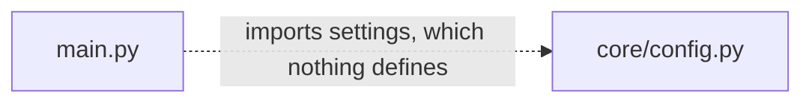

# Documentation

The documents in this directory describe the `microsoft-word-u33ko0` repository exactly as
committed, gaps included. Every measurement takes commit `06be74c` as its baseline, and every
locator points at the current branch head. The three specification documents under
`../documentation/` describe an aspirational system instead, and nothing here inherits their claims.
Where the committed code and a specification disagree, the documentation states both positions and
labels which is which. Every factual claim carries a file reference, so you can check any sentence
against the line it came from.

## Start here

Read [onboarding.md](onboarding.md) first. Neither deployable unit runs as committed, so
`onboarding.md` records the steps that do work and the exact line where a run stops. Turn to
[architecture-overview.md](architecture-overview.md) for the map of the whole repository, and to
[troubleshooting.md](troubleshooting.md) for the defect blocking whatever you are trying to do.

## Repository-level documents

Eight documents sit beside this index, each covering a concern that spans more than one directory.

| Document | What it covers |
| ---------- | ---------------- |
| [architecture-overview.md](architecture-overview.md) | The six top-level areas, the four tiers, the five system boundaries, and where interaction is currently broken |
| [data-model.md](data-model.md) | Dual persistence, the four entity families, the contract drift, and the four ownership positions |
| [integration-guide.md](integration-guide.md) | Firestore, Cloud Storage, Pub/Sub and the absent Redis broker, each labelled by reachability |
| [deployment-guide.md](deployment-guide.md) | Terraform, containers, pipelines, the deploy script, and why a deploy fails as committed |
| [troubleshooting.md](troubleshooting.md) | Every known blocking defect, with file and line evidence |
| [onboarding.md](onboarding.md) | Clean-machine setup, domain context, common pitfalls, how to extend the project, and suggested next tasks |
| [decision-log.md](decision-log.md) | What was decided, what alternatives existed, why, and what risk each choice carries, plus the traceability matrix |
| [prose-validation.md](prose-validation.md) | The per-deliverable clarity verdict and the principle scorecards |

All eight documents exist at the current branch head, so every link in the table above resolves.
The nineteen module READMEs listed below resolve as well.

## Module documentation

Nineteen directories carry a README of their own, one per source package.

### Backend

- [backend/app](../backend/app/README.md), the composition root and how its six subpackages compose
- [backend/app/api](../backend/app/api/README.md), the four routers and their fourteen handlers
- [backend/app/core](../backend/app/core/README.md), application settings and the security primitives
- [backend/app/db](../backend/app/db/README.md), the Firestore adapter and the unused SQLAlchemy path
- [backend/app/schema](../backend/app/schema/README.md), the Pydantic request and response contracts
- [backend/app/services](../backend/app/services/README.md), the three domain services
- [backend/app/tasks](../backend/app/tasks/README.md), the Celery task tier
- [backend/tests](../backend/tests/README.md), the test suite and why none of it executes

### Frontend

- [frontend/src](../frontend/src/README.md), bootstrap, providers, routing, and the frontend root files
- [frontend/src/components](../frontend/src/components/README.md), the eight application components
- [frontend/src/pages](../frontend/src/pages/README.md), the four routed pages
- [frontend/src/schema](../frontend/src/schema/README.md), the Zod contracts
- [frontend/src/services](../frontend/src/services/README.md), the HTTP, authentication and collaboration clients
- [frontend/src/store](../frontend/src/store/README.md), store composition and the two slices
- [frontend/src/utils](../frontend/src/utils/README.md), formatting, validation and serialization helpers

### Infrastructure and automation

- [infrastructure/terraform](../infrastructure/terraform/README.md), 35 blocks, and the Amazon Web Services outputs inside a Google Cloud configuration
- [infrastructure/docker](../infrastructure/docker/README.md), two Dockerfiles and the Compose topology
- [.github/workflows](../.github/workflows/README.md), the continuous integration and delivery workflows
- [scripts](../scripts/README.md), the deploy and setup scripts and the blockers in each

Five directories carry no README of their own. [frontend/src](../frontend/src/README.md) covers the
frontend root, including `frontend/package.json`, `frontend/tsconfig.json` and
`frontend/public/index.html`. The `backend/` and `infrastructure/` parents hold only subdirectories
that already carry one. This index and [architecture-overview.md](architecture-overview.md) describe
`../documentation/`. The repository root carries the original
[../README.md](../README.md), which this documentation set leaves untouched.

## Conventions used

Five conventions run through every document in this set.

### 1. Citation format

Every factual claim carries a locator in the form `path:Lnn`, for example
`backend/app/api/documents.py:L24`. A range such as `L24-L25` covers every line in the span,
inclusive. Locators point at the committed state at the current branch head, which includes the
documentation comments this engagement added to 44 source files.

Line numbers are physical. No source or configuration file in this repository ends with a newline,
so `wc -l` reports one line fewer than the file contains. Never derive a citation from `wc -l`. The
Markdown under `docs/` and in the 19 module READMEs does end with a newline, so those files carry
no such discrepancy.

Cite documents under `../documentation/` by heading name plus line number, never by section number,
because all three use unnumbered headings only. A numbered section citation anywhere in this set
refers to the generated Technical Specification, a separate document, and the text says so wherever
one appears.

### 2. What a marker means

A `HUMAN ASSISTANCE NEEDED` comment is the original authors' own flag on code they were not
confident in. All 33 markers and all 16 TODO comments survive verbatim and in place. Documentation
references each marker rather than duplicating, paraphrasing, relocating or obscuring it. The
complete register lives in [troubleshooting.md](troubleshooting.md).

### 3. Diagram style

Diagrams are Mermaid fenced blocks, which GitHub renders with no build step. A diagram depicting a
broken relationship draws the broken edge dashed and labels it, so intent and reality stay
distinguishable at a glance.

### 4. Reachability vocabulary

[integration-guide.md](integration-guide.md) labels every external integration by reachability and
defines the label set there. Four labels carry fixed meanings across this set: **WIRED, BLOCKED AT
IMPORT**, **NOT REACHABLE**, **SCAFFOLDED ONLY** and **ABSENT**.

### 5. Specification prose is declared intent

The three documents under `../documentation/` serve as a point of comparison, never as a statement
of system behaviour. A sentence may say that the specification places a module in the service tier
and that the committed code matches except for one named difference. No sentence may assert that a
module does something on the specification's authority alone. Material drawn from those documents
carries the label **declared intent**.

The three files are [Technical Specifications](<../documentation/Technical Specifications.md>),
[Software Requirements Specifications](<../documentation/Software Requirements Specifications (SRS).md>)
and [Software Project Proposal](<../documentation/Software Project Proposal.md>). All three carry
spaces in their filenames, so links to them use angle-bracket destinations.

### Module README structure

All 19 module READMEs use the same nine headings in the same order: Purpose, Key Components,
Architecture Fit, Dependencies, Configuration, Data Flows, Design Patterns, Known Limitations and
Usage Examples. Learn one README and you can navigate the other eighteen. Each one links up to
[architecture-overview.md](architecture-overview.md) from its Architecture Fit heading, and across
to [troubleshooting.md](troubleshooting.md) from its Known Limitations heading.

## Not included

- **No migration guide.** The repository is greenfield, replaces no prior system, and carries no
  migration tooling, so this set produces no migration guide.
- **No documentation generator, theme or build step.** The Markdown renders directly on GitHub. No
  `mkdocs.yml`, no Docusaurus configuration, no Sphinx `conf.py` and no `typedoc.json` sits in this
  repository, and this engagement created none.
- **No linting or formatting configuration.** No `.markdownlint.json` exists, and
  `frontend/package.json` gained no documentation script.
- **No images, no screenshots and no asset directory.** Every diagram is an inline Mermaid fence and
  every example is an inline fenced block. Neither deployable unit runs, so a screenshot would
  capture a failure state rather than the interface.
- **No edit to the root README.** [../README.md](../README.md) served as reference only. Six of its
  statements contradict the committed tree, and [troubleshooting.md](troubleshooting.md) plus
  [onboarding.md](onboarding.md) record all six rather than correcting them in place.
  [decision-log.md](decision-log.md) carries that entry and its accepted risk. The accepted cost is
  concrete: nothing links into `docs/` from the repository's front door, so discoverability rests on
  this index and on the 19 module READMEs.
