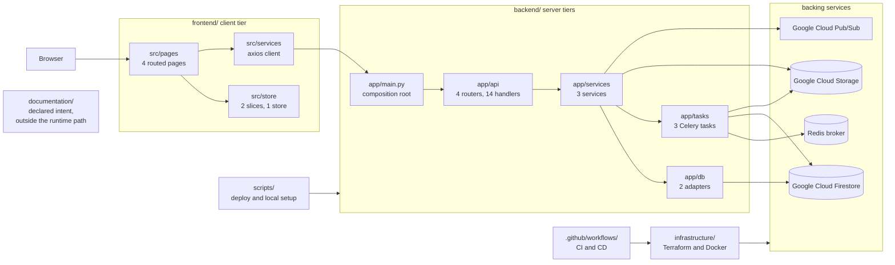
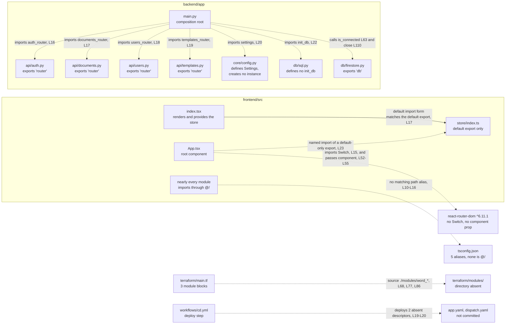

# Architecture Overview

The `microsoft-word-u33ko0` repository implements a browser-based word processor across six
top-level areas, and neither of its two deployable units runs. The backend cannot import, because
`backend/app/main.py:L16-L19` requests four router names that no module defines. The frontend cannot
typecheck, and `npx tsc --noEmit` reports 76 errors.

Two diagrams carry the argument of this document. The first, under
[Intended interaction](#intended-interaction), shows the system the authors designed. The second,
under [Where interaction is currently broken](#where-interaction-is-currently-broken), shows the
system they committed. Everything else here is caption.

## How to read this map

Every factual claim below carries a locator in the form `path:Lnn`, and most locators also name the
symbol sitting at that line. Read the symbol name as the durable half of the citation. Line numbers
move whenever anyone edits a file above them, and symbol names do not.

Three conventions govern the locators, matching
[troubleshooting.md](troubleshooting.md) so the two documents agree:

- Locators point at the committed state at the current branch head, which includes the inline
  documentation added to 44 source files. A locator matches what you see when you open the file
  today, not what an earlier revision held.
- Line numbers are physical. No source file in this repository ends with a newline, so `wc -l`
  reports one line fewer than each file contains.
- A range such as `L125-L128` covers every line in the span, inclusive.

Six words carry one fixed meaning throughout.

| Term | Meaning |
|------|---------|
| router | A FastAPI `APIRouter` instance |
| handler | A route function carrying a `@router` decorator |
| service | A domain service class under `backend/app/services/` |
| adapter | A persistence module under `backend/app/db/` |
| slice | A Redux Toolkit slice under `frontend/src/store/` |
| marker | A `HUMAN ASSISTANCE NEEDED` comment left by the code's authors |

The three documents under `documentation/` record intended behaviour rather than committed
behaviour. Anything drawn from them carries the label **declared intent** and a citation by heading
name plus line, because all three files use unnumbered headings only. A numbered section citation
anywhere in this documentation set refers to the generated Technical Specification, a separate
document, and the text says so when it does.

Where this engagement made a judgement, [decision-log.md](decision-log.md) carries the argument. No
rationale lives in this file.

## System purpose

The system exists to let someone write, format, save and export a document in a browser.
`../README.md:L4` frames the product as a web-based version of Microsoft Word, built on React for
the client and Python FastAPI for the server, and deployed on Google Cloud Platform. Committed
capabilities cover document create, read, update and delete (CRUD), ownership-based authorization,
rich-text editing on Draft.js, templates, export to PDF and DOCX, and a designed-but-unconnected
real-time collaboration path.

[onboarding.md](onboarding.md) covers what a new developer can run today.
[troubleshooting.md](troubleshooting.md) registers every blocking defect with its evidence.

## The six top-level areas

Six directories hold the entire repository. Sixty-one files sat inside them at commit `06be74c`,
the baseline this documentation measures.

| Area | What it holds | Files | Lines | Module documentation |
|------|---------------|-------|-------|----------------------|
| `frontend/` | The React and TypeScript single-page application (SPA): 26 modules under `src/`, plus `package.json`, `tsconfig.json` and `public/index.html` | 29 | 943 under `src/` | [frontend/src](../frontend/src/README.md) and its six subfolder READMEs |
| `backend/` | The FastAPI application: 15 modules under `app/`, plus 3 test modules under `tests/` | 18 | 645 under `app/`, 212 under `tests/` | [backend/app](../backend/app/README.md) and its six subpackage READMEs, plus [backend/tests](../backend/tests/README.md) |
| `infrastructure/` | 3 Terraform files declaring a virtual private cloud (VPC) network, a subnet, a firewall rule and a storage bucket, plus 3 Docker artifacts | 6 | 235 Terraform, 102 Docker | [terraform](../infrastructure/terraform/README.md), [docker](../infrastructure/docker/README.md) |
| `documentation/` | 3 specification documents recording intended behaviour | 3 | 2,313 | Described from outside, in this file and in [docs/README.md](README.md). Never edited |
| `scripts/` | 2 shell scripts: one deploy, one local environment setup | 2 | 101 | [scripts](../scripts/README.md) |
| `.github/workflows/` | 2 workflows: continuous integration and continuous delivery | 2 | 41 | [workflows](../.github/workflows/README.md) |

The six rows account for 60 files. The root `../README.md` is the 61st, and this engagement read it
as reference without editing it.

Two directories carry no README of their own by design. `frontend/public/` holds one file, and
[frontend/src/README.md](../frontend/src/README.md) describes it. The `infrastructure/` parent holds
nothing but the two subfolders documented above.

Line counts above measure commit `06be74c`, before the documentation engagement added comment
blocks to 44 source files. Current counts run higher: `frontend/src/` holds 3,111 lines and
`backend/app/` holds 3,065. The engagement added no executable line, so code weight did not change.

## The four tiers

The committed code separates four tiers by directory: client, HTTP application programming interface
(API), domain service, and persistence with background work. Each tier owns one entry point.

| Tier | Directory | Holds | Entry point |
|------|-----------|-------|-------------|
| Client | `frontend/src/` | 8 components, 4 routed pages, 3 Zod schema modules, 3 client services, 2 slices behind one store, 3 utility modules | `frontend/src/index.tsx:L34` calls `ReactDOM.render`, and `frontend/src/App.tsx:L44` declares the root component |
| HTTP API | `backend/app/api/` | 4 routers and 14 handlers, 12 of them behind the `get_current_user` dependency | `backend/app/main.py:L24` creates `app = FastAPI()`, and `:L125-L128` mounts all four routers |
| Domain service | `backend/app/services/` | 3 service classes | `DocumentService` at `backend/app/services/document_service.py:L64`, `CollaborationService` at `backend/app/services/collaboration_service.py:L41`, `ExportService` at `backend/app/services/export_service.py:L63` |
| Persistence and background | `backend/app/db/`, `backend/app/tasks/` | 2 adapters and 1 Celery application carrying 3 tasks | `backend/app/db/firestore.py:L42` builds the Firestore client, `backend/app/db/sql.py:L16` builds the SQLAlchemy engine, and `backend/app/tasks/background_tasks.py:L98` builds the Celery application |

Two backend directories sit across the tiers rather than inside one. `backend/app/schema/` holds the
Pydantic contracts that cross the client and service boundaries, and `backend/app/core/` holds the
`Settings` model at `backend/app/core/config.py:L51` plus the token and password primitives at
`backend/app/core/security.py:L50-L100`. Every tier reads one or both.

The client tier runs React 18 and Redux Toolkit, declared at `frontend/package.json:L8` and `:L7`.
Draft.js supplies the editor surface in 6 modules, and Zod supplies the client contracts in 4.
`frontend/package.json:L6-L14` declares neither package. `frontend/src/App.tsx:L52-L55` declares
four routes: `/`, `/editor`, `/templates` and `/settings`.

The specification describes a comparable tiering, and the committed directories match that
placement. Its SYSTEM ARCHITECTURE heading sits at
`../documentation/Technical Specifications.md:L125`, and a HIGH-LEVEL ARCHITECTURE DIAGRAM heading
follows at `:L140`. The diagram at `:L142-L177` places a single-page application in front of an API
gateway, then seven backend boxes, then storage. Read that diagram as declared intent.

The committed code ships three of those seven boxes as service classes. No API gateway, no
machine-learning service and no file-conversion service exists anywhere in the repository. The four
tiers exist as directories and do not connect, for the reasons the next two sections give.

## Intended interaction

The intended request path runs one way through the four tiers. A browser loads the single-page
application, and the client calls the HTTP API with a bearer token. A handler resolves the caller
through a FastAPI dependency, a service performs the domain operation, and an adapter reads or
writes Firestore. Export work leaves the request path for a Celery queue. Terraform provisions the
runtime, the workflows release into it, and the shell scripts stand up a local equivalent.

The diagram below adds three things the paragraph cannot. Each node shows which area owns it, the
server tiers fan out to four separate backing services, and the three specification documents sit
right outside the runtime path.

## Where interaction is currently broken

The map above breaks in twelve places, and the first three stop the backend from importing at all.
The table below names each break, its evidence, its consequence, and the defect class
[troubleshooting.md](troubleshooting.md) files it under.

| Broken edge | Evidence | Consequence | Class |
|-------------|----------|-------------|-------|
| Composition root to the four routers | `backend/app/main.py:L16-L19` imports `auth_router`, `documents_router`, `users_router` and `templates_router`. All four modules export the bare name `router`, at `backend/app/api/auth.py:L90`, `backend/app/api/documents.py:L54`, `backend/app/api/users.py:L30` and `backend/app/api/templates.py:L80` | No router symbol resolves, so the application cannot start | G2 |
| Composition root to settings | `backend/app/main.py:L20` imports `settings` from `app.core.config`, which defines the `Settings` class at `backend/app/core/config.py:L51` and `get_settings()` at `:L126`, and never creates a module-level instance | Nine modules import a name that does not exist. `ImportError` ends the import of every one | G2 |
| Composition root to the SQL adapter | `backend/app/main.py:L22` imports `init_db` from `app.db.sql`, which defines `engine`, `SessionLocal`, `Base` and `get_db` and defines no `init_db`. The startup handler awaits the absent name at `:L60` | `ImportError` ends the import of `app.main` at `:L22`, before the startup handler can run | G1 |
| Lifecycle handlers to the Firestore client | `backend/app/main.py:L63` calls `db.is_connected()` and `:L110` awaits `db.close()` on the object imported at `:L21`. The Google Cloud Firestore `Client` provides neither method | `:L68-L69` catches the startup `AttributeError` and prints it, so the application would start believing Firestore is reachable. `:L110` sits in no `try` block, so shutdown raises and leaves cleanup undone | G5 |
| Every backend module to the `app` package | No `__init__.py` file exists anywhere under `backend/`, so `app` and its six subpackages are implicit namespace packages. `infrastructure/docker/backend.Dockerfile:L14` copies `./app` to `/app`, and `:L20` runs `uvicorn main:app` | The `app.` prefix used by every internal import cannot resolve inside the image as built. [backend/app/README.md](../backend/app/README.md) owns this statement | G1 |
| Router mounting to resource prefixes | `backend/app/main.py:L125-L128` mounts all four routers with no prefix argument | The five document routes and the five template routes collide on `/` and `/{id}`. Whichever router mounts first answers both | G7 |
| Root component to the store | `frontend/src/App.tsx:L23` imports `{ store }` as a named symbol, and `frontend/src/store/index.ts:L65` exports the store as a default only | The named import resolves to nothing, and the compiler reports it | G2 |
| Root component to the router library | `frontend/src/App.tsx:L15` imports `Switch` and `:L52-L55` passes the `component` prop. `frontend/package.json:L11` pins `react-router-dom` at `^6.11.1`, which removed both | Routing cannot compile against the declared dependency version | G8 |
| Provider and shell duplication | `frontend/src/index.tsx:L36` wraps the application in a react-redux `Provider`, and `frontend/src/App.tsx:L46` wraps the same store again. `frontend/src/App.tsx:L49` and `:L58` render `Header` and `Footer` inside pages that render their own | The inner `Provider` is redundant, and the chrome renders twice on every page | G8 |
| Every frontend module to its own import prefix | Nearly every module imports through a `@/` prefix. `frontend/tsconfig.json:L10-L16` declares five path aliases, and none of them is `@/` | 44 of the 76 type errors come from this one unmapped prefix | G4 |
| Terraform root to its three modules | `infrastructure/terraform/main.tf:L67-L92` composes `./modules/word_backend`, `./modules/word_frontend` and `./modules/word_database`, with sources at `:L68`, `:L77` and `:L86`. No `modules/` directory exists | `terraform init` reports `Unreadable module directory` and stops | G8 |
| Delivery pipeline to its deployment descriptors | `.github/workflows/cd.yml:L19-L20` runs `gcloud app deploy app.yaml` and `gcloud app deploy dispatch.yaml`. Neither file is committed | The deploy step fails on its first command | G8 |

Two headline consequences follow, and both come from running the code rather than reading it.
Importing `app.main` fails through `backend/app/main.py:L16`, then
`backend/app/api/auth.py:L84`, raising
`ImportError: cannot import name 'settings' from 'app.core.config'`. Only 3 of the 15 modules under
`backend/app/` import successfully, and
[backend/app/README.md](../backend/app/README.md) owns that census. On the client,
`npx tsc --noEmit` reports 76 errors, and
[frontend/src/README.md](../frontend/src/README.md) owns the error profile.

The code's authors flagged much of the above themselves. Twenty-seven `HUMAN ASSISTANCE NEEDED`
markers and 15 `TODO` comments sit across the 44 source files, and
[troubleshooting.md](troubleshooting.md) registers every one.

The overlay below redraws the same skeleton with each unresolvable link dashed and labelled. Read
the dashed edges as the shape of the failure. Seven of them leave the composition root, and one of
those seven, the `settings` import at `backend/app/main.py:L20`, accounts for nine of the twelve
backend module import failures on its own.

## System boundaries

Five boundaries carry data out of one process or trust domain and into another. The repository
commits no cross-language contract artifact, so anyone changing a shape on one side of a boundary
keeps the other side in agreement by hand.

| Boundary | What crosses it | Contract artifact | Current state |
|----------|-----------------|-------------------|---------------|
| Browser to HTTP API | JSON request and response bodies, plus a JSON Web Token (JWT) presented as a bearer token. `backend/app/api/auth.py:L92` declares the `get_current_user` dependency that reads it | None shared. The repository commits no OpenAPI document and generates no client | The client and the server disagree on route paths and on the token field name. [troubleshooting.md](troubleshooting.md) records both, under G6 and G7 |
| HTTP API to domain service | Python calls carrying Pydantic models and identifier strings | The Pydantic contracts under `backend/app/schema/`, described in [data-model.md](data-model.md) | Seven call sites disagree with the signature they target, so the ownership comparison at `backend/app/services/document_service.py:L177` never receives the argument it compares |
| Domain service to Google Cloud Firestore | Document reads and writes through the `google-cloud-firestore` client library | The collection and field names each caller passes. No schema constrains a stored Firestore document | Reachable. `backend/app/db/firestore.py:L41` resolves Application Default Credentials (ADC) at import time, and `:L42` builds the client eagerly, so importing the adapter contacts the credential chain |
| Domain service to Google Cloud Storage and Cloud Pub/Sub | Export objects and version 4 signed URLs, plus per-document change messages | Object key layouts and message payload shapes, both chosen at the call site | `backend/app/services/export_service.py:L154-L164` uploads an object and signs a version 4 URL. `backend/app/services/collaboration_service.py:L69` builds a publisher and `:L248` publishes, and no route ever constructs that service. [integration-guide.md](integration-guide.md) labels each integration reachable or scaffolded |
| Application to Celery and Redis | Task messages for export, retention and statistics work | The task signatures at `backend/app/tasks/background_tasks.py:L101`, `:L152` and `:L287` | `backend/app/core/config.py:L119` declares `REDIS_URL`, and `backend/app/tasks/background_tasks.py:L98` reads it. Nothing provisions Redis, and no worker or beat process is declared anywhere in the repository. [deployment-guide.md](deployment-guide.md) carries the detail |

## Architectural assumptions

Seven assumptions hold the design together, and the code states none of them. Committed files
contradict all seven.

| Assumption | Why it must hold | Where it is contradicted |
|------------|------------------|--------------------------|
| An `app` package sits on the import path | Twelve modules import by absolute package path, for example `from app.core.config import settings` at `backend/app/main.py:L20` | No `__init__.py` file exists anywhere under `backend/`, so all seven namespaces are implicit. `infrastructure/docker/backend.Dockerfile:L14` copies `./app` to `/app` and `:L20` runs `uvicorn main:app`, which flattens the package and leaves the `app.` prefix unresolvable. [backend/app/README.md](../backend/app/README.md) owns this fact |
| A `settings` singleton is importable from `app.core.config` | Nine modules read configuration through that name, including the CORS middleware at `backend/app/main.py:L118` | `backend/app/core/config.py:L51-L140` defines the `Settings` class and the `get_settings()` factory, and creates no module-level instance |
| Routers mount under resource prefixes | The client prefixes its calls with `/documents`, and documents and templates each declare five identical route paths | `backend/app/main.py:L125-L128` mounts all four routers with no prefix, so the two resources collide on `/` and `/{id}` |
| Ownership travels on one field name | The document handlers compare a stored owner against the caller at `backend/app/api/documents.py:L187`, `:L235` and `:L282`, and the service repeats the comparison at `backend/app/services/document_service.py:L177`, `:L243` and `:L282` | Four positions carry the field under two different names, and one of them is optional with a default. [data-model.md](data-model.md) names all four and names none canonical |
| The `@/` alias resolves to `src/` | Nearly every module under `frontend/src/` imports through that prefix | `frontend/tsconfig.json:L10-L16` declares five aliases, and none of them is `@/`. `react-scripts` 5 would not apply those mappings to bundler resolution in any case |
| Tailwind CSS compiles the utility classes in the markup | Components and pages carry Tailwind class strings, for example at `frontend/src/components/Header.tsx:L59-L70` | No `tailwind.config.js`, no `postcss.config.js` and no stylesheet is committed anywhere, so the class strings resolve to nothing and the interface renders unstyled |
| A Redis broker backs Celery | `backend/app/tasks/background_tasks.py:L98` constructs `Celery('microsoft_word', broker=settings.REDIS_URL)` | `infrastructure/docker/docker-compose.yml:L3-L39` declares three services, `frontend`, `backend` and `db`, and no Redis service. `infrastructure/terraform/main.tf` declares no cache resource. Searching all of `infrastructure/` for `redis` or `memorystore` returns nothing |

## Module documentation

Nineteen module READMEs describe the directories mapped above. Each one opens with Purpose and
closes with Known Limitations, and each links back to this file from its Architecture Fit heading.

Backend:

- [backend/app](../backend/app/README.md), the composition root
- [backend/app/api](../backend/app/api/README.md), four routers and 14 handlers
- [backend/app/core](../backend/app/core/README.md), settings and security primitives
- [backend/app/db](../backend/app/db/README.md), the Firestore and SQLAlchemy adapters
- [backend/app/schema](../backend/app/schema/README.md), the Pydantic contracts
- [backend/app/services](../backend/app/services/README.md), three domain services
- [backend/app/tasks](../backend/app/tasks/README.md), the Celery task tier
- [backend/tests](../backend/tests/README.md), the current state of the test suite

Frontend:

- [frontend/src](../frontend/src/README.md), bootstrap, providers and routing
- [frontend/src/components](../frontend/src/components/README.md), eight components
- [frontend/src/pages](../frontend/src/pages/README.md), four routed pages
- [frontend/src/schema](../frontend/src/schema/README.md), the Zod contracts
- [frontend/src/services](../frontend/src/services/README.md), three client services
- [frontend/src/store](../frontend/src/store/README.md), store composition and two slices
- [frontend/src/utils](../frontend/src/utils/README.md), formatting, validation and serialization

Infrastructure and automation:

- [infrastructure/terraform](../infrastructure/terraform/README.md), 35 blocks across three files
- [infrastructure/docker](../infrastructure/docker/README.md), two Dockerfiles and Compose
- [.github/workflows](../.github/workflows/README.md), the CI and CD pipelines
- [scripts](../scripts/README.md), the deploy and setup scripts

Repository-level documents sit beside this one, indexed from [docs/README.md](README.md):
[onboarding.md](onboarding.md), [data-model.md](data-model.md),
[integration-guide.md](integration-guide.md), [deployment-guide.md](deployment-guide.md),
[troubleshooting.md](troubleshooting.md) and [decision-log.md](decision-log.md). The
[root README](../README.md) and `../documentation/Technical Specifications.md` stay as reference,
unedited by this engagement.
