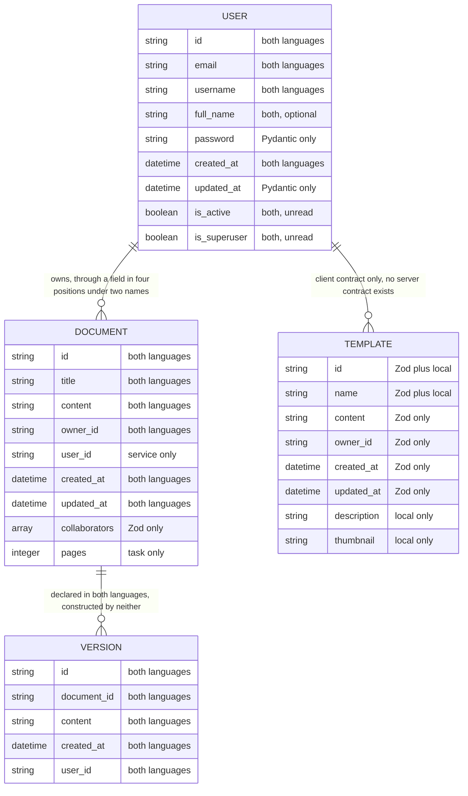

# Data Model Reference

Two contract languages describe the same four entity families in this repository, and no artifact
keeps them in agreement. The Pydantic models under `backend/app/schema/` and the Zod schemas under
`frontend/src/schema/` have drifted apart as a result. [Why drift arose](#why-drift-arose) covers
the mechanism, and the sections after it enumerate the individual divergences. That ordering is
decision row 22 in [decision-log.md](decision-log.md#the-decision-table), which also carries the
alternatives weighed and the risk it accepts.

Persistence splits the same way. Google Cloud Firestore is the implemented persistence target for
every record the code writes, and the Cloud SQL path stays declared and unreachable. Neither target
is reachable at runtime today, because the adapter that would build the Firestore client cannot
import. [The Firestore path](#the-firestore-path) carries the evidence.

## How to read this reference

Every factual claim below carries a locator in the form `path:Lnn`, and most locators also name the
symbol at that line. Read the symbol name as the durable half of the citation. Line numbers move
whenever anyone edits a file above them, and symbol names do not.

Three conventions govern the locators, matching [troubleshooting.md](troubleshooting.md) and
[architecture-overview.md](architecture-overview.md) so all three documents agree:

- Locators point at the committed state at the current branch head, which includes the inline
  documentation added to 44 source files. A locator matches what you see when you open the file
  today, not what an earlier revision held.
- Line numbers are physical. No source file in this repository ends with a newline, so `wc -l`
  reports one line fewer than each file contains.
- A range such as `L65-L73` covers every line in the span, inclusive.

Six words carry one fixed meaning throughout.

| Term | Meaning |
| ------ | --------- |
| router | A FastAPI `APIRouter` instance |
| handler | A route function carrying a `@router` decorator |
| service | A domain service class under `backend/app/services/` |
| adapter | A persistence module under `backend/app/db/` |
| slice | A Redux Toolkit slice under `frontend/src/store/` |
| marker | A `HUMAN ASSISTANCE NEEDED` comment left by the code's authors |

The three documents under `documentation/` record intended behaviour rather than committed
behaviour. Anything drawn from them carries the label **declared intent** and a citation by heading
name plus line, because all three files use unnumbered headings only.
`documentation/Technical Specifications.md` holds five level-one headings: `L3` INTRODUCTION, `L125`
SYSTEM ARCHITECTURE, `L300` SYSTEM DESIGN, `L523` TECHNOLOGY STACK and `L620` SECURITY
CONSIDERATIONS. A numbered section citation anywhere in this documentation set refers to the
generated Technical Specification, a separate document, and the text says so when it does.

Where this engagement made a judgement, the argument sits in
[decision-log.md](decision-log.md). No rationale lives in this file.

## Persistence overview

Firestore is the implemented persistence target, and Cloud SQL is declared only. The Implemented
column records which path the application code writes through. The Reachable column records whether
that path can be exercised against the committed tree, which is a separate question.

| Path | Declared at | Implemented | Reachable today | What would reach it |
| ------ | ------------- | ------------- | ----------------- | --------------------- |
| Google Cloud Firestore | `backend/app/db/` `firestore.py` `L19-L20` | Yes | Blocked. `:L16` imports `settings` and raises `ImportError` before `:L19` and `:L20` run | `DocumentService` and the Celery tasks, through the shared client |
| Google Cloud SQL | `backend/app/db/` `sql.py:L16-L19` | No | Blocked, and unused even if unblocked. `:L14` imports `settings` and raises the same `ImportError` | Nothing. No model, no migration, no caller |

### The Firestore path

`backend/app/db/firestore.py:L19` resolves Application Default Credentials (ADC) through
`credentials, project = default()`, and `:L20` constructs
`db = Client(project=settings.GOOGLE_CLOUD_PROJECT)`. Both statements sit at module level, so the
design is for importing the adapter to reach for credentials before any handler runs.

Neither statement executes against the committed tree. `:L16` runs first and imports `settings` from
`app.core.config`, which never creates a module-level instance, so the module raises
`ImportError: cannot import name 'settings' from 'app.core.config'` before ADC resolution at `:L19`
and before client construction at `:L20`. No credential lookup and no Firestore connection is
attempted. Everything the rest of this section describes is the contract the code declares, not
behaviour anyone can observe today.

The adapter exposes four synchronous helpers. Two of them are `get_document` at `:L22` and
`create_document` at `:L45`. The others are `update_document` at `:L64` and `delete_document` at
`:L81`.

**No service consumes any of them.**
Three modules import the adapter, and all three import only the `db` client:
`backend/app/main.py:L21`, `backend/app/services/document_service.py:L16` and
`backend/app/tasks/background_tasks.py:L17`. `DocumentService` holds that client at
`backend/app/services/document_service.py:L40` and calls the Firestore application programming
interface (API) itself at `:L69`, `:L101`, `:L141` and `:L177`.

One annotation contradicts its own body. `backend/app/db/firestore.py:L22` declares
`get_document(...) -> dict`, and `backend/app/db/firestore.py:L43` returns `None` on the
missing-snapshot branch, so a caller that trusts the annotation dereferences `None`.

Code touches three collections. `documents` carries every document record, written at
`backend/app/services/document_service.py:L73` and read at `:L102`. The retention task adds
`document_permissions` at `backend/app/tasks/background_tasks.py:L112` and `document_metadata` at
`:L113`. No code path writes a users collection or a templates collection, so the user and template
contracts below describe records that nothing stores.

### The Cloud SQL path

`backend/app/db/sql.py:L16` builds an engine from `settings.DATABASE_URL` at import time, `:L17`
builds `SessionLocal`, and `:L19` builds `Base`. `:L21-L36` defines `get_db()`, the repository's
only generator, yielding a session at `:L34` and closing it at `:L36`.

Nothing downstream uses any of it:

- `Base` is never subclassed. No `class ...(Base)` statement exists anywhere under `backend/`.
- No object-relational mapping (ORM) model exists, so the `orm_mode` setting on the `User` contract
  has no mapped object to read.
- No migration mechanism of any kind is committed. Neither an `alembic.ini`, nor a migration
  directory, nor any other schema-versioning artifact appears in the repository, and this reference
  names no replacement.
- `init_db` is never defined. `backend/app/main.py:L22` imports the name from this module, and no
  `def init_db` appears anywhere in the repository.

[../backend/app/db/README.md](../backend/app/db/README.md) carries the module-level detail for both
adapters, and [integration-guide.md](integration-guide.md) covers the credential model.

## Why drift arose

No artifact forces the two languages to agree. The repository commits no OpenAPI document,
generates no client from either contract, and shares no schema package across the Python and
TypeScript trees. Developers therefore maintain the Pydantic models under `backend/app/schema/` and
the Zod schemas under `frontend/src/schema/` by hand, in two places, with no check between them.
Every field-name and shape divergence in this document follows from that one absence.

## Entity families

Four entity families exist. Three carry a contract in both languages, and the template family
carries one on the client only.

| Family | Pydantic artifact | Zod artifact | Firestore collection | State |
| -------- | ------------------- | -------------- | ---------------------- | ------- |
| Document | `DocumentBase`, `DocumentCreate`, `DocumentUpdate`, `Document` at `backend/app/schema/` `document.py:L16-L65` | `DocumentSchema` at `frontend/src/schema/` `document.ts:L23-L31` | `documents` | The only family the handlers and services are written against, and no traffic reaches it while the backend cannot import. The client schema is never applied to a response |
| User | `UserBase`, `UserCreate`, `UserUpdate`, `User` at `backend/app/schema/` `user.py:L17-L81` | `UserSchema` and `type User` at `frontend/src/schema/` `user.ts:L19-L30` | none | Contracts only. No handler writes a user record, because `app.services.user_service` does not exist |
| Template | **none** | `TemplateSchema` and `type Template` at `frontend/src/schema/` `template.ts:L21-L31` | none | No server contract exists, and the client holds two incompatible shapes |
| Version | `DocumentVersion` at `backend/app/schema/` `document.py:L67-L85` | `DocumentVersionSchema` at `frontend/src/schema/` `document.ts:L39-L45` | none | Declared in both languages and constructed by neither |

The template family has no server contract at all. No `backend/app/schema/template.py` is committed,
so `backend/app/api/templates.py:L17` imports `Template`, `TemplateCreate` and `TemplateUpdate` from
`app.schema.template` and resolves none of them. `:L18` imports the equally absent
`app.services.template_service`. The five template handlers therefore describe a family whose
server-side shape nobody wrote.

The version family is declared twice and never reached. No Python code path constructs
`DocumentVersion`, and no client module imports `DocumentVersionSchema`, so no version record is
written or read in either language.

The entity-relationship (ER) diagram below adds what the table above cannot: the links between the
four families, and the language that declares each individual field. Each attribute carries one of
nine fixed markers naming where that field is declared.

| Marker | Meaning |
| -------- | --------- |
| `both languages` | A Pydantic model and a Zod schema both declare the field |
| `both, optional` | Both declare it, and both make it optional |
| `both, unread` | Both declare it, and no code path in either language reads it |
| `Pydantic only` | A Pydantic model declares it and no Zod schema does |
| `Zod only` | A Zod schema declares it and no Pydantic model does |
| `Zod plus local` | The Zod schema and the local `Template` interface in `Templates.tsx` both declare it |
| `local only` | Only the local `Template` interface in `Templates.tsx` declares it |
| `service only` | No contract declares it. A service writes the key onto the stored record |
| `task only` | No contract declares it. A Celery task reads it off the record |

Line-level citations for every field below sit in [Pydantic contracts](#pydantic-contracts),
[Zod contracts](#zod-contracts) and the [contract drift table](#contract-drift-table), which is why
the diagram carries the marker rather than repeating the locator.

Email is the one field where the two languages disagree on validation rather than on naming.
`frontend/src/schema/user.ts:L21` declares `email: z.string().email()`, so the client applies one
format check. `backend/app/schema/user.py:L26` declares `email: str`, not Pydantic's `EmailStr`, so
the server applies none.

Format validators across the two contracts therefore count one and zero. A value the client would
reject reaches the server unchallenged whenever a caller bypasses the browser, and `POST /register`
at `backend/app/api/auth.py:L103` accepts any string.

The Zod check also never runs today. Two modules import from that file,
`frontend/src/services/auth.ts:L18` and `frontend/src/store/userSlice.ts:L13`, and both take the
inferred `User` type declared at `frontend/src/schema/user.ts:L30` rather than the schema object. No
committed line calls `UserSchema.parse` or `UserSchema.safeParse`, so runtime email validations
across the whole repository count zero.

## Pydantic contracts

Nine model classes sit across two files, and both files import `List` without using it.

The document family is the only one with a service behind it. `backend/app/api/documents.py`
declares a full create, read, update and delete (CRUD) surface across five handlers at `:L24`,
`:L49`, `:L68`, `:L98` and `:L131`. `DocumentService` implements four methods against those five
handlers: `create_document` at `backend/app/services/document_service.py:L42`, `get_document` at
`:L78`, `update_document` at `:L116` and `delete_document` at `:L159`.

The fifth handler has no implementation to call. `GET /` at `backend/app/api/documents.py:L49` calls
`DocumentService.get_documents` at `:L65`, and no such method exists on the class, so the list
operation would raise `AttributeError` rather than return a collection. The user and template
families both import a service module that does not exist.

### `backend/app/schema/document.py`

| Class | Base | Fields | Notes |
| ------- | ------ | -------- | ------- |
| `DocumentBase` `L16-L28` | `BaseModel` | `title` `L26`, `content` `L27`, `owner_id` `L28` | `owner_id` is `Optional[str] = None`, so a document validates with no owner recorded |
| `DocumentCreate` `L30-L38` | `DocumentBase` | none of its own, a bare `pass` at `L38` | Adds no field, so the create request body accepts a client-supplied `owner_id` |
| `DocumentUpdate` `L40-L50` | `BaseModel` | `title` `L49`, `content` `L50`, both optional | Does not inherit `DocumentBase`, so the update contract shares no field definition with the model it updates |
| `Document` `L52-L65` | `DocumentBase` | `id` `L63`, `created_at` `L64`, `updated_at` `L65` | Both timestamps are required, and no service writes either one |
| `DocumentVersion` `L67-L85` | `BaseModel` | `id` `L81`, `document_id` `L82`, `content` `L83`, `created_at` `L84`, `user_id` `L85` | Declares `user_id` where `DocumentBase` declares `owner_id`, in this same file |

Two required fields have no writer, and the consequence lands on every read. `Document` at `L52`
requires `created_at` at `L64` and `updated_at` at `L65`. The service assembles its record from
`document.dict()` at `backend/app/services/document_service.py:L70`, adds `user_id` at `:L71` and
`id` at `:L72`, and writes neither timestamp. `Document(**doc_data)` at `:L76` therefore raises a
validation error on two missing required fields, and the create handler never returns.

The unused `List` import sits at `L13`.

### `backend/app/schema/user.py`

| Class | Base | Fields | Notes |
| ------- | ------ | -------- | ------- |
| `UserBase` `L17-L28` | `BaseModel` | `email` `L26`, `username` `L27`, `full_name` `L28` | `email` is a bare `str` rather than `EmailStr`, so no format check runs. `full_name` is optional |
| `UserCreate` `L30-L38` | `UserBase` | `password` `L38` | The only contract in either language that models a password |
| `UserUpdate` `L40-L54` | `BaseModel` | `email` `L51`, `username` `L52`, `full_name` `L53`, `password` `L54` | Does not inherit `UserBase`. Every field is optional, so a caller may send any subset |
| `User` `L56-L72` | `UserBase` | `id` `L68`, `created_at` `L69`, `updated_at` `L70`, `is_active` `L71`, `is_superuser` `L72` | Carries a nested `Config` at `L74` with `orm_mode = True` at `L81`. Declares no password field |

Three properties of this file shape the drift downstream.

`orm_mode = True` inside a nested `Config` at `L74-L81` is the Pydantic 1.x spelling, so the
contract pins the backend to Pydantic 1.x. The setting lets a model read attributes off an object
instead of a dictionary, and no ORM model exists anywhere in the backend for it to read.

`User` declares no field for the password hash. `backend/app/api/auth.py:L134` computes one with
`pwd_context.hash(user.password)` during registration, and the response contract at
`backend/app/schema/user.py:L56` has nowhere to carry it. `UserCreate` declares `password` at
`backend/app/schema/user.py:L38`, so the plaintext field crosses the boundary inbound and the hash
has no modelled home outbound.

`is_active` at `L71` and `is_superuser` at `L72` are read by no code path in the repository. Both
names appear only as declarations across every `.py`, `.ts` and `.tsx` file.

The unused `List` import sits at `L14`.
[../backend/app/schema/README.md](../backend/app/schema/README.md) carries the per-model detail, and
[../backend/app/api/README.md](../backend/app/api/README.md) covers the handlers that bind these
models.

## Zod contracts

Three modules under `frontend/src/schema/` export six symbols between them. Two are `z.object` values
in `document.ts`, at `L23` and `L39`. The other four are a value plus an inferred type in each
sibling: `user.ts` at `L19` and `L30`, and `template.ts` at `L21` and `L31`. Three names that
importing modules request are missing from `document.ts`, and repairing them takes three separate
exports rather than one.

### `frontend/src/schema/document.ts`

| Export | Kind | Fields | Notes |
| -------- | ------ | -------- | ------- |
| `DocumentSchema` `L23-L31` | `z.object` value | `id` `L24`, `title` `L25`, `content` `L26`, `owner_id` `L27`, `created_at` `L28`, `updated_at` `L29`, `collaborators` `L30` | `owner_id` is required here and optional in the Pydantic contract. `collaborators` has no server counterpart |
| `DocumentVersionSchema` `L39-L45` | `z.object` value | `id` `L40`, `document_id` `L41`, `content` `L42`, `created_at` `L43`, `user_id` `L44` | Declares `user_id` where `DocumentSchema` declares `owner_id`, in this same file |
| inferred type | **absent** | none | The module exports no `z.infer` alias, and both sibling modules export one |

Both timestamp fields use `z.date()`, which rejects a string. The server serializes `datetime` to
text, so every timestamp crosses the boundary as a JavaScript Object Notation (JSON) string in
International Organization for Standardization (ISO) 8601 form. `z.date()` at `L28`, `L29` and `L43`
would reject all three of those strings.

Three distinct names are missing, requested across five import positions in three modules, and each
name needs its own export. Counting the names rather than the positions is what tells a reader how
much work the repair is.

| Missing name | Requested at | Positions | Remediation |
| -------------- | -------------- | ----------- | ------------- |
| `Document` | `frontend/src/services/` `api.ts:L19`, `frontend/src/services/` `collaboration.ts` `L17`, `frontend/src/store/` `documentSlice.ts` `L15` | 3 | Add `export type Document = z.infer<typeof DocumentSchema>;` beside `DocumentSchema` at `L23-L31`. One line clears all three positions |
| `DocumentCreate` | `frontend/src/services/` `api.ts:L19` | 1 | No schema models a create payload. Declare one, or narrow `DocumentSchema` by omitting the server-assigned `id`, `created_at` and `updated_at` |
| `DocumentUpdate` | `frontend/src/services/` `api.ts:L19` | 1 | No schema models an update payload. Declare one, or derive a partial of `DocumentSchema` |

`Document` is the cheap fix and the other two are not, because `document.ts` declares only the full
record shape at `L23-L31` and the version shape at `L39-L45`. Neither corresponds to a create or an
update body. The Pydantic side does model both, at `backend/app/schema/document.py:L30`
(`DocumentCreate`) and `:L40` (`DocumentUpdate`), so the two client names have server counterparts to
mirror and no client declaration to point at.

Both sibling modules do export an inferred type, at `frontend/src/schema/user.ts:L30` and
`frontend/src/schema/template.ts:L31`. The omission therefore departs from the convention its own
directory follows. [../frontend/src/schema/README.md](../frontend/src/schema/README.md) owns the full
chain, and [troubleshooting.md](troubleshooting.md) records the compiler codes.

### `frontend/src/schema/user.ts` and `frontend/src/schema/template.ts`

| Export | Kind | Fields | Notes |
| -------- | ------ | -------- | ------- |
| `UserSchema` `L19-L27` | `z.object` value | `id` `L20`, `email` `L21`, `username` `L22`, `full_name` `L23`, `created_at` `L24`, `is_active` `L25`, `is_superuser` `L26` | `email` carries `.email()`, so the client checks a format the server does not. No `updated_at` field |
| `type User` `L30` | `z.infer` alias | derived from `UserSchema` | The client-side user type, and the shape every component reads through |
| `TemplateSchema` `L21-L28` | `z.object` value | `id` `L22`, `name` `L23`, `content` `L24`, `owner_id` `L25`, `created_at` `L26`, `updated_at` `L27` | No server contract exists to compare against |
| `type Template` `L31` | `z.infer` alias | derived from `TemplateSchema` | Competes with a local `interface Template` at `frontend/src/pages/` `Templates.tsx` `L25-L30` |

All three modules import `zod` at `frontend/src/schema/document.ts:L13`,
`frontend/src/schema/user.ts:L9` and `frontend/src/schema/template.ts:L13`. The package appears
nowhere in `frontend/package.json`, whose dependency block at `L6-L14` declares exactly seven
runtime packages, none of them `zod`. Every schema module therefore fails to resolve its own import.

## Contract drift table

Eleven concepts disagree across the boundary. Every row below is an instance of the single mechanism
in [Why drift arose](#why-drift-arose), not an independent defect.

Every specification line in the fourth column falls under the SYSTEM DESIGN heading at
`documentation/Technical Specifications.md:L300`, and every entry in that column is declared intent
rather than committed behaviour.

| Concept | Pydantic position | Zod position | Declared intent | Consequence |
| --------- | ------------------- | -------------- | ----------------- | ------------- |
| Ownership field | `owner_id` at `document.py:L28`, `user_id` at `:L85` | `owner_id` at `document.ts:L27`, `user_id` at `:L44` | `owner_id` at `documentation/Technical Specifications.md:L333`, `:L375` and `:L383` | Four positions disagree. See [the ownership field](#the-ownership-field-four-positions-none-canonical) |
| Modification timestamp | `updated_at` at `document.py:L65` | `updated_at` at `document.ts:L29` | `last_modified` at `documentation/Technical Specifications.md:L335` and `:L377` | The two contracts agree with each other and differ from declared intent |
| Timestamp type | `datetime`, which the server serializes to text | `z.date()` at `document.ts:L28`, `:L29`, `:L43` | `timestamp` at `documentation/Technical Specifications.md:L334-L335` | `z.date()` rejects an ISO 8601 string, so validation would fail on correct server data |
| Collaborator list | no model declares one | `collaborators: z.array(z.string())` at `document.ts:L30` | a `Collaborators` node in the Firestore diagram at `documentation/Technical Specifications.md:L325`, with no field enumerated | A client-only array. No handler returns one, so a response never carries the field |
| User modification timestamp | `updated_at` required at `user.py:L70` | absent from `UserSchema` at `user.ts:L19-L27` | `created_at` only, at `documentation/Technical Specifications.md:L354` | The client type cannot carry a field the server contract requires |
| Password | required on `UserCreate` at `user.py:L38`, absent from `User` at `:L56` | modelled in neither schema | not enumerated in either collection listing | The hash computed at `backend/app/api/` `auth.py:L134` has no modelled home outbound |
| Display name | `username` at `user.py:L27`, `full_name` at `:L28` | `username` at `user.ts:L22`, `full_name` at `:L23` | `display_name` at `documentation/Technical Specifications.md:L353` | Three names for one concept, and the client reads a fourth at `Header.tsx:L52`, `Home.tsx:L35` and `Settings.tsx:L36` |
| Avatar | no model declares one | no schema declares one | not enumerated | `Header.tsx:L51` sets an image source from `currentUser.avatar`, which no contract declares |
| Page count | no model declares `pages` | no schema declares `pages` | not enumerated | `background_tasks.py` `L139` evaluates `len(document.pages)` against a contract without the field |
| Template shape | no contract at all | `TemplateSchema` at `template.ts:L21-L28` | `template_id`, `name`, `owner_id`, `created_at` at `documentation/Technical Specifications.md:L380-L385` | Two client shapes share two fields. See the comparison below |
| Version shape | a full snapshot, `content` at `document.py:L83` | a full snapshot, `content` at `document.ts:L42` | a delta, `changes` as an array of operations, at `documentation/Technical Specifications.md:L341` | Both contracts store whole content where declared intent stores operations |

### Two incompatible template shapes

The client holds two definitions of a template, and they share `id` and `name` and nothing else. No
server contract exists to arbitrate between them.

| Field | `TemplateSchema`, `frontend/src/schema/` `template.ts` | `interface Template`, `frontend/src/pages/` `Templates.tsx` |
| ------- | ----------------------------------------------------- | --------------------------------------------------------- |
| `id` | `L22` | `L26` |
| `name` | `L11` | `L27` |
| `content` | `L12` | absent |
| `owner_id` | `L13` | absent |
| `created_at` | `L14` | absent |
| `updated_at` | `L15` | absent |
| `description` | absent | `L28` |
| `thumbnail` | absent | `L29` |

The page renders from its own local interface. The exported `type Template` at
`frontend/src/schema/template.ts:L31` therefore describes a shape no component consumes.
[troubleshooting.md](troubleshooting.md) records the same divergences as defect entries, and
[../frontend/src/schema/README.md](../frontend/src/schema/README.md) covers the client contracts in
isolation.

## The ownership field: four positions, none canonical

Authorization in this repository compares an ownership field, and four positions in the committed
code disagree about its name under two spellings, `owner_id` and `user_id`.

| # | Position | Location | Field |
| --- | ---------- | ---------- | ------- |
| 1 | Pydantic document contract | `backend/app/schema/` `document.py:L28`, on `DocumentBase` and inherited by `Document` | `owner_id: Optional[str] = None` |
| 2 | Pydantic version contract | `backend/app/schema/` `document.py:L85`, on `DocumentVersion` | `user_id: str` |
| 3 | Service write and comparison | `backend/app/services/` `document_service.py` `L71` writes it, and `:L108`, `:L148` and `:L184` compare it | `user_id` |
| 4 | Declared intent | `documentation/Technical Specifications.md:L333`, `:L375` and `:L383`, under the SYSTEM DESIGN heading at `L300` | `owner_id` |

Positions 1 and 2 sit inside the same file. The split is internal to one contract module, 56 lines
apart, so a reader who opens `backend/app/schema/document.py` sees both names without leaving it.

The client mirrors the same split. `frontend/src/schema/document.ts:L27` declares `owner_id` on the
document schema, and `:L44` declares `user_id` on the version schema, reproducing the server
disagreement field for field.

Two details make the drift worse than a naming disagreement.

The first sits in the contract. `owner_id` at `backend/app/schema/document.py:L28` is optional and
defaults to `None`, so a document can validate without the field that authorization depends on. The
contract never requires the value the ownership check reads.

The second sits in the routers. `backend/app/api/documents.py:L94`, `:L126` and `:L154` read
`document.user_id` off values annotated as `Document`, and `Document` declares `owner_id` rather than
`user_id`. Each router follows the service convention instead of the contract its own annotation
names, so the attribute access fails on a model that validates.

**No position in the table is canonical.** Selecting one would change an interface, which this
documentation engagement excluded. The entry for that choice sits in
[decision-log.md](decision-log.md), and
[../backend/app/services/README.md](../backend/app/services/README.md) documents the comparison as
the service implements it.

## Transformation points

Document content changes shape nine times outbound and nine times inbound. Six of those eighteen
steps are broken: two are caller type inversions in `DocumentCanvas.tsx`, three more sit at the client
boundary, and one sits in the response model. The two inversions come first in their own direction, so
every step behind them is unreachable. Each transformation below names its own file and line.

**The end-to-end path is unreachable as committed, so no step below has been observed running.** Two
independent blocks stop it. On the client, the serializer raises at step 1 outbound and the
deserializer raises at step 7 inbound, so neither function returns. On the server, no handler is
ever served, because importing `app.main` fails at `backend/app/api/auth.py:L20`, and the Firestore
adapter fails separately at `backend/app/db/firestore.py:L16`.

Read each table as the transformation sequence the code declares. Read the "What changes" column as
the declared effect of a step, not an effect anyone has watched happen.

Two separate frontend paths reach into these steps, and no committed line joins them. The first runs
from the Draft.js canvas into the Redux store: `frontend/src/components/DocumentCanvas.tsx:L57`
handles an editor change, serializes at `:L59` and dispatches at `:L60`. The second runs from the
editor page into the REST client: `frontend/src/pages/Editor.tsx:L82` defines `autoSave` and `:L84`
calls `updateDocument` with the page's own `content` state.

The join that would connect them is absent. `Editor.tsx:L111` renders `<DocumentCanvas
content={content} onContentChange={handleContentChange} />`, and `DocumentCanvas` declares no props
at all, so `handleContentChange` at `Editor.tsx:L101` is never invoked and no canvas edit ever
reaches the page state that `:L84` sends. Read the outbound table as one repaired pipeline rather
than as traffic: completed per-change serializations count zero, and dispatches carrying a
serialized string count zero.

### Outbound, editor state to stored record

The outbound path stops at its first step. `frontend/src/components/DocumentCanvas.tsx:L59` passes
`newEditorState.getCurrentContent()`, a `ContentState`, to a serializer that declares `EditorState`
at `frontend/src/utils/documentUtils.ts:L29`. `:L30` then calls `editorState.getCurrentContent()` on
that `ContentState`, which carries no such method, so a `TypeError` is raised before `convertToRaw`
receives an argument.

`DocumentCanvas.tsx:L59` is the only caller of the serializer anywhere in `frontend/src`. Steps 2
through 5 therefore cannot run through that caller, and steps 6 through 9 sit on the server and run
only for a request the committed client never sends. Each row still records the shape change the
code would perform once the caller is repaired.

| # | Step | Where | What changes |
| --- | ------ | ------- | -------------- |
| 1 | Draft.js `EditorState` | `frontend/src/components/` `DocumentCanvas.tsx` `L59` calls the serializer | Nothing reaches step 2. `:L59` passes `newEditorState.getCurrentContent()`, a `ContentState`, where `frontend/src/utils/` `documentUtils.ts` `L29` declares `EditorState`. **First failure.** `:L30` immediately calls `.getCurrentContent()` on that argument, and `ContentState` carries no such method, so a `TypeError` raises before `convertToRaw` is entered |
| 2 | `convertToRaw` | `frontend/src/utils/` `documentUtils.ts` `L30` | `EditorState` would become a raw content object of `blocks` and `entityMap`. Unreached from the one caller |
| 3 | `JSON.stringify` | `:L31` | The raw object becomes one string. Unreached |
| 4 | `DocumentSchema.isValid` | `:L34` | Nothing. Given a correct argument the call raises in its own right, so the serializer would still never return its string |
| 5 | Request body | `frontend/src/services/` `api.ts:L83` for a create, `:L96` for an update | A `content` string travels here, and it does not come from step 4. `frontend/src/pages/` `Editor.tsx:L84` sends the page's own `content` state, which no canvas edit updates |
| 6 | Pydantic validation | `DocumentCreate` at `backend/app/schema/` `document.py:L30` | The body becomes a typed model, and `owner_id` is accepted from the caller |
| 7 | `document.dict()` | `backend/app/services/` `document_service.py` `L70` | The model becomes a plain dictionary |
| 8 | Key additions | `:L71` and `:L72` | The service adds `user_id` and then `id`, so one record carries both ownership names |
| 9 | Firestore write | `:L73` | `doc_ref.set(doc_data)` declares the write into `documents`. The write never executes: no handler is served, and the adapter raises at `backend/app/db/` `firestore.py:L16` |

The editor takes the update variant rather than the create variant.
`frontend/src/pages/Editor.tsx:L91` schedules `autoSave` five seconds after a change, and `:L84`
calls `updateDocument` with `{ content }` alone. The service update path at
`backend/app/services/document_service.py:L141-L157` costs three Firestore operations: a read at
`:L142`, a write at `:L153`, and a second read at `:L156`. The effect dependency array at
`Editor.tsx:L93` lists `content` and `currentDocument?.id`, and `content` only changes through
`handleContentChange`, which nothing calls. The timer therefore fires once, five seconds after mount,
and never restarts.

### Inbound, stored record to editor state

| # | Step | Where | What changes |
| --- | ------ | ------- | -------------- |
| 1 | Firestore read | `backend/app/services/` `document_service.py` `L102` | A snapshot arrives from `documents` |
| 2 | `doc.to_dict()` | `:L108` for the ownership check, `:L112` for the model | The snapshot becomes a dictionary, read twice |
| 3 | `Document(**...)` | `:L112` | The dictionary becomes a typed model, and raises on the two required timestamps nothing wrote |
| 4 | Response body | `backend/app/api/` `documents.py:L96` returns the model | Pydantic serializes `datetime` to an ISO 8601 string |
| 5 | Zod validation | nowhere | No response is parsed by any Zod schema in the repository |
| 6 | `JSON.parse` | `frontend/src/utils/` `documentUtils.ts` `L53` | The stored string becomes a raw content object |
| 7 | `DocumentSchema.isValid` | `:L59` | **Broken.** The call raises, so the deserializer never returns and steps 8 and 9 do not run |
| 8 | `convertFromRaw` | `:L63` | Unreachable. The raw object would become a `ContentState` |
| 9 | `EditorState.createWithContent` | `:L64` | Unreachable. The `ContentState` would become the `EditorState` the function returns |

`frontend/src/components/DocumentCanvas.tsx:L42` enters this path, calling the deserializer with
`currentDocument.content`. A second caller inversion waits behind step 9. `deserializeDocument`
returns an `EditorState`, per `frontend/src/utils/documentUtils.ts:L49` and `:L64`, and
`frontend/src/components/DocumentCanvas.tsx:L43` hands that return value to
`EditorState.createWithContent`, which takes a `ContentState`. The two inversions are exact opposites
of each other, so correcting either one alone leaves the other in place.

### Three faults at the client boundary

`DocumentSchema.isValid` is not a Zod API. Zod object schemas expose `parse` and `safeParse`, and no
`isValid` property exists on them, so both calls raise at
`frontend/src/utils/documentUtils.ts:L34` and `:L59`.

Both calls are also a category error. `DocumentSchema` at `frontend/src/schema/document.ts:L23-L31`
models document metadata: identifier, title, content, owner, two timestamps and a collaborator list.
`convertToRaw` at `documentUtils.ts:L30` produces Draft.js raw content, whose top-level keys are
`blocks` and `entityMap`. Checking raw editor content against a metadata schema compares unrelated
shapes. The method name and the schema choice are each wrong on their own, so the two faults are
independent.

No Zod schema validates any response anywhere. The only `safeParse` calls in the frontend sit at
`frontend/src/utils/validation.ts:L23` and `:L42`, against an email address and a password. Every
document response therefore reaches the store unchecked, and the `z.date()` declarations at
`frontend/src/schema/document.ts:L28`, `:L29` and `:L43` never run against the ISO 8601 strings they
would reject.

```mermaid
graph TD
    accTitle: The transformation points between editor state and the stored record
    accDescr: Path A carries canvas state into the Redux store, ends there and reaches no request. Path B carries page state to REST and fires once, five seconds after mount. The inbound path carries a stored record back to editor state. A dashed edge marks a broken step and its label names the fault.
    subgraph PATHA["Path A, canvas to Redux store"]
        ES["Draft.js EditorState<br/>handleEditorChange, DocumentCanvas.tsx:L57"]
        ARG["passes ContentState to serializeDocument<br/>DocumentCanvas.tsx:L59"]
        RAW["raw content, blocks and entityMap<br/>convertToRaw, documentUtils.ts:L30"]
        STR["serialized string<br/>JSON.stringify, documentUtils.ts:L31"]
        GUARD1["DocumentSchema.isValid<br/>documentUtils.ts:L34"]
        DISP["dispatch updateDocument<br/>DocumentCanvas.tsx:L60"]
        RDX[("Redux document slice, where Path A ends<br/>and reaches no request<br/>store/documentSlice.ts")]
    end

    subgraph PATHB["Path B, editor page to REST"]
        PSTATE["page content state<br/>Editor.tsx:L31, set by handleContentChange at :L101"]
        SAVE["autoSave closure, fires once<br/>five seconds after mount<br/>Editor.tsx:L82, timer at :L91"]
        BODY["PUT request body<br/>Editor.tsx:L84 calls updateDocument, api.put at api.ts:L96"]
        PYD["Pydantic DocumentUpdate<br/>bound at documents.py:L99, declared at document.py:L40"]
        DICT["plain dictionary<br/>dict(exclude_unset=True), document_service.py:L152"]
        WRITE["doc_ref.update<br/>document_service.py:L153"]
    end

    STORE[("Firestore collection documents")]

    READ["inbound path, Firestore to editor state<br/>snapshot fetched by doc_ref.get, document_service.py:L102"]
    MODEL["typed model<br/>Document(**doc.to_dict()), document_service.py:L112"]
    RESP["response body<br/>documents.py:L96"]
    GUARD2["Zod validation<br/>of the response"]
    PARSE["raw content object<br/>JSON.parse<br/>documentUtils.ts:L53"]
    GUARD3["DocumentSchema<br/>.isValid<br/>documentUtils.ts:L59"]
    CONTENT["convertFromRaw<br/>unreachable<br/>documentUtils.ts:L63"]
    ES2["createWithContent<br/>unreachable<br/>documentUtils.ts:L64"]
    CALLER["setEditorState receives<br/>the EditorState<br/>DocumentCanvas.tsx<br/>:L43"]

    ES --> ARG
    ARG -.->|"FIRST FAULT on Path A: a ContentState arrives where documentUtils.ts:L29 declares EditorState, so :L30 raises before convertToRaw returns"| RAW
    RAW --> STR --> GUARD1
    GUARD1 -.->|"would raise once the caller is repaired: isValid is not a Zod API, and checks content against a metadata schema"| DISP
    DISP -.->|"documentSlice exports six actions and no updateDocument, so the dispatch names an action that does not exist"| RDX

    ES -.->|"ABSENT JOIN: Editor.tsx:L111 passes content and onContentChange to a propless component, so nothing calls handleContentChange and no committed line carries Path A into Path B"| PSTATE

    PSTATE --> SAVE
    SAVE -.->|"FIRST FAULT on Path B: Editor.tsx:L84 dereferences currentDocument.id with no guard, and api.ts:L40 reads a store binding the module never imports"| BODY
    BODY --> PYD --> DICT --> WRITE --> STORE

    STORE --> READ --> MODEL
    MODEL -.->|"raises: created_at and updated_at are required at document.py:L64-L65 and no path writes either"| RESP
    RESP --> GUARD2
    GUARD2 -.->|"skipped: no response is parsed<br/>anywhere, so z.date() never meets<br/>the ISO 8601 string it rejects"| PARSE
    PARSE --> GUARD3
    GUARD3 -.->|"first inbound fault: isValid is not<br/>a Zod API, and checks content<br/>against a metadata schema"| CONTENT
    CONTENT -.->|"unreachable: the guard above<br/>raises first, so documentUtils.ts:L63<br/>never builds a ContentState for :L64"| ES2
    ES2 -.->|"second inversion, the exact<br/>opposite: an EditorState reaches a<br/>parameter declared ContentState"| CALLER

%% A dashed edge marks a broken step, and its label names the fault. Every step after the first dashed
%% edge on a path is unreachable, so a solid edge downstream of one describes intended shape only.
%% Path A and Path B are separate in source. The single dashed ES-to-PSTATE edge marks the join the
%% code does not make, and no edge runs from Path A into the HTTP body.
```

Path A and Path B are two separate paths in the committed source, and no line joins them. Path A ends
at a Redux dispatch, and Path B builds its request body from page state that Path A never reaches.
The one edge drawn between them is dashed and labelled as the absent join.
`frontend/src/pages/Editor.tsx:L111` passes `content` and `onContentChange` to a component that
declares no props, so `handleContentChange` at `:L101` is never called. The `content` state at `:L31`
therefore keeps the empty string it was initialised with.

Path B follows the update contract, because the editor calls `updateDocument`, and the create
contract is a separate path with the same destination. `frontend/src/services/api.ts:L82` posts to
`/documents`, `backend/app/api/documents.py:L24` binds `DocumentCreate` from
`backend/app/schema/document.py:L30`, and `backend/app/services/document_service.py:L70-L73`
serializes the model, adds `user_id` and `id`, and calls `set`. That assembled dictionary carries
`owner_id` from the payload alongside `user_id` from the argument, so the two owner identities meet in
one structure.

The write does not complete, because the router passes the whole `current_user` object at
`backend/app/api/documents.py:L46` where `document_service.py:L42` declares `user_id: str`. The
Firestore client cannot encode a Pydantic model into a stored value, so `set` at `:L73` raises before
it sends anything and no record is stored. The dual-identity structure therefore exists in memory
only, which is where the drift this document catalogues would land once the call site passes a
string.

## Related documentation

[docs/README.md](README.md) indexes every document in this set. The list below is the same map, narrowed
to the documents this reference leans on.

Repository-level documents beside this one:

- [architecture-overview.md](architecture-overview.md), the six-area map and the four tiers
- [troubleshooting.md](troubleshooting.md), the same divergences as numbered defect entries
- [integration-guide.md](integration-guide.md), Firestore, Cloud Storage and the absent Redis broker
- [deployment-guide.md](deployment-guide.md), what the infrastructure assets do today
- [onboarding.md](onboarding.md), clean-machine setup and a prioritised task list
- [decision-log.md](decision-log.md), every judgement this engagement made, with its reasoning
- [prose-validation.md](prose-validation.md), the writing-clarity verdict for this document set

Module documentation for the directories this reference draws on:

- [../backend/app/schema/README.md](../backend/app/schema/README.md), the Pydantic contracts
- [../frontend/src/schema/README.md](../frontend/src/schema/README.md), the Zod contracts
- [../backend/app/db/README.md](../backend/app/db/README.md), both persistence adapters
- [../backend/app/services/README.md](../backend/app/services/README.md), the ownership comparison
- [../backend/app/api/README.md](../backend/app/api/README.md), the handlers that bind the contracts
- [../frontend/src/store/README.md](../frontend/src/store/README.md), the document slice
- [../frontend/src/utils/README.md](../frontend/src/utils/README.md), serialization and validation

Declared intent, read as comparison and never as committed behaviour:
[Technical Specifications](<../documentation/Technical Specifications.md>), whose DATABASE DESIGN
material sits under the SYSTEM DESIGN heading at `L300`.
