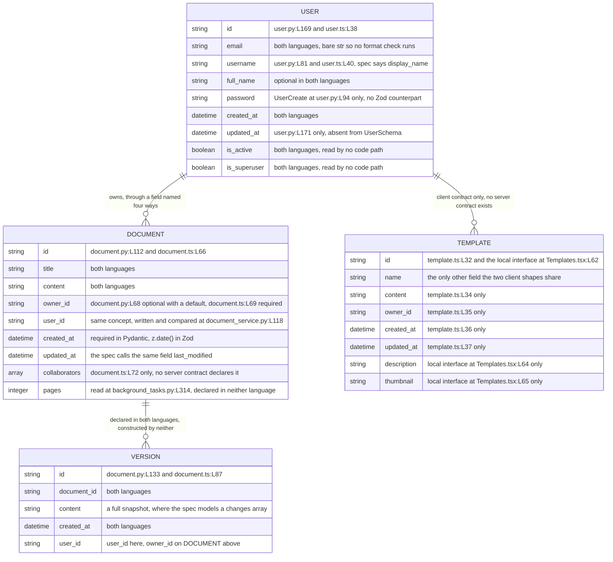

# Data Model Reference

Two contract languages describe the same four entity families in this repository, and no artifact
keeps them in agreement. The Pydantic models under `backend/app/schema/` and the Zod schemas under
`frontend/src/schema/` have drifted apart as a result. [Why drift arose](#why-drift-arose) states
that mechanism before any divergence appears, because one cause explains every row that follows.

Persistence splits the same way. Google Cloud Firestore holds every record the code writes, and the
Cloud SQL path stays declared and unreachable.

## How to read this reference

Every factual claim below carries a locator in the form `path:Lnn`, and most locators also name the
symbol at that line. Read the symbol name as the durable half of the citation. Line numbers move
whenever anyone edits a file above them, and symbol names do not.

Three conventions govern the locators, matching [troubleshooting.md](troubleshooting.md) and
[architecture-overview.md](architecture-overview.md) so all three documents agree:

- Locators point at the committed state at the current branch head, which includes the inline
  documentation added to 44 source files. A locator matches what you see when you open the file
  today, not what an earlier revision held.
- Line numbers are physical. No source file in this repository ends with a newline, so `wc -l`
  reports one line fewer than each file contains.
- A range such as `L65-L73` covers every line in the span, inclusive.

Six words carry one fixed meaning throughout.

| Term | Meaning |
|------|---------|
| router | A FastAPI `APIRouter` instance |
| handler | A route function carrying a `@router` decorator |
| service | A domain service class under `backend/app/services/` |
| adapter | A persistence module under `backend/app/db/` |
| slice | A Redux Toolkit slice under `frontend/src/store/` |
| marker | A `HUMAN ASSISTANCE NEEDED` comment left by the code's authors |

The three documents under `documentation/` record intended behaviour rather than committed
behaviour. Anything drawn from them carries the label **declared intent** and a citation by heading
name plus line, because all three files use unnumbered headings only.
`documentation/Technical Specifications.md` holds five level-one headings: `L3` INTRODUCTION, `L125`
SYSTEM ARCHITECTURE, `L300` SYSTEM DESIGN, `L523` TECHNOLOGY STACK and `L620` SECURITY
CONSIDERATIONS. A numbered section citation anywhere in this documentation set refers to the
generated Technical Specification, a separate document, and the text says so when it does.

Where this engagement made a judgement, [decision-log.md](decision-log.md) carries the argument. No
rationale lives in this file.

## Persistence overview

Firestore is the live path, and Cloud SQL is declared only.

| Path | Declared at | Live | What reaches it |
|------|-------------|------|-----------------|
| Google Cloud Firestore | `backend/app/db/firestore.py:L41-L42` | Yes | `DocumentService` and the Celery tasks, through the shared client |
| Google Cloud SQL | `backend/app/db/sql.py:L16-L19` | No | Nothing. No model, no migration, no caller |

### The Firestore path

`backend/app/db/firestore.py:L41` resolves Application Default Credentials (ADC) through
`credentials, project = default()`, and `:L42` constructs
`db = Client(project=settings.GOOGLE_CLOUD_PROJECT)`. Both statements run at import time, so
importing the adapter reaches for credentials before any handler runs.

The adapter exposes four synchronous helpers: `get_document` at `:L44`, `create_document` at `:L72`,
`update_document` at `:L94` and `delete_document` at `:L112`. **No service consumes any of them.**
Three modules import the adapter, and all three import only the `db` client:
`backend/app/main.py:L21`, `backend/app/services/document_service.py:L61` and
`backend/app/tasks/background_tasks.py:L93`. `DocumentService` holds that client at
`backend/app/services/document_service.py:L72` and calls the Firestore application programming
interface (API) itself at `:L116`, `:L170`, `:L236` and `:L275`.

One annotation contradicts its own body. `backend/app/db/firestore.py:L44` declares
`get_document(...) -> dict`, and `:L70` returns `None` on the missing-snapshot branch, so a caller
that trusts the annotation dereferences `None`.

Code touches three collections. `documents` carries every document record, written at
`backend/app/services/document_service.py:L120` and read at `:L171`. The retention task adds
`document_permissions` at `backend/app/tasks/background_tasks.py:L283` and `document_metadata` at
`:L284`. No code path writes a users collection or a templates collection, so the user and template
contracts below describe records that nothing stores.

### The Cloud SQL path

`backend/app/db/sql.py:L16` builds an engine from `settings.DATABASE_URL` at import time, `:L17`
builds `SessionLocal`, and `:L19` builds `Base`. `:L21-L39` defines `get_db()`, the repository's
only generator, yielding a session at `:L37` and closing it at `:L39`.

Nothing downstream uses any of it:

- `Base` is never subclassed. No `class ...(Base)` statement exists anywhere under `backend/`.
- No object-relational mapping (ORM) model exists, so the `orm_mode` setting on the `User` contract
  has no mapped object to read.
- No Alembic configuration exists. Neither `alembic.ini` nor a migration directory is committed.
- `init_db` is never defined. `backend/app/main.py:L22` imports the name from this module, and no
  `def init_db` appears anywhere in the repository.

[../backend/app/db/README.md](../backend/app/db/README.md) carries the module-level detail for both
adapters, and [integration-guide.md](integration-guide.md) covers the credential model.

## Why drift arose

No artifact forces the two languages to agree. The repository commits no OpenAPI document,
generates no client from either contract, and shares no schema package across the Python and
TypeScript trees. Developers therefore maintain the Pydantic models under `backend/app/schema/` and
the Zod schemas under `frontend/src/schema/` by hand, in two places, with no check between them.
Every field-name and shape divergence in this document follows from that one absence.

## Entity families

Four entity families exist. Three carry a contract in both languages, and the template family
carries one on the client only.

| Family | Pydantic artifact | Zod artifact | Firestore collection | State |
|--------|-------------------|--------------|----------------------|-------|
| Document | `DocumentBase`, `DocumentCreate`, `DocumentUpdate`, `Document` at `backend/app/schema/document.py:L57-L114` | `DocumentSchema` at `frontend/src/schema/document.ts:L65-L73` | `documents` | Server contract carries live traffic. The client schema is never applied |
| User | `UserBase`, `UserCreate`, `UserUpdate`, `User` at `backend/app/schema/user.py:L71-L177` | `UserSchema` and `type User` at `frontend/src/schema/user.ts:L37-L56` | none | Contracts only. No handler writes a user record, because `app.services.user_service` does not exist |
| Template | **none** | `TemplateSchema` and `type Template` at `frontend/src/schema/template.ts:L31-L41` | none | No server contract exists, and the client holds two incompatible shapes |
| Version | `DocumentVersion` at `backend/app/schema/document.py:L116-L137` | `DocumentVersionSchema` at `frontend/src/schema/document.ts:L86-L92` | none | Declared in both languages and constructed by neither |

The template family has no server contract at all. No `backend/app/schema/template.py` is committed,
so `backend/app/api/templates.py:L75` imports `Template`, `TemplateCreate` and `TemplateUpdate` from
`app.schema.template` and resolves none of them. `:L76` imports the equally absent
`app.services.template_service`. The five template handlers therefore describe a family whose
server-side shape nobody wrote.

The version family is declared twice and never reached. No Python code path constructs
`DocumentVersion`, and no client module imports `DocumentVersionSchema`, so no version record is
written or read in either language.

The entity-relationship (ER) diagram below adds what the table above cannot: the links between the
four families, and the language that declares each individual field.

## Pydantic contracts

Nine model classes sit across two files, and both files import `List` without using it.

The document family is the only one with a service behind it. `backend/app/api/documents.py` gives it
a full create, read, update and delete (CRUD) surface across five handlers at `:L56`, `:L114`,
`:L148`, `:L191` and `:L240`, and `DocumentService` implements all five operations. The user and
template families both import a service module that does not exist.

### `backend/app/schema/document.py`

| Class | Base | Fields | Notes |
|-------|------|--------|-------|
| `DocumentBase` `L57-L68` | `BaseModel` | `title` `L66`, `content` `L67`, `owner_id` `L68` | `owner_id` is `Optional[str] = None`, so a document validates with no owner recorded |
| `DocumentCreate` `L70-L82` | `DocumentBase` | none of its own, a bare `pass` at `L82` | Adds no field, so the create request body accepts a client-supplied `owner_id` |
| `DocumentUpdate` `L84-L96` | `BaseModel` | `title` `L95`, `content` `L96`, both optional | Does not inherit `DocumentBase`, so the update contract shares no field definition with the model it updates |
| `Document` `L98-L114` | `DocumentBase` | `id` `L112`, `created_at` `L113`, `updated_at` `L114` | Both timestamps are required, and no service writes either one |
| `DocumentVersion` `L116-L137` | `BaseModel` | `id` `L133`, `document_id` `L134`, `content` `L135`, `created_at` `L136`, `user_id` `L137` | Declares `user_id` where `DocumentBase` declares `owner_id`, in this same file |

Two required fields have no writer, and the consequence lands on every read. `Document` at `L98`
requires `created_at` at `L113` and `updated_at` at `L114`. The service assembles its record from
`document.dict()` at `backend/app/services/document_service.py:L117`, adds `user_id` at `:L118` and
`id` at `:L119`, and writes neither timestamp. `Document(**doc_data)` at `:L123` therefore raises a
validation error on two missing required fields, and the create handler never returns.

The unused `List` import sits at `L54`.

### `backend/app/schema/user.py`

| Class | Base | Fields | Notes |
|-------|------|--------|-------|
| `UserBase` `L71-L82` | `BaseModel` | `email` `L80`, `username` `L81`, `full_name` `L82` | `email` is a bare `str` rather than `EmailStr`, so no format check runs. `full_name` is optional |
| `UserCreate` `L84-L94` | `UserBase` | `password` `L94` | The only contract in either language that models a password |
| `UserUpdate` `L96-L112` | `BaseModel` | `email` `L109`, `username` `L110`, `full_name` `L111`, `password` `L112` | Does not inherit `UserBase`. Every field is optional, so a caller may send any subset |
| `User` `L114-L173` | `UserBase` | `id` `L169`, `created_at` `L170`, `updated_at` `L171`, `is_active` `L172`, `is_superuser` `L173` | Carries a nested `Config` at `L175` with `orm_mode = True` at `L177`. Declares no password field |

Three properties of this file shape the drift downstream.

`orm_mode = True` inside a nested `Config` at `L175-L177` is the Pydantic 1.x spelling, so the
contract pins the backend to Pydantic 1.x. The setting lets a model read attributes off an object
instead of a dictionary, and no ORM model exists anywhere in the backend for it to read.

`User` declares no field for the password hash. `backend/app/api/auth.py:L326` computes one with
`pwd_context.hash(user.password)` during registration, and the response contract at `L114` has
nowhere to carry it. `UserCreate` declares `password` at `L94`, so the plaintext field crosses the
boundary inbound and the hash has no modelled home outbound.

`is_active` at `L172` and `is_superuser` at `L173` are read by no code path in the repository. Both
names appear only as declarations across every `.py`, `.ts` and `.tsx` file.

The unused `List` import sits at `L68`.
[../backend/app/schema/README.md](../backend/app/schema/README.md) carries the per-model detail, and
[../backend/app/api/README.md](../backend/app/api/README.md) covers the handlers that bind these
models.

## Zod contracts

Three modules under `frontend/src/schema/` export five symbols between them, and one omission in the
document module causes five compiler errors.

### `frontend/src/schema/document.ts`

| Export | Kind | Fields | Notes |
|--------|------|--------|-------|
| `DocumentSchema` `L65-L73` | `z.object` value | `id` `L66`, `title` `L67`, `content` `L68`, `owner_id` `L69`, `created_at` `L70`, `updated_at` `L71`, `collaborators` `L72` | `owner_id` is required here and optional in the Pydantic contract. `collaborators` has no server counterpart |
| `DocumentVersionSchema` `L86-L92` | `z.object` value | `id` `L87`, `document_id` `L88`, `content` `L89`, `created_at` `L90`, `user_id` `L91` | Declares `user_id` where `DocumentSchema` declares `owner_id`, in this same file |
| inferred type | **absent** | none | The module exports no `z.infer` alias, and both sibling modules export one |

Both timestamp fields use `z.date()`, which rejects a string. The server serializes `datetime` to
text, so every timestamp crosses the boundary as a JavaScript Object Notation (JSON) string in
International Organization for Standardization (ISO) 8601 form. `z.date()` at `L70`, `L71` and `L90`
would reject all three of those strings.

One omission accounts for five compiler errors. Five type names arrive from three importing modules,
and the module exports none of them:

| Requested symbol | Requested at |
|------------------|--------------|
| `Document`, `DocumentCreate`, `DocumentUpdate` | `frontend/src/services/api.ts:L80` |
| `Document` | `frontend/src/services/collaboration.ts:L15` |
| `Document` | `frontend/src/store/documentSlice.ts:L22` |

Both sibling modules do export an inferred type, at `frontend/src/schema/user.ts:L56` and
`frontend/src/schema/template.ts:L41`, so the omission departs from the convention its own directory
follows. [../frontend/src/schema/README.md](../frontend/src/schema/README.md) owns the full chain, and
[troubleshooting.md](troubleshooting.md) records the compiler codes.

### `frontend/src/schema/user.ts` and `frontend/src/schema/template.ts`

| Export | Kind | Fields | Notes |
|--------|------|--------|-------|
| `UserSchema` `L37-L45` | `z.object` value | `id` `L38`, `email` `L39`, `username` `L40`, `full_name` `L41`, `created_at` `L42`, `is_active` `L43`, `is_superuser` `L44` | `email` carries `.email()`, so the client checks a format the server does not. No `updated_at` field |
| `type User` `L56` | `z.infer` alias | derived from `UserSchema` | The client-side user type, and the shape every component reads through |
| `TemplateSchema` `L31-L38` | `z.object` value | `id` `L32`, `name` `L33`, `content` `L34`, `owner_id` `L35`, `created_at` `L36`, `updated_at` `L37` | No server contract exists to compare against |
| `type Template` `L41` | `z.infer` alias | derived from `TemplateSchema` | Competes with a local `interface Template` at `frontend/src/pages/Templates.tsx:L61-L66` |

All three modules import `zod` at `frontend/src/schema/document.ts:L43`,
`frontend/src/schema/user.ts:L15` and `frontend/src/schema/template.ts:L21`. The package appears
nowhere in `frontend/package.json`, whose dependency block at `L6-L14` declares exactly seven
runtime packages, none of them `zod`. Every schema module therefore fails to resolve its own import.

## Contract drift table

Eleven concepts disagree across the boundary. Every row below is an instance of the single mechanism
in [Why drift arose](#why-drift-arose), not an independent defect.

Every specification line in the fourth column falls under the SYSTEM DESIGN heading at
`documentation/Technical Specifications.md:L300`, and every entry in that column is declared intent
rather than committed behaviour.

| Concept | Pydantic position | Zod position | Declared intent | Consequence |
|---------|-------------------|--------------|-----------------|-------------|
| Ownership field | `owner_id` at `document.py:L68`, `user_id` at `:L137` | `owner_id` at `document.ts:L69`, `user_id` at `:L91` | `owner_id` at `L333`, `L375`, `L383` | Four positions disagree. See [the ownership field](#the-ownership-field-four-positions-none-canonical) |
| Modification timestamp | `updated_at` at `document.py:L114` | `updated_at` at `document.ts:L71` | `last_modified` at `L335` and `L377` | The two contracts agree with each other and differ from declared intent |
| Timestamp type | `datetime`, which the server serializes to text | `z.date()` at `document.ts:L70`, `:L71`, `:L90` | `timestamp` at `L334-L335` | `z.date()` rejects an ISO 8601 string, so validation would fail on correct server data |
| Collaborator list | no model declares one | `collaborators: z.array(z.string())` at `document.ts:L72` | a `Collaborators` node in the Firestore diagram at `L325`, with no field enumerated | A client-only array. No handler returns one, so a response never carries the field |
| User modification timestamp | `updated_at` required at `user.py:L171` | absent from `UserSchema` at `user.ts:L37-L45` | `created_at` only, at `L354` | The client type cannot carry a field the server contract requires |
| Password | required on `UserCreate` at `user.py:L94`, absent from `User` at `:L114` | modelled in neither schema | not enumerated in either collection listing | The hash computed at `backend/app/api/auth.py:L326` has no modelled home outbound |
| Display name | `username` at `user.py:L81`, `full_name` at `:L82` | `username` at `user.ts:L40`, `full_name` at `:L41` | `display_name` at `L353` | Three names for one concept, and the client reads a fourth at `Header.tsx:L78`, `Home.tsx:L59` and `Settings.tsx:L82` |
| Avatar | no model declares one | no schema declares one | not enumerated | `Header.tsx:L77` sets an image source from `currentUser.avatar`, which no contract declares |
| Page count | no model declares `pages` | no schema declares `pages` | not enumerated | `background_tasks.py:L314` evaluates `len(document.pages)` against a contract without the field |
| Template shape | no contract at all | `TemplateSchema` at `template.ts:L31-L38` | `template_id`, `name`, `owner_id`, `created_at` at `L380-L385` | Two client shapes share two fields. See the comparison below |
| Version shape | a full snapshot, `content` at `document.py:L135` | a full snapshot, `content` at `document.ts:L89` | a delta, `changes` as an array of operations, at `L341` | Both contracts store whole content where declared intent stores operations |

### Two incompatible template shapes

The client holds two definitions of a template, and they share `id` and `name` and nothing else. No
server contract exists to arbitrate between them.

| Field | `TemplateSchema`, `frontend/src/schema/template.ts` | `interface Template`, `frontend/src/pages/Templates.tsx` |
|-------|-----------------------------------------------------|---------------------------------------------------------|
| `id` | `L32` | `L62` |
| `name` | `L33` | `L63` |
| `content` | `L34` | absent |
| `owner_id` | `L35` | absent |
| `created_at` | `L36` | absent |
| `updated_at` | `L37` | absent |
| `description` | absent | `L64` |
| `thumbnail` | absent | `L65` |

The page renders from its own local interface, so the exported `type Template` at
`frontend/src/schema/template.ts:L41` describes a shape no component consumes.
[troubleshooting.md](troubleshooting.md) records the same divergences as defect entries, and
[../frontend/src/schema/README.md](../frontend/src/schema/README.md) covers the client contracts in
isolation.

## The ownership field: four positions, none canonical

Authorization in this repository compares an ownership field, and four positions disagree about its
name.

| # | Position | Location | Field |
|---|----------|----------|-------|
| 1 | Pydantic document contract | `backend/app/schema/document.py:L68`, on `DocumentBase` and inherited by `Document` | `owner_id: Optional[str] = None` |
| 2 | Pydantic version contract | `backend/app/schema/document.py:L137`, on `DocumentVersion` | `user_id: str` |
| 3 | Service write and comparison | `backend/app/services/document_service.py:L118` writes it, and `:L177`, `:L243` and `:L282` compare it | `user_id` |
| 4 | Declared intent | `documentation/Technical Specifications.md:L333`, `:L375` and `:L383`, under the SYSTEM DESIGN heading at `L300` | `owner_id` |

Positions 1 and 2 sit inside the same file. The split is internal to one contract module, 69 lines
apart, so a reader who opens `backend/app/schema/document.py` sees both names without leaving it.

The client mirrors the same split. `frontend/src/schema/document.ts:L69` declares `owner_id` on the
document schema, and `:L91` declares `user_id` on the version schema, reproducing the server
disagreement field for field.

Two details make the drift worse than a naming disagreement.

The first sits in the contract. `owner_id` at `backend/app/schema/document.py:L68` is optional and
defaults to `None`, so a document can validate without the field that authorization depends on. The
contract never requires the value the ownership check reads.

The second sits in the routers. `backend/app/api/documents.py:L187`, `:L235` and `:L282` read
`document.user_id` off values annotated as `Document`, and `Document` declares `owner_id` rather than
`user_id`. Each router follows the service convention instead of the contract its own annotation
names, so the attribute access fails on a model that validates.

**No position in the table is canonical.** Selecting one would change an interface, which this
documentation engagement excluded. [decision-log.md](decision-log.md) carries the entry for that
choice, and [../backend/app/services/README.md](../backend/app/services/README.md) documents the
comparison as the service implements it.

## Transformation points

Document content changes shape nine times outbound and nine times inbound. Four of those eighteen
steps are broken, three at the client boundary and one in the response model. Each transformation
below names its own file and line.

### Outbound, editor state to stored record

| # | Step | Where | What changes |
|---|------|-------|--------------|
| 1 | Draft.js `EditorState` | `frontend/src/components/DocumentCanvas.tsx:L163` calls the serializer | The in-memory editor model, passed as a `ContentState` where `frontend/src/utils/documentUtils.ts:L39` declares `EditorState` |
| 2 | `convertToRaw` | `frontend/src/utils/documentUtils.ts:L40` | `EditorState` becomes a raw content object of `blocks` and `entityMap` |
| 3 | `JSON.stringify` | `:L41` | The raw object becomes one string |
| 4 | `DocumentSchema.isValid` | `:L44` | Nothing. The call raises, so the serializer never returns its string |
| 5 | Request body | `frontend/src/services/api.ts:L246` for a create, `:L288` for an update | The string travels as the `content` field |
| 6 | Pydantic validation | `DocumentCreate` at `backend/app/schema/document.py:L70` | The body becomes a typed model, and `owner_id` is accepted from the caller |
| 7 | `document.dict()` | `backend/app/services/document_service.py:L117` | The model becomes a plain dictionary |
| 8 | Key additions | `:L118` and `:L119` | The service adds `user_id` and then `id`, so one record carries both ownership names |
| 9 | Firestore write | `:L120` | `doc_ref.set(doc_data)` stores the record in `documents` |

The editor takes the update variant rather than the create variant.
`frontend/src/pages/Editor.tsx:L214` schedules `autoSave` five seconds after a change, and `:L207`
calls `updateDocument` with `{ content }` alone. The service update path at
`backend/app/services/document_service.py:L236-L252` costs three Firestore operations: a read at
`:L237`, a write at `:L248`, and a second read at `:L251`.

### Inbound, stored record to editor state

| # | Step | Where | What changes |
|---|------|-------|--------------|
| 1 | Firestore read | `backend/app/services/document_service.py:L171` | A snapshot arrives from `documents` |
| 2 | `doc.to_dict()` | `:L177` for the ownership check, `:L181` for the model | The snapshot becomes a dictionary, read twice |
| 3 | `Document(**...)` | `:L181` | The dictionary becomes a typed model, and raises on the two required timestamps nothing wrote |
| 4 | Response body | `backend/app/api/documents.py:L189` returns the model | Pydantic serializes `datetime` to an ISO 8601 string |
| 5 | Zod validation | nowhere | No response is parsed by any Zod schema in the repository |
| 6 | `JSON.parse` | `frontend/src/utils/documentUtils.ts:L67` | The stored string becomes a raw content object |
| 7 | `DocumentSchema.isValid` | `:L73` | Nothing. The call raises, so the deserializer never returns |
| 8 | `convertFromRaw` | `:L77` | The raw object becomes a `ContentState` |
| 9 | `EditorState.createWithContent` | `:L78` | The `ContentState` becomes an `EditorState` |

`frontend/src/components/DocumentCanvas.tsx:L116` enters this path, calling the deserializer with
`currentDocument.content`.

### Three faults at the client boundary

`DocumentSchema.isValid` is not a Zod API. Zod object schemas expose `parse` and `safeParse`, and no
`isValid` property exists on them, so both calls raise at
`frontend/src/utils/documentUtils.ts:L44` and `:L73`.

Both calls are also a category error. `DocumentSchema` at `frontend/src/schema/document.ts:L65-L73`
models document metadata: identifier, title, content, owner, two timestamps and a collaborator list.
`convertToRaw` at `documentUtils.ts:L40` produces Draft.js raw content, whose top-level keys are
`blocks` and `entityMap`. Checking raw editor content against a metadata schema compares unrelated
shapes. The method name and the schema choice are each wrong on their own, so the two faults are
independent.

No Zod schema validates any response anywhere. The only `safeParse` calls in the frontend sit at
`frontend/src/utils/validation.ts:L26` and `:L50`, against an email address and a password. Every
document response therefore reaches the store unchecked, and the `z.date()` declarations at
`frontend/src/schema/document.ts:L70`, `:L71` and `:L90` never run against the ISO 8601 strings they
would reject.

```mermaid
graph TD
    subgraph OUT["Outbound: editor state to Firestore"]
        ES["Draft.js EditorState<br/>DocumentCanvas.tsx:L163"]
        RAW["raw content, blocks and entityMap<br/>convertToRaw, documentUtils.ts:L40"]
        STR["serialized string<br/>JSON.stringify, documentUtils.ts:L41"]
        GUARD1["DocumentSchema.isValid<br/>documentUtils.ts:L44"]
        BODY["request body<br/>api.ts:L246 create, :L288 update"]
        PYD["Pydantic model<br/>DocumentCreate, document.py:L70"]
        DICT["plain dictionary<br/>document.dict, document_service.py:L117"]
        KEYS["adds user_id then id<br/>document_service.py:L118-L119"]
    end

    STORE[("Firestore collection documents<br/>set, document_service.py:L120")]

    subgraph IN["Inbound: Firestore to editor state"]
        READ["snapshot dictionary<br/>to_dict, document_service.py:L171"]
        MODEL["typed model<br/>Document(**...), document_service.py:L181"]
        RESP["response body<br/>documents.py:L189"]
        GUARD2["Zod validation of the response"]
        PARSE["raw content object<br/>JSON.parse, documentUtils.ts:L67"]
        GUARD3["DocumentSchema.isValid<br/>documentUtils.ts:L73"]
        CONTENT["ContentState<br/>convertFromRaw, documentUtils.ts:L77"]
        ES2["EditorState<br/>createWithContent, documentUtils.ts:L78"]
    end

    ES --> RAW --> STR --> GUARD1
    GUARD1 -.->|"raises: isValid is not a Zod API, and checks content against a metadata schema"| BODY
    BODY --> PYD --> DICT --> KEYS --> STORE
    STORE --> READ --> MODEL
    MODEL -.->|"raises: created_at and updated_at are required at document.py:L113-L114 and never written"| RESP
    RESP --> GUARD2
    GUARD2 -.->|"skipped: no response is parsed anywhere, so z.date() never meets the ISO 8601 string it rejects"| PARSE
    PARSE --> GUARD3
    GUARD3 -.->|"raises: isValid is not a Zod API, and checks content against a metadata schema"| CONTENT
    CONTENT --> ES2

%% A solid edge carries data today. A dashed edge marks a broken step, and its label names the fault.
```

## Related documentation

Start at [docs/README.md](README.md), which indexes every document in this set.

Repository-level documents beside this one:

- [architecture-overview.md](architecture-overview.md), the six-area map and the four tiers
- [troubleshooting.md](troubleshooting.md), the same divergences as numbered defect entries
- [integration-guide.md](integration-guide.md), Firestore, Cloud Storage and the absent Redis broker
- [deployment-guide.md](deployment-guide.md), what the infrastructure assets do today
- [onboarding.md](onboarding.md), clean-machine setup and a prioritised task list
- [decision-log.md](decision-log.md), every judgement this engagement made, with its reasoning

Module documentation for the directories this reference draws on:

- [../backend/app/schema/README.md](../backend/app/schema/README.md), the Pydantic contracts
- [../frontend/src/schema/README.md](../frontend/src/schema/README.md), the Zod contracts
- [../backend/app/db/README.md](../backend/app/db/README.md), both persistence adapters
- [../backend/app/services/README.md](../backend/app/services/README.md), the ownership comparison
- [../backend/app/api/README.md](../backend/app/api/README.md), the handlers that bind the contracts
- [../frontend/src/store/README.md](../frontend/src/store/README.md), the document slice
- [../frontend/src/utils/README.md](../frontend/src/utils/README.md), serialization and validation

Declared intent, read as comparison and never as committed behaviour:
[Technical Specifications](<../documentation/Technical Specifications.md>), whose DATABASE DESIGN
material sits under the SYSTEM DESIGN heading at `L300`.
