# Deployment Guide

Nothing in this repository deploys. Four asset groups describe a deployment, and each group stops
before it finishes. Terraform sits under `infrastructure/terraform/`, container definitions under
`infrastructure/docker/`, two GitHub Actions workflows under `.github/workflows/`, and two shell
scripts under `scripts/`.

Eleven blockers stand in the way, and they are not eleven parallel problems: each execution path
hits one blocker and hides the rest behind it. [Why a deploy fails as
committed](#why-a-deploy-fails-as-committed) groups them by path, separating the blocker a run
reports from the latent blockers it never reaches. Clearing a first-hit blocker exposes the next one
on that path rather than producing a working deploy.

The sections below describe each asset group as committed, then list every failure point in the
order a reader hits it. Every claim carries an inline citation in the form `path:Lnn`, so a reader
can open the file and check the line. Line numbers refer to the current state of each file.

## What exists today

Four asset groups carry every deployment instruction in the repository. The table below states what
each group provisions or runs, and points at the module README that documents the group in full. The
Lines column counts physical lines at the documentation baseline, commit `06be74c`, so each figure
matches the per-file census in the module README beside it. Only Terraform changed after that commit,
and its three files now hold 281 physical lines, because this engagement added block comments to them.

| Asset group | Files | Lines | What it provisions or runs | Module README |
| ------------- | ------- | ------- | ---------------------------- | --------------- |
| `infrastructure/terraform/` | 3 | 281 now, 238 at `06be74c` | One virtual private cloud (VPC) network, one subnet, one firewall rule and one Cloud Storage bucket on Google Cloud, plus three module calls | [terraform](../infrastructure/terraform/README.md) |
| `infrastructure/docker/` | 3 | 105 | A backend image, a frontend image, and a three-service Compose topology for local work | [docker](../infrastructure/docker/README.md) |
| `.github/workflows/` | 2 | 43 | Continuous integration (CI) on pushes and pull requests to `main`, and continuous delivery (CD) on pushes to `main` | [workflows](../.github/workflows/README.md) |
| `scripts/` | 2 | 103 | A linear deploy script and a developer-machine setup script | [scripts](../scripts/README.md) |

Every count above is a physical line count. The Terraform row carries two numbers because the three
`.tf` files are the only deployment assets that received inline comments in this documentation pass. Those
comments took them from 238 lines to 281. Docker, the workflows and the shell scripts received none, so
their counts are the same at `06be74c` and at the current head.

Two categories of file that a deploy needs are missing from the tree.

No deployable artifact descriptor exists. `.github/workflows/cd.yml:L19-L20` and
`scripts/deploy.sh:L27` deploy `app.yaml` and `dispatch.yaml`, and the repository commits neither
file.

No dependency manifest for the backend exists either. No `requirements.txt`, `pyproject.toml`,
`setup.py` or `Pipfile` sits anywhere in the tree, while `infrastructure/docker/backend.Dockerfile:L8`
and `scripts/setup_dev_environment.sh:L26` both read one. `frontend/package.json` is the only
dependency manifest the repository commits, and no lockfile accompanies it.

Writing that missing manifest needs a definitive package list, and one authoritative inventory exists.
[../backend/app/README.md](../backend/app/README.md) carries it: seventeen required distributions,
ten named by an `import` statement and seven runtime companions no import names, of which thirteen
have to be named to a package manager. Every other document in this set, this one included, defers
to that inventory rather than restating it, so there is one list to keep correct.

## Terraform

The Terraform configuration declares 35 blocks and cannot initialise.
[../infrastructure/terraform/README.md](../infrastructure/terraform/README.md) owns the block census,
verified across the three files as follows.

| Block kind | Count | Location |
| ------------ | ------- | ---------- |
| `provider "google"` | 1 | `main.tf:L9-L12` |
| `resource` | 4 | `main.tf:L19`, `:L25`, `:L35`, `:L50` |
| `module` | 3 | `main.tf:L67`, `:L76`, `:L85` |
| `variable` | 13 | `variables.tf:L7` through `:L91` |
| `output` | 14 | `outputs.tf:L4` through `:L84` |

The provider block at `infrastructure/terraform/main.tf:L9-L12` configures Google Cloud and nothing
else. The block reads `var.project_id` at `:L10` and `var.region` at `:L11`.

### The four resources

Four resources make up everything the configuration builds directly.

| Resource | Location | What it declares |
| ---------- | ---------- | ------------------ |
| `google_compute_network.word_network` | `main.tf:L19-L22` | A custom-mode network. `auto_create_subnetworks = false` at `:L21`, so the network carries only the subnet declared below it |
| `google_compute_subnetwork.word_subnet` | `main.tf:L25-L30` | One subnet on the `10.0.0.0/24` Classless Inter-Domain Routing (CIDR) range at `:L27`, attached to the network at `:L29` |
| `google_compute_firewall.allow_internal` | `main.tf:L35-L45` | Transmission Control Protocol (TCP) ports `0-65535` at `:L41`, from source range `10.0.0.0/24` at `:L44` |
| `google_storage_bucket.word_documents` | `main.tf:L50-L59` | A bucket named `word-documents-${var.project_id}` at `:L51`, with uniform bucket-level access at `:L54` and versioning at `:L56-L58` |

The firewall rule opens every TCP port to the whole subnet. `main.tf:L41` sets
`ports = ["0-65535"]` and `:L44` sets `source_ranges = ["10.0.0.0/24"]`, so all 65,536 ports accept
traffic from every address inside the range the subnet declares at `:L27`. No narrower rule exists
anywhere in the configuration, and the rule names no `target_tags`, so the opening applies to every
instance on the network.

The bucket sets no storage class. `variables.tf:L37` declares a `storage_class` variable defaulting
to `STANDARD`, and the bucket block at `main.tf:L50-L59` passes no `storage_class` argument. The
bucket therefore takes the provider default, and the declared variable never reaches it.

### Three module sources that do not exist

Three module calls source directories that are absent, and `terraform init` stops on them.

| Module call | Block | `source` | Directory |
| ------------- | ------- | ---------- | ----------- |
| `word_backend` | `main.tf:L67-L74` | `./modules/word_backend` at `:L68` | absent |
| `word_frontend` | `main.tf:L76-L83` | `./modules/word_frontend` at `:L77` | absent |
| `word_database` | `main.tf:L85-L92` | `./modules/word_database` at `:L86` | absent |

No `modules/` directory exists under `infrastructure/terraform/`. `terraform init` reports
`Unreadable module directory` and exits, so no plan and no apply can run. All three calls pass the
same four arguments, `project_id`, `region`, `network_id` and `subnet_id`, drawn from the two
variables and the two network resources above.

### No `terraform` block

The configuration declares no `terraform` block at all. A search of all three files returns zero,
and three consequences follow.

- No `required_providers` entry pins the Google provider, so `terraform init` would resolve whatever
  version the registry serves that day.
- No `required_version` constraint pins Terraform itself, so any command-line version may run the
  configuration.
- No backend block redirects state, so Terraform writes state to a local `terraform.tfstate` file
  beside the sources. A local state file travels with one machine, so two engineers running `apply`
  would each track a separate copy of the same infrastructure.

That local state file is a disclosure risk as well as a coordination one, and nothing in the
repository guards against it. Terraform state stores resolved attribute values in plaintext,
including the database password the two connection-string outputs interpolate. Marking an output
`sensitive = true`, as `outputs.tf:L21` and `:L27` do, masks it in command-line output and does not
encrypt it in state.

The repository commits no `.gitignore` at all, so nothing excludes `terraform.tfstate`,
`terraform.tfstate.backup` or the `.terraform/` directory from `git add`. An engineer who runs
`apply` in this directory and then stages their work can commit a plaintext credential without any
warning. Two mitigations exist and neither is committed: a remote backend with encryption at rest,
or a `.gitignore` rule covering the state files.

### Variables and outputs

`infrastructure/terraform/variables.tf` declares 13 variables, and 11 of them have no consumer.
`project_id` at `:L7` and `region` at `:L14` are the only two that any resource reads. Five of the
unreferenced 11 are `zone` at `:L21`, `compute_instance_type` at `:L29`, `storage_class` at `:L37`,
`database_tier` at `:L44` and `environment` at `:L53`. The other six are three instance counts at
`:L61`, `:L67` and `:L73`, and three storage sizes at `:L79`, `:L85` and `:L91`.

No variable declares a `validation` block. A search of the file returns zero, so `environment` at
`:L53` accepts any string, and not only the `dev`, `staging` and `prod` values its own description
names. `project_id` at `:L7` carries no default, and the repository commits no `.tfvars` file, so a
caller must supply the value on every invocation.

`infrastructure/terraform/outputs.tf` declares 14 outputs, and every one reads an Amazon Web
Services (AWS) address that no file in the folder declares.
[The cloud-provider contradiction](#the-cloud-provider-contradiction) covers all 14, the two that
carry a database password, and the one that names the wrong network.

Those output references block `terraform apply` on their own, independently of the module problem.
Terraform resolves every reference in the configuration before it plans. Each of the 14 outputs
names a resource address that no file declares, so the run reports an unresolved reference rather
than a plan. No apply happens, and no resource is created, until every output either points at a
declared resource or is removed. Fixing only the three module sources is therefore not enough: it
moves the failure from initialization to reference resolution.

A marker sits at `infrastructure/terraform/main.tf:L94-L99` and raises the subnet range, the
firewall rules, the bucket configuration and the module sources. A second marker sits at
`infrastructure/terraform/outputs.tf:L58-L60`.

## Containers

Two Dockerfiles build the two deployable units, and neither build completes.

### `backend.Dockerfile`

`infrastructure/docker/backend.Dockerfile` runs 27 lines and seven instructions.

| Line | Instruction | Effect |
| ------ | ------------- | -------- |
| `:L2` | `FROM python:3.9-slim` | Pins Python 3.9, which reached end of life on 31 October 2025 with 3.9.25 as its final security release |
| `:L5` | `WORKDIR /app` | Sets the build and run directory |
| `:L8` | `COPY requirements.txt .` | Stops the build. No `requirements.txt` exists anywhere in the repository |
| `:L11` | `RUN pip install --no-cache-dir -r requirements.txt` | Never runs |
| `:L14` | `COPY ./app /app` | Copies the package contents into the working directory root |
| `:L17` | `EXPOSE 8000` | Declares port 8000 |
| `:L20` | `CMD ["uvicorn", "main:app", "--host", "0.0.0.0", "--port", "8000"]` | Serves on port 8000 |

The image cannot build. `backend.Dockerfile:L8` copies a `requirements.txt` that no directory in the
repository contains, so the build fails there and `:L11` never installs a package. A marker at
`:L22-L27` asks for review of the Python version, the requirements file location, the application
directory and the environment configuration.

### `frontend.Dockerfile`

`infrastructure/docker/frontend.Dockerfile` runs 32 lines across two stages.

| Line | Instruction | Effect |
| ------ | ------------- | -------- |
| `:L2` | `FROM node:14-alpine as build` | Build stage on Node 14, which reached end of life on 30 April 2023 |
| `:L5` | `WORKDIR /app` | Sets the build directory |
| `:L8` | `COPY package*.json ./` | Copies `package.json`. The glob matches no lockfile, because the repository commits none |
| `:L11` | `RUN npm ci` | Stops the build. `npm ci` installs strictly from a lockfile |
| `:L14` | `COPY . .` | Never runs |
| `:L17` | `RUN npm run build` | Never runs. The script resolves to `react-scripts build` per `frontend/package.json:L33` |
| `:L20` | `FROM nginx:alpine` | Serve stage |
| `:L23` | `COPY --from=build /app/build /usr/share/nginx/html` | Copies the build output into the Nginx document root |
| `:L29` | `EXPOSE 80` | Declares port 80 |
| `:L32` | `CMD ["nginx", "-g", "daemon off;"]` | Starts Nginx in the foreground |

The image cannot build. `frontend.Dockerfile:L11` runs `npm ci`, which exits when no lockfile is
present, and `frontend/package-lock.json` is absent from the tree. The glob at `:L8` therefore
copies `package.json` alone.

### The Compose topology

`infrastructure/docker/docker-compose.yml` declares three services on one bridge network, in Compose
format `3.8` at `:L1`. Neither application service builds.

| Service | Build or image | Ports | Environment | Block |
| --------- | ---------------- | ------- | ------------- | ------- |
| `frontend` | context `../../frontend`, `dockerfile: Dockerfile` at `:L6-L7` | `3000:3000` at `:L9` | `REACT_APP_API_URL=http://backend:5000` at `:L11` | `:L4-L15` |
| `backend` | context `../../backend`, `dockerfile: Dockerfile` at `:L19-L20` | `5000:5000` at `:L22` | `DATABASE_URL` at `:L24` | `:L17-L28` |
| `db` | image `postgres:13` at `:L31` | none published | `POSTGRES_DB`, `POSTGRES_USER` and `POSTGRES_PASSWORD` at `:L33-L35` | `:L30-L39` |

A `postgres_data` named volume at `:L41-L42` persists the database directory, and the
`word-app-network` bridge at `:L44-L46` joins all three services. `depends_on` at `:L12-L13` and
`:L25-L26` orders `frontend` behind `backend` and `backend` behind `db`.
[../infrastructure/docker/README.md](../infrastructure/docker/README.md) owns the PostgreSQL 13
detail at `docker-compose.yml:L31`. The `POSTGRES_PASSWORD` value at `:L35` is a hard-coded literal,
and `:L24` embeds the same literal in the backend connection string.

Three contradictions sit in the container tier, and each one stops the topology on its own.

**Neither service finds a Dockerfile.** `docker-compose.yml:L6-L7` sets the `frontend` build context
to `../../frontend` and names `Dockerfile`, and `:L19-L20` sets the `backend` context to
`../../backend` and names `Dockerfile`. Neither `frontend/Dockerfile` nor `backend/Dockerfile`
exists. The two real files sit at `infrastructure/docker/frontend.Dockerfile` and
`infrastructure/docker/backend.Dockerfile`, outside both contexts and under different names, so
`docker compose build` fails for both services.

**The backend port mapping misses the served port.** `docker-compose.yml:L22` publishes `5000:5000`,
while `backend.Dockerfile:L17` exposes 8000 and `:L20` serves 8000. Nothing listens on container
port 5000, so no request reaches the application even after a successful build. The `frontend`
service compounds the gap by injecting `http://backend:5000` at `:L11`, which addresses that same
silent port.

**No Redis service exists.** `backend/app/core/config.py:L48` declares `REDIS_URL` as a required
field, and `backend/app/tasks/background_tasks.py:L22` builds
`Celery('microsoft_word', broker=settings.REDIS_URL)` at module scope. Compose declares `frontend`,
`backend` and `db` and nothing more, and a search of all of `infrastructure/` for `redis` or
`memorystore` returns no match. `infrastructure/terraform/main.tf` declares no cache resource either,
so the Celery broker has no target in the local topology or in the cloud configuration. No worker
process and no beat scheduler appears anywhere in the repository, and
[../backend/app/tasks/README.md](../backend/app/tasks/README.md) covers the task tier.

**All three runtime pins are past end of life.** Python 3.9 at `backend.Dockerfile:L2` ended support on
31 October 2025, and Node 14 at `frontend.Dockerfile:L2` on 30 April 2023. PostgreSQL 13 at
`docker-compose.yml:L31` ended support on 13 November 2025, with 13.23 as its final release. None of the
three receives security patches as of 6 August 2026, so every image this topology builds or pulls ships
an unsupported runtime. `nginx:alpine` at `frontend.Dockerfile:L20` pins no version at all, so a rebuild
can change the serving runtime with no file changing.

**Compose cannot supply the frontend a working API base URL, for four independent reasons.** Each one
is sufficient on its own, so correcting any one leaves the other three.

1. The key names never meet. `docker-compose.yml:L11` injects `REACT_APP_API_URL`, and
   `frontend/src/services/api.ts:L21` reads `process.env.REACT_APP_API_BASE_URL`, the only
   `process.env` read in the whole frontend.
2. Substitution happens at build time, not run time. `frontend/package.json:L29` pins `react-scripts`
   at `5.0.1`, and Create React App substitutes every `process.env.REACT_APP_*` reference into the
   bundle during `npm run build` at `frontend.Dockerfile:L17`. The runtime stage starts `nginx:alpine`
   at `:L20` and serves already-compiled files, so a Compose `environment` entry arrives after
   substitution has finished.
3. The browser cannot resolve the host. `http://backend:5000` names a Compose service, which Docker
   resolves only for containers on `word-app-network` at `docker-compose.yml:L44-L46`. The compiled
   bundle executes in the user's browser on the host, where `backend` is not a resolvable name.
4. The port is wrong even from inside the network, for the reason the port paragraph above gives.

Supplying a working base URL needs a build argument consumed before `npm run build`. That argument must use the
key the code reads, name a host the browser can resolve, and carry the port the server listens on.

**Compose supplies 1 of the 15 settings the backend needs.** `Settings` declares nine fields at
`backend/app/core/config.py:L40-L48`. Seven carry no default and are required, and the two `Optional`
GCP fields at `:L45-L46` default to `None`. Compose injects `DATABASE_URL` only.

| Setting | Declared at | Required | Compose supplies | Consequence |
| --------- | ------------- | ---------- | ------------------ | ------------- |
| `PROJECT_NAME` | `config.py:L40` | Yes | No | `Settings()` raises `ValidationError` |
| `API_V1_STR` | `config.py:L41` | Yes | No | `ValidationError`. Read by no module |
| `SECRET_KEY` | `config.py:L42` | Yes | No | `ValidationError`. Signs and verifies every token |
| `ACCESS_TOKEN_EXPIRE_MINUTES` | `config.py:L43` | Yes | No | `ValidationError`. Sets token lifetime |
| `ALGORITHM` | `config.py:L44` | Yes | No | `ValidationError`. Names the JWT algorithm |
| `GOOGLE_CLOUD_PROJECT` | `config.py:L45` | No, `Optional` | No | Resolves to `None`, and `backend/app/db/firestore.py:L20` passes it as the Firestore project |
| `GOOGLE_APPLICATION_CREDENTIALS` | `config.py:L46` | No, `Optional` | No | Resolves to `None`. No credential file is mounted into any container |
| `DATABASE_URL` | `config.py:L47` | Yes | Yes, `docker-compose.yml:L24` | Satisfied. Read at `backend/app/db/sql.py:L16` |
| `REDIS_URL` | `config.py:L48` | Yes | No | `ValidationError`. No Redis service exists to point it at |
| `ALLOWED_ORIGINS` | Nowhere | n/a | No | `AttributeError` at `backend/app/main.py:L73` |
| `PROJECT_ID` | Nowhere | n/a | No | `AttributeError` at `backend/app/services/collaboration_service.py:L69` |
| `STORAGE_BUCKET_NAME` | Nowhere | n/a | No | `AttributeError` at `backend/app/services/export_service.py:L60` |
| `SIGNED_URL_EXPIRATION` | Nowhere | n/a | No | `AttributeError` at `backend/app/services/export_service.py:L68` |
| `EXPORT_BUCKET_NAME` | Nowhere | n/a | No | `AttributeError` at `backend/app/tasks/background_tasks.py:L62` |
| `DOCUMENT_BUCKET_NAME` | Nowhere | n/a | No | `AttributeError` at `backend/app/tasks/background_tasks.py:L107` |

Six required fields are absent, so `Settings()` cannot construct. Six further settings are read from
`settings` and declared on no model, so no `.env` file and no Compose entry can supply them through
Pydantic. Both GCP fields resolve to `None`, which leaves Firestore, Cloud Storage and Pub/Sub with no
project and no credential path. No credential file is mounted into any container by any Compose
stanza. A backend container that got past the build would still fail during import, because
`backend/app/core/config.py` never constructs a module-level `settings` instance for the eight modules
that import one.

### The lost Python package boundary

The backend image flattens the Python package and breaks every internal import. The packaging fact
belongs to [../backend/app/README.md](../backend/app/README.md), and the deployment consequence
belongs here.

No `__init__.py` file exists anywhere under `backend/`. A filesystem scan and a `git ls-files`
search both return zero, so `app`, `app.api`, `app.core`, `app.db`, `app.schema`, `app.services` and
`app.tasks` are implicit namespace packages. All seven resolve only while `backend/` itself sits on
the import path.

Every backend module that imports a sibling nonetheless does so by absolute package path.
`backend/app/main.py:L20` reads `from app.core.config import settings`, and eleven further modules
follow the same form, which is 12 of the 15 modules under `backend/app/`. The remaining three,
`core/config.py`, `schema/document.py` and `schema/user.py`, import no sibling at all.

`infrastructure/docker/backend.Dockerfile:L14` copies `./app` to `/app`, which places the modules at
the filesystem root rather than beneath an `app` package. `:L20` then starts `uvicorn main:app`, a
command that matches the flattened layout and contradicts the source tree, where the application
object sits at `backend/app/main.py:L24`. The `app.` prefix used throughout the source cannot
resolve inside the image as built, so every internal import raises `ModuleNotFoundError` once a
`requirements.txt` gets past `:L8`.

## Pipelines

Two workflows automate the pipeline, and each one fails on its own first substantive step.
[../.github/workflows/README.md](../.github/workflows/README.md) owns the workflow detail.

### Continuous integration

`.github/workflows/ci.yml` runs 23 lines and one job. GitHub triggers the workflow on pushes to
`main` at `:L5` and on pull requests targeting `main` at `:L7`. The `build` job at `:L10` runs on
`ubuntu-latest` at `:L11`.

| Step | Location | Effect |
| ------ | ---------- | -------- |
| `actions/checkout@v2` | `:L13` | Checks out the repository. Version 2 is deprecated |
| `actions/setup-node@v2` | `:L15` | Installs Node, pinned to `'14'` at `:L17`. Version 2 is deprecated, and Node 14 is past end of life |
| `npm ci` | `:L19` | Fails. The step runs at the repository root, where no `package.json` and no lockfile exist |
| `npm test` | `:L21` | Never runs |
| `npm run build` | `:L23` | Never runs, and would fail on the 76 TypeScript errors if reached |

The job stops at `:L19`. No step sets a `working-directory`, so `npm ci` executes at the repository
root, and the only manifest in the tree sits at `frontend/package.json`. The workflow also defines no
Python job.

The Build step is a latent second blocker rather than a step that would pass. `npm run build` runs
`react-scripts build` (`frontend/package.json:L33`), which type-checks the project and treats a
TypeScript error as a build failure. Create React App downgrades those errors to warnings only when
`TSC_COMPILE_ON_ERROR=true` is set, and no committed file sets it, because the repository commits no
`.env`. `npx tsc --noEmit` reports 76 errors, so repairing the install moves the failure from `:L19`
to `:L23` rather than producing a green run.

No dedicated lint step and no dedicated type-check step exist, although both tools are configured:
`frontend/package.json:L36` defines a `lint` script, and `frontend/tsconfig.json:L25` sets
`"noEmit": true`, which supports a standalone type check. The `Build` step type-checks as a side
effect, which reports the errors at the wrong stage and gives no separate signal.

### Continuous delivery

`.github/workflows/cd.yml` runs 20 lines and one job. GitHub triggers the workflow on pushes to
`main` at `:L5` and on nothing else.

| Step | Location | Effect |
| ------ | ---------- | -------- |
| `actions/checkout@v2` | `:L11` | Checks out the repository |
| `google-github-actions/setup-gcloud@v0.2.0` | `:L13` | Installs the Google Cloud software development kit (SDK), reading a project identifier from the `GCP_PROJECT_ID` secret at `:L15` and a service-account key from the `GCP_SA_KEY` secret at `:L16` |
| `gcloud app deploy app.yaml --quiet` | `:L19` | Fails. The repository commits no `app.yaml` |
| `gcloud app deploy dispatch.yaml --quiet` | `:L20` | Never runs. The repository commits no `dispatch.yaml` |

The deploy step at `:L17-L20` stops on its first command, because both descriptors are absent from the
tree. The reason `:L20` never runs is the shell rather than the missing file. GitHub executes a `run:` block on
a Linux runner through `bash -e` by default, so the first non-zero exit ends the step. `cd.yml:L19` is
therefore the failure a run reports, and `cd.yml:L20` is latent. Supplying `app.yaml` alone moves the
failure to `cd.yml:L20`, and a run log shows one failure rather than two.

Two supply-chain facts sit in this job. The service-account key at `:L16` carries whatever identity and
access management (IAM) role the project granted it, and no committed file records that role. All three
action references in the two workflows are mutable tags rather than immutable commit references. Nothing
in this repository therefore fixes the code that handles the key, because only a full-length commit hash
pins an action. [../.github/workflows/README.md](../.github/workflows/README.md) carries the detail.

Three gaps surround the two workflows. Nothing gates CD on CI, so CD runs on a push to `main`
whether or not CI passed. A `needs:` key cannot close that gap, because `needs:` orders jobs inside
one workflow and cannot reference another workflow. The options are one combined workflow or a
`workflow_run` trigger on `cd.yml`, and neither file contains either key.

Neither workflow defines a rollback path, so a partial deploy stays partial. And
`infrastructure/terraform/main.tf` declares no App Engine resource, so the committed infrastructure
never provisions the target that both `gcloud app deploy` commands address. A search of the three
`.tf` files for `app_engine` returns no match.

### Operations risk register

Twelve risks apply to any environment built from these assets, and none of them is a build failure, so
none surfaces from a green pipeline. Each row names the committed evidence and the prerequisite that
closes it. Every one is future work; this documentation pass changes no manifest, image or workflow.

| # | Risk | Committed evidence | Prerequisite |
| --- | ------ | -------------------- | -------------- |
| 1 | Python 3.9 receives no security fix | `infrastructure/docker/backend.Dockerfile:L2` names `python:3.9-slim`, and `../README.md:L23` states Python 3.8 or later. Python 3.9 reached end of support on 31 October 2025, per the [Python release cycle](https://devguide.python.org/versions/) | Move to a supported Python and pin it in one place, with a reviewed backend dependency manifest behind it |
| 2 | Node.js 14 receives no security fix | `.github/workflows/ci.yml:L17` sets `node-version: '14'`, `infrastructure/docker/frontend.Dockerfile:L2` names `node:14-alpine`, and `../README.md:L22` states Node 14 or later. Node.js 14 left support on 30 April 2023, and its final release, 14.21.3, shipped on 16 February 2023, per [Node.js previous releases](https://nodejs.org/en/about/previous-releases) | Move to a supported Node major, declare it in `engines` and in the workflow, and add a lockfile so `npm ci` can run |
| 3 | PostgreSQL 13 receives no security fix | `infrastructure/docker/docker-compose.yml:L31` names `image: postgres:13`. PostgreSQL 13 reached end of life on 13 November 2025, so the community ships no further fix for the 13 branch, per the [versioning policy](https://www.postgresql.org/support/versioning/) and the [release announcement](https://www.postgresql.org/about/news/postgresql-181-177-1611-1515-1420-and-1323-released-3171/) | Move to a supported major, and plan the upgrade path for any data already written |
| 4 | Image references are mutable | Every `FROM` and every `image:` above names a tag. A tag can be repointed at different bytes by whoever publishes it, and `frontend.Dockerfile:L20` names `nginx:alpine`, which pins no minor version at all | Pin each image by digest, written `image@sha256:<hex>`, which is the only immutable form, and record the resolved version beside it |
| 5 | Action references are mutable | `ci.yml:L13`, `:L15` and `cd.yml:L11`, `:L13` name tags. Anyone with write access to an action repository can move or delete a tag. In the March 2025 `tj-actions/changed-files` compromise, tags v1 through v45.0.7 were repointed at a single malicious commit on 14 and 15 March 2025. The fix shipped in v46.0.1 ([CVE-2025-30066](https://github.com/advisories/GHSA-mrrh-fwg8-r2c3), [CISA alert](https://www.cisa.gov/news-events/alerts/2025/03/18/supply-chain-compromise-third-party-tj-actionschanged-files-cve-2025-30066-and-reviewdogaction)) | Replace each tag with a reviewed full-length commit SHA, which [GitHub documents](https://docs.github.com/en/actions/reference/security/secure-use) as the only immutable reference, and record the resolved version in a comment |
| 6 | Neither job declares the token scope it needs | Neither workflow declares a `permissions:` block at workflow or job level, so each job receives the default `GITHUB_TOKEN` scope. What that default grants is **not determinable from this repository**. A repository or organization setting fixes it, and no committed file records that setting. Whether the scope is broader than the work requires therefore cannot be read off the committed files. [GitHub's guidance](https://docs.github.com/en/actions/reference/security/secure-use) is to declare it regardless | Declare the minimum explicitly: `contents: read` for `ci.yml`, and `contents: read` plus `id-token: write` for `cd.yml` under federated identity |
| 7 | A service-account key authenticates the deploy, and nothing committed bounds it | `cd.yml:L16` passes `secrets.GCP_SA_KEY` to `setup-gcloud`. A user-managed service account key does not expire on its own, and grants its permissions to anyone who obtains it. The key's actual role, age and expiry are **not determinable from this repository**: no committed file records them, and an organization policy could bound them outside these files | Replace it with [Workload Identity Federation](https://docs.cloud.google.com/iam/docs/workload-identity-federation), which exchanges the OpenID Connect token GitHub issues for short-lived credentials and removes key handling entirely |
| 8 | No federated identity is configured | Nothing in either workflow requests an OIDC token, and no workload identity pool or provider appears in `infrastructure/terraform/` | Create a pool and provider, request `id-token: write` on the job, and add an attribute condition restricting the provider to this repository, because an unconditioned provider lets any repository authenticate |
| 9 | No credential rotation or audit exists | No committed file records which IAM role `GCP_SA_KEY` carries, when it was issued, or when it is next rotated. [Continuous delivery](#continuous-delivery) above records the same gap | Record the role, set a rotation schedule, and audit key use, until item 7 removes the key |
| 10 | Neither build context is bounded, and the frontend build copies the whole of it | No `.dockerignore` is tracked anywhere in the repository, so each build uploads its whole named directory to the daemon as its [build context](https://docs.docker.com/build/concepts/context/). `infrastructure/docker/frontend.Dockerfile:L14` then runs `COPY . .`, writing that context into the build stage on top of the `node_modules` its own `npm ci` at `:L11` installed. A local `.env` or key file in the tree travels the same route. The final stage copies only `/app/build` at `:L23`, so the shipped image stays clean while the uploaded context and the build cache do not | Commit a reviewed `.dockerignore` excluding at least `node_modules`, a local virtual environment, `.env` and key material, and treat it as a prerequisite for either direct build |
| 11 | Every container process runs as root | No `USER` instruction appears in `infrastructure/docker/backend.Dockerfile` or in either stage of `infrastructure/docker/frontend.Dockerfile`, and `python:3.9-slim`, `node:14-alpine` and `nginx:alpine` all default to root. Uvicorn at `backend.Dockerfile:L20` and the Nginx master at `frontend.Dockerfile:L32` therefore start as uid 0, so an exploited process begins with root inside the container | Add a `USER` with a non-root uid to each final stage, placed after the steps that need write access, and make the served paths readable by that uid |
| 12 | No container is contained or resource bounded | `infrastructure/docker/docker-compose.yml` declares no `user:`, `read_only:`, `cap_drop:`, `security_opt:`, `pids_limit:`, `mem_limit:` or `cpus:`, and no `deploy.resources.limits` block. Each of the three services keeps the default Linux capability set, a writable root filesystem and unbounded CPU, memory and process count, so one runaway container can exhaust the host and a compromised one can raise its own privileges | Drop all capabilities and add back only what each service needs, set `no-new-privileges`, mount the root filesystem read-only with explicit writable `tmpfs` paths, and give every service a CPU and memory limit |

[../.github/workflows/README.md](../.github/workflows/README.md) carries rows 5 through 8 against the
workflow files, and [../infrastructure/docker/README.md](../infrastructure/docker/README.md) carries
rows 1 through 4, row 10 and rows 11 and 12 against the images.

### The intended release pipeline, with its stops marked

Four stages make up the intended pipeline. The diagram runs them top to bottom in the order an operator would
reach them: provision with Terraform, build the images, validate on a push to `main`, then release. No automation joins one stage to the next. Neither workflow names Terraform, neither
builds or pushes an image, and neither calls `scripts/deploy.sh`, so the three edges between stages
are dashed and say so.

```mermaid
graph TD
    accTitle: The intended release pipeline and the step that stops each stage
    accDescr: Four stages run top to bottom. Terraform, then container builds, then continuous integration on a push to main, then continuous delivery, then App Engine and the deploy script. A dashed edge marks a step that never runs or automation that does not exist, and its label names the blocker. A dashed node border marks the step that stops.
    subgraph TFPATH["Stage 1, Terraform: infrastructure/terraform"]
        direction TB
        C1["terraform init"]
        C0["terraform validate and plan"]
        C2["terraform apply"]
        C3["4 Google Cloud resources<br/>main.tf:L19-L59, exported by no output"]
        C1 -.->|"stops: 3 module sources absent,<br/>main.tf:L68, :L77, :L86"| C0
        C0 -.->|"stops: 14 outputs reference 12 undeclared<br/>aws_ addresses, outputs.tf:L4-L87"| C2
        C2 -.->|"unreachable until the outputs are fixed"| C3
    end

    subgraph COPATH["Stage 2, containers: infrastructure/docker"]
        direction TB
        D1["docker compose build"]
        D2["frontend image<br/>npm ci, frontend.Dockerfile:L11"]
        D3["backend image<br/>COPY requirements.txt, backend.Dockerfile:L8"]
        D4["uvicorn on 8000,<br/>published 5000:5000"]
        D1 -.->|"stops: context names Dockerfile,<br/>docker-compose.yml:L6-L7"| D2
        D1 -.->|"stops: context names Dockerfile,<br/>docker-compose.yml:L19-L20"| D3
        D3 -.->|"app. prefix unresolvable,<br/>backend.Dockerfile:L14 and :L20"| D4
    end

    COMMIT(["Push to main"])

    subgraph CIJOB["Stage 3, integration: .github/workflows/ci.yml"]
        direction TB
        A1["checkout@v2, :L13"]
        A2["setup-node 14, :L15-L17"]
        A3["npm ci, :L19"]
        A4["npm test, :L21"]
        A5["npm run build, :L23<br/>LATENT: 76 TypeScript errors"]
        A1 --> A2 --> A3
        A3 -.->|"FIRST HIT: no root package.json,<br/>no lockfile"| A4
        A4 -.->|"unreachable: the step above ends<br/>the job, so the 76 type errors are<br/>never reported"| A5
    end

    subgraph CDJOB["Stage 4, delivery: .github/workflows/cd.yml"]
        direction TB
        B1["checkout@v2, :L11"]
        B2["setup-gcloud v0.2.0, :L13-L16"]
        B3["gcloud app deploy app.yaml, :L19"]
        B4["gcloud app deploy dispatch.yaml, :L20<br/>LATENT: dispatch.yaml absent"]
        B1 --> B2 --> B3
        B3 -.->|"FIRST HIT: app.yaml absent,<br/>bash -e ends the step"| B4
    end

    C3 -.->|"no workflow runs Terraform;<br/>an operator runs these by hand"| D1
    D4 -.->|"no workflow builds or pushes an image"| COMMIT
    COMMIT --> A1
    A5 -.->|"ABSENT GATE: no needs, no workflow_run,<br/>so a push starts cd.yml regardless"| B1
    B4 -.->|"no App Engine resource in main.tf"| GAE["Google App Engine"]
    GAE -.->|"no workflow calls it: deploy.sh:L27 deploys<br/>the same app.yaml by hand"| SH["scripts/deploy.sh<br/>bucket, app.yaml and db_migrations.sql absent;<br/>:L47 echoes success"]

    classDef stops stroke-dasharray: 5 5
    class A3,B3,C1,C0,D1,D3,SH stops

%% Convention: a dashed edge marks a step that never runs or automation that does not exist,
%% and the label names the blocker. A dashed node border marks the step that stops. Solid
%% edges show the declared step order, not proof that the step is reached.
```

## The deploy script

`scripts/deploy.sh` runs 47 lines in a straight line, with no strict mode and no error handling
between steps. `:L1` sets the shebang and no `set -e` follows, so every step runs regardless of what
the step before it returned. [../scripts/README.md](../scripts/README.md) owns the script detail.

| Step | Location | What it does |
| ------ | ---------- | -------------- |
| Credentials guard | `:L4-L7` | Exits 1 at `:L6` when `GOOGLE_APPLICATION_CREDENTIALS` is empty. Tests the variable only, and authenticates nothing |
| Frontend build | `:L11` | Runs `npm run build` with no preceding `cd`, so the command executes wherever the caller invoked the script. No root `package.json` exists |
| Backend tests | `:L15` | Runs `python -m pytest tests/`. No `tests/` directory sits at the repository root, and the three test modules sit at `backend/tests/` |
| Package | `:L19` | Runs `zip -r app.zip .` with three `-x` patterns. The patterns are anchored at the archive root, so nested dependency trees and any `.env` are included |
| Upload | `:L23` | Runs `gsutil cp app.zip gs://my-word-app-bucket/`, against a hard-coded bucket name. The script's first cloud command |
| App Engine deploy | `:L27` | Runs `gcloud app deploy app.yaml --quiet`. The repository commits no `app.yaml` |
| Database migration | `:L31` | Pipes `db_migrations.sql` into `gcloud sql connect my-word-app-db --user=root`. The repository commits no such file, and neither provisioning path creates a `root` role |
| Content delivery | `:L35` | Enables a content delivery network (CDN) on backend service `my-word-app-backend`. Passes neither `--global` nor `--region`, and no `--quiet` |
| Post-deploy checks | `:L37-L44` | A marker at `:L37` sits above four commented-out checks |
| Success message | `:L47` | Echoes `Deployment completed successfully!` with no guard |

**The credentials guard authenticates nothing.** Two credential mechanisms exist and the script
conflates them. `GOOGLE_APPLICATION_CREDENTIALS` configures Application Default Credentials, which
the Google client libraries read, while the `gcloud` and `gsutil` command-line tools read their own
credential store. `:L4-L7` tests only that the variable is non-empty: it checks no path, validates
no key, runs no `gcloud auth activate-service-account --key-file`, and runs no `gcloud config set
project`.

All four cloud stages are CLI invocations rather than client-library calls, so a passing guard
authorizes nothing. The gap first surfaces at `:L23`, the `gsutil cp` that is the script's first
cloud command. That upload fails on missing credentials or a missing default project unless the host
already carries an authenticated `gcloud` configuration.

**The archive carries more than the application.** `:L19` excludes `*.git*`, `node_modules/*` and
`venv/*`, and the last two are anchored at the archive root, so neither matches `frontend/node_modules/`
or `backend/venv/`. A machine that ran `setup_dev_environment.sh:L14` and `:L20` first therefore packages
both dependency trees. Nothing excludes `.env`, which `setup_dev_environment.sh:L40` writes into the
repository root, and nothing excludes a service-account JSON key left in the tree. Credentials and
dependency trees leave the machine on the upload at `:L23`.

**Three operational details the step table does not carry.** Every path in the script is relative,
so `:L11`, `:L15` and `:L19` resolve against whatever directory the caller invoked from. Running the
script from `scripts/` rather than the repository root changes which files it reads and where it
writes. `:L19` writes `app.zip` into that same directory, and `zip` updates an existing archive in
place rather than replacing it. A second run therefore adds to whatever the first left behind and
uploads the result.

Every remote stage mutates rather than reconciles: `:L23` overwrites the object, `:L27` creates a
new App Engine version, `:L31` replays the whole migration file, and `:L35` re-applies the CDN flag.
A re-run after a partial failure repeats every stage that already succeeded, the migration included.

**The CDN update names no scope.** `gcloud compute backend-services update` requires either `--global` or
`--region`, and `:L35` passes neither, so the command prompts or errors rather than applying the change
unattended. `:L35` also omits the `--quiet` that `:L27` and `.github/workflows/cd.yml:L19-L20` pass, so
this one stage can block on a prompt in a script designed to run without a person watching.

The hard-coded bucket at `:L23` does not match the infrastructure. `gs://my-word-app-bucket/` names
one bucket, and the only bucket the configuration declares is `word-documents-${var.project_id}` at
`infrastructure/terraform/main.tf:L51`. No committed Terraform creates `my-word-app-bucket`, so the
upload addresses a bucket the infrastructure never provisions. The same mismatch applies to
`my-word-app-db` at `scripts/deploy.sh:L31` and `my-word-app-backend` at `:L35`, and neither name
appears in any `.tf` file.

The final echo at `:L47` reports success unconditionally. No line sets `set -e`, no step tests an exit
status, and `:L47` carries no guard, so the script prints `Deployment completed successfully!` whatever
the earlier stages returned. The message is not conditional on failure either. The echo prints after a clean run and after a run in which every
stage failed, which is what makes it useless as a signal. An operator
must read the log rather than the last line.

### The developer setup script

`scripts/setup_dev_environment.sh` runs 56 lines and prepares a developer machine. The run ends in
partial success rather than clean failure, and reports unqualified success. `:L1` sets the shebang and no
`set -e` follows, so every stage runs regardless of what the stage before it returned.

| Step | Location | Note |
| ------ | ---------- | ------ |
| System packages | `:L10` | Installs `nodejs`, `npm`, `python3`, `python3-pip`, `python3-venv` and `postgresql`, all unpinned, so the installed versions follow the host distribution |
| Virtual environment | `:L14-L15` | Creates `backend/venv` and activates it |
| Frontend install | `:L20` | Runs `npm install` inside `frontend/`, which succeeds and resolves the declared manifest |
| Backend install | `:L26` | Runs `pip install -r requirements.txt`. Fails, because no such file exists |
| Database | `:L31-L36` | Creates database `msword_clone` at `:L31` and user `msword_user` at `:L32`, then grants privileges at `:L36` |
| Environment file | `:L40` | Runs `cp .env.example .env`. Fails, because the repository commits no template |
| Migrations | `:L47-L48` | Runs `python manage.py makemigrations` and `python manage.py migrate` |
| Success message | `:L52` | Echoes `Development environment setup complete!` with no guard, then prints start-up instructions at `:L53-L56` |

The stages after the backend install fail on their own causes, not because of it. Database provisioning at
`:L31-L36` succeeds on a host where `apt-get install postgresql` at `:L10` started a server. A run
therefore leaves a usable database, an activated virtual environment holding no backend packages,
installed frontend packages, no `.env` and no migrations. `:L52` then prints success over that mixed
outcome, for the same reason `deploy.sh:L47` does: no `set -e`, and no exit-status check anywhere.

Two prerequisites the script does not install are worth naming, because `deploy.sh` needs both. `:L10`
omits the Google Cloud SDK, which `README.md:L24` lists as a prerequisite, and omits `zip`, which
`deploy.sh:L19` runs.

The database names disagree with Compose. `setup_dev_environment.sh:L31` creates `msword_clone` and
`:L32` creates user `msword_user`, while `infrastructure/docker/docker-compose.yml:L33-L34` provisions
database `wordapp` and user `postgres`. A developer who runs the script and then starts Compose ends
up with two differently named databases, and `docker-compose.yml:L24` points the backend service at
the Compose pair.

The migration commands belong to Django, and the backend is FastAPI. `:L47` and `:L48` call `python
manage.py`, and no `manage.py` exists anywhere in the repository. `:L55` closes the script by
telling the developer to start the backend with `python manage.py runserver`, which contradicts both
`../README.md:L55` and `infrastructure/docker/backend.Dockerfile:L20`, each of which runs Uvicorn. A
marker at `scripts/setup_dev_environment.sh:L41` and a TODO at `:L42` sit above the environment
step.

The `.env` file that `:L40` would create is the file `backend/app/core/config.py:L58` names as its
settings source, and repairing the copy would still not connect the two. `:L58` names `.env` as a
relative path, and a relative `env_file` resolves against the working directory of the process that
constructs `Settings`, not against the directory holding the module. The script changes no
directory, so its copy lands at the repository root that `../README.md:L29-L30` establishes, while
the documented backend start at `../README.md:L54-L55` runs `cd backend` first and therefore reads
`backend/.env`. `infrastructure/docker/backend.Dockerfile:L5` sets a third location, `/app`, and
`:L14` copies only `./app` into it. Three plausible paths for one relative filename, and no
committed line reconciles them.

## Why a deploy fails as committed

A deploy fails at eleven points, and the eleven are not eleven parallel problems. Six execution paths
exist, each path hits one blocker, and the rest of that path's blockers sit behind it unreported. The
table below groups them so a reader can tell what a run will actually say from what it will say next.

| Execution path | Command that starts it | First hit, the failure a run reports | Latent behind it |
| ---------------- | ------------------------ | -------------------------------------- | ------------------ |
| Terraform | `terraform init` | Item 1, three unreadable module sources | The 14 outputs reading undeclared `aws_*` addresses, which block `apply` once `init` clears, and item 10, the absent App Engine resource |
| Compose | `docker compose up --build` | Item 5, neither build context holds a `Dockerfile` | Items 3 and 4, the two image builds; then item 6, the port mapping; then item 7, the flattened package; then item 8, the absent broker |
| Direct backend build | `docker build -f infrastructure/docker/backend.Dockerfile ./backend` | Item 4, `COPY requirements.txt` | Item 7, the `app.` prefix, which only surfaces once the image runs |
| Direct frontend build | `docker build -f infrastructure/docker/frontend.Dockerfile ./frontend` | Item 3, `npm ci` with no lockfile | The `npm run build` at `frontend.Dockerfile:L17`, which fails on 76 TypeScript errors |
| Continuous integration | Push or pull request to `main` | Item 2, `npm ci` at the repository root | `npm run build` at `ci.yml:L23`, which fails on the same 76 errors |
| Continuous delivery | Push to `main` | Item 9, `app.yaml` absent at `cd.yml:L19` | `cd.yml:L20`, the absent `dispatch.yaml`, which `bash -e` never reaches |
| `deploy.sh` on a clean shell | `bash scripts/deploy.sh` | Item 11's guard, `:L4-L7` exits 1 at `:L6` because `GOOGLE_APPLICATION_CREDENTIALS` is unset | Every later stage. The guard is the script's only `exit`, so nothing behind it is attempted |
| `deploy.sh` with the credential variable set | `GOOGLE_APPLICATION_CREDENTIALS=... bash scripts/deploy.sh` | Item 11's `:L11`, no root `package.json` | Nothing stops the run, because no stage checks an exit status. `:L15` runs with no root `tests/`. `:L23` then fails unless the host already carries an authenticated `gcloud`, a default project and write access to a bucket no Terraform declares. After that come the absent `app.yaml` at `:L27`, the absent migration file at `:L31`, the unscoped CDN update at `:L35`, and the unconditional success echo at `:L47` |

Two consequences follow. Fixing a first-hit blocker exposes the next blocker on that path rather than
producing a working deploy, so no single fix moves any path to completion. A path's silence about a
blocker is also not evidence the blocker is absent. `deploy.sh` is the one path that reports nothing at
all, because it declares no `set -e`, so every stage runs and fails in turn behind an unconditional
success message.

The eleven entries themselves follow, in the order a reader meets them from provisioning through to the
final script, each naming the file and line that stops the step.

1. **`terraform init` cannot read three module sources.** `infrastructure/terraform/main.tf:L68`,
   `:L77` and `:L86` source `./modules/word_backend`, `./modules/word_frontend` and
   `./modules/word_database`. No `modules/` directory exists under `infrastructure/terraform/`, so
   initialisation stops and no plan or apply follows.
2. **The CI job fails at `npm ci`.** `.github/workflows/ci.yml:L19` runs `npm ci` at the repository
   root. No root `package.json` exists and the repository commits no lockfile, so the install exits,
   and `npm test` at `:L21` and `npm run build` at `:L23` never run.
3. **The frontend image fails at `npm ci`.** `infrastructure/docker/frontend.Dockerfile:L11` runs
   `npm ci` after `:L8` copies `package*.json`. The glob matches `package.json` alone, because
   `frontend/package-lock.json` is absent, and `npm ci` installs strictly from a lockfile.
4. **The backend image fails at `COPY requirements.txt`.**
   `infrastructure/docker/backend.Dockerfile:L8` copies a file that no directory in the repository
   contains, so the build stops before `:L11` installs anything.
5. **Both Compose services fail on their build context.**
   `infrastructure/docker/docker-compose.yml:L6-L7` and `:L19-L20` name `Dockerfile` inside
   `../../frontend` and `../../backend`. Neither path holds a Dockerfile, and the two real files sit
   in `infrastructure/docker/` under different names.
6. **The backend port mapping misses the served port.** `docker-compose.yml:L22` publishes
   `5000:5000`, while `backend.Dockerfile:L17` exposes 8000 and `:L20` serves 8000. Nothing answers
   on container port 5000, and `docker-compose.yml:L11` sends the frontend to that port.
7. **The `app.` import prefix does not resolve inside the image.** `backend.Dockerfile:L14` copies
   `./app` to `/app` and `:L20` runs `uvicorn main:app`, flattening a package that carries no
   `__init__.py` anywhere under `backend/`. Every `from app.*` import raises `ModuleNotFoundError`.
8. **Celery has no broker.** `backend/app/tasks/background_tasks.py:L22` reads `settings.REDIS_URL`,
   declared at `backend/app/core/config.py:L48`. Compose declares no Redis service, Terraform
   declares no cache resource, and no worker or beat process appears anywhere, so every queued task
   stays unqueued.
9. **The CD job deploys two absent descriptors.** `.github/workflows/cd.yml:L19` and `:L20` run
   `gcloud app deploy` against `app.yaml` and `dispatch.yaml`. The repository commits neither, so the
   step fails on its first command.
10. **The committed infrastructure declares no App Engine resource.** Both `gcloud app deploy`
    commands and `scripts/deploy.sh:L27` address App Engine. The three `.tf` files declare one
    network, one subnet, one firewall rule and one bucket, and a search for `app_engine` returns no
    match, so the deploy target is never provisioned.
11. **`deploy.sh` addresses absent resources and then reports success.** `:L4-L7` is the script's
    only `exit`, so on a shell without `GOOGLE_APPLICATION_CREDENTIALS` it is the whole run. Set the
    variable and the guard passes while authenticating nothing, because it tests a variable rather
    than running `gcloud auth activate-service-account`.

    `:L23` then fails unless the host already carries an authenticated `gcloud`, a default project
    and write access to the target. That target is hard-coded `gs://my-word-app-bucket/`, which no
    Terraform creates, so the upload fails there in any case. `:L31` pipes an uncommitted
    `db_migrations.sql` into Cloud SQL as a `root` role neither provisioning path creates. `:L35`
    updates a backend service with no `--global` or `--region` scope. `:L47` echoes `Deployment
    completed successfully!` with no guard, whatever the earlier stages returned.

[troubleshooting.md](troubleshooting.md#g8-platform-and-automation-defects) carries the same eleven
entries inside the full defect register, alongside the backend import failure and the 76 frontend
type errors that block the application itself.

## The cloud-provider contradiction

Three cloud providers appear across the repository and its specifications, and no two of them agree.
The committed code calls Google Cloud, the Terraform outputs read Amazon Web Services addresses, and
the project proposal names Microsoft Azure.

### Google Cloud Platform, in the committed code

Google Cloud is the platform the code actually calls.

| Evidence | Location |
| ---------- | ---------- |
| The only configured Terraform provider | `infrastructure/terraform/main.tf:L9-L12` |
| Four Google Cloud resources | `main.tf:L19`, `:L25`, `:L35`, `:L50` |
| Firestore client, built at import time | `backend/app/db/firestore.py:L20`, importing at `:L14` |
| Cloud Storage client, used by the export service | `backend/app/services/export_service.py:L14` |
| Pub/Sub publisher and subscriber | `backend/app/services/collaboration_service.py:L16` |
| `gcloud` in the delivery workflow | `.github/workflows/cd.yml:L13`, `:L19-L20` |
| `gcloud` and `gsutil` in the deploy script | `scripts/deploy.sh:L23`, `:L27`, `:L31`, `:L35` |
| The stack line in the root README | `../README.md:L18` |

The Technical Specifications document agrees with the code, and the agreement is declared intent
rather than evidence of behaviour. Google Cloud names appear under its HIGH-LEVEL ARCHITECTURE
DIAGRAM heading at `Technical Specifications.md:L140`, including a `Google Cloud Platform` subgraph
at `:L172`. The same names appear again under its THIRD-PARTY SERVICES heading at `:L587`.
[integration-guide.md](integration-guide.md) records which of those services a request can actually
reach.

### Amazon Web Services, in the Terraform outputs

Every one of the 14 outputs reads an AWS address, and no file declares any of them. Parsing
`infrastructure/terraform/outputs.tf` gives the verified figures: the 14 outputs name **12 distinct
resource addresses across 9 resource types**.

| Resource type | Address | Read by |
| --------------- | --------- | --------- |
| `aws_api_gateway_deployment` | `.main` | `api_gateway_endpoint` at `:L4` |
| `aws_api_gateway_stage` | `.main` | `api_gateway_stage` at `:L9` |
| `aws_db_instance` | `.main` | `database_connection_string` at `:L18` |
| `aws_db_instance` | `.read_replica` | `read_replica_connection_string` at `:L24` |
| `aws_s3_bucket` | `.main` | `main_storage_bucket_name` at `:L33` |
| `aws_s3_bucket` | `.backup` | `backup_storage_bucket_name` at `:L38` |
| `aws_instance` | `.main` | `compute_instance_public_ip` at `:L43`, `compute_instance_private_ip` at `:L48`, `compute_instance_id` at `:L53` |
| `aws_lambda_function` | `.main` | `lambda_function_name` at `:L62` |
| `aws_cloudfront_distribution` | `.main` | `cloudfront_distribution_domain` at `:L67` |
| `aws_vpc` | `.main` | `vpc_id` at `:L74` |
| `aws_subnet` | `.public` | `public_subnet_ids` at `:L79` |
| `aws_subnet` | `.private` | `private_subnet_ids` at `:L84` |

The nine types cover an API Gateway deployment and stage, a Relational Database Service (RDS)
instance and a Simple Storage Service (S3) bucket. The remaining five are a compute instance, a
Lambda function, a CloudFront distribution, a VPC and a subnet. A search of the three `.tf` files for
`resource "aws_` returns no match, so no file declares any of the 12 addresses. The only provider
configured in the folder is `google` at `main.tf:L9`, which cannot create an AWS resource, so all 14
outputs fail to resolve during a plan.

The generated Technical Specification describes fifteen AWS resources at its §1.2.1.3. The verified
count is 12 distinct addresses across 9 types, and
[decision-log.md](decision-log.md) records that correction.

Two outputs interpolate a database password into their value. `outputs.tf:L20` builds
`database_connection_string` from the username, password, endpoint and name of
`aws_db_instance.main`, and `:L26` builds `read_replica_connection_string` the same way from
`aws_db_instance.read_replica`. Both set `sensitive = true`, at `:L21` and `:L27`. The flag masks the
value in command-line output, and Terraform still writes the resolved password to state in plaintext.
With no backend block in the configuration, that state file stays local and unencrypted.

One output names a network that does not exist while the real one goes unpublished. `vpc_id` at
`:L74-L77` reads `aws_vpc.main.id`, and the only network the configuration declares is
`google_compute_network.word_network` at `main.tf:L19`. No output exports that network. The one VPC
the infrastructure creates is never published, and the one the outputs publish is never created. A
marker at `outputs.tf:L58-L60` raises the same mismatch.

### Microsoft Azure, in the project proposal

Azure appears only in the project proposal, and only as declared intent. No implementation file and
no infrastructure file references Azure: a search across `backend/`, `frontend/src/`,
`infrastructure/`, `.github/workflows/` and `scripts/` returns nothing.

| Site | Heading | Statement |
| ------ | --------- | ----------- |
| `L193` | `ASSUMPTIONS` | Assumes Azure cloud infrastructure will be available and scalable |
| `L214` | `DEPENDENCIES` | Places an `Azure Services` node inside a Mermaid dependency diagram |
| `L229` | `DEPENDENCIES` | Lists Azure services for backend operations |
| `L277` | `COST BREAKDOWN` | Budgets an infrastructure line for Azure cloud services |

All four sites sit in
[Software Project Proposal](<../documentation/Software Project Proposal.md>), whose headings carry no
section numbers, so the table above cites each one by heading name and line. Read all four as
declared intent and never as system behaviour. The proposal also disagrees with the other
specification: the Technical Specifications document names Google Cloud throughout and never mentions
Azure.

### What the contradiction costs

The three positions carry one practical consequence for anyone who runs Terraform, and the order of
failures matters. The 14 outputs reference 12 resource addresses that no file declares, and Terraform
resolves every reference while building the graph. `terraform validate` and `terraform plan` therefore
fail on those references before any resource is created, so no apply reaches the four Google Cloud
resources at `main.tf:L19` through `:L59`. Creating those four resources is unreachable until the
outputs are corrected or removed. Provisioning the right resources and exporting the wrong ones are
two separate defects, and the second one blocks the first.

## Related documentation

[docs/README.md](README.md) indexes every document in this set. The list below is the same map, narrowed
to the documents this guide leans on.

Repository-level documents beside this one:

- [architecture-overview.md](architecture-overview.md), the six-area map and the four tiers
- [troubleshooting.md](troubleshooting.md), every defect in the repository as a numbered register
- [integration-guide.md](integration-guide.md), each external service under one of four reachability
  labels
- [onboarding.md](onboarding.md), clean-machine setup and a prioritised task list
- [decision-log.md](decision-log.md), every judgement this engagement made, with its reasoning
- [data-model.md](data-model.md), the Pydantic and Zod contracts and every field divergence
- [prose-validation.md](prose-validation.md), the writing-clarity verdict for this document set

Module documentation for the four asset groups this guide describes:

- [../infrastructure/terraform/README.md](../infrastructure/terraform/README.md), the 35 HCL blocks
  and the AWS outputs
- [../infrastructure/docker/README.md](../infrastructure/docker/README.md), the two Dockerfiles and
  the Compose topology
- [../.github/workflows/README.md](../.github/workflows/README.md), the CI and CD job steps
- [../scripts/README.md](../scripts/README.md), the deploy and setup scripts

Module documentation for the two application facts this guide draws on:

- [../backend/app/README.md](../backend/app/README.md), the composition root and the package boundary
- [../backend/app/tasks/README.md](../backend/app/tasks/README.md), the Celery application and its
  three tasks

Reference material, read and never edited:

- [../README.md](../README.md), the root README. Prerequisites sit at `L22-L23`, and the instructions
  at `L42` and `L55` name files and paths the tree does not carry.
- [Technical Specifications](<../documentation/Technical Specifications.md>). Infrastructure material
  sits under the HIGH-LEVEL ARCHITECTURE DIAGRAM heading at `L140` and the THIRD-PARTY SERVICES
  heading at `L587`.
- [Software Project Proposal](<../documentation/Software Project Proposal.md>). The Azure references
  sit under the ASSUMPTIONS heading at `L186`, the DEPENDENCIES heading at `L201` and the COST
  BREAKDOWN heading at `L265`.
