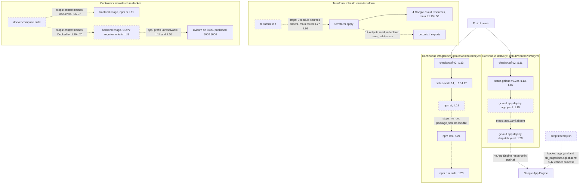

# Deployment Guide

Nothing in this repository deploys. Four asset groups describe a deployment, and each group stops
before it finishes. Terraform sits under `infrastructure/terraform/`, container definitions under
`infrastructure/docker/`, two GitHub Actions workflows under `.github/workflows/`, and two shell
scripts under `scripts/`. Eleven separate blockers stand in the way, and none of them depends on
another, so repairing one leaves the other ten standing.

The sections below describe each asset group as committed, then list every failure point in the
order a reader hits it. Every claim carries an inline citation in the form `path:Lnn`, so a reader
can open the file and check the line. Line numbers refer to the current state of each file.

## What exists today

Four asset groups carry every deployment instruction in the repository. The table below states what
each group provisions or runs, and points at the module README that documents the group in full.

| Asset group | Files | Lines | What it provisions or runs | Module README |
|-------------|-------|-------|----------------------------|---------------|
| `infrastructure/terraform/` | 3 | 235 | One virtual private cloud (VPC) network, one subnet, one firewall rule and one Cloud Storage bucket on Google Cloud, plus three module calls | [terraform](../infrastructure/terraform/README.md) |
| `infrastructure/docker/` | 3 | 102 | A backend image, a frontend image, and a three-service Compose topology for local work | [docker](../infrastructure/docker/README.md) |
| `.github/workflows/` | 2 | 41 | Continuous integration (CI) on pushes and pull requests to `main`, and continuous delivery (CD) on pushes to `main` | [workflows](../.github/workflows/README.md) |
| `scripts/` | 2 | 101 | A linear deploy script and a developer-machine setup script | [scripts](../scripts/README.md) |

Two categories of file that a deploy needs are missing from the tree.

No deployable artifact descriptor exists. `.github/workflows/cd.yml:L19-L20` and
`scripts/deploy.sh:L27` deploy `app.yaml` and `dispatch.yaml`, and the repository commits neither
file.

No dependency manifest for the backend exists either. No `requirements.txt`, `pyproject.toml`,
`setup.py` or `Pipfile` sits anywhere in the tree, while `infrastructure/docker/backend.Dockerfile:L8`
and `scripts/setup_dev_environment.sh:L26` both read one. `frontend/package.json` is the only
dependency manifest the repository commits, and no lockfile accompanies it.

## Terraform

The Terraform configuration declares 35 blocks and cannot initialise.
[../infrastructure/terraform/README.md](../infrastructure/terraform/README.md) owns the block census,
verified across the three files as follows.

| Block kind | Count | Location |
|------------|-------|----------|
| `provider "google"` | 1 | `main.tf:L9-L12` |
| `resource` | 4 | `main.tf:L19`, `:L25`, `:L35`, `:L50` |
| `module` | 3 | `main.tf:L67`, `:L76`, `:L85` |
| `variable` | 13 | `variables.tf:L7` through `:L91` |
| `output` | 14 | `outputs.tf:L5` through `:L84` |

The provider block at `infrastructure/terraform/main.tf:L9-L12` configures Google Cloud and nothing
else. The block reads `var.project_id` at `:L10` and `var.region` at `:L11`.

### The four resources

Four resources make up everything the configuration builds directly.

| Resource | Location | What it declares |
|----------|----------|------------------|
| `google_compute_network.word_network` | `main.tf:L19-L22` | A custom-mode network. `auto_create_subnetworks = false` at `:L21`, so the network carries only the subnet declared below it |
| `google_compute_subnetwork.word_subnet` | `main.tf:L25-L30` | One subnet on the `10.0.0.0/24` Classless Inter-Domain Routing (CIDR) range at `:L27`, attached to the network at `:L29` |
| `google_compute_firewall.allow_internal` | `main.tf:L35-L45` | Transmission Control Protocol (TCP) ports `0-65535` at `:L41`, from source range `10.0.0.0/24` at `:L44` |
| `google_storage_bucket.word_documents` | `main.tf:L50-L59` | A bucket named `word-documents-${var.project_id}` at `:L51`, with uniform bucket-level access at `:L54` and versioning at `:L56-L58` |

The firewall rule opens every TCP port to the whole subnet. `main.tf:L41` sets
`ports = ["0-65535"]` and `:L44` sets `source_ranges = ["10.0.0.0/24"]`, so all 65,536 ports accept
traffic from every address inside the range the subnet declares at `:L27`. No narrower rule exists
anywhere in the configuration, and the rule names no `target_tags`, so the opening applies to every
instance on the network.

The bucket sets no storage class. `variables.tf:L37` declares a `storage_class` variable defaulting
to `STANDARD`, and the bucket block at `main.tf:L50-L59` passes no `storage_class` argument. The
bucket therefore takes the provider default, and the declared variable never reaches it.

### Three module sources that do not exist

Three module calls source directories that are absent, and `terraform init` stops on them.

| Module call | Block | `source` | Directory |
|-------------|-------|----------|-----------|
| `word_backend` | `main.tf:L67-L74` | `./modules/word_backend` at `:L68` | absent |
| `word_frontend` | `main.tf:L76-L83` | `./modules/word_frontend` at `:L77` | absent |
| `word_database` | `main.tf:L85-L92` | `./modules/word_database` at `:L86` | absent |

No `modules/` directory exists under `infrastructure/terraform/`. `terraform init` reports
`Unreadable module directory` and exits, so no plan and no apply can run. All three calls pass the
same four arguments, `project_id`, `region`, `network_id` and `subnet_id`, drawn from the two
variables and the two network resources above.

### No `terraform` block

The configuration declares no `terraform` block at all. A search of all three files returns zero,
and three consequences follow.

- No `required_providers` entry pins the Google provider, so `terraform init` would resolve whatever
  version the registry serves that day.
- No `required_version` constraint pins Terraform itself, so any command-line version may run the
  configuration.
- No backend block redirects state, so Terraform writes state to a local file beside the sources. A
  local state file travels with one machine and stays out of version control, so two engineers
  running `apply` would each track a separate copy of the same infrastructure.

### Variables and outputs

`infrastructure/terraform/variables.tf` declares 13 variables, and 11 of them have no consumer.
`project_id` at `:L7` and `region` at `:L14` are the only two that any resource reads. Five of the
unreferenced 11 are `zone` at `:L21`, `compute_instance_type` at `:L29`, `storage_class` at `:L37`,
`database_tier` at `:L44` and `environment` at `:L53`. The other six are three instance counts at
`:L61`, `:L67` and `:L73`, and three storage sizes at `:L79`, `:L85` and `:L91`.

No variable declares a `validation` block. A search of the file returns zero, so `environment` at
`:L53` accepts any string, and not only the `dev`, `staging` and `prod` values its own description
names. `project_id` at `:L7` carries no default, and the repository commits no `.tfvars` file, so a
caller must supply the value on every invocation.

`infrastructure/terraform/outputs.tf` declares 14 outputs, and every one reads an Amazon Web
Services (AWS) address that no file in the folder declares.
[The cloud-provider contradiction](#the-cloud-provider-contradiction) covers all 14, the two that
carry a database password, and the one that names the wrong network.

A marker sits at `infrastructure/terraform/main.tf:L94-L99` and raises the subnet range, the
firewall rules, the bucket configuration and the module sources. A second marker sits at
`infrastructure/terraform/outputs.tf:L58-L60`.

## Containers

Two Dockerfiles build the two deployable units, and neither build completes.

### `backend.Dockerfile`

`infrastructure/docker/backend.Dockerfile` runs 27 lines and seven instructions.

| Line | Instruction | Effect |
|------|-------------|--------|
| `:L2` | `FROM python:3.9-slim` | Pins Python 3.9, a release past end of life |
| `:L5` | `WORKDIR /app` | Sets the build and run directory |
| `:L8` | `COPY requirements.txt .` | Stops the build. No `requirements.txt` exists anywhere in the repository |
| `:L11` | `RUN pip install --no-cache-dir -r requirements.txt` | Never runs |
| `:L14` | `COPY ./app /app` | Copies the package contents into the working directory root |
| `:L17` | `EXPOSE 8000` | Declares port 8000 |
| `:L20` | `CMD ["uvicorn", "main:app", "--host", "0.0.0.0", "--port", "8000"]` | Serves on port 8000 |

The image cannot build. `backend.Dockerfile:L8` copies a `requirements.txt` that no directory in the
repository contains, so the build fails there and `:L11` never installs a package. A marker at
`:L22-L27` asks for review of the Python version, the requirements file location, the application
directory and the environment configuration.

### `frontend.Dockerfile`

`infrastructure/docker/frontend.Dockerfile` runs 32 lines across two stages.

| Line | Instruction | Effect |
|------|-------------|--------|
| `:L2` | `FROM node:14-alpine as build` | Build stage on Node 14, a release past end of life |
| `:L5` | `WORKDIR /app` | Sets the build directory |
| `:L8` | `COPY package*.json ./` | Copies `package.json`. The glob matches no lockfile, because the repository commits none |
| `:L11` | `RUN npm ci` | Stops the build. `npm ci` installs strictly from a lockfile |
| `:L14` | `COPY . .` | Never runs |
| `:L17` | `RUN npm run build` | Never runs. The script resolves to `react-scripts build` per `frontend/package.json:L33` |
| `:L20` | `FROM nginx:alpine` | Serve stage |
| `:L23` | `COPY --from=build /app/build /usr/share/nginx/html` | Copies the build output into the Nginx document root |
| `:L29` | `EXPOSE 80` | Declares port 80 |
| `:L32` | `CMD ["nginx", "-g", "daemon off;"]` | Starts Nginx in the foreground |

The image cannot build. `frontend.Dockerfile:L11` runs `npm ci`, which exits when no lockfile is
present, and `frontend/package-lock.json` is absent from the tree. The glob at `:L8` therefore
copies `package.json` alone.

### The Compose topology

`infrastructure/docker/docker-compose.yml` declares three services on one bridge network, in Compose
format `3.8` at `:L1`. Neither application service builds.

| Service | Build or image | Ports | Environment | Block |
|---------|----------------|-------|-------------|-------|
| `frontend` | context `../../frontend`, `dockerfile: Dockerfile` at `:L6-L7` | `3000:3000` at `:L9` | `REACT_APP_API_URL=http://backend:5000` at `:L11` | `:L4-L15` |
| `backend` | context `../../backend`, `dockerfile: Dockerfile` at `:L19-L20` | `5000:5000` at `:L22` | `DATABASE_URL` at `:L24` | `:L17-L28` |
| `db` | image `postgres:13` at `:L31` | none published | `POSTGRES_DB`, `POSTGRES_USER` and `POSTGRES_PASSWORD` at `:L33-L35` | `:L30-L39` |

A `postgres_data` named volume at `:L41-L42` persists the database directory, and the
`word-app-network` bridge at `:L44-L46` joins all three services. `depends_on` at `:L12-L13` and
`:L25-L26` orders `frontend` behind `backend` and `backend` behind `db`.
[../infrastructure/docker/README.md](../infrastructure/docker/README.md) owns the PostgreSQL 13
detail at `docker-compose.yml:L31`. The `POSTGRES_PASSWORD` value at `:L35` is a hard-coded literal,
and `:L24` embeds the same literal in the backend connection string.

Three contradictions sit in the container tier, and each one stops the topology on its own.

**Neither service finds a Dockerfile.** `docker-compose.yml:L6-L7` sets the `frontend` build context
to `../../frontend` and names `Dockerfile`, and `:L19-L20` sets the `backend` context to
`../../backend` and names `Dockerfile`. Neither `frontend/Dockerfile` nor `backend/Dockerfile`
exists. The two real files sit at `infrastructure/docker/frontend.Dockerfile` and
`infrastructure/docker/backend.Dockerfile`, outside both contexts and under different names, so
`docker compose build` fails for both services.

**The backend port mapping misses the served port.** `docker-compose.yml:L22` publishes `5000:5000`,
while `backend.Dockerfile:L17` exposes 8000 and `:L20` serves 8000. Nothing listens on container
port 5000, so no request reaches the application even after a successful build. The `frontend`
service compounds the gap by injecting `http://backend:5000` at `:L11`, which addresses that same
silent port.

**No Redis service exists.** `backend/app/core/config.py:L119` declares `REDIS_URL` as a required
field, and `backend/app/tasks/background_tasks.py:L98` builds
`Celery('microsoft_word', broker=settings.REDIS_URL)` at module scope. Compose declares `frontend`,
`backend` and `db` and nothing more, and a search of all of `infrastructure/` for `redis` or
`memorystore` returns no match. `infrastructure/terraform/main.tf` declares no cache resource either,
so the Celery broker has no target in the local topology or in the cloud configuration. No worker
process and no beat scheduler appears anywhere in the repository, and
[../backend/app/tasks/README.md](../backend/app/tasks/README.md) covers the task tier.

The frontend environment variable names never meet. `docker-compose.yml:L11` injects
`REACT_APP_API_URL`, and `frontend/src/services/api.ts:L82` reads
`process.env.REACT_APP_API_BASE_URL`, the only `process.env` read in the whole frontend. The client
resolves an undefined base URL under Compose.

### The lost Python package boundary

The backend image flattens the Python package and breaks every internal import. The packaging fact
belongs to [../backend/app/README.md](../backend/app/README.md), and the deployment consequence
belongs here.

No `__init__.py` file exists anywhere under `backend/`. A filesystem scan and a `git ls-files`
search both return zero, so `app`, `app.api`, `app.core`, `app.db`, `app.schema`, `app.services` and
`app.tasks` are implicit namespace packages. All seven resolve only while `backend/` itself sits on
the import path.

Every backend module nonetheless imports by absolute package path. `backend/app/main.py:L20` reads
`from app.core.config import settings`, and eleven further modules follow the same form.

`infrastructure/docker/backend.Dockerfile:L14` copies `./app` to `/app`, which places the modules at
the filesystem root rather than beneath an `app` package. `:L20` then starts `uvicorn main:app`, a
command that matches the flattened layout and contradicts the source tree, where the application
object sits at `backend/app/main.py:L24`. The `app.` prefix used throughout the source cannot
resolve inside the image as built, so every internal import raises `ModuleNotFoundError` once a
`requirements.txt` gets past `:L8`.

## Pipelines

Two workflows automate the pipeline, and each one fails on its own first substantive step.
[../.github/workflows/README.md](../.github/workflows/README.md) owns the workflow detail.

### Continuous integration

`.github/workflows/ci.yml` runs 23 lines and one job. GitHub triggers the workflow on pushes to
`main` at `:L5` and on pull requests targeting `main` at `:L7`. The `build` job at `:L10` runs on
`ubuntu-latest` at `:L11`.

| Step | Location | Effect |
|------|----------|--------|
| `actions/checkout@v2` | `:L13` | Checks out the repository. Version 2 is deprecated |
| `actions/setup-node@v2` | `:L15` | Installs Node, pinned to `'14'` at `:L17`. Version 2 is deprecated, and Node 14 is past end of life |
| `npm ci` | `:L19` | Fails. The step runs at the repository root, where no `package.json` and no lockfile exist |
| `npm test` | `:L21` | Never runs |
| `npm run build` | `:L23` | Never runs |

The job stops at `:L19`. No step sets a `working-directory`, so `npm ci` executes at the repository
root, and the only manifest in the tree sits at `frontend/package.json`. The workflow also defines no
Python job, no lint gate and no type-check gate. The 76 type errors the frontend carries would
therefore not fail the build even after a successful install.

### Continuous delivery

`.github/workflows/cd.yml` runs 20 lines and one job. GitHub triggers the workflow on pushes to
`main` at `:L5` and on nothing else.

| Step | Location | Effect |
|------|----------|--------|
| `actions/checkout@v2` | `:L11` | Checks out the repository |
| `google-github-actions/setup-gcloud@v0.2.0` | `:L13` | Installs the Google Cloud software development kit (SDK), reading a project identifier from the `GCP_PROJECT_ID` secret at `:L15` and a service-account key from the `GCP_SA_KEY` secret at `:L16` |
| `gcloud app deploy app.yaml --quiet` | `:L19` | Fails. The repository commits no `app.yaml` |
| `gcloud app deploy dispatch.yaml --quiet` | `:L20` | Never runs. The repository commits no `dispatch.yaml` |

The deploy step at `:L17-L20` stops on its first command, because both descriptors are absent from
the tree. The service-account key at `:L16` carries whatever identity and access management (IAM)
role the project granted it, and no committed file records that role.

Three gaps surround the two workflows. The `deploy` job declares no `needs:` key, so CD runs on a
push to `main` whether or not CI passed. Neither workflow defines a rollback path, so a partial
deploy stays partial. And `infrastructure/terraform/main.tf` declares no App Engine resource, so the
committed infrastructure never provisions the target that both `gcloud app deploy` commands address.
A search of the three `.tf` files for `app_engine` returns no match.

### The intended release pipeline, with its stops marked

## The deploy script

`scripts/deploy.sh` runs 47 lines in a straight line, with no strict mode and no error handling
between steps. `:L1` sets the shebang and no `set -e` follows, so every step runs regardless of what
the step before it returned. [../scripts/README.md](../scripts/README.md) owns the script detail.

| Step | Location | What it does |
|------|----------|--------------|
| Credentials guard | `:L4-L7` | Exits 1 at `:L6` when `GOOGLE_APPLICATION_CREDENTIALS` is unset. The only check in the script |
| Frontend build | `:L11` | Runs `npm run build` with no preceding `cd`, so the command executes wherever the caller invoked the script. No root `package.json` exists |
| Backend tests | `:L15` | Runs `python -m pytest tests/`. No `tests/` directory sits at the repository root, and the three test modules sit at `backend/tests/` |
| Package | `:L19` | Runs `zip -r app.zip .`, excluding `*.git*`, `node_modules/*` and `venv/*` |
| Upload | `:L23` | Runs `gsutil cp app.zip gs://my-word-app-bucket/`, against a hard-coded bucket name |
| App Engine deploy | `:L27` | Runs `gcloud app deploy app.yaml --quiet`. The repository commits no `app.yaml` |
| Database migration | `:L31` | Pipes `db_migrations.sql` into `gcloud sql connect my-word-app-db --user=root`. The repository commits no such file |
| Content delivery | `:L35` | Enables a content delivery network (CDN) on backend service `my-word-app-backend` |
| Post-deploy checks | `:L37-L44` | A marker at `:L37` sits above four commented-out checks |
| Success message | `:L47` | Echoes `Deployment completed successfully!` with no guard |

The hard-coded bucket at `:L23` does not match the infrastructure. `gs://my-word-app-bucket/` names
one bucket, and the only bucket the configuration declares is `word-documents-${var.project_id}` at
`infrastructure/terraform/main.tf:L51`. No committed Terraform creates `my-word-app-bucket`, so the
upload addresses a bucket the infrastructure never provisions. The same mismatch applies to
`my-word-app-db` at `:L31` and `my-word-app-backend` at `:L35`, and neither name appears in any `.tf`
file.

The final echo at `:L47` reports success unconditionally. No line sets `set -e`, no step tests an
exit status, and `:L47` carries no guard, so the script prints `Deployment completed successfully!`
after every earlier step has failed. An operator reading that output sees success and gets no signal
that nothing deployed.

### The developer setup script

`scripts/setup_dev_environment.sh` runs 56 lines and prepares a developer machine. Two of its steps
fail outright, and two more run the wrong tool.

| Step | Location | Note |
|------|----------|------|
| System packages | `:L10` | Installs `nodejs`, `npm`, `python3`, `python3-pip`, `python3-venv` and `postgresql`, all unpinned, so the installed versions follow the host distribution |
| Virtual environment | `:L14-L15` | Creates `backend/venv` and activates it |
| Frontend install | `:L20` | Runs `npm install` inside `frontend/`, which succeeds and resolves the declared manifest |
| Backend install | `:L26` | Runs `pip install -r requirements.txt`. Fails, because no such file exists |
| Database | `:L31-L36` | Creates database `msword_clone` at `:L31` and user `msword_user` at `:L32`, then grants privileges at `:L36` |
| Environment file | `:L40` | Runs `cp .env.example .env`. Fails, because the repository commits no template |
| Migrations | `:L47-L48` | Runs `python manage.py makemigrations` and `python manage.py migrate` |

The database names disagree with Compose. `setup_dev_environment.sh:L31` creates `msword_clone` and
`:L32` creates user `msword_user`, while `infrastructure/docker/docker-compose.yml:L33-L34` provisions
database `wordapp` and user `postgres`. A developer who runs the script and then starts Compose ends
up with two differently named databases, and `docker-compose.yml:L24` points the backend service at
the Compose pair.

The migration commands belong to Django, and the backend is FastAPI. `:L47` and `:L48` call
`python manage.py`, and no `manage.py` exists anywhere in the repository. `:L55` closes the script by
telling the developer to start the backend with `python manage.py runserver`, which contradicts both
`README.md:L55` and `infrastructure/docker/backend.Dockerfile:L20`, each of which runs Uvicorn. A
marker at `:L41` and a TODO at `:L42` sit above the environment step. The `.env` file that `:L40`
would create is the file `backend/app/core/config.py:L123` names as its settings source.

## Why a deploy fails as committed

A deploy fails at eleven points. The list runs in the order a reader meets them, from provisioning
infrastructure through to the final script, and each entry names the file and line that stops the
step. No entry depends on another, so each one needs its own fix.

1. **`terraform init` cannot read three module sources.** `infrastructure/terraform/main.tf:L68`,
   `:L77` and `:L86` source `./modules/word_backend`, `./modules/word_frontend` and
   `./modules/word_database`. No `modules/` directory exists under `infrastructure/terraform/`, so
   initialisation stops and no plan or apply follows.
2. **The CI job fails at `npm ci`.** `.github/workflows/ci.yml:L19` runs `npm ci` at the repository
   root. No root `package.json` exists and the repository commits no lockfile, so the install exits,
   and `npm test` at `:L21` and `npm run build` at `:L23` never run.
3. **The frontend image fails at `npm ci`.** `infrastructure/docker/frontend.Dockerfile:L11` runs
   `npm ci` after `:L8` copies `package*.json`. The glob matches `package.json` alone, because
   `frontend/package-lock.json` is absent, and `npm ci` installs strictly from a lockfile.
4. **The backend image fails at `COPY requirements.txt`.**
   `infrastructure/docker/backend.Dockerfile:L8` copies a file that no directory in the repository
   contains, so the build stops before `:L11` installs anything.
5. **Both Compose services fail on their build context.**
   `infrastructure/docker/docker-compose.yml:L6-L7` and `:L19-L20` name `Dockerfile` inside
   `../../frontend` and `../../backend`. Neither path holds a Dockerfile, and the two real files sit
   in `infrastructure/docker/` under different names.
6. **The backend port mapping misses the served port.** `docker-compose.yml:L22` publishes
   `5000:5000`, while `backend.Dockerfile:L17` exposes 8000 and `:L20` serves 8000. Nothing answers
   on container port 5000, and `docker-compose.yml:L11` sends the frontend to that port.
7. **The `app.` import prefix does not resolve inside the image.** `backend.Dockerfile:L14` copies
   `./app` to `/app` and `:L20` runs `uvicorn main:app`, flattening a package that carries no
   `__init__.py` anywhere under `backend/`. Every `from app.*` import raises `ModuleNotFoundError`.
8. **Celery has no broker.** `backend/app/tasks/background_tasks.py:L98` reads `settings.REDIS_URL`,
   declared at `backend/app/core/config.py:L119`. Compose declares no Redis service, Terraform
   declares no cache resource, and no worker or beat process appears anywhere, so every queued task
   stays unqueued.
9. **The CD job deploys two absent descriptors.** `.github/workflows/cd.yml:L19` and `:L20` run
   `gcloud app deploy` against `app.yaml` and `dispatch.yaml`. The repository commits neither, so the
   step fails on its first command.
10. **The committed infrastructure declares no App Engine resource.** Both `gcloud app deploy`
    commands and `scripts/deploy.sh:L27` address App Engine. The three `.tf` files declare one
    network, one subnet, one firewall rule and one bucket, and a search for `app_engine` returns no
    match, so the deploy target is never provisioned.
11. **`deploy.sh` addresses absent resources and then reports success.** `:L23` uploads to hard-coded
    `gs://my-word-app-bucket/`, which no Terraform creates. `:L31` pipes an uncommitted
    `db_migrations.sql` into Cloud SQL. `:L47` echoes `Deployment completed successfully!` with no
    guard, after every earlier step has failed.

[troubleshooting.md](troubleshooting.md#g8-platform-and-automation-defects) carries the same eleven
entries inside the full defect register, alongside the backend import failure and the 76 frontend
type errors that block the application itself.

## The cloud-provider contradiction

Three cloud providers appear across the repository and its specifications, and no two of them agree.
The committed code calls Google Cloud, the Terraform outputs read Amazon Web Services addresses, and
the project proposal names Microsoft Azure.

### Google Cloud Platform, in the committed code

Google Cloud is the platform the code actually calls.

| Evidence | Location |
|----------|----------|
| The only configured Terraform provider | `infrastructure/terraform/main.tf:L9-L12` |
| Four Google Cloud resources | `main.tf:L19`, `:L25`, `:L35`, `:L50` |
| Firestore client, built at import time | `backend/app/db/firestore.py:L42`, importing at `:L36` |
| Cloud Storage client, used by the export service | `backend/app/services/export_service.py:L59` |
| Pub/Sub publisher and subscriber | `backend/app/services/collaboration_service.py:L37` |
| `gcloud` in the delivery workflow | `.github/workflows/cd.yml:L13`, `:L19-L20` |
| `gcloud` and `gsutil` in the deploy script | `scripts/deploy.sh:L23`, `:L27`, `:L31`, `:L35` |
| The stack line in the root README | `README.md:L18` |

The Technical Specifications document agrees with the code, and the agreement is declared intent
rather than evidence of behaviour. Google Cloud names appear under its HIGH-LEVEL ARCHITECTURE
DIAGRAM heading at `L140`, including a `Google Cloud Platform` subgraph at `L172`. The same names
appear again under its THIRD-PARTY SERVICES heading at `L587`.
[integration-guide.md](integration-guide.md) records which of those services a request can actually
reach.

### Amazon Web Services, in the Terraform outputs

Every one of the 14 outputs reads an AWS address, and no file declares any of them. Parsing
`infrastructure/terraform/outputs.tf` gives the verified figures: the 14 outputs name **12 distinct
resource addresses across 9 resource types**.

| Resource type | Address | Read by |
|---------------|---------|---------|
| `aws_api_gateway_deployment` | `.main` | `api_gateway_endpoint` at `:L5` |
| `aws_api_gateway_stage` | `.main` | `api_gateway_stage` at `:L10` |
| `aws_db_instance` | `.main` | `database_connection_string` at `:L18` |
| `aws_db_instance` | `.read_replica` | `read_replica_connection_string` at `:L24` |
| `aws_s3_bucket` | `.main` | `main_storage_bucket_name` at `:L33` |
| `aws_s3_bucket` | `.backup` | `backup_storage_bucket_name` at `:L38` |
| `aws_instance` | `.main` | `compute_instance_public_ip` at `:L43`, `compute_instance_private_ip` at `:L48`, `compute_instance_id` at `:L53` |
| `aws_lambda_function` | `.main` | `lambda_function_name` at `:L62` |
| `aws_cloudfront_distribution` | `.main` | `cloudfront_distribution_domain` at `:L67` |
| `aws_vpc` | `.main` | `vpc_id` at `:L74` |
| `aws_subnet` | `.public` | `public_subnet_ids` at `:L79` |
| `aws_subnet` | `.private` | `private_subnet_ids` at `:L84` |

The nine types cover an API Gateway deployment and stage, a Relational Database Service (RDS)
instance and a Simple Storage Service (S3) bucket. The remaining five are a compute instance, a
Lambda function, a CloudFront distribution, a VPC and a subnet. A search of the three `.tf` files for
`resource "aws_` returns no match, so no file declares any of the 12 addresses. The only provider
configured in the folder is `google` at `main.tf:L9`, which cannot create an AWS resource, so all 14
outputs fail to resolve during a plan.

The generated Technical Specification describes fifteen AWS resources at its §1.2.1.3. The verified
count is 12 distinct addresses across 9 types, and [decision-log.md](decision-log.md) records the
correction.

Two outputs interpolate a database password into their value. `outputs.tf:L20` builds
`database_connection_string` from the username, password, endpoint and name of
`aws_db_instance.main`, and `:L26` builds `read_replica_connection_string` the same way from
`aws_db_instance.read_replica`. Both set `sensitive = true`, at `:L21` and `:L27`. The flag masks the
value in command-line output, and Terraform still writes the resolved password to state in plaintext.
With no backend block in the configuration, that state file stays local and unencrypted.

One output names a network that does not exist while the real one goes unpublished. `vpc_id` at
`:L74-L77` reads `aws_vpc.main.id`, and the only network the configuration declares is
`google_compute_network.word_network` at `main.tf:L19`. No output exports that network. The one VPC
the infrastructure creates is never published, and the one the outputs publish is never created. A
marker at `outputs.tf:L58-L60` raises the same mismatch.

### Microsoft Azure, in the project proposal

Azure appears only in the project proposal, and only as declared intent. No committed file references
Azure anywhere.

| Site | Heading | Statement |
|------|---------|-----------|
| `L193` | `ASSUMPTIONS` | Assumes Azure cloud infrastructure will be available and scalable |
| `L214` | `DEPENDENCIES` | Places an `Azure Services` node inside a Mermaid dependency diagram |
| `L229` | `DEPENDENCIES` | Lists Azure services for backend operations |
| `L277` | `COST BREAKDOWN` | Budgets an infrastructure line for Azure cloud services |

All four sites sit in
[Software Project Proposal](<../documentation/Software Project Proposal.md>), whose headings carry no
section numbers, so the table above cites each one by heading name and line. Read all four as
declared intent and never as system behaviour. The proposal also disagrees with the other
specification: the Technical Specifications document names Google Cloud throughout and never mentions
Azure.

### What the contradiction costs

The three positions carry one practical consequence for anyone who runs `terraform apply`. A
successful apply would create the four Google Cloud resources at `main.tf:L19` through `:L59`. All 14
outputs would still fail, because the outputs describe a platform the configuration never builds.
Provisioning the right resources and exporting the wrong ones are two separate defects, and this
configuration carries both.

## Related documentation

Start at [docs/README.md](README.md), which indexes every document in this set.

Repository-level documents beside this one:

- [architecture-overview.md](architecture-overview.md), the six-area map and the four tiers
- [troubleshooting.md](troubleshooting.md), every defect in the repository as a numbered register
- [integration-guide.md](integration-guide.md), each external service marked reachable or scaffolded
- [onboarding.md](onboarding.md), clean-machine setup and a prioritised task list
- [decision-log.md](decision-log.md), every judgement this engagement made, with its reasoning
- [data-model.md](data-model.md), the Pydantic and Zod contracts and every field divergence

Module documentation for the four asset groups this guide describes:

- [../infrastructure/terraform/README.md](../infrastructure/terraform/README.md), the 35 HCL blocks
  and the AWS outputs
- [../infrastructure/docker/README.md](../infrastructure/docker/README.md), the two Dockerfiles and
  the Compose topology
- [../.github/workflows/README.md](../.github/workflows/README.md), the CI and CD job steps
- [../scripts/README.md](../scripts/README.md), the deploy and setup scripts

Module documentation for the two application facts this guide draws on:

- [../backend/app/README.md](../backend/app/README.md), the composition root and the package boundary
- [../backend/app/tasks/README.md](../backend/app/tasks/README.md), the Celery application and its
  three tasks

Reference material, read and never edited:

- [../README.md](../README.md), the root README. Prerequisites sit at `L22-L23`, and the instructions
  at `L42` and `L55` name files and paths the tree does not carry.
- [Technical Specifications](<../documentation/Technical Specifications.md>). Infrastructure material
  sits under the HIGH-LEVEL ARCHITECTURE DIAGRAM heading at `L140` and the THIRD-PARTY SERVICES
  heading at `L587`.
- [Software Project Proposal](<../documentation/Software Project Proposal.md>). The Azure references
  sit under the ASSUMPTIONS heading at `L186`, the DEPENDENCIES heading at `L201` and the COST
  BREAKDOWN heading at `L265`.
