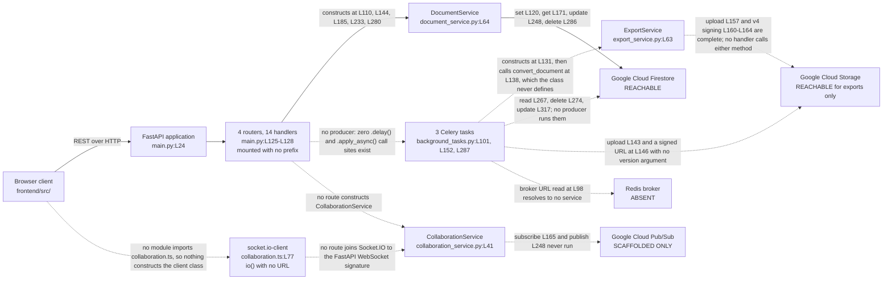

# Integration Guide

Four external systems appear in this repository, and they sit in three different states of
readiness. Google Cloud Firestore takes reads and writes on a path that a request can enter. Google
Cloud Storage takes export objects and signs download links. Google Cloud Pub/Sub has a full set of
publish and subscribe calls that no route can reach. Redis has a broker Uniform Resource Locator
(URL) in configuration and no service anywhere in the committed infrastructure.

Every integration below carries one label, and each label arrives with the evidence that earns it. A
reader who knows which of the four works can plan an afternoon's work. A reader given four
evenly-toned descriptions cannot.

## How to read this guide

Every factual claim below carries a locator in the form `path:Lnn`, and most locators also name the
symbol at that line. Read the symbol name as the durable half of the citation. Line numbers move
whenever anyone edits a file above them, and symbol names do not.

Three conventions govern the locators, matching [troubleshooting.md](troubleshooting.md),
[architecture-overview.md](architecture-overview.md) and [data-model.md](data-model.md) so all four
documents agree:

- Locators point at the committed state at the current branch head, which includes the inline
  documentation added to 44 source files. A locator matches what you see when you open the file
  today, not what an earlier revision held.
- Line numbers are physical. No source file in this repository ends with a newline, so `wc -l`
  reports one line fewer than each file contains.
- A range such as `L154-L164` covers every line in the span, inclusive.

Six words carry one fixed meaning throughout.

| Term | Meaning |
|------|---------|
| router | A FastAPI `APIRouter` instance |
| handler | A route function carrying a `@router` decorator |
| service | A domain service class under `backend/app/services/` |
| adapter | A persistence module under `backend/app/db/` |
| slice | A Redux Toolkit slice under `frontend/src/store/` |
| marker | A `HUMAN ASSISTANCE NEEDED` comment left by the code's authors |

The three documents under `documentation/` record intended behaviour rather than committed
behaviour. Anything drawn from them carries the label **declared intent** and a citation by heading
name plus line, because all three files use unnumbered headings only.
`documentation/Technical Specifications.md` holds five level-one headings: `L3` INTRODUCTION, `L125`
SYSTEM ARCHITECTURE, `L300` SYSTEM DESIGN, `L523` TECHNOLOGY STACK and `L620` SECURITY
CONSIDERATIONS. A numbered section citation anywhere in this documentation set refers to the
generated Technical Specification, a separate document, and the text says so when it does.

Where this engagement made a judgement, [decision-log.md](decision-log.md) carries the argument. No
rationale lives in this file.

## Integration inventory

Four integrations, four labels, and no overlap between them.

| Integration | Client library | Reachability | Entry point | Configuration it reads |
|-------------|----------------|--------------|-------------|------------------------|
| Google Cloud Firestore | `google-cloud-firestore` | **REACHABLE** | `DocumentService`, constructed by all five document handlers at `backend/app/api/documents.py:L110`, `:L144`, `:L185`, `:L233` and `:L280` | `GOOGLE_CLOUD_PROJECT`, declared at `backend/app/core/config.py:L116` |
| Google Cloud Storage | `google-cloud-storage` | **REACHABLE for exports only** | `ExportService.export_to_pdf` at `backend/app/services/export_service.py:L87` and `export_to_docx` at `:L168`, plus the export task at `backend/app/tasks/background_tasks.py:L141-L146` | `STORAGE_BUCKET_NAME`, `SIGNED_URL_EXPIRATION`, `EXPORT_BUCKET_NAME` and `DOCUMENT_BUCKET_NAME`, none of them declared |
| Google Cloud Pub/Sub | `google-cloud-pubsub` | **SCAFFOLDED ONLY** | `CollaborationService.connect` at `backend/app/services/collaboration_service.py:L75` and `broadcast_change` at `:L218`, and no route constructs that class | `PROJECT_ID`, not declared |
| Redis, as the Celery broker | `celery` | **ABSENT** | `celery_app` at `backend/app/tasks/background_tasks.py:L98`, carrying three tasks | `REDIS_URL`, declared at `backend/app/core/config.py:L119` |

Three labels carry one fixed meaning in this guide and in the rest of the documentation set.

| Label | Meaning |
|-------|---------|
| **REACHABLE** | Committed code constructs the client library and issues a complete, well-formed call to the external system. Reachable describes the call, not the outcome. Every call in this repository still depends on configuration that no committed file supplies |
| **SCAFFOLDED ONLY** | Committed code constructs the client library and writes the calls, and nothing in the application constructs the class holding them, so no call site can run |
| **ABSENT** | Configuration names the integration and code reads that value, and no committed infrastructure provisions the service |

Two qualifiers in the table need their reach spelled out, because a label invites the question
"reachable from where?"

- Firestore is reachable from an HTTP request. Five document handlers construct `DocumentService`,
  and each of its four methods issues a Firestore call.
- Cloud Storage is reachable only through export code. Export objects are the only bytes the
  repository writes to any bucket, no route uploads a document or an image, and no handler calls
  either export method.

### The integration map

## Google Cloud Firestore

**REACHABLE.** Firestore is the only external system a committed HTTP request reaches. Five document
handlers construct `DocumentService` at `backend/app/api/documents.py:L110`, `:L144`, `:L185`,
`:L233` and `:L280`, and each of that class's four methods issues a Firestore call. Firestore also
holds every record the code writes, because the SQLAlchemy path stays declared and unused.
[data-model.md](data-model.md) covers the split.

Two independent access paths exist, and only one of them has a caller.

| Access path | Location | Callers |
|-------------|----------|---------|
| The adapter's four helpers | `backend/app/db/firestore.py:L44`, `:L72`, `:L94`, `:L112` | None. No module imports any of the four |
| `DocumentService`, calling the client directly | `backend/app/services/document_service.py:L64` | Five document handlers, plus three call sites inside the task module |

### The adapter, and why nothing uses it

The adapter builds one client at module scope and exposes four synchronous helpers.
`backend/app/db/firestore.py:L41` resolves Application Default Credentials (ADC) through
`google.auth.default()`, and `:L42` constructs the client with
`Client(project=settings.GOOGLE_CLOUD_PROJECT)`. Both statements run at import time. The four
helpers follow: `get_document` at `:L44`, `create_document` at `:L72`, `update_document` at `:L94`
and `delete_document` at `:L112`.

No module imports any of the four. Three modules import the `db` client instead and call the
Firestore software development kit (SDK) directly: `backend/app/main.py:L21`,
`backend/app/services/document_service.py:L61` and `backend/app/tasks/background_tasks.py:L93`. The
adapter's four helpers therefore sit outside every execution path in the repository.

One annotation on the adapter contradicts the code beneath it. `get_document` declares `-> dict` at
`:L44` and returns `None` at `:L70` when the snapshot does not exist. A caller who trusts the
annotation and subscripts the result raises `TypeError` for a missing document.

None of the four helpers opens a transaction, sets a retry policy, sets a timeout, or catches an
exception. [../backend/app/db/README.md](../backend/app/db/README.md) carries the module detail.

### The service, and the shape of its calls

`DocumentService` holds the shared client at `backend/app/services/document_service.py:L72` and
issues six Firestore calls across four methods.

| Method | Firestore calls | Locators |
|--------|-----------------|----------|
| `create_document` at `:L74` | Document reference, then `set` | `:L116`, `:L120` |
| `get_document` at `:L125` | `get` | `:L171` |
| `update_document` at `:L185` | `get`, `update`, then `get` again | `:L237`, `:L248`, `:L251` |
| `delete_document` at `:L254` | `get`, then `delete` | `:L276`, `:L286` |

The update path reads, modifies, then reads again, which costs three Firestore operations for one
logical update. The first read at `:L237` supports the existence check at `:L240` and the ownership
comparison at `:L243`. The second read at `:L251` fetches the record the method returns, because
`update()` returns no snapshot.

Every method carries `async def` and every Firestore call inside runs synchronously and blocks. A
declared coroutine that never yields holds the event loop for the duration of each round trip. The
declared type and the runtime behaviour disagree, and the code, not the annotation, describes what
happens. [../backend/app/services/README.md](../backend/app/services/README.md) owns the service
detail.

### What the background tasks touch

Two of the three Celery tasks reach Firestore, and neither runs today, because no producer enqueues
them. The [Redis broker section](#redis-broker-for-celery) carries that evidence.

| Task | Firestore work | Locators |
|------|----------------|----------|
| `cleanup_expired_documents` at `:L152` | Queries `documents` on an expiry comparison, deletes the matching document, calls `.delete()` on a `document_permissions` query result, then deletes from `document_metadata` | `:L267`, `:L274`, `:L283`, `:L284` |
| `update_document_statistics` at `:L287` | Updates `documents` with a recomputed word and page count | `:L317` |

Two faults sit inside that work. `backend/app/tasks/background_tasks.py:L267` calls
`datetime.now()`, and `:L96` imports `timedelta` alone, so the name `datetime` is undefined and the
query raises `NameError` on first execution. `:L321` repeats the same call inside the statistics
update. Separately, `:L283` calls `.delete()` on the value `Query.get()` returns. That value is a
list of snapshots rather than a reference, so the call raises `AttributeError`.
[troubleshooting.md](troubleshooting.md) registers both under
[G3](troubleshooting.md#g3-undefined-names-that-raise-at-execution).

Three collections appear across the code. `documents` is the only one a service writes.
`document_permissions` at `:L283` and `document_metadata` at `:L284` appear in the retention task
alone, and no schema in either language models either of them.
[../backend/app/tasks/README.md](../backend/app/tasks/README.md) carries the task detail.

## Google Cloud Storage and version 4 signed URLs

**REACHABLE for exports only.** Export objects are the only bytes this repository writes to any
bucket. The write-and-sign sequence in `ExportService` is complete and correct in form, and no
handler calls either export method, so a request never reaches that sequence today. No route uploads
a document, and no route uploads an image, so nothing else in the codebase touches Cloud Storage.

Two code paths construct a Cloud Storage client. `backend/app/services/export_service.py:L83` builds
one per service instance, and `backend/app/tasks/background_tasks.py:L132` and `:L277` build one per
task invocation.

### The service path signs version 4 URLs

Both export methods are plain synchronous `def`, at `backend/app/services/export_service.py:L87` and
`:L168`. Each resolves a bucket, uploads a payload, signs a link, and returns the link.

| Step | `export_to_pdf` | `export_to_docx` |
|------|-----------------|------------------|
| Resolve the bucket from `settings.STORAGE_BUCKET_NAME` | `:L154` | `:L228` |
| Target the object key | `:L155` | `:L229` |
| Upload the payload | `:L157` | `:L231` |
| Sign the link | `:L160-L164` | `:L234-L238` |
| Return the link | `:L166` | `:L240` |

Both signing calls pass `version="v4"`, at `:L161` and `:L235`, and both read the expiry from
`settings.SIGNED_URL_EXPIRATION`, at `:L162` and `:L236`. Both pass `method="GET"`, at `:L163` and
`:L237`.

The payloads are literal placeholder strings. `:L157` uploads `"PDF_CONTENT"` with content type
`application/pdf`, and `:L231` uploads `"DOCX_CONTENT"` with the Office Open XML content type. Both
Multipurpose Internet Mail Extensions (MIME) types are correct for the format each method names. A
browser receiving either object therefore treats eleven or twelve bytes of text as a document.

Upload works and signing works. Conversion does not exist, and each method carries a `TODO` marker
recording the gap, at `:L151`, `:L156`, `:L225` and `:L230`.

No module under `backend/app/` calls either method. The only callers anywhere sit in the test suite,
at `backend/tests/test_services.py:L67` and `:L75`, and both pass a document identifier string where
the signature declares a `Document`.

### The task path signs differently

`process_document_export` at `backend/app/tasks/background_tasks.py:L101` writes to Cloud Storage
without going through either export method. The task constructs `ExportService` at `:L131`, then
calls `export_service.convert_document(document, export_format)` at `:L138`. `ExportService` never
defines `convert_document`, so the task raises `AttributeError` at that line and reaches none of the
upload work below it, even if something enqueued the task.

The two paths sign links differently. `:L146` calls
`generate_signed_url(expiration=timedelta(hours=1))` with no `version` argument, while the service
passes `version="v4"` at `:L161` and `:L235`. A caller consuming both paths receives links signed
under two different schemes.

The two paths also disagree on where an export object lands.

| Path | Object key | Locators |
|------|-----------|----------|
| `ExportService` | `exports/{document.id}.pdf` and `exports/{document.id}.docx` | `:L155`, `:L229` |
| `process_document_export` | `exports/{user_id}/{document_id}.{export_format}` | `:L142` |

The same export therefore lands in two different places depending on which path runs. The service
layout omits the owner and encodes the format in the file extension. The task layout partitions by
owner and takes the format from a caller-supplied string that nothing validates.

### Four settings fields, none of them declared

Cloud Storage code reads three bucket names and one expiry value, and `Settings` declares none of
the four.

| Field | Read at | Status |
|-------|---------|--------|
| `STORAGE_BUCKET_NAME` | `export_service.py:L154`, `:L228` | Read but never declared |
| `SIGNED_URL_EXPIRATION` | `export_service.py:L162`, `:L236` | Read but never declared |
| `EXPORT_BUCKET_NAME` | `background_tasks.py:L141` | Read but never declared |
| `DOCUMENT_BUCKET_NAME` | `background_tasks.py:L278` | Read but never declared |

`backend/app/core/config.py:L111-L119` declares nine fields, and the four above appear in none of
them. Attribute access on a Pydantic model raises `AttributeError` for an undeclared field, so each
read fails at the line that makes it. Two further fields share the same status, `ALLOWED_ORIGINS` at
`backend/app/main.py:L118` and `PROJECT_ID` in the collaboration service. Six settings are therefore
read and never declared, against nine that are declared.
[../backend/app/core/README.md](../backend/app/core/README.md) carries the full configuration
census.

`infrastructure/terraform/main.tf:L50` declares one `google_storage_bucket` resource, and no
committed file connects that bucket's name to any of the four settings fields above.
[deployment-guide.md](deployment-guide.md) covers the infrastructure side.

## Google Cloud Pub/Sub

**SCAFFOLDED ONLY.** No route constructs `CollaborationService`, so the Pub/Sub fan-out is
unreachable at runtime. The class sits at `backend/app/services/collaboration_service.py:L41`, and a
search of all four routers and `backend/app/main.py` finds no import of the module and no
construction of the class. The only constructor call in the repository sits at
`backend/tests/test_services.py:L39`, and that file imports from a `services.collaboration_service`
root that does not exist. The same file calls three methods the class never defines, at `:L44`,
`:L50` and `:L55`.

Declared intent runs the other way. `documentation/Technical Specifications.md:L292`, under the
DATA-FLOW DIAGRAM heading at `L264`, presents a collaboration service managing real-time updates as
a system component. The same document names Cloud Pub/Sub as the messaging service behind real-time
collaboration, at `:L592` under the THIRD-PARTY SERVICES heading at `L587`. Both statements describe
intent. The committed code holds the calls and no path to them.

### What the service constructs and calls

`__init__` at `:L67` builds both clients and one registry. `:L69` constructs `PublisherClient()`,
`:L70` constructs `SubscriberClient()`, and `:L71` creates `active_connections` as a plain
dictionary. The registry lives in one process and carries no lock, so two workers hold two separate
views of who is connected.

Four Pub/Sub calls exist across three methods.

| Method | Pub/Sub call | Locator |
|--------|--------------|---------|
| `connect` at `:L75` | `create_subscription` | `:L124` |
| `connect` at `:L75` | `subscribe` | `:L165` |
| `disconnect` at `:L173` | `delete_subscription` | `:L211` |
| `broadcast_change` at `:L218` | `publish` | `:L248` |

`connect` registers the socket at `:L117`, then builds a per-document topic path at `:L120` and a
per-document, per-user subscription path at `:L121`. Both paths interpolate `settings.PROJECT_ID`,
and `Settings` never declares that field, so both lines raise `AttributeError` before any Pub/Sub
call runs. `disconnect` rebuilds the same subscription path at `:L209`, and `broadcast_change`
rebuilds the same topic path at `:L245`.

### Five faults inside the collaboration path

- **A registered socket can survive with no subscription.** `:L124` calls `create_subscription`
  inside a `try`. On failure, `:L127` prints the error and `:L128` returns. The socket registered at
  `:L117` stays in `active_connections`, and the method has already returned, so that connection
  receives nothing and no later call removes it.
- **`asyncio` is undefined.** The callback at `:L131` calls `asyncio.run(...)` at `:L163`, and the
  module imports no `asyncio`. Every delivered message raises `NameError` inside the callback.
- **`json` is undefined.** `broadcast_change` calls `json.dumps(change)` at `:L248`, and the module
  imports no `json`. Every publish raises `NameError` before the client library sees the payload.
- **Acknowledgement precedes delivery.** `:L162` calls `message.ack()` and `:L163` then sends the
  data to the socket. A send that fails after the acknowledgement loses the message, because Pub/Sub
  has already been told the message was handled and will not redeliver.
- **Both futures block.** `:L168` calls `future.result()` on the streaming pull future, and `:L249`
  calls `future.result()` on the publish future. Neither call passes a timeout, so each blocks the
  calling thread until the future settles. `connect` is declared `async def`, so the block at
  `:L168` holds the event loop rather than one worker thread.

Two markers sit inside this module, above `connect` at `:L73-L74` and above `broadcast_change` at
`:L216-L217`. Both record the code authors' own confidence in the method beneath them. Read them in
place. [../backend/app/services/README.md](../backend/app/services/README.md) carries the service
detail, and [troubleshooting.md](troubleshooting.md) registers the transport gap under
[G7](troubleshooting.md#the-collaboration-path-has-no-route-and-two-protocols).

## Redis broker for Celery

**ABSENT.** Redis is declared in configuration and exists in no infrastructure, so no Celery task
can be enqueued. The chain is three links long and every link is verifiable.

| Link | Evidence |
|------|----------|
| Configuration declares the broker URL | `backend/app/core/config.py:L119` declares `REDIS_URL: str` with no default, so the field is required |
| Code wires Celery to that value | `backend/app/tasks/background_tasks.py:L98` builds `Celery('microsoft_word', broker=settings.REDIS_URL)` at module scope |
| No infrastructure provisions Redis | `infrastructure/docker/docker-compose.yml:L3-L39` defines exactly three services, `frontend` at `:L4`, `backend` at `:L17` and `db` at `:L30`. `infrastructure/terraform/main.tf` declares one provider and four Google Cloud resources, a network at `:L19`, a subnetwork at `:L25`, a firewall rule at `:L35` and a storage bucket at `:L50`, and no cache resource. Searching all of `infrastructure/` for `redis` or `memorystore` returns nothing |

Declared intent names the missing piece directly. `documentation/Technical Specifications.md:L584`,
under the DATABASES heading at `L563`, lists Redis on Google Cloud Memorystore in the stack. The
same document lists Celery as the task queue, at `:L554` under the TECHNOLOGY STACK heading at
`L523`. Neither statement reached the infrastructure.

### Three tasks and no producer

Three tasks carry the `@celery_app.task` decorator, at `:L100`, `:L150` and `:L286`.

| Task | Signature | Purpose in the code |
|------|-----------|---------------------|
| `process_document_export` | `:L101` | Convert a document, upload the object, return a signed link |
| `cleanup_expired_documents` | `:L152` | Delete documents past an expiry date, plus their object and metadata |
| `update_document_statistics` | `:L287` | Recompute a word and page count and write it back |

Nothing enqueues any of the three. A repository-wide search for `.delay(` and for `.apply_async(`
returns zero call sites in `backend/app/`, in `backend/tests/` and in `frontend/src/`. The queue has
three consumers and no producer.

Two further defects sit in the task tier.

- **The daily sweep has no schedule.** `:L150` places `@celery_app.task` above
  `@celery_app.periodic_task(run_every=timedelta(days=1))` at `:L151`. Celery 5 exposes no
  `periodic_task` decorator on an application object. The module therefore raises `AttributeError`
  at that line once the earlier import failures clear, and the retention sweep carries no schedule.
- **No process runs the tasks.** No worker command and no beat command appears anywhere. Compose
  starts three services and none of them is a worker, no Dockerfile declares a worker entry point,
  and `scripts/deploy.sh` starts no worker. `.github/workflows/cd.yml:L19-L20` deploys two App
  Engine descriptors and mentions no queue.

[../backend/app/tasks/README.md](../backend/app/tasks/README.md) carries the task detail, and
[troubleshooting.md](troubleshooting.md) registers the broker gap under
[G8](troubleshooting.md#no-redis-service-backs-the-celery-broker).

## Credential model

Google credentials resolve at import time, not at first call. `backend/app/db/firestore.py:L41`
calls `google.auth.default()` at module scope, so importing the adapter runs ADC discovery
immediately. Any module that reaches `from app.db.firestore import db` inherits that requirement,
which covers `backend/app/main.py:L21`, `backend/app/services/document_service.py:L61` and
`backend/app/tasks/background_tasks.py:L93`. The next line, `:L42`, constructs the Firestore client
eagerly rather than lazily.

The database engine behaves the same way. `backend/app/db/sql.py:L16` calls
`create_engine(settings.DATABASE_URL)` at module scope, so importing that module needs a connection
string present in configuration. Engine construction does not open a connection, so a malformed
value passes here and fails at first use instead.

Four surfaces supply credentials, and they do not agree on a single source.

| Surface | What it supplies | Locator |
|---------|------------------|---------|
| `Settings` | `GOOGLE_CLOUD_PROJECT` and `GOOGLE_APPLICATION_CREDENTIALS`, both `Optional[str]` | `backend/app/core/config.py:L116-L117` |
| The nested `Config` class | An `.env` file as the fallback source, with UTF-8 encoding | `backend/app/core/config.py:L121-L124`, naming `.env` at `:L123` |
| `scripts/deploy.sh` | A guard that exits 1 when `GOOGLE_APPLICATION_CREDENTIALS` is unset | `scripts/deploy.sh:L4-L7` |
| `.github/workflows/cd.yml` | A project identifier and a service-account key, both from repository secrets named `GCP_PROJECT_ID` and `GCP_SA_KEY` | `.github/workflows/cd.yml:L13-L16` |

No `.env` file is committed, so the fallback source named at `backend/app/core/config.py:L123`
resolves to nothing on a clean checkout. The environment must therefore supply all seven required
fields directly. `Settings` construction raises `ValidationError` when any one of them is missing.
[onboarding.md](onboarding.md) covers what a developer can run without them.

One earlier failure hides all of the above. `backend/app/core/config.py` defines the `Settings`
class at `:L51` and the `get_settings()` factory at `:L126`, and creates no module-level `settings`
instance, while nine modules import that name. `import app.main` therefore raises `ImportError`
before any credential call runs. [troubleshooting.md](troubleshooting.md) records the chain under
[G2](troubleshooting.md#the-absent-settings-singleton).

## The four end-to-end workflows and their contract mismatches

Four workflows run from a page in the browser to a handler on the server. Each one has a matching
server route, and each one carries at least one contract mismatch, which is what makes tracing them
worthwhile. The application programming interface (API) route inventory belongs to
[../backend/app/api/README.md](../backend/app/api/README.md). That README owns all 14 handlers, the
split of 12 protected against 2 public, and the fact that no handler declares a `status_code`.
Field-level drift belongs to [data-model.md](data-model.md).

One mismatch applies to three of the four workflows, so read it once here.
`backend/app/main.py:L125-L128` mounts all four routers with no prefix. The client prefixes its
document calls with `/documents` at `frontend/src/services/api.ts:L218`, `:L246` and `:L288`, and no
server route carries that segment.

### Register and sign in

The client and the server disagree on the path, on the token field name, and on which HTTP client
carries the call.

| Side | What runs | Locator |
|------|-----------|---------|
| Client | `login` posts to `/auth/login` | `frontend/src/services/auth.ts:L146` |
| Client | Reads `response.data.accessToken` | `:L147` |
| Client | Stores the value under `accessToken` in `localStorage` | `:L148` |
| Client | `logout` posts to `/auth/logout` | `:L194` |
| Client | `getCurrentUser` gets `/auth/me`, then casts with `as User` and no check | `:L239`, `:L240` |
| Server | `POST /token` issues the token | `backend/app/api/auth.py:L171`, decorator at `:L170` |
| Server | Returns `{"access_token": ..., "token_type": "bearer"}` | `:L243` |
| Server | `POST /register` creates the user | `:L246`, decorator at `:L245` |

Three mismatches, each of which breaks the workflow on its own:

- **Path.** The client calls `/auth/login`, `/auth/logout` and `/auth/me`. The server exposes
  `POST /token`, `POST /register` and `GET /me`, the last of them on the user router at
  `backend/app/api/users.py:L32`. None of the three client paths matches a registered route, so all
  three return 404.
- **Token field name.** The server returns `access_token` at `backend/app/api/auth.py:L243`, and the
  client reads `accessToken` at `frontend/src/services/auth.ts:L147`. A successful login would store
  `undefined`.
- **HTTP client.** `frontend/src/services/auth.ts:L68` imports the bare `axios` global and calls it
  directly at `:L146`, `:L194` and `:L239`. The configured instance lives in
  `frontend/src/services/api.ts:L162`, and its request interceptor at `:L140-L146` is the only code
  that attaches an `Authorization` header. Every call in `auth.ts` bypasses that interceptor, so
  `GET /auth/me` carries no bearer token even after a successful login.

No registration screen and no login screen exists. `frontend/src/App.tsx:L52-L55` declares four
routes: `/`, `/editor`, `/templates` and `/settings`. None of the four renders an authentication
form, so a user cannot reach either server route through the interface.

### Open and edit a document with auto-save

| Side | What runs | Locator |
|------|-----------|---------|
| Client | Imports `getDocument` and `updateDocument` from the API module | `frontend/src/pages/Editor.tsx:L25` |
| Client | Loads the document inside an effect, guarded on the identifier | `:L105-L120`, guard at `:L117`, call at `:L108` |
| Client | Auto-saves inside a second effect | `:L186-L216` |
| Client | Calls `updateDocument(currentDocument.id, { content })` | `:L207` |
| Client | Arms a five-second timer and clears it on cleanup | `:L214`, `:L215` |
| Server | `GET /{document_id}` reads the document | `backend/app/api/documents.py:L149`, decorator at `:L148` |
| Server | `PUT /{document_id}` updates it | `:L192`, decorator at `:L191` |

Four mismatches:

- **`getDocument` does not exist.** `frontend/src/services/api.ts` exports exactly three functions,
  `getDocuments` at `:L217`, `createDocument` at `:L245` and `updateDocument` at `:L287`. The plural
  `getDocuments` is not the singular the editor imports at `Editor.tsx:L25`.
- **Route prefix.** `updateDocument` calls `/documents/${documentId}` at `api.ts:L288`, and the
  document router mounts at the root, so the live path is `/{document_id}`.
- **Ownership field.** The handler reads `document.user_id` at `backend/app/api/documents.py:L187`,
  `:L235` and `:L282`. The Pydantic contract declares `owner_id: Optional[str] = None` on
  `DocumentBase` at `backend/app/schema/document.py:L68`, which `Document` inherits at `:L98`.
  [data-model.md](data-model.md#the-ownership-field-four-positions-none-canonical) names all four
  positions the field takes and names none of them canonical.
- **Auto-save interval.** The code waits five seconds, at `Editor.tsx:L214`.
  `documentation/Software Requirements Specifications (SRS).md:L543`, under the SAFETY heading at
  `L540`, describes an auto-save that fires every thirty seconds. Read the thirty-second figure as
  declared intent and the five-second timer as committed behaviour.

The auto-save effect carries no null guard and no empty-content guard. `:L207` dereferences
`currentDocument.id` with no test, while the sibling load effect does guard, at `:L117`. The effect
body runs on mount, so the timer fires five seconds after the page appears. That first save carries
empty content and targets an identifier that may not exist yet. Failures stop at `:L209`, where
`console.error` writes the message and the reader of the page sees nothing.
[../frontend/src/pages/README.md](../frontend/src/pages/README.md) carries the page detail.

### Browse and select a template

| Side | What runs | Locator |
|------|-----------|---------|
| Client | Imports `getTemplates` from the API module | `frontend/src/pages/Templates.tsx:L35` |
| Client | Calls it inside a load effect | `:L142` |
| Client | Declares a local `Template` interface | `:L61-L66` |
| Server | Five template handlers | `backend/app/api/templates.py:L83`, `:L124`, `:L157`, `:L201`, `:L260` |

Four mismatches:

- **`getTemplates` does not exist.** `frontend/src/services/api.ts` exports the same three functions
  listed under the previous workflow, at `:L217`, `:L245` and `:L287`, and none of them is
  `getTemplates`.
- **Two incompatible template shapes.** The local interface at `Templates.tsx:L61-L66` declares
  `id`, `name`, `description` and `thumbnail`. The Zod schema at
  `frontend/src/schema/template.ts:L31-L38` declares `id`, `name`, `content`, `owner_id`,
  `created_at` and `updated_at`. Two fields exist only in the interface and four exist only in the
  schema. [data-model.md](data-model.md#two-incompatible-template-shapes) carries the field-level
  comparison.
- **Every template handler is unreachable.** `backend/app/main.py:L126` registers the document
  router and `:L128` registers the template router, both with no prefix. FastAPI matches in
  registration order, and `/{document_id}` and `/{template_id}` compile to the same single-segment
  shape, so the document handler answers first for every single-segment path. The five paths in
  `templates.py` duplicate the five in `documents.py` exactly.
- **Two imported modules do not exist.** `backend/app/api/templates.py:L75` imports `Template`,
  `TemplateCreate` and `TemplateUpdate` from `app.schema.template`, and `:L76` imports
  `TemplateService` from `app.services.template_service`. Neither module is committed, so importing
  the router raises `ModuleNotFoundError`.

### View and update the profile

| Side | What runs | Locator |
|------|-----------|---------|
| Client | Imports `updateUserSettings` from the API module | `frontend/src/pages/Settings.tsx:L31` |
| Client | Initialises the form from `currentUser?.name` | `:L82` |
| Client | Submits `{ name, email }` | `:L121`, handler at `:L118` |
| Server | `GET /me` returns the caller | `backend/app/api/users.py:L33`, decorator at `:L32` |
| Server | `PUT /me` applies the update | `:L54`, decorator at `:L53` |

Three mismatches:

- **`updateUserSettings` does not exist.** `frontend/src/services/api.ts` exports the same three
  functions at `:L217`, `:L245` and `:L287`, and none of them is `updateUserSettings`.
- **No contract declares `name`.** The page reads `currentUser?.name` at `Settings.tsx:L82` and
  submits a `name` field at `:L121`. The Pydantic `UserBase` model declares `email`, `username` and
  `full_name` at `backend/app/schema/user.py:L80-L82`, and the Zod `UserSchema` declares the same
  three at `frontend/src/schema/user.ts:L39-L41`. Neither language models a `name` field.
  [data-model.md](data-model.md) carries the field census.
- **Both handlers are synchronous.** `:L33` and `:L54` are plain `def`, and they are the only two of
  the 14 handlers that are not `async def`. `:L80` calls `user_service.update_user(...)` without
  awaiting it, so a coroutine result would be truthy and would pass the check at `:L81` unexecuted.
  The marker at `:L76-L78` records that the `UserService` contract is unverified, and
  `app.services.user_service` is not a committed module.

### The collaboration transport mismatch

The client speaks Socket.IO, the server signature expects a FastAPI `WebSocket`, and no route sits
between them. Neither end can reach the other under any configuration, because the two protocols
differ and no handler bridges them.

| End | Transport | Locator |
|-----|-----------|---------|
| Client | `socket.io-client`, with `io()` called with no URL | `frontend/src/services/collaboration.ts:L13`, call at `:L77` |
| Server | `fastapi.WebSocket` as the first parameter of `connect` | `backend/app/services/collaboration_service.py:L36`, signature at `:L75` |
| Between them | Nothing. No `@app.websocket` route and no `@router.websocket` route exists anywhere | Searched all four routers and `backend/app/main.py` |

Four further facts complete the picture:

- **`io()` receives no URL** at `frontend/src/services/collaboration.ts:L77`, so the client would
  attempt a Socket.IO handshake against the page origin rather than the API host.
- **No inbound event is handled.** `setupEventListeners` at `:L88` runs from the constructor at
  `:L78`, and its body registers no listener. The marker at `:L89-L92` records the gap.
  Collaboration therefore runs one way as written: the client emits and never receives.
- **The client class is never instantiated.** `CollaborationService` is declared at `:L51` and
  default-exported at `:L212`, and no module in `frontend/src/` imports the file.
- **The payload shapes differ.** The client emits `{ documentId, changes }` at `:L201-L204`. The
  server publishes a JSON-encoded change dictionary at
  `backend/app/services/collaboration_service.py:L248`, keyed by whatever the caller passed as
  `change`. No shared artifact reconciles the two.

[../frontend/src/services/README.md](../frontend/src/services/README.md) carries the client detail,
and [architecture-overview.md](architecture-overview.md#system-boundaries) places the boundary in
the wider map.

## Related documentation

Start at [docs/README.md](README.md), which indexes every document in this set.

Repository-level documents beside this one:

- [architecture-overview.md](architecture-overview.md), the six-area map and the four tiers
- [data-model.md](data-model.md), the Pydantic and Zod contracts and every field divergence
- [troubleshooting.md](troubleshooting.md), the same defects as a numbered register
- [deployment-guide.md](deployment-guide.md), what the Terraform, Docker and pipeline assets do
  today
- [onboarding.md](onboarding.md), clean-machine setup and a prioritised task list
- [decision-log.md](decision-log.md), every judgement this engagement made, with its reasoning

Module documentation for the directories this guide draws on:

- [../backend/app/db/README.md](../backend/app/db/README.md), the Firestore adapter and the dead
  SQLAlchemy path
- [../backend/app/services/README.md](../backend/app/services/README.md), all three domain services
- [../backend/app/tasks/README.md](../backend/app/tasks/README.md), the Celery application and its
  three tasks
- [../backend/app/api/README.md](../backend/app/api/README.md), the 14 handlers and the path
  collision
- [../backend/app/core/README.md](../backend/app/core/README.md), the configuration census
- [../frontend/src/services/README.md](../frontend/src/services/README.md), the three client
  services
- [../frontend/src/pages/README.md](../frontend/src/pages/README.md), the four routed pages

Declared intent, read as comparison and never as committed behaviour:

- [Technical Specifications](<../documentation/Technical Specifications.md>). Stack material sits
  under the TECHNOLOGY STACK heading at `L523`. Component material sits under the SYSTEM
  ARCHITECTURE heading at `L125`.
- [Software Requirements Specifications](<../documentation/Software Requirements Specifications (SRS).md>).
  The auto-save figure sits under the SAFETY heading at `L540`.
