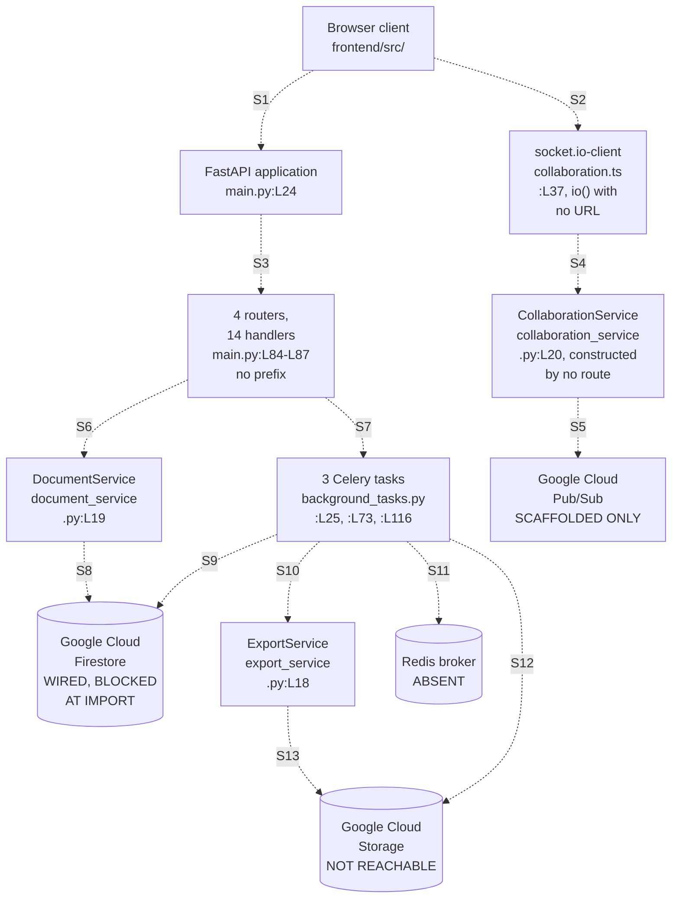

# Integration Guide

**No Firestore, upload, or signed-URL call executes as committed.** The source contains these calls,
but import, configuration, caller, and credential-signing prerequisites fail first.

Four external systems appear in this repository. Google Cloud Firestore has reads and writes written
against it. Google Cloud Storage has export uploads and download-link signing written against it.
Google Cloud Pub/Sub has a full set of publish and subscribe calls whose holding class nothing
constructs. Redis has a broker Uniform Resource Locator (URL) in configuration and no service anywhere
in the committed infrastructure.

Every integration below carries one label, and each label arrives with the evidence that earns it,
including the named prerequisite that stops it. A reader who knows what stands between the code and a
working call can plan an afternoon's work. A reader given four evenly-toned descriptions cannot.

## How to read this guide

Every factual claim below carries a locator in the form `path:Lnn`, and most locators also name the
symbol at that line. Read the symbol name as the durable half of the citation. Line numbers move
whenever anyone edits a file above them, and symbol names do not.

Three conventions govern the locators, matching [troubleshooting.md](troubleshooting.md),
[architecture-overview.md](architecture-overview.md) and [data-model.md](data-model.md) so all four
documents agree:

- Locators point at the committed state at the current branch head, which includes the inline
  documentation added to 44 source files. A locator matches what you see when you open the file
  today, not what an earlier revision held.
- Line numbers are physical. No source file in this repository ends with a newline, so `wc -l`
  reports one line fewer than each file contains.
- A range such as `L154-L164` covers every line in the span, inclusive.

Six words carry one fixed meaning throughout.

| Term | Meaning |
| ------ | --------- |
| router | A FastAPI `APIRouter` instance |
| handler | A route function carrying a `@router` decorator |
| service | A domain service class under `backend/app/services/` |
| adapter | A persistence module under `backend/app/db/` |
| slice | A Redux Toolkit slice under `frontend/src/store/` |
| marker | A `HUMAN ASSISTANCE NEEDED` comment left by the code's authors |

The three documents under `documentation/` record intended behaviour rather than committed
behaviour. Anything drawn from them carries the label **declared intent** and a citation by heading
name plus line, because all three files use unnumbered headings only.
`documentation/Technical Specifications.md` holds five level-one headings: `L3` INTRODUCTION, `L125`
SYSTEM ARCHITECTURE, `L300` SYSTEM DESIGN, `L523` TECHNOLOGY STACK and `L620` SECURITY
CONSIDERATIONS. A numbered section citation anywhere in this documentation set refers to the
generated Technical Specification, a separate document, and the text says so when it does.

Where this engagement made a judgement, [decision-log.md](decision-log.md) carries the argument. No
rationale lives in this file.

## Integration inventory

Four integrations, four labels, and no overlap between them. No integration earns the strongest label.

| Integration | Client library | Reachability | Entry point | Configuration it reads |
| ------------- | ---------------- | -------------- | ------------- | ------------------------ |
| Google Cloud Firestore | `google-cloud-firestore` | **WIRED, BLOCKED AT IMPORT** | `DocumentService`, constructed by all five document handlers at `backend/app/api/documents.py:L45`, `:L64`, `:L92`, `:L124` and `:L152` | `GOOGLE_CLOUD_PROJECT`, declared at `backend/app/core/config.py:L45` |
| Google Cloud Storage | `google-cloud-storage` | **NOT REACHABLE** | `ExportService.export_to_pdf` at `backend/app/services/export_service.py:L40` and `export_to_docx` at `:L74`, plus the export task at `backend/app/tasks/background_tasks.py:L62-L67`. No handler calls either method, and no producer enqueues the task | `STORAGE_BUCKET_NAME`, `SIGNED_URL_EXPIRATION`, `EXPORT_BUCKET_NAME` and `DOCUMENT_BUCKET_NAME`, none of them declared |
| Google Cloud Pub/Sub | `google-cloud-pubsub` | **SCAFFOLDED ONLY** | `CollaborationService.connect` at `backend/app/services/collaboration_service.py:L44` and `broadcast_change` at `:L137`, and no route constructs that class | `PROJECT_ID`, not declared |
| Redis, as the Celery broker | `celery` | **ABSENT** | `celery_app` at `backend/app/tasks/background_tasks.py:L22`, carrying three tasks | `REDIS_URL`, declared at `backend/app/core/config.py:L48` |

Four labels carry one fixed meaning in this guide and in the rest of the documentation set.

| Label | Meaning |
| ------- | --------- |
| **WIRED, BLOCKED AT IMPORT** | Committed code constructs the client library and issues complete, well-formed calls, and a caller exists, and the module holding it cannot import, so no call runs today |
| **NOT REACHABLE** | Committed code writes the calls, and more than one independent barrier stands between a request and the external system. The entry-point column names them |
| **SCAFFOLDED ONLY** | Committed code constructs the client library and writes the calls, and nothing in the application constructs the class holding them, so no call site can run |
| **ABSENT** | Configuration names the integration and code reads that value, and no committed infrastructure provisions the service |

No label in this table means a call reaches Google Cloud today. One import blocks every one of them.
`app.core.config` declares the `Settings` class and a `get_settings` factory and never creates a
module-level `settings` instance, so any module importing that name raises `ImportError` before a
client is built.

Six modules under `backend/app/` import `settings`, and each one touches an external system either
by constructing a client or by reaching one through a service. Four construct a client directly:

| Module | `settings` import | Client it constructs |
| -------- | ------------------- | ---------------------- |
| `backend/app/db/firestore.py` | `:L16` | Firestore `Client` at `:L20` |
| `backend/app/db/sql.py` | `:L14` | SQLAlchemy `engine` at `:L16`, against `DATABASE_URL` |
| `backend/app/services/export_service.py` | `:L16` | Cloud Storage `Client` at `:L36` |
| `backend/app/tasks/background_tasks.py` | `:L16` | `Celery` on `REDIS_URL` at `:L22`, plus Cloud Storage clients at `:L53` and `:L106` |

The other two reach an external system without constructing a client of their own.
`backend/app/services/collaboration_service.py:L18` imports `settings` and builds Pub/Sub publisher
and subscriber clients at `:L38-L39`, and it reads `settings.PROJECT_ID`, a field `Settings` never
declares. `backend/app/services/document_service.py:L17` imports `settings` and reaches Firestore
through the shared client it binds at `:L45`, so it issues external calls without opening a
connection.

Three further modules import `settings` and reach no external system: `backend/app/main.py:L20`,
`backend/app/api/auth.py:L20` and, through the factory rather than the instance,
`backend/app/core/security.py:L22`. Everything below describes the call the code declares.

- Firestore is the one external system an HTTP handler calls. Five document handlers construct
  `DocumentService`, and each of its four methods issues a Firestore call. No request reaches a
  handler today, because importing the application raises `ImportError` on the absent `settings` name.
- Cloud Storage is reached only from export code. Export objects are the only bytes the repository
  writes to any bucket, no route uploads a document or an image, and no handler calls either export
  method.

### The integration map

No edge in the map below carries traffic today, and the diagram is a map of the calls the committed
code writes rather than a map of live request flow. Two blockers sit in front of every edge.
`backend/app/main.py:L16` reaches `backend/app/api/auth.py:L20`, which asks `app.core.config` for a
`settings` name that module never binds, so importing the application raises `ImportError` and no
route is ever registered. Six of the fifteen settings the code reads are declared nowhere, and no
committed file supplies a value for any of them.

Every edge below is dashed, because no seam is complete. Each edge carries a seam key. The seam
table under the diagram names the call the code writes and what stands between that call and the
external system. Some of those barriers outlast repairing the import chain and the undeclared
settings.

Thirteen seams carry a key in the diagram above. One further fact has no edge, because it is the
absence of a call rather than a call. No route anywhere constructs `CollaborationService`, and the
`COLSVC` node states that in place of an edge.

| Seam | Edge | What the committed code writes | What stands in the way |
| ------ | ------ | -------------------------------- | ------------------------ |
| S1 | Browser to FastAPI application | REST over HTTP | Nothing completes. The application cannot import. Past that repair the client still reaches no intended route: `frontend/src/services/api.ts:L40` throws inside the request interceptor, and every document call carries a `/documents` prefix no route declares. `GET /documents` does match the protected single-segment read, so it answers 401 or 500 according to the credentials presented, while the other two calls are settled by routing alone |
| S2 | Browser to socket.io-client | `io()` at `frontend/src/services/collaboration.ts:L37` | No module imports `collaboration.ts`, so nothing constructs the client class, and `io()` receives no URL |
| S3 | Application to the four routers | `backend/app/main.py:L84-L87` would register four routers | `:L16-L19` import `auth_router`, `documents_router`, `users_router` and `templates_router`, and all four modules export the bare name `router` |
| S4 | socket.io-client to CollaborationService | a Socket.IO connection from the browser | No route joins Socket.IO to the FastAPI WebSocket signature the service declares |
| S5 | CollaborationService to Pub/Sub | subscribe at `backend/app/services/collaboration_service.py:L99`, publish at `:L156` | Neither runs, because nothing constructs the class. `settings.PROJECT_ID` is undeclared at `:L69`, `:L70`, `:L128` and `:L153`. The subscription name at `:L70` identifies a document and user rather than a connection. A second session for one user would therefore answer `AlreadyExists` at `:L73`, and either session closing would delete the shared subscription at `:L130` |
| S6 | Routers to DocumentService | constructed at `backend/app/api/documents.py:L45`, `:L64`, `:L92`, `:L124` and `:L152` | Every call breaks its signature. `:L46` hands a `User` where `user_id: str` is declared, so `set` at `backend/app/services/document_service.py:L73` raises while it builds the write and nothing is stored. `:L91`, `:L120` and `:L146` pass one argument to a two-parameter `get_document`, and `:L65` calls `get_documents`, which the class never defines. All five handlers sit behind the token dependency, so a caller without valid credentials receives 401 and reaches none of these faults |
| S7 | Routers to the Celery tasks | nothing | No producer. Zero `.delay()` and zero `.apply_async()` call sites exist anywhere |
| S8 | DocumentService to Firestore | set at `backend/app/services/document_service.py:L73`, get at `:L102`, update at `:L153`, delete at `:L188`, all written in full | Each read then builds `Document(**...)` against `created_at` and `updated_at`, required at `backend/app/schema/document.py:L64-L65` and written by nothing |
| S9 | Celery tasks to Firestore | read at `backend/app/tasks/background_tasks.py:L96`, delete at `:L103`, update at `:L142` | No producer runs them |
| S10 | Celery tasks to ExportService | constructed at `backend/app/tasks/background_tasks.py:L52`, then calls `convert_document` at `:L59` | `ExportService` never defines `convert_document` |
| S11 | Celery tasks to the Redis broker | broker URL read at `backend/app/tasks/background_tasks.py:L22` | The URL resolves to no service. No committed infrastructure provisions a broker |
| S12 | Celery tasks to Cloud Storage | upload at `backend/app/tasks/background_tasks.py:L64`, signed URL at `:L67` | Unreachable behind S10, and the signing call passes no version argument, so the client default applies |
| S13 | ExportService to Cloud Storage | upload at `backend/app/services/export_service.py:L63`, V4 signing at `:L66-L70`, both written in full | No handler calls either export method |

## Google Cloud Firestore

**WIRED, BLOCKED AT IMPORT.** Firestore is the only external system a committed HTTP handler calls,
and no call runs today, because the module holding those calls cannot import. Five document handlers construct
`DocumentService` at `backend/app/api/documents.py:L45`, `:L64`, `:L92`, `:L124` and `:L152`, and
each of that class's four methods issues a Firestore call. Firestore also holds every record the
code writes, because the SQLAlchemy path stays declared and unused.
[data-model.md](data-model.md) covers the split.

Two independent access paths exist, and only one of them has a caller.

| Access path | Location | Callers |
| ------------- | ---------- | --------- |
| The adapter's four helpers | `backend/app/db/firestore.py:L22`, `:L45`, `:L64`, `:L81` | None. No module imports any of the four |
| `DocumentService`, calling the client directly | `backend/app/services/document_service.py:L19` | Five document handlers, plus the task module. That module constructs the class three times, at `backend/app/tasks/background_tasks.py:L51`, `:L93` and `:L132`. The module calls a method on only two of the three, at `:L56` and `:L135`. The instance built at `:L93` is never used |

### The adapter, and why nothing uses it

The adapter builds one client at module scope and exposes four synchronous helpers.
`backend/app/db/firestore.py:L19` resolves Application Default Credentials (ADC) through
`google.auth.default()`, and `:L20` constructs the client with
`Client(project=settings.GOOGLE_CLOUD_PROJECT)`. Both statements run at import time. The four
helpers follow: `get_document` at `:L22`, `create_document` at `:L45`, `update_document` at `:L64`
and `delete_document` at `:L81`.

No module imports any of the four. Three modules import the `db` client instead and call the
Firestore software development kit (SDK) directly: `backend/app/main.py:L21`,
`backend/app/services/document_service.py:L16` and `backend/app/tasks/background_tasks.py:L17`. The
adapter's four helpers therefore sit outside every execution path in the repository.

One annotation on the adapter contradicts the code beneath it. `get_document` declares `-> dict` at
`:L22` and returns `None` at `:L43` when the snapshot does not exist. A caller who trusts the
annotation and subscripts the result raises `TypeError` for a missing document.

None of the four helpers opens a transaction, sets a retry policy, sets a timeout, or catches an
exception. [../backend/app/db/README.md](../backend/app/db/README.md) carries the module detail.

### The service, and the shape of its calls

`DocumentService` holds the shared client at `backend/app/services/document_service.py:L40` and
issues **seven** remote Firestore operations across four methods. The count excludes
`collection()` and `document()`, which build a reference locally and send nothing, so
`:L69`, `:L101`, `:L141` and `:L177` are not remote operations.

| Method | Remote operations | Count | Locators |
|--------|-------------------|-------|----------|
| `create_document` at `:L42` | `set` | 1 | `:L73`, on the reference built at `:L69` |
| `get_document` at `:L78` | `get` | 1 | `:L102`, on the reference built at `:L101` |
| `update_document` at `:L116` | `get`, `update`, then `get` again | 3 | `:L142`, `:L153`, `:L156` |
| `delete_document` at `:L159` | `get`, then `delete` | 2 | `:L178`, `:L188` |

The update path reads, modifies, then reads again, which costs three Firestore operations for one
logical update. The first read at `:L142` supports the existence check at `:L126` and the ownership
comparison at `:L148`. The second read at `:L156` fetches the record the method returns, because
`update()` returns no snapshot.

Every method carries `async def` and every Firestore call inside runs synchronously and blocks. A
declared coroutine that never yields holds the event loop for the duration of each round trip. The
declared type and the runtime behaviour disagree, and the code, not the annotation, describes what
happens. [../backend/app/services/README.md](../backend/app/services/README.md) owns the service
detail.

### What the background tasks touch

Two of the three Celery tasks in `backend/app/tasks/background_tasks.py` reach Firestore, and
neither runs today, because no producer enqueues them. The
[Redis broker section](#redis-broker-for-celery) carries that evidence.

| Task | Firestore work | Locators |
| ------ | ---------------- | ---------- |
| `cleanup_expired_documents` at `:L73` | Queries `documents` on an expiry comparison, deletes the matching document, calls `.delete()` on a `document_permissions` query result, then deletes from `document_metadata` | `:L96`, `:L103`, `:L112`, `:L113` |
| `update_document_statistics` at `:L116` | Reads one document through `DocumentService.get_document`, then updates `documents` with a recomputed word and page count | `:L135`, `:L142` |

`process_document_export` reaches Firestore indirectly rather than through the `db` client. The call
at `:L56` passes two arguments to a service method that accepts two, so the arity is correct there.
`update_document_statistics` passes one argument at `:L135` to the same two-argument method.

Two faults sit inside that work. `backend/app/tasks/background_tasks.py:L96` calls `datetime.now()`,
and `:L20` imports `timedelta` alone, so the name `datetime` is undefined and the query raises
`NameError` on first execution. `:L146` repeats the same call inside the statistics update.

Separately, `:L112` calls `.delete()` on the value `Query.get()` returns. That value is a list of
snapshots rather than a reference, so the call raises `AttributeError`.
[troubleshooting.md](troubleshooting.md) registers both under
[G3](troubleshooting.md#g3-undefined-names-that-raise-at-execution).

Three collections appear across the code. `documents` is the only one a service writes.
`document_permissions` at `:L112` and `document_metadata` at `:L113` appear in the retention task
alone, and no schema in either language models either of them.
[../backend/app/tasks/README.md](../backend/app/tasks/README.md) carries the task detail.

## Google Cloud Storage and version 4 signed URLs

**NOT REACHABLE.** Export objects are the only bytes this repository writes to any bucket. The
write-and-sign sequence in `ExportService` is written in full and in the right order, and more than
one independent barrier stands in front of it. Three barriers apply: no handler calls either export
method, no route uploads a document, and no route uploads an image.

Read the label as a statement about the shape of the call, not about a successful upload or a usable
link. Three prerequisites stand between the committed code and either outcome, and the two
subsections after the step table name each one.

Two code paths construct a Cloud Storage client. `backend/app/services/export_service.py:L36` builds
one per service instance, and `backend/app/tasks/background_tasks.py:L53` and `:L106` build one per
task invocation.

### The service path signs version 4 URLs

Both export methods are plain synchronous `def`, at `backend/app/services/export_service.py:L40` and
`:L74`. Each resolves a bucket, uploads a payload, signs a link, and returns the link.

| Step | `export_to_pdf` | `export_to_docx` |
| ------ | ----------------- | ------------------ |
| Resolve the bucket from `settings.STORAGE_BUCKET_NAME` | `:L60` | `:L92` |
| Target the object key | `:L61` | `:L93` |
| Upload the payload | `:L63` | `:L95` |
| Sign the link | `:L66-L70` | `:L98-L102` |
| Return the link | `:L72` | `:L104` |

Both signing calls pass `version="v4"`, at `:L67` and `:L99`, and both read the expiry from
`settings.SIGNED_URL_EXPIRATION`, at `:L68` and `:L100`. Both pass `method="GET"`, at `:L69` and
`:L101`.

The payloads are literal placeholder strings. `:L63` uploads `"PDF_CONTENT"` with content type
`application/pdf`, and `:L95` uploads `"DOCX_CONTENT"` with the Office Open XML content type. Both
Multipurpose Internet Mail Extensions (MIME) types are correct for the format each method names. A
browser receiving either object therefore treats eleven or twelve bytes of text as a document.

Conversion does not exist, and each method carries a `TODO` marker recording the gap, at `:L57`,
`:L62`, `:L89` and `:L94`.

No module under `backend/app/` calls either method. The only callers anywhere sit in the test suite,
at `backend/tests/test_services.py:L67` and `:L75`. Both pass the integer identifier `1`, bound at
`:L65` and `:L73`, where the signature declares a `Document`.

### What the upload and the signature each still need

Neither the upload nor the signature completes as committed. Three prerequisites are missing, and they
fail in this order inside `export_to_pdf`.

| Order | Statement | Locator | What it needs |
| ------- | ----------- | --------- | --------------- |
| 1 | `self.storage_client.bucket(settings.STORAGE_BUCKET_NAME)` | `export_service.py:L60` | A declared `STORAGE_BUCKET_NAME`. `Settings` declares nine fields at `backend/app/core/config.py:L40-L48` and this is not among them, so attribute access raises `AttributeError` before any network call |
| 2 | `blob.upload_from_string(...)` | `export_service.py:L63` | Credentials that authenticate and carry write permission on the bucket. `export_service.py:L36` builds `Client()` with no arguments, so the Cloud Storage client runs its own Application Default Credentials lookup. That lookup is independent of the Firestore lookup at `backend/app/db/firestore.py:L19`, the repository's only explicit `default()` call. ADC consults several sources in turn, among them `GOOGLE_APPLICATION_CREDENTIALS`, a `gcloud` user credential in the well-known configuration file, and the metadata server on a Google Cloud instance. No committed file supplies any of them, so what this client resolves is a property of the host |
| 3 | `blob.generate_signed_url(version="v4", ...)` | `export_service.py:L66-L70` | Sign-capable credentials, and an expiry inside the version 4 limit |

Signing is the prerequisite most easily missed, because it needs more than authentication. A version 4
signature is computed locally, so the credentials must be able to sign bytes. Two credential shapes
satisfy that:

- **A service-account private key.** A key file referenced through `GOOGLE_APPLICATION_CREDENTIALS`.
  `backend/app/core/config.py:L46` declares that field as `Optional[str]` with no explicit default,
  which Pydantic 1.x treats as optional with a `None` default, so the contract never requires it.
  No committed `.env` file supplies it. `Config.env_file` at `:L60`
  names the file the repository does not commit.
- **An IAM `signBlob` grant.** Credentials with no private key can sign only by delegating to the
  IAM Credentials application programming interface (API). A metadata-server token on a Compute
  Engine or Cloud Run instance is one such credential. That path needs the
  `iam.serviceAccounts.signBlob` permission on the signing service account, granted through the
  Service Account Token Creator role, and the caller must pass the signer identity explicitly.
  Neither the code nor `infrastructure/terraform/main.tf` grants that permission or names a signer.

Credentials resolved from a user account through `gcloud auth application-default login` carry
neither a private key nor a signer identity. `generate_signed_url` therefore raises for a local
developer even when the upload at `export_service.py:L63` succeeds.

The expiry carries its own two constraints. `generate_signed_url` accepts an `int` of seconds, a
`datetime.timedelta`, or an absolute `datetime`. `export_service.py:L68` passes
`settings.SIGNED_URL_EXPIRATION` with no conversion, so whatever type that field eventually holds is
the type the call receives. A version 4 signature also caps the lifetime at seven days, and a longer
expiry raises `ValueError` rather than returning a short-lived link.

`Settings` declares no `SIGNED_URL_EXPIRATION`, so no committed value can be checked against either
constraint. The method holds no `try` block, so both the `AttributeError` and the `ValueError` reach
the caller unchanged. Step 2 has already written the placeholder object by the time step 3 fails.

### The task path signs differently

`process_document_export` at `backend/app/tasks/background_tasks.py:L25` writes to Cloud Storage
without going through either export method. The task constructs `ExportService` at `:L52`, then
calls `export_service.convert_document(document, export_format)` at `:L59`. `ExportService` never
defines `convert_document`, so the task raises `AttributeError` at that line and reaches none of the
upload work below it, even if something enqueued the task.

The two paths sign links differently. `:L67` calls
`generate_signed_url(expiration=timedelta(hours=1))` with no `version` argument, while the service
passes `version="v4"` at `:L67` and `:L99`. A caller consuming both paths receives links signed
under two different schemes.

Three object-key layouts appear in the committed code, and no two of them agree.

| Path | Object key | Locators |
| ------ | ----------- | ---------- |
| `ExportService` | `exports/{document.id}.pdf` and `exports/{document.id}.docx` | `:L61`, `:L93` |
| `process_document_export` | `exports/{user_id}/{document_id}.{export_format}` | `:L63` |

The two writers disagree with each other. The service layout omits the owner and encodes the format
in the file extension. The task layout partitions by owner and takes the format from a
caller-supplied string that nothing validates. The same export therefore lands in two different
places depending on which path runs.

The third layout is the one that matters most, because it deletes rather than writes.
`backend/app/tasks/background_tasks.py:L108` builds `{user_id}/{doc_id}` and `:L109` calls
`blob.delete()` on it. That key matches neither writer, carrying no `exports/` prefix and no file
extension. The service path produces `exports/{document.id}.pdf` at `export_service.py:L61`, and the
task path produces `exports/{user_id}/{document_id}.{export_format}` at `background_tasks.py:L63`.

Neither shape can be named by the deletion key. The retention sweep would therefore reclaim nothing,
and it reads a third bucket name, `DOCUMENT_BUCKET_NAME`, which no other code path writes to. Three
layouts, three bucket settings, and no agreement between the writers and the deleter.

### Four settings fields, none of them declared

Cloud Storage code reads three bucket names and one expiry value, and `Settings` declares none of
the four.

| Field | Read at | Status |
| ------- | --------- | -------- |
| `STORAGE_BUCKET_NAME` | `export_service.py:L60`, `:L92` | Read but never declared |
| `SIGNED_URL_EXPIRATION` | `export_service.py:L68`, `:L100` | Read but never declared |
| `EXPORT_BUCKET_NAME` | `background_tasks.py:L62` | Read but never declared |
| `DOCUMENT_BUCKET_NAME` | `background_tasks.py:L107` | Read but never declared |

`backend/app/core/config.py:L40-L48` declares nine fields, and the four above appear in none of
them. Attribute access on a Pydantic model raises `AttributeError` for an undeclared field, so each
read fails at the line that makes it. Two further fields share the same status, `ALLOWED_ORIGINS` at
`backend/app/main.py:L77` and `PROJECT_ID` in the collaboration service. Six settings are therefore
read and never declared, against nine that are declared.
[../backend/app/core/README.md](../backend/app/core/README.md) carries the full configuration
census.

One of the four sets the lifetime of a bearer credential, and no committed contract bounds it.
`SIGNED_URL_EXPIRATION` reaches `Blob.generate_signed_url` as the `expiration` argument at
`backend/app/services/export_service.py:L68` and `:L100`. `backend/app/core/config.py` declares no
field of that name, so it carries no type, no default, no `Field` constraint and no validator, and
defined bounds on the value measure zero. That matters more than an ordinary missing setting, because
a version 4 signed URL needs no authentication to redeem. Whoever holds the link holds the object for
as long as the link lives, so the lifetime is the whole of the access control.

One failure mode follows once a value arrives, and one apparent failure mode does not. A unit
mistake passes silently. The client library reads a bare integer as seconds while a `timedelta` or a
`datetime` means something else, and nothing in the codebase distinguishes the three. An over-long
lifetime does not pass: the client library rejects a version 4 expiry above seven days with
`ValueError`, so a value above that limit mints no link at all. Every value at or below seven days
is accepted with no project policy behind it, which is where the real exposure sits.

No signed URL is generated today. Four barriers stand in front of the gap, in the order execution
meets them. First, the absent `settings` singleton at `backend/app/services/export_service.py:L16`
stops the module at import. Second, the undeclared `settings.STORAGE_BUCKET_NAME` at `:L60` and
`:L92` raises `AttributeError`. Third, the undeclared `settings.SIGNED_URL_EXPIRATION` at `:L68` and
`:L100` raises the same way.

Fourth, signing needs a credential that can sign bytes, and whether the resolved credential supplies
one depends on the host. A service-account key file carries a private key and signs locally. A
metadata-server token on a Compute Engine or Cloud Run instance carries no key. Signing then works
only by delegating to the IAM Credentials API, which needs the `iam.serviceAccounts.signBlob`
permission on the signing account and an explicitly passed signer identity.

`export_service.py:L66-L70` and `:L98-L102` pass no `credentials`, no `service_account_email` and no
`access_token`, so the code settles neither the credential type nor the signing route. No committed
file supplies a credential that would settle it either. Read the gap as one to close before the
first link is issued, not as an exposure running now. The same limitation is recorded against the
modules that hold it, in [../backend/app/core/README.md](../backend/app/core/README.md) and
[../backend/app/services/README.md](../backend/app/services/README.md).

`infrastructure/terraform/main.tf:L50` declares one `google_storage_bucket` resource, and no
committed file connects that bucket's name to any of the four settings fields above.
[deployment-guide.md](deployment-guide.md) covers the infrastructure side.

### Signed-link trust boundary

A signed URL is a bearer credential. Anyone holding the string can fetch the object until the signature
expires, with no account, no token and no further check, so the link is the authorization. Treat every
one of these links as a secret in transit and at rest. The constraints below are absent from the
committed code and become prerequisites the moment a caller reaches the signing calls.

| # | Constraint | Committed state |
| --- | ------------ | ----------------- |
| 1 | A reviewed expiry, short enough to bound exposure | `export_service.py:L68` and `:L100` read `settings.SIGNED_URL_EXPIRATION`, which `Settings` never declares, so no value and no ceiling exists in the repository. `background_tasks.py:L67` hard-codes `timedelta(hours=1)` instead, so the two paths would expire differently even once the field exists |
| 2 | One signing scheme | The service passes `version="v4"` at `:L67` and `:L99`. The task passes no `version` argument at `:L67`. A consumer of both paths receives links signed under two different schemes |
| 3 | An authorization check before a link is minted | Neither export method takes a caller identity. `export_to_pdf` at `:L40` and `export_to_docx` at `:L74` accept a `Document` and sign a link for it, and nothing compares a requesting user against the document's owner first. `process_document_export` at `background_tasks.py:L25` takes `user_id` and puts it to two uses. `:L56` passes it to `document_service.get_document(document_id, user_id)`, an ownership handoff with the right arity that no `await` drives, so the coroutine is created, never executed and discarded. `:L63` then builds the object key from the same value |
| 4 | A signing credential held as a secret | Signing needs a private key or an IAM SignBlob delegation. No committed file supplies either, and `scripts/deploy.sh:L19` would archive a service-account key JSON file sitting in the working tree and `:L23` would upload it. [../scripts/README.md](../scripts/README.md) carries that path |
| 5 | No link in a log or an error | No traced exposure exists today. No committed caller reaches either export method, so no signed URL is produced, and no logging path in the repository receives one. The constraint stands as a prerequisite rather than a finding. `frontend/src/services/api.ts` and the page handlers log whole error objects, so a link returned through either would land in the console with the rest of the response. [../frontend/src/pages/README.md](../frontend/src/pages/README.md) records that logging behaviour |
| 6 | Object-level access control that the link cannot bypass | `infrastructure/terraform/main.tf:L54` sets `uniform_bucket_level_access = true`, which is the right default. `:L56-L58` enables versioning with no `lifecycle_rule`, so a delete or an overwrite on that bucket archives the current generation and leaves it addressable to anyone able to name it. Whether an export ever lands there is undetermined, because both upload sites read `settings.STORAGE_BUCKET_NAME` (`backend/app/services/export_service.py:L60`, `:L92`) and `Settings` does not declare that field. [../infrastructure/terraform/README.md](../infrastructure/terraform/README.md) carries the bucket detail |

None of the six is changed here. Each is recorded so that whoever makes this path reachable knows what
has to land with it.

## Google Cloud Pub/Sub

**SCAFFOLDED ONLY.** No route constructs `CollaborationService`, so the Pub/Sub fan-out is
unreachable at runtime. The class sits at `backend/app/services/collaboration_service.py:L20`, and a
search of all four routers and `backend/app/main.py` finds no import of the module and no
construction of the class. The only constructor call in the repository sits at
`backend/tests/test_services.py:L39`, reached through a `services.collaboration_service` specifier
whose target file does exist. Two conditions stand between that specifier and a live object.

The name is discoverable only while `backend/app/` sits on the import path, because `services/`
holds no `__init__.py` and acts as an implicit namespace package. Importing it then needs `backend/`
on the path as well, for the module's own `app.*` imports, and stops at
`backend/app/services/collaboration_service.py:L18`, which requests the `settings` name that
`app.core.config` never binds. The same test file calls three methods the class never defines, at
`:L44`, `:L50` and `:L55`. [../backend/tests/README.md](../backend/tests/README.md) carries the full
import-resolution matrix, and
[troubleshooting.md](troubleshooting.md#three-test-imports-that-are-path-dependent-rather-than-absent)
records the same sequence.

Declared intent runs the other way. `documentation/Technical Specifications.md:L292`, under the
DATA-FLOW DIAGRAM heading at `L264`, presents a collaboration service managing real-time updates as
a system component. The same document names Cloud Pub/Sub as the messaging service behind real-time
collaboration, at `:L592` under the THIRD-PARTY SERVICES heading at `L587`. Both statements describe
intent. The committed code holds the calls and no path to them.

### What the service constructs and calls

`__init__` at `:L32` builds both clients and one registry. `:L29` constructs `PublisherClient()`,
`:L39` constructs `SubscriberClient()`, and `:L40` creates `active_connections` as a plain
dictionary. The registry lives in one process and carries no lock, so two workers hold two separate
views of who is connected.

Four Pub/Sub calls exist across three methods.

| Method | Pub/Sub call | Locator |
| -------- | -------------- | --------- |
| `connect` at `:L44` | `create_subscription` | `:L73` |
| `connect` at `:L44` | `subscribe` | `:L95` |
| `disconnect` at `:L103` | `delete_subscription` | `:L126` |
| `broadcast_change` at `:L133` | `publish` | `:L152` |

`connect` registers the socket at `:L66`, then builds a per-document topic path at `:L69` and a
per-document, per-user subscription path at `:L70`. Both paths interpolate `settings.PROJECT_ID`,
and `Settings` never declares that field, so `:L69` raises `AttributeError` before any Pub/Sub call
runs. `disconnect` rebuilds the same subscription path at `:L124`, and `broadcast_change` rebuilds the
same topic path at `:L149`.

### The topic must already exist, and nothing creates it

Two of the four Pub/Sub calls name a topic and require it to exist. `create_subscription` at `:L73`
passes `topic=topic_name`, and Pub/Sub answers `NotFound` when that topic is absent. `publish` at
`:L152` addresses the same path and fails the same way. Neither call creates a topic, and no
`create_topic` call exists anywhere in the repository. The module's own docstring records the gap at
`backend/app/services/collaboration_service.py:L8-L12`.

No committed infrastructure supplies the topic either. Searching all of `infrastructure/` for
`pubsub`, `topic` and `subscription` returns nothing, and `infrastructure/terraform/main.tf` declares
one provider plus four Google Cloud resources with no messaging resource among them. The topic name is
derived per document at `backend/app/services/collaboration_service.py:L69`, so a deployment would
need one topic per document identifier, created outside this repository before any editor connects.

| Call | Locator | Needs a topic | Status without a pre-created topic |
| ------ | --------- | --------------- | ------------------------------------- |
| `create_subscription` | `collaboration_service.py:L73` | Yes, as the `topic` argument | **BLOCKED.** `NotFound`, caught at `:L74`, printed at `:L76`, then `:L77` returns |
| `subscribe` | `collaboration_service.py:L99` | No, it names the subscription | Never reached, because `:L77` returned first |
| `delete_subscription` | `collaboration_service.py:L130` | No, it names the subscription | `NotFound` for a subscription that was never created, caught at `:L131` and printed at `:L133` |
| `publish` | `collaboration_service.py:L156` | Yes, as the destination path | **BLOCKED.** `NotFound`, caught at `:L158`, printed at `:L160`, and the method returns normally |

Creating the topic outside the repository is therefore a prerequisite for the collaboration path.
The prerequisite sits behind the earlier blockers rather than in front of them: no route constructs the class, and
`settings.PROJECT_ID` is undeclared.

### Seven faults inside the collaboration path

- **`asyncio` is undefined, and two further faults sit on the same line.** The callback at
  `backend/app/services/collaboration_service.py:L80` calls
  `asyncio.run(websocket.send_json(message.data))` at `:L97`, and the module imports no `asyncio`,
  so the first delivered message raises `NameError`. Supplying the import exposes the second fault:
  `message.data` is `bytes` on a Pub/Sub message, `WebSocket.send_json` serializes with
  `json.dumps`, and `json.dumps` rejects `bytes`. Nothing decodes the payload, while
  `broadcast_change` encoded it as UTF-8 at `:L156`, so the round trip is unbalanced.

  The third fault is event-loop ownership. `asyncio.run` builds a new loop and closes it on return,
  while the `WebSocket` belongs to the server's already-running loop. `asyncio.run` also refuses
  outright when a loop is already running on the calling thread. The Pub/Sub client invokes the
  callback on its own thread, so none of the three propagates to `connect`.
- **A failed publish is caught and logged, not raised.** `broadcast_change` reads
  `settings.PROJECT_ID` at `:L149`, which sits **above** the `try` at `:L151`, so the undeclared-field
  `AttributeError` propagates to the caller on the first call and nothing is published. That is the
  method's first statement, so it leaves no partial state. Everything after it is guarded: `:L152`
  calls `json.dumps(change)` against a module that imports no `json`, and `:L154` catches every
  exception the body raises while `:L156` prints it. Once `PROJECT_ID` exists, a publish failure
  therefore surfaces as a printed line and a normal `None` return, and a caller cannot tell a
  delivered change from a dropped one.
- **Acknowledgement precedes delivery.** `:L92` calls `message.ack()` and `:L93` then sends the
  data to the socket. A send that fails after the acknowledgement loses the message, because Pub/Sub
  has already been told the message was handled and will not redeliver.
- **Both futures block, and the third method has no future to wait on.** `:L98` calls
  `future.result()` on the streaming pull future, and `:L153` calls `future.result()` on the publish
  future. Neither call passes a timeout, so each blocks the calling thread until the future settles.
  `connect` is declared `async def`, so the block at `:L98` holds the event loop rather than one
  worker thread. `disconnect` creates no future: `:L126` calls `delete_subscription`, which returns
  nothing to wait on, so the method has nothing to block for and nothing to cancel.
- **Two partial states can persist.** `connect` mutates the registry at `:L64-L66` before it touches
  Pub/Sub. `:L73` calls `create_subscription` inside a `try`, and on failure `:L76` prints the error
  and `:L77` returns, leaving the socket registered in `active_connections` with no subscription
  behind it. That connection receives nothing and no later call removes it.

  `disconnect` removes the registry entry at `:L118-L121` before it deletes the subscription, so a
  caught deletion failure at `:L127` leaves a subscription with no registry entry. Neither method
  compensates, and neither reports the state to its caller.

Two markers sit inside this module, above `connect` at `:L42-L43` and above `broadcast_change` at
`:L131-L132`. Both record the code authors' own confidence in the method beneath them. Read them in
place. [../backend/app/services/README.md](../backend/app/services/README.md) carries the service
detail, and [troubleshooting.md](troubleshooting.md) registers the transport gap under
[G7](troubleshooting.md#the-collaboration-path-has-no-route-and-two-protocols).

### Collaboration trust boundary

Being unreachable is not the same as being safe, and this path is neither. The controls listed below do
not exist in the committed code, and each one becomes a prerequisite the moment a route constructs the
service. None of them can be inferred from the current signatures, so a repair that only adds a
WebSocket route would expose every gap at once.

Read the Committed state column as a statement about the method, not about a caller. No route
constructs this service, so no request reaches any of these lines today. Each row records the check
the method itself does not perform, which is a guarantee the caller would have to supply instead. A
route that authenticated the socket and authorized the pair before calling would close rows 1, 2 and
4 without changing the service at all.

| # | Control | Committed state |
|---|---------|-----------------|
| 1 | Authenticate the connection | `connect` at `:L44` takes `websocket`, `document_id` and `user_id`. The method accepts no token, reads no header and calls no dependency, so nothing establishes who is connecting. Every other protected surface in the backend goes through `get_current_user` at `backend/app/api/auth.py:L28`, and this path does not |
| 2 | Authorize the identity against the document | Nothing compares `user_id` against the document's stored owner. `:L64-L66` registers the socket straight from the two string arguments. The document handlers at least attempt an owner check, at `backend/app/api/documents.py:L94`, `:L126` and `:L154` |
| 3 | Validate `document_id` before it names a resource | `:L69`, `:L70` and `:L149` interpolate `document_id` directly into Pub/Sub topic and subscription paths, with no allow-list, no format check and no membership check. Whichever string the method receives selects the topic it publishes to and the subscription it creates, so a caller that forwarded a client-supplied value would let the client choose both |
| 4 | Authorize a disconnect | `disconnect` at `:L103` takes the same two strings, removes the entry at `:L119` and `:L121`, then deletes the subscription at `:L126`. The method verifies neither argument, so a caller that did not check them would let one user's identifiers drop another user's connection |
| 5 | Validate the event payload | `broadcast_change` at `:L133` declares `change: dict` and publishes it unchanged at `:L152`. No schema constrains the keys, no field is bounded, and no type is checked |
| 6 | Bound the payload size | Nothing limits the size of `change`. A large object is serialized and published as one message, and Pub/Sub rejects a message above its own limit rather than the application refusing it first |
| 7 | Scope the fan-out per recipient | `active_connections[document_id]` maps every registered `user_id` to a socket, and the callback at `:L80` sends each delivered message to the socket at `:L93` with no per-recipient authorization check. One publish reaches every socket registered against that document |
| 8 | Share state across processes | `__init__` at `:L32` builds `active_connections` as a plain dictionary in process memory, and the class docstring records the consequence at `:L15-L17`. A second server process shares none of it, so a fan-out under more than one worker reaches only the subset of clients that landed on the same process |

Read the whole table as future work, not as a change made here. Nothing in this documentation pass
alters the service. The security gates that must land before this integration is made reachable are
ordered in [onboarding.md](onboarding.md), and [troubleshooting.md](troubleshooting.md) registers each
one with its evidence.

## Redis broker for Celery

**ABSENT.** Redis is declared in configuration and exists in no infrastructure, so no Celery task
can be enqueued. The chain is three links long and every link is verifiable.

| Link | Evidence |
| ------ | ---------- |
| Configuration declares the broker URL | `backend/app/core/config.py:L48` declares `REDIS_URL: str` with no default, so the field is required |
| Code wires Celery to that value | `backend/app/tasks/background_tasks.py:L22` builds `Celery('microsoft_word', broker=settings.REDIS_URL)` at module scope |
| No infrastructure provisions Redis | `infrastructure/docker/docker-compose.yml:L3-L39` defines exactly three services, `frontend` at `:L4`, `backend` at `:L17` and `db` at `:L30`. `infrastructure/terraform/main.tf` declares one provider and four Google Cloud resources: a network at `:L19`, a subnetwork at `:L25`, a firewall rule at `:L35` and a storage bucket at `:L50`. The file declares no cache resource. Searching all of `infrastructure/` for `redis` or `memorystore` returns nothing |

Declared intent names the missing piece directly. `documentation/Technical Specifications.md:L584`,
under the DATABASES heading at `L563`, lists Redis on Google Cloud Memorystore in the stack. The
same document lists Celery as the task queue, at `:L554` under the TECHNOLOGY STACK heading at
`L523`. Neither statement reached the infrastructure.

### Three tasks and no producer

Three tasks carry the `@celery_app.task` decorator, at `:L24`, `:L71` and `:L115`.

| Task | Signature | Purpose in the code |
| ------ | ----------- | --------------------- |
| `process_document_export` | `:L25` | Convert a document, upload the object, return a signed link |
| `cleanup_expired_documents` | `:L73` | Delete documents past an expiry date, plus their object and metadata |
| `update_document_statistics` | `:L116` | Recompute a word and page count and write it back |

Nothing enqueues any of the three. A repository-wide search for `.delay(` and for `.apply_async(`
returns zero call sites in `backend/app/`, in `backend/tests/` and in `frontend/src/`. The queue has
three consumers and no producer.

Two further defects sit in the task tier.

- **The daily sweep has no schedule.** `:L71` places `@celery_app.task` above
  `@celery_app.periodic_task(run_every=timedelta(days=1))` at `:L72`. Celery 5 exposes no
  `periodic_task` decorator on an application object. The module therefore raises `AttributeError`
  at that line once the earlier import failures clear, and the retention sweep carries no schedule.
- **No process runs the tasks.** No worker command and no beat command appears anywhere. Compose
  starts three services and none of them is a worker, no Dockerfile declares a worker entry point,
  and `scripts/deploy.sh` starts no worker. `.github/workflows/cd.yml:L19-L20` deploys two App
  Engine descriptors and mentions no queue.

[../backend/app/tasks/README.md](../backend/app/tasks/README.md) carries the task detail, and
[troubleshooting.md](troubleshooting.md) registers the broker gap under
[G8](troubleshooting.md#no-redis-service-backs-the-celery-broker).

## Credential model

Google credentials are designed to resolve at import time, not at first call.
`backend/app/db/firestore.py:L19` calls `google.auth.default()` at module scope, so importing the
adapter would run ADC discovery immediately. Any module that reaches `from app.db.firestore import db`
inherits that requirement, which covers `backend/app/main.py:L21`,
`backend/app/services/document_service.py:L16` and `backend/app/tasks/background_tasks.py:L17`. The
next line, `backend/app/db/firestore.py:L20`, constructs the Firestore client eagerly rather than lazily.

No ADC discovery happens against the committed tree. `backend/app/db/firestore.py:L16` imports
`settings` and raises `ImportError` first, so `:L19` and `:L20` never execute. The credential model
below is the model the code declares.

The database engine behaves the same way in one respect and differently in another.
`backend/app/db/sql.py:L16` calls `create_engine(settings.DATABASE_URL)` at module scope, so
importing that module needs a connection string present in configuration. `create_engine` parses the
URL eagerly, so an unparseable value raises during that same import. Engine construction does not
open a connection, so a parseable value naming an unreachable database passes here and fails at the
first connection instead.

Four surfaces supply credentials, and they do not agree on a single source.

| Surface | What it supplies | Locator |
| --------- | ------------------ | --------- |
| `Settings` | `GOOGLE_CLOUD_PROJECT` and `GOOGLE_APPLICATION_CREDENTIALS`, both `Optional[str]` | `backend/app/core/config.py:L45-L46` |
| The nested `Config` class | An `.env` file as the fallback source, with UTF-8 encoding | `backend/app/core/config.py:L50-L61`, naming `.env` at `:L60` |
| `scripts/deploy.sh` | A guard that exits 1 when `GOOGLE_APPLICATION_CREDENTIALS` is empty, and nothing more. See the note below | `scripts/deploy.sh:L4-L7` |
| `.github/workflows/cd.yml` | A project identifier and a service-account key, both from repository secrets named `GCP_PROJECT_ID` and `GCP_SA_KEY`, passed to `google-github-actions/setup-gcloud`, which does authenticate the CLI | `.github/workflows/cd.yml:L13-L16` |

`scripts/deploy.sh` supplies no credential to any tool. Two credential mechanisms exist and the
script conflates them. `GOOGLE_APPLICATION_CREDENTIALS` configures Application Default Credentials,
which the Google client libraries read, and the `gcloud` and `gsutil` command-line tools read their
own credential store instead. `scripts/deploy.sh:L4-L7` tests only that the variable is non-empty:
it checks no path, validates no key, runs no `gcloud auth activate-service-account --key-file`, and
runs no `gcloud config set project`. Every cloud stage in that script is a CLI invocation rather
than a client-library call, so a passing guard authorizes nothing.

The gap first surfaces at `scripts/deploy.sh:L23`, the `gsutil cp` that is the script's first cloud
command. That command fails on missing credentials or a missing default project unless the host
already carries an authenticated `gcloud` configuration. `.github/workflows/cd.yml:L13-L16` is the
one path that does authenticate a CLI, because the `setup-gcloud` action consumes the key rather
than an environment variable alone. [../scripts/README.md](../scripts/README.md) carries the
per-stage detail.

No `.env` file is committed, so the fallback source named at `backend/app/core/config.py:L60`
resolves to nothing on a clean checkout. The environment must therefore supply all seven required
fields directly. `Settings` construction raises `ValidationError` when any one of them is missing.
[onboarding.md](onboarding.md) covers what a developer can run without them.

One earlier failure hides all of the above. `backend/app/core/config.py` defines the `Settings`
class at `:L20` and the `get_settings()` factory at `:L63`, and creates no module-level `settings`
instance. Eight modules import that name directly, and nine module-import failures trace back to it,
because `app.main` fails both on its own import at `:L20` and earlier through `app.api.auth`.
`import app.main` therefore raises `ImportError` before any credential call runs. [troubleshooting.md](troubleshooting.md) records the chain under
[G2](troubleshooting.md#the-absent-settings-singleton).

Two counts describe the reach of that single omission. Mixing them overstates the direct damage.
**Eight modules import the `settings` name directly**, at `backend/app/main.py:L20`,
`backend/app/api/auth.py:L20`, `backend/app/db/firestore.py:L16`, `backend/app/db/sql.py:L14`,
`backend/app/services/collaboration_service.py:L18`, `backend/app/services/document_service.py:L17`,
`backend/app/services/export_service.py:L16` and `backend/app/tasks/background_tasks.py:L16`. A
ninth module is affected without importing the name. `backend/app/core/security.py:L22` imports
`get_settings`, which does exist, and calls it at `:L142`, so that module fails later and for a
different reason.

The wider count is different again. Modules affected through the import chain reach twelve of the
fifteen under `backend/app/`, because a module importing any of the eight inherits the failure. Only
three import cleanly.

## The four end-to-end workflows and their contract mismatches

Four workflows can be traced as intended workflows, from a page in the browser to a handler on the
server. None of the four runs: the application cannot import, and each workflow carries at least one
contract mismatch of its own, which is what makes tracing them worthwhile. Read each table below as
a pairing of committed client code against committed server code, not as a request that completes.

The application programming interface (API) route inventory belongs to
[../backend/app/api/README.md](../backend/app/api/README.md). That README owns all 14 handlers, the
split of 12 protected against 2 public, and the fact that no handler declares a `status_code`.
Field-level drift belongs to [data-model.md](data-model.md).

One mismatch applies to three of the four workflows, so read it once here.
`backend/app/main.py:L84-L87` mounts all four routers with no prefix. The client prefixes its
document calls with `/documents` at `frontend/src/services/api.ts:L70`, `:L83` and `:L96`, and no
server route carries that segment.

The three prefixed calls do not all fail the same way, and the difference matters when reading a
response. Assume for a moment that the import chain and the client's own blockers are repaired, so
dispatch actually happens:

| Client call | Locator | What the server does with it |
|-------------|---------|------------------------------|
| `GET /documents` | `frontend/src/services/api.ts:L70` | Matches `GET /{document_id}` at `backend/app/api/documents.py:L68`, because `/documents` is a single path segment, so `document_id` binds to the string `documents` and no body follows. That route is protected at `:L69`, so its dependency resolves before the body, and without a valid token the response is **401**. For an authenticated caller whose user record resolves, `:L93` passes one argument to the two-parameter `get_document` signature at `backend/app/services/document_service.py:L78`. A `TypeError` then propagates out of the handler and the response is a **500**. The declared `Document[]` never meets a document object on either path |
| `POST /documents` | `frontend/src/services/api.ts:L83` | The single-segment shape matches `GET`, `PUT` and `DELETE` at `backend/app/api/documents.py:L68`, `:L98` and `:L131`, and no router declares `POST /{document_id}`. Starlette answers **405 Method Not Allowed** rather than 404. Routing settles that before any dependency runs, so no credential affects it |
| `PUT /documents/${documentId}` | `frontend/src/services/api.ts:L96` | Two path segments, and no two-segment route is registered anywhere in the four routers. The response is **404**, again settled by routing before any dependency runs, so no credential affects it either |

Every one of the three sits behind earlier blockers, so none is observable today.
[troubleshooting.md](troubleshooting.md#the-client-calls-six-routes-and-no-server-route-matches-any-of-them) carries the
same three outcomes in its route register.

### Register and sign in

The login call diverges from its intended server route in five independent places. Those are the path,
the request origin, the body encoding, the credential field name and the response field name. The table
sets the two sides against each other dimension by dimension, and
[../frontend/src/services/README.md](../frontend/src/services/README.md) carries the same comparison
for all six client call sites.

| Dimension | Client, `login` at `frontend/src/services/auth.ts:L35` | Server, `POST /token` at `backend/app/api/auth.py:L66` |
| --- | --- | --- |
| Method | `POST` | `POST` |
| Path | `/auth/login` | `/token`, since `backend/app/main.py:L84` mounts the router with no prefix |
| Origin | Page origin. `auth.ts:L16` imports the default `axios` export, which carries no `baseURL` | Wherever the service is served |
| Encoding | JSON. Axios serializes the object literal at `:L37` | `application/x-www-form-urlencoded`, because `:L67` declares `OAuth2PasswordRequestForm` |
| Credential fields | `email` and `password` | `username` and `password` |
| Request headers | No `Authorization` header. `auth.ts` never reaches the interceptor at `api.ts:L38-L44` | The route is public and reads none |
| Response fields | Reads `response.data.accessToken` at `:L37` | Returns `{"access_token": ..., "token_type": "bearer"}` at `:L72` |
| State handoff | Writes the read value to `localStorage` under `accessToken` at `:L38` | None. The server holds no session |

The other two calls in the same module have no working counterpart either.

| Side | What runs | Locator |
| ------ | ----------- | --------- |
| Client | `login` posts to `/auth/login` | `frontend/src/services/auth.ts:L37` |
| Client | Reads `response.data.accessToken` | `:L38` |
| Client | Stores the value under `accessToken` in `localStorage` | `:L39` |
| Client | `logout` posts to `/auth/logout` | `:L55` |
| Client | `getCurrentUser` gets `/auth/me`, then casts with `as User` and no check | `:L72`, `:L73` |
| Server | `POST /register` creates the user, taking a JSON `UserCreate` body | `backend/app/api/auth.py:L104`, decorator at `:L103` |
| Server | `GET /me` returns the caller, behind `get_current_user` | `backend/app/api/users.py:L20`, decorator at `:L19` |

Five mismatches, each of which breaks the workflow on its own:

- **Path.** The client calls `/auth/login`, `/auth/logout` and `/auth/me`. The server exposes `POST
  /token`, `POST /register` and `GET /me`, the last of them on the user router at
  `backend/app/api/users.py:L19`. None of the three client paths matches a registered route, so each
  returns 404 if it is forwarded to FastAPI. Nothing forwards it today.

  `auth.ts:L16` imports the default `axios` export, which carries no `baseURL`, so each request targets
  the page origin. The 404 comes from whatever serves that origin until a proxy routes `/auth/*` to
  the API. `GET /me` is itself shadowed, which the profile workflow below records.
- **Request encoding.** `frontend/src/services/auth.ts:L37` calls `axios.post` with a plain object,
  and Axios serializes a plain object as JSON with `Content-Type: application/json`. The server
  declares `form_data: OAuth2PasswordRequestForm = Depends()` at `backend/app/api/auth.py:L67`, and
  that dependency reads an `application/x-www-form-urlencoded` body. A JSON body therefore fails
  request validation with 422 before the handler body runs, even if the path were corrected.
- **Credential field name.** The client sends `email` and `password` at
  `frontend/src/services/auth.ts:L37`. `OAuth2PasswordRequestForm` supplies `username` and
  `password`, and `backend/app/api/auth.py:L91` reads `form_data.username`. No `email` field reaches
  the handler, so the two ends disagree on the identifier as well as on the encoding.
- **Token field name.** The server returns `access_token` at `backend/app/api/auth.py:L101`, and the
  client reads `accessToken` at `frontend/src/services/auth.ts:L38`, so the read yields `undefined`.
  `localStorage.setItem` coerces its value to a string, so `:L39` stores the nine-character string
  `"undefined"` rather than the value `undefined`, and any later truthiness test on the stored value
  passes.
- **HTTP client.** `frontend/src/services/auth.ts:L16` imports the default `axios` export and calls it
  directly at `:L37`, `:L55` and `:L72`. The configured instance lives in
  `frontend/src/services/api.ts:L60`, and its request interceptor at `:L38-L44` is the only code
  that attaches an `Authorization` header. Every call in `auth.ts` bypasses that interceptor, so
  `GET /auth/me` carries no bearer token even after a successful login.

No registration screen and no login screen exists. `frontend/src/App.tsx:L41-L44` declares four
routes: `/`, `/editor`, `/templates` and `/settings`. None of the four renders an authentication
form, so a user cannot reach either server route through the interface.

### Open and edit a document with auto-save

| Side | What runs | Locator |
| ------ | ----------- | --------- |
| Client | Imports `getDocument` and `updateDocument` from the API module | `frontend/src/pages/Editor.tsx:L16` |
| Client | Loads the document inside an effect, guarded on the identifier | `:L40-L55`, guard at `:L52`, call at `:L43` |
| Client | Auto-saves inside a second effect | `:L72-L84` |
| Client | Calls `updateDocument(currentDocument.id, { content })` | `:L75` |
| Client | Arms a five-second timer and clears it on cleanup | `:L82`, `:L83` |
| Server | `GET /{document_id}` reads the document | `backend/app/api/documents.py:L69`, decorator at `:L68` |
| Server | `PUT /{document_id}` updates it | `:L99`, decorator at `:L98` |

Four mismatches:

- **`getDocument` does not exist.** `frontend/src/services/api.ts` exports exactly three functions,
  `getDocuments` at `:L69`, `createDocument` at `:L82` and `updateDocument` at `:L95`. The plural
  `getDocuments` is not the singular the editor imports at `Editor.tsx:L16`.
- **Route prefix.** `updateDocument` calls `/documents/${documentId}` at `api.ts:L96`, and the
  document router mounts at the root, so the live path is `/{document_id}`.
- **Ownership field.** The handler reads `document.user_id` at `backend/app/api/documents.py:L94`,
  `:L126` and `:L154`. The Pydantic contract declares `owner_id: Optional[str] = None` on
  `DocumentBase` at `backend/app/schema/document.py:L28`, which `Document` inherits at `:L52`.
  [data-model.md](data-model.md#the-ownership-field-four-positions-none-canonical) names all four
  positions the field takes and names none of them canonical.
- **Auto-save interval.** The code waits five seconds, at `Editor.tsx:L91`.
  `documentation/Software Requirements Specifications (SRS).md:L543`, under the SAFETY heading at
  `L540`, describes an auto-save that fires every thirty seconds. Read the thirty-second figure as
  declared intent and the five-second timer as committed behaviour.

The auto-save effect carries no null guard and no empty-content guard. `:L75` dereferences
`currentDocument.id` with no test, while the sibling load effect does guard, at `:L52`. The effect body
runs on mount, so the timer fires five seconds after the page appears.

**That first firing sends no request.** `currentDocument` comes from the selector at `:L30`, and
`frontend/src/store/documentSlice.ts:L25` initialises `currentDocument` to `null`. Dereferencing
`currentDocument.id` at `:L105` therefore raises `TypeError` inside the client, on the argument
expression, before `updateDocument` is called and before any network activity begins. The `catch` at
`:L106` receives that `TypeError`, `console.error` at `:L107` writes it, and the outstanding-work
comment at `:L108` records the gap.

No HTTP request reaches the server, so no server-side effect and no partial write is possible from
this path. The reader of the page sees nothing either way.
[../frontend/src/pages/README.md](../frontend/src/pages/README.md) carries the page detail.

### Browse and select a template

| Side | What runs | Locator |
| ------ | ----------- | --------- |
| Client | Imports `getTemplates` from the API module | `frontend/src/pages/Templates.tsx:L14` |
| Client | Calls it inside a load effect | `:L49` |
| Client | Declares a local `Template` interface | `:L25-L30` |
| Server | Five template handlers | `backend/app/api/templates.py:L25`, `:L43`, `:L60`, `:L87`, `:L113` |

Four mismatches:

- **`getTemplates` does not exist.** `frontend/src/services/api.ts` exports the same three functions
  listed under the previous workflow, at `:L69`, `:L82` and `:L95`, and none of them is
  `getTemplates`.
- **Two incompatible template shapes.** The local interface at `Templates.tsx:L25-L30` declares
  `id`, `name`, `description` and `thumbnail`. The Zod schema at
  `frontend/src/schema/template.ts:L21-L28` declares `id`, `name`, `content`, `owner_id`,
  `created_at` and `updated_at`. Two fields exist only in the interface and four exist only in the
  schema. [data-model.md](data-model.md#two-incompatible-template-shapes) carries the field-level
  comparison.
- **Every template handler is unreachable.** `backend/app/main.py:L85` registers the document router
  and `:L87` registers the template router, both with no prefix. FastAPI matches in registration
  order, and `/{document_id}` and `/{template_id}` compile to the same single-segment shape, so the
  document handler answers first for every single-segment path. The five paths in `templates.py`
  duplicate the five in `documents.py` exactly.

  The same registration order shadows the two profile routes as well, which makes seven of the
  twelve protected handlers unreachable rather than five. See the profile workflow below and
  [troubleshooting.md](troubleshooting.md#document-routes-shadow-the-template-and-profile-routes).
- **Two imported modules do not exist.** `backend/app/api/templates.py:L17` imports `Template`,
  `TemplateCreate` and `TemplateUpdate` from `app.schema.template`, and `:L18` imports
  `TemplateService` from `app.services.template_service`. Neither module is committed, so importing
  the router raises `ModuleNotFoundError`.

### View and update the profile

| Side | What runs | Locator |
| ------ | ----------- | --------- |
| Client | Imports `updateUserSettings` from the API module | `frontend/src/pages/Settings.tsx:L14` |
| Client | Initialises the form from `currentUser?.name` | `:L36` |
| Client | Submits `{ name, email }` | `:L50`, handler at `:L47` |
| Server | `GET /me` returns the caller | `backend/app/api/users.py:L20`, decorator at `:L19` |
| Server | `PUT /me` applies the update | `:L33`, decorator at `:L32` |

Four mismatches:

- **`updateUserSettings` does not exist.** `frontend/src/services/api.ts` exports the same three
  functions at `:L69`, `:L82` and `:L95`, and none of them is `updateUserSettings`.
- **Both profile routes are shadowed.** `/me` is a literal path and still a single segment, so it
  falls inside the pattern the document router already claimed. `backend/app/main.py:L85` registers
  documents ahead of `:L86` profiles, so `GET /{document_id}` at
  `backend/app/api/documents.py:L68` answers `GET /me` and `PUT /{document_id}` at `:L98` answers
  `PUT /me`. A profile fetch reaches the single-document read with `document_id` bound to the literal
  string `me`, and neither handler at `backend/app/api/users.py:L19` or `:L32` ever runs.
- **No contract declares `name`.** The page reads `currentUser?.name` at `Settings.tsx:L36` and
  submits a `name` field at `:L50`. The Pydantic `UserBase` model declares `email`, `username` and
  `full_name` at `backend/app/schema/user.py:L26-L28`, and the Zod `UserSchema` declares the same
  three at `frontend/src/schema/user.ts:L21-L23`. Neither language models a `name` field.
  [data-model.md](data-model.md) carries the field census.
- **Both handlers are synchronous.** `backend/app/api/users.py:L20` and `:L33` are plain `def`, and
  they are the only two of the 14 handlers that are not `async def`. `:L58` calls
  `user_service.update_user(...)` without
  awaiting it, so a coroutine result would be truthy and would pass the check at `:L59` unexecuted.
  The marker at `:L54-L56` records that the `UserService` contract is unverified, and
  `app.services.user_service` is not a committed module.

### The collaboration transport mismatch

The client speaks Socket.IO, the server signature expects a FastAPI `WebSocket`, and no route sits
between them. Neither end can reach the other under any configuration, because the two protocols
differ and no handler bridges them.

| End | Transport | Locator |
| ----- | ----------- | --------- |
| Client | `socket.io-client`, with `io()` called with no URL | `frontend/src/services/collaboration.ts:L15`, call at `:L37` |
| Server | `fastapi.WebSocket` as the first parameter of `connect` | `backend/app/services/collaboration_service.py:L15`, signature at `:L44` |
| Between them | Nothing. No `@app.websocket` route and no `@router.websocket` route exists anywhere | Searched all four routers and `backend/app/main.py` |

The client emits three events, and each has a server method that was clearly meant to receive it.
None of the three pairs can meet, and the reason differs per row.

| Client event | Emitted payload | Nearest server counterpart | Why the pair cannot meet |
| -------------- | ----------------- | ---------------------------- | -------------------------- |
| `join_document` | the bare `documentId` string, at `frontend/src/services/collaboration.ts:L65` | `CollaborationService.connect` at `backend/app/services/collaboration_service.py:L44` | `connect` declares a `WebSocket`, a `document_id` and a `user_id`. The emit carries one string, no socket object and no user identity, and no route delivers it |
| `leave_document` | the bare `currentDocumentId` string, at `:L76` | `CollaborationService.disconnect` at `backend/app/services/collaboration_service.py:L107` | `disconnect` declares `document_id` and `user_id`. The emit carries the identifier alone, and `:L159` clears it straight afterwards with nothing confirming the emit |
| `document_changes` | the envelope `{ documentId, changes }`, at `:L96-L99` | `CollaborationService.broadcast_change` at `backend/app/services/collaboration_service.py:L137` | `broadcast_change` declares `document_id` and a `change` dictionary and publishes `json.dumps(change)` at `:L156`. The client nests the change inside an envelope, so the shapes differ even with a route in place |

Four further facts complete the picture:

- **`io()` receives no URL** at `frontend/src/services/collaboration.ts:L37`, so the client would
  attempt a Socket.IO handshake against the page origin rather than the API host.
- **No inbound event is handled.** `setupEventListeners` at `:L49` runs from the constructor at
  `:L38`, and its body registers no listener. The marker at `:L50-L53` records the gap.
  Collaboration therefore runs one way as written: the client emits and never receives.
- **The client class is never instantiated.** `CollaborationService` is declared at `:L26` and
  default-exported at `:L109`, and no module in `frontend/src/` imports the file.
- **The payload shapes differ.** The client emits `{ documentId, changes }` at `:L98-L101`. The
  server publishes a JSON-encoded change dictionary at
  `backend/app/services/collaboration_service.py:L156`, keyed by whatever the caller passed as
  `change`. No shared artifact reconciles the two.

[../frontend/src/services/README.md](../frontend/src/services/README.md) carries the client detail,
and [architecture-overview.md](architecture-overview.md#system-boundaries) places the boundary in
the wider map.

## Related documentation

[docs/README.md](README.md) is the index for this documentation set. The list below is the same map,
narrowed to the documents this guide leans on.

Repository-level documents beside this one:

- [architecture-overview.md](architecture-overview.md), the six-area map and the four tiers
- [data-model.md](data-model.md), the Pydantic and Zod contracts and every field divergence
- [troubleshooting.md](troubleshooting.md), the same defects as a numbered register
- [deployment-guide.md](deployment-guide.md), what the Terraform, Docker and pipeline assets do
  today
- [onboarding.md](onboarding.md), clean-machine setup and a prioritised task list
- [decision-log.md](decision-log.md), every judgement this engagement made and its reasoning
- [prose-validation.md](prose-validation.md), the writing-clarity verdict for this document set

Module documentation for the directories this guide draws on:

- [../backend/app/db/README.md](../backend/app/db/README.md), the Firestore adapter and the dead
  SQLAlchemy path
- [../backend/app/services/README.md](../backend/app/services/README.md), all three domain services
- [../backend/app/tasks/README.md](../backend/app/tasks/README.md), the Celery application and its
  three tasks
- [../backend/app/api/README.md](../backend/app/api/README.md), the 14 handlers and the path
  collision
- [../backend/app/core/README.md](../backend/app/core/README.md), the configuration census
- [../frontend/src/services/README.md](../frontend/src/services/README.md), the three client
  services
- [../frontend/src/pages/README.md](../frontend/src/pages/README.md), the four routed pages

Declared intent, read as comparison and never as committed behaviour:

- [Technical Specifications](<../documentation/Technical Specifications.md>). Stack material sits
  under the TECHNOLOGY STACK heading at `L523`. Component material sits under the SYSTEM
  ARCHITECTURE heading at `L125`.
- [Software Requirements Specifications](<../documentation/Software Requirements Specifications (SRS).md>).
  The auto-save figure sits under the SAFETY heading at `L540`.
