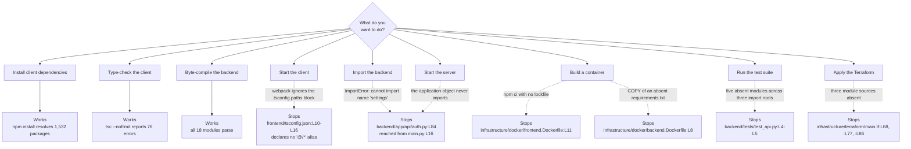

# Onboarding Guide

The `microsoft-word-u33ko0` repository does not run. Three commands succeed on a clean machine, and
every path past them stops at a line named below. Work through the setup, expect the failures this
guide predicts, then use the closing task list to choose what to repair first.

The [root README](../README.md) is the only other onboarding document here, and six of its statements
contradict the committed tree. Two of the six sit in the setup instructions, so a developer following
that file in order hits them before reaching any code. For setup, follow this guide instead. The
engagement that produced this file left the root README untouched, and
[decision-log.md](decision-log.md) records that boundary as conflict C1.

Onboarding documentation normally ends with a running application, and the committed code cannot
start one. The honest path appears here instead: the commands that work, the exact line where every
remaining path stops, and the change a future contributor would make. Nothing below is fixed, and no
entry describes a repair as done. [decision-log.md](decision-log.md) records the deviation as
conflict C3.

## How to read this guide

Every factual claim carries a locator in the form `path:Lnn`, and most locators name the symbol at
that line. Read the symbol name as the durable half of the citation. Line numbers move whenever
anyone edits a file above them, and symbol names do not.

Three conventions govern the locators:

- Locators point at the **committed state at the current branch head**, which includes the inline
  documentation added to 44 source files. A locator matches what you see when you open the file
  today.
- Line numbers are **physical**. No tracked file in this repository ends with a newline, so `wc -l`
  reports one line fewer than each file contains.
- A range such as `L111-L119` covers every line in the span, inclusive.

Six words carry one fixed meaning throughout this documentation set.

| Term | Meaning |
|------|---------|
| router | A FastAPI `APIRouter` instance |
| handler | A route function carrying a `@router` decorator |
| service | A domain service class under `backend/app/services/` |
| adapter | A persistence module under `backend/app/db/` |
| slice | A Redux Toolkit slice under `frontend/src/store/` |
| marker | A `HUMAN ASSISTANCE NEEDED` comment left by the code's authors |

The three documents under `documentation/` record declared intent rather than committed behaviour.
Anything drawn from them carries the label **declared intent** and a citation by heading name plus
line, because all three use unnumbered headings only. A numbered section citation anywhere in this
set refers to the generated Technical Specification, a separate document, and the text says so when
it does.

## What this application is

The repository implements a browser-based word processor. React and TypeScript build the client,
Python and FastAPI serve the application programming interface (API), and Google Cloud provides
persistence. The [root README](../README.md) states that framing accurately at `L4`.

Six capabilities carry implementing code today. Learn their names before reading any defect list,
because every gap in this guide lands against one of them.

- **Document lifecycle.** Create, read, update and delete, abbreviated CRUD, across five HTTP
  handlers and four service methods.
- **Ownership-based authorization.** A JSON Web Token (JWT) identifies the caller, and each handler
  compares that identity against the stored owner.
- **Rich-text editing.** Draft.js holds the editor state, and two helpers apply inline and block
  formatting.
- **Templates.** Five handlers and a card gallery on the client.
- **Export to PDF and DOCX.** Upload and signed-URL generation work. The conversion itself returns a
  placeholder string.
- **Real-time collaboration.** Designed and never connected. No route reaches the service, and the
  client and the server speak different protocols.

[architecture-overview.md](architecture-overview.md) maps the six top-level directories and the four
tiers they form. Read it next if you want the shape of the system before its setup.

## Prerequisites

Install the four tools below. Each version comes from a committed file, and each carries a conflict
worth knowing before you install anything.

| Tool | Version to install | Where it is declared | Conflict |
|------|--------------------|----------------------|----------|
| Python | 3.9 | `infrastructure/docker/backend.Dockerfile:L2` pins `python:3.9-slim` | Declared three ways and enforced nowhere. `../README.md:L23` asks for 3.8 or later, and `scripts/setup_dev_environment.sh:L10` installs unpinned `apt-get` packages. No `.python-version` and no dependency manifest exists |
| Node.js | 14 | `.github/workflows/ci.yml:L17` sets `node-version: '14'`, and `infrastructure/docker/frontend.Dockerfile:L2` pins `node:14-alpine` | Declared three ways and enforced nowhere. `../README.md:L22` asks for 14 or later. `frontend/package.json` declares no `engines` field, and no `.nvmrc` exists |
| PostgreSQL | 13 | `infrastructure/docker/docker-compose.yml:L31` pins `postgres:13` | The database and user Compose provisions disagree with the ones `scripts/setup_dev_environment.sh:L31-L32` creates. [../infrastructure/docker/README.md](../infrastructure/docker/README.md) owns this citation |
| Google Cloud SDK | any current release | `../README.md:L24` | None in the declaration. `backend/app/db/firestore.py:L42` constructs a Firestore client at import time, so Application Default Credentials, usually shortened to ADC, must already resolve before the module loads |

Both declared runtimes have passed end of life, often written EOL. Python 3.9 and Node 14 receive no
security patches, so a machine built to these declarations runs unsupported software. Verification
for this documentation set used Python 3.9 and Node 14 anyway, because they are the highest versions
the repository documents anywhere.

Choosing a newer runtime changes which failures you meet rather than removing them. Current Pydantic
breaks `backend/app/core/config.py:L48` on the first import, and
[the backend setup section](#setting-up-the-backend) records why.

PostgreSQL earns a lower priority than the table suggests. `backend/app/db/sql.py:L16-L19` builds an
engine, a session factory and a declarative base, and no module in the repository subclasses that
base, defines a model, or calls the session. The relational path stays dead while Firestore carries
every document write. See [data-model.md](data-model.md#persistence-overview) for the split.

Git completes the list, and the README's clone command cannot help you get the code.
`../README.md:L29` clones `https://github.com/your-organization/microsoft-word.git`, a placeholder
organisation. Clone from wherever this repository actually lives.

## Setting up the frontend

Install with `npm install` and never with `npm ci`. npm, the package manager that ships with Node.js,
installs strictly from a lockfile when you run `npm ci`, and the repository commits no lockfile.

```bash
cd frontend
npm install
```

The install succeeds and resolves 1,532 packages. Every `npm ci` invocation in the repository fails,
including both automated ones.

| Invocation | Locator | Why it fails |
|------------|---------|--------------|
| By hand inside `frontend/` | run directly | No `package-lock.json` is committed, and `npm ci` needs one |
| Continuous integration, shortened to CI | `.github/workflows/ci.yml:L19`, which sets no `working-directory` | The step runs at the repository root, where no `package.json` and no lockfile exist |
| The frontend image build | `infrastructure/docker/frontend.Dockerfile:L11`, after `:L8` copies `package*.json` | The glob matches `package.json` alone |

The CI job therefore stops at its install step, and `npm test` at `.github/workflows/ci.yml:L21` and
`npm run build` at `:L23` never run. The frontend image stops at the same command.

Type-check the client next. The check runs, which makes it the most useful command in the repository
for understanding the client's state.

```bash
cd frontend
npx tsc --noEmit
```

The command reports **76 errors** and emits nothing, because `frontend/tsconfig.json:L25` sets
`noEmit`. The distribution below is the fastest map of what the client needs.

| Code | Count | Meaning | Concentrated in |
|------|-------|---------|-----------------|
| `TS2307` | 57 | Cannot find module | 44 from the unmapped `@/` prefix, 13 from the five undeclared packages |
| `TS2305` | 6 | Module has no exported member | 5 from the absent `Document` type family, 1 from `Switch` at `frontend/src/App.tsx:L15` |
| `TS7006` | 5 | Parameter implicitly has an `any` type | Four sites in `frontend/src/services/api.ts`, one in `frontend/src/pages/Editor.tsx` |
| `TS2322` | 4 | Type not assignable | The four `Route` elements at `frontend/src/App.tsx:L52-L55`, which pass the router version 5 `component` prop |
| `TS2614` | 2 | No exported member, import form mismatch | `frontend/src/store/index.ts:L21` and `:L22` |
| `TS2552` | 1 | Cannot find name | `frontend/src/services/api.ts:L142`, an undefined `store` |
| `TS2339` | 1 | Property does not exist on type | `frontend/src/services/api.ts:L142`, reading `.auth` off the store state |

[../frontend/src/README.md](../frontend/src/README.md) owns this profile.

Five packages appear in import statements and in no dependency list, so `npm install` does not fetch
any of them. `frontend/package.json:L6-L14` declares exactly seven runtime dependencies:
`@reduxjs/toolkit`, `react`, `react-dom`, `react-redux`, `react-router-dom`, `tailwindcss` and
`typescript`.

| Undeclared package | Where the code imports it |
|--------------------|---------------------------|
| `draft-js` | Six modules, including `frontend/src/utils/formatting.ts:L13` and `frontend/src/components/DocumentCanvas.tsx:L21` |
| `zod` | All three modules under `frontend/src/schema/`, for example `frontend/src/schema/document.ts:L43` |
| `axios` | `frontend/src/services/api.ts:L78` and `frontend/src/services/auth.ts:L68` |
| `socket.io-client` | `frontend/src/services/collaboration.ts:L13` |
| `@types/draft-js` | No direct import. The six `draft-js` importers need it to typecheck |

Declaring the five falls outside this documentation engagement, so
`frontend/package.json` still omits them.
[troubleshooting.md](troubleshooting.md#five-npm-packages-the-code-imports-and-the-manifest-omits)
carries the entry. Installing them by hand gets you a shorter error list and no working build, for the
reason [the pitfalls section](#common-pitfalls) gives.

Two artifacts appear after the install. `npm install` writes `frontend/package-lock.json`, which the
repository does not track, and creates `frontend/node_modules/`. Leave both untracked.

Starting the development server fails. `npm start` runs `react-scripts start`, which resolves modules
through webpack rather than through the `tsconfig` `paths` block, so every `@/` specifier fails there
as well. No server serves the client.

## Setting up the backend

The backend has no dependency manifest. No `requirements.txt`, `pyproject.toml`, `setup.py`,
`setup.cfg`, `tox.ini`, `Pipfile` or `.python-version` exists anywhere in the repository. Two
committed instructions install from a file nobody added: `../README.md:L42` and
`scripts/setup_dev_environment.sh:L26` both run `pip install -r requirements.txt`. A third,
`infrastructure/docker/backend.Dockerfile:L8`, copies the same absent file into the image.

Build the environment by hand.

```bash
cd backend
python3.9 -m venv venv
source venv/bin/activate
```

Seventeen distributions from the Python Package Index (PyPI) make the backend importable and
runnable. Eleven of them sit behind an import statement. The other six appear in no import statement
at all, which is what makes a first-time build fail more than once.

Install these eleven first. Each row names the code that establishes it.

| Distribution | Version constraint | Code evidence |
|--------------|--------------------|---------------|
| `fastapi` | 0.89.0 or newer | Eight modules import it. Response models come from return annotations, and no handler passes `response_model=` |
| `starlette` | whatever `fastapi` resolves | `backend/app/services/collaboration_service.py:L36` imports `WebSocket` and `WebSocketDisconnect`, which FastAPI re-exports from Starlette |
| `pydantic` | 1.x only | `backend/app/core/config.py:L48` imports `BaseSettings` from the main package, and `backend/app/schema/user.py:L177` sets `orm_mode`. Pydantic 2 moved `BaseSettings` into `pydantic-settings` and renamed `orm_mode` |
| `SQLAlchemy` | 1.4 or newer | `backend/app/db/sql.py:L13` imports `declarative_base` from `sqlalchemy.orm`, where version 1.4 moved it |
| `python-jose` | any current release | `backend/app/api/auth.py:L81` and `backend/app/core/security.py:L41` import `jose`. The import name and the distribution name differ, so `pip install jose` fetches an unrelated package |
| `passlib` | any current release | `passlib.context` in the same two modules |
| `celery` | any current release | `backend/app/tasks/background_tasks.py:L90` |
| `google-cloud-firestore` | any current release | `backend/app/db/firestore.py:L36` and `backend/app/services/document_service.py:L59` |
| `google-cloud-storage` | any current release | `backend/app/services/export_service.py:L59` and `backend/app/tasks/background_tasks.py:L91` |
| `google-cloud-pubsub` | any current release | `backend/app/services/collaboration_service.py:L37` |
| `google-auth` | any current release | `backend/app/db/firestore.py:L37` imports `default` |

Now add the six that no import statement names. Each one surfaces only when a code path reaches it,
so a build that stops at the eleven above looks complete and is not.

| Distribution | Why the code needs it |
|--------------|-----------------------|
| `uvicorn` | Serves the application. `infrastructure/docker/backend.Dockerfile:L20` and `../README.md:L55` both run it, and no module imports it |
| `bcrypt` | `backend/app/api/auth.py:L89` and `backend/app/core/security.py:L47` build a `CryptContext` with the `bcrypt` scheme. `passlib` does not depend on `bcrypt`, so password hashing fails until you add it |
| `python-multipart` | `backend/app/api/auth.py:L171` accepts an `OAuth2PasswordRequestForm`, and FastAPI parses form bodies through `python-multipart` |
| `psycopg2-binary` | `backend/app/db/sql.py:L16` builds an engine from `settings.DATABASE_URL`, and `infrastructure/docker/docker-compose.yml:L24` supplies a `postgresql://` URL. SQLAlchemy needs a driver behind that scheme |
| `redis` | `backend/app/tasks/background_tasks.py:L98` hands Celery a broker URL read from `settings.REDIS_URL`. A `redis://` broker needs the `redis` client |
| `cryptography` | Required once `settings.ALGORITHM` names an RSA or ECDSA algorithm. `backend/app/core/config.py:L115` declares `ALGORITHM: str` with no allowed-value check, and `backend/app/core/security.py:L81` passes the value straight to `jwt.encode` |

[troubleshooting.md](troubleshooting.md#the-progressive-python-dependency-resolution-failure) names
the resulting pattern the progressive dependency-resolution failure, and records why reading import
statements alone cannot produce a working environment.

Configuration needs a `.env` file the repository does not commit.
`backend/app/core/config.py:L121-L124` points `Settings` at `.env`, and neither `.env` nor
`.env.example` exists. None of the nine fields at `backend/app/core/config.py:L111-L119` carries an
explicit default. Pydantic 1.x treats the two `Optional[str]` fields as defaulting to `None`, which
leaves seven values mandatory: `PROJECT_NAME`, `API_V1_STR`, `SECRET_KEY`,
`ACCESS_TOKEN_EXPIRE_MINUTES`, `ALGORITHM`, `DATABASE_URL` and `REDIS_URL`. Supply all seven or
`Settings()` raises a validation error naming every missing key at once.

Six further settings are read at runtime and declared nowhere, so each raises `AttributeError` at the
point of the read even on a fully supplied environment. Fifteen settings are in play: nine declared
and six read but never declared. [../backend/app/core/README.md](../backend/app/core/README.md) lists
all fifteen with their classification.

The setup script will not finish, so run the steps above by hand instead.
`scripts/setup_dev_environment.sh` stops or misfires at three points:

- `:L26` installs from the absent `requirements.txt`.
- `:L40` copies the absent `.env.example`.
- `:L47-L48` run `python manage.py makemigrations` and `python manage.py migrate`. Both are Django
  commands, and this is a FastAPI project. `:L55` prints a `manage.py runserver` instruction for the
  same reason.

See [../scripts/README.md](../scripts/README.md).

## What you can actually run today

Three commands succeed. Every other path stops.

| Command | Working directory | Result |
|---------|-------------------|--------|
| `npm install` | `frontend/` | Succeeds and resolves 1,532 packages |
| `npx tsc --noEmit` | `frontend/` | Runs and reports 76 errors. Emits nothing, per `frontend/tsconfig.json:L25` |
| `python -m compileall backend` | repository root | Succeeds. All 18 Python modules under `backend/` parse, so every file is syntactically valid |

Nothing else runs. No server starts, no test suite passes, neither container builds, and
`terraform init` does not complete. Byte-compilation proving the syntax valid says nothing about
whether a module imports, and [the next section](#where-a-run-stops-with-evidence) shows why the two
diverge sharply here.

The flowchart below branches on what you want to do and terminates each branch in the line that stops
it.



## Where a run stops, with evidence

Two stopping points block the application itself. Each one has a single root cause, and each cause
sits in one file.

### The backend cannot import

`import app.main` raises `ImportError: cannot import name 'settings' from 'app.core.config'`. The
chain has three links:

1. `backend/app/main.py:L16` imports `auth_router` from `app.api.auth`.
2. `backend/app/api/auth.py:L84` imports `settings` from `app.core.config`.
3. `backend/app/core/config.py` defines the `Settings` class at `L51` and the `get_settings()`
   factory at `L126`, and creates no module-level `settings` instance. No `settings =` assignment
   exists at any line in the file.

Eight modules import that absent name: `backend/app/main.py:L20`, `backend/app/api/auth.py:L84`,
`backend/app/db/firestore.py:L38`, `backend/app/db/sql.py:L14`,
`backend/app/services/collaboration_service.py:L39`,
`backend/app/services/document_service.py:L62`, `backend/app/services/export_service.py:L61` and
`backend/app/tasks/background_tasks.py:L92`. Nine module import failures trace to it, because
`app.api.documents` reaches the same name indirectly through the adapter at
`backend/app/db/firestore.py:L38`.

A census imported each of the 15 modules under `backend/app/` in a fresh interpreter, with
third-party packages present and Pydantic pinned to the 1.x line the code requires. **Only 3 of the
15 modules import successfully, and 12 fail.** The three that import are `app.core.config`,
`app.schema.document` and `app.schema.user`.
[../backend/app/README.md](../backend/app/README.md) owns the census.

A future contributor would add a module-level `settings` instance to `backend/app/core/config.py`.
One line clears nine of the twelve failures.

A second blocker waits behind the first. `backend/app/main.py:L16-L19` imports `auth_router`,
`documents_router`, `users_router` and `templates_router`, and all four router modules export the
bare name `router`. All four imports fail as soon as the `settings` failure clears, so the two
repairs belong in the same change.

One more note on starting the server, because the README sends you to the wrong target.
`../README.md:L54-L55` runs `cd backend` and then `uvicorn main:app --reload`. The application object
sits at `backend/app/main.py:L24`, one directory deeper, so from `backend/` the target reads
`app.main:app`.

### The client cannot typecheck

`tsc --noEmit` reports 76 errors, and 57 of them say the compiler cannot find a module. The root
cause is an import prefix that nothing maps. Forty-five import statements across `frontend/src/` use
a `@/` prefix, and `frontend/tsconfig.json:L10-L16` declares five aliases that do not include it:

```text
"paths": {
  "@components/*": ["components/*"],
  "@utils/*": ["utils/*"],
  "@styles/*": ["styles/*"],
  "@hooks/*": ["hooks/*"],
  "@services/*": ["services/*"]
}
```

The prefix accounts for 44 of the 57 module-resolution errors. The five undeclared packages account
for the other 13.

Adding `@/*` to that block still would not produce a working build. `react-scripts` 5.0.1, pinned at
`frontend/package.json:L29`, does not translate `tsconfig` path mappings into webpack module
resolution, so the bundler keeps failing on specifiers the compiler has accepted. A future
contributor would need both a `paths` entry and a resolver change, and
[troubleshooting.md](troubleshooting.md#the-unmapped-import-prefix) carries the entry.

### Everything else

The remaining defects live in [troubleshooting.md](troubleshooting.md), ordered twice over. A
symptom-first index runs in the order a developer meets each problem, and eight taxonomy sections run
from absent modules through platform defects. Open
[the symptom-first index](troubleshooting.md#symptom-first-index) when you hit an error this guide
did not predict. For the eleven separate reasons a deploy fails, read
[deployment-guide.md](deployment-guide.md#why-a-deploy-fails-as-committed).

## Common pitfalls

Four traps cost the most time, and no single file reveals any of them. Each one looks like a local
problem and has a cause somewhere else.

| Pitfall | What you see | Where the cause sits |
|---------|--------------|----------------------|
| The `@/` import prefix resolves nowhere | 44 of the 57 module-resolution errors, and a client that never bundles | `frontend/tsconfig.json:L10-L16` plus the `react-scripts` pin at `frontend/package.json:L29` |
| `npm ci` cannot run anywhere | The CI job and the frontend image both stop at their install step | `.github/workflows/ci.yml:L19` and `infrastructure/docker/frontend.Dockerfile:L11` |
| Six of the seventeen backend distributions appear in no import statement | The environment build fails again after each fix | [The backend setup tables](#setting-up-the-backend) |
| Tailwind CSS never compiles | An interface with no styling at all | No `tailwind.config.js`, no `postcss.config.js` and no committed stylesheet |

**The `@/` prefix.** Essentially every frontend module imports through it, and adding the alias to
`tsconfig` fixes only the compiler. `react-scripts` 5.0.1 resolves modules through webpack, which
reads no `paths` block, so the bundler keeps failing after the type errors disappear. Budget for two
changes rather than one.

**`npm ci`.** Use `npm install` locally. `npm ci` reads a lockfile and this repository commits none,
so both automated invocations fail before any test or build step runs. Any fix that adds a lockfile
also changes what the pipeline installs, which is why
[troubleshooting.md](troubleshooting.md#npm-ci-cannot-run-anywhere) records the two sites separately.

**The invisible six.** A developer who builds the Python environment by reading import statements
installs eleven distributions and stops. The remaining six surface one at a time, each as execution
reaches it:

- `uvicorn` when you try to serve the application.
- `bcrypt` when a password is hashed.
- `python-multipart` when a login form is posted.
- `psycopg2-binary` when the engine connects.
- `redis` when Celery attaches to its broker.
- `cryptography` when an asymmetric signing algorithm is configured.

Install all seventeen in one pass using [the tables above](#setting-up-the-backend).

**Tailwind.** Utility classes appear throughout the components, and nothing compiles them. No Tailwind
configuration, no PostCSS configuration and no stylesheet is committed anywhere, so the classes reach
the browser as unrecognised strings. Two styling conventions coexist besides, and neither renders.
Tailwind utility classes appear in `frontend/src/components/Header.tsx` and in the body of
`frontend/src/pages/Templates.tsx`, while eight other modules use bespoke semantic class names with no
backing stylesheet. See [troubleshooting.md](troubleshooting.md#tailwind-never-compiles) and
[../frontend/src/components/README.md](../frontend/src/components/README.md).

## How to extend the project

Follow the layering the code already uses. Six kinds of change have an established home, and the
table gives each one its destination and its trap.

| What you are adding | Where it goes | What to watch |
|---------------------|---------------|---------------|
| An HTTP endpoint | A router module under `backend/app/api/`, registered in `backend/app/main.py` | `backend/app/main.py:L125-L128` mounts every router with no prefix, so documents and templates already collide on identical paths. Give a new router a prefix or plan the collision |
| Domain logic | A service class under `backend/app/services/` | Every existing service method is declared `async` and calls the synchronous Firestore software development kit (SDK) inside, so the declaration promises concurrency the body does not deliver |
| A persistence call | An adapter function under `backend/app/db/` | No service consumes the four Firestore helpers in `backend/app/db/firestore.py`. Services construct their own client instead, so pick one path deliberately |
| A data contract | Both `backend/app/schema/` and `frontend/src/schema/` | Nothing generates either side from the other. See the trap below |
| Client state | A slice under `frontend/src/store/`, registered in `frontend/src/store/index.ts` | The store registers two reducer keys, and `frontend/src/services/api.ts:L142` reads a third that does not exist |
| A page or a component | `frontend/src/pages/` for a routed screen, `frontend/src/components/` for a reusable piece | Routed pages are declared in `frontend/src/App.tsx`. Several links already target routes the router never declares |

The contract trap deserves naming, because the repository already fell into it. No OpenAPI document
is committed, no client is generated, and no shared schema package spans Python and TypeScript. The
Pydantic definitions under `backend/app/schema/` and the Zod definitions under `frontend/src/schema/`
stay in agreement only while a human keeps them there. Adding a field on one side alone is exactly how
the existing divergences arose, and the ownership field now sits in four positions with none of them
canonical. Change both sides in the same commit, and read
[data-model.md](data-model.md#the-ownership-field-four-positions-none-canonical) before you pick a
field name.

[architecture-overview.md](architecture-overview.md#the-four-tiers) maps the tiers these directories
form, and each of the nineteen module READMEs opens with the responsibility of one directory.

## Suggested next tasks, ordered

Order matters here, and step 1 unblocks every step below it. No backend change can be exercised while
the package fails to import, and no client change can be verified while the type-checker drowns in
module-resolution noise. Work top to bottom.

1. **Make the backend package import.** Add a module-level `settings` instance to
   `backend/app/core/config.py`, then reconcile the four router names imported at
   `backend/app/main.py:L16-L19` against the bare `router` each module exports. The `settings` line
   alone clears nine of the twelve failing modules. The router names then block `main.py` on their own,
   so both repairs belong in one change. Until both land, `import app.main` raises before any other
   work can be tested. The remaining three failures need separate work: two absent modules and one
   undefined name, both covered in
   [troubleshooting.md](troubleshooting.md#the-verified-import-census).
2. **Make the client typecheck.** Export an inferred `Document` type from
   `frontend/src/schema/document.ts`, following the pattern its sibling already uses at
   `frontend/src/schema/user.ts:L56`, and add `useAppSelector` and `useAppDispatch` to
   `frontend/src/store/index.ts`. One absent type produces five of the six `TS2305` errors across
   three modules, and seven modules import the two absent hooks. Both edits are small and both remove
   whole error classes rather than single lines.
3. **Reconcile the field names.** The ownership field exists in four positions, and this
   documentation set names none of them canonical.
   [data-model.md](data-model.md#the-ownership-field-four-positions-none-canonical) lists all four
   with their locators. Do this work after steps 1 and 2, because a package that imports and a client
   that typechecks let you verify the change instead of guessing at it.
4. **Connect the collaboration and export paths.** No route constructs the collaboration service, and
   the export conversion returns a placeholder string.
   [integration-guide.md](integration-guide.md#integration-inventory) marks every external service
   reachable or scaffolded only. Both paths need a route and a caller before either can be tested, so
   they come last.

The code's authors left a backlog of their own. Thirty-three `HUMAN ASSISTANCE NEEDED` markers and
sixteen `TODO` comments sit across the repository, and each one names a gap its author already knew
about. Read the set as a prioritised list written by the people closest to the code.
[troubleshooting.md](troubleshooting.md#the-complete-marker-and-todo-register) carries the complete
register with a locator for every entry.

A second pair of figures appears elsewhere in this documentation set, and the two pairs count
different things. Twenty-seven markers and fifteen `TODO` comments count the subset living inside the
44 files that received inline documentation, and those two numbers measure a preservation obligation.
Use 33 and 16 when you are counting work to do.

## Related documentation

Start at [docs/README.md](README.md), which indexes every document in this set.

Repository-level documents beside this one:

- [architecture-overview.md](architecture-overview.md), the six-area map and the four tiers
- [troubleshooting.md](troubleshooting.md), every defect in the repository as a numbered register
- [deployment-guide.md](deployment-guide.md), what the infrastructure assets do and why a deploy fails
- [data-model.md](data-model.md), the Pydantic and Zod contracts and every field divergence
- [integration-guide.md](integration-guide.md), each external service marked reachable or scaffolded
- [decision-log.md](decision-log.md), every judgement this engagement made, including conflicts C1
  and C3

Module documentation for the facts this guide draws on:

- [../backend/app/README.md](../backend/app/README.md), the composition root and the import census
- [../backend/app/core/README.md](../backend/app/core/README.md), all fifteen settings with their
  classification
- [../frontend/src/README.md](../frontend/src/README.md), the bootstrap path and the type-check
  profile
- [../frontend/src/components/README.md](../frontend/src/components/README.md), the eight components
  and the two styling conventions
- [../infrastructure/docker/README.md](../infrastructure/docker/README.md), the two Dockerfiles and
  the Compose topology
- [../scripts/README.md](../scripts/README.md), the deploy and setup scripts and their blockers
- [../backend/tests/README.md](../backend/tests/README.md), why the test suite cannot run

Reference material, read and never edited:

- [../README.md](../README.md), the root README. Prerequisites at `L22-L23` are accurate. The
  instructions at `L42` and `L55` name a file and a path the tree does not carry.
- [Technical Specifications](<../documentation/Technical Specifications.md>), declared intent. The
  five level-one headings sit at `L3` INTRODUCTION, `L125` SYSTEM ARCHITECTURE, `L300` SYSTEM DESIGN,
  `L523` TECHNOLOGY STACK and `L620` SECURITY CONSIDERATIONS, and the file carries no numbered section
  anchor.
- [Software Requirements Specifications](<../documentation/Software Requirements Specifications (SRS).md>),
  declared intent. The 30-second auto-save requirement sits under the SAFETY heading at `L540`, at
  `L543`, and the editor implements a five-second debounce at `frontend/src/pages/Editor.tsx:L214`.
