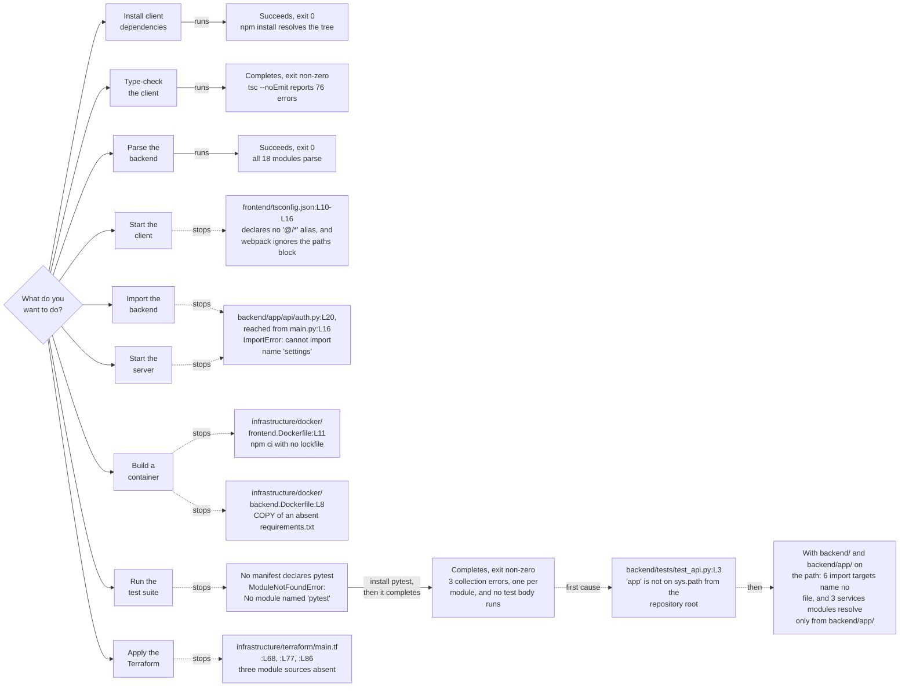

# Onboarding Guide

The `microsoft-word-u33ko0` repository does not run. Four commands complete on a clean machine: two
succeed and two run to completion and report failure by design.
[What you can actually run today](#what-you-can-actually-run-today) lists all four, and every path
past them stops at a line named below. Work through the setup, expect the failures this guide
predicts, then use the closing task list to choose what to repair first.

The [root README](../README.md) is the only other onboarding document here, and six of its statements
contradict the committed tree, one of them only in part. Three sit in the README's installation and run
steps, at `L29`, `L42` and `L55`, so a developer following that file in order hits all three before
reaching any code. For setup, follow this guide instead. The
engagement that produced this file left the root README untouched, and
[decision-log.md](decision-log.md) records that boundary as conflict C1.

Onboarding documentation normally ends with a running application, and the committed code cannot
start one. The honest path appears here instead: the commands that work, the exact line where every
remaining path stops, and the change a future contributor would make. Nothing below is fixed, and no
entry describes a repair as done. [decision-log.md](decision-log.md) records that
deviation as conflict C3.

## How to read this guide

Every factual claim carries a locator in the form `path:Lnn`, and most locators name the symbol at
that line. Read the symbol name as the durable half of the citation. Line numbers move whenever
anyone edits a file above them, and symbol names do not.

Three conventions govern the locators:

- Locators point at the **committed state at the current branch head**, which includes the inline
  documentation added to 44 source files. A locator matches what you see when you open the file
  today.
- Line numbers are **physical**. No original source or configuration file in this repository ends
  with a newline, so `wc -l` reports one line fewer than each of those files contains. The Markdown
  this documentation engagement added does end with a newline, so no README and no file under `docs/`
  carries that discrepancy.
- A range such as `L111-L119` covers every line in the span, inclusive.

Six words carry one fixed meaning throughout this documentation set.

| Term | Meaning |
| ------ | --------- |
| router | A FastAPI `APIRouter` instance |
| handler | A route function carrying a `@router` decorator |
| service | A domain service class under `backend/app/services/` |
| adapter | A persistence module under `backend/app/db/` |
| slice | A Redux Toolkit slice under `frontend/src/store/` |
| marker | A `HUMAN ASSISTANCE NEEDED` comment left by the code's authors |

The three documents under `documentation/` record declared intent rather than committed behaviour.
Anything drawn from them carries the label **declared intent** and a citation by heading name plus
line, because all three use unnumbered headings only. A numbered section citation anywhere in this
set refers to the generated Technical Specification, a separate document, and the text says so when
it does.

## What this application is

The repository implements a browser-based word processor. React and TypeScript build the client,
Python and FastAPI serve the application programming interface (API), and Google Cloud provides
persistence. The [root README](../README.md) states that framing accurately at `L4`.

Six capabilities carry implementing code today. Learn their names before reading any defect list,
because every gap in this guide lands against one of them.

- **Document lifecycle.** Create, read, update and delete, abbreviated CRUD, across five HTTP
  handlers and four service methods.
- **Ownership-based authorization.** Of the fourteen handlers, twelve declare bearer authentication
  and two are public. Declaring that dependency is not the same as enforcing an owner check, and no
  object check is enforced anywhere today, with every locator in
  [troubleshooting.md](troubleshooting.md#g91-the-backend-http-surface). Three handlers attempt an
  owner comparison, and current call defects stop all three before it. Two are self-scoped to the
  token's own subject at `backend/app/api/users.py:L20` and `:L33`, one is document create, which
  stores nothing, and the remaining six call something no file defines.
- **Rich-text editing.** Draft.js holds the editor state, and two helpers apply inline and block
  formatting.
- **Templates.** Five handlers and a card gallery on the client.
- **Export to PDF and DOCX.** The upload and version 4 signing sequence is complete in form and
  reaches no bucket. Four independent barriers stop it, and the conversion itself returns a
  placeholder string. [integration-guide.md](integration-guide.md#integration-inventory) lists all
  four.
- **Real-time collaboration.** Designed and never connected. No route reaches the service, and the
  client and the server speak different protocols.

[architecture-overview.md](architecture-overview.md) maps the six top-level directories and the four
tiers they form. Read it next if you want the shape of the system before its setup.

## Prerequisites

**Every command in this guide is written for a POSIX shell on Linux or macOS.** That scope follows
the repository rather than a preference. `scripts/setup_dev_environment.sh:L10` installs packages
through `apt-get`, which ties the only committed setup script to Debian or Ubuntu, and both images
build on Linux bases at `infrastructure/docker/backend.Dockerfile:L2` and
`infrastructure/docker/frontend.Dockerfile:L2`.

No committed file targets Windows. On Windows, run everything inside Windows Subsystem for Linux
(WSL) to use the commands unchanged, or substitute the two PowerShell equivalents named in [the
backend setup section](#setting-up-the-backend). The frontend commands need no substitution, because
`npm` and `npx` take the same form on every platform.

Three of the four tools below carry a declared version, and each of those versions comes from a
committed file. The fourth, the Google Cloud SDK, is named with no version at all. Each row also
carries a conflict worth knowing before you install anything. Two more tools are needed and declared
nowhere: Git, to obtain the code, and `zip`, which `scripts/deploy.sh:L19` calls and
`scripts/setup_dev_environment.sh:L10` never installs. The command block below installs all six.

| Tool | Version to install | Where it is declared | Conflict |
| ------ | -------------------- | ---------------------- | ---------- |
| Python | 3.9 | `infrastructure/docker/backend.Dockerfile:L2` pins `python:3.9-slim` | Declared three ways and enforced nowhere. `../README.md:L23` asks for 3.8 or later, and `scripts/setup_dev_environment.sh:L10` installs unpinned `apt-get` packages. No `.python-version` and no dependency manifest exists. 3.9 is also below the floor the current `google-cloud-firestore` release sets, covered below the table |
| Node.js | 14 | `.github/workflows/ci.yml:L17` sets `node-version: '14'`, and `infrastructure/docker/frontend.Dockerfile:L2` pins `node:14-alpine` | Declared three ways and enforced nowhere. `../README.md:L22` asks for 14 or later. `frontend/package.json` declares no `engines` field, and no `.nvmrc` exists |
| PostgreSQL | 13 | `infrastructure/docker/docker-compose.yml:L31` pins `postgres:13` | The database and user Compose provisions disagree with the ones `scripts/setup_dev_environment.sh:L31-L32` creates. [../infrastructure/docker/README.md](../infrastructure/docker/README.md) owns this citation |
| Google Cloud SDK | Latest release from Google's own installer | `../README.md:L24` names the SDK and no version | The declaration pins nothing, and no pin is needed. The SDK is a host tool that ships its own bundled Python, so it takes no part in the resolution below. `backend/app/db/firestore.py:L20` constructs a Firestore client at import time, so Application Default Credentials, usually shortened to ADC, must already resolve before the module loads |

**All three declared runtimes have passed end of life, often written EOL.** Python 3.9 ended support
on 31 October 2025, with 3.9.25 as its final security release ([Python release
cycle](https://devguide.python.org/versions/)). Node 14 ended support on 30 April 2023 ([Node.js
previous releases](https://nodejs.org/en/about/previous-releases)). PostgreSQL 13 ended support on
13 November 2025, with 13.23 as its final release ([versioning
policy](https://www.postgresql.org/support/versioning/)).

None of the three receives security patches as of 6 August 2026, so a machine built to these
declarations runs unsupported software at every layer. Verification for this documentation set used
Python 3.9 and Node 14 anyway, because they are the highest versions the repository documents
anywhere.

That end-of-life status changes how you install two of the four tools. A current distribution's own
repositories no longer carry Python 3.9 or Node 14, so install each through its version manager and
the rest through the package manager. Install the two version managers first, because a clean machine
carries neither.

Three platforms are covered below, and each gets one exact sequence. Debian and Ubuntu come first,
macOS with Homebrew follows, and Windows runs the Debian sequence unchanged inside WSL. No other
platform is covered here, and no step below asks you to choose a value.

The commands below are the full prerequisite set for a Debian or Ubuntu machine, in order:

```bash
# 1. Packages the distribution still carries. zip is needed by scripts/deploy.sh:L19,
# and the committed setup script never installs it. The libraries after it are pyenv's
# suggested build environment; without them a 3.9 build either fails outright or
# produces an interpreter missing ssl, sqlite3 or lzma.
# https://github.com/pyenv/pyenv/wiki#suggested-build-environment
sudo apt-get update
sudo apt-get install -y git curl wget zip make build-essential llvm xz-utils tk-dev \
  libssl-dev zlib1g-dev libbz2-dev libreadline-dev libsqlite3-dev libncurses5-dev \
  libxml2-dev libxmlsec1-dev libffi-dev liblzma-dev postgresql

# 2. nvm, the Node Version Manager. Clone it, then check out a release tag rather
# than tracking the default branch. https://github.com/nvm-sh/nvm
git clone https://github.com/nvm-sh/nvm.git "$HOME/.nvm"
git -C "$HOME/.nvm" checkout v0.40.6     # nvm v0.40.6, released 15 July 2026
. "$HOME/.nvm/nvm.sh"                    # add this line to your shell profile

# 3. Node 14, the version this repository declares.
nvm install 14
nvm use 14

# 4. Clone pyenv and pin the release shown below.
# https://github.com/pyenv/pyenv
git clone https://github.com/pyenv/pyenv.git "$HOME/.pyenv"
git -C "$HOME/.pyenv" checkout v2.8.3    # pyenv v2.8.3, released 5 August 2026
export PYENV_ROOT="$HOME/.pyenv"         # add these three lines to your
export PATH="$PYENV_ROOT/bin:$PATH"      # shell profile as well
eval "$(pyenv init -)"

# 5. Python 3.9. pyenv resolves "3.9" to the latest 3.9 patch and builds from source.
pyenv install 3.9
pyenv local 3.9

# 6. Google Cloud SDK, which supplies the gcloud and gsutil commands that
# scripts/deploy.sh calls. Google's own guidance is to save the installer rather than
# pipe it into a shell, so that you can read what you are about to run.
# https://docs.cloud.google.com/sdk/docs/downloads-interactive
curl -o install_google_cloud_sdk.bash https://sdk.cloud.google.com
less install_google_cloud_sdk.bash       # read it first
bash install_google_cloud_sdk.bash --disable-prompts
```

Both version-manager tags above are real releases, checked against each project's own releases API on
8 August 2026. A later tag works as well, and the two named here let the block run as written. For a
build machine, prefer the fully pinned Cloud SDK route instead of step 6: a versioned archive with a
published checksum, listed under
[versioned archives](https://docs.cloud.google.com/sdk/docs/downloads-versioned-archives).

Step 1 installs whatever PostgreSQL major version the distribution carries, which is not 13, and no
command in this guide connects to it. The paragraph on PostgreSQL priority further down this section
explains why the version does not matter here.

macOS runs a different sequence rather than a substitution, because two steps behave differently:

```bash
# 1. Packages Homebrew carries. PostgreSQL setup appears after this block.
brew install git curl zip

# 2. Install Homebrew's nvm formula; Homebrew notes that upstream does not
# support this method.
brew install nvm
mkdir -p "$HOME/.nvm"
export NVM_DIR="$HOME/.nvm"                    # add these two lines to
. "$(brew --prefix)/opt/nvm/nvm.sh"            # ~/.zshrc

# 3. Node 14. On Apple Silicon, read the note below before running this.
nvm install 14
nvm use 14

# 4. pyenv. Homebrew puts the binary on PATH, so only the init line is needed.
brew install pyenv
eval "$(pyenv init -)"                         # add this line to ~/.zshrc
pyenv install 3.9
pyenv local 3.9

# 5. Google Cloud SDK.
brew install --cask google-cloud-sdk
```

Two macOS facts sit behind that sequence. Homebrew disabled `postgresql@13` on 1 March 2026, marking
it unsupported, so `brew install postgresql@13` now fails outright. Two honest options remain:
`docker compose up db` uses the committed `postgres:13` image at
`../infrastructure/docker/docker-compose.yml:L31`, and `brew install postgresql@17` gives a supported
server four major versions ahead of the declaration.

Node 14 is the second fact. The Node.js release index lists only `osx-x64` builds for every 14.x
release, including the final 14.21.3, and the first macOS `arm64` build is 16.0.0. On Apple Silicon,
`nvm install 14` therefore has no binary to fetch and falls back to a source build. Running the whole
sequence under Rosetta with `arch -x86_64 zsh` is the shorter route.

Using a version manager for the two runtimes on either platform keeps an unsupported interpreter out
of the system path.

Every Python version below is pinned, and so are the two version-manager tags above. The repository
commits no manifest, so this documentation set resolved one mutually compatible set for Python 3.9
and records it here. Adding that set to a committed manifest fell outside this engagement, so the
pins live in this document only. Decision row 24 in
[decision-log.md](decision-log.md#the-decision-table) records the alternatives and the risk that
pinning in prose carries.

Choosing a newer runtime changes which failures you meet rather than removing them. Current Pydantic
breaks `backend/app/core/config.py:L17` on the first import, and
[the backend setup section](#setting-up-the-backend) records why.

Python 3.9 also conflicts with a package the backend imports. Google's Python client libraries
support only the interpreter versions in active or maintenance support, and the current
`google-cloud-firestore` release requires Python 3.10 or newer. A 3.9 interpreter therefore resolves
`pip install google-cloud-firestore` to an older release rather than failing outright, so the
environment pins an unmaintained client without saying so.
`backend/app/db/firestore.py:L14` and `backend/app/services/document_service.py:L14` both import from
it. [../backend/app/README.md](../backend/app/README.md) states the boundary as a release whose
`Requires-Python` accepts the interpreter in use, for exactly this reason.

PostgreSQL earns a lower priority than the table suggests. `backend/app/db/sql.py:L16-L19` builds an
engine, a session factory and a declarative base, and no module in the repository subclasses that
base, defines a model, or calls the session. The relational path stays dead while Firestore carries
every document write. See [data-model.md](data-model.md#persistence-overview) for the split.

Git is installed above, and no clone step is needed to follow this guide. You are reading a file
inside the repository, so the checkout already exists. Every command below runs from the repository
root, the directory holding `frontend/`, `backend/` and this `docs/` directory.

The README's clone command cannot get you a second copy. `../README.md:L29` clones
`https://github.com/your-organization/microsoft-word.git`, a placeholder organisation that does not
resolve. Run `git remote -v` in this checkout to read the remote that does.

## Before you install anything

**No reproducible supported install exists in this repository.** Neither side of the application
pins its dependencies. The frontend commits no lock file, and the backend commits no dependency
manifest and no lock file, so no package set here is pinned, reviewed, or reproducible. Two
developers following the steps below on different days will resolve different package versions, and
neither result has been reviewed for compatibility or for known vulnerabilities.

Treat every install command in this guide as an **isolated diagnostic in a throwaway environment**
rather than as a setup step. The commands are worth running, because they are how the type-check
profile and the import census in this documentation set were measured. They do not produce an
environment to build on.

Three consequences follow, and each one shapes how the next two sections should be read.

- **An unpinned install resolves whatever is current.** Where a table below says a version
  constraint is unestablished, read that as a gap in the repository rather than as a recommendation
  to accept any release. Published advisories affect several of the packages this code imports, and
  [the dated register](troubleshooting.md#the-dated-dependency-and-advisory-register) is the one
  place that lists them with their fix versions and their runtime constraints.

- Two facts from that register matter before you install anything. A patched `python-jose` installs
  on Python 3.9, so the algorithm confusion and JWE decode advisories fixed in 3.4.0 are avoidable
  by choosing a version. A fully patched `python-multipart` does not, because every release carrying
  the seven later fixes requires Python 3.10 or newer.
- **A newer runtime is not automatically safer.** Current releases of FastAPI and of the Google Cloud
  client libraries have moved their supported Python range past 3.9. Meanwhile
  `backend/app/core/config.py:L17` requires Pydantic 1.x. The repository therefore pins no runtime and
  no library set that is simultaneously supported and compatible, and no combination in this guide has
  been verified as both.
- **Nothing here should be used to build a deployable image.** The dependency defects are one class
  among nine in [troubleshooting.md](troubleshooting.md#the-defect-classes), and installing packages
  resolves that class alone.

**Required future work.** A reviewed dependency manifest and a committed lock file on both sides.
Both need a tested compatibility and security matrix behind them, covering the runtime, the framework
and the cryptography packages. That work falls outside this documentation engagement, which adds no
manifest and changes no dependency. Until it lands, no statement in this guide should be read as a
supported configuration.

## Setting up the frontend

`npm ci` cannot run here. npm, the package manager that ships with Node.js, installs strictly from a
lock file when you run `npm ci`, and the repository commits none. `npm install` is the only command
that resolves the declared dependencies, and it resolves them unpinned, so the caveats in
[the section above](#before-you-install-anything) apply to everything below.

```bash
cd frontend
npm install
```

The install succeeds. One observed run resolved 1,532 packages, and that figure follows the registry
rather than this repository, so read it as a sighting rather than a constant. Every `npm ci`
invocation in the repository fails, including both automated ones.

| Invocation | Locator | Why it fails |
| ------------ | --------- | -------------- |
| By hand inside `frontend/` | run directly | No `package-lock.json` is committed, and `npm ci` needs one |
| Continuous integration, shortened to CI | `.github/workflows/ci.yml:L19`, which sets no `working-directory` | The step runs at the repository root, where no `package.json` and no lockfile exist |
| The frontend image build | `infrastructure/docker/frontend.Dockerfile:L11`, after `:L8` copies `package*.json` | The glob matches `package.json` alone |

The CI job therefore stops at its install step, and `npm test` at `.github/workflows/ci.yml:L21` and
`npm run build` at `:L23` never run. The frontend image stops at the same command.

Type-check the client next. The check runs, which makes it the most useful command in the repository
for understanding the client's state.

```bash
cd frontend
npx tsc --noEmit
```

The command reports **76 errors** and emits nothing, because `frontend/tsconfig.json:L25` sets
`noEmit`. The distribution below is the fastest map of what the client needs.

| Code | Count | Meaning | Concentrated in |
| ------ | ------- | --------- | ----------------- |
| `TS2307` | 57 | Cannot find module | 44 from the unmapped `@/` prefix, 13 from the five undeclared packages |
| `TS2305` | 6 | Module has no exported member | 5 from the absent `Document` type family, 1 from `Switch` at `frontend/src/App.tsx:L12` |
| `TS7006` | 5 | Parameter implicitly has an `any` type | Four sites in `frontend/src/services/api.ts`, one in `frontend/src/pages/Editor.tsx` |
| `TS2322` | 4 | Type not assignable | The four `Route` elements at `frontend/src/App.tsx:L41-L44`, which pass the router version 5 `component` prop |
| `TS2614` | 2 | No exported member, import form mismatch | `frontend/src/store/index.ts:L15` and `:L16` |
| `TS2552` | 1 | Cannot find name | `frontend/src/services/api.ts:L40`, an undefined `store` |
| `TS2339` | 1 | Property does not exist on type | `frontend/src/services/api.ts:L40`, reading `.auth` off the store state |

[../frontend/src/README.md](../frontend/src/README.md) owns this profile.

Five packages are required and none is declared, so `npm install` fetches none of them.
`frontend/package.json:L6-L14` declares exactly seven runtime dependencies: `@reduxjs/toolkit`,
`react`, `react-dom`, `react-redux`, `react-router-dom`, `tailwindcss` and `typescript`.

Four of the five are **imported runtime packages**, each named in an `import` statement and therefore
findable by grep and reported by the type-checker.

| Undeclared package | Where the code imports it |
| -------------------- | --------------------------- |
| `draft-js` | Six modules, including `frontend/src/utils/formatting.ts:L14` and `frontend/src/components/DocumentCanvas.tsx:L15` |
| `zod` | Four modules: the three under `frontend/src/schema/`, for example `frontend/src/schema/document.ts:L13`, plus `frontend/src/utils/validation.ts:L13` |
| `axios` | `frontend/src/services/api.ts:L17` and `frontend/src/services/auth.ts:L16` |
| `socket.io-client` | `frontend/src/services/collaboration.ts:L15` |

The fifth is a **required type package with no direct import**. `@types/draft-js` appears in zero
import statements anywhere in `frontend/src/`, and the six `draft-js` importers need it to typecheck
because `draft-js` ships no bundled type declarations. Deriving the dependency set by grepping import
statements therefore finds four packages and misses this one, and the omission surfaces only after the
other four resolve.

Declaring the five falls outside this documentation engagement, so `frontend/package.json` still omits
them. [troubleshooting.md](troubleshooting.md#five-npm-packages-the-manifest-omits) carries the entry
with the same split. Installing them by hand gets you a shorter error list and no working build, for
the reason [the pitfalls section](#common-pitfalls) gives.

Two artifacts appear after the install. `npm install` writes `frontend/package-lock.json` and creates
`frontend/node_modules/`, and the repository tracks neither.

The absent lock file is the defect here, not a preference. A lock file records the exact resolved
version and an integrity hash for every package in the tree, which is what makes an install
reproducible and auditable. Committing a reviewed one is the fix, and it is required future work
rather than something this documentation engagement performs, because adding a dependency artifact
falls outside a documentation change.

Two points follow for the file you just generated. The lock file a single unreviewed `npm install`
produces is a record of one machine on one day, so it is not a substitute for the reviewed artifact
the repository needs. Discarding it silently is not the answer either, and this guide does not ask
you to.

If you generated it while following these steps, take one of two deliberate routes. Carry it into
the review that adds a manifest, or remove it and record why. `frontend/node_modules/` is build
output and belongs in an ignore rule, and no `.gitignore` is tracked anywhere in this repository,
which [troubleshooting.md](troubleshooting.md#g95-secrets-state-and-data-retention) records as entry
33.

**An unlocked install is neither reproducible nor auditable.** That is a risk rather than an
inconvenience. `npm install` resolves every declared range and every transitive range to whatever
the registry serves at that moment. Two installs of this one commit can therefore differ across
hundreds of packages, and nothing records which resolution either build used.

No integrity hash is stored for a build either. A published advisory cannot be matched against what
a given machine installed, and a compromised release inside a transitive range enters the tree
unremarked.

The generated `frontend/package-lock.json` pins your own machine only, because the repository does
not track it. `frontend/package.json` declares its seven runtime dependencies as ranges rather than
exact versions. Committing a lockfile changes what the pipeline installs, which makes it a
repository change rather than a documentation change, so this pass leaves the manifest as it found
it. [troubleshooting.md](troubleshooting.md#npm-ci-cannot-run-anywhere) carries the entry.

Starting the development server fails. `npm start` runs `react-scripts start`, which resolves modules
through webpack rather than through the `tsconfig` `paths` block, so every `@/` specifier fails there
as well. No server serves the client.

## Setting up the backend

The backend has no dependency manifest. No `requirements.txt`, `pyproject.toml`, `setup.py`,
`setup.cfg`, `tox.ini`, `Pipfile` or `.python-version` exists anywhere in the repository. Two
committed instructions install from a file nobody added: `../README.md:L42` and
`scripts/setup_dev_environment.sh:L26` both run `pip install -r requirements.txt`. A third,
`infrastructure/docker/backend.Dockerfile:L8`, copies the same absent file into the image.

Build a throwaway environment by hand. Use a virtual environment so nothing here touches a system
interpreter, and discard it afterwards.

```bash
cd backend
python3.9 -m venv venv
source venv/bin/activate          # bash, zsh, or any POSIX shell
```

```text
cd backend
py -3.9 -m venv venv
.\venv\Scripts\Activate.ps1       # Windows PowerShell
```

Those are the two commands with a Windows PowerShell equivalent. Outside WSL they read
`py -3.9 -m venv venv` and `venv\Scripts\Activate.ps1`, and every command after them is identical on
all three platforms.

**One authoritative Python dependency inventory exists, and it is not in this file.**
[../backend/app/README.md](../backend/app/README.md) carries it, and it defines the model every
count in this documentation set uses. Seventeen distributions from the Python Package Index (PyPI)
are required: ten named by an `import` statement under `backend/app/`, and seven runtime companions
that no import names.

Thirteen of the seventeen have to be named to a package manager, because `starlette`, `ecdsa`, `rsa`
and `pyasn1` arrive transitively. The seven companions are why an environment built by trial fails
once per missing distribution rather than once in total. No import statement names them, so nothing
reveals them until something breaks at run time.

Each row there gives the version boundary the code establishes and the code fact that establishes
it. Every other document in this set, this one included, defers to that table rather than restating
a list, so there is one list to keep correct. Install from it.

Three categories carry the weight there, and knowing them tells you when each package fails. A
**directly imported** distribution is named by an `import` statement under `backend/app/`, so a grep
finds it and a resolver reports it by name. A **runtime companion** is needed by the running system
while no import names it, which covers `uvicorn`, `starlette`, `python-multipart`, `bcrypt`,
`ecdsa`, `rsa` and `pyasn1`.

Four of those seven arrive transitively, and `uvicorn`, `bcrypt` and `python-multipart` do not, so
those three must be named explicitly. `bcrypt` and `python-multipart` block a route rather than a
build, and each surfaces at the first login rather than at install. A **configuration-selected**
distribution is chosen by a configuration value rather than by code, and the four of those sit
outside the seventeen, in the table below.

Reading import statements alone therefore builds an incomplete environment. Ten names are visible
that way and seven are not. Three of those seven still have to be installed by name. The build
therefore stops once per missing distribution rather than once in total.
[troubleshooting.md](troubleshooting.md#the-progressive-python-dependency-resolution-failure) names
that pattern the progressive dependency-resolution failure and records why import statements cannot
produce a working environment on their own.

`starlette` needs no line in an install command.
`backend/app/services/collaboration_service.py:L15` imports `WebSocket` and `WebSocketDisconnect`
through FastAPI, which re-exports both from Starlette, so the installer resolves it from `fastapi`.
The inventory still lists it, as one of the seven runtime companions, and marks it among the four
that arrive transitively.

Four further distributions are chosen by a configuration value rather than by an import or by a
committed command. The inventory therefore does not count them, and a running environment still needs
them. No code fact fixes the first three choices, because the value that selects each one is absent
from the repository. The fourth differs: `Config.env_file` at `backend/app/core/config.py:L60` is
committed, so that selection is already fixed, and only the file it names is missing.

| Distribution | The value that selects it | When it is needed |
| --- | --- | --- |
| A PostgreSQL driver, for example `psycopg2-binary` | The `postgresql://` scheme in `settings.DATABASE_URL`, supplied by `infrastructure/docker/docker-compose.yml:L24` and declared at `backend/app/core/config.py:L47` | `backend/app/db/sql.py:L16` builds an engine at import time, and SQLAlchemy resolves a driver from the scheme in the URL |
| A Redis client | The `redis://` scheme in `settings.REDIS_URL`, declared at `backend/app/core/config.py:L48` | `backend/app/tasks/background_tasks.py:L22` hands Celery that broker URL, and a worker needs the client to attach. [../backend/app/tasks/README.md](../backend/app/tasks/README.md) records that no dependency manifest declares it |
| `cryptography` | An RSA or ECDSA name in `settings.ALGORITHM`, declared as a bare `str` at `backend/app/core/config.py:L44` with no allowed-value check | `backend/app/core/security.py:L56` passes the value straight to `jwt.encode`. A symmetric algorithm such as HS256 needs nothing extra |
| `python-dotenv` | `Config.env_file` at `backend/app/core/config.py:L60`, the one selecting value the repository does commit | Pydantic 1.x reads an `env_file` through `python-dotenv` and requires it as a separate install, either directly or as the `pydantic[dotenv]` extra ([Pydantic 1.10 settings documentation](https://docs.pydantic.dev/1.10/usage/settings/)). That read runs only when the named file is found, so the absent `.env` hides the absent distribution |

**Installing every one of them still leaves the backend unable to import.** Dependencies are
third-party, and all four blockers here are first-party. Those four are the absent `settings`
instance, the four router names `backend/app/main.py:L16-L19` imports against the bare `router` each
module exports, two absent modules, and one undefined name. A complete environment moves the first
error a run reports from `ModuleNotFoundError` to the `ImportError` that
[the next section](#where-a-run-stops-with-evidence) traces. Nothing else moves, and no package
install makes this application start.

One command covers the whole set, and it names seventeen packages. Those are the thirteen of the
seventeen required by the import graph that have to be named, plus the four the table above selects
by configuration. The four transitive arrivals come with them.

Two constraints bind that command, and the second one has no satisfying answer on this runtime. The
`pydantic` upper bound is the compatibility constraint, for the reason the table above gives, and
`>=1.10.13` also clears both Pydantic advisories. `python-multipart` is the other.

Pip resolves the newest release your interpreter accepts, which on Python 3.9 is 0.0.20, and seven of
the nine advisories against that distribution are fixed only from 0.0.22 onward. Every one of those
releases requires Python 3.10 or newer, so no `python-multipart` pin closes them while you stay on
3.9. The [dated register](troubleshooting.md#the-dated-dependency-and-advisory-register) carries the
version-by-version evidence.

A third constraint binds two of the names together. `passlib` and `bcrypt` are a pair, and the
current release of each cannot work with the other, so both carry a pin below.

```bash
pip install \
  "fastapi>=0.89.0" "pydantic>=1.10,<2" "SQLAlchemy>=1.4" \
  python-jose "passlib==1.7.4" "bcrypt==4.3.0" python-multipart python-dotenv \
  celery redis psycopg2-binary cryptography uvicorn \
  google-cloud-firestore google-cloud-storage google-cloud-pubsub google-auth
```

The two pins are the reason to read this paragraph before running the command. Leaving both names
unpinned resolves passlib 1.7.4, its last release, beside bcrypt 5.0.0. That pair raises
`ValueError: password cannot be longer than 72 bytes` on **every** hash and every verify, including a
five-byte password.

Three facts explain it. Passlib initialises its bcrypt backend by hashing a 255-byte probe secret,
bcrypt 5.0.0 rejects any input over 72 bytes, and the probe's error escapes to the caller. The
message names a limit the submitted password never reaches, so it misdescribes its own cause. bcrypt
4.3.0 is a release passlib can drive, verified directly against the committed `CryptContext`
construction, which is why the command pins it.

Repairing this properly is a dependency change rather than a documentation one.
[troubleshooting.md](troubleshooting.md#the-passlib-and-bcrypt-pairing-decides-whether-any-password-can-be-hashed)
sets out the mechanism, the pinning route and the two maintained replacements.

`starlette` arrives as a `fastapi` dependency, so those seventeen names cover all seventeen
distributions the import graph requires as well as the four that configuration selects. The command
covers the application and nothing else. That command installs no test dependency, because pytest appears in
no manifest and in no inventory this documentation set keeps. The
[Testing subsection](#testing-what-exists-and-why-no-green-run-is-possible) below adds that one name and
states what it does and does not buy.

Configuration needs a `.env` file the repository does not commit.
`backend/app/core/config.py:L50-L61` points `Settings` at `.env`, and neither `.env` nor
`.env.example` exists. None of the nine fields at `backend/app/core/config.py:L40-L48` carries an
explicit default. Pydantic 1.x treats the two `Optional[str]` fields as defaulting to `None`, which
leaves seven values mandatory: `PROJECT_NAME`, `API_V1_STR`, `SECRET_KEY`,
`ACCESS_TOKEN_EXPIRE_MINUTES`, `ALGORITHM`, `DATABASE_URL` and `REDIS_URL`. Supply all seven or
`Settings()` raises a validation error naming every missing key at once.

A file is not the only way to supply them, and the missing `.env` is therefore not a hard stop.
`Settings` extends Pydantic's `BaseSettings`, imported at `backend/app/core/config.py:L17` and
subclassed at `:L20`, which reads each declared field from the process environment and falls back to
the `env_file` named at `:L60`. That name is relative, so it resolves against the directory the
process starts in rather than the directory holding the module.

Starting the backend the way `../README.md:L54-L55` directs, with `cd backend` first, means the file
has to be `backend/.env`, and a `.env` at the repository root stays invisible to it.
`scripts/setup_dev_environment.sh:L40` would write the root copy, so the two are not the same file.
[../scripts/README.md](../scripts/README.md) traces that mismatch.

Exporting the seven names in your shell sidesteps the question and satisfies the model exactly as a
committed `.env` would. A process environment variable also takes precedence over a file entry of
the same name. `infrastructure/docker/docker-compose.yml:L24` uses that same mechanism, injecting
`DATABASE_URL` as an environment variable rather than a file.
[../infrastructure/docker/README.md](../infrastructure/docker/README.md) carries the full injector
matrix.

Whichever source you pick, the six settings the model never declares stay out of reach. Pydantic 1.x
populates only the fields the model declares, and ignores an environment variable that matches none
of them.

Six further settings are read at runtime and declared nowhere, so each raises `AttributeError` at the
point of the read even on a fully supplied environment. The six are `ALLOWED_ORIGINS`, `PROJECT_ID`,
`STORAGE_BUCKET_NAME`, `SIGNED_URL_EXPIRATION`, `EXPORT_BUCKET_NAME` and `DOCUMENT_BUCKET_NAME`.
Adding them to `.env` does not help, because `Settings` declares no field to receive them. Fifteen
settings are in play: nine declared and six read but never declared.
[../backend/app/core/README.md](../backend/app/core/README.md) lists all fifteen with their
classification.

The setup script will not finish, so run the steps above by hand instead.
`scripts/setup_dev_environment.sh` stops or misfires at three points:

- `:L26` installs from the absent `requirements.txt`.
- `:L40` copies the absent `.env.example`.
- `:L47-L48` run `python manage.py makemigrations` and `python manage.py migrate`. Both are Django
  commands, and this is a FastAPI project. `:L55` prints a `manage.py runserver` instruction for the
  same reason.

See [../scripts/README.md](../scripts/README.md).

### Testing: what exists, and why no green run is possible

No supported route to a passing test run exists, so this section documents the unsupported one instead
of staying silent. `backend/tests/` holds three modules and 21 tests, and none of them collects. Run
the commands below to reproduce the failures yourself, because reproducing them shows exactly what a
repair has to change.

Start with the runner, because nothing installs it. No committed file declares pytest. There is no
`requirements.txt`, no `pyproject.toml`, no `pytest.ini`, no `tox.ini` and no `conftest.py`, and
`.github/workflows/ci.yml` defines a Node job only, with no Python step at all. One committed file does
invoke pytest, at `scripts/deploy.sh:L15`, and it runs `python -m pytest tests/` against a root-level
`tests/` directory that does not exist. A clean machine therefore answers
`ModuleNotFoundError: No module named 'pytest'` before it reaches a single application defect, and that
error is not in the register below because no application file causes it.

Four distributions stand between a clean machine and a collection attempt, and only pytest is test-only.

| Distribution | What the suite needs it for | Import site |
| --- | --- | --- |
| `pytest` | The runner, plus both module-scoped fixtures | `backend/tests/test_api.py:L1`, `:L10`, `:L16` |
| `fastapi` | `TestClient`, which wraps the application at `test_api.py:L8` | `backend/tests/test_api.py:L2` |
| `SQLAlchemy` | The `Session` hint, plus `create_engine` and `sessionmaker` | `backend/tests/test_api.py:L6`, `test_db.py:L4-L5` |
| `google-cloud-firestore` | The patch target `google.cloud.firestore.Client` used at `test_db.py:L12` | `backend/tests/test_db.py:L3` |

The last three already appear in the application install command above, so `pytest` is the only name to
add. `test_services.py` needs no third-party package of its own, because it imports `unittest` and
`unittest.mock` from the standard library and nothing else.

```bash
pip install pytest
python -m pytest backend/tests -q
```

Read the second command as a diagnostic rather than a test run. The run reports three collection errors and
exits non-zero, one error per module, and each names a different import root:

| Module | Stops at | Error |
| --- | --- | --- |
| `test_api.py` | `L3`, `from app.main import app` | `ModuleNotFoundError: No module named 'app'` |
| `test_db.py` | `L6`, `from backend.db.firestore_operations import FirestoreOperations` | `ModuleNotFoundError: No module named 'backend.db'` |
| `test_services.py` | `L3`, `from services.document_service import DocumentService` | `ModuleNotFoundError: No module named 'services'` |

Two blockers sit behind those three errors, and no single directory on `PYTHONPATH` clears the first.
The import roots disagree: `app.*` needs `backend/` on the import path, bare `services.*` needs
`backend/app/`, and `backend.*` needs the repository root. One `PYTHONPATH` value can list all three
directories at once, so the roots are reachable together; no single entry reaches more than one of
them. Zero `__init__.py` files exist under `backend/`, so every root that does resolve resolves as an
implicit namespace package.

The second blocker is absent targets. Six module names have no file behind them at any root:
`app.models` and `app.database` (`test_api.py:L4-L5`), `backend.db.firestore_operations` and
`backend.db.sql_operations` (`test_db.py:L6-L7`), and `models.document` with `models.user`
(`test_services.py:L6-L7`). The three `services.*` names are the opposite case, because those files
do exist at `backend/app/services/`. Importing one still stops at the absent `settings` name that
[Where a run stops, with evidence](#where-a-run-stops-with-evidence) traces.

Fixing the roots and creating the six modules would move the failure rather than end it. The suite also
asserts routes the server never registers, expects 201 from handlers that answer 200, and calls methods
no committed class defines. [../backend/tests/README.md](../backend/tests/README.md) carries the full
inventory, and
[troubleshooting.md](troubleshooting.md#three-test-imports-that-are-path-dependent-rather-than-absent)
carries the import rows. Every item on both lists is a code change, and this documentation pass makes
none of them.

## What you can actually run today

Four commands complete. Two of them succeed, two complete and report failure, and every other path
stops.

| Command | Working directory | Result | Exit status |
| --- | --- | --- | --- |
| `npm install` | `frontend/` | Succeeds. One observed run resolved 1,532 packages | Zero |
| `npx tsc --noEmit` | `frontend/` | Completes and reports 76 errors. Emits nothing, per `frontend/tsconfig.json:L25` | Non-zero. The compiler exits non-zero whenever it reports an error, so any script chaining on success stops here |
| The parse check below | repository root | Succeeds. All 18 Python modules under `backend/` parse, so every file is syntactically valid | Zero |
| `python -m pytest backend/tests -q` | repository root | Completes and reports three collection errors, one per module. Needs `pytest` installed first, per [the Testing subsection](#testing-what-exists-and-why-no-green-run-is-possible) | Non-zero. Collection is interrupted, so no test body runs |

The second and fourth rows are worth reading twice. Both tools run to completion, which makes them the
most informative commands in the repository, and both still fail. Reading "the tool ran" as "the check
passed" is the easiest mistake to make here. The table therefore counts commands that complete, and
the Exit status column separates the two that succeed from the two that report failure.

Parse the backend without writing anything into the tree:

```bash
python -c "import ast, pathlib; [ast.parse(p.read_text(encoding='utf-8'), str(p)) for p in sorted(pathlib.Path('backend').rglob('*.py'))]"
```

`python -m compileall backend` answers the same question and is not interchangeable with it, because
`compileall` writes a `__pycache__` directory holding a `.pyc` file beside every module it compiles.
The repository commits no `.gitignore` at any path, so those directories appear as untracked entries
in `git status` and can be staged by accident. Use the parse above, or run `compileall` and then delete
what it left:

```bash
python -m compileall backend
find backend -type d -name __pycache__ -prune -exec rm -rf {} +
```

Nothing else runs. No server starts, no test collects, neither container builds, and `terraform init`
does not complete. A successful parse proves the syntax valid and says nothing about whether a module
imports, and [the next section](#where-a-run-stops-with-evidence) shows why the two diverge sharply
here.

The flowchart below branches on what you want to do and terminates each branch in the line that stops
it.



## Where a run stops, with evidence

Two stopping points block the application itself, one per deployable unit. Neither has a single
cause. Each has one cause that a run reports first, and at least one more waiting behind it. A
developer who repairs only what the error message names meets the next failure straight away. Both
subsections below separate the first hit from what is latent behind it.

### The backend cannot import

`import app.main` raises `ImportError: cannot import name 'settings' from 'app.core.config'`. The
chain has three links:

1. `backend/app/main.py:L16` imports `auth_router` from `app.api.auth`.
2. `backend/app/api/auth.py:L20` imports `settings` from `app.core.config`.
3. `backend/app/core/config.py` defines the `Settings` class at `L20` and the `get_settings()`
   factory at `L63`, and creates no module-level `settings` instance. No `settings =` assignment
   exists at any line in the file.

Eight modules import that absent name: `backend/app/main.py:L20`, `backend/app/api/auth.py:L20`,
`backend/app/db/firestore.py:L16`, `backend/app/db/sql.py:L14`,
`backend/app/services/collaboration_service.py:L18`,
`backend/app/services/document_service.py:L17`, `backend/app/services/export_service.py:L16` and
`backend/app/tasks/background_tasks.py:L16`. Nine module import failures trace to it, because
`app.api.documents` reaches the same name indirectly through the adapter at
`backend/app/db/firestore.py:L16`.

A census imported each of the 15 modules under `backend/app/` in a fresh interpreter. The census ran
with third-party packages present and Pydantic pinned to the 1.x line the code requires. Only **3 of
the 15 modules** import successfully, and 12 fail. The three that import are `app.core.config`,
`app.schema.document` and `app.schema.user`.
[../backend/app/README.md](../backend/app/README.md) owns the census.

Six causes sit behind that one error message, and only the first is visible today. Each row below
surfaces only once every row above it is repaired.

| Order | Cause | Locator | What a run reports now |
| --- | --- | --- | --- |
| First hit | No module-level `settings` instance | `backend/app/core/config.py`, which defines `Settings` at `L20` and `get_settings()` at `L63` and assigns `settings` at no line | `ImportError: cannot import name 'settings' from 'app.core.config'` |
| Second | The absent `app.services.user_service` module | `backend/app/api/auth.py:L22` imports `UserService` from it, and `backend/app/api/users.py:L14` imports it too. No file exists at that path | Nothing. `ModuleNotFoundError` surfaces from the same file the row above stops in, before `main.py` evaluates any router name |
| Third | Four router names that no module exports | `backend/app/main.py:L16-L19` imports `auth_router`, `documents_router`, `users_router` and `templates_router`, and all four modules export the bare name `router` | Nothing. The four `ImportError`s surface one at a time, because each import line stops `main.py` on its own |
| Fourth | Two absent template modules | `backend/app/api/templates.py:L17` imports from `app.schema.template` and `:L18` from `app.services.template_service`, and neither file exists | Nothing. Reached when `backend/app/main.py:L19` executes `app.api.templates` |
| Fifth | The absent `init_db` symbol | `backend/app/main.py:L22` imports `init_db` from `app.db.sql`, which defines `engine`, `SessionLocal`, `Base` and `get_db` and no `init_db` | Nothing. Reached once all four router imports resolve |
| Latent, at definition time | Undefined names in a signature, which Python evaluates when it executes the `def` | Registered in [troubleshooting.md](troubleshooting.md#the-verified-import-census) | Nothing, and nothing above clears them. `Optional` at `backend/app/core/security.py:L27` and `User` at `:L110` both sit in signature annotations, so each raises `NameError` while the module is still being evaluated |
| Latent, at execution time | Undefined names in a function body, which Python evaluates only on a call | Registered in [troubleshooting.md](troubleshooting.md#the-verified-import-census) | Nothing, and nothing above clears them. `UserService` at `backend/app/core/security.py:L151`, `asyncio` and `json` in `backend/app/services/collaboration_service.py`, and `datetime` in `backend/app/tasks/background_tasks.py` |

A future contributor cannot stop after two repairs. Adding the `settings` instance clears nine of
the twelve failing modules, and the next error comes from the same file rather than from
`main.py`. `backend/app/api/auth.py:L22` asks for a module nobody wrote. Only once that module
exists do the four router names become the blocker, and two more repairs sit behind them. Plan the
work as the table's order, not as a pair of changes.

One more note on starting the server, because the README sends you to the wrong target.
`../README.md:L54-L55` runs `cd backend` and then `uvicorn main:app --reload`. The application object
sits at `backend/app/main.py:L24`, one directory deeper, so from `backend/` the target reads
`app.main:app`.

### The client cannot typecheck

`tsc --noEmit` reports 76 errors, and 57 of them say the compiler cannot find a module. **The first
hit is an import prefix that nothing maps.** Forty-four import statements, spread across thirteen
modules under `frontend/src/`, use a `@/` prefix, and `frontend/tsconfig.json:L10-L16` declares
five aliases that do not include it:

```text
"paths": {
  "@components/*": ["components/*"],
  "@utils/*": ["utils/*"],
  "@styles/*": ["styles/*"],
  "@hooks/*": ["hooks/*"],
  "@services/*": ["services/*"]
}
```

The prefix accounts for 44 of the 57 module-resolution errors. The four imported undeclared packages
account for the other 13. `@types/draft-js` accounts for none of them, because a package no module
imports produces no module-resolution error.

**A second cause is latent behind it,** so adding `@/*` to that block still would not produce a
working build. `react-scripts` 5.0.1, pinned at `frontend/package.json:L29`, does not translate
`tsconfig` path mappings into webpack module resolution, so the bundler keeps failing on the same
specifiers after the compiler has accepted them. Nothing reports the resolver problem while the
`paths` entry is missing, because no bundle is attempted. A future contributor would need both a
`paths` entry and a resolver change, and
[troubleshooting.md](troubleshooting.md#the-unmapped-import-prefix) carries the entry.

### Everything else

The remaining defects live in [troubleshooting.md](troubleshooting.md), ordered twice over. A
symptom-first index runs in the order a developer meets each problem, and nine taxonomy sections run
from absent modules through platform defects and then absent security controls. Open
[the symptom-first index](troubleshooting.md#symptom-first-index) when you hit an error this guide
did not predict. For the eleven separate reasons a deploy fails, read
[deployment-guide.md](deployment-guide.md#why-a-deploy-fails-as-committed).

## Common pitfalls

Four traps cost the most time, and no single file reveals any of them. Each one looks like a local
problem and has a cause somewhere else.

| Pitfall | What you see | Where the cause sits |
| --------- | -------------- | ---------------------- |
| The `@/` import prefix resolves nowhere | 44 of the 57 module-resolution errors, and a client that never bundles | `frontend/tsconfig.json:L10-L16` plus the `react-scripts` pin at `frontend/package.json:L29` |
| `npm ci` cannot run anywhere | The CI job and the frontend image both stop at their install step | `.github/workflows/ci.yml:L19` and `infrastructure/docker/frontend.Dockerfile:L11` |
| Seven backend distributions have to be installed by name and appear in no import statement | The environment build fails again after each fix | [The backend setup section](#setting-up-the-backend) and [the authoritative inventory](../backend/app/README.md) |
| Tailwind CSS never compiles | An interface with no styling at all | No `tailwind.config.js`, no `postcss.config.js` and no committed stylesheet |

**The `@/` prefix.** Forty-four imports across 13 of the 26 frontend modules use it, and adding the alias to
`tsconfig` fixes only the compiler. `react-scripts` 5.0.1 resolves modules through webpack, which
reads no `paths` block, so the bundler keeps failing after the type errors disappear. Budget for two
changes rather than one.

**`npm ci`.** Use `npm install` locally. `npm ci` reads a lockfile and this repository commits none,
so both automated invocations fail before any test or build step runs. Any fix that adds a lockfile
also changes what the pipeline installs, which is why
[troubleshooting.md](troubleshooting.md#npm-ci-cannot-run-anywhere) records the two sites separately.

**The invisible seven.** A developer who builds the Python environment by reading import statements
installs ten distributions and stops. Eleven more are needed, four of which arrive transitively with
the packages above. The remaining seven have to be named, and each surfaces as execution reaches it:

- `uvicorn` when you try to serve the application.
- `bcrypt` when a password is hashed, and a second time when the resolved release turns out to be one
  passlib cannot drive.
- `python-multipart` when a login form is posted.
- A PostgreSQL driver when the engine at `backend/app/db/sql.py:L16` connects.
- A Redis client when Celery attaches to the broker at `backend/app/tasks/background_tasks.py:L22`.
- `cryptography` when `settings.ALGORITHM` names an asymmetric signing algorithm.
- `python-dotenv` when Pydantic reads the `env_file` named at `backend/app/core/config.py:L60`, which
  happens only once a `.env` file exists.

The first three belong to [the authoritative inventory](../backend/app/README.md), which counts them
as one runtime and two conditional entries. The last four are chosen by a configuration value rather
than by an import, so the inventory excludes them.
[The backend setup section](#setting-up-the-backend) names each of those four beside the value that
selects it. Install from both places in one pass.

**Tailwind.** Utility classes appear throughout the components, and nothing compiles them. No Tailwind
configuration, no PostCSS configuration and no stylesheet is committed anywhere, so the classes reach
the browser as unrecognised strings.

Two styling conventions coexist besides, and neither renders. Tailwind utility classes appear in
`frontend/src/components/Header.tsx` and in the body of `frontend/src/pages/Templates.tsx`, while
eight other modules use bespoke semantic class names with no backing stylesheet. See
[troubleshooting.md](troubleshooting.md#tailwind-never-compiles) and
[../frontend/src/components/README.md](../frontend/src/components/README.md).

## How to extend the project

Follow the layering the code already uses. Six kinds of change have an established home, and the
table gives each one its destination and its trap.

| What you are adding | Where it goes | What to watch |
| --------------------- | --------------- | --------------- |
| An HTTP endpoint | A router module under `backend/app/api/`, registered in `backend/app/main.py` | `backend/app/main.py:L84-L87` mounts every router with no prefix, so documents and templates already collide on identical paths. Give a new router a prefix or plan the collision |
| Domain logic | A service class under `backend/app/services/` | 7 of the 9 public service methods are declared `async` and call the synchronous Firestore software development kit (SDK) inside, so the declaration promises concurrency the body does not deliver. The other 2 are the plain `def` export methods at `backend/app/services/export_service.py:L40` and `:L74`, which no caller can await. Pick one form deliberately, because the directory already uses both |
| A persistence call | An adapter function under `backend/app/db/` | No service consumes the four Firestore helpers in `backend/app/db/firestore.py`. Services construct their own client instead, so pick one path deliberately |
| A data contract | Both `backend/app/schema/` and `frontend/src/schema/` | Nothing generates either side from the other. See the trap below |
| Client state | A slice under `frontend/src/store/`, registered in `frontend/src/store/index.ts` | The store registers two reducer keys, and `frontend/src/services/api.ts:L40` reads a third that does not exist |
| A page or a component | `frontend/src/pages/` for a routed screen, `frontend/src/components/` for a reusable piece | Routed pages are declared in `frontend/src/App.tsx`. Several links already target routes the router never declares |

The contract trap deserves naming, because the repository already fell into it. No OpenAPI document
is committed, no client is generated, and no shared schema package spans Python and TypeScript. The
Pydantic definitions under `backend/app/schema/` and the Zod definitions under `frontend/src/schema/`
stay in agreement only while a human keeps them there. Adding a field on one side alone is exactly how
the existing divergences arose, and the ownership field now sits in four positions with none of them
canonical. Change both sides in the same commit, and read
[data-model.md](data-model.md#the-ownership-field-four-positions-none-canonical) before you pick a
field name.

[architecture-overview.md](architecture-overview.md#the-four-tiers) maps the tiers these directories
form. All nineteen module READMEs exist, 19 of 19 with none outstanding, and each one opens with the
responsibility of a single directory.

## Suggested next tasks, ordered

Order matters here, and step 1 unblocks every step below it. No backend change can be exercised while
the package fails to import, and no client change can be verified while the type-checker drowns in
module-resolution noise. Work top to bottom.

The order is not only a dependency order. Steps 1 through 3 turn unreachable code into reachable
code. Step 4 exists because reachable code with no authorization, no rate limit and no input bound
is worse than code that does not run. Fixing an import is quick and visible, and fixing a missing
control is neither, so the second is the one that gets skipped.

Step 4 sits ahead of step 5 for the same reason. Making an integration reachable publishes an
interface, and the controls that interface needs are absent from the committed code rather than
merely disabled in it.

1. **Make the backend package import.** Five repairs stand between the committed tree and a package
   that imports, and they surface in a fixed order. Add a module-level `settings` instance to
   `backend/app/core/config.py`, which clears nine of the twelve failing modules. Write
   `app.services.user_service`, which `backend/app/api/auth.py:L22` and
   `backend/app/api/users.py:L14` both import and which fails next, from the same file the first
   error came from.

   Reconcile the four router names imported at `backend/app/main.py:L16-L19` against the bare `router`
   each module exports. Write `app.schema.template` and `app.services.template_service`, which
   `backend/app/api/templates.py:L17` and `:L18` import. Add `init_db` to `app.db.sql`, which
   `backend/app/main.py:L22` imports and which that module does not define.

   Until all five land, `import app.main` raises before any other work can be tested. The undefined
   names registered in [troubleshooting.md](troubleshooting.md#the-verified-import-census) still raise
   afterwards, two of them while the module is being evaluated and the rest on a call.

2. **Make the client typecheck.** Fifteen repairs stand between the committed tree and zero type
   errors, and the first four unmask the rest.

   The baseline is 76 errors across seven rule codes: 57 `TS2307`, 6 `TS2305`, 5 `TS7006`, 4
   `TS2322`, 2 `TS2614`, 1 `TS2552` and 1 `TS2339`. Read 76 as a floor rather than a total. A probe
   that added only `@/*` to the `paths` block cleared 39 errors and surfaced 32 more that module
   resolution had been hiding. `TS2614` went from 2 to 24, `TS2305` from 6 to 8, and `TS2724` and
   `TS2554` appeared for the first time, at 6 and 2.

   Work the repairs below in the order given.

   - **Map the `@/` prefix for the type-checker.** `frontend/tsconfig.json:L10-L16` declares five
     path mappings and none of them is `@/*`, so 44 of the 57 `TS2307` errors name a `@/` target.
     Adding `"@/*": ["*"]` beside the existing five clears 39 of those, against the `baseUrl` of
     `src` already set at `:L9`.
   - **Resolve the same prefix in the bundler.** `react-scripts` 5 does not read the `paths` block
     when it configures webpack, so a `tsconfig` edit fixes `tsc` and leaves the dev server failing
     on the identical imports. Either add a bundler-side resolver or rewrite the `@/` imports as
     relative paths.
   - **Write the five absent modules.** `@/components/StylePanel`, `@/components/CommentPanel`,
     `@/components/RevisionPanel`, `@/utils/tableUtils` and `@/utils/imageUtils` each carry one
     `TS2307` that the alias mapping does not clear. The prefix then resolves and the file still
     does not exist.
   - **Declare the five undeclared packages.** `draft-js` accounts for 6 `TS2307`, `zod` for 4,
     `axios` for 2 and `socket.io-client` for 1, and none of the four appears in
     `frontend/package.json`. Add `@types/draft-js` as the fifth, because Draft.js ships no bundled
     typings. The four repairs above together take `TS2307` to zero and make the rest visible.

   - **Export the three document names.** `frontend/src/schema/document.ts` omits `Document`,
     `DocumentCreate` and `DocumentUpdate`, which is five of the six `TS2305`. Export an inferred
     `Document` first, following the pattern its sibling uses at
     `frontend/src/schema/user.ts:L30`, which clears three of the five. `DocumentCreate` and
     `DocumentUpdate` each need a Zod object written first, because no object in the module models
     a creation or an update payload.
   - **Migrate the router API.** `frontend/src/App.tsx:L12` imports `Switch`, the sixth `TS2305`.
     `frontend/package.json` pins `react-router-dom` at `^6.11.1`, and version 6 replaced `Switch`
     with `Routes`. The usage at `:L40` and `:L45` moves with the import.
   - **Correct the two reducer imports.** `frontend/src/store/index.ts:L15-L16` imports
     `documentReducer` and `userReducer` by name while both slice modules export their reducer as a
     default. Each import reports `TS2614`, so the store registers no reducer.
   - **Add the two store hooks.** `useAppSelector` and `useAppDispatch` are absent from
     `frontend/src/store/index.ts`, and seven modules import them. The pair accounts for ten of the
     errors the probe surfaced, six as `TS2614` and four as `TS2724`.
   - **Add the four absent slice members.** `documentSlice` defines no `updateDocument` action and
     no `selectCurrentDocument` selector. `userSlice` defines no `updateUser` and no
     `selectCurrentUser`. The four together account for eight further errors.
   - **Import each default-exported module by default.** `Header`, `Footer`, `Toolbar`,
     `DocumentCanvas`, `Sidebar` and `store` itself are imported by name from modules that export
     only a default. Those account for nine errors, including the single `TS2552` in
     `frontend/src/services/api.ts`.
   - **Give the request interceptor a token source that exists.** The single `TS2339` reports that
     `auth` is absent from the store's state type. `frontend/src/store/index.ts` registers a
     `document` key and a `user` key and no `auth` key. Register an auth slice, or read the token
     from somewhere the store holds it.
   - **Export the three missing API functions.** `getDocument`, `getTemplates` and
     `updateUserSettings` are imported by three pages and defined nowhere.
     `frontend/src/services/api.ts:L69`, `:L82` and `:L95` export only `getDocuments`,
     `createDocument` and `updateDocument`.
   - **Annotate the five implicitly typed parameters.** Each of the five `TS7006` errors names a
     parameter that declares no type.
   - **Correct the four type mismatches.** The four `TS2322` errors include the two inverse
     `EditorState` and `ContentState` assignments in
     `frontend/src/components/DocumentCanvas.tsx`.
   - **Fix the two formatting-helper call sites.** The two `TS2554` errors the probe surfaced are
     the toolbar's one-argument calls to the two-argument helpers in
     `frontend/src/utils/formatting.ts`.
3. **Reconcile the field names.** The ownership field exists in four positions, and this
   documentation set names none of them canonical.
   [data-model.md](data-model.md#the-ownership-field-four-positions-none-canonical) lists all four
   with their locators. Do this work after steps 1 and 2, because a package that imports and a client
   that typechecks let you verify the change instead of guessing at it.
4. **Add the controls the reachable surface needs.** These controls are absent rather than disabled,
   so nothing in the code warns you when the surface opens. Bound the request body and the model
   fields, because neither `backend/app/schema/document.py` nor `backend/app/schema/user.py`
   contains a single `Field(` call.

   Add a limiter to the two public routes, `POST /token` at `backend/app/api/auth.py:L66` and `POST
   /register` at `:L103`, because `backend/app/main.py:L75` adds one middleware and it is CORS.
   Constrain the three token settings that `backend/app/core/config.py:L42-L44` declares as bare
   values, giving `SECRET_KEY` a minimum length, `ALGORITHM` an allowed-value list and
   `ACCESS_TOKEN_EXPIRE_MINUTES` a ceiling.

   Declare `ALLOWED_ORIGINS` as well, because `backend/app/main.py:L77` reads it and no `Settings`
   field defines it. Line `:L78` sets `allow_credentials=True` beside the wildcard method and header
   lists at `:L79` and `:L80`.
   [troubleshooting.md](troubleshooting.md#g91-the-backend-http-surface) registers all twelve absent
   HTTP controls with evidence, and the infrastructure defects in
   [deployment-guide.md](deployment-guide.md) form a separate list.
5. **Connect the collaboration and export paths.** No route constructs the collaboration service,
   and the export conversion returns a placeholder string.
   [integration-guide.md](integration-guide.md#integration-inventory) gives each of the four
   external integrations one of four reachability labels, and none of the four means a call reaches
   Google Cloud today.

   Both paths need a route and a caller before either can be tested, so they come last. Adding a
   route publishes an interface, so keep step 4 ahead of this one.

The code's authors left a backlog of their own. Thirty-three `HUMAN ASSISTANCE NEEDED` markers and
sixteen `TODO` comments sit across the repository, and each one names a gap its author already knew
about. Read the set as a prioritised list written by the people closest to the code.
[troubleshooting.md](troubleshooting.md#the-complete-marker-and-todo-register) carries the complete
register with a locator for every entry.

A second pair of figures appears elsewhere in this documentation set, and the two pairs count
different things. Twenty-seven markers and fifteen `TODO` comments count the subset living inside the
44 files that received inline documentation, and those two numbers measure a preservation obligation.
Use 33 and 16 when you are counting work to do.

## Related documentation

[docs/README.md](README.md) indexes every document in this set. The list below is the same map, narrowed
to the documents this guide leans on.

Repository-level documents beside this one:

- [architecture-overview.md](architecture-overview.md), the six-area map and the four tiers
- [troubleshooting.md](troubleshooting.md), every defect in the repository as a numbered register
- [deployment-guide.md](deployment-guide.md), what the infrastructure assets do and why a deploy fails
- [data-model.md](data-model.md), the Pydantic and Zod contracts and every field divergence
- [integration-guide.md](integration-guide.md), each external service under one of four reachability
  labels
- [decision-log.md](decision-log.md), every judgement this engagement made, including conflicts C1
  and C3
- [prose-validation.md](prose-validation.md), the writing-clarity verdict for this document set

Module documentation for the facts this guide draws on:

- [../backend/app/README.md](../backend/app/README.md), the composition root and the import census
- [../backend/app/core/README.md](../backend/app/core/README.md), all fifteen settings with their
  classification
- [../frontend/src/README.md](../frontend/src/README.md), the bootstrap path and the type-check
  profile
- [../frontend/src/components/README.md](../frontend/src/components/README.md), the eight components
  and the two styling conventions
- [../infrastructure/docker/README.md](../infrastructure/docker/README.md), the two Dockerfiles and
  the Compose topology
- [../scripts/README.md](../scripts/README.md), the deploy and setup scripts and their blockers
- [../backend/tests/README.md](../backend/tests/README.md), why the test suite cannot run. The
  [Testing subsection](#testing-what-exists-and-why-no-green-run-is-possible) above carries the
  dependency and diagnostic commands that go with it

Reference material, read and never edited:

- [../README.md](../README.md), the root README. Prerequisites at `L22-L23` are accurate. The
  instruction at `L42` installs from a `requirements.txt` the tree does not carry, and the one at
  `L55` starts `uvicorn main:app` from `backend/`, where no `main.py` sits.
- [Technical Specifications](<../documentation/Technical Specifications.md>), declared intent. The
  five level-one headings sit at `L3` INTRODUCTION, `L125` SYSTEM ARCHITECTURE, `L300` SYSTEM DESIGN,
  `L523` TECHNOLOGY STACK and `L620` SECURITY CONSIDERATIONS, and the file carries no numbered section
  anchor.
- [Software Requirements Specifications](<../documentation/Software Requirements Specifications (SRS).md>),
  declared intent. The 30-second auto-save requirement sits under the SAFETY heading at `L540`, at
  `L543`, and the editor implements a five-second debounce at `frontend/src/pages/Editor.tsx:L91`.
