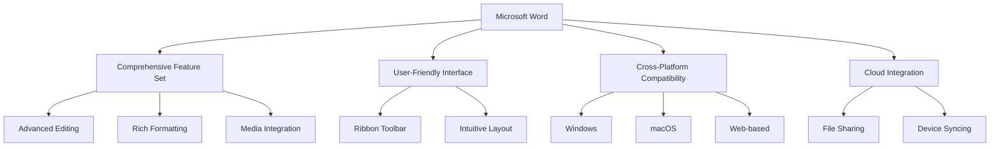
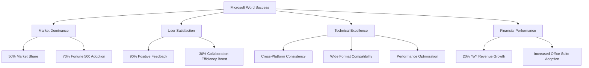
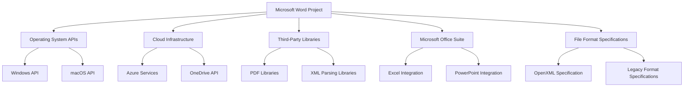
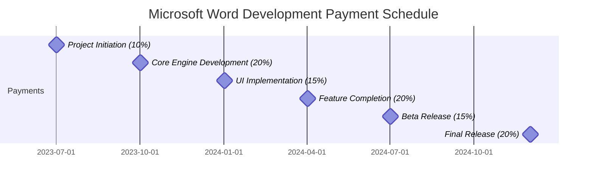
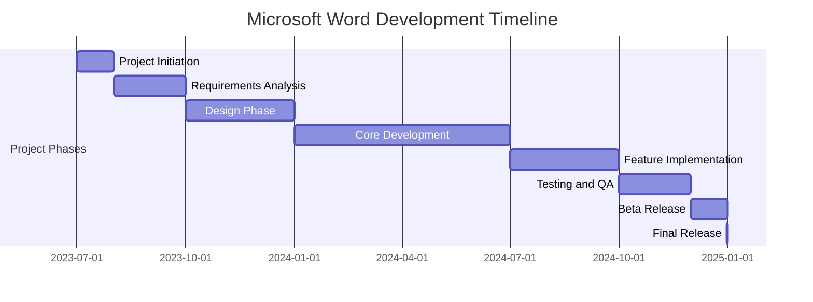
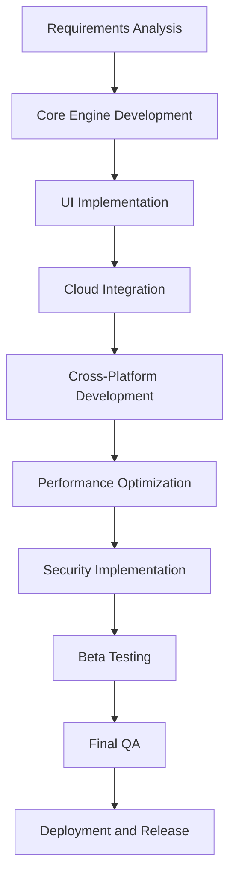
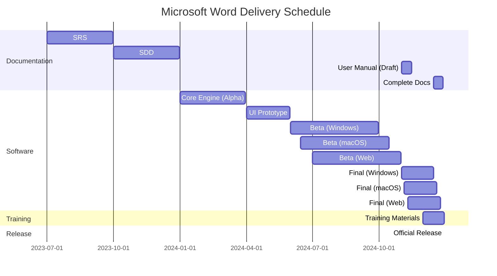

# EXECUTIVE SUMMARY

## PROJECT OVERVIEW

Microsoft Word is a groundbreaking word processing software designed to revolutionize document creation, editing, and formatting. This comprehensive solution addresses the growing need for a versatile, user-friendly tool that streamlines text-based workflows across various industries and personal use cases. By offering a rich set of features and intuitive interface, Microsoft Word aims to become the go-to application for all document-related tasks, from simple letter writing to complex report generation.

## OBJECTIVES

1. Develop a robust word processing application with advanced editing and formatting capabilities
2. Create a user-friendly interface with a ribbon toolbar for easy access to features
3. Implement collaboration tools to enhance team productivity
4. Ensure cross-platform compatibility for Windows, macOS, and web-based versions
5. Integrate cloud storage for seamless file sharing and access across devices
6. Support a wide range of file formats for maximum compatibility

## VALUE PROPOSITION

Microsoft Word offers unparalleled value through its comprehensive approach to word processing:

1. All-in-one solution: Combines document creation, editing, formatting, and collaboration in a single application
2. Productivity boost: Streamlines workflows with intuitive tools and advanced features like macros and templates
3. Seamless collaboration: Enables team productivity with track changes, comments, and cloud integration
4. Flexibility: Ensures accessibility across multiple platforms and devices
5. Future-proof: Regular updates and new feature additions to meet evolving user needs
6. Ecosystem integration: Seamlessly works with other Microsoft Office applications for a cohesive productivity suite

## PROJECT OBJECTIVES

### BUSINESS GOALS

1. Establish Microsoft Word as the industry-leading word processing software
2. Capture a significant market share in the productivity software sector
3. Generate substantial revenue through software licenses and subscriptions
4. Enhance Microsoft's reputation as an innovative technology company
5. Create a loyal user base across various industries and personal use cases
6. Increase adoption of the broader Microsoft Office suite through Word's success

### TECHNICAL GOALS

1. Develop a robust and scalable word processing engine
2. Implement an intuitive and customizable user interface
3. Create a comprehensive set of document editing and formatting tools
4. Ensure seamless cross-platform compatibility (Windows, macOS, web)
5. Integrate cloud storage and real-time collaboration features
6. Optimize performance for handling large documents and complex formatting
7. Implement advanced features such as mail merge, macros, and template creation
8. Ensure compatibility with a wide range of file formats
9. Develop a flexible architecture to support future feature additions and updates

### SUCCESS CRITERIA

| Criterion | Target | Measurement Method |
|-----------|--------|---------------------|
| Market Share | 50% of word processing software market within 3 years | Industry reports and sales data |
| User Satisfaction | 90% positive user feedback | User surveys and app store ratings |
| Performance | Document load time < 2 seconds for files up to 100 pages | Automated performance testing |
| Cross-Platform Consistency | 95% feature parity across all platforms | Feature comparison audits |
| File Format Compatibility | Successfully open and edit 99% of tested file formats | Compatibility testing with various document types |
| Collaboration Efficiency | 30% reduction in document completion time for team projects | User studies and productivity tracking |
| Revenue Growth | 20% year-over-year increase in Word-related revenue | Financial reports |
| Enterprise Adoption | 70% of Fortune 500 companies using Microsoft Word | Sales data and customer surveys |
| Feature Utilization | 80% of features used by at least 10% of users monthly | Usage analytics |
| Update Frequency | Quarterly feature updates and monthly bug fixes | Development and release schedules |

This success criteria diagram illustrates the key areas of focus for measuring Microsoft Word's success, encompassing market performance, user satisfaction, technical achievements, and financial outcomes.

# SCOPE OF WORK

## IN-SCOPE

The Microsoft Word project will encompass the following key features and functionalities:

1. Document Creation and Editing
   - Rich text editing capabilities
   - Spell check and grammar correction
   - Auto-save and version history
   - Find and replace functionality
   - Document statistics (word count, page count, etc.)

2. Formatting and Styling
   - Text formatting (font, size, color, style)
   - Paragraph formatting (alignment, spacing, indentation)
   - Styles and themes for consistent document design
   - Page layout options (margins, orientation, columns)
   - Headers, footers, and page numbering

3. Content Elements
   - Table creation and formatting
   - Image insertion and manipulation
   - Charts and graphs
   - SmartArt and diagrams
   - Equations and symbols

4. Document Structure
   - Table of contents generation
   - Footnotes and endnotes
   - Citations and bibliography
   - Bookmarks and cross-references

5. Collaboration Tools
   - Track changes
   - Comments and annotations
   - Document sharing and permissions
   - Real-time co-authoring

6. File Management
   - Multiple file format support (DOCX, DOC, RTF, TXT, PDF)
   - File conversion and export options
   - Cloud storage integration (OneDrive)
   - Local file system access

7. Advanced Features
   - Mail merge
   - Macro recording and execution
   - Template creation and management
   - Form creation with fillable fields

8. User Interface
   - Ribbon toolbar with contextual tabs
   - Customizable quick access toolbar
   - Document views (print layout, web layout, outline)
   - Dark mode and accessibility features

9. Cross-Platform Development
   - Windows desktop application
   - macOS desktop application
   - Web-based version

10. Integration and Extensibility
    - Integration with other Microsoft Office applications
    - Add-in support for third-party extensions
    - API for programmatic document manipulation

## OUT-OF-SCOPE

The following items are explicitly excluded from the project scope:

1. Desktop publishing features (complex layout design for magazines or newspapers)
2. Advanced image editing capabilities (beyond basic cropping and resizing)
3. Video or audio editing features
4. Web design or HTML editing tools
5. Project management features
6. Customer relationship management (CRM) functionality
7. Accounting or financial analysis tools
8. Development of mobile applications (iOS, Android)
9. Machine learning or AI-powered writing assistance
10. Language translation services

## ASSUMPTIONS

The project plan is based on the following assumptions:

1. Microsoft has the necessary development resources and expertise available for the project.
2. The project will have access to required hardware and software resources for development and testing.
3. Third-party libraries and components used in the project will remain supported and compatible throughout the development lifecycle.
4. Cloud infrastructure (Azure) will be available and scalable to support cloud-based features.
5. Regulatory requirements for data protection and privacy will remain stable during development.
6. User testing groups will be available for feedback and usability studies.
7. The market demand for word processing software will remain strong.
8. Compatibility with existing Microsoft Office file formats will be maintained.
9. The project will have access to necessary fonts and typography resources.
10. Localization resources will be available for supporting multiple languages.

## DEPENDENCIES

The project has the following key dependencies:

1. Operating System APIs:
   - Windows API for the Windows version
   - macOS API for the macOS version

2. Cloud Infrastructure:
   - Azure services for backend operations
   - OneDrive API for cloud storage integration

3. Third-Party Libraries:
   - PDF generation and parsing libraries
   - XML parsing libraries for file format handling
   - Typography and text rendering engines

4. Microsoft Office Suite:
   - Integration with Excel for data import/export
   - Integration with PowerPoint for presentation features

5. File Format Specifications:
   - OpenXML specification for DOCX format
   - Specifications for legacy formats (DOC, RTF)

6. Web Technologies:
   - Web standards and browser APIs for the web-based version

7. Localization Services:
   - Translation and localization resources for multiple language support

8. Testing Infrastructure:
   - Automated testing frameworks and tools
   - User testing platforms for feedback collection

9. Version Control and CI/CD:
   - Git repositories and branching strategies
   - Continuous integration and deployment pipelines

10. Legal and Compliance:
    - Licensing agreements for third-party components
    - Compliance checks for accessibility standards (e.g., WCAG)

# BUDGET AND COST ESTIMATES

## COST BREAKDOWN

The following table provides a detailed breakdown of the estimated costs for the Microsoft Word project:

| Category | Item | Cost (USD) |
|----------|------|------------|
| Labor | Software Development (20 developers x 18 months) | $7,200,000 |
| Labor | UI/UX Design (5 designers x 12 months) | $900,000 |
| Labor | Project Management (2 managers x 18 months) | $540,000 |
| Labor | Quality Assurance (10 testers x 12 months) | $1,440,000 |
| Software | Development Tools and Licenses | $200,000 |
| Hardware | Development and Testing Equipment | $300,000 |
| Infrastructure | Cloud Services (Azure) | $500,000 |
| Third-Party | Libraries and Components | $150,000 |
| Marketing | Pre-launch Marketing Campaign | $1,000,000 |
| Localization | Translation and Adaptation Services | $400,000 |
| Legal | Licensing and Compliance | $200,000 |
| Contingency | Reserve for Unforeseen Expenses (10%) | $1,283,000 |
| **Total** | | **$14,113,000** |

## PAYMENT SCHEDULE

The payment schedule is structured around key project milestones and deliverables:

1. Project Initiation (10%): $1,411,300 - Upon project kickoff and approval of project plan
2. Core Engine Development (20%): $2,822,600 - Completion of basic document editing and formatting engine
3. UI Implementation (15%): $2,116,950 - Delivery of main user interface components and ribbon toolbar
4. Feature Completion (20%): $2,822,600 - Implementation of all planned features and functionalities
5. Beta Release (15%): $2,116,950 - Successful launch of beta version for testing
6. Final Release (20%): $2,822,600 - Official release of Microsoft Word across all planned platforms

## BUDGET CONSIDERATIONS

Several factors could impact the budget and require careful management:

1. Scope Creep: As the project progresses, there may be pressure to add features beyond the initial scope. This will be managed through strict change control processes and clear communication of project boundaries.

2. Technology Changes: Rapid advancements in web technologies or operating system updates could necessitate additional development work. We have allocated part of the contingency budget to address such changes.

3. Third-Party Component Costs: Licensing fees for third-party libraries or components may change. We will explore alternative open-source options where possible and negotiate long-term agreements to mitigate this risk.

4. Cloud Infrastructure Scaling: As user adoption grows, cloud infrastructure costs may increase. We will implement cost optimization strategies and consider reserved instances for predictable workloads.

5. Extended Testing Phase: If quality assurance uncovers more issues than anticipated, the testing phase may need to be extended. We have factored in some buffer in the QA timeline and budget.

6. Localization Complexity: Some languages may require more extensive localization efforts than others. We will prioritize major markets first and phase the rollout of additional languages.

7. Legal and Compliance Issues: Changes in data protection laws or accessibility requirements may necessitate additional development work. We will work closely with the legal team to stay ahead of any regulatory changes.

8. Market Competition: Aggressive moves by competitors may require accelerated development or additional features. We will maintain a flexible development approach to adapt to market demands.

9. Talent Acquisition and Retention: In a competitive job market, we may face challenges in hiring or retaining key personnel. We have budgeted for competitive salaries and will consider retention bonuses for critical team members.

10. Currency Fluctuations: For international aspects of the project, currency exchange rate fluctuations could impact costs. We will work with the finance department to implement appropriate hedging strategies.

To address these considerations, we have included a 10% contingency in the budget and will implement rigorous project monitoring and control processes. Regular budget reviews will be conducted, and any significant deviations will be promptly communicated to stakeholders for timely decision-making.

# TIMELINE AND MILESTONES

## PROJECT TIMELINE

The Microsoft Word project is estimated to span 18 months from initiation to final release. The high-level timeline is as follows:

## KEY MILESTONES

The following table outlines the critical milestones for the Microsoft Word project:

| Milestone | Description | Target Date |
|-----------|-------------|-------------|
| Project Kickoff | Initial team assembly and project setup | 2023-07-01 |
| Requirements Finalization | Completion of detailed requirements document | 2023-09-30 |
| UI/UX Design Approval | Finalization of user interface designs | 2023-12-31 |
| Core Engine Development | Completion of basic document editing and formatting engine | 2024-03-31 |
| Feature Freeze | All planned features implemented | 2024-09-30 |
| Beta Release | Launch of beta version for testing | 2024-12-01 |
| Final Release | Official release of Microsoft Word across all platforms | 2024-12-31 |

## CRITICAL PATH

The critical path for the Microsoft Word project includes the following key activities:

1. Requirements Analysis and Specification
2. Core Document Engine Development
3. User Interface Design and Implementation
4. Integration of Cloud Services
5. Cross-Platform Compatibility Development
6. Performance Optimization
7. Security and Data Protection Implementation
8. Beta Testing and Bug Fixing
9. Final Quality Assurance
10. Deployment and Release

To ensure the project stays on schedule, particular attention must be paid to these critical path activities. Any delays in these areas could potentially impact the overall project timeline. Regular progress reviews and risk assessments will be conducted to identify and address any potential bottlenecks or issues that may affect these critical activities.

# DELIVERABLES

## LIST OF DELIVERABLES

The Microsoft Word project will produce the following tangible outputs:

1. Software Components:
   - Microsoft Word for Windows
   - Microsoft Word for macOS
   - Microsoft Word Web Application
   - Microsoft Word Mobile Viewer (iOS and Android)

2. Documentation:
   - Software Requirements Specification (SRS)
   - Software Design Document (SDD)
   - User Manual
   - Administrator Guide
   - API Documentation

3. Training Materials:
   - End-User Training Guide
   - Video Tutorials
   - Interactive Online Training Module

4. Marketing Materials:
   - Product Brochures
   - Demo Videos
   - Press Release Kit

5. Testing Deliverables:
   - Test Plans
   - Test Cases
   - Test Results Reports

6. Deployment Packages:
   - Installation Packages for Windows and macOS
   - Deployment Guide for IT Administrators

7. Source Code and Build Scripts

8. Third-Party Integration Guides

9. Localization Packages for supported languages

10. Security and Compliance Documentation

## DELIVERY SCHEDULE

The following table outlines the expected delivery dates for each major deliverable:

| Deliverable | Expected Delivery Date |
|-------------|------------------------|
| Software Requirements Specification | 2023-09-30 |
| Software Design Document | 2023-12-31 |
| Core Engine (Alpha Version) | 2024-03-31 |
| User Interface Prototype | 2024-05-31 |
| Beta Version (Windows) | 2024-09-30 |
| Beta Version (macOS) | 2024-10-15 |
| Beta Version (Web) | 2024-10-31 |
| User Manual (Draft) | 2024-11-15 |
| Final Windows Version | 2024-12-15 |
| Final macOS Version | 2024-12-20 |
| Final Web Version | 2024-12-25 |
| Complete Documentation Set | 2024-12-28 |
| Training Materials | 2024-12-30 |
| Official Release | 2024-12-31 |

## ACCEPTANCE CRITERIA

The following criteria will be used to determine the acceptance of key deliverables:

1. Software Components:
   - All specified features are implemented and functional
   - Performance meets or exceeds specified benchmarks
   - Compatibility with target operating systems and browsers is verified
   - Security requirements are met
   - Accessibility standards are adhered to
   - Localization is complete for all supported languages

2. Documentation:
   - All documents are complete, accurate, and up-to-date
   - Technical accuracy is verified by subject matter experts
   - Language and style conform to Microsoft documentation standards
   - All diagrams and screenshots are clear and relevant

3. Training Materials:
   - Cover all major features and use cases
   - Are clear, concise, and easy to follow
   - Include practical exercises and examples
   - Are accessible in multiple formats (text, video, interactive)

4. User Interface:
   - Adheres to approved design specifications
   - Passes usability testing with target user groups
   - Is responsive and performs well on specified hardware configurations

5. Integration and Compatibility:
   - Successfully integrates with other Microsoft Office applications
   - Correctly handles import/export of specified file formats
   - API functions as documented and passes all test cases

6. Performance:
   - Meets specified load times for documents of various sizes
   - Handles concurrent users in collaborative editing scenarios
   - Performs efficiently with large documents (1000+ pages)

7. Security and Compliance:
   - Passes all security audits
   - Meets data protection and privacy requirements
   - Complies with accessibility standards (e.g., WCAG 2.1)

8. Testing:
   - All test cases executed with a pass rate of 98% or higher
   - No critical or high-priority bugs remain unresolved
   - Performance testing shows results within 5% of specified targets

9. Deployment:
   - Installation packages deploy successfully on clean systems
   - Upgrade paths from previous versions work as specified
   - Cloud-based components deploy and scale as designed

10. Localization:
    - All user-facing text is correctly translated
    - Locale-specific formatting (dates, numbers) is correct
    - UI layouts accommodate text expansion/contraction in different languages

Each deliverable will be reviewed against these criteria by the project team, quality assurance, and where appropriate, client representatives. Formal acceptance will require sign-off from designated stakeholders after verification that all relevant criteria have been met.