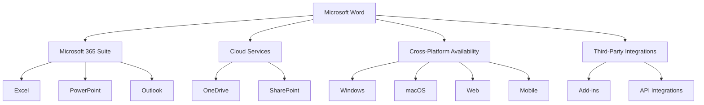
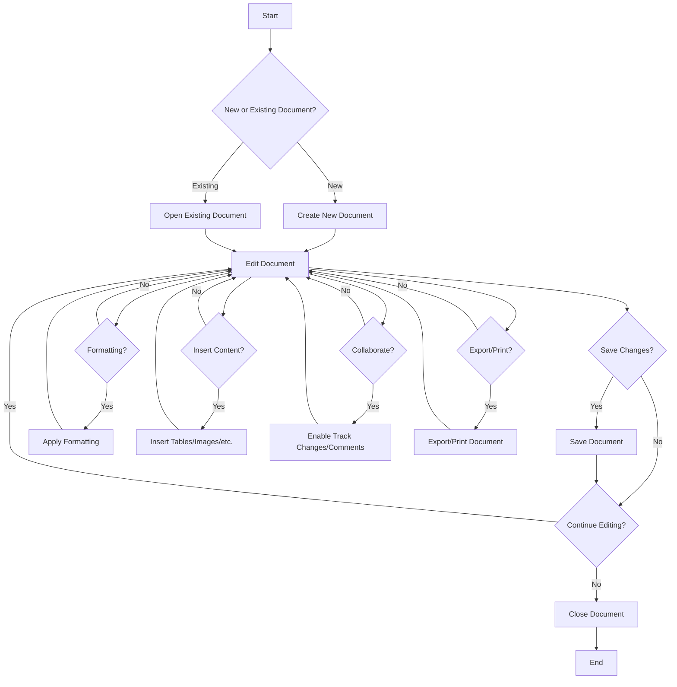
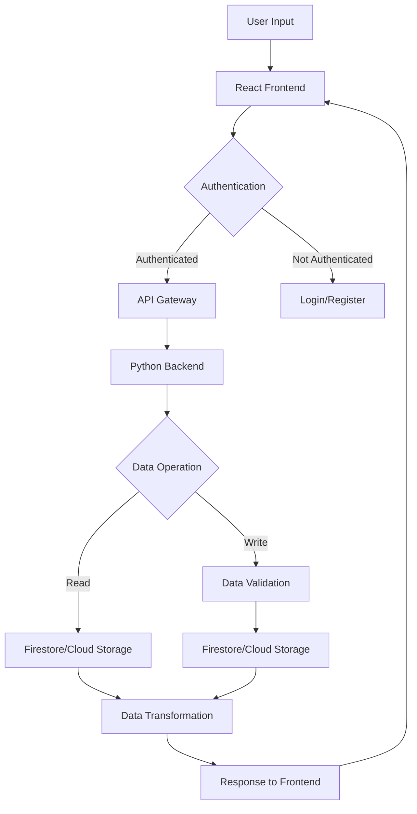

# INTRODUCTION

## PURPOSE

The purpose of this Software Requirements Specification (SRS) document is to provide a comprehensive and detailed description of the Microsoft Word software application. This document serves as the primary reference for the development team, project managers, quality assurance testers, and other stakeholders involved in the creation and deployment of Microsoft Word.

The SRS aims to:

1. Clearly define the functional and non-functional requirements of Microsoft Word
2. Establish a common understanding among all project stakeholders
3. Serve as a basis for project planning, cost estimation, and scheduling
4. Provide a foundation for design and implementation decisions
5. Act as a benchmark for validation and verification processes

The intended audience for this document includes:

- Software developers and engineers
- User interface designers
- Quality assurance testers
- Project managers and product owners
- Technical writers and documentation specialists
- Senior management and decision-makers
- Potential integration partners and third-party developers

## SCOPE

Microsoft Word is a comprehensive word processing software designed to revolutionize document creation, editing, and collaboration across various platforms. The application aims to provide a powerful yet user-friendly tool for individuals, businesses, and organizations to create, format, and share professional-quality documents.

### Goals

1. Develop a feature-rich word processing application for Windows, macOS, and web platforms
2. Create an intuitive and efficient user interface that caters to both novice and advanced users
3. Implement robust collaboration tools to enhance team productivity
4. Ensure seamless integration with cloud storage and other Microsoft Office applications
5. Provide extensive formatting and styling options for creating visually appealing documents
6. Support a wide range of file formats for maximum compatibility

### Benefits

1. Increased productivity through streamlined document creation and editing processes
2. Enhanced collaboration capabilities, enabling teams to work efficiently on shared documents
3. Improved document quality and consistency through advanced formatting and styling tools
4. Seamless access to documents across multiple devices and platforms
5. Reduced learning curve for users familiar with other Microsoft Office applications
6. Increased compatibility with various document formats, facilitating easier information exchange

### Core Functionalities

1. Document Creation and Editing
   - Rich text editing with support for various fonts, sizes, and styles
   - Spell check and grammar correction
   - Auto-save and version history

2. Formatting and Layout
   - Paragraph formatting (alignment, spacing, indentation)
   - Page layout options (margins, orientation, columns)
   - Styles and themes for consistent document design

3. Content Elements
   - Table creation and formatting
   - Image insertion and manipulation
   - Charts, graphs, and SmartArt diagrams

4. Collaboration Tools
   - Real-time co-authoring
   - Track changes and comments
   - Document sharing and permissions management

5. File Management
   - Support for multiple file formats (DOCX, DOC, RTF, PDF, etc.)
   - Integration with cloud storage (OneDrive)
   - File conversion and export options

6. Advanced Features
   - Mail merge functionality
   - Macro recording and execution
   - Template creation and management

7. Cross-Platform Compatibility
   - Windows desktop application
   - macOS desktop application
   - Web-based version accessible through modern browsers

8. Integration
   - Seamless integration with other Microsoft Office applications
   - Support for third-party add-ins and extensions

The Microsoft Word project will utilize the following key technologies:

- Frontend: React with TypeScript for building the user interface
- Styling: Tailwind CSS for efficient and responsive design
- Backend: Python for server-side logic and API development
- Cloud Infrastructure: Google Cloud Platform for hosting, storage, and scalability

By delivering these core functionalities and leveraging modern technologies, Microsoft Word aims to set a new standard in word processing software, catering to the diverse needs of users across various industries and use cases.

# PRODUCT DESCRIPTION

## PRODUCT PERSPECTIVE

Microsoft Word is a comprehensive word processing application that forms a core component of the Microsoft Office suite. It operates within the broader ecosystem of productivity tools and cloud services provided by Microsoft. The product is designed to work seamlessly across multiple platforms, including Windows, macOS, and web browsers, while integrating with other Microsoft services and third-party applications.

Key aspects of Microsoft Word's product perspective include:

1. Integration with Microsoft 365: Word is tightly integrated with other Microsoft 365 applications such as Excel, PowerPoint, and Outlook, allowing for seamless data and content sharing between these tools.

2. Cloud Connectivity: The application leverages Microsoft's cloud infrastructure, particularly OneDrive, for file storage, sharing, and real-time collaboration features.

3. Cross-Platform Availability: Microsoft Word is designed to provide a consistent experience across desktop (Windows and macOS), web, and mobile platforms, allowing users to access and edit their documents from various devices.

4. Extensibility: The product supports add-ins and extensions, enabling third-party developers to enhance its functionality and integrate with other software systems.

5. Compatibility: Word maintains backward compatibility with older file formats and supports various industry-standard document formats, ensuring interoperability with other word processing applications.



## PRODUCT FUNCTIONS

Microsoft Word provides a wide range of functions to support document creation, editing, and collaboration. The main functions of the software include:

1. Document Creation and Editing:
   - Rich text editing with support for various fonts, sizes, and styles
   - Paragraph formatting (alignment, spacing, indentation)
   - Page layout and design tools
   - Spell check and grammar correction
   - Find and replace functionality

2. Content Elements:
   - Table creation and formatting
   - Image insertion and manipulation
   - Chart and graph integration
   - SmartArt and diagram tools
   - Equation editor for mathematical expressions

3. Document Structure:
   - Styles and themes for consistent formatting
   - Table of contents generation
   - Headers, footers, and page numbering
   - Footnotes and endnotes
   - Citations and bibliography management

4. Collaboration Tools:
   - Real-time co-authoring
   - Track changes and version history
   - Comments and annotations
   - Document sharing and permissions management

5. File Management:
   - Support for multiple file formats (DOCX, DOC, RTF, PDF, etc.)
   - Integration with cloud storage (OneDrive)
   - File conversion and export options

6. Advanced Features:
   - Mail merge functionality
   - Macro recording and execution
   - Template creation and management
   - Form creation with fillable fields

7. Integration and Extensibility:
   - Seamless integration with other Microsoft 365 applications
   - Support for third-party add-ins and extensions
   - API for programmatic document manipulation

## USER CHARACTERISTICS

Microsoft Word is designed to cater to a diverse user base with varying levels of expertise and different use cases. The main user categories include:

1. Casual Users:
   - Characteristics: Limited word processing needs, occasional usage
   - Expertise: Basic computer skills, minimal experience with word processors
   - Needs: Simple document creation, basic formatting, ease of use

2. Professional Users:
   - Characteristics: Regular use for work-related documents, reports, and presentations
   - Expertise: Intermediate to advanced computer skills, familiar with word processing concepts
   - Needs: Advanced formatting, collaboration tools, integration with other office applications

3. Academic Users:
   - Characteristics: Students, researchers, and educators
   - Expertise: Varies from basic to advanced
   - Needs: Citation tools, equation editor, long document management

4. Creative Professionals:
   - Characteristics: Writers, editors, content creators
   - Expertise: Advanced word processing skills, may have experience with desktop publishing
   - Needs: Advanced layout tools, style management, track changes functionality

5. Business Administrators:
   - Characteristics: Office managers, executive assistants
   - Expertise: Intermediate to advanced
   - Needs: Template management, mail merge, form creation

6. Developers and Power Users:
   - Characteristics: IT professionals, software developers
   - Expertise: Advanced technical skills
   - Needs: Macro creation, API integration, custom add-in development

User Personas:

1. Sarah, Marketing Manager (Professional User):
   - Age: 35
   - Needs: Creates marketing materials, collaborates with team on proposals
   - Key features: Real-time co-authoring, advanced formatting, integration with other Office apps

2. Professor Johnson, University Lecturer (Academic User):
   - Age: 50
   - Needs: Prepares lecture notes, academic papers, and student feedback
   - Key features: Citation tools, track changes, equation editor

3. Alex, Freelance Writer (Creative Professional):
   - Age: 28
   - Needs: Writes and edits long-form content, manages multiple versions
   - Key features: Advanced styling, version history, cloud storage integration

4. Lisa, Executive Assistant (Business Administrator):
   - Age: 42
   - Needs: Prepares correspondence, manages templates, organizes documents
   - Key features: Mail merge, template management, file organization tools

## CONSTRAINTS

The development and functionality of Microsoft Word are subject to the following constraints:

1. Technical Constraints:
   - Must maintain backward compatibility with older file formats
   - Performance optimization for large documents (1000+ pages) without significant lag
   - Cross-platform consistency while leveraging platform-specific features
   - Browser limitations for the web version (e.g., local file system access)

2. Regulatory Constraints:
   - Compliance with data protection regulations (e.g., GDPR, CCPA)
   - Adherence to accessibility standards (e.g., WCAG 2.1)
   - Export control regulations for cryptography features

3. Business Constraints:
   - Integration with existing Microsoft 365 infrastructure and services
   - Maintenance of Microsoft's pricing and licensing models
   - Alignment with Microsoft's product roadmap and release cycles

4. User Experience Constraints:
   - Maintaining familiarity for existing users while introducing new features
   - Ensuring usability across different screen sizes and input methods
   - Localization requirements for multiple languages and regions

5. Security Constraints:
   - Implementation of robust data encryption for cloud-stored documents
   - Secure handling of user credentials and access tokens
   - Regular security audits and vulnerability assessments

6. Performance Constraints:
   - Maximum file size limitations for optimal performance
   - Response time targets for common operations (e.g., file open, save)
   - Concurrent user limits for real-time collaboration features

7. Compatibility Constraints:
   - Support for a defined set of third-party file formats and plugins
   - Interoperability with specific versions of operating systems and browsers

## ASSUMPTIONS AND DEPENDENCIES

The development and success of Microsoft Word are based on the following assumptions and dependencies:

Assumptions:

1. The market demand for word processing software will remain strong throughout the development and release cycle.
2. Users will have access to stable internet connections for cloud-based features and real-time collaboration.
3. The majority of users will have devices that meet the minimum hardware requirements for running Microsoft Word efficiently.
4. The current trend towards cloud-based and collaborative work environments will continue.
5. Users will be willing to adopt new features and interface changes with proper guidance and documentation.

Dependencies:

1. Microsoft Azure Cloud Services:
   - Reliance on Azure for hosting backend services, data storage, and scalability
   - Dependency on Azure Active Directory for user authentication and access management

2. Google Cloud Platform:
   - Utilization of Google Cloud services for certain backend functionalities and data processing tasks

3. React and TypeScript:
   - Core dependencies for building the user interface of the web version
   - Ongoing support and updates from the React community

4. Tailwind CSS:
   - Dependency for efficient and responsive design implementation
   - Regular updates and compatibility with other front-end technologies

5. Python:
   - Primary language for backend development, requiring ongoing support and compatibility with other system components

6. Third-Party Libraries and APIs:
   - Reliance on various open-source and commercial libraries for specific functionalities (e.g., PDF generation, advanced text processing)

7. Operating System APIs:
   - Dependence on Windows and macOS APIs for desktop application functionality and integration

8. Web Browser Technologies:
   - Reliance on modern web standards and APIs supported by major browsers

9. Microsoft Office Ecosystem:
   - Integration with other Microsoft 365 applications and services
   - Compatibility with Office file formats and protocols

10. Localization Services:
    - Dependency on translation services and localization experts for multi-language support

11. Legal and Compliance:
    - Ongoing legal review and compliance checks to ensure adherence to relevant regulations and standards

12. User Feedback and Testing:
    - Dependence on user testing groups and beta testers for feature validation and usability improvements

This comprehensive set of assumptions and dependencies underscores the complex ecosystem in which Microsoft Word operates and highlights the interconnected nature of modern software development. Regular assessment and management of these factors will be crucial for the project's success.

Here's the PROCESS FLOWCHART section for the Microsoft Word SRS using Mermaid JS:

# PROCESS FLOWCHART

The following flowchart illustrates the high-level process flow for the core functionality of Microsoft Word:



This flowchart represents the main processes involved in using Microsoft Word:

1. The user starts by choosing to create a new document or open an existing one.
2. The main editing process is central to the flowchart, with various branches for common actions:
   - Formatting: Applying styles, changing fonts, adjusting layouts, etc.
   - Inserting Content: Adding tables, images, charts, and other media.
   - Collaboration: Enabling track changes and comments for team editing.
   - Exporting/Printing: Generating output in various formats or sending to a printer.
3. The user can save changes at any point during the editing process.
4. The process continues until the user decides to close the document.

Implementation notes:

- The user interface for these processes will be built using React with TypeScript and styled with Tailwind CSS, ensuring a responsive and intuitive experience across all platforms.
- Backend operations, such as file handling, document processing, and collaboration features, will be implemented in Python, leveraging its strong text processing capabilities and extensive libraries.
- The flowchart represents a simplified view of the process. In the actual implementation, there will be more detailed sub-processes and error handling mechanisms.
- Cloud integration (using Microsoft Azure) will be seamlessly incorporated into the save, open, and collaboration processes to enable real-time syncing and multi-device access.

This process flowchart serves as a high-level guide for both users and developers, illustrating the core functionality and user journey within Microsoft Word. It will be used as a reference point for feature development and user experience design throughout the project lifecycle.

Here's a breakdown of Microsoft Word features with the requested sub-sections:

1. ID: DOC-EDIT
   DESCRIPTION: Document Editing and Formatting
   PRIORITY: High
   TABLE OF FUNCTIONAL REQUIREMENTS:
   | Requirement ID | Description | Implementation |
   |----------------|-------------|-----------------|
   | DOC-EDIT-01 | Rich text editing with support for various fonts, sizes, and styles | React components for text editing, Typescript for type-safe text manipulation |
   | DOC-EDIT-02 | Paragraph formatting (alignment, spacing, indentation) | Tailwind CSS for styling, React state management for formatting options |
   | DOC-EDIT-03 | Page layout options (margins, orientation, columns) | React components for layout controls, Python backend for document structure |
   | DOC-EDIT-04 | Styles and themes for consistent document design | React context for theme management, Tailwind CSS for styling |

2. ID: COLLAB
   DESCRIPTION: Collaboration Tools
   PRIORITY: High
   TABLE OF FUNCTIONAL REQUIREMENTS:
   | Requirement ID | Description | Implementation |
   |----------------|-------------|-----------------|
   | COLLAB-01 | Real-time co-authoring | Google Cloud Firestore for real-time data synchronization, React hooks for live updates |
   | COLLAB-02 | Track changes and version history | Python backend for diff generation, React components for change visualization |
   | COLLAB-03 | Comments and annotations | React components for comment UI, Google Cloud Datastore for comment storage |
   | COLLAB-04 | Document sharing and permissions management | Google Cloud Identity and Access Management (IAM) for user authentication and authorization |

3. ID: FILE-MGMT
   DESCRIPTION: File Management and Compatibility
   PRIORITY: High
   TABLE OF FUNCTIONAL REQUIREMENTS:
   | Requirement ID | Description | Implementation |
   |----------------|-------------|-----------------|
   | FILE-MGMT-01 | Support for multiple file formats (DOCX, DOC, RTF, PDF, etc.) | Python libraries for file format parsing and conversion |
   | FILE-MGMT-02 | Integration with cloud storage (Google Drive) | Google Drive API integration, React components for file browser |
   | FILE-MGMT-03 | File conversion and export options | Python backend for format conversion, React UI for export options |
   | FILE-MGMT-04 | Auto-save and version history | Google Cloud Storage for file versioning, React hooks for auto-save functionality |

4. ID: CONTENT-ELEM
   DESCRIPTION: Content Elements
   PRIORITY: Medium
   TABLE OF FUNCTIONAL REQUIREMENTS:
   | Requirement ID | Description | Implementation |
   |----------------|-------------|-----------------|
   | CONTENT-ELEM-01 | Table creation and formatting | React components for table UI, Tailwind CSS for styling |
   | CONTENT-ELEM-02 | Image insertion and manipulation | React components for image handling, Python backend for image processing |
   | CONTENT-ELEM-03 | Charts and graphs | React-based charting library, Python backend for data processing |
   | CONTENT-ELEM-04 | SmartArt and diagrams | Custom React components for diagram creation, SVG manipulation |

5. ID: ADV-FEAT
   DESCRIPTION: Advanced Features
   PRIORITY: Medium
   TABLE OF FUNCTIONAL REQUIREMENTS:
   | Requirement ID | Description | Implementation |
   |----------------|-------------|-----------------|
   | ADV-FEAT-01 | Mail merge functionality | Python backend for data processing, React UI for template design |
   | ADV-FEAT-02 | Macro recording and execution | Typescript for macro scripting, React UI for macro management |
   | ADV-FEAT-03 | Template creation and management | React components for template design, Google Cloud Storage for template storage |
   | ADV-FEAT-04 | Form creation with fillable fields | React components for form elements, Python backend for form data processing |

6. ID: CROSS-PLAT
   DESCRIPTION: Cross-Platform Compatibility
   PRIORITY: High
   TABLE OF FUNCTIONAL REQUIREMENTS:
   | Requirement ID | Description | Implementation |
   |----------------|-------------|-----------------|
   | CROSS-PLAT-01 | Windows desktop application | Electron.js for desktop app wrapping React UI |
   | CROSS-PLAT-02 | macOS desktop application | Electron.js for desktop app wrapping React UI |
   | CROSS-PLAT-03 | Web-based version | React-based progressive web app (PWA) |
   | CROSS-PLAT-04 | Consistent user experience across platforms | Shared React component library, Tailwind CSS for responsive design |

7. ID: PERF-OPT
   DESCRIPTION: Performance Optimization
   PRIORITY: High
   TABLE OF FUNCTIONAL REQUIREMENTS:
   | Requirement ID | Description | Implementation |
   |----------------|-------------|-----------------|
   | PERF-OPT-01 | Fast document loading and rendering | React virtualization for large documents, lazy loading of content |
   | PERF-OPT-02 | Efficient memory usage for large documents | Python backend for document chunking, React for efficient DOM updates |
   | PERF-OPT-03 | Responsive UI even with complex formatting | React Concurrent Mode for non-blocking rendering |
   | PERF-OPT-04 | Optimized cloud synchronization | Google Cloud Pub/Sub for efficient real-time updates |

8. ID: ACCESS
   DESCRIPTION: Accessibility Features
   PRIORITY: Medium
   TABLE OF FUNCTIONAL REQUIREMENTS:
   | Requirement ID | Description | Implementation |
   |----------------|-------------|-----------------|
   | ACCESS-01 | Screen reader compatibility | React-aria for accessible components, ARIA attributes |
   | ACCESS-02 | Keyboard navigation | Custom React hooks for keyboard shortcuts and focus management |
   | ACCESS-03 | High contrast modes | Tailwind CSS for theming, React context for theme switching |
   | ACCESS-04 | Text-to-speech and speech-to-text | Integration with platform-specific accessibility APIs, React components for controls |

9. ID: SECURITY
   DESCRIPTION: Security and Data Protection
   PRIORITY: High
   TABLE OF FUNCTIONAL REQUIREMENTS:
   | Requirement ID | Description | Implementation |
   |----------------|-------------|-----------------|
   | SECURITY-01 | End-to-end encryption for document storage and transfer | Google Cloud Key Management Service for encryption key management |
   | SECURITY-02 | Multi-factor authentication | Google Cloud Identity Platform for authentication services |
   | SECURITY-03 | Audit logging and activity monitoring | Google Cloud Operations Suite for logging and monitoring |
   | SECURITY-04 | Data loss prevention | Custom Python scripts for content scanning, React UI for admin controls |

10. ID: INTEG
    DESCRIPTION: Integration and Extensibility
    PRIORITY: Medium
    TABLE OF FUNCTIONAL REQUIREMENTS:
    | Requirement ID | Description | Implementation |
    |----------------|-------------|-----------------|
    | INTEG-01 | Integration with other Microsoft Office applications | Custom APIs for inter-app communication, React components for embedded content |
    | INTEG-02 | Support for third-party add-ins and extensions | React-based plugin architecture, Python backend for plugin management |
    | INTEG-03 | API for programmatic document manipulation | RESTful API built with Python Flask, Typescript definitions for API clients |
    | INTEG-04 | Integration with external services (e.g., citation managers) | OAuth 2.0 for third-party authentication, React components for service connections |

This feature breakdown provides a comprehensive overview of the Microsoft Word project, aligning with the previously established technology choices and project structure. The use of React, Typescript, and Tailwind CSS for the frontend, Python for the backend, and Google Cloud services for infrastructure ensures consistency with the earlier sections of the document.

# NON-FUNCTIONAL REQUIREMENTS

## PERFORMANCE

1. Document Loading:
   - Documents up to 100 pages should load within 2 seconds on standard hardware.
   - Documents up to 1000 pages should load within 10 seconds on standard hardware.

2. Editing Response Time:
   - Typing latency should not exceed 50ms for documents up to 100 pages.
   - Formatting changes should be applied within 100ms for documents up to 100 pages.

3. Saving and Syncing:
   - Local saves should complete within 1 second for documents up to 100 pages.
   - Cloud syncing should initiate within 5 seconds of a save operation.

4. Collaboration:
   - Changes from collaborators should be visible within 500ms under normal network conditions.
   - The system should support up to 50 simultaneous editors on a single document.

5. Resource Usage:
   - Memory usage should not exceed 1GB for documents up to 100 pages.
   - CPU usage should not exceed 30% during normal editing operations.

Implementation:
- Use React virtualization techniques for efficient rendering of large documents.
- Implement lazy loading of document content using React Suspense.
- Utilize Web Workers for heavy computations to keep the UI responsive.
- Optimize Python backend using asynchronous programming for improved throughput.

## SAFETY

1. Data Loss Prevention:
   - Implement auto-save functionality that triggers every 30 seconds during active editing.
   - Maintain a local cache of recent changes to recover from unexpected application crashes.

2. Version Control:
   - Keep a minimum of 10 previous versions of each document for recovery purposes.
   - Allow users to revert to any previous version within the last 30 days.

3. Conflict Resolution:
   - Implement a robust merge system to handle conflicting changes in collaborative editing.
   - Provide clear visual indicators of conflicts and tools for manual resolution.

4. Error Handling:
   - Gracefully handle and log all errors without exposing sensitive information to users.
   - Implement a crash recovery system that can restore the application state after an unexpected shutdown.

Implementation:
- Use React Error Boundaries to catch and handle UI errors gracefully.
- Implement a robust logging system using Google Cloud Logging for backend errors.
- Utilize Google Cloud Storage for version control and document history.

## SECURITY

1. Authentication:
   - Implement multi-factor authentication for user accounts.
   - Support single sign-on (SSO) integration with popular identity providers.

2. Authorization:
   - Implement role-based access control (RBAC) for document permissions.
   - Enforce principle of least privilege for all system operations.

3. Data Encryption:
   - Use AES-256 encryption for data at rest in cloud storage.
   - Implement TLS 1.3 for all data in transit.

4. Privacy:
   - Comply with GDPR, CCPA, and other relevant data protection regulations.
   - Provide users with options to control data sharing and retention.

5. Secure Development:
   - Conduct regular security audits and penetration testing.
   - Implement a vulnerability disclosure program.

Implementation:
- Utilize Google Cloud Identity Platform for authentication and authorization.
- Use Google Cloud Key Management Service for encryption key management.
- Implement OAuth 2.0 for secure API access.
- Use React Context API for managing user authentication state in the frontend.

## QUALITY

1. Availability:
   - Achieve 99.9% uptime for cloud-based services.
   - Implement redundancy and failover mechanisms for critical system components.

2. Maintainability:
   - Achieve a code maintainability index of at least 80 as measured by standard tools.
   - Maintain comprehensive documentation for all APIs and major system components.

3. Usability:
   - Achieve a System Usability Scale (SUS) score of at least 80.
   - Ensure the application is accessible and compliant with WCAG 2.1 Level AA standards.

4. Scalability:
   - Support linear scaling of backend services to handle up to 1 million concurrent users.
   - Implement auto-scaling for cloud resources based on demand.

5. Reliability:
   - Achieve a mean time between failures (MTBF) of at least 720 hours.
   - Implement comprehensive error tracking and reporting mechanisms.

Implementation:
- Use Google Cloud Load Balancing for high availability and scalability.
- Implement a microservices architecture using Google Kubernetes Engine for improved maintainability and scalability.
- Utilize React Testing Library and Jest for comprehensive frontend testing.
- Implement Continuous Integration/Continuous Deployment (CI/CD) pipelines using Google Cloud Build.

## COMPLIANCE

1. Legal:
   - Comply with all applicable copyright laws and licensing agreements.
   - Implement features to support legal holds and e-discovery requirements.

2. Regulatory:
   - Ensure compliance with GDPR, CCPA, HIPAA, and other relevant data protection regulations.
   - Implement data residency options to comply with local data storage laws.

3. Standards:
   - Adhere to ISO/IEC 27001 for information security management.
   - Comply with WCAG 2.1 Level AA for web accessibility.

4. Industry-Specific:
   - Implement features to support compliance with industry-specific regulations (e.g., FINRA for financial services, FERPA for education).

5. Certification:
   - Obtain SOC 2 Type II certification for cloud services.
   - Achieve FedRAMP certification for government use.

Implementation:
- Use Google Cloud Compliance Reports Manager to maintain and provide compliance documentation.
- Implement data classification and retention policies using Google Cloud Data Loss Prevention API.
- Utilize React-Axe for automated accessibility testing in the development process.
- Implement comprehensive logging and auditing using Google Cloud Audit Logs.

These non-functional requirements provide a robust framework for ensuring Microsoft Word meets high standards of performance, safety, security, quality, and compliance. The implementation suggestions leverage the specified technologies (TypeScript, React, Tailwind CSS, Python) and Google Cloud services to achieve these requirements efficiently and effectively.

# DATA REQUIREMENTS

## DATA MODELS

Microsoft Word handles various types of data, including document content, user information, and application settings. The following entity-relationship diagram illustrates the core data models:

```mermaid
erDiagram
    USER ||--o{ DOCUMENT : creates
    USER {
        string user_id
        string username
        string email
        datetime last_login
    }
    DOCUMENT ||--|{ VERSION : has
    DOCUMENT {
        string document_id
        string title
        datetime created_at
        datetime last_modified
    }
    VERSION {
        string version_id
        datetime created_at
        blob content
    }
    DOCUMENT ||--o{ COMMENT : contains
    COMMENT {
        string comment_id
        string user_id
        string content
        datetime created_at
    }
    DOCUMENT ||--o{ STYLE : uses
    STYLE {
        string style_id
        string name
        json properties
    }
    USER ||--o{ PREFERENCE : has
    PREFERENCE {
        string preference_id
        string user_id
        json settings
    }
```

These data models will be implemented using TypeScript interfaces for type checking in the React frontend and as Python classes for the backend. The Google Cloud Firestore will be used as the primary database to store these entities, leveraging its NoSQL structure for flexibility and scalability.

## DATA STORAGE

Microsoft Word will utilize a combination of local storage and cloud-based solutions to ensure data availability, redundancy, and efficient access.

1. Local Storage:
   - Document caching: Recent documents will be cached locally using the browser's IndexedDB for web applications and native file system for desktop versions.
   - User preferences: Application settings and user preferences will be stored locally using browser localStorage for web and native storage solutions for desktop applications.

2. Cloud Storage:
   - Primary data store: Google Cloud Firestore will serve as the primary database for storing user information, document metadata, and version history.
   - Document content: Google Cloud Storage will be used to store the actual document content, allowing for efficient handling of large files and binary data.

3. Data Retention:
   - Active documents: All active documents will be retained indefinitely as long as the user's account is active.
   - Version history: A rolling 30-day version history will be maintained for each document, with the option for users to manually preserve specific versions.
   - Deleted documents: Deleted documents will be moved to a "trash" state and retained for 30 days before permanent deletion.

4. Redundancy and Backup:
   - Google Cloud's built-in redundancy: Utilize Google Cloud's multi-region deployment to ensure data is replicated across multiple geographical locations.
   - Daily backups: Implement daily backups of the entire Firestore database and Cloud Storage buckets.
   - Point-in-time recovery: Enable point-in-time recovery for Firestore to allow data restoration to any point within the last 7 days.

5. Recovery:
   - Automated recovery: Implement automated recovery procedures using Google Cloud Functions to detect and resolve data inconsistencies.
   - Manual recovery: Provide admin tools built with React and TypeScript for manual data recovery and correction when necessary.

6. Scalability:
   - Sharding: Implement database sharding strategies in Firestore to handle large volumes of documents and users.
   - Caching layer: Utilize Google Cloud Memorystore (Redis) as a caching layer to reduce database load and improve read performance.

## DATA PROCESSING

Microsoft Word will process data through various stages, ensuring security and efficiency throughout the data lifecycle.

1. Data Flow:



2. Data Security:

   - Encryption in transit: All data transmissions will use HTTPS with TLS 1.3.
   - Encryption at rest: Enable Google Cloud's default encryption for Firestore and Cloud Storage.
   - Authentication: Implement OAuth 2.0 using Google Cloud Identity Platform for user authentication.
   - Authorization: Use Cloud Identity and Access Management (IAM) for role-based access control.
   - Data masking: Implement data masking for sensitive information in logs and non-production environments.

3. Input Validation:
   - Client-side validation: Implement input validation in the React frontend using TypeScript to catch basic errors.
   - Server-side validation: Perform thorough validation in the Python backend to prevent injection attacks and ensure data integrity.

4. Data Transformation:
   - Document rendering: Convert stored document data into renderable format for the React frontend.
   - Export processing: Transform documents into various export formats (PDF, DOCX, etc.) using Python libraries.

5. Real-time Processing:
   - Collaborative editing: Implement Operational Transformation algorithms in Python to handle real-time collaborative editing.
   - Change tracking: Use Google Cloud Pub/Sub for real-time propagation of document changes to collaborators.

6. Batch Processing:
   - Implement background jobs using Google Cloud Tasks for operations like bulk document updates or user data migrations.

7. Data Analytics:
   - Use Google Cloud BigQuery for analyzing user behavior and application performance.
   - Implement event tracking in the React frontend and log processing in the Python backend to feed data into BigQuery.

8. Compliance and Auditing:
   - Enable Google Cloud Audit Logs to track all data access and modifications.
   - Implement a custom auditing system using Cloud Functions to log specific document operations for compliance purposes.

By leveraging Google Cloud services and implementing robust security measures, Microsoft Word ensures efficient, secure, and scalable data processing throughout the application.

# EXTERNAL INTERFACES

## USER INTERFACES

Microsoft Word will provide a modern, intuitive user interface designed to enhance productivity and ease of use across multiple platforms. The user interface will be built using React with TypeScript and styled using Tailwind CSS, ensuring a responsive and consistent experience across devices.

Key UI components include:

1. Ribbon Toolbar: A customizable ribbon interface providing quick access to frequently used features and tools.

2. Document Canvas: The main editing area where users interact with their documents.

3. Sidebar Panels: Contextual panels for advanced formatting, reviewing, and collaboration features.

4. Status Bar: Displaying document statistics and quick access to view options.

5. Quick Access Toolbar: Customizable toolbar for user's most frequently used commands.

Placeholder for UI Mockup:

```
[Insert high-fidelity mockup of Microsoft Word main interface here]
```

Accessibility Considerations:
- The UI will be designed to meet WCAG 2.1 Level AA standards.
- High contrast modes and customizable color schemes will be available.
- All UI elements will be fully keyboard accessible.

Responsive Design:
- The interface will adapt seamlessly between desktop, web, and tablet views.
- Touch-friendly controls will be implemented for tablet and touchscreen devices.

## SOFTWARE INTERFACES

Microsoft Word will interact with various software systems and components to provide a comprehensive word processing experience:

1. Operating System Integration:
   - Windows API: For deep integration with Windows OS features.
   - macOS API: For native macOS functionality and appearance.

2. File System Access:
   - Interface with local file systems for opening, saving, and managing documents.
   - Implementation using platform-specific APIs and web standards (File System Access API for web version).

3. Cloud Storage Integration:
   - Google Cloud Storage API: For document storage and synchronization.
   - Interface with other popular cloud storage providers (OneDrive, Dropbox) through their respective APIs.

4. Authentication Services:
   - Google Cloud Identity Platform: For user authentication and access management.
   - Support for Single Sign-On (SSO) protocols like OAuth 2.0 and OpenID Connect.

5. Spelling and Grammar Check:
   - Integration with language processing libraries or services for real-time text analysis.

6. Font Rendering:
   - Interface with system font libraries and custom font rendering engines.

7. Print Services:
   - Integration with operating system print services and drivers.

8. Add-in and Extension Support:
   - API for third-party add-ins and extensions, allowing seamless integration of additional features.

9. Microsoft Office Integration:
   - APIs for data exchange and interoperability with other Microsoft Office applications (Excel, PowerPoint, etc.).

10. Version Control System:
    - Integration with Git or similar version control systems for document versioning and collaboration.

## COMMUNICATION INTERFACES

Microsoft Word will utilize various communication interfaces to enable real-time collaboration, cloud synchronization, and integration with external services:

1. HTTP/HTTPS:
   - RESTful API for client-server communication.
   - Implementation using Python-based web frameworks (e.g., Flask or FastAPI) on the backend.

2. WebSocket:
   - For real-time collaborative editing and instant updates.
   - Implementation using libraries compatible with React on the frontend and Python on the backend.

3. gRPC:
   - For efficient, high-performance communication between microservices.
   - Used in conjunction with Google Cloud services for backend operations.

4. OAuth 2.0:
   - For secure authentication and authorization with external services.

5. OpenAPI (Swagger):
   - For documenting and standardizing API interfaces.

6. GraphQL:
   - For flexible data querying and manipulation, especially for complex document structures.

7. SMTP:
   - For email notifications and sharing functionalities.

8. WebRTC:
   - For peer-to-peer communication in collaborative features like voice comments or video chat.

Data Formats:
- JSON: Primary data interchange format for API communications.
- XML: Support for legacy systems and certain document format conversions.
- Protocol Buffers: For efficient data serialization, especially with gRPC.

Security Considerations:
- All external communications will be encrypted using TLS 1.3.
- Implementation of rate limiting and request validation to prevent abuse.
- Use of JSON Web Tokens (JWT) for stateless authentication.

Performance Requirements:
- API response times should not exceed 200ms for 95% of requests under normal load.
- WebSocket connections should handle up to 100 simultaneous editors per document with minimal latency.

Error Handling:
- Implement robust error handling and logging for all communication interfaces.
- Provide clear error messages and status codes for API responses.

By leveraging these communication interfaces, Microsoft Word will ensure seamless integration with cloud services, enable real-time collaboration, and provide a foundation for extensibility and interoperability with external systems.

# APPENDICES

## GLOSSARY

- **Document Object Model (DOM)**: A programming interface for HTML and XML documents, representing the structure of a document as a tree-like hierarchy.
- **Operational Transformation (OT)**: A technology for supporting real-time collaborative editing of documents.
- **Rich Text Format (RTF)**: A proprietary document file format developed by Microsoft for cross-platform document interchange.
- **Stylesheet**: A set of rules that define how to format or style elements in a document.
- **Virtualization**: A technique used in React to efficiently render large lists by only rendering items that are currently visible in the viewport.
- **Web Worker**: A JavaScript program that runs in the background, independently of other scripts, without affecting the performance of the page.

## ACRONYMS

- **API**: Application Programming Interface
- **CSS**: Cascading Style Sheets
- **DOCX**: Microsoft Word Open XML Document
- **GDPR**: General Data Protection Regulation
- **HTML**: Hypertext Markup Language
- **JSON**: JavaScript Object Notation
- **JWT**: JSON Web Token
- **PDF**: Portable Document Format
- **REST**: Representational State Transfer
- **SPA**: Single Page Application
- **SQL**: Structured Query Language
- **SSL**: Secure Sockets Layer
- **SVG**: Scalable Vector Graphics
- **TLS**: Transport Layer Security
- **UI**: User Interface
- **UX**: User Experience
- **WCAG**: Web Content Accessibility Guidelines
- **XML**: Extensible Markup Language

## ADDITIONAL REFERENCES

1. React Documentation: https://reactjs.org/docs/getting-started.html
   - Official documentation for React, the JavaScript library used for building the user interface.

2. TypeScript Handbook: https://www.typescriptlang.org/docs/handbook/intro.html
   - Comprehensive guide to TypeScript, the typed superset of JavaScript used in the project.

3. Tailwind CSS Documentation: https://tailwindcss.com/docs
   - Official documentation for Tailwind CSS, the utility-first CSS framework used for styling.

4. Python Official Documentation: https://docs.python.org/3/
   - The official Python documentation, covering the language used for backend development.

5. Google Cloud Documentation: https://cloud.google.com/docs
   - Comprehensive documentation for Google Cloud services used in the project.

6. Web Accessibility Initiative (WAI): https://www.w3.org/WAI/
   - Resources and guidelines for implementing web accessibility features.

7. OpenXML SDK Documentation: https://docs.microsoft.com/en-us/office/open-xml/open-xml-sdk
   - Documentation for working with Office Open XML file formats.

8. MDN Web Docs: https://developer.mozilla.org/en-US/
   - Comprehensive resource for web technologies, including HTML, CSS, and JavaScript.

9. WCAG 2.1 Guidelines: https://www.w3.org/TR/WCAG21/
   - Web Content Accessibility Guidelines used for ensuring accessibility compliance.

10. OAuth 2.0 Specification: https://oauth.net/2/
    - The OAuth 2.0 authorization framework specification used for secure API authorization.

11. gRPC Documentation: https://grpc.io/docs/
    - Documentation for gRPC, the high-performance RPC framework used for microservices communication.

12. WebSocket API: https://developer.mozilla.org/en-US/docs/Web/API/WebSockets_API
    - Documentation for the WebSocket protocol used for real-time communication.

13. IndexedDB API: https://developer.mozilla.org/en-US/docs/Web/API/IndexedDB_API
    - Documentation for IndexedDB, used for client-side storage of structured data.

14. Web Workers API: https://developer.mozilla.org/en-US/docs/Web/API/Web_Workers_API
    - Documentation for Web Workers, used for running scripts in background threads.

15. Operational Transformation: http://operational-transformation.github.io/
    - Resources and implementations of Operational Transformation for collaborative editing.

These additional references provide in-depth information on the technologies, standards, and best practices relevant to the Microsoft Word project. They serve as valuable resources for the development team throughout the project lifecycle.