# INTRODUCTION

## SYSTEM OVERVIEW

Microsoft Word is a comprehensive word processing application designed to provide users with powerful tools for creating, editing, and collaborating on documents across multiple platforms. The system is built using modern technologies and cloud-based infrastructure to ensure scalability, performance, and cross-platform compatibility.

### High-Level Architecture

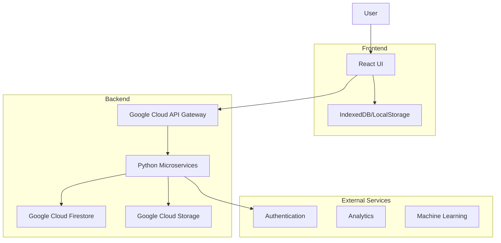

### Key Components

1. **Frontend**
   - Technology Stack: React, TypeScript, Tailwind CSS
   - Responsibilities:
     - User interface rendering
     - Local state management
     - Offline capabilities
     - Real-time collaboration interface

2. **Backend**
   - Technology Stack: Python, Flask/FastAPI
   - Responsibilities:
     - Business logic implementation
     - Data processing and manipulation
     - Integration with external services
     - API endpoints for frontend communication

3. **Database**
   - Technology: Google Cloud Firestore
   - Stores:
     - User data
     - Document metadata
     - Collaboration information

4. **Storage**
   - Technology: Google Cloud Storage
   - Stores:
     - Document content
     - Media files
     - Version history

5. **API Gateway**
   - Technology: Google Cloud API Gateway
   - Responsibilities:
     - Request routing
     - Authentication and authorization
     - Rate limiting
     - API versioning

6. **External Services**
   - Authentication: Google Cloud Identity Platform
   - Analytics: Google Analytics
   - Machine Learning: Google Cloud AI Platform (for advanced features like grammar checking and content suggestions)

### Key Features

1. **Document Editing**
   - Rich text editing with real-time formatting
   - Support for various document elements (tables, images, charts)
   - Version history and change tracking

2. **Collaboration**
   - Real-time co-authoring
   - Comments and annotations
   - Document sharing with customizable permissions

3. **Cross-Platform Compatibility**
   - Web application (React-based PWA)
   - Desktop applications for Windows and macOS (Electron-based)
   - Mobile applications for iOS and Android (React Native)

4. **Cloud Integration**
   - Automatic saving and syncing across devices
   - Integration with Google Drive and other cloud storage providers

5. **Advanced Features**
   - AI-powered grammar and style suggestions
   - Template management
   - Mail merge functionality
   - Add-in support for extensibility

### System Interactions

| Component | Interacts With | Purpose |
|-----------|----------------|---------|
| Frontend | API Gateway | Send/receive data, user actions |
| Frontend | Local Storage | Offline capabilities, caching |
| API Gateway | Backend Services | Route requests, enforce policies |
| Backend Services | Database | CRUD operations on user and document data |
| Backend Services | Storage | Manage document content and media |
| Backend Services | External Services | Authentication, analytics, ML features |

This system overview provides a high-level understanding of Microsoft Word's architecture, key components, and interactions. The use of React and TypeScript for the frontend, Python for the backend, and Google Cloud services for infrastructure ensures a modern, scalable, and maintainable system that can deliver a powerful word processing experience across various platforms.

# SYSTEM ARCHITECTURE

## PROGRAMMING LANGUAGES

The Microsoft Word project will utilize the following programming languages:

| Language   | Purpose                                      | Justification                                                                                                   |
|------------|----------------------------------------------|------------------------------------------------------------------------------------------------------------------|
| TypeScript | Frontend development                         | Provides static typing for improved code quality and developer productivity in large-scale React applications    |
| JavaScript | Frontend runtime                             | Native language for web browsers, used in conjunction with TypeScript                                             |
| Python     | Backend development                          | Versatile language with excellent libraries for text processing, API development, and cloud service integration  |
| SQL        | Database queries                             | For complex data queries and reporting, used with Google Cloud SQL                                                |
| HTML5      | Document structure                           | Standard markup language for web-based interfaces                                                                 |
| CSS3       | Styling                                      | Used with Tailwind CSS for efficient and responsive design                                                        |

## HIGH-LEVEL ARCHITECTURE DIAGRAM

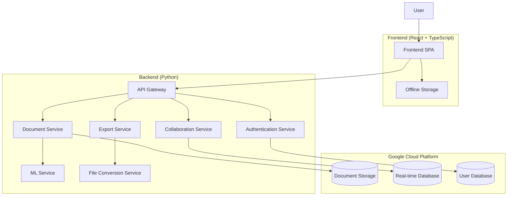

## COMPONENT DIAGRAMS

### Frontend Components

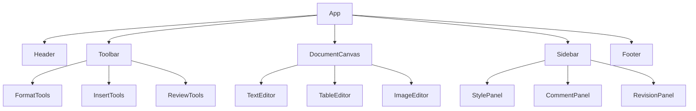

### Backend Components

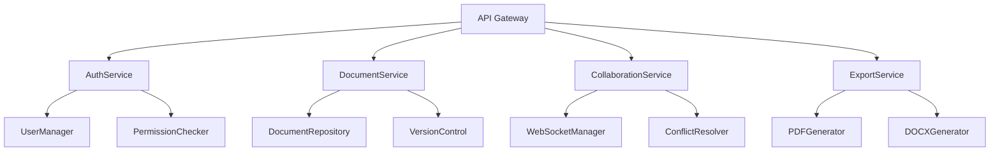

## SEQUENCE DIAGRAMS

### Document Editing Sequence

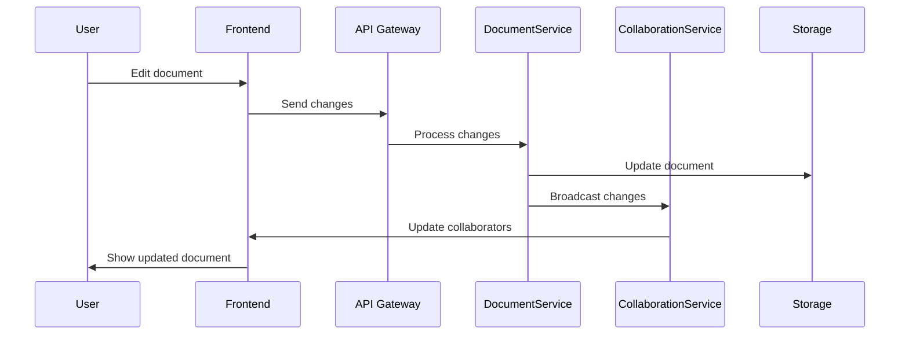

### Export Document Sequence

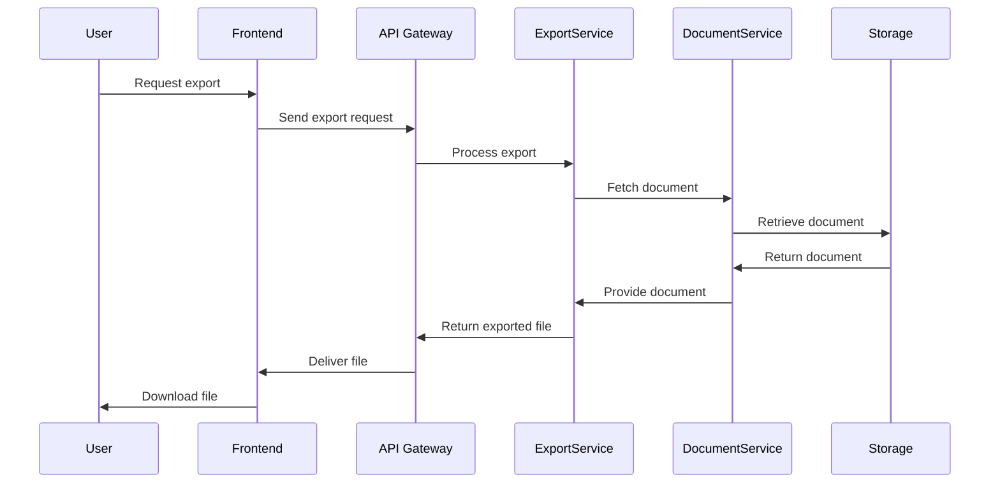

## DATA-FLOW DIAGRAM

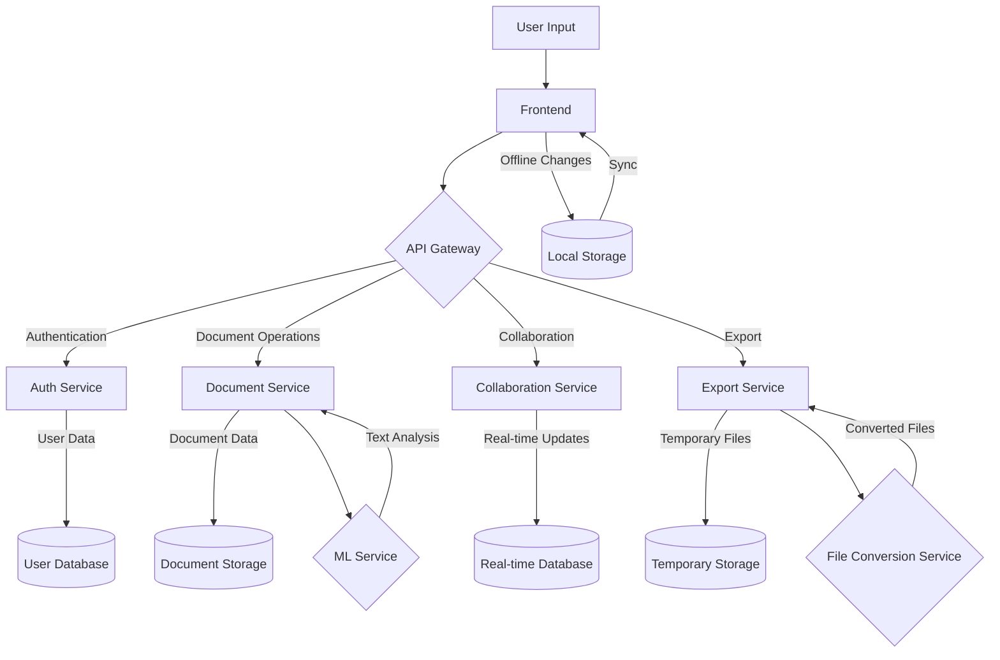

This data-flow diagram illustrates how information moves through the Microsoft Word system:

1. User input is captured by the Frontend (React + TypeScript).
2. The Frontend communicates with the backend services through the API Gateway.
3. Authentication Service manages user data and permissions.
4. Document Service handles CRUD operations on documents, interacting with Document Storage.
5. Collaboration Service manages real-time updates using a Real-time Database.
6. Export Service generates different file formats, using temporary storage when necessary.
7. ML Service provides text analysis and suggestions to the Document Service.
8. File Conversion Service assists the Export Service in creating various file formats.
9. Local Storage is used for offline functionality, syncing with the backend when online.

This architecture ensures efficient data flow, scalability, and separation of concerns, while leveraging Google Cloud services for robust and reliable performance.

# SYSTEM DESIGN

## PROGRAMMING LANGUAGES

The Microsoft Word project will utilize the following programming languages:

| Language   | Purpose                                      | Justification                                                                                                   |
|------------|----------------------------------------------|------------------------------------------------------------------------------------------------------------------|
| TypeScript | Frontend development                         | Provides static typing for improved code quality and developer productivity in large-scale React applications    |
| JavaScript | Frontend runtime                             | Native language for web browsers, used in conjunction with TypeScript                                             |
| Python     | Backend development                          | Versatile language with excellent libraries for text processing, API development, and cloud service integration  |
| SQL        | Database queries                             | For complex data queries and reporting, used with Google Cloud SQL                                                |
| HTML5      | Document structure                           | Standard markup language for web-based interfaces                                                                 |
| CSS3       | Styling                                      | Used with Tailwind CSS for efficient and responsive design                                                        |

## DATABASE DESIGN

Microsoft Word will use a combination of Google Cloud Firestore (a NoSQL database) for flexible document storage and Google Cloud SQL for structured data. Here's an overview of the database design:

### Google Cloud Firestore (NoSQL)

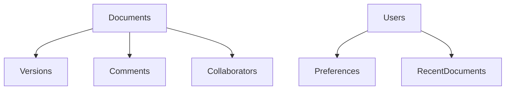

1. Documents Collection:
   - document_id (string)
   - title (string)
   - owner_id (string)
   - created_at (timestamp)
   - last_modified (timestamp)
   - content (string, base64 encoded)

2. Versions Subcollection:
   - version_id (string)
   - timestamp (timestamp)
   - changes (array of operations)

3. Comments Subcollection:
   - comment_id (string)
   - user_id (string)
   - content (string)
   - timestamp (timestamp)
   - resolved (boolean)

4. Users Collection:
   - user_id (string)
   - email (string)
   - display_name (string)
   - created_at (timestamp)

### Google Cloud SQL (Relational)

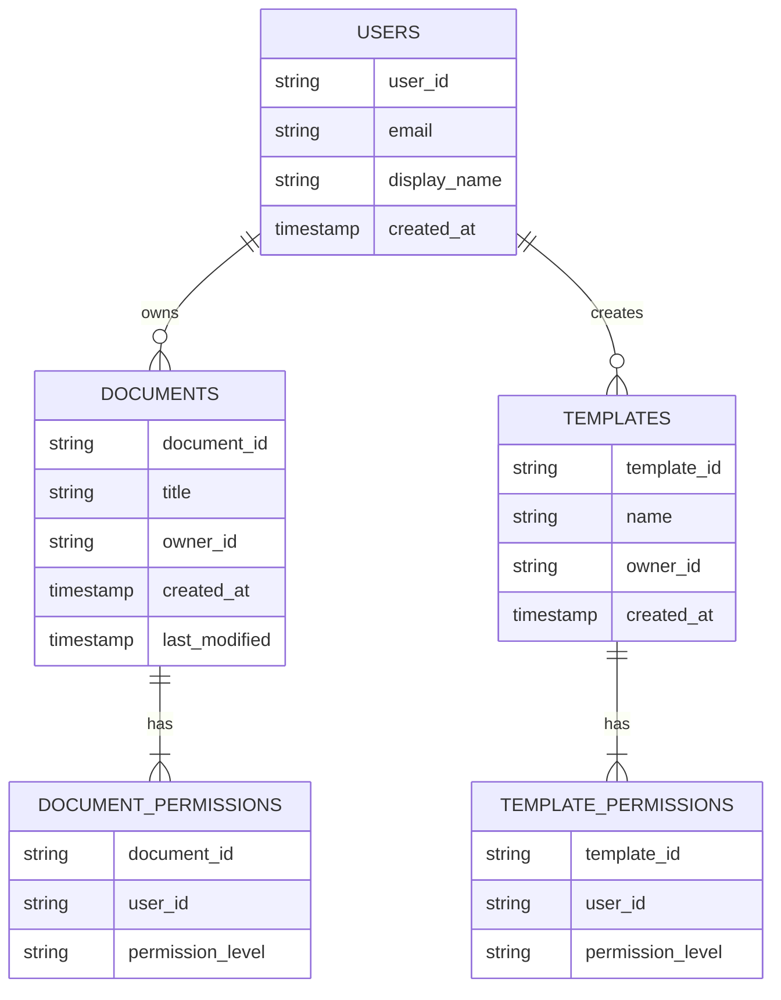

This hybrid approach allows for flexible document storage in Firestore while maintaining structured relationships and efficient querying capabilities in Cloud SQL.

## API DESIGN

The Microsoft Word API will be designed as a RESTful API using Python FastAPI for the backend. Here's an overview of the main endpoints:

```mermaid
graph TD
    A[API Gateway] --> B[/auth]
    A --> C[/documents]
    A --> D[/users]
    A --> E[/templates]
    
    B --> B1[POST /login]
    B --> B2[POST /logout]
    B --> B3[POST /refresh]
    
    C --> C1[GET /documents]
    C --> C2[POST /documents]
    C --> C3[GET /documents/{id}]
    C --> C4[PUT /documents/{id}]
    C --> C5[DELETE /documents/{id}]
    C --> C6[POST /documents/{id}/share]
    
    D --> D1[GET /users/me]
    D --> D2[PUT /users/me]
    D --> D3[GET /users/{id}/documents]
    
    E --> E1[GET /templates]
    E --> E2[POST /templates]
    E --> E3[GET /templates/{id}]
    E --> E4[PUT /templates/{id}]
    E --> E5[DELETE /templates/{id}]
```

Example API endpoint specification:

```python
@app.post("/documents", response_model=Document)
async def create_document(document: DocumentCreate, current_user: User = Depends(get_current_user)):
    """
    Create a new document for the authenticated user.
    """
    new_document = await document_service.create_document(document, current_user.id)
    return new_document
```

The API will use JWT for authentication and will include proper error handling, rate limiting, and documentation using FastAPI's built-in Swagger UI.

## USER INTERFACE DESIGN

The Microsoft Word user interface will be built using React with TypeScript and styled using Tailwind CSS. Here's an overview of the main components:

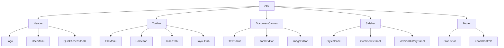

Example React component using TypeScript and Tailwind CSS:

```tsx
import React from 'react';

interface ToolbarProps {
  onBoldClick: () => void;
  onItalicClick: () => void;
  onUnderlineClick: () => void;
}

const Toolbar: React.FC<ToolbarProps> = ({ onBoldClick, onItalicClick, onUnderlineClick }) => {
  return (
    <div className="flex items-center space-x-2 bg-gray-100 p-2 rounded-md">
      <button
        onClick={onBoldClick}
        className="px-3 py-1 bg-white rounded hover:bg-gray-200 focus:outline-none focus:ring-2 focus:ring-blue-500"
      >
        <span className="font-bold">B</span>
      </button>
      <button
        onClick={onItalicClick}
        className="px-3 py-1 bg-white rounded hover:bg-gray-200 focus:outline-none focus:ring-2 focus:ring-blue-500"
      >
        <span className="italic">I</span>
      </button>
      <button
        onClick={onUnderlineClick}
        className="px-3 py-1 bg-white rounded hover:bg-gray-200 focus:outline-none focus:ring-2 focus:ring-blue-500"
      >
        <span className="underline">U</span>
      </button>
    </div>
  );
};

export default Toolbar;
```

The user interface will be responsive, accessible, and follow Microsoft's Fluent Design System principles while leveraging the flexibility and utility-first approach of Tailwind CSS. The use of React and TypeScript will ensure a component-based architecture with strong typing for improved maintainability and developer experience.

# TECHNOLOGY STACK

## PROGRAMMING LANGUAGES

| Language   | Purpose                                      | Justification                                                                                                   |
|------------|----------------------------------------------|------------------------------------------------------------------------------------------------------------------|
| TypeScript | Frontend development                         | Provides static typing for improved code quality and developer productivity in large-scale React applications    |
| JavaScript | Frontend runtime                             | Native language for web browsers, used in conjunction with TypeScript                                             |
| Python     | Backend development                          | Versatile language with excellent libraries for text processing, API development, and cloud service integration  |
| SQL        | Database queries                             | For complex data queries and reporting, used with Google Cloud SQL                                                |
| HTML5      | Document structure                           | Standard markup language for web-based interfaces                                                                 |
| CSS3       | Styling                                      | Used with Tailwind CSS for efficient and responsive design                                                        |

## FRAMEWORKS AND LIBRARIES

### Frontend

1. React: JavaScript library for building user interfaces
2. React Router: Declarative routing for React applications
3. Redux: State management library for React applications
4. Tailwind CSS: Utility-first CSS framework for rapid UI development
5. Axios: Promise-based HTTP client for API requests
6. Draft.js: Rich text editor framework for React
7. React Testing Library: Testing utility for React components

### Backend

1. FastAPI: Modern, fast (high-performance) web framework for building APIs with Python
2. SQLAlchemy: SQL toolkit and Object-Relational Mapping (ORM) library for Python
3. Pydantic: Data validation and settings management using Python type annotations
4. Pytest: Testing framework for Python
5. Celery: Distributed task queue for Python
6. Gunicorn: WSGI HTTP Server for UNIX

### Shared

1. ESLint: Static code analysis tool for identifying problematic patterns in JavaScript code
2. Prettier: Code formatter for consistent code style
3. Git: Version control system

## DATABASES

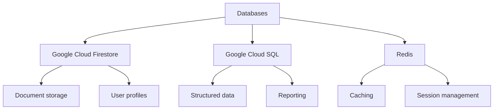

1. Google Cloud Firestore: NoSQL document database for flexible, scalable data storage
   - Used for storing document content, user profiles, and collaboration data

2. Google Cloud SQL (PostgreSQL): Fully managed relational database service
   - Used for structured data, complex queries, and reporting

3. Redis (Google Cloud Memorystore): In-memory data structure store
   - Used for caching and session management to improve performance

## THIRD-PARTY SERVICES

1. Google Cloud Platform:
   - Google Cloud Storage: Object storage for document files and media
   - Google Cloud Functions: Serverless compute platform for event-driven backend services
   - Google Cloud Pub/Sub: Messaging service for real-time collaboration features
   - Google Cloud Identity Platform: Authentication and user management service

2. External APIs:
   - Google Drive API: For integration with Google Drive storage
   - Microsoft Graph API: For interoperability with other Microsoft Office products
   - Grammarly API: For advanced grammar and style checking

3. Analytics and Monitoring:
   - Google Analytics: Web analytics service for tracking user behavior
   - Google Cloud Monitoring: Monitoring and logging service for application performance
   - Sentry: Error tracking and performance monitoring

4. Content Delivery:
   - Google Cloud CDN: Content Delivery Network for fast asset delivery

5. Machine Learning Services:
   - Google Cloud Natural Language API: For advanced text analysis and content suggestions
   - Google Cloud Vision API: For image recognition and processing in documents

6. Payment Processing:
   - Stripe API: For handling subscription payments and billing

7. Email Services:
   - SendGrid: For transactional emails and notifications

This technology stack leverages the power of TypeScript and React for a robust frontend, Python for a versatile backend, and Google Cloud services for scalable infrastructure. The combination of these technologies will enable the development of a high-performance, feature-rich word processing application that meets the requirements outlined in the previous sections of the Technical Specifications.

# SECURITY CONSIDERATIONS

## AUTHENTICATION AND AUTHORIZATION

Microsoft Word will implement a robust authentication and authorization system to ensure secure access to the application and its features. The system will utilize Google Cloud Identity Platform for user authentication and Google Cloud Identity and Access Management (IAM) for authorization.

### Authentication

1. Multi-factor Authentication (MFA):
   - Implement MFA using Google Cloud Identity Platform
   - Support SMS, email, and authenticator app options for second factor

2. Single Sign-On (SSO):
   - Support OAuth 2.0 and OpenID Connect protocols
   - Integrate with popular identity providers (Google, Microsoft, Facebook)

3. Password Policies:
   - Enforce strong password requirements (minimum length, complexity)
   - Implement password history and expiration policies

4. Account Recovery:
   - Provide secure account recovery options (email, security questions)
   - Implement rate limiting on recovery attempts to prevent abuse

### Authorization

1. Role-Based Access Control (RBAC):
   - Define user roles (e.g., Reader, Editor, Admin)
   - Implement fine-grained permissions for document access and editing

2. Document-level Permissions:
   - Allow document owners to set specific access rights for collaborators
   - Support inheritance of permissions from parent folders/directories

3. API Access Control:
   - Use JSON Web Tokens (JWT) for API authentication
   - Implement OAuth 2.0 scopes for granular API access control

4. Session Management:
   - Implement secure session handling with automatic timeout
   - Use HTTP-only, secure cookies for session tokens

### Implementation

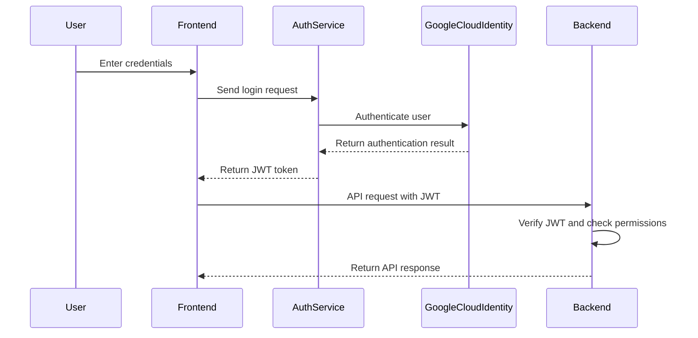

The authentication flow will be implemented using React components for the frontend, with API calls to the Python backend. The backend will interface with Google Cloud Identity Platform for user authentication and token management.

## DATA SECURITY

Microsoft Word will implement comprehensive data security measures to protect sensitive information throughout its lifecycle.

1. Encryption:
   - Data at rest: Use Google Cloud Storage with default encryption
   - Data in transit: Implement TLS 1.3 for all network communications

2. Data Classification:
   - Implement a data classification system (e.g., Public, Internal, Confidential)
   - Apply security controls based on data classification

3. Access Controls:
   - Implement least privilege principle for data access
   - Use Google Cloud IAM for managing access to cloud resources

4. Data Masking and Anonymization:
   - Apply data masking techniques for sensitive information in non-production environments
   - Implement anonymization for data used in analytics and reporting

5. Secure Data Deletion:
   - Implement secure deletion procedures for user data and documents
   - Use Google Cloud Key Management Service for cryptographic erasure

6. Data Loss Prevention (DLP):
   - Integrate Google Cloud DLP API to detect and protect sensitive data
   - Implement content scanning for documents to prevent data leakage

### Data Security Matrix

| Data Type | Classification | Encryption | Access Control | Retention Policy |
|-----------|----------------|------------|----------------|-------------------|
| User Credentials | Confidential | At rest & In transit | Strict, Need-to-know | Until account deletion |
| Document Content | Internal | At rest & In transit | Role-based | User-defined, default 7 years |
| User Activity Logs | Internal | At rest | Role-based | 1 year |
| Application Configs | Confidential | At rest & In transit | Strict, Need-to-know | Lifetime of application |

## SECURITY PROTOCOLS

Microsoft Word will adhere to industry-standard security protocols and best practices to maintain a robust security posture.

1. Secure Development Lifecycle (SDL):
   - Implement security requirements gathering
   - Conduct threat modeling during design phase
   - Perform regular code reviews and static analysis
   - Conduct penetration testing before major releases

2. Vulnerability Management:
   - Implement a vulnerability disclosure program
   - Conduct regular vulnerability scans using Google Cloud Security Scanner
   - Establish a patch management process for timely updates

3. Incident Response:
   - Develop and maintain an incident response plan
   - Implement automated alerting for security events
   - Conduct regular incident response drills

4. Compliance:
   - Ensure compliance with relevant standards (e.g., ISO 27001, SOC 2)
   - Implement controls to meet GDPR and CCPA requirements
   - Conduct regular compliance audits

5. Security Monitoring and Logging:
   - Implement centralized logging using Google Cloud Logging
   - Set up real-time security monitoring with Google Cloud Security Command Center
   - Establish log retention policies in compliance with legal requirements

6. Network Security:
   - Implement network segmentation using Google Cloud VPC
   - Use Web Application Firewall (WAF) for protecting web interfaces
   - Implement DDoS protection using Google Cloud Armor

### Security Monitoring Architecture

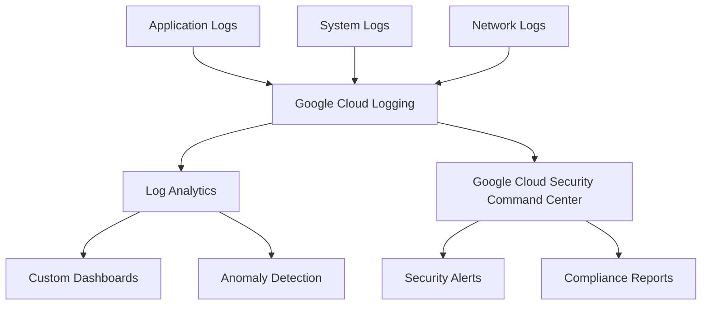

7. Third-party Security:
   - Implement a vendor risk management program
   - Conduct security assessments for third-party integrations
   - Ensure secure API integrations with external services

8. Security Awareness:
   - Provide regular security training for development team
   - Implement a security champion program within development teams
   - Conduct phishing simulations and awareness campaigns for users

By implementing these security considerations, Microsoft Word will maintain a strong security posture, protecting user data and ensuring the integrity and confidentiality of the application. The use of Google Cloud services, combined with best practices in authentication, authorization, and security protocols, will provide a robust foundation for a secure word processing application.