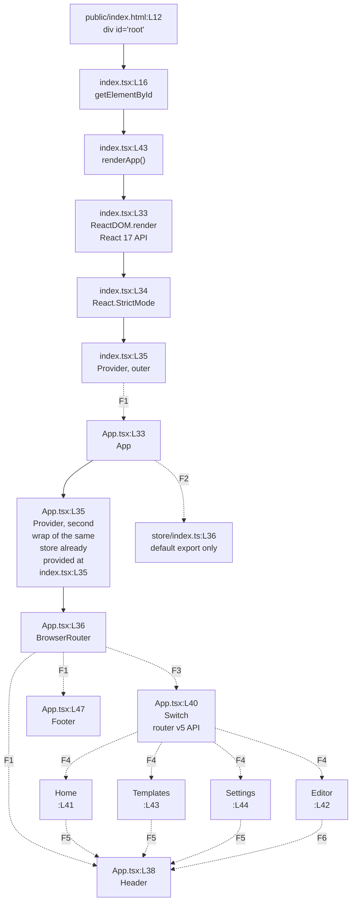

# frontend/src

## Purpose

The directory is the source root of the browser application. Two modules sit here: `index.tsx` mounts the application into
the page, and `App.tsx` composes the providers, the shell and the route table. Six subdirectories hold everything else, and
each one carries its own README.

The directory owns no business logic and no network call. Its job is to turn a static HTML page into a running React tree and
to name the four routes that tree serves. Nothing here runs today, for the reasons Known Limitations records.

## Key Components

| Component | Type | Location | Description |
| --- | --- | --- | --- |
| `renderApp` | Module-private function | `index.tsx:L27` | Mounts the tree through `ReactDOM.render` at `index.tsx:L33`. Declared `const` with no `export`, so the module exports nothing. `index.tsx:L43` invokes it at module evaluation. |
| `rootElement` | Module-private constant | `index.tsx:L16` | Result of `document.getElementById('root')`. The one failure path logs at `index.tsx:L29` and returns at `:L30`. |
| `App` | React component, default export | `App.tsx:L33`, exported at `:L54` | Wraps a second react-redux `Provider` at `:L35`, a `BrowserRouter` at `:L36`, and the shell and route table below. Propless and stateless. |
| `components/` | Subdirectory | [components/README.md](components/README.md) | Eight shell and editor components. |
| `pages/` | Subdirectory | [pages/README.md](pages/README.md) | Four routed pages. |
| `schema/` | Subdirectory | [schema/README.md](schema/README.md) | Three Zod contract modules. |
| `services/` | Subdirectory | [services/README.md](services/README.md) | Axios and Socket.IO clients. |
| `store/` | Subdirectory | [store/README.md](store/README.md) | Store composition and two slices. |
| `utils/` | Subdirectory | [utils/README.md](utils/README.md) | Formatting, validation and serialization helpers. |

`frontend/public/index.html` has no README of its own and is documented here. `index.html:L6` sets the title, `:L7` links a
favicon and `:L8` links a web app manifest. Neither linked asset is committed, because `frontend/public/` holds only
`index.html`, and the same absence explains the `/microsoft-word-logo.png` reference at `components/Header.tsx:L36`.

## Architecture Fit

The directory sits between the static page and every feature module. `index.tsx` is the entry point, `App.tsx` is the
composition root, and the six subdirectories form the layers below it. Nothing in the repository imports these two modules,
so the tree they build is the whole client. The wider map lives in [the architecture
overview](../../docs/architecture-overview.md).

The in-repository specification serves as a point of comparison rather than a source of truth. Its `## HIGH-LEVEL
ARCHITECTURE DIAGRAM` heading at `documentation/Technical Specifications.md:L140` places a frontend single-page application
behind an API gateway and beside an offline-storage node. The code matches the single-page placement only. No offline-storage
module exists, and `services/api.ts:L33` points an Axios instance at an environment variable rather than a gateway.

The `## USER INTERFACE DESIGN` heading at `documentation/Technical Specifications.md:L449` gives an intended tree in which
`App` renders `Header`, `Toolbar`, `DocumentCanvas`, `Sidebar` and `Footer`. `App.tsx:L37-L48` renders `Header`, a routed
`main` region and `Footer` only, and `pages/Editor.tsx` renders the other three.

## Dependencies

### Internal

| Import | Site | State |
| --- | --- | --- |
| `@/App` | `index.tsx:L13` | Default import of the default export at `App.tsx:L54`. Form correct, prefix unresolvable. |
| `@/store` | `index.tsx:L14` | Default import of the default export at `store/index.ts:L36`. Form correct, and the reference point for the line below. |
| `@/store/index` | `App.tsx:L20` | Named import written `{ store }`. `store/index.ts` exports `store` as a default only, plus the types `RootState` at `:L32` and `AppDispatch` at `:L34`. The named binding resolves to nothing. |
| `@/components/Header`, `@/components/Footer` | `App.tsx:L14-L15` | Default imports of default exports. Form correct, prefix unresolvable. |
| `@/pages/Home`, `@/pages/Editor`, `@/pages/Templates`, `@/pages/Settings` | `App.tsx:L16-L19` | Default imports of default exports. Form correct, prefix unresolvable. |

### External

| Package | Range | Declared at | Notes |
| --- | --- | --- | --- |
| `@reduxjs/toolkit` | `^1.9.5` | `frontend/package.json:L7` | Used by `store/`. |
| `react` | `^18.2.0` | `frontend/package.json:L8` | Imported at `index.tsx:L10` and `App.tsx:L11`. |
| `react-dom` | `^18.2.0` | `frontend/package.json:L9` | `index.tsx:L33` calls `ReactDOM.render`, the React 17 legacy API. |
| `react-redux` | `^8.0.5` | `frontend/package.json:L10` | `Provider` at `index.tsx:L35` and again at `App.tsx:L35`. |
| `react-router-dom` | `^6.11.1` | `frontend/package.json:L11` | Version 6 removed `Switch`, the `component` prop and `exact`. `App.tsx` uses all three. |
| `tailwindcss` | `^3.3.2` | `frontend/package.json:L12` | Declared and never configured. |
| `typescript` | `^4.9.5` | `frontend/package.json:L13` | Compiler only. |

`frontend/package.json:L15-L30` declares fourteen development dependencies, with `react-scripts` pinned exactly at `5.0.1` on
`:L29` and no caret.

Four packages appear in import statements under this tree and in no dependency block: `axios`, `draft-js`, `zod` and
`socket.io-client`. A fifth undeclared package, `@types/draft-js`, appears in no import statement at all. TypeScript resolves
the `draft-js` declarations from it rather than from an import, so `tsc` needs it installed while a grep for the name finds
nothing. Two of the five are named by the specification, Axios at `documentation/Technical Specifications.md:L544` and
Draft.js at `:L545`, while Zod and socket.io-client appear nowhere in `documentation/`. Contract shapes travel through [the
data model](../../docs/data-model.md), and the external services these clients target are listed in [the integration
guide](../../docs/integration-guide.md).

## Configuration

| Setting | Value and site | State |
| --- | --- | --- |
| `REACT_APP_API_BASE_URL` | Read at `services/api.ts:L21` | READ-BUT-NEVER-DECLARED. The only `process.env` reference in all of `frontend/src`. |
| `REACT_APP_API_URL` | `http://backend:5000` at `infrastructure/docker/docker-compose.yml:L11` | DECLARED-BUT-NEVER-READ. No module reads the name. |
| `baseUrl` | `src` at `frontend/tsconfig.json:L9` | DECLARED. Roots every path mapping below it. |
| `paths` | Five aliases at `frontend/tsconfig.json:L10-L16` | DECLARED. `@components/*` `:L11`, `@utils/*` `:L12`, `@styles/*` `:L13`, `@hooks/*` `:L14`, `@services/*` `:L15`. `src/styles` and `src/hooks` do not exist. |
| `strict` | `true` at `frontend/tsconfig.json:L3` | DECLARED. |
| `noEmit` | `true` at `frontend/tsconfig.json:L25` | DECLARED. Type checking produces no output files. |
| `browserslist` | `frontend/package.json:L45-L56` | DECLARED. Separate production and development target lists. |

The two environment variable names differ, so the client resolves an undefined base URL and every request from the shared
instance targets the page origin.

`frontend/package.json:L31-L38` declares six scripts: `start` `:L32`, `build` `:L33`, `test` `:L34`, `eject` `:L35`, `lint`
`:L36` and `format` `:L37`. No type-check script and no documentation script exists. The `format` glob on `:L37` covers
`src/**/*.{js,jsx,ts,tsx,json,css,scss,md}`, so the seven READMEs under `src/` fall inside its reach. No `engines` field and
no `.nvmrc` is committed, so the Node floor is asserted only in `README.md:L22`, `.github/workflows/ci.yml:L17` and
`infrastructure/docker/frontend.Dockerfile:L2`, all three at Node 14.

## Data Flows

One flow starts here. The browser loads `index.html`, `index.tsx:L43` calls `renderApp`, and `ReactDOM.render` at `:L33`
mounts `React.StrictMode` around a `Provider` around `App`. `App.tsx:L35` then wraps a second `Provider` around the same
store, `:L36` opens the router, and `:L41-L44` bind four paths. Each matched page renders its own `Header` again, and three
of the four render their own `Footer` again.



The four route nodes carry their `App.tsx` line only. Each page also renders its own shell, which is what `F5` and `F6`
record.

| Key | Edge | The unresolved boundary |
| --- | --- | --- |
| F1 | `Provider` to `App`, and `BrowserRouter` to `Header` and `Footer` | The `@/` prefix. `index.tsx:L13` reaches `App` through it and `App.tsx:L14-L15` reach the two shell components, while `tsconfig.json:L10-L16` declares five path aliases and none of them is `@/`. All 44 `@/` imports across 13 of the 26 modules fail the same way, and `react-scripts` 5 would not apply the `paths` block to webpack resolution in any case |
| F2 | `App` to `store/index.ts` | `App.tsx:L20` names `{ store }`, while `store/index.ts:L36` exports a default only |
| F3 | `BrowserRouter` to `Switch` | `App.tsx:L12` imports `Switch` from `react-router-dom`, and `frontend/package.json:L11` declares `^6.11.1`, which removed the element |
| F4 | `Switch` to the four routes | Two boundaries at once. Each page arrives through the `@/` prefix at `App.tsx:L16-L19`, and `:L41-L44` pass the `component` prop that version 6 removed, with `exact` alongside it at `:L41` |
| F5 | `Home`, `Templates` and `Settings` to `Header` | Doubled shell: banner and contentinfo twice, neither copy named. Each page renders its own `Header` and `Footer` inside the pair `App.tsx:L38` and `:L47` already provides, at `Home.tsx:L32` and `:L48`, `Templates.tsx:L87` and `:L108`, and `Settings.tsx:L61` and `:L88` |
| F6 | `Editor` to `Header` | Doubled banner only, neither copy named. `Editor.tsx:L107` renders a second `Header` and no `Footer` |

The second `Provider` at `App.tsx:L35` is redundant rather than broken, so the node states it instead of drawing an edge back
to `index.tsx:L35`.

## Design Patterns

Composition root, with provider composition on top of it. `index.tsx` performs the mount and `App.tsx` performs the
composition, so the two concerns live in separate modules. A react-redux `Provider` supplies the store to the tree through
context, and two nested `Provider` elements wrap the same store, at `index.tsx:L35` and `App.tsx:L35`.

Central route table over a unidirectional single store. `App.tsx:L40-L45` holds every path the application declares, so route
registration sits in one place rather than beside each page. One store, created at `store/index.ts:L24`, holds shared client
state, and a consumer changes that state by dispatching an action.

Container and presentational split, applied partially. `pages/` holds the routed containers that read state and call
services, and `components/` holds the parts they compose. Three of the eight components break the split by reaching the store
themselves instead of taking data through props. `components/Header.tsx:L30` selects the current user,
`components/Toolbar.tsx:L35` takes a dispatcher, and `components/DocumentCanvas.tsx:L35-L36` takes both. The split therefore
holds for five components.

Schema at the boundary, declared once and honored for one record. `schema/user.ts:L30` exports an inferred `User` type and
`store/userSlice.ts:L13` imports it, which is the pattern working end to end. The other two records break it.
`schema/document.ts` exports two Zod objects and no inferred type, so `store/documentSlice.ts:L15` imports a `Document` the
module never declares. `pages/Templates.tsx:L25-L30` restates the template shape locally, adding `description` and
`thumbnail` that `schema/template.ts:L21-L28` never declares, and imports no schema module at all.

## Known Limitations

Every item below sits in the committed code, and none is repaired here.

- **The `@/` prefix resolves nowhere.** `frontend/tsconfig.json:L10-L16` declares five path aliases and none of them is `@/`,
while 44 executable import statements across 13 of the 26 modules under `frontend/src` use that prefix. Adding the alias
would fix only the compiler, because `react-scripts` 5.0.1 at `frontend/package.json:L29` resolves modules through webpack
and reads no `paths` block.
- **The verified type-check profile is 76 errors.** `tsc --noEmit` reports 57 `TS2307`, 6 `TS2305`, 5 `TS7006`, 4 `TS2322`, 2
`TS2614`, 1 `TS2552` and 1 `TS2339`. The 57 module-resolution errors decompose exactly: 44 from the `@/` prefix, plus 13 from
undeclared packages, being 6 `draft-js` importers, 4 `zod` importers, 2 `axios` importers and 1 `socket.io-client` importer.
- **Two error codes share one cause.** Modules under `services/`, `store/` and `utils/` import siblings with relative paths,
so their paths resolve and their failures read `TS2305` or `TS2614`. Modules under `components/` and `pages/` import through
`@/`, so their failures read `TS2307`.
- **`npm ci` fails in two places for two reasons.** `infrastructure/docker/frontend.Dockerfile:L11` fails because no lockfile
is committed, and `.github/workflows/ci.yml:L19` fails because it runs at the repository root, where no `package.json`
exists. A plain `npm install` inside `frontend/` succeeds, which is what `README.md:L36` instructs. The resolved count
follows the public registry, so with no lockfile committed it is not reproducible: two observed runs resolved 1,532 and 1,492
packages.
- **The client base URL is undefined.** `services/api.ts:L21` reads `REACT_APP_API_BASE_URL` while
`infrastructure/docker/docker-compose.yml:L11` injects `REACT_APP_API_URL`.
- **Three react-router-dom version 5 APIs sit against a version 6 range.** `App.tsx:L12` imports `Switch`, `:L41` sets
`exact`, and `:L41-L44` pass the `component` prop. `frontend/package.json:L11` declares `^6.11.1`, which removed all three.
- **`index.tsx:L33` calls the React 17 legacy `ReactDOM.render`** against `react-dom` `^18.2.0` at
`frontend/package.json:L9`.
- **The store is provided twice and the shell renders twice.** `App.tsx:L35` repeats the `Provider` already set at
`index.tsx:L35`. `App.tsx:L38` and `:L47` render `Header` and `Footer` around every route, while `pages/Home.tsx` (`:L32`,
`:L48`), `pages/Templates.tsx` (`:L87`, `:L108`) and `pages/Settings.tsx` (`:L61`, `:L88`) each render their own pair.
`pages/Editor.tsx:L107` renders a second `Header` and no `Footer`, so the banner duplicates on four routes and the footer on
three.
- **The doubled shell puts two unnamed navigation landmarks on every route.** Both `Header` copies render the same `nav` at
`components/Header.tsx:L40` with no `aria-label`, so assistive technology announces two identical navigation regions and a
reader cannot tell them apart. The `contentinfo` landmark duplicates the same way through `components/Footer.tsx:L23` on
three routes. Each surviving landmark needs a distinct accessible name, and removing the duplicate render comes first. [The
components README](components/README.md) records the same defect against the markup.
- **Five links target paths the route table never declares.** `components/Header.tsx:L43` links `/documents` and `:L55` links
`/login`. `pages/Home.tsx:L37`, `:L40` and `:L43` link `/new-document`, `/open-document` and `/recent-documents`.
`App.tsx:L41-L44` declares `/`, `/editor`, `/templates` and `/settings`, and matches none of the five.
- **Two styling conventions coexist and no authored rule backs either one.** Tailwind utility classes appear in exactly two
modules, `components/Header.tsx` and the body of `pages/Templates.tsx`. Bespoke semantic class names appear in
`components/Footer.tsx`, `components/Sidebar.tsx`, `components/Toolbar.tsx`, `components/DocumentCanvas.tsx`,
`pages/Home.tsx`, `pages/Editor.tsx`, `pages/Settings.tsx` and the wrapper of `pages/Templates.tsx`, which therefore carries
both conventions. No `tailwind.config.js`, no `postcss.config.js` and no stylesheet is committed anywhere, so once the build
blockers above are cleared no authored styling would apply under either convention. `frontend/package.json` declares no
component library and no design system, which makes the split a styling inconsistency rather than a compliance gap.
- **No frontend test file exists anywhere under `frontend/`,** so the `test` script at `frontend/package.json:L34` and the
three Testing Library development dependencies at `:L16-L18` have nothing to run.
- **Three referenced public assets are absent:** the favicon at `frontend/public/index.html:L7`, the manifest at `:L8` and
the logo at `components/Header.tsx:L36`.
- **The two modules here carry no assistance marker and no outstanding-work comment.** Every such note in the tree sits in
the six subdirectories, and each sibling README cites its own by file and line.

[The troubleshooting register](../../docs/troubleshooting.md) carries every defect above with evidence.

## Usage Examples

Prerequisites and runtime versions live in [the onboarding guide](../../docs/onboarding.md).

The bootstrap sequence runs four statements in this order:

```text
public/index.html:L12   the page supplies <div id="root">
index.tsx:L16           rootElement = document.getElementById('root')
index.tsx:L43           renderApp() runs at module evaluation
index.tsx:L33           ReactDOM.render mounts StrictMode > Provider > App
```

Cannot run: `index.tsx:L13` and `:L14` import through the `@/` prefix, which `frontend/tsconfig.json:L10-L16` never maps, so
the module fails resolution before the mount.

Installing and type-checking the client:

```bash
cd frontend
npm install            # succeeds; the resolved package count is not fixed
npx tsc --noEmit       # runs to completion and exits nonzero, reporting 76 errors
npm ci                 # fails, no lockfile is committed
```

Registering a route follows the shape `App.tsx:L40-L45` already uses:

```tsx
<Switch>
  <Route exact path="/" component={Home} />
  <Route path="/editor" component={Editor} />
  <Route path="/documents" component={Documents} />
</Switch>
```

Cannot run: `Switch`, `exact` and the `component` prop are react-router-dom version 5 APIs, and `frontend/package.json:L11`
declares `^6.11.1`.

Repair work is recorded here rather than performed, and each step below unblocks the next. Export an inferred `Document` type
from `schema/document.ts`, following `schema/user.ts:L30`, then add `useAppSelector` and `useAppDispatch` to
`store/index.ts`, which seven modules import. Add the `updateDocument` action and the two absent selectors, reconcile
`owner_id` against `user_id` using [the data model](../../docs/data-model.md), then connect the collaboration client
described in [the services README](services/README.md).
