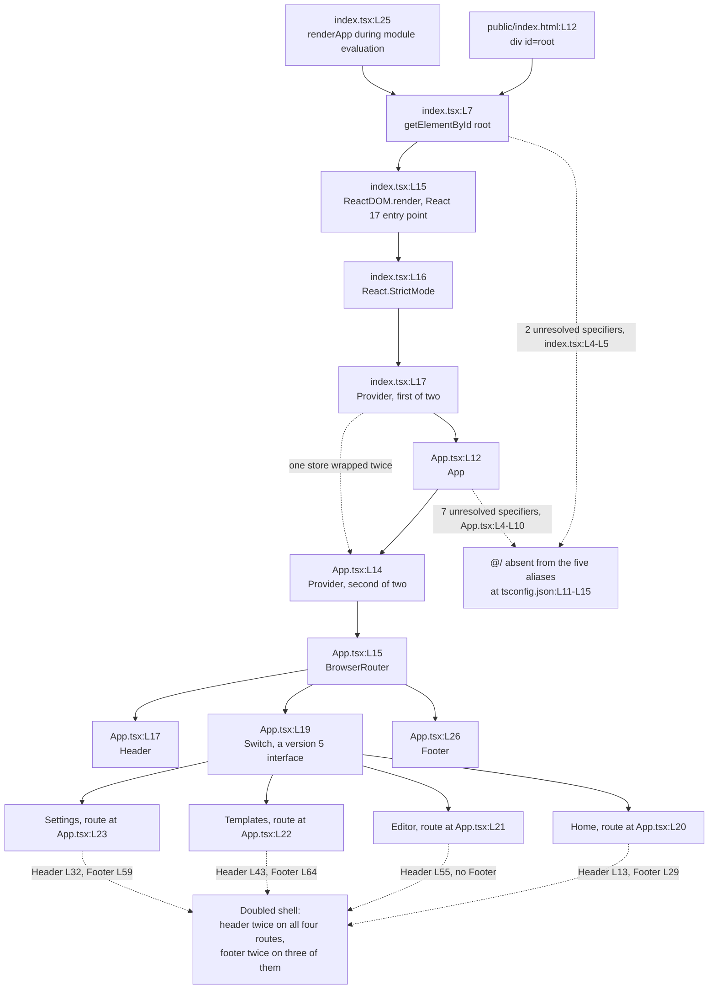

# frontend/src

Every `Lnn` locator in this document numbers the documentation baseline commit `06be74c`, which precedes the inline
documentation pass. Running `git show 06be74c:frontend/src/App.tsx` reproduces the numbering exactly. Current `HEAD`
carries a comment block above every construct, so each symbol now sits lower in its file than its citation names.
Three findings stated here govern the whole subtree, and the six sibling READMEs defer to this file for each one. The
`@/` import prefix resolves nowhere, the type checker reports 76 errors, and five imported packages are missing from the
manifest.

## Purpose

The directory holds the browser entry point and the application shell for a single-page word processor. `index.tsx`
mounts the React tree into the `#root` element that `frontend/public/index.html` declares at L12, and `App.tsx` composes
the shell around a routed main area. Six subdirectories hold everything else: components, routed pages, Zod validation
contracts, service clients, the Redux store, and pure helper functions. Neither module beside this file reaches the
network, reads an environment variable, or holds state.

## Key Components

| Component | Type | Location | Description |
| --- | --- | --- | --- |
| `index.tsx` | Module | `index.tsx:L1-L25` | Browser entry point. L7 looks up `#root`, L15 renders the tree, and L25 calls `renderApp` during module evaluation, so importing the module mounts the application. The module exports nothing. |
| `renderApp` | Module-private constant | `index.tsx:L9` | Arrow function returning `void`, declared `const` with no `export` keyword, so no other module can import the name. L11 logs `Root element not found` and L12 returns when `#root` is absent, leaving no fallback on screen. |
| `App.tsx` | Module | `App.tsx:L1-L33` | Application shell. Wraps a Redux provider at L14 and a `BrowserRouter` at L15 around a `div` at L16, a `Header` at L17, a routed `main` at L18, and a `Footer` at L26. |
| `App` | Component, default export | `App.tsx:L12`, exported at `App.tsx:L33` | The directory's only export. Declares the complete route table at L20-L23, and takes no props, holds no state, and runs no effect. |
| `components/` | Subdirectory | `components/` | Eight components covering the application chrome and the editor surface. See [components/README.md](components/README.md). |
| `pages/` | Subdirectory | `pages/` | Four routed pages, one per entry in the route table. See [pages/README.md](pages/README.md). |
| `schema/` | Subdirectory | `schema/` | Three Zod contract modules, for documents, users, and templates. See [schema/README.md](schema/README.md). |
| `services/` | Subdirectory | `services/` | Three clients: a REST wrapper, an authentication helper, and a collaboration socket class. See [services/README.md](services/README.md). |
| `store/` | Subdirectory | `store/` | The single Redux store and two slices, one for documents and one for the signed-in user. See [store/README.md](store/README.md). |
| `utils/` | Subdirectory | `utils/` | Three helper modules, for formatting, validation, and serialization. See [utils/README.md](utils/README.md). |

## Architecture Fit

The directory sits at the top of the frontend layer and owns composition alone. `index.tsx` performs the mount and
`App.tsx` performs the composition, and both delegate every behavior downward. The route table hands control to
`pages/`, the pages assemble `components/`, `services/` reaches the backend over Hypertext Transfer Protocol (HTTP), and
`store/` holds client state. No module in the six subdirectories imports either file beside this README, so the
dependency direction runs one way.

The in-repository specification serves as comparison rather than ground truth. Its
`## HIGH-LEVEL ARCHITECTURE DIAGRAM` heading at `documentation/Technical Specifications.md:L140` places the single-page
application in a frontend subgraph beside an offline storage node, and routes traffic through an Application Programming
Interface (API) gateway. The code matches the subgraph and matches neither the node nor the gateway, as no
offline-storage module exists and `services/api.ts:L5` points a client at an environment variable.

The same file's `## USER INTERFACE DESIGN` heading at `:L449` places `Toolbar`, `DocumentCanvas`, and `Sidebar` directly
under `App`. The committed `App.tsx:L16-L27` renders only `Header`, a routed `main`, and `Footer`, while
`pages/Editor.tsx` renders those three. See the [architecture overview](../../docs/architecture-overview.md) for the map.

## Dependencies

### Internal

| Import site | Bound name and specifier | Status |
| --- | --- | --- |
| `index.tsx:L4` | `App` from `@/App` | Prefix unresolved. The default binding matches the default export at `App.tsx:L33`. |
| `index.tsx:L5` | `store` from `@/store` | Prefix unresolved. The default binding matches the default export at `store/index.ts:L15`, so the import form is correct. |
| `App.tsx:L4-L5` | `Header`, `Footer` from `@/components/*` | Prefix unresolved. Both default bindings match their targets. |
| `App.tsx:L6-L9` | `Home`, `Editor`, `Templates`, `Settings` from `@/pages/*` | Prefix unresolved. All four default bindings match their targets. |
| `App.tsx:L10` | `{ store }` from `@/store/index` | Prefix unresolved, and the binding is wrong twice over. `store/index.ts` exports `store` only as the default, alongside `RootState` at L12 and `AppDispatch` at L13. |

The two store imports form a matched pair. `index.tsx:L5` binds the default export by default import and gets the form
right. `App.tsx:L10` binds the same default-only export by name, which no export in `store/index.ts` provides.

### External

| Package | Declared range | Manifest site | Use and status |
| --- | --- | --- | --- |
| `react` | `^18.2.0` | `frontend/package.json:L8` | Imported at `index.tsx:L1` and `App.tsx:L1`. |
| `react-dom` | `^18.2.0` | `frontend/package.json:L9` | Imported at `index.tsx:L2`. L15 calls `ReactDOM.render`, the React 17 entry point. |
| `react-redux` | `^8.0.5` | `frontend/package.json:L10` | Imported at `index.tsx:L3` and `App.tsx:L3`, supplying both `Provider` elements. |
| `react-router-dom` | `^6.11.1` | `frontend/package.json:L11` | Imported at `App.tsx:L2`. Three call sites use version 5 interfaces. |
| `@reduxjs/toolkit` | `^1.9.5` | `frontend/package.json:L7` | Used in `store/` only. Neither module beside this file imports it. |
| `tailwindcss` | `^3.3.2` | `frontend/package.json:L12` | No module imports the package, and no configuration file activates it. |
| `typescript` | `^4.9.5` | `frontend/package.json:L13` | Build-time only. |
| `axios` | none | absent | Imported but undeclared. Two sites, in `services/api.ts` and `services/auth.ts`. |
| `draft-js` | none | absent | Imported but undeclared. Six sites across `components/` and `utils/`. |
| `@types/draft-js` | none | absent | Imported but undeclared, so the six Draft.js sites carry no type declarations. |
| `zod` | none | absent | Imported but undeclared. Four sites, in all three `schema/` modules and `utils/validation.ts`. |
| `socket.io-client` | none | absent | Imported but undeclared. One site, in `services/collaboration.ts`. |

`frontend/package.json:L15-L30` declares 14 development dependencies, with `react-scripts` pinned to exactly `5.0.1` at
L29 and no caret. The specification names two of the five undeclared packages and omits three. Its
`## FRAMEWORKS AND LIBRARIES` heading at `documentation/Technical Specifications.md:L536` lists Axios at L544 and
Draft.js at L545, while `zod` and `socket.io-client` appear nowhere in `documentation/`. The contracts these modules
exchange are catalogued in the [data model](../../docs/data-model.md), and the external services they reach are
catalogued in the [integration guide](../../docs/integration-guide.md).

## Configuration

| Setting | Value and site | Status |
| --- | --- | --- |
| `REACT_APP_API_BASE_URL` | Read at `services/api.ts:L5`, the only `process.env` read in the frontend | READ-BUT-NEVER-DECLARED |
| `REACT_APP_API_URL` | Injected as `http://backend:5000` at `infrastructure/docker/docker-compose.yml:L11` | DECLARED-BUT-NEVER-READ |
| `@/` path alias | Used by 44 import statements under `frontend/src` | READ-BUT-NEVER-DECLARED |
| `paths` | Five aliases at `frontend/tsconfig.json:L11-L15`: `@components/*`, `@utils/*`, `@styles/*`, `@hooks/*`, `@services/*` | DECLARED |
| `baseUrl` | `src`, at `frontend/tsconfig.json:L9` | DECLARED |
| `strict` | `true`, at `frontend/tsconfig.json:L3` | DECLARED |
| `noEmit` | `true`, at `frontend/tsconfig.json:L25` | DECLARED |
| `include` | `src/**/*.ts` and `src/**/*.tsx`, at `frontend/tsconfig.json:L28` | DECLARED |
| `engines` | Absent from `frontend/package.json`, and no `.nvmrc` is committed | NEVER DECLARED |

The two environment variable names differ, so the client resolves an undefined base Uniform Resource Locator (URL). Two
of the five declared aliases point at directories that do not exist. The aliases at L13 and L14 name `styles` and
`hooks`, while `frontend/src` holds only `components`, `pages`, `schema`, `services`, `store`, and `utils`.

`frontend/package.json` declares six scripts: `start` at L32, `build` at L33, `test` at L34, `eject` at L35, `lint` at
L36, and `format` at L37. No type-check or documentation script exists. The `format` glob at L37 is
`src/**/*.{js,jsx,ts,tsx,json,css,scss,md}`, so the seven READMEs under `frontend/src` fall inside its reach.
`browserslist` spans L45-L56. For prerequisites, see the [onboarding guide](../../docs/onboarding.md).

## Data Flows

Control enters at `index.tsx:L25`, which calls `renderApp` during module evaluation. L7 has already looked up `#root`,
and L15 renders a `StrictMode` tree into that element. `App` wraps a second Redux provider around the same store at L14,
mounts the router at L15, and renders `Header`, the route table, and `Footer`. Each routed page then renders its own
`Header` again, and three of the four render their own `Footer` again. Below, dashed edges mark a broken relationship and
solid edges mark a path the committed code takes.



## Design Patterns

The directory applies a composition root: `index.tsx` owns the single mount and holds no application logic, and
`App.tsx` owns the element tree and declares no behavior of its own. Provider composition supplies the store, with
`react-redux` `Provider` elements at `index.tsx:L17` and `App.tsx:L14` both receiving the same instance, so the tree
carries two nested providers around one store. Client-side routing runs through a central route table at
`App.tsx:L19-L24`, which holds every declared path in one place and names a page component per entry.

A unidirectional single store holds client state, so pages and components read through selectors and write through
dispatched actions. A container and presentational split separates `pages/` from `components/`, where pages bind to the
store and fetch data while components receive props and render markup. Schema-at-the-boundary validates external
payloads through the Zod modules under `schema/`, which `utils/validation.ts` applies to user input.

## Known Limitations

The frontend does not typecheck. Running `tsc --noEmit` reports 76 errors: 57 `TS2307` cannot-find-module, 6 `TS2305`
missing-exported-member, 5 `TS7006` implicit `any`, 4 `TS2322` not-assignable, 2 `TS2614`, 1 `TS2552`, and 1 `TS2339`.

- **The `@/` prefix resolves nowhere.** `frontend/tsconfig.json:L11-L15` declares five aliases and none is `@/`, while
  44 import statements under `frontend/src` use the prefix. Declaring the alias alone would not fix resolution, because
  `react-scripts` `5.0.1`, pinned at `frontend/package.json:L29`, does not apply `tsconfig` `paths` to webpack module
  resolution.
- **The 57 `TS2307` errors decompose exactly.** 44 come from the `@/` prefix, and 13 come from imports of the five
  undeclared packages: `axios` twice, `draft-js` six times, `zod` four times, and `socket.io-client` once. Modules under
  `services/`, `store/`, and `utils/` import their siblings by relative path, so those paths resolve and their failures
  surface as `TS2305` or `TS2614` instead. One root cause produces two error codes.
- **Five imported packages are absent from the manifest**: `axios`, `draft-js`, `@types/draft-js`, `zod`, `socket.io-client`.
- **`npm ci` fails in both places that call it, for two different reasons.** No lockfile is committed, so
  `infrastructure/docker/frontend.Dockerfile:L11` fails, and no root `package.json` exists, so
  `.github/workflows/ci.yml:L19` fails. A plain `npm install` inside `frontend/` succeeds, as `README.md:L36` instructs,
  and it resolves the seven declared runtime packages while leaving all five undeclared packages missing.
- **The client resolves an undefined base URL.** `services/api.ts:L5` reads `REACT_APP_API_BASE_URL`, and
  `infrastructure/docker/docker-compose.yml:L11` injects `REACT_APP_API_URL`.
- **Three router call sites use version 5 interfaces against `^6.11.1`.** `App.tsx:L2` imports `Switch`, `App.tsx:L20`
  passes `exact`, and `App.tsx:L20-L23` pass a `component` prop. Version 6 exports `Routes` in place of `Switch`, and
  its `Route` accepts neither `exact` nor `component`.
- **`index.tsx:L15` calls `ReactDOM.render`**, the React 17 entry point, against `react-dom` `^18.2.0` declared at
  `frontend/package.json:L9`.
- **Two providers wrap one store**, at `index.tsx:L17` and `App.tsx:L14`.
- **The shell renders twice on every route.** `App.tsx` renders `Header` at L17 and `Footer` at L26 around the routed
  area, and all four pages render their own `Header` again at `Home.tsx:L13`, `Editor.tsx:L55`, `Settings.tsx:L32`, and
  `Templates.tsx:L43`. Three of the four also render their own `Footer` again, at `Home.tsx:L29`, `Settings.tsx:L59`,
  and `Templates.tsx:L64`. `Editor.tsx` renders no `Footer`. So the header appears twice on all four routes, and the
  footer appears twice on three of them.
- **Five links target paths the route table does not declare**, so each navigates to nothing: `/documents` at
  `components/Header.tsx:L20`, `/login` at `components/Header.tsx:L32`, `/new-document` at `pages/Home.tsx:L18`,
  `/open-document` at `pages/Home.tsx:L21`, and `/recent-documents` at `pages/Home.tsx:L24`. The declared paths are `/`,
  `/editor`, `/templates`, and `/settings`, at `App.tsx:L20-L23`.
- **Nothing renders as styled, under either of the two styling conventions in use.** Tailwind utility classes appear in
  `components/Header.tsx` and in the body of `pages/Templates.tsx`. Bespoke semantic class names with no backing
  stylesheet appear in `components/Footer.tsx`, `components/Sidebar.tsx`, `components/Toolbar.tsx`,
  `components/DocumentCanvas.tsx`, `pages/Home.tsx`, `pages/Editor.tsx`, `pages/Settings.tsx`, and in the wrapper of
  `pages/Templates.tsx`. That one file therefore carries both conventions. No `tailwind.config.js`, no
  `postcss.config.js`, and no Cascading Style Sheets (CSS) file is committed. No component library and no design system
  is declared, so the split is a styling inconsistency rather than a compliance gap.
- **No test file exists anywhere under `frontend/`.** The `test` script at `frontend/package.json:L34` and the three
  Testing Library development dependencies at L16-L18 have nothing to run.
- **Three static assets are referenced and absent**, because `frontend/public/` holds only `index.html`: the icon at
  `public/index.html:L7`, the manifest at `public/index.html:L8`, and the logo at `components/Header.tsx:L13`.
- **Neither module beside this file carries an assistance marker or a deferred-work comment.** All 16 assistance markers
  and all 9 deferred-work comments under `frontend/src` sit in the six subdirectories, and each sibling README cites its
  own by file and line.

Work that would unblock the most downstream errors, in order: export the inferred `Document` type from
`schema/document.ts`; add `useAppSelector` and `useAppDispatch` to `store/index.ts`; add the `updateDocument` action plus
the `selectCurrentDocument` and `selectCurrentUser` selectors; reconcile `owner_id` against `user_id` across the
contracts; then connect the collaboration client. Each item records what the committed code needs, and this documentation
pass performs none of them. The repository-wide register of these defects lives in
[troubleshooting](../../docs/troubleshooting.md).

## Usage Examples

The mount sequence, as the committed code performs it:

```text
index.tsx:L7   const rootElement = document.getElementById('root');
index.tsx:L9   const renderApp = (): void => {        // declared const, never exported
index.tsx:L11    console.error('Root element not found');   // only failure path, L12 then returns
index.tsx:L15    ReactDOM.render(<StrictMode><Provider store={store}><App /></Provider></StrictMode>, rootElement);
index.tsx:L25  renderApp();                          // runs during module evaluation
```

The sequence does not run as committed, because `index.tsx:L4-L5` import through the unresolved `@/` prefix. Installing
dependencies and reading the type-check profile:

```bash
cd frontend
npm install          # succeeds; the five undeclared packages stay missing
npx tsc --noEmit     # reports 76 errors
npm ci               # fails: no lockfile is committed
```

The first three commands run, and the fourth fails here and at both call sites named under Known Limitations. Adding a
route means adding one entry to the table in `App.tsx`, which currently reads:

```tsx
<Switch>                                       {/* App.tsx:L19 */}
  <Route exact path="/" component={Home} />    {/* App.tsx:L20 */}
  <Route path="/editor" component={Editor} />  {/* App.tsx:L21, and L22 and L23 repeat the shape */}
</Switch>
```

A new entry copied from that shape inherits the same three version 5 interfaces, so it compiles no better.
