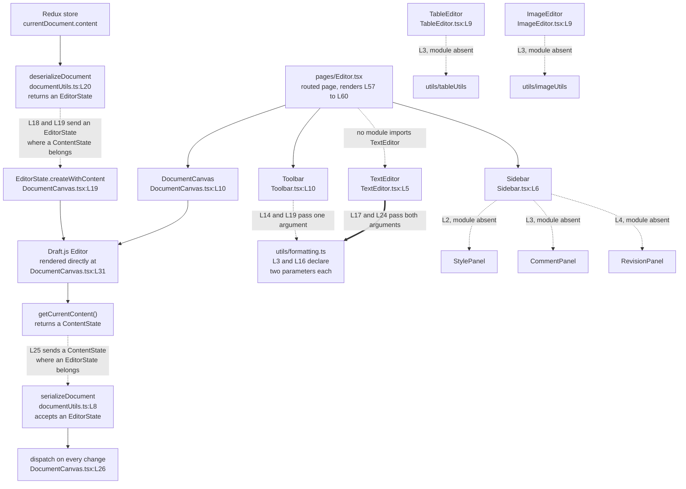

# frontend/src/components

## Purpose

Eight React function components live here, and together they supply every part of the editor
screen except the routed pages. `Header` and `Footer` render the application chrome.
`Sidebar` renders the panel shell, and `Toolbar` renders the formatting controls.
`DocumentCanvas` and `TextEditor` each wrap a Draft.js editing surface, where Draft.js is the
rich-text framework the editor is built on. `TableEditor` and `ImageEditor` hold insert logic
for tables and images and render no interface at all.

The directory measures 291 lines across the eight files. Seven of the eight cannot compile,
because five modules and five store symbols they import do not exist. `Footer` is the
exception, and the sections below name it as the one clean reference point.

## Key Components

| Component | Type | Location | Description |
| --- | --- | --- | --- |
| `Header` | React component, default export | `Header.tsx:L6` | Top navigation bar: branding, three links, and either a profile block or a login link. Propless. |
| `Footer` | React component, default export | `Footer.tsx:L3` | Status bar with five literal values and two zoom buttons. Propless, and the only component here that typechecks. |
| `Sidebar` | React component, default export | `Sidebar.tsx:L6` | Panel shell that renders three child panels unconditionally. Propless. |
| `Toolbar` | React component, default export | `Toolbar.tsx:L10` | Three button groups: inline styles, block styles, and two insert buttons. Propless, and holds no editor state. |
| `TextEditor` | React component, default export | `TextEditor.tsx:L5` | Self-contained Draft.js editor driven by key commands. Propless. No module imports it. |
| `handleKeyCommand` | Internal handler | `TextEditor.tsx:L10` | Maps a Draft.js key command to one of the two formatting helpers, passing both declared arguments. |
| `DocumentCanvas` | React component, default export | `DocumentCanvas.tsx:L10` | Draft.js editor bound to the document in the Redux store. Declared propless, while its one caller passes two props. |
| `handleEditorChange` | Internal handler | `DocumentCanvas.tsx:L23` | Stores the new editor state, serializes it, and dispatches a document update on every change. |
| `TableEditor` | React component, default export | `TableEditor.tsx:L9` | Table insert logic. Takes props. Renders an empty element. |
| `handleInsertTable` | Internal handler | `TableEditor.tsx:L12` | Builds a table and pushes it into the editor state. Defined and never called. |
| `ImageEditor` | React component, default export | `ImageEditor.tsx:L9` | Image insert logic. Takes props. Renders an empty element. |
| `handleInsertImage` | Internal handler | `ImageEditor.tsx:L12` | Creates an `IMAGE` entity and inserts an atomic block. Defined and never called. |
| `TableEditorProps` | Props interface, not exported | `TableEditor.tsx:L5-L7` | Declares one required member, `editorState: EditorState`. |
| `ImageEditorProps` | Props interface, not exported | `ImageEditor.tsx:L5-L7` | Declares one required member, `editorState: EditorState`. |

Only `TableEditor` and `ImageEditor` declare a props interface, and the other six are propless.
`DocumentCanvas` is the one whose propless declaration contradicts its caller, which Known
Limitations reads against `frontend/src/pages/Editor.tsx:L59`.

## Architecture Fit

These components sit below the routed pages and above the Redux store and the shared
utilities. `frontend/src/pages/Editor.tsx` composes three of them, rendering `Toolbar` at
`Editor.tsx:L57`, `DocumentCanvas` at `Editor.tsx:L59` and `Sidebar` at `Editor.tsx:L60`.
`frontend/src/App.tsx` composes the chrome, rendering `Header` at `App.tsx:L17` and `Footer`
at `App.tsx:L26`. See [the architecture overview](../../../docs/architecture-overview.md) for
the wider system and [the frontend source README](../README.md) for the routing above it.

The committed layout differs from the declared design, and each difference is checkable.
Intended behavior per documentation/Technical Specifications.md, "USER INTERFACE DESIGN"
heading: `App` composes `Header`, `Toolbar`, `DocumentCanvas`, `Sidebar` and `Footer`
(`Technical Specifications.md:L455-L459`). The same diagram places `TextEditor`,
`TableEditor` and `ImageEditor` under `DocumentCanvas`
(`Technical Specifications.md:L470-L472`). The diagram also places `StylesPanel`,
`CommentsPanel` and `VersionHistoryPanel` under `Sidebar`
(`Technical Specifications.md:L474-L476`), and `StatusBar` and `ZoomControls` under `Footer`
(`Technical Specifications.md:L478-L479`).

The committed code matches that placement for `Header` and `Footer` and departs from it
elsewhere. `App.tsx` renders only the chrome, so `Toolbar`, `DocumentCanvas` and `Sidebar`
reach the screen through `pages/Editor.tsx` instead. `DocumentCanvas.tsx:L31` renders a
Draft.js `Editor` directly and composes no child, so `TextEditor`, `TableEditor` and
`ImageEditor` sit outside it. `Sidebar.tsx:L2-L4` imports `StylePanel`, `CommentPanel` and
`RevisionPanel`, three names that differ from the three the diagram declares, and all three
modules are absent. `Footer.tsx` inlines its status and zoom markup rather than composing
two children.

The declared `Toolbar` contract differs from the committed one. Intended behavior per
documentation/Technical Specifications.md, "USER INTERFACE DESIGN" heading: the interface at
`Technical Specifications.md:L487-L491` declares `onBoldClick`, `onItalicClick` and
`onUnderlineClick`, and `Technical Specifications.md:L493` types the component
`React.FC<ToolbarProps>`. The committed `Toolbar` at `Toolbar.tsx:L10` is propless and
reaches the store through a dispatch, so a parent passes it no callbacks.

One further statement of intent bears on styling. `Technical Specifications.md:L521`
declares that the interface will follow Fluent Design System principles, and
`frontend/package.json` declares no component library and no design system, so that
statement has no counterpart in the committed dependency set.

## Dependencies

### Internal

| Import | Imported at | State |
| --- | --- | --- |
| `@/components/StylePanel` | `Sidebar.tsx:L2` | Module absent |
| `@/components/CommentPanel` | `Sidebar.tsx:L3` | Module absent |
| `@/components/RevisionPanel` | `Sidebar.tsx:L4` | Module absent |
| `@/utils/tableUtils` | `TableEditor.tsx:L3` | Module absent |
| `@/utils/imageUtils` | `ImageEditor.tsx:L3` | Module absent |
| `useAppSelector` | `Header.tsx:L3`, `DocumentCanvas.tsx:L3` | Symbol absent from `@/store` |
| `useAppDispatch` | `Toolbar.tsx:L3`, `DocumentCanvas.tsx:L3` | Symbol absent from `@/store` |
| `selectCurrentUser` | `Header.tsx:L4` | Symbol absent from `@/store/userSlice` |
| `selectCurrentDocument` | `DocumentCanvas.tsx:L4` | Symbol absent from `@/store/documentSlice` |
| `updateDocument` | `Toolbar.tsx:L4`, `DocumentCanvas.tsx:L4` | Symbol absent from `@/store/documentSlice` |
| `@/utils/formatting` | `Toolbar.tsx:L2`, `TextEditor.tsx:L3` | Module present, both functions exported |
| `@/utils/documentUtils` | `DocumentCanvas.tsx:L5` | Module present, both functions exported |

The five absent symbols are absent by inspection of the modules that would export them.
`frontend/src/store/index.ts` exports exactly three names, and neither hook is among them:
`RootState` at `store/index.ts:L12`, `AppDispatch` at `store/index.ts:L13`, and `store` as
a default at `store/index.ts:L15`. `frontend/src/store/documentSlice.ts:L43` destructures
exactly `setCurrentDocument`, `addRecentDocument`, `setLoading`, `setError`,
`clearCurrentDocument` and `clearRecentDocuments`, so it publishes no `updateDocument`
action and no `selectCurrentDocument` selector. `frontend/src/store/userSlice.ts:L44`
destructures exactly `setUser`, `clearUser`, `setLoading` and `setError`, so it publishes
no `selectCurrentUser`. See [the store README](../store/README.md) and
[the utils README](../utils/README.md) for those two directories.

Every specifier in the table above carries the `@/` prefix, and
`frontend/tsconfig.json:L10-L16` declares five path aliases that do not include it:
`@components/*`, `@utils/*`, `@styles/*`, `@hooks/*` and `@services/*`. Each `@/` specifier
therefore fails to resolve, which masks every symbol-level fault behind a module-level one.

### External

| Package | Declared | Imported by |
| --- | --- | --- |
| `react ^18.2.0` | `frontend/package.json:L8` | All eight components |
| `react-redux ^8.0.5` | `frontend/package.json:L10` | Reached indirectly, through the absent store hooks |
| `react-router-dom ^6.11.1` | `frontend/package.json:L11` | `Header.tsx:L2`, for `Link` |
| `draft-js` | Absent from the manifest | `DocumentCanvas.tsx:L2`, `ImageEditor.tsx:L2`, `TableEditor.tsx:L2`, `TextEditor.tsx:L2` |
| `@types/draft-js` | Absent from the manifest | Required by the same four modules |

`draft-js` and `@types/draft-js` are imported but never declared.
`frontend/package.json:L6-L14` lists exactly seven runtime dependencies:
`@reduxjs/toolkit`, `react`, `react-dom`, `react-redux`, `react-router-dom`, `tailwindcss`
and `typescript`. Neither Draft.js package appears there or in the development dependencies.
Four of the thirteen undeclared-package `TS2307` errors originate in this directory, one for
each module that imports `draft-js`. See [the frontend source README](../README.md) for the
repository-wide error profile, which this file does not restate.

The manifest and the specification disagree on Draft.js. The `FRAMEWORKS AND LIBRARIES`
heading in `documentation/Technical Specifications.md` lists Draft.js as a frontend library
at `Technical Specifications.md:L545`, while the manifest declares it nowhere.

`Header` and `DocumentCanvas` each read a contract that the server side also models. See
[the data model reference](../../../docs/data-model.md) for the field drift they inherit.

## Configuration

No component in this directory reads `process.env`, and none takes a configuration file, an
environment variable or a build-time constant. The nearest equivalent is a set of literal
display values in `Footer.tsx`, which a reader is likely to mistake for computed state.

| Value | Location | Note |
| --- | --- | --- |
| `Words: 0` | `Footer.tsx:L7` | Literal text, not a computed word count |
| `Pages: 1` | `Footer.tsx:L8` | Literal text, not a computed page count |
| `100%` | `Footer.tsx:L12` | Literal zoom level |
| `Last saved: Just now` | `Footer.tsx:L16` | Literal text, unconnected to any save path |
| `Collaborators: 1` | `Footer.tsx:L17` | Literal text, unconnected to any collaboration path |
| Zoom out button | `Footer.tsx:L11` | Declares no `onClick`, so clicking it does nothing |
| Zoom in button | `Footer.tsx:L13` | Declares no `onClick`, so clicking it does nothing |

All five values are hard-coded, and no handler connects either zoom button to the level.

## Data Flows

The Draft.js `EditorState`, an immutable snapshot of editor content plus selection, is the one
value moving through this directory, and `DocumentCanvas` alone moves it in both directions.
A load effect reads `currentDocument.content` from
the Redux store, passes the string to `deserializeDocument` at `DocumentCanvas.tsx:L18`, then
hands the result to `EditorState.createWithContent` at `DocumentCanvas.tsx:L19`. A change
handler runs the reverse path, calling `getCurrentContent()`, passing the result to
`serializeDocument` at `DocumentCanvas.tsx:L25`, then dispatching at `DocumentCanvas.tsx:L26`.
Both directions carry a type error, and Known Limitations reads the two together. See
[the pages README](../pages/README.md) for the page that mounts these components.



## Design Patterns

**Container and presentational split.** `DocumentCanvas` and `Toolbar` reach the Redux store
directly, at `DocumentCanvas.tsx:L11-L12` and `Toolbar.tsx:L11`, and `Header` reads it at
`Header.tsx:L7`. `Footer`, `TextEditor`, `TableEditor` and `ImageEditor` hold no store
connection, and `Footer.tsx` imports nothing beyond React.

**Store access through hooks and selectors.** Three components call a typed hook at module
scope and pass a named selector to it, rather than receiving data as props. `Header.tsx:L7`
pairs `useAppSelector` with `selectCurrentUser`, `DocumentCanvas.tsx:L11-L12` pairs
`useAppDispatch` with `useAppSelector` and `selectCurrentDocument`, and `Toolbar.tsx:L11`
calls `useAppDispatch` alone.

**Controlled Draft.js editor state.** `TextEditor.tsx:L6` and `DocumentCanvas.tsx:L13` each
seed local state with `EditorState.createEmpty()` and pass that state to the Draft.js `Editor`
with an `onChange` callback. The editor holds no state of its own, so every keystroke returns
through the component.

**Atomic block insertion.** `ImageEditor.tsx:L14-L23` creates an immutable `IMAGE` entity on
the content state, reads the generated entity key at `ImageEditor.tsx:L19`, and calls
`AtomicBlockUtils.insertAtomicBlock` at `ImageEditor.tsx:L23` to place the block. Draft.js
renders an atomic block through a block renderer the editor supplies.

## Known Limitations

### The two formatting-helper call sites

`Toolbar` and `TextEditor` call the same two helpers, and the two call sites disagree on
argument count. Both helper signatures declare two parameters and return an `EditorState`:

- `formatting.ts:L3` declares
  `applyInlineStyle(editorState: EditorState, inlineStyle: string): EditorState`, returning
  the pushed state at `formatting.ts:L13`.
- `formatting.ts:L16` declares
  `applyBlockStyle(editorState: EditorState, blockType: string): EditorState`, returning the
  pushed state at `formatting.ts:L26`.

`TextEditor` supplies both declared arguments. `TextEditor.tsx:L17` calls
`applyInlineStyle(editorState, command)` and `TextEditor.tsx:L24` calls
`applyBlockStyle(editorState, command)`. Its block-type cases at `TextEditor.tsx:L19-L23`
name `header-one`, `header-two`, `blockquote`, `unordered-list-item` and
`ordered-list-item`, which are the spellings `Modifier.setBlockType` accepts.

`Toolbar` supplies one argument to each. `Toolbar.tsx:L14` calls `applyInlineStyle(style)`
and `Toolbar.tsx:L19` calls `applyBlockStyle(style)`, so the style string lands in the
`editorState` position. Its constants are lowercase throughout. `Toolbar.tsx:L31`,
`Toolbar.tsx:L32` and `Toolbar.tsx:L33` pass `'bold'`, `'italic'` and `'underline'`, where
Draft.js names inline styles `BOLD`, `ITALIC` and `UNDERLINE`. `Toolbar.tsx:L36`,
`Toolbar.tsx:L37` and `Toolbar.tsx:L38` pass `'paragraph'`, `'heading1'` and `'heading2'`,
where Draft.js names those block types `unstyled`, `header-one` and `header-two`.

The contrast covers argument count and block-type spelling, and it stops there.
`TextEditor.tsx:L14-L16` matches the lowercase `bold`, `italic` and `underline` key commands
and forwards each one unchanged into the `inlineStyle` parameter. Those three values therefore
reach the helper under the key-command spelling rather than the inline-style spelling.
`TextEditor` is correct on argument count and on block types, and is not a canonical reference
for every constant.

Two further facts belong to the same reading. Both helpers declare an `EditorState` return,
so `Toolbar.tsx:L14` and `Toolbar.tsx:L19` bind that declared type to a variable named
`updatedContent` and dispatch it as a `content` value. `Toolbar` also holds no editor state at
all. `Toolbar.tsx:L11` is its only hook call, and the file declares no `useState`, no `useRef`
and no editor-state selector, so nothing supplies the first argument.

### The DocumentCanvas type inversion

`frontend/src/utils/documentUtils.ts:L20` declares
`deserializeDocument(serializedContent: string): EditorState`, and
`documentUtils.ts:L8` declares `serializeDocument(editorState: EditorState): string`.
`DocumentCanvas` inverts both. `DocumentCanvas.tsx:L18` binds the `EditorState` that
`deserializeDocument` returns to a variable named `contentState`, and
`DocumentCanvas.tsx:L19` passes that value to `EditorState.createWithContent()`, which
accepts a `ContentState`. `DocumentCanvas.tsx:L25` passes
`newEditorState.getCurrentContent()`, a `ContentState`, to `serializeDocument`, which
accepts an `EditorState`. The two errors are exact inverses, seven lines apart, so
correcting either one alone moves the other further from its declared type.

`DocumentCanvas.tsx:L2` already imports `ContentState`, the type
`EditorState.createWithContent()` accepts, and leaves it unreferenced. Four further facts apply.
`DocumentCanvas.tsx:L10` declares a propless `React.FC` while
`frontend/src/pages/Editor.tsx:L59` passes `content` and `onContentChange`.
`DocumentCanvas.tsx:L26` dispatches on every editor change, so the handler serializes the whole
document to JavaScript Object Notation (JSON) on every keystroke. `DocumentCanvas.tsx:L3` and
`DocumentCanvas.tsx:L4` import the four absent store symbols, and an assistance marker sits at
`DocumentCanvas.tsx:L7`.

### Per-component limitations

**`Header.tsx`, 42 lines.** `Header.tsx:L13` renders `/microsoft-word-logo.png`, and that
asset does not exist, because `frontend/public/` holds only `index.html`. Two of the four
links reach no route: `Header.tsx:L19` targets `/` and `Header.tsx:L21` targets
`/templates`, declared at `App.tsx:L20` and `App.tsx:L22`, while `Header.tsx:L20` targets
`/documents` and `Header.tsx:L32` targets `/login`, neither of which `App.tsx` declares.
`Header.tsx:L28` reads `currentUser.avatar` and `currentUser.name`, and `Header.tsx:L29` reads
`currentUser.name` again. `UserSchema` declares neither field, and models `username` at
`frontend/src/schema/user.ts:L6` and optional `full_name` at `schema/user.ts:L7`.
`Header.tsx:L3` and `Header.tsx:L4` import the absent `useAppSelector` and `selectCurrentUser`.

**`Footer.tsx`, 23 lines.** The file imports nothing beyond React, so it typechecks cleanly
and is the one working reference point here. Its five status values are literal text, listed
under Configuration above, and the zoom buttons at `Footer.tsx:L11` and `Footer.tsx:L13`
declare no `onClick`.

**`Sidebar.tsx`, 16 lines.** The sidebar cannot render, because all three panel modules are
absent. `Sidebar.tsx:L2`, `Sidebar.tsx:L3` and `Sidebar.tsx:L4` import
`@/components/StylePanel`, `@/components/CommentPanel` and `@/components/RevisionPanel`, and
`Sidebar.tsx:L9`, `Sidebar.tsx:L10` and `Sidebar.tsx:L11` render all three behind no guard.

**`TableEditor.tsx`, 45 lines.** `TableEditor.tsx:L3` imports `insertTable`, `deleteTable`
and `modifyTable` from the absent `@/utils/tableUtils`, and `deleteTable` and `modifyTable`
are never referenced. `handleInsertTable` at `TableEditor.tsx:L12` is defined and never
called. `TableEditor.tsx:L20-L24` passes the value `insertTable(rows, columns)` returns at
`TableEditor.tsx:L17` as the third argument to `Modifier.replaceText`, which requires a
string. `TableEditor.tsx:L38-L42` returns an empty element holding only a JavaScript XML
(JSX) comment at `TableEditor.tsx:L40`. An assistance marker sits at `TableEditor.tsx:L10`.

**`ImageEditor.tsx`, 38 lines.** `ImageEditor.tsx:L3` imports `resizeImage` and `cropImage`
from the absent `@/utils/imageUtils`, and neither is referenced. `handleInsertImage` at
`ImageEditor.tsx:L12` is defined and never called. `ImageEditor.tsx:L14-L18` creates an
`IMAGE` entity and `ImageEditor.tsx:L23` calls `AtomicBlockUtils.insertAtomicBlock`, and no
`blockRendererFn` exists anywhere in the tree, so an atomic image block would not render.
No upload route exists anywhere in the repository to receive image bytes, and
`ImageEditor.tsx:L32-L34` returns an empty element. Two assistance markers sit in this file,
at `ImageEditor.tsx:L10` and `ImageEditor.tsx:L30`.

**`TextEditor.tsx`, 47 lines.** No module imports this component, so no page mounts it.
`frontend/src/pages/Editor.tsx:L59` renders `DocumentCanvas` instead, which makes
`DocumentCanvas` the editor a reader reaches. `handleKeyCommand` at `TextEditor.tsx:L10` is
the file's second documentable construct, and an assistance marker sits at
`TextEditor.tsx:L8`.

One import defect spans the boundary with the pages directory.
`frontend/src/pages/Editor.tsx:L2-L5` imports `Header`, `Toolbar`, `DocumentCanvas` and
`Sidebar` as named imports, against four modules that export only defaults, while
`App.tsx:L4-L5` imports `Header` and `Footer` correctly as defaults. The named-import fault
stays masked, because the `@/` specifier does not resolve at all, so the checker reports
`TS2307` rather than `TS2614`.

### Styling

Two styling conventions coexist here, and neither produces styled output. Tailwind utility
classes appear in `Header.tsx`, across twelve `className` attributes. Bespoke semantic class
names with no backing stylesheet appear in `Footer.tsx`, `Sidebar.tsx`, `Toolbar.tsx` and
`DocumentCanvas.tsx`, while `TextEditor.tsx`, `TableEditor.tsx` and `ImageEditor.tsx` set no
`className` at all. No `tailwind.config.js`, no `postcss.config.js` and no Cascading Style
Sheets (CSS) file is committed anywhere, so nothing renders as styled under either
convention. `frontend/package.json` declares no component library and no design system,
which makes the divergence a styling inconsistency rather than a compliance gap.

### Markers and outstanding work

Six assistance markers and one outstanding-work comment sit in this directory, and each is
the authors' own record of unfinished work. The markers sit at `Toolbar.tsx:L6`,
`TextEditor.tsx:L8`, `DocumentCanvas.tsx:L7`, `TableEditor.tsx:L10`, `ImageEditor.tsx:L10`
and `ImageEditor.tsx:L30`. The second marker in `ImageEditor.tsx` sits inside the return
statement opened at `ImageEditor.tsx:L29`, which is why a reader scanning the top of that
file misses it. The outstanding-work comment sits at `Toolbar.tsx:L24`, inside the
`handleInsert` handler that both insert buttons call. `Header.tsx`, `Footer.tsx` and
`Sidebar.tsx` carry neither.

For the register covering the whole repository, see
[the troubleshooting register](../../../docs/troubleshooting.md).

## Usage Examples

The two formatting-helper call sites read most clearly side by side. Both helpers declare two
parameters, at `frontend/src/utils/formatting.ts:L3` and `formatting.ts:L16`.

```tsx
// TextEditor.tsx:L17 and L24 supply both declared arguments.
newState = applyInlineStyle(editorState, command);
newState = applyBlockStyle(editorState, command);

// Toolbar.tsx:L14 and L19 supply one, so the style string lands in the editorState position.
const updatedContent = applyInlineStyle(style);
```

Neither snippet runs today. `draft-js` is absent from `frontend/package.json:L6-L14`, and the
`@/` specifiers at `Toolbar.tsx:L2` and `TextEditor.tsx:L3` match no `frontend/tsconfig.json`
alias.

```tsx
// pages/Editor.tsx:L59, against the propless React.FC at DocumentCanvas.tsx:L10.
<DocumentCanvas content={content} onContentChange={handleContentChange} />
```

That line does not run either, because `DocumentCanvas.tsx:L3` imports `useAppSelector` and
`useAppDispatch`, which `frontend/src/store/index.ts` never defines.

Extending this directory needs the absent pieces first. Two store hooks come first,
`useAppSelector` and `useAppDispatch` in `store/index.ts`. The `updateDocument` action and the
`selectCurrentDocument` and `selectCurrentUser` selectors follow, in the two slices. The five
absent modules come last: the three panels `Sidebar.tsx:L2-L4` imports, and the two utilities
`TableEditor.tsx:L3` and `ImageEditor.tsx:L3` import.

Each entry records what the committed code needs, and this documentation changes none of it.
See [the onboarding guide](../../../docs/onboarding.md) for prerequisites and setup.
