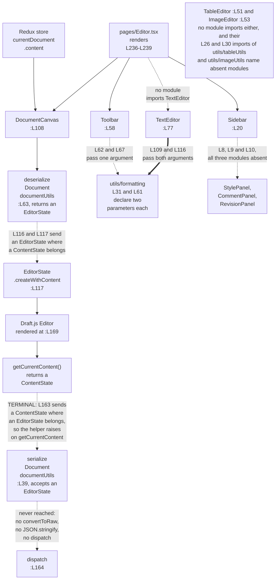

# frontend/src/components

## Purpose

Eight React function components live here, and together they supply every part of the editor screen
except the routed pages. `Header` and `Footer` render the application chrome. `Sidebar` renders the
panel shell, and `Toolbar` renders the formatting controls. `DocumentCanvas` and `TextEditor` each
wrap a Draft.js editing surface, where Draft.js is the rich-text framework the editor is built on.
`TableEditor` and `ImageEditor` hold insert logic for tables and images and render no interface at
all. The directory measures 291 lines across the eight files. Seven of the eight cannot compile,
because five modules and five store symbols they import do not exist. `Footer` is the exception, and
the sections below name it as the one clean reference point.

## Key Components

| Component | Type | Location | Description |
| --- | --- | --- | --- |
| `Header` | React component, default export | `Header.tsx:L55` | Top navigation bar: branding, three links, and either a profile block or a login link. Propless. |
| `Footer` | React component, default export | `Footer.tsx:L24` | Status bar with five literal values and two zoom buttons. Propless, and the only component here that typechecks. |
| `Sidebar` | React component, default export | `Sidebar.tsx:L20` | Panel shell that renders three child panels unconditionally. Propless. |
| `Toolbar` | React component, default export | `Toolbar.tsx:L58` | Three button groups: inline styles, block styles, and two insert buttons. Propless, and holds no editor state. |
| `TextEditor` | React component, default export | `TextEditor.tsx:L77` | Self-contained Draft.js editor driven by key commands. Propless. No module imports it. |
| `handleKeyCommand` | Internal handler | `TextEditor.tsx:L102` | Maps a Draft.js key command to one of the two formatting helpers, passing both declared arguments. |
| `DocumentCanvas` | React component, default export | `DocumentCanvas.tsx:L108` | Draft.js editor bound to the document in the Redux store. Declared propless, while its one caller passes two props. |
| `handleEditorChange` | Internal handler | `DocumentCanvas.tsx:L161` | Stores the new editor state at `:L162`, then calls the serializer at `:L163` with the wrong type and raises. The dispatch at `:L164` never runs. |
| `TableEditor` | React component, default export | `TableEditor.tsx:L51` | Table insert logic. Takes props. Renders an empty element. |
| `handleInsertTable` | Internal handler | `TableEditor.tsx:L67` | Builds a table and pushes it into the editor state. Defined and never called. |
| `ImageEditor` | React component, default export | `ImageEditor.tsx:L53` | Image insert logic. Takes props. Renders an empty element. |
| `handleInsertImage` | Internal handler | `ImageEditor.tsx:L84` | Creates an `IMAGE` entity and inserts an atomic block. Defined and never called. |
| `TableEditorProps` | Props interface, not exported | `TableEditor.tsx:L29-L31` | Declares one required member, `editorState: EditorState`. |
| `ImageEditorProps` | Props interface, not exported | `ImageEditor.tsx:L33-L35` | Declares one required member, `editorState: EditorState`. |

Only `TableEditor` and `ImageEditor` declare a props interface, and the other six are propless.
`DocumentCanvas` is the one whose propless declaration contradicts its caller, which Known
Limitations reads against `frontend/src/pages/Editor.tsx:L238`.

## Architecture Fit

These components sit below the routed pages and above the Redux store and the shared utilities.
`frontend/src/pages/Editor.tsx` composes three of them, rendering `Toolbar` at `Editor.tsx:L236`,
`DocumentCanvas` at `Editor.tsx:L238` and `Sidebar` at `Editor.tsx:L239`. `frontend/src/App.tsx`
composes the chrome, rendering `Header` at `App.tsx:L49` and `Footer` at `App.tsx:L58`. See [the
architecture overview](../../../docs/architecture-overview.md) for the wider system and [the
frontend source README](../README.md) for the routing above it.

The committed layout differs from the declared design, and each difference is checkable. Intended
behavior per documentation/Technical Specifications.md, "USER INTERFACE DESIGN" heading: `App`
composes `Header`, `Toolbar`, `DocumentCanvas`, `Sidebar` and `Footer` (`Technical
Specifications.md:L455-L459`). `TextEditor`, `TableEditor` and `ImageEditor` sit under
`DocumentCanvas` (`:L470-L472`). `StylesPanel`, `CommentsPanel` and `VersionHistoryPanel` sit under
`Sidebar` (`:L474-L476`), and `StatusBar` and `ZoomControls` sit under `Footer` (`:L478-L479`).

The committed code matches that placement for `Header` and `Footer` and departs from it elsewhere.
`App.tsx` renders only the chrome, so `Toolbar`, `DocumentCanvas` and `Sidebar` reach the screen
through `pages/Editor.tsx` instead. `DocumentCanvas.tsx:L169` renders a Draft.js `Editor` directly
and composes no child, so `TextEditor`, `TableEditor` and `ImageEditor` sit outside it.
`Sidebar.tsx:L8-L10` imports `StylePanel`, `CommentPanel` and `RevisionPanel`, three names that
differ from the three the diagram declares, and all three modules are absent. `Footer.tsx` inlines
its status and zoom markup rather than composing two children.

Two further statements of intent have no committed counterpart. The `ToolbarProps` interface at
`Technical Specifications.md:L487-L491` declares `onBoldClick`, `onItalicClick` and
`onUnderlineClick`, and `:L493` types the component `React.FC<ToolbarProps>`. The committed
`Toolbar` at `Toolbar.tsx:L58` is propless and reaches the store through a dispatch. `Technical
Specifications.md:L521` declares that the interface will follow Fluent Design System principles.
`frontend/package.json` declares no component library and no design system.

## Dependencies

### Internal

| Import | Imported at | State |
| --- | --- | --- |
| `@/components/StylePanel` | `Sidebar.tsx:L8` | Module absent |
| `@/components/CommentPanel` | `Sidebar.tsx:L9` | Module absent |
| `@/components/RevisionPanel` | `Sidebar.tsx:L10` | Module absent |
| `@/utils/tableUtils` | `TableEditor.tsx:L26` | Module absent |
| `@/utils/imageUtils` | `ImageEditor.tsx:L30` | Module absent |
| `useAppSelector` | `Header.tsx:L22`, `DocumentCanvas.tsx:L22` | Symbol absent from `@/store` |
| `useAppDispatch` | `Toolbar.tsx:L23`, `DocumentCanvas.tsx:L22` | Symbol absent from `@/store` |
| `selectCurrentUser` | `Header.tsx:L23` | Symbol absent from `@/store/userSlice` |
| `selectCurrentDocument` | `DocumentCanvas.tsx:L23` | Symbol absent from `@/store/documentSlice` |
| `updateDocument` | `Toolbar.tsx:L24`, `DocumentCanvas.tsx:L23` | Symbol absent from `@/store/documentSlice` |
| `@/utils/formatting` | `Toolbar.tsx:L22`, `TextEditor.tsx:L43` | Module present, both functions exported |
| `@/utils/documentUtils` | `DocumentCanvas.tsx:L24` | Module present, both functions exported |

The five absent symbols are absent by inspection of the modules that would export them.
`frontend/src/store/index.ts` exports exactly three names, and neither hook is among them:
`RootState` at `store/index.ts:L54`, `AppDispatch` at `:L62`, and `store` as a default at `:L65`.
`frontend/src/store/documentSlice.ts:L154` destructures exactly `setCurrentDocument`,
`addRecentDocument`, `setLoading`, `setError`, `clearCurrentDocument` and `clearRecentDocuments`, so
it publishes no `updateDocument` action and no `selectCurrentDocument` selector.
`frontend/src/store/userSlice.ts:L139` destructures exactly `setUser`, `clearUser`, `setLoading` and
`setError`, so it publishes no `selectCurrentUser`. See [the store README](../store/README.md) and
[the utils README](../utils/README.md) for those two directories. Every specifier in the table above
carries the `@/` prefix, and `frontend/tsconfig.json:L10-L16` declares five path aliases that do not
include it: `@components/*`, `@utils/*`, `@styles/*`, `@hooks/*` and `@services/*`. Each `@/`
specifier therefore fails to resolve, which masks every symbol-level fault behind a module-level
one.

### External

| Package | Declared | Imported by |
| --- | --- | --- |
| `react ^18.2.0` | `frontend/package.json:L8` | All eight components |
| `react-redux ^8.0.5` | `frontend/package.json:L10` | Reached indirectly, through the absent store hooks |
| `react-router-dom ^6.11.1` | `frontend/package.json:L11` | `Header.tsx:L21`, for `Link` |
| `draft-js` | Absent from the manifest | `DocumentCanvas.tsx:L21`, `ImageEditor.tsx:L29`, `TableEditor.tsx:L25`, `TextEditor.tsx:L42` |
| `@types/draft-js` | Absent from the manifest | Required by the same four modules |

`draft-js` and `@types/draft-js` are imported but never declared. `frontend/package.json:L6-L14`
lists exactly seven runtime dependencies: `@reduxjs/toolkit`, `react`, `react-dom`, `react-redux`,
`react-router-dom`, `tailwindcss` and `typescript`. Neither Draft.js package appears there or in the
development dependencies. Four of the thirteen undeclared-package `TS2307` errors originate here,
one for each module that imports `draft-js`. See [the frontend source README](../README.md) for the
repository-wide error profile, which this file does not restate. The `FRAMEWORKS AND LIBRARIES`
heading in `documentation/Technical Specifications.md` lists Draft.js as a frontend library at
`Technical Specifications.md:L545`, while the manifest declares it nowhere.

`Header` and `DocumentCanvas` each read a contract that the server side also models. See [the data
model reference](../../../docs/data-model.md) for the field drift they inherit.

## Configuration

No component in this directory reads `process.env`, and none takes a configuration file, an
environment variable or a build-time constant. The nearest equivalent is a set of literal display
values in `Footer.tsx`, which a reader is likely to mistake for computed state.

| Value | Location | Note |
| --- | --- | --- |
| `Words: 0` | `Footer.tsx:L28` | Literal text, not a computed word count |
| `Pages: 1` | `Footer.tsx:L29` | Literal text, not a computed page count |
| `100%` | `Footer.tsx:L33` | Literal zoom level |
| `Last saved: Just now` | `Footer.tsx:L37` | Literal text, unconnected to any save path |
| `Collaborators: 1` | `Footer.tsx:L38` | Literal text, unconnected to any collaboration path |
| Zoom out and zoom in buttons | `Footer.tsx:L32`, `:L34` | Neither declares `onClick`, so clicking does nothing |

All five values are hard-coded, and no handler connects either zoom button to the level.

## Data Flows

The Draft.js `EditorState`, an immutable snapshot of editor content plus selection, is the one value
moving through this directory, and `DocumentCanvas` alone moves it in both directions. A load effect
reads `currentDocument.content` from the Redux store, passes the string to `deserializeDocument` at
`DocumentCanvas.tsx:L116`, then hands the result to `EditorState.createWithContent` at
`DocumentCanvas.tsx:L117`. The reverse path stops at its first step. `DocumentCanvas.tsx:L162`
replaces the local editor state, then `:L163` calls `serializeDocument` with the `ContentState` that
`getCurrentContent()` returned, while `documentUtils.ts:L39` declares that parameter an
`EditorState`. The helper's first statement reads `getCurrentContent` on the value it received, and
a `ContentState` declares no such method, so the call raises a `TypeError` before any conversion
runs. Nothing downstream executes: no `convertToRaw`, no `JSON.stringify`, and no dispatch at
`:L164`. Both directions carry a type error, and Known Limitations reads the two together, while
[the pages README](../pages/README.md) covers the page that mounts these components.



## Design Patterns

**Container and presentational split, with store access through hooks and selectors.**
`DocumentCanvas` and `Toolbar` reach the Redux store directly, at `DocumentCanvas.tsx:L109-L110` and
`Toolbar.tsx:L59`, and `Header` reads it at `Header.tsx:L56`. Each of the three calls a typed hook
at module scope and passes a named selector to it rather than receiving data as props. `Footer`,
`TextEditor`, `TableEditor` and `ImageEditor` hold no store connection, and `Footer.tsx` imports
nothing beyond React.

**Controlled Draft.js editor state.** `TextEditor.tsx:L78` and `DocumentCanvas.tsx:L111` each
seed local state with `EditorState.createEmpty()` and pass that state to the Draft.js `Editor` with
an `onChange` callback. The editor holds no state of its own, so every keystroke returns through the
component.

**Atomic block insertion.** `ImageEditor.tsx:L86-L95` creates an immutable `IMAGE` entity on
the content state, reads the generated entity key at `:L91`, and calls
`AtomicBlockUtils.insertAtomicBlock` at `:L95` to place the block. Draft.js renders an atomic block
through a block renderer the editor supplies.

## Known Limitations

### The two formatting-helper call sites

`Toolbar` and `TextEditor` call the same two helpers, and the two call sites disagree on argument
count. Both helper signatures declare two parameters and return an `EditorState`:

- `formatting.ts:L31` declares
`applyInlineStyle(editorState: EditorState, inlineStyle: string): EditorState`, returning the pushed
state at `formatting.ts:L41`.
- `formatting.ts:L61` declares
`applyBlockStyle(editorState: EditorState, blockType: string): EditorState`, returning the pushed
state at `formatting.ts:L71`.

`TextEditor` supplies both declared arguments. `TextEditor.tsx:L109` calls
`applyInlineStyle(editorState, command)` and `:L116` calls `applyBlockStyle(editorState, command)`.
Its block-type cases at `:L111-L115` name `header-one`, `header-two`, `blockquote`,
`unordered-list-item` and `ordered-list-item`, which are the spellings `Modifier.setBlockType`
accepts.

`Toolbar` supplies one argument to each. `Toolbar.tsx:L62` calls `applyInlineStyle(style)` and
`:L67` calls `applyBlockStyle(style)`, so the style string lands in the `editorState` position. Its
constants are lowercase throughout. `:L79`, `:L80` and `:L81` pass `'bold'`, `'italic'` and
`'underline'`, where Draft.js names inline styles `BOLD`, `ITALIC` and `UNDERLINE`. `:L84`, `:L85`
and `:L86` pass `'paragraph'`, `'heading1'` and `'heading2'`, where Draft.js names those block types
`unstyled`, `header-one` and `header-two`.

The contrast covers argument count and block-type spelling, and it stops there.
`TextEditor.tsx:L106-L108` matches the lowercase `bold`, `italic` and `underline` key commands and
forwards each one unchanged into the `inlineStyle` parameter. Those three values therefore reach the
helper under the key-command spelling rather than the inline-style spelling. `TextEditor` is correct
on argument count and on block types, and is not a canonical reference for every constant.

Two further facts belong to the same reading. Both helpers declare an `EditorState` return, so
`Toolbar.tsx:L62` and `:L67` bind that declared type to a variable named `updatedContent` and
dispatch it as a `content` value. `Toolbar` also holds no editor state: `:L59` is its only hook
call, and the file declares no `useState`, no `useRef` and no editor-state selector, so nothing
supplies the first argument.

### The DocumentCanvas type inversion

`frontend/src/utils/documentUtils.ts:L63` declares `deserializeDocument(serializedContent: string):
EditorState`, and `:L39` declares `serializeDocument(editorState: EditorState): string`.
`DocumentCanvas` inverts both. `DocumentCanvas.tsx:L116` binds the `EditorState` that
`deserializeDocument` returns to a variable named `contentState`, and `:L117` passes that value to
`EditorState.createWithContent()`, which accepts a `ContentState`. `:L163` passes
`newEditorState.getCurrentContent()`, a `ContentState`, to `serializeDocument`, which accepts an
`EditorState`. The two errors are exact inverses, so correcting either one alone moves the other
further from its declared type.

`DocumentCanvas.tsx:L21` already imports `ContentState`, the type `EditorState.createWithContent()`
accepts, and leaves it unreferenced. Four further facts apply. `:L108` declares a propless
`React.FC` while `frontend/src/pages/Editor.tsx:L238` passes `content` and `onContentChange`. The
change handler pays no serialization cost, because `DocumentCanvas.tsx:L163` raises before the
helper converts anything. No JavaScript Object Notation (JSON) string is built, and the dispatch at
`:L164` never runs on any keystroke. `:L22` and `:L23` import the four absent store symbols, and an
assistance marker sits at `:L26`.

### Per-component limitations

**`Header.tsx`, 42 lines.** `Header.tsx:L62` renders `/microsoft-word-logo.png`, and that
asset does not exist, because `frontend/public/` holds only `index.html`. Two of the four links
reach a declared route: `Header.tsx:L68` targets `/` and `:L70` targets `/templates`, declared at
`App.tsx:L52` and `:L54`. The other two reach nothing, because `Header.tsx:L69` targets `/documents`
and `:L81` targets `/login`, and `App.tsx` declares neither. `Header.tsx:L77` reads
`currentUser.avatar` and `currentUser.name`, and `:L78` reads `currentUser.name` again. `UserSchema`
declares neither field, and models `username` at `frontend/src/schema/user.ts:L40` and optional
`full_name` at `schema/user.ts:L41`. `Header.tsx:L22` and `:L23` import the absent `useAppSelector`
and `selectCurrentUser`.

**`Footer.tsx`, 23 lines.** The file imports nothing beyond React, so it typechecks cleanly
and is the one working reference point here. Its five status values are literal text, listed under
Configuration above, and the zoom buttons at `Footer.tsx:L32` and `:L34` declare no `onClick`.

**`Sidebar.tsx`, 16 lines.** The sidebar cannot render, because all three panel modules are
absent. `Sidebar.tsx:L8`, `:L9` and `:L10` import `@/components/StylePanel`,
`@/components/CommentPanel` and `@/components/RevisionPanel`, and `:L23`, `:L24` and `:L25` render
all three behind no guard.

**`TableEditor.tsx`, 45 lines.** `TableEditor.tsx:L26` imports `insertTable`, `deleteTable`
and `modifyTable` from the absent `@/utils/tableUtils`, and `deleteTable` and `modifyTable` are
never referenced. `handleInsertTable` at `:L67` is defined and never called. `:L75-L79` passes the
value `insertTable(rows, columns)` returns at `:L72` as the third argument to
`Modifier.replaceText`, which requires a string. `:L93-L97` returns an empty element holding only a
JavaScript XML (JSX) comment at `:L95`. An assistance marker sits at `:L52`.

**`ImageEditor.tsx`, 38 lines.** `ImageEditor.tsx:L30` imports `resizeImage` and `cropImage`
from the absent `@/utils/imageUtils`, and neither is referenced. `handleInsertImage` at `:L84` is
defined and never called. `:L86-L90` creates an `IMAGE` entity and `:L95` calls
`AtomicBlockUtils.insertAtomicBlock`, and no `blockRendererFn` exists anywhere in the tree, so an
atomic image block would not render. No upload route exists anywhere in the repository to receive
image bytes, and `:L104-L106` returns an empty element. Two assistance markers sit in this file, at
`:L54` and `:L102`.

**`TextEditor.tsx`, 47 lines.** No module imports this component, so no page mounts it.
`frontend/src/pages/Editor.tsx:L238` renders `DocumentCanvas` instead, which makes `DocumentCanvas`
the editor a reader reaches. `handleKeyCommand` at `TextEditor.tsx:L102` is the file's second
documentable construct, and an assistance marker sits at `:L80`.

One import defect spans the boundary with the pages directory.
`frontend/src/pages/Editor.tsx:L21-L24` imports `Header`, `Toolbar`, `DocumentCanvas` and `Sidebar`
as named imports, against four modules that export only defaults, while `App.tsx:L17-L18` imports
`Header` and `Footer` correctly as defaults. The named-import fault stays masked, because the `@/`
specifier does not resolve at all, so the checker reports `TS2307` rather than `TS2614`.

### Accessibility

Every item below is read from the committed markup rather than from a running page, because the
client does not bundle. Three positives hold. `Header.tsx:L59` uses a semantic `header` element and
`:L66` a `nav`, `Footer.tsx:L26` uses a semantic `footer`, and the logo image at `Header.tsx:L62`
carries meaningful `alt` text. Every interactive control here is a native `button`, a React Router
`Link` rendering an anchor, or a Draft.js `Editor`, so each is keyboard reachable. The defects:

- **Neither Draft.js editor receives an accessible name.** `DocumentCanvas.tsx:L169-L173` and
`TextEditor.tsx:L131-L135` render `Editor` with no `aria-label`, no `aria-labelledby` and no
associated `label`, so assistive technology announces an unlabelled text box.
- **The toolbar is not identified as a toolbar and has no name.** `Toolbar.tsx:L77` sets
`className="toolbar"` alone, with no `role="toolbar"` and no `aria-label`. The three group wrappers
at `:L78`, `:L83` and `:L88` carry no `role="group"` and no name, so the eight buttons present as
one flat list.
- **The six style buttons expose no pressed state.** `Toolbar.tsx:L79-L81` and `:L84-L86` declare
no `aria-pressed`, so a screen reader cannot report whether a style is active. The component holds
no `editorState`, so no state exists to report.
- **Two controls look active and do nothing, without saying so.** The insert buttons at
`Toolbar.tsx:L89` and `:L90` call `handleInsert`, whose body reaches `console.log` only, and neither
carries `disabled` or `aria-disabled`.
- **Both zoom controls carry punctuation-only names and no handler.** `Footer.tsx:L32` labels its
button `-` and `:L34` labels its button `+`, which a screen reader announces as punctuation or
skips. Neither declares `onClick`, and neither carries `disabled`.
- **No focus or disabled treatment is authored anywhere,** because no stylesheet is committed.
Browsers would apply their default focus ring, and nothing here removes or replaces it. For the same
reason no project-authored rendered style exists, so no contrast ratio is measurable and none is
asserted.

### Styling

Two styling conventions coexist here, and no authored rule backs either one. Tailwind utility
classes appear in `Header.tsx`, across twelve `className` attributes. Bespoke semantic class names
with no backing stylesheet appear in `Footer.tsx`, `Sidebar.tsx`, `Toolbar.tsx` and
`DocumentCanvas.tsx`, while `TextEditor.tsx`, `TableEditor.tsx` and `ImageEditor.tsx` set no
`className` at all. No `tailwind.config.js`, no `postcss.config.js` and no Cascading Style Sheets
(CSS) file is committed anywhere, so once the build blockers are cleared no authored styling would
apply under either convention. `frontend/package.json` declares no component library and no design
system, which makes the divergence a styling inconsistency rather than a compliance gap.

### Markers and outstanding work

Six assistance markers and one outstanding-work comment sit in this directory, and each is the
authors' own record of unfinished work. The markers sit at `Toolbar.tsx:L26`, `TextEditor.tsx:L80`,
`DocumentCanvas.tsx:L26`, `TableEditor.tsx:L52`, `ImageEditor.tsx:L54` and `ImageEditor.tsx:L102`.
The last of those sits inside the return statement opened at `:L101`, which is why a reader scanning
the top of that file misses it. The outstanding-work comment is at `Toolbar.tsx:L72`, inside the
`handleInsert` handler both insert buttons call. `Header.tsx`, `Footer.tsx` and `Sidebar.tsx` carry
neither.

For the register covering the whole repository, see [the troubleshooting
register](../../../docs/troubleshooting.md).

## Usage Examples

The two formatting-helper call sites read most clearly side by side. Both helpers declare two
parameters, at `frontend/src/utils/formatting.ts:L31` and `formatting.ts:L61`.

```tsx
// TextEditor.tsx:L109 and L116 supply both declared arguments.
newState = applyInlineStyle(editorState, command);
newState = applyBlockStyle(editorState, command);

// Toolbar.tsx:L62 and L67 supply one, so the style string lands in the editorState position.
const updatedContent = applyInlineStyle(style);
```

Neither snippet runs today. `draft-js` is absent from `frontend/package.json:L6-L14`, and the `@/`
specifiers at `Toolbar.tsx:L22` and `TextEditor.tsx:L43` match no `frontend/tsconfig.json` alias.

```tsx
// pages/Editor.tsx:L238, against the propless React.FC at DocumentCanvas.tsx:L108.
<DocumentCanvas content={content} onContentChange={handleContentChange} />
```

That line does not run either, because `DocumentCanvas.tsx:L22` imports `useAppSelector` and
`useAppDispatch`, which `frontend/src/store/index.ts` never defines.

Extending this directory needs the absent pieces first. Two store hooks come first, `useAppSelector`
and `useAppDispatch` in `store/index.ts`. The `updateDocument` action and the
`selectCurrentDocument` and `selectCurrentUser` selectors follow, in the two slices. The five absent
modules come last: the three panels `Sidebar.tsx:L8-L10` imports, and the two utilities
`TableEditor.tsx:L26` and `ImageEditor.tsx:L30` import. Each entry records what the committed code
needs, and this documentation changes none of it. See [the onboarding
guide](../../../docs/onboarding.md) for prerequisites and setup.
