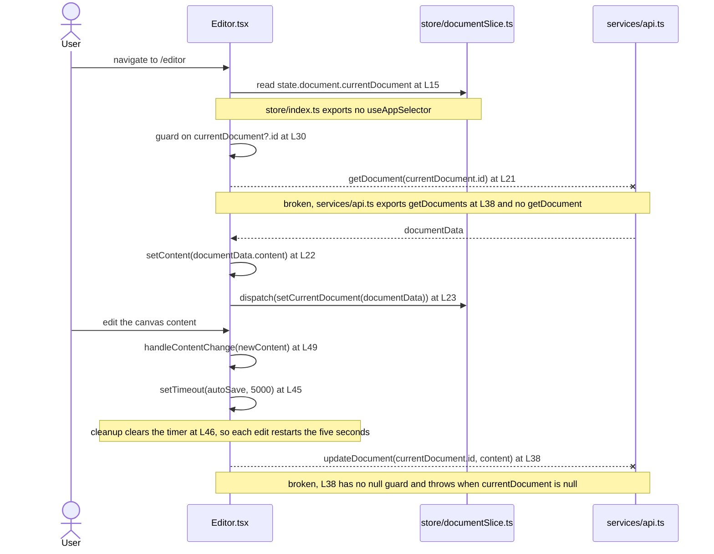

# `frontend/src/pages`

Line citations name the committed source at the documentation baseline, commit `06be74c`, before
the inline documentation pass added comment blocks to these modules. Running
`git show 06be74c:frontend/src/pages/Editor.tsx` reproduces the numbering used throughout.

## Purpose

Four routed pages live in this directory. `frontend/src/App.tsx:L20-L23` binds each one to a path:
`Home` to `/`, `Editor` to `/editor`, `Templates` to `/templates` and `Settings` to `/settings`.
Each page composes shell components from `frontend/src/components`, reads client state through
store hooks, and calls the REST client in `frontend/src/services/api.ts`. Every page carries at
least one contract defect, and the `Known Limitations` heading below cites each one.

## Key Components

| Component | Type | Location | Description |
| --- | --- | --- | --- |
| `Home` | Routed page, default export | `Home.tsx:L8`, exported at `L34` | Renders the welcome screen and three quick-access links. Takes no props. `App.tsx:L6` imports it as a default. |
| `Editor` | Routed page, default export | `Editor.tsx:L13`, exported at `L67` | Loads a document, holds the editor content string at `L16` and runs the auto-save timer. Takes no props. `App.tsx:L7` imports it as a default. |
| `Templates` | Routed page, default export | `Templates.tsx:L15`, exported at `L69` | Fetches a template list on mount and renders a card grid. Takes no props. `App.tsx:L8` imports it as a default. |
| `Settings` | Routed page, default export | `Settings.tsx:L12`, exported at `L64` | Renders a controlled two-field profile form. Takes no props. `App.tsx:L9` imports it as a default. |
| `handleContentChange` | Handler, `(newContent: string) => void` | `Editor.tsx:L49-L51` | Writes the incoming string to the `content` state at `Editor.tsx:L16`. Passed to `DocumentCanvas` at `L59`. |
| `handleSubmit` | Handler, `async (e: React.FormEvent)` | `Settings.tsx:L18-L28` | Calls `e.preventDefault()` at `L19`, sends `{ name, email }` at `L21` and dispatches `updateUser` at `L22`. |
| `handleTemplateSelection` | Handler, `(templateId: string) => void` | `Templates.tsx:L35-L39` | Stores the identifier at `L36` and returns. No navigation follows. |
| `Template` | Interface, module-local, not exported | `Templates.tsx:L8-L13` | Declares `id`, `name`, `description` and `thumbnail`. Types the state at `Templates.tsx:L16`. |

None of the four pages declares a props type, so each is a `React.FC` with no type parameter.
`App.tsx:L6-L9` imports all four correctly as default imports.

## Architecture Fit

These pages sit between the router in `frontend/src/App.tsx` and the shared components in
`frontend/src/components`. Each page owns one route, renders its own shell components, and reaches
the store and the REST client directly, so no container layer sits between a page and its data.

`documentation/Technical Specifications.md` places the shell components differently. Its
`USER INTERFACE DESIGN` heading at `L449` carries a diagram at `L453-L480`. That diagram makes five
components direct children of `App`: `Header` at `L455`, `Toolbar` at `L456`, `DocumentCanvas` at
`L457`, `Sidebar` at `L458` and `Footer` at `L459`.

The committed code splits that tree. `App.tsx` renders only `Header` at `L17` and `Footer` at `L26`,
while `Editor.tsx` renders `Header` at `L55`, `Toolbar` at `L57`, `DocumentCanvas` at `L59` and
`Sidebar` at `L60` inside the page. The committed code therefore matches that placement for `Header`
and `Footer`, and diverges for the three components the editor page owns rather than the shell.

Intended behavior per `documentation/Technical Specifications.md`, `USER INTERFACE DESIGN` heading:
`App` mounts all five shell components once, and a routed page fills the canvas region below them.

The repository-wide layer map lives in
[`docs/architecture-overview.md`](../../../docs/architecture-overview.md), and the bootstrap and
router surface belongs to the parent module at [`../README.md`](../README.md).

## Dependencies

**External.** Three packages reach this directory, and `frontend/package.json` declares all three.

| Package | Version | Declared at | Used by |
| --- | --- | --- | --- |
| `react` | `^18.2.0` | `frontend/package.json:L8` | All four pages. `Editor.tsx:L1` and `Templates.tsx:L1` import `useState` and `useEffect`, `Settings.tsx:L1` imports `useState`, and `Home.tsx:L1` imports the default only. |
| `react-router-dom` | `^6.11.1` | `frontend/package.json:L11` | `Home.tsx:L2` imports `Link`. No other page imports from the router. |
| `react-redux` | `^8.0.5` | `frontend/package.json:L10` | Reached only through the store hooks that `frontend/src/store/index.ts` fails to export. No page imports `react-redux` by name. |

This directory imports no undeclared package directly, which separates it from
`frontend/src/components` and `frontend/src/services`. Every `@/`-prefixed import still fails module
resolution. `frontend/tsconfig.json:L10-L16` declares five aliases, `@components/*` at `L11`,
`@utils/*` at `L12`, `@styles/*` at `L13`, `@hooks/*` at `L14` and `@services/*` at `L15`, and none
is `@/*`.

**Internal.** These pages import five components plus nine functions, hooks and actions from sibling
modules. Two of the nine resolve.

| Symbol | Imported at | Resolves | Reality |
| --- | --- | --- | --- |
| `Header`, `Toolbar`, `DocumentCanvas`, `Sidebar` | `Editor.tsx:L2-L5` | No | Each module default-exports its component: `components/Header.tsx:L42`, `Toolbar.tsx:L48`, `DocumentCanvas.tsx:L40`, `Sidebar.tsx:L16`. All four imports are named. |
| `Header`, `Footer` | `Settings.tsx:L2-L3`, `Templates.tsx:L2-L3` | No | Named imports of the default exports at `components/Header.tsx:L42` and `Footer.tsx:L23`. |
| `Header`, `Footer` | `Home.tsx:L3-L4` | Yes | Default imports matching the default exports. The only correct component import form in this directory. |
| `getDocument` | `Editor.tsx:L6` | No | `services/api.ts` exports `getDocuments` at `L38`, `createDocument` at `L43` and `updateDocument` at `L48`, and no singular `getDocument`. |
| `updateDocument` | `Editor.tsx:L6` | Yes | `services/api.ts:L48`, signature `(documentId: string, documentData: DocumentUpdate)`. |
| `getTemplates` | `Templates.tsx:L4` | No | `services/api.ts` exports no template function. |
| `updateUserSettings` | `Settings.tsx:L4` | No | `services/api.ts` exports no user function. |
| `useAppSelector` | `Editor.tsx:L7`, `Home.tsx:L5`, `Settings.tsx:L5`, `Templates.tsx:L5` | No | `store/index.ts` exports `RootState` at `L12`, `AppDispatch` at `L13` and a default `store` at `L15`, and defines no hooks. |
| `useAppDispatch` | `Editor.tsx:L7`, `Settings.tsx:L5` | No | Same module, same absence. |
| `selectCurrentUser` | `Home.tsx:L6`, `Settings.tsx:L6`, `Templates.tsx:L6` | No | `store/userSlice.ts:L44` exports `setUser`, `clearUser`, `setLoading` and `setError` only. |
| `updateUser` | `Settings.tsx:L6` | No | Same module, same absence. The marker at `store/userSlice.ts:L47-L52` already records `updateUser` and selectors as outstanding. |
| `setCurrentDocument` | `Editor.tsx:L8` | Yes | `store/documentSlice.ts:L44`. |

Seven symbols resolve to nothing: `getDocument`, `getTemplates`, `updateUserSettings`,
`useAppSelector`, `useAppDispatch`, `selectCurrentUser` and `updateUser`.

The contracts these pages read are documented in
[`docs/data-model.md`](../../../docs/data-model.md), and the REST calls they make are documented in
[`docs/integration-guide.md`](../../../docs/integration-guide.md). The owning modules carry their
own documentation: [`../services/README.md`](../services/README.md),
[`../store/README.md`](../store/README.md), [`../components/README.md`](../components/README.md) and
[`../schema/README.md`](../schema/README.md).

## Configuration

These pages read no environment variable. A search for `process.env` across `frontend/src/pages`
returns nothing, and the only reference in the whole frontend sits at `services/api.ts:L5`. No page
reads a `Settings` field or a `.env` value. Four hard-coded literals stand in for configuration.

| Value | Literal | Location | Classification |
| --- | --- | --- | --- |
| Auto-save delay | `5000` milliseconds | `Editor.tsx:L45` | Hard-coded literal. No environment variable, no named constant and no override path. |
| Name field default | `''` | `Settings.tsx:L15` | Hard-coded fallback behind `currentUser?.name`. |
| Email field default | `''` | `Settings.tsx:L16` | Hard-coded fallback behind `currentUser?.email`. |
| Template fetch trigger | `[]` | `Templates.tsx:L33` | Hard-coded empty dependency array. Fixes the fetch to one run on mount. |

## Data Flows

The `Editor` page runs two effects against the same document identifier. The first effect at
`Editor.tsx:L18-L33` guards on `currentDocument?.id` at `L30`, calls `getDocument` at `L21`, writes
the response content to local state at `L22` and dispatches `setCurrentDocument` at `L23`. The
second effect at `L35-L47` schedules `autoSave` through a five-second `setTimeout` at `L45` and
clears the timer at `L46` during cleanup. Its dependency array at `L47` lists `content` and
`currentDocument?.id`, so every edit that reaches `handleContentChange` at `L49-L51` restarts the
five-second delay. The save call at `L38` reads `currentDocument.id` with no guard.

Dashed arrows below mark calls that cannot complete as committed.



The other three pages run shorter flows. `Templates.tsx:L20-L33` calls `getTemplates` at `L23` once
on mount and stores the result at `L24`. `Settings.tsx:L18-L28` sends the form values at `L21` and
dispatches the response at `L22`. `Home.tsx:L9` reads the current user and calls no REST function.

## Design Patterns

**Debounced auto-save through a fixed timeout.** `Editor.tsx:L45` schedules one five-second
`setTimeout` and `L46` clears it during cleanup. The dependency array at `L47` lists `content` and
`currentDocument?.id`, so a change to either restarts the delay. No debounce library appears in
`frontend/package.json`.

**Container pages selecting from a single store.** Each page reads state through `useAppSelector` at
`Editor.tsx:L15`, `Home.tsx:L9`, `Settings.tsx:L14` and `Templates.tsx:L18`. No page holds a local
copy of server data beyond the editor's `content` string at `Editor.tsx:L16` and the template array
at `Templates.tsx:L16`.

**Controlled form state.** `Settings.tsx:L38-L44` binds the name input's `value` at `L41` and
`onChange` at `L42` to the state declared at `L15`. `L48-L54` binds the email input the same way at
`L51` and `L52`, against the state at `L16`.

**Effect-driven data loading on mount.** `Editor.tsx:L18-L33` keys its effect on
`currentDocument?.id` at `L33` and reruns when the identifier changes. `Templates.tsx:L20-L33`
passes an empty dependency array at `L33` and runs once.

## Known Limitations

Every page in this directory carries at least one defect that stops it from running.

**Imports and exports.** Eight component imports use the wrong form, and seven symbols do not exist.

- `Editor.tsx:L2-L5` uses named imports for four default exports: `Header` at
  `components/Header.tsx:L42`, `Toolbar` at `Toolbar.tsx:L48`, `DocumentCanvas` at
  `DocumentCanvas.tsx:L40` and `Sidebar` at `Sidebar.tsx:L16`.
- `Settings.tsx:L2-L3` and `Templates.tsx:L2-L3` repeat that form for `Header` and `Footer`.
  `Home.tsx:L3-L4` is the only correct case in the directory.
- `Editor.tsx:L6` imports two symbols from one module and only one arrives. `updateDocument` exists
  at `services/api.ts:L48`. `getDocument` does not, and the plural `getDocuments` at `L38` differs
  by one character.
- `Settings.tsx` carries five of the seven absent symbols across `L4`, `L5` and `L6`, more than any
  other page.
- Every `@/` import in the directory fails resolution, because `frontend/tsconfig.json:L10-L16`
  declares five aliases and omits `@/*`.

**Auto-save.** The implemented interval and the specified interval differ by twenty-five seconds.

- `Editor.tsx:L45` implements a fixed five-second `setTimeout`. The Software Requirements
  Specification asks for a different interval. Under the `SAFETY` heading at
  `documentation/Software Requirements Specifications (SRS).md:L540`, `L543` specifies auto-save
  every thirty seconds during active editing. The code saves after five.
- `L544` of that same document promises a local cache of recent changes for crash recovery. No page
  in this directory writes one.
- The second effect at `Editor.tsx:L35-L47` has no null guard and no empty-content guard, unlike the
  first effect, which guards at `L30`. The timer fires five seconds after mount, and `L38` throws
  when `currentDocument` is null.
- Load and save failures reach `console.error` at `Editor.tsx:L25` and `L40` and go nowhere else.
  No page shows an error to the user.

**Contract drift.** Two shapes the pages rely on do not match the schemas in
[`../schema/README.md`](../schema/README.md).

- `Home.tsx:L16` reads `currentUser.name`, `Settings.tsx:L15` reads `currentUser?.name`, and
  `Settings.tsx:L21` submits a `name` field. `frontend/src/schema/user.ts:L3-L11` models `id`,
  `email`, `username`, optional `full_name`, `created_at`, `is_active` and `is_superuser`, and
  declares no `name`.
- `Templates.tsx:L8-L13` declares a local `Template` interface with `id`, `name`, `description` and
  `thumbnail`. `frontend/src/schema/template.ts:L3-L10` declares `TemplateSchema` with `id`, `name`,
  `content`, `owner_id`, `created_at` and `updated_at`, and exports the inferred type at `L12`. The
  two shapes overlap on `id` and `name` only, and `Templates.tsx` never imports the schema.

**Call sites and routing.** Two pages call across a boundary the receiving code does not offer.

- `Editor.tsx:L59` passes `content` and `onContentChange` to `DocumentCanvas`, which accepts no
  props. `components/DocumentCanvas.tsx:L10` declares `React.FC` with no props type parameter and
  reads `currentDocument` itself at `L12`.
- `Home.tsx:L18`, `L21` and `L24` link to `/new-document`, `/open-document` and
  `/recent-documents`. `App.tsx:L20-L23` declares four routes, `/`, `/editor`, `/templates` and
  `/settings`, and matches none of the three.
- The shell renders twice on three pages. `App.tsx` renders `Header` at `L17` and `Footer` at `L26`
  around every route, while `Home.tsx:L13` and `L29`, `Templates.tsx:L43` and `L64`, and
  `Settings.tsx:L32` and `L59` each render their own. `Editor.tsx` renders `Header` at `L55` and no
  `Footer` at all, so the editor is the one page without a footer.
- No page mounts as committed. `App.tsx:L2` imports `Switch` and `L19` renders it, and the
  `react-router-dom` major version declared at `frontend/package.json:L11` removed that export. The
  router surface belongs to [`../README.md`](../README.md).

**Dead code and terminal interactions.** Two values go unread, one click leads nowhere, and one
initialization runs too early.

- `Templates.tsx:L17` declares `selectedTemplate`. `L36` writes it and no line reads it.
- `Templates.tsx:L18` reads `currentUser` and never uses the value.
- `Templates.tsx:L51` wires the card click to `handleTemplateSelection`. The handler stores an
  identifier at `L36` and ends, so the click leads nowhere.
- `Settings.tsx:L15-L16` initialise the form state once from `currentUser`. A `currentUser` that
  arrives after the first render leaves both fields empty.

**Styling.** Two conventions coexist, and neither produces styling.

- Bespoke semantic class names appear in `Home.tsx` at `L12`, `L14`, `L17`, `L18`, `L21` and `L24`,
  and in `Editor.tsx` at `L54`, `L56` and `L58`. `Settings.tsx:L31` holds the only `className` in
  that file, and the wrapper of `Templates.tsx` carries one more at `L42`.
- Tailwind utility classes appear in the body of `Templates.tsx` at `L44`, `L45`, `L46`, `L56`,
  `L58` and `L59`. `L50` mixes both conventions inside one attribute, combining `template-card`
  with six Tailwind utilities, so `Templates.tsx` uses both conventions in a single file.
- No `tailwind.config.js`, no `postcss.config.js` and no stylesheet is committed anywhere in the
  repository, so nothing renders as styled under either convention.
  `frontend/package.json:L12` declares `tailwindcss` at `^3.3.2` regardless.
- No component library and no design system appears in `frontend/package.json` or in the project
  requirements, so the two conventions are a styling inconsistency rather than a design-system gap.

**Markers and outstanding work.** The authors left four assistance markers and six outstanding-work
comments here, and `Home.tsx` carries none.

- Assistance markers sit at `Editor.tsx:L10`, `Settings.tsx:L8`, `Templates.tsx:L27` and
  `Templates.tsx:L37`.
- Outstanding-work comments sit at `Editor.tsx:L26`, `Editor.tsx:L41`, `Settings.tsx:L23`,
  `Settings.tsx:L26`, `Templates.tsx:L28` and `Templates.tsx:L38`.
- `Templates.tsx` pairs a marker with an outstanding-work comment twice, at `L27` and `L28` inside
  the fetch `catch` block, and at `L37` and `L38` inside `handleTemplateSelection`.
- The subjects are error handling at `Editor.tsx:L26`, `L41` and `Templates.tsx:L28`, user feedback
  at `Settings.tsx:L23` and `L26`, and navigation after selection at `Templates.tsx:L38`.

The repository-wide defect register carries every entry above with its symptom and cross-references:
[`docs/troubleshooting.md`](../../../docs/troubleshooting.md).

## Usage Examples

**Mounting a page.** `App.tsx:L20-L23` registers all four pages against the router.

```tsx
// frontend/src/App.tsx:L20-L23
<Route exact path="/" component={Home} />
<Route path="/editor" component={Editor} />
<Route path="/templates" component={Templates} />
<Route path="/settings" component={Settings} />
```

This block does not mount today, because `App.tsx:L19` wraps the routes in `Switch` and the
`react-router-dom` version at `frontend/package.json:L11` no longer exports `Switch`.

**Reading the auto-save timer.** `Editor.tsx:L35-L47` schedules and cancels the save.

```tsx
// frontend/src/pages/Editor.tsx:L35-L47
useEffect(() => {
  const autoSave = async () => {
    try {
      await updateDocument(currentDocument.id, { content });
    } catch (error) {
      console.error('Error auto-saving document:', error);
      // TODO: Add proper error handling and user notification
    }
  };

  const timer = setTimeout(autoSave, 5000);
  return () => clearTimeout(timer);
}, [content, currentDocument?.id]);
```

The effect cannot complete as committed, because `L38` dereferences `currentDocument.id` with no
guard and throws five seconds after mount whenever `currentDocument` is null.

**Calling the page handlers.** Both handlers below carry the signatures their cited lines declare.

```tsx
// frontend/src/pages/Editor.tsx:L49-L51
const handleContentChange = (newContent: string) => {
  setContent(newContent);
};

// frontend/src/pages/Templates.tsx:L35-L39
const handleTemplateSelection = (templateId: string) => {
  setSelectedTemplate(templateId);
  // HUMAN ASSISTANCE NEEDED
  // TODO: Implement navigation to template editing page or next step in the process
};
```

Neither handler runs today. Both files fail module resolution on their `@/` imports against
`frontend/tsconfig.json:L10-L16`, and `services/api.ts` exports neither `getDocument` nor
`getTemplates`.

**Extending this directory.** A new page needs a resolvable component import, a store hook and a
REST function, and none exists in usable form today. The list below records what the code needs to
unblock the directory, in the order that removes the most blockers first.

1. `frontend/src/store/index.ts` needs `useAppSelector` and `useAppDispatch`. Four import
   statements in this directory expect them, and `L12-L15` exports only `RootState`, `AppDispatch`
   and the default `store`.
2. `frontend/src/services/api.ts` needs `getDocument`, `getTemplates` and `updateUserSettings`
   alongside the three functions it exports at `L38`, `L43` and `L48`.
3. `frontend/src/store/userSlice.ts` needs a `selectCurrentUser` selector and an `updateUser`
   action. Its own marker at `L47-L52` already records both as outstanding.
4. The template shape needs reconciling. `Templates.tsx:L8-L13` and
   `frontend/src/schema/template.ts:L3-L10` overlap on `id` and `name` only.

Two pitfalls cost time and sit in no single file. Every `@/` import fails, because
`frontend/tsconfig.json:L10-L16` declares five aliases and none is `@/*`. Tailwind never compiles,
because the repository commits no `tailwind.config.js` and no `postcss.config.js`, so the utility
classes in `Templates.tsx` produce no styling.

Prerequisites and the clean-machine setup path live in
[`docs/onboarding.md`](../../../docs/onboarding.md).
