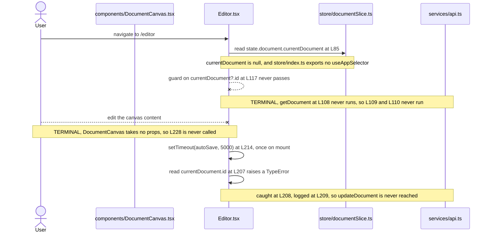

# `frontend/src/pages`

## Purpose

Four routed pages live in this directory. `frontend/src/App.tsx:L52-L55` binds each one to a path:
`Home` to `/`, `Editor` to `/editor`, `Templates` to `/templates` and `Settings` to `/settings`.
Each page composes shell components from `frontend/src/components` and reads client state through
store hooks. Three of the four also call a REST function, and `Home.tsx:L52` reads the store and
calls none. Every page carries at least one contract defect, and the `Known Limitations` heading
below cites each one.

## Key Components

| Component | Type | Location | Description |
| --- | --- | --- | --- |
| `Home` | Routed page, default export | `Home.tsx:L51`, exported at `L77` | Renders the welcome screen and three quick-access links. Takes no props. `App.tsx:L19` imports it as a default. |
| `Editor` | Routed page, default export | `Editor.tsx:L83`, exported at `L246` | Loads a document, holds the editor content string at `L86` and runs the auto-save timer. Takes no props. `App.tsx:L20` imports it as a default. |
| `Templates` | Routed page, default export | `Templates.tsx:L134`, exported at `L197` | Attempts a template fetch on mount through a helper `services/api.ts` does not export, so it issues no request, and renders a card grid over the empty initial state. Takes no props. `App.tsx:L21` imports it as a default. |
| `Settings` | Routed page, default export | `Settings.tsx:L79`, exported at `L164` | Renders a controlled two-field profile form. Takes no props. `App.tsx:L22` imports it as a default. |
| `handleContentChange` | Handler, `(newContent: string) => void` | `Editor.tsx:L228-L230` | Writes the incoming string to the `content` state at `Editor.tsx:L86`. Passed to `DocumentCanvas` at `L238`. |
| `handleSubmit` | Handler, `async (e: React.FormEvent)` | `Settings.tsx:L118-L128` | Calls `e.preventDefault()` at `L119`, sends `{ name, email }` at `L121` and dispatches `updateUser` at `L122`. |
| `handleTemplateSelection` | Handler, `(templateId: string) => void` | `Templates.tsx:L163-L167` | Stores the identifier at `L164` and returns. No navigation follows. |
| `Template` | Interface, module-local, not exported | `Templates.tsx:L61-L66` | Declares `id`, `name`, `description` and `thumbnail`. Types the state at `Templates.tsx:L135`. |

## Architecture Fit

These pages sit between the router in `frontend/src/App.tsx` and the shared components in
`frontend/src/components`. Each page owns one route, renders its own shell components, and reaches
the store and the REST client directly, so no container layer sits between a page and its data.
None declares a props type, so each is a `React.FC` with no type parameter.

`documentation/Technical Specifications.md` places the shell differently. Its
`USER INTERFACE DESIGN` heading at `L449` carries a diagram at `L453-L480` that makes five components
direct children of `App`: `Header`, `Toolbar`, `DocumentCanvas`, `Sidebar` and `Footer` at
`L455-L459`. The committed code splits that tree. `App.tsx` renders only `Header` at `L49` and
`Footer` at `L58`, while `Editor.tsx` renders `Toolbar` at `L236`, `DocumentCanvas` at `L238` and
`Sidebar` at `L239` inside the page. Intended behavior per that heading: `App` mounts all five once,
and a routed page fills the canvas region below them.

The repository-wide layer map lives in
[`docs/architecture-overview.md`](../../../docs/architecture-overview.md), and the bootstrap and
router surface belongs to the parent module at [`../README.md`](../README.md).

## Dependencies

**External.** Three packages reach this directory, and `frontend/package.json` declares all three.

| Package | Version | Declared at | Used by |
| --- | --- | --- | --- |
| `react` | `^18.2.0` | `frontend/package.json:L8` | All four pages. `Editor.tsx:L20` and `Templates.tsx:L32` import `useState` and `useEffect`, `Settings.tsx:L28` imports `useState`, and `Home.tsx:L18` imports the default only. |
| `react-router-dom` | `^6.11.1` | `frontend/package.json:L11` | `Home.tsx:L19` imports `Link`. No other page imports from the router. |
| `react-redux` | `^8.0.5` | `frontend/package.json:L10` | Reached only through the store hooks that `frontend/src/store/index.ts` fails to export. No page imports `react-redux` by name. |

No undeclared package is imported here, which separates this directory from
`frontend/src/components` and `frontend/src/services`. Every `@/`-prefixed import still fails
resolution: `frontend/tsconfig.json:L10-L16` declares `@components/*`, `@utils/*`, `@styles/*`,
`@hooks/*` and `@services/*`, and none is `@/*`.

**Internal.** These pages import five components plus nine functions, hooks and actions from sibling
modules. Two of the nine resolve, and the other seven are `getDocument`, `getTemplates`,
`updateUserSettings`, `useAppSelector`, `useAppDispatch`, `selectCurrentUser` and `updateUser`.

| Symbol | Imported at | Resolves | Reality |
| --- | --- | --- | --- |
| `Header`, `Toolbar`, `DocumentCanvas`, `Sidebar` | `Editor.tsx:L21-L24` | No | Each module default-exports its component: `components/Header.tsx:L91`, `Toolbar.tsx:L96`, `DocumentCanvas.tsx:L178`, `Sidebar.tsx:L30`. All four imports are named. |
| `Header`, `Footer` | `Settings.tsx:L29-L30`, `Templates.tsx:L33-L34` | No | Named imports of the default exports at `components/Header.tsx:L91` and `Footer.tsx:L44`. |
| `Header`, `Footer` | `Home.tsx:L20-L21` | Yes | Default imports matching the default exports. The only correct component import form in this directory. |
| `getDocument` | `Editor.tsx:L25` | No | `services/api.ts` exports `getDocuments` at `L217`, `createDocument` at `L245` and `updateDocument` at `L287`, and no singular `getDocument`. |
| `updateDocument` | `Editor.tsx:L25` | Yes | `services/api.ts:L287`, signature `(documentId: string, documentData: DocumentUpdate)`. |
| `getTemplates` | `Templates.tsx:L35` | No | `services/api.ts` exports no template function. |
| `updateUserSettings` | `Settings.tsx:L31` | No | `services/api.ts` exports no user function. |
| `useAppSelector` | `Editor.tsx:L26`, `Home.tsx:L22`, `Settings.tsx:L32`, `Templates.tsx:L36` | No | `store/index.ts` exports `RootState` at `L54`, `AppDispatch` at `L62` and a default `store` at `L65`, and defines no hooks. |
| `useAppDispatch` | `Editor.tsx:L26`, `Settings.tsx:L32` | No | Same module, same absence. |
| `selectCurrentUser` | `Home.tsx:L23`, `Settings.tsx:L33`, `Templates.tsx:L37` | No | `store/userSlice.ts:L139` exports `setUser`, `clearUser`, `setLoading` and `setError` only. |
| `updateUser` | `Settings.tsx:L33` | No | Same module, same absence. The marker at `store/userSlice.ts:L149-L154` already records `updateUser` and selectors as outstanding. |
| `setCurrentDocument` | `Editor.tsx:L27` | Yes | `store/documentSlice.ts:L155`. |

The contracts these pages read are documented in
[`docs/data-model.md`](../../../docs/data-model.md), and the REST calls they make are documented in
[`docs/integration-guide.md`](../../../docs/integration-guide.md). The owning modules carry their
own documentation: [`../services/README.md`](../services/README.md),
[`../store/README.md`](../store/README.md), [`../components/README.md`](../components/README.md) and
[`../schema/README.md`](../schema/README.md).

## Configuration

These pages read no environment variable, no `Settings` field and no `.env` value. The only
`process.env` reference in the whole frontend sits at `services/api.ts:L82`. Four hard-coded
literals stand in for configuration.

| Value | Literal | Location | Classification |
| --- | --- | --- | --- |
| Auto-save delay | `5000` milliseconds | `Editor.tsx:L214` | Hard-coded literal. No environment variable, no named constant and no override path. |
| Name field default | `''` | `Settings.tsx:L82` | Hard-coded fallback behind `currentUser?.name`. |
| Email field default | `''` | `Settings.tsx:L83` | Hard-coded fallback behind `currentUser?.email`. |
| Template fetch trigger | `[]` | `Templates.tsx:L152` | Hard-coded empty dependency array. Fixes the fetch to one run on mount. |

## Data Flows

The `Editor` page runs two effects against the same document identifier, and neither reaches the
server. The first effect at `Editor.tsx:L105-L120` guards on `currentDocument?.id` at `L117`, calls
`getDocument` at `L108`, writes the response to local state at `L109` and dispatches
`setCurrentDocument` at `L110`. The guard never passes. `currentDocument` starts at `null` in
`frontend/src/store/documentSlice.ts`, and the only `setCurrentDocument` dispatch in the committed
source is `L110` itself, inside this guarded effect, so no committed path seeds the identifier.

The second effect at `L186-L216` schedules `autoSave` through a five-second `setTimeout` at `L214`
and clears it at `L215` during cleanup. Its dependency array at `L216` lists `content` and
`currentDocument?.id`, so a change to either restarts the delay, and no edit ever changes `content`.
`handleContentChange` at `L228-L230` is the only writer, and `L238` passes that handler to
`DocumentCanvas` as `onContentChange` while `components/DocumentCanvas.tsx:L108` declares `React.FC`
with no props type. The timer therefore fires once, five seconds after mount, and `L207` reads
`currentDocument.id` on `null`. The resulting `TypeError` is raised inside the `try` at `L206`,
caught at `L208` and logged at `L209`. The closure resolves, no request is sent, and no signal
reaches the reader.

Crossed arrows below mark calls that never happen as committed.



The other three pages run shorter flows, and one of them reaches nothing. `Templates.tsx:L139-L152`
awaits `getTemplates` at `L142` once on mount and would store the result at `L143`, but
`services/api.ts` exports no such function, so the module fails resolution and the page issues no
request. `Settings.tsx:L118-L128` sends the form values at `L121` and
dispatches the response at `L122`. `Home.tsx:L52` reads the current user and calls no REST function.

## Design Patterns

**Debounced auto-save through a fixed timeout.** `Editor.tsx:L214` schedules one five-second
`setTimeout`, `L215` clears it during cleanup, and `frontend/package.json` declares no debounce
library.

**Container pages selecting from a single store.** Each page reads state through `useAppSelector` at
`Editor.tsx:L85`, `Home.tsx:L52`, `Settings.tsx:L81` and `Templates.tsx:L137`. Three then hold a
local copy. The editor keeps a `content` string at `Editor.tsx:L86` and `Templates.tsx:L135` keeps
the template array. `Settings.tsx:L82-L83` copies `name` and `email` out of `currentUser`.
`Home.tsx` holds none.

**Controlled form state.** `Settings.tsx:L138-L144` binds the name input's `value` at `L141` and
`onChange` at `L142` to the state at `L82`. `L148-L154` binds the email input the same way at `L151`
and `L152` against `L83`.

**Effect-driven loading on mount.** `Editor.tsx:L105-L120` keys its effect on `currentDocument?.id`
at `L120`. `Templates.tsx:L139-L152` passes an empty array at `L152` and runs once.

## Known Limitations

**Imports and exports.** Eight component imports use the wrong form, and seven symbols do not exist.

- `Editor.tsx:L21-L24` uses named imports for four default exports: `Header` at
  `components/Header.tsx:L91`, `Toolbar` at `Toolbar.tsx:L96`, `DocumentCanvas` at
  `DocumentCanvas.tsx:L178` and `Sidebar` at `Sidebar.tsx:L30`.
- `Settings.tsx:L29-L30` and `Templates.tsx:L33-L34` repeat that form for `Header` and `Footer`.
  `Home.tsx:L20-L21` is the only correct case in the directory.
- `Editor.tsx:L25` imports two symbols from one module and only one arrives. `updateDocument` exists
  at `services/api.ts:L287`; `getDocument` does not, and the plural at `L217` differs by one letter.
- `Settings.tsx` carries five of the seven absent symbols across `L31`, `L32` and `L33`, more than any
  other page.

**Auto-save.** The implemented interval and the specified interval differ by twenty-five seconds.

- `Editor.tsx:L214` implements a fixed five-second `setTimeout`. Under the `SAFETY` heading at
  `documentation/Software Requirements Specifications (SRS).md:L540`, `L543` specifies auto-save
  every thirty seconds during active editing. The code saves after five.
- `L544` of that same document promises a local cache of recent changes for crash recovery. No page
  in this directory writes one.
- The second effect at `Editor.tsx:L186-L216` has no null guard and no empty-content guard, unlike
  the first effect, which guards at `L117`. The timer fires once, five seconds after mount, and
  `L207` reads `.id` on a `null` value. The `TypeError` never escapes: the `try` at `L206` catches
  it, `L209` logs it, and the async closure resolves without sending a request.
- Load and save failures reach `console.error` at `Editor.tsx:L112` and `L209` and go nowhere else.
  No page shows an error to the user, and no retry follows.

**Contract drift.** Two shapes the pages rely on do not match the schemas in
[`../schema/README.md`](../schema/README.md).

- `Home.tsx:L59` reads `currentUser.name`, `Settings.tsx:L82` reads `currentUser?.name`, and
  `Settings.tsx:L121` submits a `name` field. `frontend/src/schema/user.ts:L37-L45` models `id`,
  `email`, `username`, optional `full_name`, `created_at`, `is_active` and `is_superuser`, and
  declares no `name`.
- `Templates.tsx:L61-L66` declares a local `Template` interface with `id`, `name`, `description` and
  `thumbnail`. `frontend/src/schema/template.ts:L30-L37` declares `TemplateSchema` with `id`, `name`,
  `content`, `owner_id`, `created_at` and `updated_at`, and exports the inferred type at `L40`. The
  two shapes overlap on `id` and `name` only, and `Templates.tsx` never imports the schema.

**Call sites and routing.** Two pages call across a boundary the receiving code does not offer.

- `Editor.tsx:L238` passes `content` and `onContentChange` to `DocumentCanvas`, which takes no props.
  `components/DocumentCanvas.tsx:L108` declares `React.FC` and reads `currentDocument` at `L110`.
- `Home.tsx:L61`, `L64` and `L67` link to `/new-document`, `/open-document` and `/recent-documents`.
  `App.tsx:L52-L55` declares `/`, `/editor`, `/templates` and `/settings`, and matches none.
- The shell duplicates route by route. `App.tsx` wraps every route in `Header` at `L49`, `main` at
  `L50-L57` and `Footer` at `L58`. `Home.tsx` adds `Header` at `L56`, `main` at `L57` and `Footer` at
  `L72`. `Templates.tsx` adds the same three at `L171`, `L172` and `L192`, and `Settings.tsx` at
  `L132`, `L133` and `L159`. `Editor.tsx:L234` adds `Header` alone and renders neither its own
  `Footer` nor its own `main`. `Header` therefore renders twice on all four routes, `Footer` twice on
  three, and a second `main` nests inside the first on three.
- No page mounts as committed. `App.tsx:L15` imports `Switch` and `L51` renders it, and the
  `react-router-dom` major version declared at `frontend/package.json:L11` removed that export. The
  router surface belongs to [`../README.md`](../README.md).

**Dead code and terminal interactions.** Two values go unread, one click leads nowhere, and one
initialization runs too early.

- `Templates.tsx:L136` declares `selectedTemplate`, which `L164` writes and nothing reads, and `L137`
  reads `currentUser` without using it. `L179` wires the card click to `handleTemplateSelection`,
  which stores an identifier at `L164` and ends, so the click leads nowhere.
- `Settings.tsx:L82-L83` initialise the form state once from `currentUser`. A `currentUser` that
  arrives after the first render leaves both fields empty.

**Accessibility.** Every native form control and every navigation control here is a native element or a
Router `Link`, so each is keyboard reachable without an extra handler. The template cards are not, and the
entry below records them. `Settings.tsx` associates both labels correctly, `L137`
to the input at `L140` and `L147` to the input at `L150`. No contrast ratio is asserted below,
because no stylesheet is committed and no authored colour pair exists to measure.

- Three routes expose two `main` landmarks. `App.tsx:L50` opens the outer one, and `Home.tsx:L57`,
  `Templates.tsx:L172` and `Settings.tsx:L133` each open a second inside it.
- The `banner` role duplicates on all four routes and `contentinfo` on three, through the shell
  duplication cited above, and no `aria-label` distinguishes either copy.
- `Editor` renders no heading. `Home.tsx:L58`, `Settings.tsx:L134` and `Templates.tsx:L173` each
  render an `h1`, and `Editor.tsx:L232-L243` renders none.
- The editor canvas exposes an unnamed text box. `Editor.tsx:L238` renders `DocumentCanvas`, whose
  Draft.js `Editor` carries no accessible name, as
  [`../components/README.md`](../components/README.md) records at the source.
- `Templates.tsx:L176-L188` renders each card as a `div` with `onClick` at `L179`, no `role`, no
  `tabIndex` and no key handler, so a keyboard user cannot reach or activate a card.
- No page authors a focus indicator, and no rule set exists to carry one, so focus visibility rests
  on the browser default.

**Styling.** Two conventions coexist, and no authored rule backs either one.

- Bespoke semantic class names appear in `Home.tsx` at `L55`, `L57`, `L60`, `L61`, `L64` and `L67`,
  in `Editor.tsx` at `L233`, `L235` and `L237`, at `Settings.tsx:L131` and at `Templates.tsx:L170`.
- Tailwind utility classes appear in the body of `Templates.tsx` at `L172`, `L173`, `L174`, `L184`,
  `L186` and `L187`. `L178` combines `template-card` with six Tailwind utilities, so one attribute
  mixes both conventions.
- No `tailwind.config.js`, no `postcss.config.js` and no stylesheet is committed anywhere, so once
  the build blockers are cleared no authored styling would apply under either convention.
  `frontend/package.json:L12` declares `tailwindcss` at `^3.3.2` regardless, and declares no
  component library and no design system, so the divergence is a styling inconsistency rather than a
  compliance gap.

**Markers and outstanding work.** The authors left four assistance markers and six outstanding-work
comments here, and `Home.tsx` carries none.

- Assistance markers sit at `Editor.tsx:L29`, `Settings.tsx:L35`, `Templates.tsx:L146` and
  `Templates.tsx:L165`.
- Outstanding-work comments sit at `Editor.tsx:L113`, `Editor.tsx:L210`, `Settings.tsx:L123`,
  `Settings.tsx:L126`, `Templates.tsx:L147` and `Templates.tsx:L166`.
- The subjects are error handling at `Editor.tsx:L113`, `L210` and `Templates.tsx:L147`, user
  feedback at `Settings.tsx:L123` and `L126`, and navigation at `Templates.tsx:L166`.
  `Templates.tsx` pairs a marker with a comment twice, at `L146-L147` and `L165-L166`.

The repository-wide defect register carries every entry above with its symptom and cross-references:
[`docs/troubleshooting.md`](../../../docs/troubleshooting.md).

## Usage Examples

**Mounting a page.** `App.tsx:L52-L55` registers all four pages against the router.

```tsx
// frontend/src/App.tsx:L52-L55
<Route exact path="/" component={Home} />
<Route path="/editor" component={Editor} />
<Route path="/templates" component={Templates} />
<Route path="/settings" component={Settings} />
```

The block does not mount today, because `App.tsx:L51` wraps the routes in `Switch` and the
`react-router-dom` version at `frontend/package.json:L11` no longer exports `Switch`.

**Reading the auto-save timer.** `Editor.tsx:L186-L216` schedules and cancels the save.

```tsx
// frontend/src/pages/Editor.tsx:L186-L216
useEffect(() => {
  const autoSave = async () => {
    try {
      await updateDocument(currentDocument.id, { content });
    } catch (error) {
      console.error('Error auto-saving document:', error);
      // outstanding-work comment: add proper error handling and user notification
    }
  };

  const timer = setTimeout(autoSave, 5000);
  return () => clearTimeout(timer);
}, [content, currentDocument?.id]);
```

The effect never reaches the server as committed. `L207` dereferences `currentDocument.id` with no
guard, so a `null` document raises a `TypeError` five seconds after mount. The `catch` at `L208`
absorbs it and `L209` logs it, so the closure resolves and the page shows nothing.

**Calling the page handlers.** Both blocks below reproduce a committed declaration verbatim.

```tsx
// frontend/src/pages/Editor.tsx:L228-L230
const handleContentChange = (newContent: string) => {
  setContent(newContent);
};

// frontend/src/pages/Templates.tsx:L163-L167
const handleTemplateSelection = (templateId: string) => {
  setSelectedTemplate(templateId);
  // HUMAN ASSISTANCE NEEDED
  // TODO: Implement navigation to template editing page or next step in the process
};
```

Neither handler runs today. Both files fail resolution on their `@/` imports against
`frontend/tsconfig.json:L10-L16`, and `services/api.ts` exports neither `getDocument` nor
`getTemplates`.

**Extending this directory.** A new page needs a resolvable component import, a store hook and a
REST function, and none exists in usable form. The list below records what the code needs, in the
order that removes the most blockers first.

1. `frontend/src/store/index.ts` needs `useAppSelector` and `useAppDispatch`. Four imports here
   expect them, and `L54-L65` exports only `RootState`, `AppDispatch` and the default `store`.
2. `frontend/src/services/api.ts` needs `getDocument`, `getTemplates` and `updateUserSettings`
   alongside the three functions it exports at `L217`, `L245` and `L287`.
3. `frontend/src/store/userSlice.ts` needs a `selectCurrentUser` selector and an `updateUser`
   action. Its own marker at `L149-L154` already records both as outstanding.
4. The template shape needs reconciling. `Templates.tsx:L61-L66` and
   `frontend/src/schema/template.ts:L30-L37` overlap on `id` and `name` only.

Two pitfalls sit in no single file. Every `@/` import fails against
`frontend/tsconfig.json:L10-L16`, and no `tailwind.config.js` or `postcss.config.js` is committed, so
the utility classes in `Templates.tsx` carry no rules.

Prerequisites and the clean-machine setup path live in
[`docs/onboarding.md`](../../../docs/onboarding.md).
