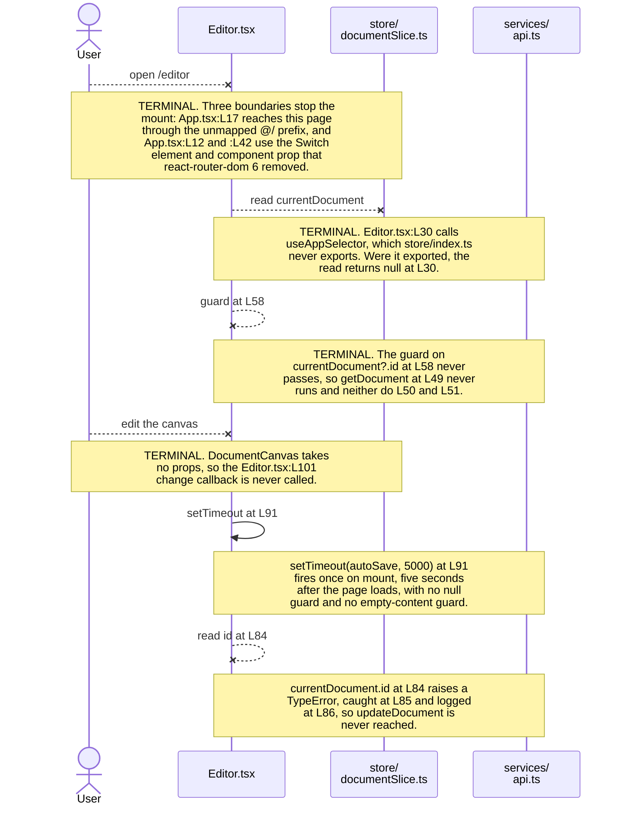

# `frontend/src/pages`

Line citations name the current committed source. Every `Lnn` locator below is the physical line number in the file at
`HEAD`, counting the file-header and per-construct comment blocks that the inline documentation pass added.

## Purpose

Four routed pages live in this directory. `frontend/src/App.tsx:L41-L44` binds each one to a path: `Home` to `/`, `Editor` to
`/editor`, `Templates` to `/templates` and `Settings` to `/settings`. Each page composes shell components from
`frontend/src/components` and reads client state through store hooks. Three of the four also call a REST function, and
`Home.tsx:L28` reads the store and calls none. Every page carries at least one contract defect, and the `Known Limitations`
heading below cites each one.

## Key Components

| Component | Type | Location | Description |
| --- | --- | --- | --- |
| `Home` | Routed page, default export | `Home.tsx:L27`, exported at `L53` | Renders the welcome screen and three quick-access links. Takes no props. `App.tsx:L16` imports it as a default. |
| `Editor` | Routed page, default export | `Editor.tsx:L28`, exported at `L119` | Loads a document, holds the editor content string at `L31` and runs the auto-save timer. Takes no props. `App.tsx:L17` imports it as a default. |
| `Templates` | Routed page, default export | `Templates.tsx:L42`, exported at `L113` | Attempts a template fetch on mount through a helper `services/api.ts` does not export, so it issues no request, and renders a card grid over the empty initial state. Takes no props. `App.tsx:L18` imports it as a default. |
| `Settings` | Routed page, default export | `Settings.tsx:L33`, exported at `L93` | Renders a controlled two-field profile form. Takes no props. `App.tsx:L19` imports it as a default. |
| `handleContentChange` | Handler, `(newContent: string) => void` | `Editor.tsx:L101-L103` | Writes the incoming string to the `content` state at `Editor.tsx:L31`. Passed to `DocumentCanvas` at `L111`. |
| `handleSubmit` | Handler, `async (e: React.FormEvent)` | `Settings.tsx:L47-L57` | Calls `e.preventDefault()` at `L48`, sends `{ name, email }` at `L50` and dispatches `updateUser` at `L51`. |
| `handleTemplateSelection` | Handler, `(templateId: string) => void` | `Templates.tsx:L79-L83` | Stores the identifier at `L80` and returns. No navigation follows. |
| `Template` | Interface, module-local, not exported | `Templates.tsx:L25-L30` | Declares `id`, `name`, `description` and `thumbnail`. Types the state at `Templates.tsx:L43`. |

None of the four pages declares a props type, so each is a `React.FC` with no type parameter. `App.tsx:L16-L19` imports all
four correctly as default imports.

## Architecture Fit

These pages sit between the router in `frontend/src/App.tsx` and the shared components in `frontend/src/components`. Each
page owns one route, renders its own shell components, and reaches the store and the REST client directly, so no container
layer sits between a page and its data. None declares a props type, so each is a `React.FC` with no type parameter.

The container boundary runs one way only in part. Three of the eight modules under `frontend/src/components` read or write
the store themselves rather than taking data from the page that renders them: `Header.tsx:L30`, `Toolbar.tsx:L35` and
`DocumentCanvas.tsx:L35-L36`. `Editor.tsx:L107`, `:L109` and `:L111` render all three, so on that route the page and its
children reach the same store independently.

`documentation/Technical Specifications.md` places the shell differently. Its `USER INTERFACE DESIGN` heading at `L449`
carries a diagram at `L453-L480` that makes five components direct children of `App`: `Header`, `Toolbar`, `DocumentCanvas`,
`Sidebar` and `Footer` at `L455-L459`. The committed code splits that tree. `App.tsx` renders only `Header` at `L38` and
`Footer` at `L47`, while `Editor.tsx` renders `Toolbar` at `L109`, `DocumentCanvas` at `L111` and `Sidebar` at `L112` inside
the page. Intended behavior per that heading: `App` mounts all five once, and a routed page fills the canvas region below
them.

The repository-wide layer map lives in [`docs/architecture-overview.md`](../../../docs/architecture-overview.md), and the
bootstrap and router surface belongs to the parent module at [`../README.md`](../README.md).

## Dependencies

**External.** Three packages reach this directory, and `frontend/package.json` declares all three.

| Package | Version | Declared at | Used by |
| --- | --- | --- | --- |
| `react` | `^18.2.0` | `frontend/package.json:L8` | All four pages. `Editor.tsx:L11` and `Templates.tsx:L11` import `useState` and `useEffect`, `Settings.tsx:L11` imports `useState`, and `Home.tsx:L10` imports the default only. |
| `react-router-dom` | `^6.11.1` | `frontend/package.json:L11` | `Home.tsx:L11` imports `Link`. No other page imports from the router. |
| `react-redux` | `^8.0.5` | `frontend/package.json:L10` | Reached only through the store hooks that `frontend/src/store/index.ts` fails to export. No page imports `react-redux` by name. |

No undeclared package is imported here, which separates this directory from `frontend/src/components` and
`frontend/src/services`. Every `@/`-prefixed import still fails resolution: `frontend/tsconfig.json:L10-L16` declares
`@components/*`, `@utils/*`, `@styles/*`, `@hooks/*` and `@services/*`, and none is `@/*`.

**Internal.** These pages import five components plus nine functions, hooks and actions from sibling modules. Two of the nine
resolve, and the other seven are `getDocument`, `getTemplates`, `updateUserSettings`, `useAppSelector`, `useAppDispatch`,
`selectCurrentUser` and `updateUser`.

| Symbol | Imported at | Resolves | Reality |
| --- | --- | --- | --- |
| `Header`, `Toolbar`, `DocumentCanvas`, `Sidebar` | `Editor.tsx:L12-L15` | No | Each module default-exports its component: `components/Header.tsx:L65`, `Toolbar.tsx:L91`, `DocumentCanvas.tsx:L74`, `Sidebar.tsx:L32`. All four imports are named. |
| `Header`, `Footer` | `Settings.tsx:L12-L13`, `Templates.tsx:L12-L13` | No | Named imports of the default exports at `components/Header.tsx:L65` and `Footer.tsx:L41`. |
| `Header`, `Footer` | `Home.tsx:L12-L13` | Yes | Default imports matching the default exports. The only correct component import form in this directory. |
| `getDocument` | `Editor.tsx:L16` | No | `services/api.ts` exports `getDocuments` at `L69`, `createDocument` at `L82` and `updateDocument` at `L95`, and no singular `getDocument`. |
| `updateDocument` | `Editor.tsx:L16` | Yes | `services/api.ts:L95`, signature `(documentId: string, documentData: DocumentUpdate)`. |
| `getTemplates` | `Templates.tsx:L14` | No | `services/api.ts` exports no template function. |
| `updateUserSettings` | `Settings.tsx:L14` | No | `services/api.ts` exports no user function. |
| `useAppSelector` | `Editor.tsx:L17`, `Home.tsx:L14`, `Settings.tsx:L15`, `Templates.tsx:L15` | No | `store/index.ts` exports `RootState` at `L32`, `AppDispatch` at `L34` and a default `store` at `L36`, and defines no hooks. |
| `useAppDispatch` | `Editor.tsx:L17`, `Settings.tsx:L15` | No | Same module, same absence. |
| `selectCurrentUser` | `Home.tsx:L15`, `Settings.tsx:L16`, `Templates.tsx:L16` | No | `store/userSlice.ts:L97` exports `setUser`, `clearUser`, `setLoading` and `setError` only. |
| `updateUser` | `Settings.tsx:L16` | No | Same module, same absence. The marker at `store/userSlice.ts:L102-L107` already records `updateUser` and selectors as outstanding. |
| `setCurrentDocument` | `Editor.tsx:L18` | Yes | `store/documentSlice.ts:L118`. |

Seven symbols resolve to nothing: `getDocument`, `getTemplates`, `updateUserSettings`, `useAppSelector`, `useAppDispatch`,
`selectCurrentUser` and `updateUser`.

The contracts these pages read sit in [`docs/data-model.md`](../../../docs/data-model.md), and the REST calls they make sit
in [`docs/integration-guide.md`](../../../docs/integration-guide.md). The owning modules carry their own documentation:
[`../services/README.md`](../services/README.md), [`../store/README.md`](../store/README.md),
[`../components/README.md`](../components/README.md) and [`../schema/README.md`](../schema/README.md).

## Configuration

These pages read no environment variable, no `Settings` field and no `.env` value. The only `process.env` reference in the
whole frontend sits at `services/api.ts:L21`. Four hard-coded literals stand in for configuration.

| Value | Literal | Location | Classification |
| --- | --- | --- | --- |
| Auto-save delay | `5000` milliseconds | `Editor.tsx:L91` | Hard-coded literal. No environment variable, no named constant and no override path. |
| Name field default | `''` | `Settings.tsx:L36` | Hard-coded fallback behind `currentUser?.name`. |
| Email field default | `''` | `Settings.tsx:L37` | Hard-coded fallback behind `currentUser?.email`. |
| Template fetch trigger | `[]` | `Templates.tsx:L70` | Hard-coded empty dependency array. Fixes the fetch to one run on mount. |

## Data Flows

The `Editor` page runs two effects against the same document identifier, and neither reaches the server. The first effect at
`Editor.tsx:L37-L61` guards on `currentDocument?.id` at `L58`, calls `getDocument` at `L49`, writes the response to local
state at `L50` and dispatches `setCurrentDocument` at `L51`. The guard never passes. `currentDocument` starts at `null` in
`frontend/src/store/documentSlice.ts`, and the only `setCurrentDocument` dispatch in the committed source is `Editor.tsx:L51`
itself, inside this guarded effect, so no committed path seeds the identifier.

The second effect at `Editor.tsx:L70-L93` schedules `autoSave` through a five-second `setTimeout` at `L91` and clears it at
`L92` during cleanup. Its dependency array at `L93` lists `content` and `currentDocument?.id`, so a change to either restarts the delay,
and no edit ever changes `content`. `handleContentChange` at `L101-L103` is the only writer, and `L111` passes that handler to
`DocumentCanvas` as `onContentChange` while `components/DocumentCanvas.tsx:L34` declares `React.FC` with no props type.

The timer therefore fires once, five seconds after mount, and `Editor.tsx:L84` reads `currentDocument.id` on `null`. The
resulting `TypeError` is raised inside the `try` at `:L83`, caught at `:L85` and logged at `:L86`. The closure resolves, no
request is sent, and no signal reaches the reader.

The diagram below traces the flow the page declares, and it continues past each stopping point to show what the module would
still attempt. A solid arrow holds in the committed code. A crossed arrow marks a step that cannot happen, and its note names
the boundary that stops it.



The other three pages run shorter flows, and neither page that names a REST function reaches the server. `services/api.ts`
exports exactly three functions, `getDocuments` at `L69`, `createDocument` at `L82` and `updateDocument` at `L95`, and
neither call below names one of them. `Templates.tsx:L58-L67` awaits `getTemplates` at `L60` and would store the result at
`L61`, so the module fails resolution and the page issues no request. `Settings.tsx:L47-L57` is the same attempt in submit
form, awaiting `updateUserSettings` at `L50` and dispatching the response at `L51`, and it too issues no request.
`Home.tsx:L28` reads the current user and calls no REST function at all.

## Design Patterns

**Debounced auto-save through a fixed timeout.** `Editor.tsx:L91` schedules one five-second `setTimeout`, `L92` clears it
during cleanup, and `frontend/package.json` declares no debounce library.

**Container pages selecting from a single store.** Each page reads state through `useAppSelector` at `Editor.tsx:L30`,
`Home.tsx:L28`, `Settings.tsx:L35` and `Templates.tsx:L45`. Three then hold a local copy.

The editor keeps a `content` string at `Editor.tsx:L31` and `Templates.tsx:L43` keeps the template array.
`Settings.tsx:L36-L37` copies `name` and `email` out of `currentUser`. `Home.tsx` holds none.

**Controlled form state.** `Settings.tsx:L67-L73` binds the name input's `value` at `L70` and `onChange` at `L71` to the
state at `L36`. `L77-L83` binds the email input the same way at `L80` and `L81` against `L37`.

**Effect-driven loading on mount.** `Editor.tsx:L37-L61` keys its effect on `currentDocument?.id` at `L61`.
`Templates.tsx:L47-L70` passes an empty array at `L70` and runs once.

## Known Limitations

**Imports and exports.** Eight component imports use the wrong form, and seven symbols do not exist.

- `Editor.tsx:L12-L15` uses named imports for four default exports: `Header` at `components/Header.tsx:L65`, `Toolbar` at
`Toolbar.tsx:L91`, `DocumentCanvas` at `DocumentCanvas.tsx:L74` and `Sidebar` at `Sidebar.tsx:L32`.
- `Settings.tsx:L12-L13` and `Templates.tsx:L12-L13` repeat that form for `Header` and `Footer`. `Home.tsx:L12-L13` is the
only correct case in the directory.
- `Editor.tsx:L16` imports two symbols from one module and only one arrives. `updateDocument` exists at
`services/api.ts:L95`; `getDocument` does not, and the plural at `L69` differs by one letter.
- `Settings.tsx` carries five of the seven absent symbols across `L14`, `L15` and `L16`, more than any other page.

**Auto-save.** The implemented interval and the specified interval differ by twenty-five seconds.

- `Editor.tsx:L91` implements a fixed five-second `setTimeout`. Under the `SAFETY` heading at `documentation/Software
Requirements Specifications (SRS).md:L540`, `L543` specifies auto-save every thirty seconds during active editing. The code
saves after five.
- `L544` of that same document promises a local cache of recent changes for crash recovery. No page in this directory writes
one.
- The second effect at `Editor.tsx:L70-L93` has no null guard and no empty-content guard, unlike the first effect, which
guards at `L58`. The timer fires once, five seconds after mount, and `L84` reads `.id` on a `null` value. The `TypeError`
never escapes: the `try` at `L83` catches it, `L86` logs it, and the async closure resolves without sending a request.
- Load and save failures reach `console.error` at `Editor.tsx:L53` and `L86` and go nowhere else. No page shows an error to
the user, and no retry follows.

**Contract drift.** Two shapes the pages rely on do not match the schemas in [`../schema/README.md`](../schema/README.md).

- `Home.tsx:L35` reads `currentUser.name`, `Settings.tsx:L36` reads `currentUser?.name`, and `Settings.tsx:L50` submits a
`name` field. `frontend/src/schema/user.ts:L19-L27` models `id`, `email`, `username`, optional `full_name`, `created_at`,
`is_active` and `is_superuser`, and declares no `name`.
- `Templates.tsx:L25-L30` declares a local `Template` interface with `id`, `name`, `description` and `thumbnail`.
`frontend/src/schema/template.ts:L21-L28` declares `TemplateSchema` with `id`, `name`, `content`, `owner_id`, `created_at`
and `updated_at`, and exports the inferred type at `L31`. The two shapes overlap on `id` and `name` only, and `Templates.tsx`
never imports the schema.

**Call sites and routing.** Two pages call across a boundary the receiving code does not offer.

- `Editor.tsx:L111` passes `content` and `onContentChange` to `DocumentCanvas`, which takes no props.
`components/DocumentCanvas.tsx:L34` declares `React.FC` and reads `currentDocument` at `L36`.
- `Home.tsx:L37`, `L40` and `L43` link to `/new-document`, `/open-document` and `/recent-documents`. `App.tsx:L41-L44`
declares `/`, `/editor`, `/templates` and `/settings`, and matches none.
- The shell duplicates route by route. `App.tsx` wraps every route in `Header` at `L38`, `main` at `L39-L46` and `Footer` at
  `L47`. `Home.tsx` adds `Header` at `L32`, `main` at `L33` and `Footer` at `L48`. `Templates.tsx` adds the same three at
  `L87`, `L88` and `L108`, and `Settings.tsx` at `L61`, `L62` and `L88`.

- `Editor.tsx:L107` adds `Header` alone and renders neither its own `Footer` nor its own `main`. `Header` therefore
  renders twice on all four routes, `Footer` twice on three, and a second `main` nests inside the first on three.
- No page mounts as committed. `App.tsx:L12` imports `Switch` and `L40` renders it, and the `react-router-dom` major version
declared at `frontend/package.json:L11` removed that export. The router surface belongs to [`../README.md`](../README.md).

**Dead code and terminal interactions.** Two values go unread, one click leads nowhere, and one initialization runs too
early.

- `Templates.tsx:L44` declares `selectedTemplate`, which `L80` writes and nothing reads, and `L45` reads `currentUser`
without using it. `L95` wires the card click to `handleTemplateSelection`, which stores an identifier at `L80` and ends, so
the click leads nowhere.
- `Settings.tsx:L36-L37` initialise the form state once from `currentUser`. A `currentUser` that arrives after the first
render leaves both fields empty.

**Accessibility.** Every interactive control here is a native element or a Router `Link`, with one exception, so each of the
rest is keyboard reachable without an extra handler. The exception is the template card at `Templates.tsx:L92-L95`, a
clickable `div` that the last bullet below covers. `Settings.tsx` associates both labels correctly, `L66` to the input at
`L69` and `L76` to the input at `L79`. No contrast ratio is asserted below, because no stylesheet is committed and no
authored colour pair exists to measure, so criterion 1.4.3 is unassessable here. Each bullet names its WCAG 2.1 Level AA
success criterion, defined in [the documentation
conventions](../../../docs/README.md#6-accessibility-criterion-tags), and asserts no conformance.

- Three routes expose two `main` landmarks. `App.tsx:L39` opens the outer one, and `Home.tsx:L33`, `Templates.tsx:L88` and
`Settings.tsx:L62` each open a second inside it. Criterion 1.3.1.
- The `banner` role duplicates on all four routes and `contentinfo` on three, through the shell duplication cited above, and
no `aria-label` distinguishes either copy. The duplicate `banner` brings a duplicate `navigation` landmark with it, because
both `Header` copies render the same `nav` at `components/Header.tsx:L40` with no accessible name. Every route therefore
announces two identical navigation regions. Each surviving landmark needs a distinct name, and removing the second render at
`Home.tsx:L32`, `Editor.tsx:L107`, `Templates.tsx:L87` and `Settings.tsx:L61` comes first. Criteria 1.3.1 and 2.4.6.
- `Editor` renders no heading. `Home.tsx:L34`, `Settings.tsx:L63` and `Templates.tsx:L89` each render an `h1`, and
`Editor.tsx:L105-L116` renders none. Criterion 1.3.1.
- The editor canvas exposes an unnamed text box. `Editor.tsx:L111` renders `DocumentCanvas`, whose Draft.js `Editor` carries
no accessible name, as [`../components/README.md`](../components/README.md) records at the source. Criterion 4.1.2.
- `Templates.tsx:L92-L104` renders each card as a `div` with `onClick` at `L95`, no `role`, no `tabIndex` and no key handler,
so a keyboard user cannot reach or activate a card. Criteria 2.1.1 and 4.1.2.
- No page authors a focus indicator, and no rule set exists to carry one, so focus visibility rests on the browser
default. Criterion 2.4.7.

**Styling.** Two conventions coexist, and no authored rule backs either one.

- Bespoke semantic class names appear in `Home.tsx` at `L31`, `L33`, `L36`, `L37`, `L40` and `L43`, in `Editor.tsx` at `L106`,
`L108` and `L110`, at `Settings.tsx:L60` and at `Templates.tsx:L86`.
- Tailwind utility classes appear in the body of `Templates.tsx` at `L88`, `L89`, `L90`, `L100`, `L102` and `L103`. `L94`
combines `template-card` with six Tailwind utilities, so one attribute mixes both conventions.
- Responsive behaviour rests on one line. `Templates.tsx:L90` carries `md:grid-cols-2` and `lg:grid-cols-3`, the only two
breakpoint-prefixed classes anywhere in `frontend/src`, so the template grid is the one surface that reflows. No other page
declares a breakpoint and neither does any component, so every other layout is fixed at one width.
- No `tailwind.config.js`, no `postcss.config.js` and no stylesheet is committed anywhere, so once the build blockers are
cleared no authored styling would apply under either convention, including the two breakpoints above.
`frontend/package.json:L12` declares `tailwindcss` at `^3.3.2` regardless, and declares no component library and no design
system, so the divergence is a styling inconsistency rather than a compliance gap.

**Markers and outstanding work.** The authors left four assistance markers and six outstanding-work comments here, and
`Home.tsx` carries none.

- Assistance markers sit at `Editor.tsx:L20`, `Settings.tsx:L18`, `Templates.tsx:L64` and `Templates.tsx:L81`.
- Outstanding-work comments sit at `Editor.tsx:L54`, `Editor.tsx:L87`, `Settings.tsx:L52`, `Settings.tsx:L55`,
`Templates.tsx:L65` and `Templates.tsx:L82`.
- The subjects are error handling at `Editor.tsx:L54`, `L87` and `Templates.tsx:L65`, user feedback at `Settings.tsx:L52` and
`L55`, and navigation at `Templates.tsx:L82`. `Templates.tsx` pairs a marker with a comment twice, at `L64-L65` and
`L81-L82`.

### Absent security controls

Three entries in the repository-wide [G9 register](../../../docs/troubleshooting.md#g9-absent-security-controls) have a call
site in this directory. The locators below match the register.

| # | Absent control | Evidence in this directory | What the absence permits |
| --- | --- | --- | --- |
| 14 | Redaction before an error is logged | `Editor.tsx:L53` and `:L86`, `Templates.tsx:L63` and `Settings.tsx:L54` each pass a whole error object to `console.error`. An Axios error carries the request configuration, which includes the `Authorization` header, the full URL and the request body | Nothing leaks today, because the client cannot build and no request carries a token. Once the blockers clear, any failed request whose configuration holds a bearer token or a document body puts both in the browser console and in anything that collects from it |
| 16 | Ordering protection on the auto-save path | `Editor.tsx:L91` schedules a save five seconds after the last edit, and nothing tracks whether an earlier save is still in flight | A slower earlier save can land after a later one and overwrite newer content |
| 18 | An allow-list on remote image sources | `Templates.tsx:L98` renders `template.thumbnail` as an unconstrained `src`, with no `referrerPolicy`, and no Content Security Policy is committed | A stored URL causes the browser to contact an arbitrary host, disclosing the viewer address and referrer to it |

Entry 14 also fires from `../services/auth.ts:L58`, and entry 18 also fires from `../components/Header.tsx:L51`. The
[services README](../services/README.md) and the [components README](../components/README.md) record those call sites.

The repository-wide defect register carries every entry above with its symptom and cross-references:
[`docs/troubleshooting.md`](../../../docs/troubleshooting.md).

## Usage Examples

**Mounting a page.** `App.tsx:L41-L44` registers all four pages against the router.

```tsx
// frontend/src/App.tsx:L41-L44
<Route exact path="/" component={Home} />
<Route path="/editor" component={Editor} />
<Route path="/templates" component={Templates} />
<Route path="/settings" component={Settings} />
```

The block does not mount today, because `App.tsx:L40` wraps the routes in `Switch` and the `react-router-dom` version at
`frontend/package.json:L11` no longer exports `Switch`.

**Reading the auto-save timer.** `Editor.tsx:L70-L93` schedules and cancels the save.

```tsx
// frontend/src/pages/Editor.tsx:L70-L93
useEffect(() => {
  const autoSave = async () => {
    try {
      await updateDocument(currentDocument.id, { content });
    } catch (error) {
      console.error('Error auto-saving document:', error);
      // outstanding-work comment: add proper error handling and user notification
    }
  };

  const timer = setTimeout(autoSave, 5000);
  return () => clearTimeout(timer);
}, [content, currentDocument?.id]);
```

The effect never reaches the server as committed. `L84` dereferences `currentDocument.id` with no guard, so a `null` document
raises a `TypeError` five seconds after mount. The `catch` at `L85` absorbs it and `L86` logs it, so the closure resolves and
the page shows nothing.

**Calling the page handlers.** The first block below reproduces a committed declaration verbatim. The second is abbreviated:
every line is verbatim except the two comment lines at `Templates.tsx:L81-L82`, which are summarised rather than quoted.

```tsx
// frontend/src/pages/Editor.tsx:L101-L103
const handleContentChange = (newContent: string) => {
  setContent(newContent);
};

// frontend/src/pages/Templates.tsx:L79-L83, comments abbreviated
const handleTemplateSelection = (templateId: string) => {
  setSelectedTemplate(templateId);
  // an assistance marker at L81, then an outstanding-work comment at L82 asking for
  // navigation to a template editing page or the next step in the process
};
```

Neither handler runs today. Both files fail resolution on their `@/` imports against `frontend/tsconfig.json:L10-L16`, and
`services/api.ts` exports neither `getDocument` nor `getTemplates`.

**Extending this directory.** A new page needs a resolvable component import, a store hook and a REST function, and none
exists in usable form. The list below records what the code needs, in the order that removes the most blockers first.

1. `frontend/src/store/index.ts` needs `useAppSelector` and `useAppDispatch`. Four imports here expect them, and `L32-L36`
exports only `RootState`, `AppDispatch` and the default `store`.
2. `frontend/src/services/api.ts` needs `getDocument`, `getTemplates` and `updateUserSettings` alongside the three functions
it exports at `L69`, `L82` and `L95`.
3. `frontend/src/store/userSlice.ts` needs a `selectCurrentUser` selector and an `updateUser` action. Its own marker at
`L102-L107` already records both as outstanding.
4. The template shape needs reconciling. `Templates.tsx:L25-L30` and `frontend/src/schema/template.ts:L21-L28` overlap on
`id` and `name` only.

Two pitfalls sit in no single file. Every `@/` import fails against `frontend/tsconfig.json:L10-L16`, and no
`tailwind.config.js` or `postcss.config.js` is committed, so the utility classes in `Templates.tsx` carry no rules.

Prerequisites and the clean-machine setup path live in [`docs/onboarding.md`](../../../docs/onboarding.md).
