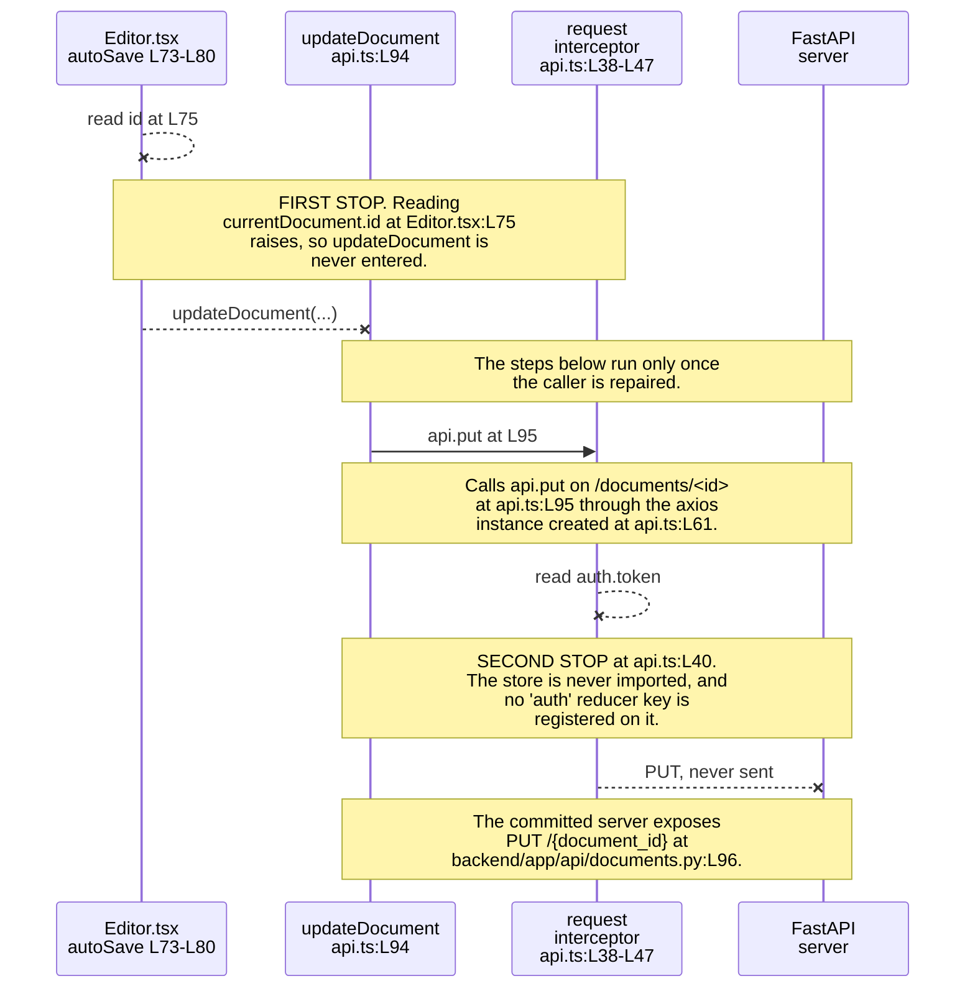

# frontend/src/services

*Line citations in this document use the current numbering of each module at `HEAD`, counting the comment blocks the inline documentation pass added. Each citation names its symbol as well as its line, so a reader can confirm the target after any later edit.*

## Purpose

The directory holds the client's three outbound integration points: document calls over REST (Representational State Transfer), authentication calls, and a Socket.IO collaboration client. `api.ts` builds one shared Axios instance and exports three document functions. `auth.ts` exports three authentication functions that bypass that shared instance and call the bare Axios global. `collaboration.ts` exports a class that wraps a Socket.IO connection. Only `api.ts` has importers anywhere in `frontend/src`, and each of its three importers names a symbol the module never defines.

## Key Components

| Component | Type | Location | Description |
| --- | --- | --- | --- |
| `createApiClient` | Module-private factory | `api.ts:L31` | Builds an `AxiosInstance`, sets the JSON content type, and attaches both interceptors. Declared `const` with no `export` keyword, so no other module can call it. |
| `api` | Module-private singleton | `api.ts:L61` | Holds the one instance `createApiClient` returns, created once when the module evaluates. |
| `getDocuments` | Exported async function | `api.ts:L69` | Issues `GET /documents` (`api.ts:L70`) and returns `response.data` typed `Document[]`. |
| `createDocument` | Exported async function | `api.ts:L81` | Issues `POST /documents` with the `DocumentCreate` body (`api.ts:L82`) and returns the created document. |
| `updateDocument` | Exported async function | `api.ts:L94` | Issues `PUT /documents/${documentId}` with the `DocumentUpdate` body (`api.ts:L95`) and returns the updated document. |
| `login` | Exported async function | `auth.ts:L34` | Posts `{ email, password }` to `/auth/login` (`auth.ts:L36`), reads `response.data.accessToken` (`auth.ts:L37`), writes it to `localStorage` (`auth.ts:L38`), and returns it. |
| `logout` | Exported async function | `auth.ts:L52` | Posts to `/auth/logout` (`auth.ts:L54`), then removes the stored token (`auth.ts:L55`). |
| `getCurrentUser` | Exported async function | `auth.ts:L69` | Issues `GET /auth/me` (`auth.ts:L71`) and casts the body to `User` (`auth.ts:L72`). |
| `CollaborationService` | Default-exported class | `collaboration.ts:L26`, `:L107` | Opens a Socket.IO connection in its constructor (`collaboration.ts:L37`) and tracks one document id. |
| `joinDocument` | Public method | `collaboration.ts:L62` | Emits `join_document` with the id (`collaboration.ts:L63`) and stores it as the active document. |
| `leaveDocument` | Public method | `collaboration.ts:L74` | Emits `leave_document` when an id is tracked (`collaboration.ts:L76`), then clears it (`collaboration.ts:L77`). |
| `sendChanges` | Public method | `collaboration.ts:L94` | Emits `document_changes` carrying `{ documentId, changes }` (`collaboration.ts:L96-L99`), or throws when no document is active (`collaboration.ts:L101`). |

## Architecture Fit

The directory sits between the routed pages and the server, and it is the only place in `frontend/src` that opens a network connection. The specification places an integration boundary here too. Its `## HIGH-LEVEL ARCHITECTURE DIAGRAM` heading routes the single-page application through an `API Gateway` node (`documentation/Technical Specifications.md:L145`), and no committed file implements that node. The committed code matches the specification's placement of a client-side service tier, and diverges on the transport target.

The endpoint paths make the divergence precise, and they sit between the client and the committed server rather than between the client and declared intent. Under the specification's `## API DESIGN` heading, an `/auth` group declares `POST /login` and `POST /logout` (`documentation/Technical Specifications.md:L408`, `:L413-L414`). A `/documents` group declares `GET /documents` and `POST /documents` (`:L409`, `:L417-L418`). The client follows those four declarations at `auth.ts:L36`, `auth.ts:L54`, `api.ts:L70` and `api.ts:L82`.

The committed server follows none of them. `backend/app/main.py:L80-L83` mounts all four routers with no prefix, so the document routes serve `/` and `/{document_id}` (`backend/app/api/documents.py:L24-L126`). The token route is `POST /token` (`backend/app/api/auth.py:L65`). One path matches neither side. `auth.ts:L71` calls `GET /auth/me`, while the specification declares `GET /users/me` (`documentation/Technical Specifications.md:L424`) and the server exposes `GET /me` (`backend/app/api/users.py:L19`).

For the repository-wide map of these boundaries, see [`docs/architecture-overview.md`](../../../docs/architecture-overview.md).

## Dependencies

Internal dependencies, including imports of names that do not exist.

| Import | Source | Resolves | Used by |
| --- | --- | --- | --- |
| `RootState` | `../store` (`frontend/src/store/index.ts:L32`) | Yes | Read in the request interceptor (`api.ts:L18`, `:L40`). Imported and never referenced in `auth.ts:L17` and `collaboration.ts:L16`. |
| `Document`, `DocumentCreate`, `DocumentUpdate` | `../schema/document` | No. The path resolves and all three names are absent | Annotate all three exports (`api.ts:L19`). `collaboration.ts:L17` imports `Document` and never uses it. |
| `User` | `../schema/user` (`frontend/src/schema/user.ts:L30`) | Yes | Return type of `getCurrentUser` (`auth.ts:L18`, `:L69`). |

`frontend/src/schema/document.ts` exports two schema values and no inferred type alias, which is why the compiler cannot find the three `api.ts:L19` names. The sibling [`../schema/README.md`](../schema/README.md) owns that causal chain. Both schema imports here are contract surface, mapped in [`docs/data-model.md`](../../../docs/data-model.md).

External dependencies:

| Package | Imported at | Declared in `frontend/package.json` | Status |
| --- | --- | --- | --- |
| `axios` | `api.ts:L17`, `auth.ts:L16` | No. The seven runtime dependencies sit at `frontend/package.json:L7-L13` | Imported but undeclared |
| `socket.io-client` | `collaboration.ts:L15` | No | Imported but undeclared |

Three of the thirteen undeclared-package import statements in `frontend/src` originate in this directory. The parent [`../README.md`](../README.md) owns the full decomposition. The two packages carry different specification standing. Under its `## FRAMEWORKS AND LIBRARIES` heading the specification declares Axios as a frontend library (`documentation/Technical Specifications.md:L544`), while no file under `documentation/` names `socket.io-client` at all. Both packages reach external services, described in [`docs/integration-guide.md`](../../../docs/integration-guide.md).

## Configuration

| Setting | Read or declared at | Status | Effect |
| --- | --- | --- | --- |
| `REACT_APP_API_BASE_URL` | Read at `api.ts:L21` | READ-BUT-NEVER-DECLARED | Supplies `baseURL` for the shared instance (`api.ts:L33`). The single `process.env` read in all of `frontend/src`. |
| `REACT_APP_API_URL` | Declared at `infrastructure/docker/docker-compose.yml:L11` as `http://backend:5000` | DECLARED-BUT-NEVER-READ | No module reads the name, so the injected value never reaches the client. |
| `Content-Type: application/json` | Set at `api.ts:L36` | Hard-coded default | Applies to every request the shared instance sends. |
| `localStorage` key `accessToken` | Written at `auth.ts:L38`, removed at `auth.ts:L55` | Hard-coded key | The only client-side token store. No module reads the key back. `setItem` coerces its value, so the current write stores the string `"undefined"`. |
| Socket.IO origin | `io()` at `collaboration.ts:L37` | Implicit | Called with no URL, so the client targets the page origin rather than a configured host. |

The two environment variable names do not match, so `API_BASE_URL` at `api.ts:L21` evaluates to `undefined` and every request from the shared instance resolves against the page origin. Prerequisites and runtime versions live in [`docs/onboarding.md`](../../../docs/onboarding.md).

## Data Flows

One document request is written in the committed source, and it stops twice. `frontend/src/pages/Editor.tsx:L75` reads `currentDocument.id` to build the first argument, and that read raises before `updateDocument` is entered, which [`../pages/README.md`](../pages/README.md) records at the caller.

A repaired caller would then stop inside the shared instance. `api.ts:L40` reads `(store.getState() as RootState).auth.token`, and the expression fails twice over. No module imports `store` into `api.ts`, so the identifier is undefined at call time. The `auth` property is also absent, because `frontend/src/store/index.ts:L25-L28` registers only the reducer keys `document` and `user`. A reader who adds the missing import still gets a failure on the absent key.

The other two modules do not use the shared instance. `auth.ts:L16` imports the bare Axios global, so its three requests carry neither the configured base URL nor the bearer header. `collaboration.ts` has no importer anywhere in `frontend/src`, so nothing constructs the class and no traffic leaves it.

The diagram traces the directory's only committed call site. `frontend/src/pages/Editor.tsx:L16` is the one page import of an `api.ts` export. `getDocuments` and `createDocument` have no importer anywhere, so neither appears below.



### Caller and server contracts

Six client call sites exist across `api.ts` and `auth.ts`. The table sets each one against the committed server route it aims at. `backend/app/main.py:L80-L83` mounts every router with no prefix, so a server path carries no group segment.

| # | Client call site | Client request | Committed server route | Agrees on |
| --- | --- | --- | --- | --- |
| 1 | `login`, `auth.ts:L36` | `POST /auth/login`, page origin, JSON body `{ email, password }`, no `Authorization` header | `POST /token`, `backend/app/api/auth.py:L65`, an `OAuth2PasswordRequestForm` body, so `application/x-www-form-urlencoded` `{ username, password }` | Nothing. The method alone is shared |
| 2 | `logout`, `auth.ts:L54` | `POST /auth/logout`, page origin, no body | No route. No logout path exists in any router under `backend/app/api/` | Nothing |
| 3 | `getCurrentUser`, `auth.ts:L71` | `GET /auth/me`, page origin, no `Authorization` header | `GET /me`, `backend/app/api/users.py:L19`, behind `get_current_user` | Method only |
| 4 | `getDocuments`, `api.ts:L70` | `GET /documents`, `baseURL` `undefined`, and no `Bearer` header, because the request interceptor throws before the request is sent | `GET /`, `backend/app/api/documents.py:L49`, behind `get_current_user` | Method only |
| 5 | `createDocument`, `api.ts:L82` | `POST /documents`, JSON `DocumentCreate` body | `POST /`, `backend/app/api/documents.py:L24`, behind `get_current_user` | Method and encoding |
| 6 | `updateDocument`, `api.ts:L95` | `PUT /documents/<id>`, JSON `DocumentUpdate` body | `PUT /{document_id}`, `backend/app/api/documents.py:L96`, behind `get_current_user` | Method, encoding and the identifier's position in the path |

The login call is the widest gap, and it diverges in five independent places. Those are the path, the request origin, the body encoding, the credential field name (`email` against `username`) and the response field name (`accessToken` against `access_token`). `backend/app/api/auth.py:L100` returns `{"access_token": ..., "token_type": "bearer"}`.

Headers and state handoff diverge on their own axis. `api.ts:L40-L42` is the only writer of an `Authorization` header anywhere in the frontend. That writer reads a Redux path which does not exist, so no request from any module carries a bearer token. The three `auth.ts` calls use the bare Axios global imported at `auth.ts:L16` and never reach that interceptor. Nothing links the two halves: `auth.ts:L38` writes a token to `localStorage` and no module reads the key back, while `api.ts:L40` looks for a token in Redux, where nothing writes one.

## Design Patterns

Three patterns shape the directory. The module-level singleton client appears in `api.ts`, where `createApiClient` runs once at module evaluation and assigns its result to `api` (`api.ts:L61`). Every exported function in the file shares that one instance rather than building its own.

The request interceptor pattern carries bearer token injection. `api.ts:L38-L47` registers a function that reads a token, sets an `Authorization: Bearer` header when one is present (`api.ts:L42`), and returns the config. A second interceptor handles responses at `api.ts:L49-L55`, and passes both branches through unchanged: `api.ts:L50` returns the response as received, and `api.ts:L53` re-rejects the error as received.

The thin service facade pattern covers all three modules. Each exported function wraps exactly one transport call and returns `response.data` with no client-side mapping, caching, or retry. `collaboration.ts` applies the same shape to Socket.IO, where each method wraps a single `emit`.

## Known Limitations

Every item below comes from the committed code. Two of the three modules have no importer, and the third defines one of the four symbols its importers ask for.

`api.ts`:

- `api.ts:L19` imports `Document`, `DocumentCreate` and `DocumentUpdate` from `../schema/document`, and the module exports none of them, so all three annotations fail to resolve.
- `api.ts:L40` reads a `store` binding the module never imports, and reads an `auth` key that `frontend/src/store/index.ts:L25-L28` never registers. Every request through the shared instance fails at the interceptor.
- `createApiClient` at `api.ts:L31` is declared `const` with no `export`, so no other module can build a client.
- The response interceptor at `api.ts:L49-L55` adds no behavior, because both of its branches return their argument unchanged.
- `api.ts:L21` reads `REACT_APP_API_BASE_URL` while `infrastructure/docker/docker-compose.yml:L11` injects `REACT_APP_API_URL`, so `baseURL` is `undefined`.
- The three `/documents` paths fail three different ways once the blockers above clear, because `backend/app/main.py:L80-L83` mounts every router with no prefix. `GET /documents` at `api.ts:L70` is a single path segment, so it matches `GET /{document_id}`, declared at `backend/app/api/documents.py:L68`, and binds `document_id` to the literal string `documents`. That route is protected at `backend/app/api/documents.py:L69`, so its outcome depends on credentials before it depends on anything else.
- Without a valid token the `get_current_user` dependency answers 401 and the handler body never runs. An authenticated caller whose user record resolves reaches `:L91`, which raises `TypeError` because it calls `get_document(document_id)` with one argument against the two the signature at `../../../backend/app/services/document_service.py:L78` requires, so that caller receives 500. Either way no document comes back, and no `Document[]` the caller declared either. `POST /documents` at `api.ts:L82` matches the same single-segment shape for which no router declares `POST`, so Starlette answers 405 rather than 404, before any dependency runs. `PUT /documents/${documentId}` at `api.ts:L95` carries two segments that no route declares, so it answers 404, also before any dependency runs. Neither of those two outcomes depends on credentials.
- Three importers name symbols this module never defines: `getDocument` (`frontend/src/pages/Editor.tsx:L16`), `getTemplates` (`frontend/src/pages/Templates.tsx:L14`) and `updateUserSettings` (`frontend/src/pages/Settings.tsx:L14`). All three imports use the `@/` prefix, which `frontend/tsconfig.json:L10-L16` never maps, so each import fails module resolution before the compiler checks the member name. The parent [`../README.md`](../README.md) owns the alias root cause.
- `api.ts:L94` runs to 110 characters, above the 100-character width the other modules keep.

`auth.ts`:

- `auth.ts:L16` imports the bare Axios global instead of the configured instance, so no request here carries the base URL or the bearer header.
- `auth.ts:L17` imports `RootState` and never references it.
- All three endpoint paths miss the committed server. `auth.ts:L36` calls `/auth/login` against `POST /token` (`backend/app/api/auth.py:L65`), and `auth.ts:L71` calls `/auth/me` against `GET /me` (`backend/app/api/users.py:L19`). No logout route exists anywhere in the backend, so `/auth/logout` at `auth.ts:L54` has no counterpart at all.
- `auth.ts:L37` reads `response.data.accessToken` while `backend/app/api/auth.py:L100` returns `access_token`, so the read yields `undefined`. `localStorage.setItem` coerces its value to a string, so `auth.ts:L38` stores the nine-character string `"undefined"` rather than the value `undefined`, and any later truthiness test on the stored value passes.
- `auth.ts:L55` removes the stored token only after the request succeeds, so a failed logout leaves the token in the browser.
- `auth.ts:L57` logs the logout error and does not rethrow, so the promise resolves and the caller cannot detect the failure.
- `auth.ts:L72` casts the response body to `User` with no validation, so a malformed body passes silently.
- `auth.ts:L41` and `auth.ts:L74` throw generic errors that discard the original cause.
- No module in `frontend/src` imports this file, so none of the three functions runs.

`collaboration.ts`:

- `collaboration.ts:L37` calls `io()` with no URL, so the client connects to the page origin.
- `setupEventListeners` at `collaboration.ts:L47-L52` has a body of comments only, so the client handles no inbound event and can emit without ever receiving.
- `joinDocument`, `leaveDocument` and `sendChanges` (`collaboration.ts:L62`, `:L74`, `:L94`) are each declared `async` and contain no `await`, so every returned promise resolves before any server round trip. The declared type contradicts the runtime behavior.
- The emitted payload does not match the server. `collaboration.ts:L96-L99` sends `{ documentId, changes }` over Socket.IO, while `backend/app/services/collaboration_service.py:L44` declares `connect(self, websocket: WebSocket, document_id: str, user_id: str)` against a FastAPI `WebSocket` and `:L133` declares `broadcast_change(self, document_id: str, change: dict)`. No WebSocket route exists in `backend/app/api/` or `backend/app/main.py`, so the collaboration path is unreachable from both ends.
- `collaboration.ts:L16` imports `RootState` and `collaboration.ts:L17` imports the absent `Document` type, and the module references neither.
- `collaboration.ts:L107` default-exports the class, and no module in `frontend/src` imports the file, so nothing constructs it.
- Three assistance markers left by the module's authors sit at `collaboration.ts:L48` (inbound event listeners in `setupEventListeners`), `collaboration.ts:L54` (`joinDocument`) and `collaboration.ts:L81` (`sendChanges`).

### Token storage exposure

The items below describe the committed code and what a repaired login would carry. Each records an exposure rather than proposing a mitigation.

- `auth.ts:L38` writes the token to `localStorage`, which any script running on the page origin can read. Web Storage offers no equivalent of an `HttpOnly` cookie flag, so a script-injection defect on any page of the origin reaches the value directly.
- The value survives a tab close and a browser restart, so a token written once persists until something removes it. `auth.ts:L55` removes the key only after `POST /auth/logout` resolves. `auth.ts:L56-L58` logs a failure without rethrowing, so a failed logout leaves the token in the browser and reports success to the caller.
- No expiry sits beside the stored value. The server stamps `exp` inside the token at `backend/app/api/auth.py:L96`, and the client stores the string alone. Nothing on the client distinguishes an expired token from a live one without decoding it.
- No cross-tab synchronization exists. No module listens for the `storage` event, so a logout in one tab leaves every other tab holding the value it already read.
- No module reads the key back. `api.ts:L40` looks for a token in Redux instead, so the stored value reaches no request as committed.
- The stored value today is the string `"undefined"` rather than a token, per the `auth.ts:L37` field-name mismatch above. The exposure described here is what a repaired login would introduce, not what the browser holds now.

For the repository-wide defect register, see [`docs/troubleshooting.md`](../../../docs/troubleshooting.md).

## Usage Examples

`api.ts` holds the directory's only three real exports. A page imports just one of them, `updateDocument` (`frontend/src/pages/Editor.tsx:L16`), while `getDocuments` and `createDocument` have no importer at all. Each example below matches the declared signature at its cited line.

```typescript
import { getDocuments, createDocument, updateDocument } from '../services/api';

// getDocuments takes no arguments (api.ts:L69).
const documents = await getDocuments();

// createDocument takes one DocumentCreate argument (api.ts:L81).
const created = await createDocument({ title: 'Quarterly report', content: '' });

// updateDocument takes an id and a DocumentUpdate body (api.ts:L94).
const updated = await updateDocument(created.id, { content: 'First paragraph.' });
```

None of the three calls above completes today. The interceptor at `api.ts:L40` throws on the undefined `store` binding before any request leaves the instance. `axios` is also absent from `frontend/package.json:L7-L13`, so the module does not resolve at build time.

The `CollaborationService` class is reachable only through its default export:

```typescript
import CollaborationService from '../services/collaboration';

const collaboration = new CollaborationService();
await collaboration.joinDocument('doc-123'); // collaboration.ts:L62
await collaboration.sendChanges({ blocks: [] }); // collaboration.ts:L94
```

Both calls resolve without reaching a server, because `collaboration.ts:L62` and `:L94` contain no `await` and no WebSocket route exists in `backend/app/api/` or `backend/app/main.py`.

Work this directory needs, ordered so that unblocking comes first and no integration is made
reachable before its security prerequisites are settled:

1. An inferred `Document` type exported from `frontend/src/schema/document.ts`, which the three names at `api.ts:L19` depend on.
2. A single environment variable name shared by `api.ts:L21` and `infrastructure/docker/docker-compose.yml:L11`.
3. A `store` binding and an `auth` reducer key available to `api.ts:L40`.
4. Endpoint paths agreed between `auth.ts:L36`, `:L54`, `:L71` and the committed routers.
5. A server route that terminates the Socket.IO traffic `collaboration.ts:L96-L99` emits.

Each item records a gap rather than a change made here. Setup steps and prerequisites live in [`docs/onboarding.md`](../../../docs/onboarding.md). [`../store/README.md`](../store/README.md) documents the sibling client state.
