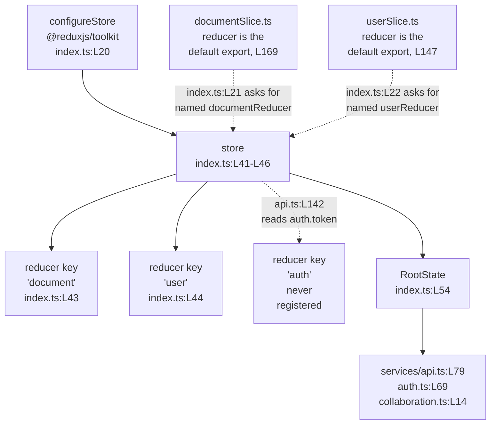

# frontend/src/store

The store never constructs. `index.ts:L21` imports `documentReducer` and `index.ts:L22` imports `userReducer` as named
bindings, while `documentSlice.ts:L169` and `userSlice.ts:L147` export their reducer as the default. Those two lines carry the
directory's only two `TS2614` errors, reported as a missing member because both relative paths resolve.

Thirteen import statements across seven consumer modules also ask this directory for a symbol it never exports, and the two
tables under Known Limitations name every one.

## Purpose

The directory composes the single Redux store for the browser application and owns two state trees, one for documents and one
for local user and profile state. The second tree is not an authentication record. `userSlice.ts:L76` sets `isAuthenticated`
true at `L78` on any `setUser` dispatch. The slice holds no token, checks no signature and calls no server, so nothing here
establishes that a user is signed in. `index.ts` calls `configureStore` and exports the store with two derived types.
`documentSlice.ts` and `userSlice.ts` each declare a Redux Toolkit slice holding its state shape, initial state and
synchronous reducers. No module here reaches the network, reads an environment variable or runs an asynchronous operation.

## Key Components

| Component | Type | Location | Description |
| --- | --- | --- | --- |
| `index.ts` | Module | `index.ts:L20-L65` | Composition root. `configureStore` at L41-L46 registers two reducer keys, `document` at L43 and `user` at L44, and receives `reducer` alone with no `middleware`, `devTools`, `preloadedState` or `enhancers` option. |
| `RootState` | Exported type | `index.ts:L54` | `ReturnType<typeof store.getState>`. Three service modules import the name and one references it. |
| `AppDispatch` | Exported type | `index.ts:L62` | `typeof store.dispatch`. No module in `frontend/src` imports the name. |
| `store` | Default export | `index.ts:L65` | The module's only default binding. `index.tsx:L17` imports it and `index.tsx:L36` passes it to a React Redux `Provider`. |
| `documentSlice.ts` | Module | `documentSlice.ts:L21-L174` | Declares the `document` slice with four state fields at L25-L30 and six reducers. |
| `setCurrentDocument` | Reducer and action | `documentSlice.ts:L75` | Writes `state.currentDocument` from a `Document` payload. The only action a consumer imports. |
| `addRecentDocument` | Reducer and action | `documentSlice.ts:L89` | Prepends the payload and keeps four earlier entries, so the list holds five at most. |
| `setLoading` | Reducer and action | `documentSlice.ts:L100` | Writes `state.isLoading` from a boolean payload. |
| `setError` | Reducer and action | `documentSlice.ts:L112` | Declares `PayloadAction<string \| null>`, so `setError(null)` clears the document error. |
| `clearCurrentDocument` | Reducer and action | `documentSlice.ts:L122` | Sets `state.currentDocument` to null. Takes no `action` parameter. |
| `clearRecentDocuments` | Reducer and action | `documentSlice.ts:L132` | Empties `state.recentDocuments`. Takes no `action` parameter. |
| Document action creators | Named export | `documentSlice.ts:L154-L161` | Destructures all six creators from `documentSlice.actions`. |
| Document reducer | Default export | `documentSlice.ts:L169` | `documentSlice.reducer`, exported under no other name. |
| `userSlice.ts` | Module | `userSlice.ts:L21-L154` | Declares the `user` slice with four state fields at L25-L30 and four reducers. |
| `setUser` | Reducer and action | `userSlice.ts:L76` | Writes four fields at L77-L80: the user, `isAuthenticated` true, `isLoading` false and a null error. |
| `clearUser` | Reducer and action | `userSlice.ts:L91` | Resets the same four fields at L92-L95. Takes no `action` parameter. |
| `setLoading` | Reducer and action | `userSlice.ts:L104` | Writes `state.isLoading` from a boolean payload. |
| `setError` | Reducer and action | `userSlice.ts:L116` | Declares `PayloadAction<string>`, narrower than `documentSlice.ts:L112`, so no payload clears the user error. Also sets `isLoading` false at L118. |
| User action creators | Named export | `userSlice.ts:L139` | Destructures `setUser`, `clearUser`, `setLoading` and `setError` on one line. |
| User reducer | Default export | `userSlice.ts:L147` | `userSlice.reducer`, exported under no other name. |

## Architecture Fit

The directory sits between the presentation layer and the service clients. Pages and components read state from it and
dispatch actions into it, and the three service modules import its `RootState` type to describe the state they read. The
two slices depend downward on the Zod contracts in `../schema`, and no module here imports a page or a component.

The in-repository specification serves as a point of comparison rather than a source of truth. Its
`## FRAMEWORKS AND LIBRARIES` heading names Redux as the state management library for the frontend at
`documentation/Technical Specifications.md:L542`, and the committed code matches that placement through Redux Toolkit,
declared at `frontend/package.json:L7`. The `### Frontend Components` diagram at
`documentation/Technical Specifications.md:L183-L199` names fifteen nodes and includes no state-management node, so the
specification names Redux without placing the store in its diagram. See
the [architecture overview](../../../docs/architecture-overview.md) and the [frontend source README](../README.md).

## Dependencies

### Internal

| Importer | Imported name and path | Location | Status |
| --- | --- | --- | --- |
| `index.ts` | `documentReducer` from `./documentSlice` | `index.ts:L21` | Fails. `documentSlice.ts:L169` exports the reducer as the default and declares no `documentReducer`. |
| `index.ts` | `userReducer` from `./userSlice` | `index.ts:L22` | Fails. `userSlice.ts:L147` exports the reducer as the default and declares no `userReducer`. |
| `documentSlice.ts` | `Document` from `../schema/document` | `documentSlice.ts:L22` | Fails. `schema/document.ts` exports two schema values and no inferred type. |
| `userSlice.ts` | `User` from `../schema/user` | `userSlice.ts:L22` | Resolves against `schema/user.ts:L56`. |

One missing export line separates the last two rows. `schema/user.ts:L56` declares `export type User`, so `userSlice.ts:L22`
resolves, and `schema/document.ts` declares no equivalent, so `documentSlice.ts:L22` does not. The
[schema README](../schema/README.md) owns that causal chain, and the
[data model reference](../../../docs/data-model.md) consolidates the contract drift the slices carry.

### External

| Package | Declared in `frontend/package.json` | Imported at | Status |
| --- | --- | --- | --- |
| `@reduxjs/toolkit` | `^1.9.5` at L7 | `index.ts:L20`, `documentSlice.ts:L21`, `userSlice.ts:L21` | Declared and resolving |
| `react-redux` | `^8.0.5` at L10 | Not imported in this directory | Declared. The consuming pages, components and `index.tsx:L15` import it instead. |

The three modules import one third-party package between them, and `frontend/package.json:L7` declares it. The directory
therefore imports no undeclared package, which sets it apart from `../schema`, `../services` and `../utils`.

## Configuration

The three modules read no environment variable and no configuration file. No `process.env` reference appears in any of
them. The values below are the fixed constants the slices hold, and source sets each one.

| Setting | Value | Where set |
| --- | --- | --- |
| Recent-document list length | Five entries at most | `documentSlice.ts:L90` |
| Document slice initial state | `currentDocument` null, `recentDocuments` empty, `isLoading` false, `error` null | `documentSlice.ts:L33-L38`, fields at L34-L37 |
| User slice initial state | `currentUser` null, `isAuthenticated` false, `isLoading` false, `error` null | `userSlice.ts:L33-L38`, fields at L34-L37 |
| Slice names | `'document'` and `'user'` | `documentSlice.ts:L58`, `userSlice.ts:L55` |
| Middleware, dev tools, preloaded state | None passed | `index.ts:L41-L46` |
| Environment variables | None read | No `process.env` reference in the directory |

## Data Flows

One path through the directory is traceable end to end, and a single action drives it. `pages/Editor.tsx:L27` imports
`setCurrentDocument`, `pages/Editor.tsx:L110` dispatches it with the record fetched at `:L108`, and the reducer at
`documentSlice.ts:L75` writes `state.currentDocument`. `RootState` at `index.ts:L54` then types that state for
`services/api.ts:L79`.

The path stops at both ends. No dispatch reaches a reducer, because `index.ts:L21-L22` name reducers the slices do not
export. The read side stops for a second reason: `services/api.ts:L142` reads `.auth.token` off `RootState`, and
`index.ts:L42-L45` registers `document` and `user` only. The other five document actions and all four user actions have no
importer anywhere in `frontend/src`.



## Design Patterns

Unidirectional single store. One `configureStore` call at `index.ts:L41-L46` holds all shared client state, and a consumer
changes that state by dispatching an action rather than by writing to it. `index.tsx:L36` passes the store to a React Redux
`Provider`, the single point where the component tree gains access.

Slice per domain. Each slice declares its state shape, initial state and reducers in one module. `documentSlice.ts:L57-L136`
covers documents and `userSlice.ts:L54-L121` covers the user, and neither slice reads the other's state.

Draft mutation through Immer. Every reducer in both slices assigns to a field on `state` and returns nothing, as
`documentSlice.ts:L76` and `userSlice.ts:L77-L80` show. Redux Toolkit hands the reducer a draft object and derives the next
state from the recorded assignments, so the assignment is the output.

Typed selector composition. `RootState` at `index.ts:L54` derives the state type from the store rather than from a
hand-written interface, so a selector receives the shape the reducer map produces. `pages/Editor.tsx:L85` writes an inline
selector against that shape, reading `state.document.currentDocument`.

## Known Limitations

Every defect below sits in the committed code, and none is repaired here. Two absent hooks and three absent slice members
account for thirteen failing import statements across seven consumer modules, so the tables come first. Seven modules import a
store hook that `index.ts` does not define, each through the `@/store` path.

| # | Importing module | Line | Symbols imported |
| --- | --- | --- | --- |
| 1 | `pages/Editor.tsx` | L26 | `useAppSelector`, `useAppDispatch` |
| 2 | `pages/Settings.tsx` | L32 | `useAppSelector`, `useAppDispatch` |
| 3 | `pages/Templates.tsx` | L36 | `useAppSelector` |
| 4 | `pages/Home.tsx` | L22 | `useAppSelector` |
| 5 | `components/Header.tsx` | L22 | `useAppSelector` |
| 6 | `components/DocumentCanvas.tsx` | L22 | `useAppSelector`, `useAppDispatch` |
| 7 | `components/Toolbar.tsx` | L23 | `useAppDispatch` |

`index.ts:L20-L22` imports nothing from `react-redux`, so the module could not re-export either hook as committed. Four
modules import `selectCurrentUser`, and one also imports `updateUser`, each through `@/store/userSlice`.

| # | Importing module | Line | Symbols imported |
| --- | --- | --- | --- |
| 1 | `pages/Settings.tsx` | L33 | `selectCurrentUser`, `updateUser` |
| 2 | `pages/Templates.tsx` | L37 | `selectCurrentUser` |
| 3 | `pages/Home.tsx` | L23 | `selectCurrentUser` |
| 4 | `components/Header.tsx` | L23 | `selectCurrentUser` |

- **The store never constructs.** `index.ts:L21` and `:L22` import `documentReducer` and `userReducer`, while
  `documentSlice.ts:L169` and `userSlice.ts:L147` export their reducer as the default. Both identifiers appear nowhere else in
  `frontend/src`. The [frontend source README](../README.md) holds the full type-check profile.
- **No `auth` reducer key exists, and a request interceptor reads one.** `index.ts:L42-L45` registers `document` at L43 and
  `user` at L44. `services/api.ts:L142` reads `(store.getState() as RootState).auth.token` for its `Authorization` header.
- **`updateDocument` and `selectCurrentDocument` are absent from `documentSlice.ts`.** `components/DocumentCanvas.tsx:L23`
  imports both and dispatches `updateDocument` at `:L164`, and `components/Toolbar.tsx:L24` imports it and dispatches it at
  `:L63` and `:L68`. The slice exports six creators at `documentSlice.ts:L154-L161` and neither name is among them. A separate
  `updateDocument` is an application programming interface (API) client function at `services/api.ts:L287`, imported at
  `pages/Editor.tsx:L25`; the two names are unrelated.
- **`userSlice.ts` exports neither `selectCurrentUser` nor `updateUser`.** `userSlice.ts:L139` exports `setUser`,
  `clearUser`, `setLoading` and `setError`, and no consumer imports any of those four. Every module reaching for user state
  reaches for one of the two absent names in the table above.
- **`documentSlice.ts:L22` imports a `Document` type that `../schema/document` does not export.** The path resolves and the
  member does not exist. The [schema README](../schema/README.md) traces the chain to the one missing export line.
- **`addRecentDocument` caps the recent list at five, and the literal in the code reads `4`.** `documentSlice.ts:L90`
  prepends the payload to `state.recentDocuments.slice(0, 4)`, keeping four earlier entries beside the new one. No named
  constant carries the limit and no configuration changes it.
- **`AppDispatch` is exported and unused.** `index.ts:L62` declares the type, and no module imports the name. The four
  `useAppDispatch()` call sites at `pages/Editor.tsx:L84`, `pages/Settings.tsx:L80`,
  `components/DocumentCanvas.tsx:L109` and `components/Toolbar.tsx:L59` call the absent hook rather than use the type.
- **The two slices treat a cleared error differently.** `documentSlice.ts:L112` declares `PayloadAction<string | null>`, so
  `setError(null)` clears the document error. `userSlice.ts:L116` declares `PayloadAction<string>`, so no payload clears the
  user error and only `clearUser` at `userSlice.ts:L91` resets it. `userSlice.ts:L118` also sets `isLoading` to `false`,
  which `documentSlice.ts:L112-L114` does not.
- **`App.tsx` imports the store under a name the module does not export.** `frontend/src/App.tsx:L23` writes
  `import { store } from '@/store/index'`, a named import of a default-only export. `frontend/src/index.tsx:L17` writes
  `import store from '@/store'` and gets the form right.
- **Both slices carry an end-of-file assistance marker.** `documentSlice.ts:L171-L174` and `userSlice.ts:L149-L154` each sit
  after the export statements. The user-slice marker names the missing `updateUser` action at `:L152` and the missing
  selectors at `:L153`.

The [troubleshooting register](../../../docs/troubleshooting.md) carries every defect above with file and line evidence.

## Usage Examples

No dispatch below executes today, because `store/index.ts:L21-L22` import reducer names the two slices never export and the
store never constructs. The [onboarding guide](../../../docs/onboarding.md) carries the prerequisites and runtime versions.

Dispatching a document action uses the six creators exported at `documentSlice.ts:L154-L161`, with payload fields from
`DocumentSchema` at `schema/document.ts:L65-L73`:

```typescript
import store from '../store';
import { setCurrentDocument, addRecentDocument, setError } from '../store/documentSlice';

const doc = {
  id: 'doc-1', title: 'Quarterly report', content: '', owner_id: 'user-1',
  created_at: new Date(), updated_at: new Date(), collaborators: [],
};

store.dispatch(setCurrentDocument(doc));
store.dispatch(addRecentDocument(doc));
store.dispatch(setError(null));
```

A sixth `addRecentDocument` dispatch drops the oldest entry, because `documentSlice.ts:L90` retains four. `setError(null)`
clears the document error, because `documentSlice.ts:L112` accepts null.

Dispatching a user action uses the four creators exported on `userSlice.ts:L139`, with payload fields from `UserSchema` at
`schema/user.ts:L37-L45`:

```typescript
import store from '../store';
import { setUser, setLoading, clearUser } from '../store/userSlice';

store.dispatch(setLoading(true));
store.dispatch(setUser({
  id: 'user-1', email: 'editor@example.com', username: 'editor',
  full_name: 'Sample Editor', created_at: new Date(),
  is_active: true, is_superuser: false,
}));
store.dispatch(clearUser());
```

`setUser` also sets `isAuthenticated` to true and clears the error at `userSlice.ts:L78-L80`, and it does so for any payload
that satisfies the `User` type. No token accompanies the dispatch and no server confirms it, so the flag records a local
claim rather than a verified session. `clearUser` at `userSlice.ts:L91` is the one path that clears the user error.

Three gaps block the directory, recorded here rather than repaired, widest first. `index.ts` lacks the `useAppSelector` and
`useAppDispatch` hooks that seven modules import, and its reducer imports at L21-L22 do not match the default exports at
`documentSlice.ts:L169` and `userSlice.ts:L147`. `documentSlice.ts` lacks the `updateDocument` action that
`components/DocumentCanvas.tsx` and `components/Toolbar.tsx` import. The slices lack the two selectors five modules import.
