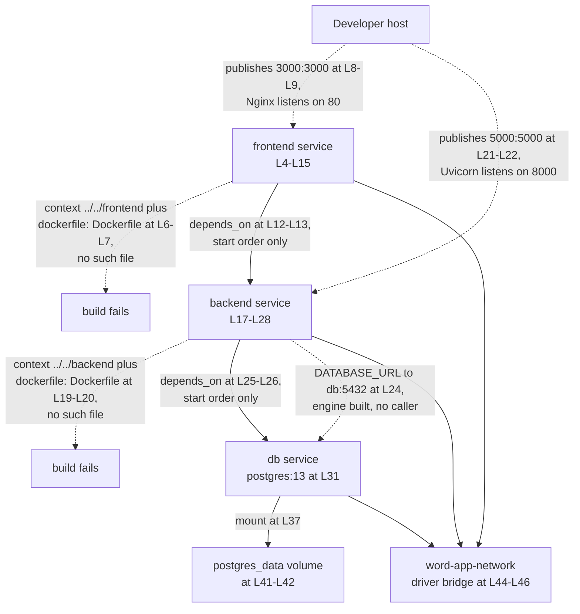

# Docker Container Artifacts

## Purpose

Three files package the two deployable units and stand up a local development stack. `backend.Dockerfile` builds the FastAPI image serving the
application programming interface (API), and `frontend.Dockerfile` compiles the React bundle for Nginx. `docker-compose.yml` wires both alongside
a PostgreSQL database on a private bridge network. None of the three works as committed. `docker compose up` stops at build-context resolution,
and each Dockerfile fails on its own line when built directly. Known Limitations lists every blocker in the order a developer meets it.

## Key Components

| Component | Type | Location | Description |
| --- | --- | --- | --- |
| `backend.Dockerfile` | Single-stage image build | `backend.Dockerfile:L1-L27` | Installs Python dependencies, copies the application code, and starts Uvicorn on port 8000 (`:L20`). Carries the folder's only human-assistance marker at `:L22-L27`. |
| `frontend.Dockerfile` | Multi-stage image build | `frontend.Dockerfile:L1-L32` | Compiles the React bundle in a Node.js stage (`:L2-L17`), then copies the output into an Nginx stage listening on port 80 (`:L20-L32`). |
| `docker-compose.yml` | Local orchestration | `docker-compose.yml:L1-L46` | Compose file format `3.8` (`:L1`) declaring three services, one named volume, and one bridge network. Holds no comment and no marker. |
| `frontend` service | Compose service | `docker-compose.yml:L4-L15` | Builds from context `../../frontend` (`:L6`), publishes `3000:3000` (`:L8-L9`), and declares `depends_on: backend` (`:L12-L13`), which orders container start only. |
| `backend` service | Compose service | `docker-compose.yml:L17-L28` | Builds from context `../../backend` (`:L19`), publishes `5000:5000` (`:L21-L22`), and declares `depends_on: db` (`:L25-L26`), which orders container start only. |
| `db` service | Compose service | `docker-compose.yml:L30-L39` | Runs the published `postgres:13` image (`:L31`) and provisions database `wordapp` for user `postgres` (`:L33-L34`). Publishes no port. |
| `postgres_data` | Named volume | `docker-compose.yml:L41-L42` | Declared with no driver and no options, mounted at `/var/lib/postgresql/data` (`:L37`) so database files survive a container replacement. |
| `word-app-network` | Bridge network | `docker-compose.yml:L44-L46` | User-defined bridge (`:L46`) joined by all three services, which gives each service a resolvable name. |

## Architecture Fit

The three files here package software, while the sibling `infrastructure/terraform/` folder provisions cloud infrastructure. The two layers never
meet. Compose builds images from local source and runs them on a developer machine, while the Terraform configuration declares Google Cloud
Platform (GCP) resources through the `provider "google"` block in `infrastructure/terraform/main.tf`. No Compose service reads a Terraform output,
and no Terraform resource consumes an image built here.

The two units packaged here are the FastAPI backend under `backend/app/` and the React frontend under `frontend/src/`. The `db` service builds no
image, because Compose pulls the published `postgres:13` image instead (`docker-compose.yml:L31`). See
[`../../docs/architecture-overview.md`](../../docs/architecture-overview.md) for the whole-system map.

Three documents name three different cloud providers: committed code targets GCP, `infrastructure/terraform/outputs.tf` reads Amazon Web Services
addresses, and `documentation/Software Project Proposal.md` names Microsoft Azure. The [deployment guide](../../docs/deployment-guide.md) owns the
full treatment and the deployment path.

## Dependencies

### Internal

| Dependency | Referenced from | Status |
| --- | --- | --- |
| `Dockerfile` under `../../frontend` | `docker-compose.yml:L7` | ABSENT. No file named `Dockerfile` exists in that context. |
| `Dockerfile` under `../../backend` | `docker-compose.yml:L20` | ABSENT. No file named `Dockerfile` exists in that context. |
| `requirements.txt` | `backend.Dockerfile:L8`, consumed at `:L11` | ABSENT. No `requirements.txt` exists anywhere in the repository. |
| An npm lockfile | `frontend.Dockerfile:L11` | ABSENT. No `package-lock.json`, `yarn.lock`, or `pnpm-lock.yaml` is committed. |
| `nginx.conf` | `frontend.Dockerfile:L26` | ABSENT, and the `COPY` line is commented out. |
| `frontend/package.json` | `frontend.Dockerfile:L8`, through the `package*.json` glob | PRESENT. The glob matches it and tolerates the absent lockfile. |

### External

| Image | Tag | Declared at | Role |
| --- | --- | --- | --- |
| `python` | `3.9-slim` | `backend.Dockerfile:L2` | Backend runtime. Python 3.9 reached end of life on 31 October 2025, with 3.9.25 as the final security release. |
| `node` | `14-alpine` | `frontend.Dockerfile:L2` | Frontend build stage. Node.js 14 reached end of life on 30 April 2023. |
| `nginx` | `alpine` | `frontend.Dockerfile:L20` | Serves the compiled bundle. The tag pins no minor version, so a rebuild can pull a different Nginx release. |
| `postgres` | `13` | `docker-compose.yml:L31` | Local database. PostgreSQL 13 reached end of life on 13 November 2025, with 13.23 as the final release. |

All three pinned runtimes are unsupported as of 6 August 2026, so none receives security patches. Every tag here except `nginx:alpine` pins a
major version and takes whatever patch release the registry currently serves.

Nothing here configures a managed cloud service successfully, and nothing here provisions one. Compose declares no GCP credential mount and no GCP
project value. Both GCP fields on `Settings` are `Optional` and default to `None` (`backend/app/core/config.py:L116-L117`), so a backend container
would reach Firestore, Cloud Storage, and Pub/Sub with no project and no credential path. See
[the integration guide](../../docs/integration-guide.md) for those paths and their reachability.

## Configuration

Every value Compose supplies sits inline in `docker-compose.yml`. No `.env` file is committed, and no Compose stanza reads one.

| Setting | Value | Location | Status |
| --- | --- | --- | --- |
| `REACT_APP_API_URL` | `http://backend:5000` | `docker-compose.yml:L11` | INJECTED, NEVER READ. Four separate barriers stop this value reaching a request, listed under Compose as a frontend configuration source below. |
| `DATABASE_URL` | `postgresql://postgres:password@db:5432/wordapp` | `docker-compose.yml:L24` | SUPPLIED. Addresses the `db` service by Compose name and matches the credentials at `:L34-L35`. The only backend setting Compose supplies. |
| `POSTGRES_DB` | `wordapp` | `docker-compose.yml:L33` | SUPPLIED. Disagrees with `scripts/setup_dev_environment.sh:L31`, which creates `msword_clone`. |
| `POSTGRES_USER` | `postgres` | `docker-compose.yml:L34` | SUPPLIED. Disagrees with `scripts/setup_dev_environment.sh:L32`, which creates `msword_user`. |
| `POSTGRES_PASSWORD` | `password` | `docker-compose.yml:L35` | SUPPLIED. A local development literal committed in plain text. |
| Port `3000:3000` | frontend | `docker-compose.yml:L8-L9` | BROKEN. Nginx listens on 80 (`frontend.Dockerfile:L29`), so nothing answers on 3000 inside the container. |
| Port `5000:5000` | backend | `docker-compose.yml:L21-L22` | BROKEN. Uvicorn listens on 8000 (`backend.Dockerfile:L17`, `:L20`), so no request reaches the server. |

### Compose as a backend settings injector

`Settings` declares nine fields at `backend/app/core/config.py:L111-L119`, of which seven carry no default and are required while the two
`Optional` GCP fields (`:L116-L117`) default to `None`. Compose supplies one of the nine. Six further settings are read from `settings` in
application code and declared on no model, so no `.env` file and no Compose entry can supply them through Pydantic. The matrix covers all 15.

| Setting | Declared at | Required | Compose supplies | Consequence |
| --- | --- | --- | --- | --- |
| `PROJECT_NAME` | `config.py:L111` | Yes | No | `Settings()` raises `ValidationError`. |
| `API_V1_STR` | `config.py:L112` | Yes | No | `ValidationError`. Read by no module. |
| `SECRET_KEY` | `config.py:L113` | Yes | No | `ValidationError`. Signs and verifies every token. |
| `ACCESS_TOKEN_EXPIRE_MINUTES` | `config.py:L114` | Yes | No | `ValidationError`. Sets token lifetime. |
| `ALGORITHM` | `config.py:L115` | Yes | No | `ValidationError`. Names the JWT algorithm. |
| `GOOGLE_CLOUD_PROJECT` | `config.py:L116` | No, `Optional` | No | Resolves to `None`, and `backend/app/db/firestore.py:L40` passes it as the Firestore project. |
| `GOOGLE_APPLICATION_CREDENTIALS` | `config.py:L117` | No, `Optional` | No | Resolves to `None`. No credential file is mounted into any container. |
| `DATABASE_URL` | `config.py:L118` | Yes | Yes, `docker-compose.yml:L24` | Satisfied. Read at `backend/app/db/sql.py:L16`. |
| `REDIS_URL` | `config.py:L119` | Yes | No | `ValidationError`. Compose declares no Redis service to point it at. |
| `ALLOWED_ORIGINS` | Nowhere | n/a | No | `AttributeError` at `backend/app/main.py:L118` when the CORS middleware reads it. |
| `PROJECT_ID` | Nowhere | n/a | No | `AttributeError` at `backend/app/services/collaboration_service.py:L120`. |
| `STORAGE_BUCKET_NAME` | Nowhere | n/a | No | `AttributeError` at `backend/app/services/export_service.py:L154`. |
| `SIGNED_URL_EXPIRATION` | Nowhere | n/a | No | `AttributeError` at `backend/app/services/export_service.py:L162`. |
| `EXPORT_BUCKET_NAME` | Nowhere | n/a | No | `AttributeError` at `backend/app/tasks/background_tasks.py:L141`. |
| `DOCUMENT_BUCKET_NAME` | Nowhere | n/a | No | `AttributeError` at `backend/app/tasks/background_tasks.py:L278`. |

Six required fields are absent and six more are unsatisfiable by any environment mechanism. A backend container built past item 2 of Known
Limitations would still fail during import, because `backend/app/core/config.py` never constructs a module-level `settings` instance for the eight
modules that import one.

### Compose as a frontend configuration source

Four barriers stand between `REACT_APP_API_URL` (`docker-compose.yml:L11`) and a request reaching the backend, and each is sufficient on its own.

| # | Barrier | Evidence |
| --- | --- | --- |
| 1 | The key name does not match | The frontend's only `process.env` read is the `API_BASE_URL` constant at `frontend/src/services/api.ts:L82`, which reads `REACT_APP_API_BASE_URL`. Compose sets `REACT_APP_API_URL` |
| 2 | Substitution happens at build time, not run time | `frontend/package.json:L29` pins `react-scripts` at `5.0.1`, and Create React App substitutes every `process.env.REACT_APP_*` reference into the bundle during `npm run build` (`frontend.Dockerfile:L17`). The runtime stage starts `nginx:alpine` (`:L20`) and serves already-compiled files, so a Compose `environment` entry arrives after substitution |
| 3 | The browser cannot resolve the host | `http://backend:5000` names a Compose service, which Docker resolves only for containers joined to `word-app-network` (`docker-compose.yml:L44-L46`). The bundle runs in the user's browser on the host, where `backend` is not a resolvable name |
| 4 | The port is wrong even from inside the network | The value names 5000, Compose publishes `5000:5000` (`:L21-L22`), and Uvicorn listens on 8000 (`backend.Dockerfile:L20`) |

Supplying a working API base URL therefore needs a build argument consumed before `npm run build`. That argument must use the key the code reads,
name a host the browser can resolve, and carry the port the server listens on.

## Data Flows

The path this stack wires runs from the browser to Nginx, then to the FastAPI service, then to PostgreSQL. Two hops break before a request can
travel it, because neither service builds and neither published port matches the port its server listens on.

The final hop is wired but unused. Compose hands the backend a `DATABASE_URL` (`docker-compose.yml:L24`) and `backend/app/db/sql.py:L16` builds an
engine from it. No router or service calls `get_db` (`:L21`), nothing subclasses `Base` (`:L19`), and no migration tooling is committed.
Application persistence targets Firestore instead (`backend/app/db/firestore.py:L40`), so the `db` service is provisioned and running rather than
serving reads or writes. A dashed edge below marks a relationship that does not work.



The `db` service publishes no port, so only services joined to `word-app-network` reach PostgreSQL 13 (`docker-compose.yml:L31`).

## Design Patterns

The frontend uses a multi-stage build. A Node.js stage compiles the bundle (`frontend.Dockerfile:L2-L17`) and an Nginx stage copies only the
compiled output (`:L20-L23`), keeping the build toolchain out of the runtime image. The backend uses a single-stage build
(`backend.Dockerfile:L2-L20`), so the pip toolchain ships inside its runtime image. Compose supplies service discovery by name over a user-defined
bridge network. All three services join `word-app-network` (`docker-compose.yml:L44-L46`), where Docker resolves each service name through its
embedded Domain Name System (DNS) server. `DATABASE_URL` relies on that resolution to address the host `db` (`:L24`), because the backend
container runs on the network. `REACT_APP_API_URL` cannot, because its value (`:L11`) ends up inside a bundle the browser executes on the host,
where `backend` does not resolve. Applying a container-network name to a browser-side value is the mistake barrier 3 above describes.

The `db` service keeps state in a named volume rather than the container layer. `postgres_data` (`:L41-L42`) mounts at `/var/lib/postgresql/data`
(`:L37`), so database files survive a container replacement.

## Known Limitations

The numbered order matches the order a developer meets each failure. Items 1 through 3 block a build outright, and items 4 through 12 break
behavior behind them.

| # | Limitation | Evidence |
| --- | --- | --- |
| 1 | **Compose resolves neither build context.** `docker compose up` fails before any Dockerfile instruction runs, so neither service builds | Both build stanzas name `dockerfile: Dockerfile` (`docker-compose.yml:L7`, `:L20`) against contexts `../../frontend` (`:L6`) and `../../backend` (`:L19`). No file named `Dockerfile` exists at either path or anywhere in the repository, because the two real Dockerfiles sit in this folder as `backend.Dockerfile` and `frontend.Dockerfile` |
| 2 | **The backend image cannot build** | `backend.Dockerfile:L8` copies `requirements.txt`, which exists nowhere in the repository, so the build fails at L8 and the `pip install` at `:L11` never runs |
| 3 | **The frontend image cannot build** | `frontend.Dockerfile:L11` runs `npm ci`, which requires a lockfile, and none is committed. The `COPY package*.json ./` at `:L8` succeeds because the glob matches `package.json` alone, so the failure lands on L11 |
| 4 | **Neither published port reaches its server** | Compose publishes `5000:5000` (`:L21-L22`) while Uvicorn listens on 8000 (`backend.Dockerfile:L17`, `:L20`), so no request reaches the backend. Compose publishes `3000:3000` (`:L8-L9`) while Nginx listens on 80 (`frontend.Dockerfile:L29`), so nothing answers on 3000 |
| 5 | **The backend image loses the `app` package boundary** | `backend.Dockerfile:L14` copies `./app` to `/app` and `:L20` starts `uvicorn main:app`, placing the modules at the filesystem root rather than under an `app` package. Every backend module imports by absolute `app.*` path and no `__init__.py` exists under `backend/`, so the prefix cannot resolve inside the image as built. The [deployment guide](../../docs/deployment-guide.md) carries the full treatment |
| 6 | **The injected frontend API URL cannot reach the backend, for four independent reasons**, so correcting any one alone fixes nothing | The key name differs, Create React App substitutes at build time, the browser cannot resolve the Compose service name `backend`, and the named port is not the port Uvicorn serves. Configuration above lists all four with evidence |
| 7 | **Compose supplies 1 of the 15 settings the backend needs** | Six required `Settings` fields are absent, so `Settings()` raises `ValidationError`. Six further settings are read from `settings` and declared on no model, so no environment mechanism can supply them. Both GCP fields resolve to `None`. The matrix under Configuration covers all 15 |
| 8 | **No Redis service exists, so Celery has no broker** | The `celery_app` construction in `backend/app/tasks/background_tasks.py` passes `settings.REDIS_URL` as the broker, and that field is required with no default (`backend/app/core/config.py:L119`). Compose declares no Redis service and no `REDIS_URL`, and no Memorystore instance exists under `infrastructure/terraform/`. Intended behavior per `documentation/Technical Specifications.md`, TECHNOLOGY STACK heading: Redis runs as Google Cloud Memorystore (L584) |
| 9 | **Two provisioning paths name the database differently** | Compose creates `wordapp` for user `postgres` (`:L33-L34`), while `scripts/setup_dev_environment.sh` creates `msword_clone` (L31) for user `msword_user` (L32) and grants privileges on `msword_clone` (L36). Running the script and then Compose leaves two differently named databases |
| 10 | **The commented-out Nginx configuration has no file behind it** | `frontend.Dockerfile:L26` holds a commented-out `COPY nginx.conf`, and no `nginx.conf` exists in the repository, so the step has nothing to copy even if uncommented. The image ships the stock configuration from `nginx:alpine` (`:L20`), which serves static files with no single-page-application route fallback |
| 11 | **No healthcheck and no restart policy exist** | Neither keyword appears in `docker-compose.yml`. The `depends_on` entries (`:L12-L13`, `:L25-L26`) order container start only and never wait for readiness, so the backend can start before PostgreSQL accepts connections and any command issued straight after `docker compose up -d` can reach a database still initializing |
| 12 | **All three pinned runtimes are past end of life** | Python 3.9 (`backend.Dockerfile:L2`) ended support on 31 October 2025, Node.js 14 (`frontend.Dockerfile:L2`) on 30 April 2023, and PostgreSQL 13 (`docker-compose.yml:L31`) on 13 November 2025. None receives security patches as of 6 August 2026, so every image this stack builds ships an unsupported runtime. `nginx:alpine` (`frontend.Dockerfile:L20`) pins no version, so a rebuild can change the serving runtime with no file changing |

`backend.Dockerfile:L22` carries the folder's only human-assistance marker. Its four items at `:L24-L27` ask for review of the Python 3.9 base
image, the location of `requirements.txt`, the location of `./app`, and any further configuration. No deferred-work comment appears in the folder.
The [troubleshooting register](../../docs/troubleshooting.md) covers the repository.

## Usage Examples

Every example below is standalone and starts from the repository root, so none depends on a directory a previous example changed.

Start the full local stack.

```bash
cd "$(git rev-parse --show-toplevel)/infrastructure/docker"
docker compose up --build
docker build -f infrastructure/docker/backend.Dockerfile -t word-backend ../../backend
docker build -f infrastructure/docker/frontend.Dockerfile -t word-frontend ../../frontend
```

The command fails at once. Docker finds no file named `Dockerfile` in either build context, per `docker-compose.yml:L6-L7` and `:L19-L20`, so
neither service builds.

Build either image directly, naming the real Dockerfile and a matching context.

```bash
cd "$(git rev-parse --show-toplevel)"
docker build -f infrastructure/docker/backend.Dockerfile -t word-backend ./backend
docker build -f infrastructure/docker/frontend.Dockerfile -t word-frontend ./frontend
```

The backend build fails at `backend.Dockerfile:L8`, because `requirements.txt` does not exist. The frontend build clears `frontend.Dockerfile:L8`,
because the `package*.json` glob matches `package.json` on its own, then fails at `:L11`, because `npm ci` requires a lockfile.

Start the database on its own, which is the one Compose service that needs no build and the only part of this folder that runs today.

The `postgres`, `password` and `wordapp` values at `docker-compose.yml:L33-L35` are committed literals for a disposable local container. Treat
them as test-only. Never reuse that password anywhere else, and never set it in a shared or reachable environment. Never add a `ports:` mapping to
the `db` service either, because that exposes an unsupported PostgreSQL 13 with a committed password to every host that can reach the machine.
Remove the container and its named volume when the check is done.

```bash
cd "$(git rev-parse --show-toplevel)/infrastructure/docker"
docker compose up -d db
docker compose exec db pg_isready -U postgres
docker compose exec db psql -U postgres -d wordapp -c "\l"
docker compose down -v      # removes the container and the postgres_data volume
```

`docker-compose.yml:L31` pulls the published `postgres:13` image rather than building one, and `:L33-L34` provision database `wordapp` for user
`postgres`. The service publishes no port, so `psql` runs inside the container.

The `pg_isready` line is the readiness wait, and it is needed. `docker compose up -d` returns as soon as the container starts,
`docker-compose.yml` declares no healthcheck, and PostgreSQL initializes its data directory on first run. Issuing `psql` immediately can therefore
fail with a connection error against a container that is running normally. Repeat `pg_isready` until it reports the server accepting connections
before running any query.

For prerequisites and a clean-machine walkthrough, see [the onboarding guide](../../docs/onboarding.md).
