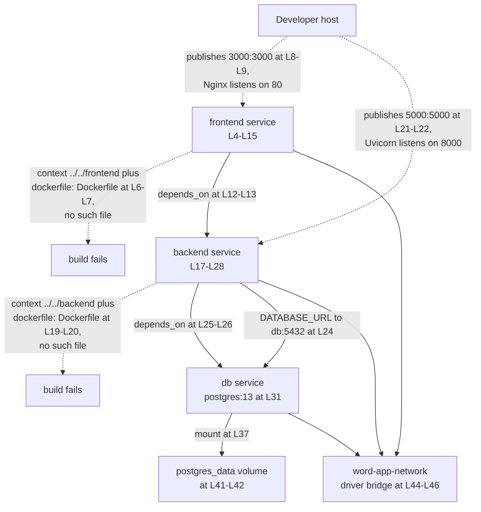

# Docker Container Artifacts

## Purpose

Three files in this folder package the two deployable units and stand up a local
development stack. `backend.Dockerfile` builds the FastAPI image that serves the
application programming interface (API), and `frontend.Dockerfile` compiles the React
bundle for Nginx to serve. `docker-compose.yml` wires both services alongside a PostgreSQL
database on a private bridge network. None of the three works as committed.
`docker compose up` stops at build-context resolution, and each Dockerfile fails on its own
line when built directly.

Known Limitations below lists every blocker in the order a developer meets it.

## Key Components

| Component | Type | Location | Description |
| --- | --- | --- | --- |
| `backend.Dockerfile` | Single-stage image build | `backend.Dockerfile:L1-L27` | Installs Python dependencies, copies the application code, and starts Uvicorn on port 8000 (`:L20`). Carries the folder's only human-assistance marker at `:L22-L27`. |
| `frontend.Dockerfile` | Multi-stage image build | `frontend.Dockerfile:L1-L32` | Compiles the React bundle in a Node.js stage (`:L2-L17`), then copies the output into an Nginx stage listening on port 80 (`:L20-L32`). |
| `docker-compose.yml` | Local orchestration | `docker-compose.yml:L1-L46` | Compose file format `3.8` (`:L1`) declaring three services, one named volume, and one bridge network. Holds no comment and no marker. |
| `frontend` service | Compose service | `docker-compose.yml:L4-L15` | Builds from context `../../frontend` (`:L6`), publishes `3000:3000` (`:L8-L9`), and waits on `backend` (`:L12-L13`). |
| `backend` service | Compose service | `docker-compose.yml:L17-L28` | Builds from context `../../backend` (`:L19`), publishes `5000:5000` (`:L21-L22`), and waits on `db` (`:L25-L26`). |
| `db` service | Compose service | `docker-compose.yml:L30-L39` | Runs the published `postgres:13` image (`:L31`) and provisions database `wordapp` for user `postgres` (`:L33-L34`). Publishes no port. |
| `postgres_data` | Named volume | `docker-compose.yml:L41-L42` | Declared with no driver and no options, mounted at `/var/lib/postgresql/data` (`:L37`) so database files survive a container replacement. |
| `word-app-network` | Bridge network | `docker-compose.yml:L44-L46` | User-defined bridge (`:L46`) joined by all three services, which gives each service a resolvable name. |

## Architecture Fit

The three files here package software, while the sibling `infrastructure/terraform/` folder
provisions cloud infrastructure. The two layers never meet. Compose builds images from
local source and runs them on a developer machine. The Terraform configuration declares
Google Cloud Platform (GCP) resources through the `provider "google"` block in
`infrastructure/terraform/main.tf`. No Compose service reads a Terraform output, and no
Terraform resource consumes an image built here.

The two deployable units packaged here are the FastAPI backend under `backend/app/` and the
React frontend under `frontend/src/`. The `db` service builds no image, because Compose
pulls the published `postgres:13` image instead (`docker-compose.yml:L31`). See
[`../../docs/architecture-overview.md`](../../docs/architecture-overview.md) for the
whole-system map and [`../../docs/deployment-guide.md`](../../docs/deployment-guide.md) for
the deployment path.

Three documents name three different cloud providers. Committed code targets GCP, through
the `google` Terraform provider, `gcloud app deploy` at `.github/workflows/cd.yml:L19-L20`,
and the root `README.md:L18`. `infrastructure/terraform/outputs.tf` instead reads Amazon
Web Services (AWS) addresses, across 14 outputs covering 12 distinct resource addresses and
9 resource types. Declared intent in `documentation/Software Project Proposal.md` names
Microsoft Azure, at L193, L214, L229, and L277. The deployment guide linked above owns the
full treatment.

## Dependencies

### Internal

| Dependency | Referenced from | Status |
| --- | --- | --- |
| `Dockerfile` under `../../frontend` | `docker-compose.yml:L7` | ABSENT. No file named `Dockerfile` exists in that context. |
| `Dockerfile` under `../../backend` | `docker-compose.yml:L20` | ABSENT. No file named `Dockerfile` exists in that context. |
| `requirements.txt` | `backend.Dockerfile:L8`, consumed at `:L11` | ABSENT. No `requirements.txt` exists anywhere in the repository. |
| An npm lockfile | `frontend.Dockerfile:L11` | ABSENT. No `package-lock.json`, `yarn.lock`, or `pnpm-lock.yaml` is committed. |
| `nginx.conf` | `frontend.Dockerfile:L26` | ABSENT, and the `COPY` line is commented out. |
| `frontend/package.json` | `frontend.Dockerfile:L8`, through the `package*.json` glob | PRESENT. The glob matches it and tolerates the absent lockfile. |

### External

| Image | Tag | Declared at | Role |
| --- | --- | --- | --- |
| `python` | `3.9-slim` | `backend.Dockerfile:L2` | Backend runtime. Python 3.9 has passed end of life. |
| `node` | `14-alpine` | `frontend.Dockerfile:L2` | Frontend build stage. Node.js 14 has passed end of life. |
| `nginx` | `alpine` | `frontend.Dockerfile:L20` | Serves the compiled bundle. The tag pins no minor version. |
| `postgres` | `13` | `docker-compose.yml:L31` | Local database. PostgreSQL 13 is the version this stack provisions. |

No Compose service reaches a managed cloud service. See
[`../../docs/integration-guide.md`](../../docs/integration-guide.md) for the Firestore,
Cloud Storage, and Pub/Sub paths the backend code expects.

## Configuration

Every value below sits inline in `docker-compose.yml`. No `.env` file is committed, and no
Compose stanza reads one.

| Setting | Value | Location | Status |
| --- | --- | --- | --- |
| `REACT_APP_API_URL` | `http://backend:5000` | `docker-compose.yml:L11` | INJECTED, NEVER READ. The frontend reads `REACT_APP_API_BASE_URL` in the `API_BASE_URL` constant in `frontend/src/services/api.ts`. The names differ, so the client base URL resolves to `undefined`. |
| `DATABASE_URL` | `postgresql://postgres:password@db:5432/wordapp` | `docker-compose.yml:L24` | SUPPLIED. Addresses the `db` service by Compose name and matches the credentials at `:L34-L35`. |
| `POSTGRES_DB` | `wordapp` | `docker-compose.yml:L33` | SUPPLIED. Disagrees with `scripts/setup_dev_environment.sh:L31`, which creates `msword_clone`. |
| `POSTGRES_USER` | `postgres` | `docker-compose.yml:L34` | SUPPLIED. Disagrees with `scripts/setup_dev_environment.sh:L32`, which creates `msword_user`. |
| `POSTGRES_PASSWORD` | `password` | `docker-compose.yml:L35` | SUPPLIED. A local development literal committed in plain text. |
| `REDIS_URL` | none | `Settings.REDIS_URL` in `backend/app/core/config.py` | REQUIRED, NEVER SUPPLIED. Declared with no default, and Compose defines no Redis service. |
| Port `3000:3000` | frontend | `docker-compose.yml:L8-L9` | BROKEN. Nginx listens on 80 (`frontend.Dockerfile:L29`), so nothing answers on 3000 inside the container. |
| Port `5000:5000` | backend | `docker-compose.yml:L21-L22` | BROKEN. Uvicorn listens on 8000 (`backend.Dockerfile:L17`, `:L20`), so no request reaches the server. |

## Data Flows

The intended path runs from the browser to Nginx, then to the FastAPI service, then to
PostgreSQL. Two hops break before a request can travel it. Neither service builds, and
neither published port matches the port its server listens on. In the diagram below, a
dashed edge marks a relationship that does not work as committed.



The `db` service publishes no port, so only services joined to `word-app-network` reach
PostgreSQL 13 (`docker-compose.yml:L31`).

## Design Patterns

The frontend uses a multi-stage build. A Node.js stage compiles the bundle
(`frontend.Dockerfile:L2-L17`), and an Nginx stage copies only the compiled output
(`:L20-L23`), which keeps the build toolchain out of the runtime image. The backend uses a
single-stage build (`backend.Dockerfile:L2-L20`), so the pip toolchain ships inside the
runtime image.

Compose supplies service discovery by name over a user-defined bridge network. All three
services join `word-app-network` (`docker-compose.yml:L44-L46`), where Docker resolves each
service name through its embedded Domain Name System (DNS) server. `DATABASE_URL` depends
on that resolution when it addresses the host `db` (`:L24`), and `REACT_APP_API_URL` depends
on it when it addresses `backend` (`:L11`).

The `db` service keeps state in a named volume rather than in the container layer.
`postgres_data` (`:L41-L42`) mounts at `/var/lib/postgresql/data` (`:L37`), so database
files survive a container replacement.

## Known Limitations

The numbered order matches the order a developer meets each failure. Items 1 through 3
block a build outright, and items 4 through 10 break behavior behind them.

1. **Compose resolves neither build context.** Both build stanzas name
   `dockerfile: Dockerfile` (`docker-compose.yml:L7`, `:L20`) against contexts
   `../../frontend` (`:L6`) and `../../backend` (`:L19`). No file named `Dockerfile` exists
   at either path, or anywhere in the repository. The two real Dockerfiles sit in this
   folder under the names `backend.Dockerfile` and `frontend.Dockerfile`.
   `docker compose up` therefore fails before any Dockerfile instruction runs, and neither
   service builds.
2. **The backend image cannot build.** `backend.Dockerfile:L8` copies `requirements.txt`,
   and no such file exists anywhere in the repository. The build fails at L8, so the
   `pip install` at `:L11` never runs.
3. **The frontend image cannot build.** `frontend.Dockerfile:L11` runs `npm ci`, which
   requires a lockfile, and no lockfile is committed. The `COPY package*.json ./` at `:L8`
   succeeds, because the glob matches `package.json` on its own. The failure lands on L11.
4. **Neither published port reaches its server.** Compose publishes `5000:5000`
   (`:L21-L22`) while Uvicorn listens on 8000 (`backend.Dockerfile:L17`, `:L20`), so no
   request reaches the backend. Compose publishes `3000:3000` (`:L8-L9`) while Nginx
   listens on 80 (`frontend.Dockerfile:L29`), so nothing answers on 3000.
5. **The backend image loses the `app` package boundary.** `backend.Dockerfile:L14` copies
   `./app` to `/app`, and `:L20` starts `uvicorn main:app`, which places the modules at the
   filesystem root rather than under an `app` package. Every backend module imports by
   absolute `app.*` path, and no `__init__.py` exists anywhere under `backend/`, so the
   import prefix cannot resolve inside the image as built.
   [`../../docs/deployment-guide.md`](../../docs/deployment-guide.md) carries the full
   treatment.
6. **Compose injects an environment variable no code reads.** `docker-compose.yml:L11` sets
   `REACT_APP_API_URL`. The only `process.env` read in the frontend is the `API_BASE_URL`
   constant in `frontend/src/services/api.ts`, which reads `REACT_APP_API_BASE_URL`.
   Nothing reads `REACT_APP_API_URL`, so the client base URL resolves to `undefined`.
7. **No Redis service exists, so Celery has no broker.** The `celery_app` construction in
   `backend/app/tasks/background_tasks.py` passes `settings.REDIS_URL` as the broker, and
   `Settings.REDIS_URL` in `backend/app/core/config.py` declares that field as required
   with no default. Compose defines no Redis service and supplies no `REDIS_URL`, and no
   Memorystore instance exists under `infrastructure/terraform/`. Intended behavior per
   `documentation/Technical Specifications.md`, TECHNOLOGY STACK heading: Redis runs as
   Google Cloud Memorystore (L584).
8. **Two provisioning paths name the database differently.** Compose creates database
   `wordapp` for user `postgres` (`:L33-L34`). `scripts/setup_dev_environment.sh` creates
   database `msword_clone` (L31) for user `msword_user` (L32) and grants privileges on
   `msword_clone` (L36). A developer who runs the script and then Compose ends up with two
   differently named databases.
9. **The commented-out Nginx configuration has no file behind it.**
   `frontend.Dockerfile:L26` holds a commented-out `COPY nginx.conf`, and no `nginx.conf`
   exists anywhere in the repository. The step has no file to copy even if uncommented. The
   image ships the stock configuration from `nginx:alpine` (`:L20`), which serves static
   files with no single-page-application route fallback.
10. **No healthcheck and no restart policy exist.** Neither keyword appears anywhere in
    `docker-compose.yml`. The `depends_on` entries (`:L12-L13`, `:L25-L26`) order container
    start only and do not wait for readiness, so the backend can start before PostgreSQL
    accepts connections.

`backend.Dockerfile:L22` carries the folder's only human-assistance marker. Its four items
at `:L24-L27` ask for review of the Python 3.9 base image, the location of
`requirements.txt`, the location of `./app`, and any further configuration. No
deferred-work comment appears anywhere in the folder. The defect register at
[`../../docs/troubleshooting.md`](../../docs/troubleshooting.md) covers the repository.

## Usage Examples

Start the full local stack from this folder.

```bash
cd infrastructure/docker
docker compose up --build
```

The command fails at once. Docker finds no file named `Dockerfile` in either build context,
per `docker-compose.yml:L6-L7` and `:L19-L20`, so neither service builds.

Build the backend image directly, naming the real Dockerfile and a matching context.

```bash
docker build -f infrastructure/docker/backend.Dockerfile -t word-backend ./backend
```

The build fails at `backend.Dockerfile:L8`, because `requirements.txt` does not exist.

Build the frontend image directly.

```bash
docker build -f infrastructure/docker/frontend.Dockerfile -t word-frontend ./frontend
```

The build clears `frontend.Dockerfile:L8`, because the `package*.json` glob matches
`package.json` on its own, then fails at `:L11`, because `npm ci` requires a lockfile.

Start the database on its own, which is the one component that needs no build.

```bash
cd infrastructure/docker
docker compose up -d db
docker compose exec db psql -U postgres -d wordapp -c "\l"
```

All three commands run. `docker-compose.yml:L31` pulls the published `postgres:13` image
rather than building one, and `:L33-L34` provision database `wordapp` for user `postgres`.
The service publishes no port, so `psql` runs inside the container.

For prerequisites and a clean-machine walkthrough, see
[`../../docs/onboarding.md`](../../docs/onboarding.md).
