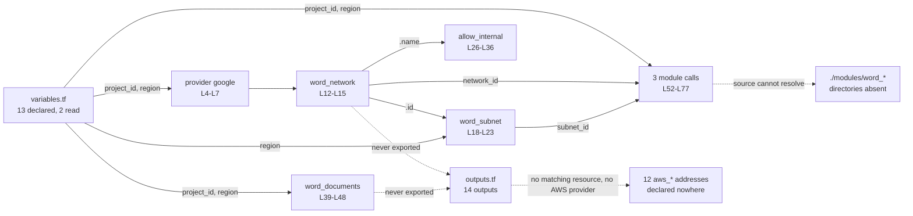

# Terraform Root Configuration

Line references throughout this document point at the three `.tf` files as
committed, before this documentation pass. That pass adds `#` comment lines to
`main.tf`, `variables.tf` and `outputs.tf`, which shifts every absolute line
number in the working tree.

## Purpose

This directory holds the project's entire Terraform root configuration: three
files and 35 top-level blocks, with no child modules on disk. `main.tf`
configures the `google` provider (`main.tf:L4-L7`) and declares four resources:
a custom-mode virtual private cloud (VPC) network, a regional subnetwork, an
internal firewall rule, and a Cloud Storage bucket (`main.tf:L12-L48`). Three
module blocks then call `./modules/word_backend`, `./modules/word_frontend` and
`./modules/word_database` (`main.tf:L52-L77`), and none of those three
directories exists. `variables.tf` declares 13 input variables, and the
configuration reads 2 of them. `outputs.tf` declares 14 outputs that read
Amazon Web Services (AWS) resource addresses no file in this repository
declares.

## Key Components

The three files carry 35 top-level blocks of HashiCorp Configuration Language
(HCL): 1 provider, 4 resources, 3 module calls, 13 variables and 14 outputs.
Every count and locator below is verified against the committed files.

| Component | Type | Location | Description |
| --- | --- | --- | --- |
| `main.tf` | File, 84 lines | `infrastructure/terraform/main.tf` | Holds the provider, all four resources, all three module calls, and a `HUMAN ASSISTANCE NEEDED` marker at `main.tf:L79-L84`. |
| `variables.tf` | File, 79 lines | `infrastructure/terraform/variables.tf` | Declares 13 input variables. Carries no `validation` block and no marker. |
| `outputs.tf` | File, 75 lines | `infrastructure/terraform/outputs.tf` | Declares 14 outputs. Carries a `HUMAN ASSISTANCE NEEDED` marker mid-file at `outputs.tf:L48-L50`. |
| `provider "google"` | Provider | `main.tf:L4-L7` | Sets `project` from `var.project_id` (`main.tf:L5`) and `region` from `var.region` (`main.tf:L6`). The only provider block in the configuration. |
| `google_compute_network.word_network` | Resource | `main.tf:L12-L15` | Names the network `word-network` (`main.tf:L13`) and sets `auto_create_subnetworks = false` (`main.tf:L14`), so the network runs in custom mode. |
| `google_compute_subnetwork.word_subnet` | Resource | `main.tf:L18-L23` | Names the subnetwork `word-subnet` (`main.tf:L19`) on the `10.0.0.0/24` Classless Inter-Domain Routing (CIDR) range (`main.tf:L20`). Attaches the network by `.id` (`main.tf:L22`). |
| `google_compute_firewall.allow_internal` | Resource | `main.tf:L26-L36` | Allows Transmission Control Protocol (TCP) ports `0-65535` (`main.tf:L30-L33`) from `10.0.0.0/24` (`main.tf:L35`). Attaches the network by `.name` (`main.tf:L28`) where the subnetwork uses `.id`; both forms are valid HCL. |
| `google_storage_bucket.word_documents` | Resource | `main.tf:L39-L48` | Names the bucket `word-documents-${var.project_id}` (`main.tf:L40`), locates it at `var.region` (`main.tf:L41`), and enables uniform bucket-level access (`main.tf:L43`) and versioning (`main.tf:L45-L47`). Sets no `storage_class`. |
| `module "word_backend"` | Module call | `main.tf:L52-L59` | Sources `./modules/word_backend` (`main.tf:L53`) and passes `project_id`, `region`, `network_id` and `subnet_id`. The source directory does not exist. |
| `module "word_frontend"` | Module call | `main.tf:L61-L68` | Sources `./modules/word_frontend` (`main.tf:L62`) and passes the same four arguments. The source directory does not exist. |
| `module "word_database"` | Module call | `main.tf:L70-L77` | Sources `./modules/word_database` (`main.tf:L71`) and passes the same four arguments. The source directory does not exist. |

## Architecture Fit

This configuration sits at the foundation of the deployment stack. The network,
subnetwork, firewall rule and storage bucket are what the application tiers
would run on top of. The three module calls are where those tiers would be
defined, and each call passes the same four arguments: `project_id`, `region`,
`network_id` and `subnet_id` (`main.tf:L55-L58`, `:L64-L67`, `:L73-L76`).
Because none of the three source directories exists, no compute tier, no
database tier and no serving tier is declared anywhere in this repository.

The in-repository specification describes a larger Google Cloud Platform (GCP)
footprint than the configuration builds. Under its `TECHNOLOGY STACK` heading,
`documentation/Technical Specifications.md` names Google Cloud SQL as the
relational database (`documentation/Technical Specifications.md:L581`) and Redis
through Google Cloud Memorystore as the in-memory store (`:L584`). Under
`SYSTEM ARCHITECTURE`, the same document places its components inside a "Google
Cloud Platform" subgraph (`:L172`). `main.tf` declares neither a Cloud SQL
instance nor a Memorystore instance. That document records declared intent
rather than system behavior, and the four resources listed above are what the
configuration declares.

For the wider layer map and the points where intended interactions break, see
[the architecture overview](../../docs/architecture-overview.md).

## Dependencies

The configuration depends on three module directories that are absent, two
input variables that are present, and one provider that carries no version
constraint. Internal dependencies resolve inside this folder, or fail to:

| Dependency | Referenced at | Status |
| --- | --- | --- |
| `./modules/word_backend` | `main.tf:L53` | Absent. No `modules` directory exists in the repository. |
| `./modules/word_frontend` | `main.tf:L62` | Absent. No `modules` directory exists in the repository. |
| `./modules/word_database` | `main.tf:L71` | Absent. No `modules` directory exists in the repository. |
| `var.project_id` | `main.tf:L5`, `:L40`, `:L55`, `:L64`, `:L73` | Declared at `variables.tf:L2-L5` and read at 5 sites. |
| `var.region` | `main.tf:L6`, `:L21`, `:L41`, `:L56`, `:L65`, `:L74` | Declared at `variables.tf:L7-L11` and read at 6 sites. |
| `google_compute_network.word_network` | `main.tf:L22`, `:L28`, `:L57`, `:L66`, `:L75` | Resolves inside `main.tf`. Read by `.id` at four sites and by `.name` at one. |
| `google_compute_subnetwork.word_subnet` | `main.tf:L58`, `:L67`, `:L76` | Resolves inside `main.tf`. Read by `.id` and passed to all three module calls. |

External dependencies come from outside the repository:

| Dependency | Declared at | Version constraint |
| --- | --- | --- |
| `google` provider | `main.tf:L4-L7` | None. No `terraform` block exists in this folder, and the `provider` block declares no `version` argument, so `terraform init` resolves whatever release currently matches. |
| An AWS provider | Nowhere | Not declared. The 14 outputs read 12 `aws_*` addresses across `outputs.tf`, and no file in this folder configures a provider that could create them. |

One external service the application expects has no infrastructure behind it
here. `backend/app/core/config.py:L13` declares a `REDIS_URL` setting, and this
configuration declares no Memorystore instance, so nothing here provisions the
Redis endpoint that setting names. For how each external service is reached, see
[the integration guide](../../docs/integration-guide.md).

## Configuration

`variables.tf` declares 13 input variables. Only `project_id` and `region` are
referenced anywhere in the configuration. `project_id` declares no default
(`variables.tf:L2-L5`), so a plan or apply needs a value for it. The remaining
12 variables all carry defaults. No variable declares a `validation` block, so
`environment` accepts any string, including a value matching none of the three
environments its own description names (`variables.tf:L39-L43`).

| Variable | Span | Type | Default | Status |
| --- | --- | --- | --- | --- |
| `project_id` | `variables.tf:L2-L5` | `string` | None | Consumed at 5 sites. Required input. |
| `region` | `variables.tf:L7-L11` | `string` | `us-central1` | Consumed at 6 sites. |
| `zone` | `variables.tf:L13-L17` | `string` | `us-central1-a` | Unreferenced. |
| `compute_instance_type` | `variables.tf:L20-L24` | `string` | `n1-standard-1` | Unreferenced. No compute instance is declared. |
| `storage_class` | `variables.tf:L26-L30` | `string` | `STANDARD` | Unreferenced. The Google Cloud Storage (GCS) bucket at `main.tf:L39-L48` sets no `storage_class`. |
| `database_tier` | `variables.tf:L32-L36` | `string` | `db-f1-micro` | Unreferenced. No Cloud SQL instance is declared. |
| `environment` | `variables.tf:L39-L43` | `string` | `dev` | Unreferenced. No `validation` block, so any string is accepted. |
| `dev_instance_count` | `variables.tf:L45-L49` | `number` | `1` | Unreferenced. |
| `staging_instance_count` | `variables.tf:L51-L55` | `number` | `2` | Unreferenced. |
| `prod_instance_count` | `variables.tf:L57-L61` | `number` | `3` | Unreferenced. |
| `dev_storage_size` | `variables.tf:L63-L67` | `number` | `10` | Unreferenced. |
| `staging_storage_size` | `variables.tf:L69-L73` | `number` | `50` | Unreferenced. |
| `prod_storage_size` | `variables.tf:L75-L79` | `number` | `100` | Unreferenced. |

That table covers 13 of 13 declared variables. The 11 rows marked unreferenced
appear in no expression anywhere in `main.tf`, `variables.tf` or `outputs.tf`.

## Data Flows

Two values carry every flow through this configuration. `var.project_id`
reaches the provider (`main.tf:L5`), the bucket name (`main.tf:L40`) and all
three module calls (`main.tf:L55`, `:L64`, `:L73`). `var.region` reaches the
provider (`main.tf:L6`), the subnetwork (`main.tf:L21`), the bucket location
(`main.tf:L41`) and the same three module calls (`main.tf:L56`, `:L65`, `:L74`).
The network and subnetwork identifiers flow outward into all three module calls
(`main.tf:L57-L58`, `:L66-L67`, `:L75-L76`).

Nothing flows back out. All 14 outputs read `aws_*` addresses, and no `google_`
reference appears anywhere in `outputs.tf`, so the network, subnetwork, firewall
rule and bucket this configuration declares are exported nowhere.



## Design Patterns

Three patterns describe how this configuration is put together.

**A single root module with no environment separation.** One configuration
covers every environment. No workspace declaration, no per-environment directory
and no environment-keyed expression appears in any of the three files. Meanwhile
`variables.tf` declares six sizing numbers for dev, staging and production
(`variables.tf:L45-L79`) plus an `environment` selector
(`variables.tf:L39-L43`). Nothing reads any of the seven.

**One shared network foundation passed to every child.** All three module calls
receive the same `network_id` and `subnet_id` (`main.tf:L57-L58`, `:L66-L67`,
`:L75-L76`), so the backend, frontend and database tiers would share one network
and one subnetwork rather than each owning its own.

**Variables as a declared interface the configuration does not consume.**
`variables.tf` reads as the input surface for a much larger deployment: machine
type, storage class, database tier, per-environment instance counts and
per-environment storage sizes. The configuration reads 2 of the 13. Rationale
for documenting these patterns rather than changing them lives in
[the decision log](../../docs/decision-log.md).

## Known Limitations

`terraform init` fails in this directory, and that failure gates everything
else. Terraform resolves module sources before it downloads providers, so
initialization stops at the three absent module directories, no plan runs, and
no apply runs. Every item after the first stays unreachable until the first one
clears, so the list below is ordered by what blocks what rather than
alphabetically.

1. **Three module sources cannot resolve.** The module blocks source
   `./modules/word_backend` (`main.tf:L53`), `./modules/word_frontend`
   (`main.tf:L62`) and `./modules/word_database` (`main.tf:L71`). No `modules`
   directory exists anywhere in the repository. `terraform init` reports one
   `Unreadable module directory` error per block and exits non-zero.

2. **The firewall rule opens every TCP port across the subnet.**
   `google_compute_firewall.allow_internal` allows protocol `tcp` on ports
   `0-65535` (`main.tf:L30-L33`) from `source_ranges = ["10.0.0.0/24"]`
   (`main.tf:L35`), which is the entire range the subnetwork occupies
   (`main.tf:L20`). Any host in the subnet can reach any port on any other host
   in the subnet.

3. **No `terraform` block exists in this folder.** The absence carries three
   consequences: no `required_providers` entry pins the `google` provider, no
   `required_version` constraint pins Terraform itself, and no backend is
   configured, so state is written to a local file beside these sources. The
   `provider` block declares no `version` argument either (`main.tf:L4-L7`).

4. **11 of the 13 declared variables are referenced nowhere.** Only
   `project_id` and `region` appear in any expression. Two of the 11 point at
   capabilities the configuration never declares. `storage_class`
   (`variables.tf:L26-L30`) has no effect, because the bucket sets no storage
   class (`main.tf:L39-L48`). `database_tier` (`variables.tf:L32-L36`) has
   nothing to size, because no Cloud SQL instance exists.

5. **No variable declares a `validation` block.** `environment`
   (`variables.tf:L39-L43`) accepts any string, including one that matches none
   of the `dev`, `staging` or `prod` values its own description lists.

6. **14 outputs read 12 undeclared AWS addresses across 9 resource types.**
   `outputs.tf` declares, in file order, `api_gateway_endpoint`
   (`outputs.tf:L1-L4`), `api_gateway_stage` (`:L6-L9`),
   `database_connection_string` (`:L11-L15`), `read_replica_connection_string`
   (`:L17-L21`), `main_storage_bucket_name` (`:L23-L26`),
   `backup_storage_bucket_name` (`:L28-L31`), `compute_instance_public_ip`
   (`:L33-L36`), `compute_instance_private_ip` (`:L38-L41`),
   `compute_instance_id` (`:L43-L46`), `lambda_function_name` (`:L52-L55`),
   `cloudfront_distribution_domain` (`:L57-L60`), `vpc_id` (`:L62-L65`),
   `public_subnet_ids` (`:L67-L70`) and `private_subnet_ids` (`:L72-L75`).
   Between them they read 12 distinct addresses across these 9 types:
   `aws_api_gateway_deployment`, `aws_api_gateway_stage`,
   `aws_cloudfront_distribution`, `aws_db_instance`, `aws_instance`,
   `aws_lambda_function`, `aws_s3_bucket`, `aws_subnet` and `aws_vpc`. No file
   in this folder declares any of them, and no AWS provider is configured.

7. **Two outputs interpolate a database password into their value.**
   `database_connection_string` builds a `postgresql://` string containing
   `aws_db_instance.main.password` (`outputs.tf:L11-L15`, password at `:L13`),
   and `read_replica_connection_string` does the same for the read replica
   (`:L17-L21`, password at `:L19`). Both declare `sensitive = true`
   (`outputs.tf:L14`, `:L20`), which masks the value in command-line output. The
   resolved password still lands in Terraform state in plaintext, and state is
   local because item 3 leaves no backend configured.

8. **`vpc_id` exports a resource no file declares, while the declared network is
   exported nowhere.** The output reads `aws_vpc.main.id`
   (`outputs.tf:L62-L65`), and the network this configuration actually creates
   is `google_compute_network.word_network` (`main.tf:L12-L15`). No `google_`
   reference appears anywhere in `outputs.tf`, so the network, subnetwork,
   firewall rule and bucket are all unexported.

9. **The cloud provider is declared three different ways across the
   repository.** The committed code targets GCP: the `google` provider
   (`main.tf:L4-L7`), `google-github-actions/setup-gcloud@v0.2.0` with GCP
   secrets (`.github/workflows/cd.yml:L13`, `:L15-L16`), two `gcloud app deploy`
   calls (`:L19-L20`), `gsutil` and `gcloud` at `scripts/deploy.sh:L23`, `:L27`,
   `:L31` and `:L35`, and the root README naming Google Cloud Platform
   (`README.md:L18`). `outputs.tf` targets AWS across the 12 addresses
   in item 6. `documentation/Software Project Proposal.md` targets Microsoft
   Azure under its `SCOPE OF WORK` heading
   (`documentation/Software Project Proposal.md:L193`, `:L214`, `:L229`) and in
   its `BUDGET AND COST ESTIMATES` table (`:L277`), and names neither AWS nor
   GCP. `documentation/Technical Specifications.md` mentions neither AWS nor
   Azure, so `outputs.tf` contradicts the in-repository specification as well as
   the provider `main.tf` configures. Two script references compound the split:
   `scripts/deploy.sh:L23` uploads to a hard-coded `gs://my-word-app-bucket/`
   where `main.tf:L40` declares `word-documents-${var.project_id}`, and
   `scripts/deploy.sh:L31` connects to a Cloud SQL instance this configuration
   never declares. Both specification documents record declared intent rather
   than system behavior, and
   [the deployment guide](../../docs/deployment-guide.md) carries the full
   treatment.

10. **Two `HUMAN ASSISTANCE NEEDED` markers sit in this folder, and no TODO
    markers.** The first closes `main.tf` (`main.tf:L79-L84`) and names four
    review items: the subnet CIDR range, additional firewall rules, the bucket
    configuration, and the module imports. The second sits mid-file in
    `outputs.tf` (`outputs.tf:L48-L50`), between the `compute_instance_id` and
    `lambda_function_name` blocks, and names the gap between the outputs and the
    resources the configuration defines. Both markers survive this documentation
    pass unchanged.

For the repository-wide defect register built from the same evidence, see
[the troubleshooting guide](../../docs/troubleshooting.md).

## Usage Examples

Clean-machine prerequisites live in
[the onboarding guide](../../docs/onboarding.md), so the examples below cover
only what this directory does.

```bash
cd infrastructure/terraform
terraform init
terraform plan -var="project_id=my-gcp-project"
```

Neither command completes. `terraform init` stops at module resolution because
`./modules/word_backend`, `./modules/word_frontend` and
`./modules/word_database` do not exist (`main.tf:L52-L77`), and `terraform plan`
cannot run against an incomplete initialization.

`project_id` is the only input without a default, so every plan or apply must
supply a value for it:

```hcl
variable "project_id" {
  description = "The ID of the GCP project"
  type        = string
}
```

Passing the value with `-var`, as the first example does, matches the repository
as committed, because no variable definitions file is present. The other 12
variables all carry defaults (`variables.tf:L7-L79`).

Running `terraform init` against the committed configuration produces one error
per unresolved module source, each naming the block that declares it:

```text
Initializing modules...
- word_backend in
- word_database in
- word_frontend in

Error: Unreadable module directory

The directory  could not be read for module "word_backend" at main.tf:52.
```

That output is what the committed configuration does today, and the blocking
defect behind it is the absent `./modules/word_*` directories
(`main.tf:L52-L77`).

One command in this directory does run without initialization:
`terraform fmt -check` reads the files without rewriting them. The command exits
non-zero and names `main.tf`, which carries trailing whitespace at `main.tf:L42`
and `main.tf:L44` in the committed bytes.
