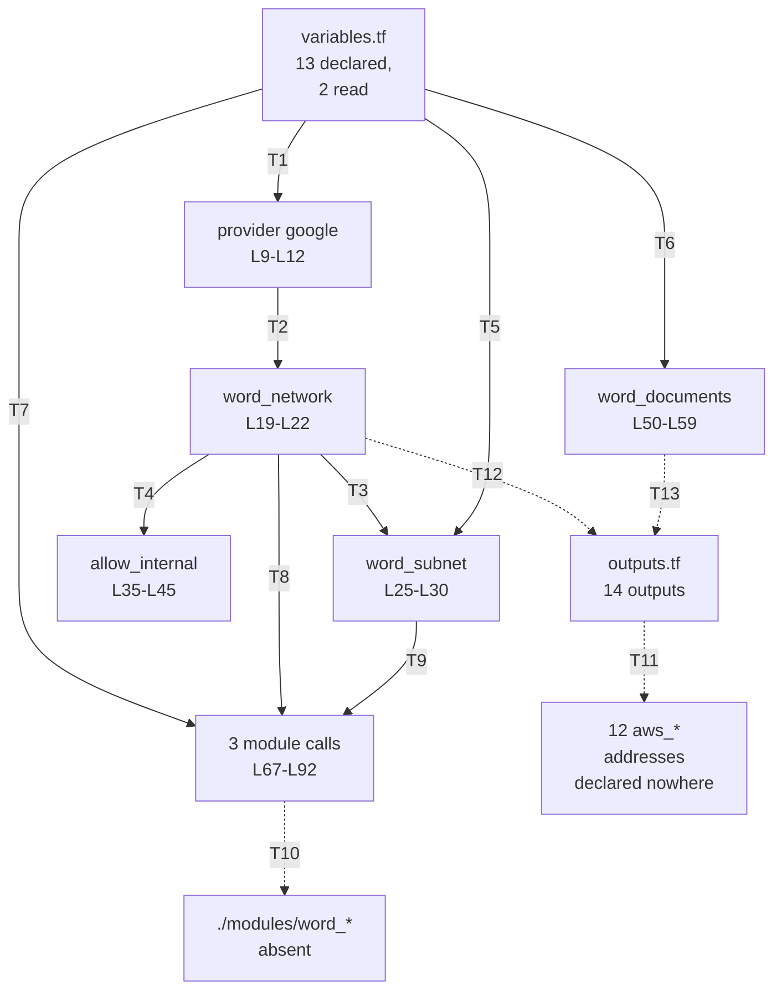

# Terraform Root Configuration

Line references throughout this document are physical line numbers in the three `.tf` files as committed at `HEAD`,
counting the `#` comment lines the documentation pass added. `main.tf` runs to 99 lines, `variables.tf` to 95 and
`outputs.tf` to 87.

## Purpose

The project's entire Terraform root configuration lives here: three files and 35 top-level blocks, with no child modules
on disk. `main.tf` configures the `google` provider (`main.tf:L9-L12`) and declares four resources: a custom-mode
virtual private cloud (VPC) network, a regional subnetwork, an internal firewall rule, and a Cloud Storage bucket
(`main.tf:L19-L59`). Three module blocks then call `./modules/word_backend`, `./modules/word_frontend` and
`./modules/word_database` (`main.tf:L67-L92`), and none of those three directories exists. `variables.tf` declares 13
input variables, and the configuration reads 2 of them. `outputs.tf` declares 14 outputs that read Amazon Web Services
(AWS) resource addresses no file in this repository declares.

## Key Components

The three files carry 35 top-level blocks of HashiCorp Configuration Language (HCL): 1 provider, 4 resources, 3 module
calls, 13 variables and 14 outputs.

| Component | Type | Location | Description |
| --- | --- | --- | --- |
| `main.tf` | File, 99 lines | `infrastructure/terraform/main.tf` | Holds the provider, all four resources, all three module calls, and a `HUMAN ASSISTANCE NEEDED` marker at `main.tf:L94-L99`. |
| `variables.tf` | File, 95 lines | `infrastructure/terraform/variables.tf` | Declares 13 input variables. Carries no `validation` block and no marker. |
| `outputs.tf` | File, 87 lines | `infrastructure/terraform/outputs.tf` | Declares 14 outputs. Carries a `HUMAN ASSISTANCE NEEDED` marker mid-file at `outputs.tf:L58-L60`. |
| `provider "google"` | Provider | `main.tf:L9-L12` | Sets `project` from `var.project_id` (`main.tf:L10`) and `region` from `var.region` (`main.tf:L11`). The only provider block in the configuration. |
| `google_compute_network.word_network` | Resource | `main.tf:L19-L22` | Names the network `word-network` (`main.tf:L20`) and sets `auto_create_subnetworks = false` (`main.tf:L21`), so the network runs in custom mode. |
| `google_compute_subnetwork.word_subnet` | Resource | `main.tf:L25-L30` | Names the subnetwork `word-subnet` (`main.tf:L26`) on the `10.0.0.0/24` Classless Inter-Domain Routing (CIDR) range (`main.tf:L27`). Attaches the network by `.id` (`main.tf:L29`). |
| `google_compute_firewall.allow_internal` | Resource | `main.tf:L35-L45` | Allows Transmission Control Protocol (TCP) ports `0-65535` (`main.tf:L39-L42`) from `10.0.0.0/24` (`main.tf:L44`). Attaches the network by `.name` (`main.tf:L37`) where the subnetwork uses `.id`; both forms are valid HCL. |
| `google_storage_bucket.word_documents` | Resource | `main.tf:L50-L59` | Names the bucket `word-documents-${var.project_id}` (`main.tf:L51`), locates it at `var.region` (`main.tf:L52`), and enables uniform bucket-level access (`main.tf:L54`) and versioning (`main.tf:L56-L58`). Sets no `storage_class`. |
| `module "word_backend"` | Module call | `main.tf:L67-L74` | Sources `./modules/word_backend` (`main.tf:L68`) and passes `project_id`, `region`, `network_id` and `subnet_id`. The source directory does not exist. |
| `module "word_frontend"` | Module call | `main.tf:L76-L83` | Sources `./modules/word_frontend` (`main.tf:L77`) and passes the same four arguments. The source directory does not exist. |
| `module "word_database"` | Module call | `main.tf:L85-L92` | Sources `./modules/word_database` (`main.tf:L86`) and passes the same four arguments. The source directory does not exist. |

## Architecture Fit

The configuration sits at the foundation of the deployment stack. The network, subnetwork, firewall rule and storage
bucket are what the application tiers would run on top of. The three module calls are where those tiers would be
defined, and each call passes the same four arguments: `project_id`, `region`, `network_id` and `subnet_id`
(`main.tf:L70-L73`, `:L79-L82`, `:L88-L91`). Because none of the three source directories exists, no compute tier, no
database tier and no serving tier is declared anywhere in this repository.

The in-repository specification describes a larger Google Cloud Platform (GCP) footprint than the configuration builds.
Under its `TECHNOLOGY STACK` heading, `documentation/Technical Specifications.md` names Google Cloud SQL as the
relational database (`documentation/Technical Specifications.md:L581`) and Redis through Google Cloud Memorystore as the
in-memory store (`:L584`). Under `SYSTEM ARCHITECTURE`, the same document places its components inside a "Google Cloud
Platform" subgraph (`:L172`). `main.tf` declares neither a Cloud SQL instance nor a Memorystore instance. That document
records declared intent rather than system behavior, and the four resources listed above are what the configuration
declares.

For the wider layer map and the points where intended interactions break, see
[the architecture overview](../../docs/architecture-overview.md).

## Dependencies

The configuration depends on three module directories that are absent, two input variables that are present, and one
provider that carries no version constraint. Internal dependencies resolve inside this folder, or fail to:

| Dependency | Referenced at | Status |
| --- | --- | --- |
| `./modules/word_backend` | `main.tf:L68` | Absent. No `modules` directory exists in the repository. |
| `./modules/word_frontend` | `main.tf:L77` | Absent. No `modules` directory exists in the repository. |
| `./modules/word_database` | `main.tf:L86` | Absent. No `modules` directory exists in the repository. |
| `var.project_id` | `main.tf:L10`, `:L51`, `:L70`, `:L79`, `:L88` | Declared at `variables.tf:L7-L10` and read at 5 sites. |
| `var.region` | `main.tf:L11`, `:L28`, `:L52`, `:L71`, `:L80`, `:L89` | Declared at `variables.tf:L14-L18` and read at 6 sites. |
| `google_compute_network.word_network` | `main.tf:L29`, `:L37`, `:L72`, `:L81`, `:L90` | Resolves inside `main.tf`. Read by `.id` at four sites and by `.name` at one. |
| `google_compute_subnetwork.word_subnet` | `main.tf:L73`, `:L82`, `:L91` | Resolves inside `main.tf`. Read by `.id` and passed to all three module calls. |

External dependencies come from outside the repository:

| Dependency | Declared at | Version constraint |
| --- | --- | --- |
| `google` provider | `main.tf:L9-L12` | None. No `terraform` block exists in this folder, and the `provider` block declares no `version` argument, so `terraform init` would resolve whatever release currently matches once module resolution succeeds. |
| An AWS provider | Nowhere | Not declared. The 14 outputs read 12 `aws_*` addresses across `outputs.tf`, and no file in this folder configures a provider that could create them. |

One external service the application expects has no infrastructure behind it here. `backend/app/core/config.py:L48`
declares a `REDIS_URL` setting, and this configuration declares no Memorystore instance, so nothing here provisions that
endpoint. For how each external service is reached, see [the integration guide](../../docs/integration-guide.md).

## Configuration

`variables.tf` declares 13 input variables. Only `project_id` and `region` are referenced anywhere in the configuration.
`project_id` declares no default (`variables.tf:L7-L10`), so a plan or apply needs a value for it. The remaining 12
variables all carry defaults. No variable declares a `validation` block, so `environment` accepts any string, including
a value matching none of the three environments its own description names (`variables.tf:L53-L57`).

| Variable | Span | Type | Default | Status |
| --- | --- | --- | --- | --- |
| `project_id` | `variables.tf:L7-L10` | `string` | None | Consumed at 5 sites. Required input. |
| `region` | `variables.tf:L14-L18` | `string` | `us-central1` | Consumed at 6 sites. |
| `zone` | `variables.tf:L21-L25` | `string` | `us-central1-a` | Unreferenced. |
| `compute_instance_type` | `variables.tf:L29-L33` | `string` | `n1-standard-1` | Unreferenced. No compute instance is declared. |
| `storage_class` | `variables.tf:L37-L41` | `string` | `STANDARD` | Unreferenced. The Google Cloud Storage (GCS) bucket at `main.tf:L50-L59` sets no `storage_class`. |
| `database_tier` | `variables.tf:L44-L48` | `string` | `db-f1-micro` | Unreferenced. No Cloud SQL instance is declared. |
| `environment` | `variables.tf:L53-L57` | `string` | `dev` | Unreferenced. No `validation` block, so any string is accepted. |
| `dev_instance_count` | `variables.tf:L61-L65` | `number` | `1` | Unreferenced. |
| `staging_instance_count` | `variables.tf:L67-L71` | `number` | `2` | Unreferenced. |
| `prod_instance_count` | `variables.tf:L73-L77` | `number` | `3` | Unreferenced. |
| `dev_storage_size` | `variables.tf:L79-L83` | `number` | `10` | Unreferenced. |
| `staging_storage_size` | `variables.tf:L85-L89` | `number` | `50` | Unreferenced. |
| `prod_storage_size` | `variables.tf:L91-L95` | `number` | `100` | Unreferenced. |

That table covers 13 of 13 declared variables, and the 11 rows marked unreferenced appear in no expression in any of the
three files.

## Data Flows

Two values carry every flow through this configuration. `var.project_id` reaches the provider (`main.tf:L10`), the
bucket name (`main.tf:L51`) and all three module calls (`main.tf:L70`, `:L79`, `:L88`). `var.region` reaches the
provider (`main.tf:L11`), the subnetwork (`main.tf:L28`), the bucket location (`main.tf:L52`) and the same three module
calls (`main.tf:L71`, `:L80`, `:L89`). The network and subnetwork identifiers flow outward into all three module calls
(`main.tf:L72-L73`, `:L81-L82`, `:L90-L91`).

Nothing flows back out. All 14 outputs read `aws_*` addresses, and no output **value** in `outputs.tf` reads a `google_`
address, so the network, subnetwork, firewall rule and bucket this configuration declares are exported nowhere. Two
comments there do name Google resources, and item 8 covers why a comment exports nothing.



| Key | Edge | What passes along it |
| --- | --- | --- |
| T1 | `variables.tf` to the provider | `project_id` and `region`, the only two of the thirteen declared variables that any resource reads |
| T2 | provider to `word_network` | the configured project and region, applied implicitly to every `google_*` resource |
| T3 | `word_network` to `word_subnet` | `.id`, the network self-link the subnet attaches to |
| T4 | `word_network` to `allow_internal` | `.name`, the network the firewall rule applies to |
| T5 | `variables.tf` to `word_subnet` | `region` |
| T6 | `variables.tf` to `word_documents` | `project_id` and `region`. The bucket sets no storage class, although `storage_class` is declared |
| T7 | `variables.tf` to the module calls | `project_id` and `region` |
| T8 | `word_network` to the module calls | `network_id` |
| T9 | `word_subnet` to the module calls | `subnet_id` |
| T10 | module calls to their sources | nothing. All three `source = "./modules/word_*"` paths at `main.tf:L68`, `:L77` and `:L86` name directories that do not exist, so `terraform init` fails here |
| T11 | `outputs.tf` to the AWS addresses | nothing. Fourteen outputs reference twelve distinct `aws_*` addresses across nine resource types, none of which is declared anywhere, and no AWS provider is configured. Two of those outputs interpolate a database password into their value |
| T12 | `word_network` to `outputs.tf` | nothing. The network is created and never exported |
| T13 | `word_documents` to `outputs.tf` | nothing. The bucket is created and never exported |

## Design Patterns

Three patterns describe how this configuration is put together.

**A single root module with no environment separation.** One configuration covers every environment. No workspace
declaration, no per-environment directory and no environment-keyed expression appears in any of the three files.
Meanwhile `variables.tf` declares six sizing numbers for dev, staging and production (`variables.tf:L61-L95`) plus an
`environment` selector (`variables.tf:L53-L57`). Nothing reads any of the seven.

**One shared network foundation passed to every child.** All three module calls receive the same `network_id` and
`subnet_id` (`main.tf:L72-L73`, `:L81-L82`, `:L90-L91`). The backend, frontend and database tiers would therefore share
one network and one subnetwork rather than each owning its own.

**Variables as a declared interface the configuration does not consume.** `variables.tf` reads as the input surface for
a much larger deployment: machine type, storage class, database tier, per-environment instance counts and
per-environment storage sizes. The configuration reads 2 of the 13.

## Known Limitations

`terraform init` fails in this directory, and that failure gates everything else. Terraform resolves module sources
before it downloads providers, so initialization stops at the three absent module directories, no plan runs, and no
apply runs. Every item after the first stays unreachable until the first one clears, so the list below is ordered by
what blocks what rather than alphabetically.

1. **Three module sources cannot resolve.** The module blocks source `./modules/word_backend` (`main.tf:L68`),
   `./modules/word_frontend` (`main.tf:L77`) and `./modules/word_database` (`main.tf:L86`). No `modules` directory
   exists anywhere in the repository. `terraform init` reports one `Unreadable module directory` error per block and
   exits non-zero.

2. **The firewall rule opens every TCP port across the subnet.** `google_compute_firewall.allow_internal` allows
   protocol `tcp` on ports `0-65535` (`main.tf:L39-L42`) from `source_ranges = ["10.0.0.0/24"]` (`main.tf:L44`), which
   is the entire range the subnetwork occupies (`main.tf:L27`). Any host in the subnet can reach any port on any other
   host in the subnet.

3. **No `terraform` block exists in this folder.** The absence carries three consequences. No `required_providers`
   entry pins the `google` provider, no `required_version` constraint pins Terraform itself, and no backend is
   configured, so state is written to a local file beside these sources. The `provider` block declares no `version`
   argument either (`main.tf:L9-L12`).

4. **11 of the 13 declared variables are referenced nowhere.** Only `project_id` and `region` appear in any expression,
   and two of the 11 others point at capabilities the configuration never declares. `storage_class` (`variables.tf:L37-L41`) has no
   effect, because the bucket sets no storage class (`main.tf:L50-L59`). `database_tier` (`variables.tf:L44-L48`) has
   nothing to size, because no Cloud SQL instance exists.

5. **No variable declares a `validation` block.** `environment` (`variables.tf:L53-L57`) accepts any string, including
   one that matches none of the `dev`, `staging` or `prod` values its own description lists.

6. **14 outputs read 12 undeclared AWS addresses across 9 resource types.** `outputs.tf` declares 14 outputs. The
   first seven, in file order, are `api_gateway_endpoint` (`outputs.tf:L4-L7`), `api_gateway_stage` (`:L9-L12`),
   `database_connection_string` (`:L18-L22`), `read_replica_connection_string` (`:L24-L28`),
   `main_storage_bucket_name` (`:L33-L36`), `backup_storage_bucket_name` (`:L38-L41`) and `compute_instance_public_ip`
   (`:L43-L46`). The other seven are `compute_instance_private_ip` (`:L48-L51`), `compute_instance_id` (`:L53-L56`),
   `lambda_function_name` (`:L62-L65`), `cloudfront_distribution_domain` (`:L67-L70`), `vpc_id` (`:L74-L77`),
   `public_subnet_ids` (`:L79-L82`) and `private_subnet_ids` (`:L84-L87`).

   Between them they read 12 distinct addresses across these 9 types: `aws_api_gateway_deployment`,
   `aws_api_gateway_stage`, `aws_cloudfront_distribution`, `aws_db_instance`, `aws_instance`, `aws_lambda_function`,
   `aws_s3_bucket`, `aws_subnet` and `aws_vpc`. No file in this folder declares any of them, and no AWS provider is
   configured.

7. **Two outputs interpolate a database password into their value.** `database_connection_string` builds a
   `postgresql://` string containing `aws_db_instance.main.password` (`outputs.tf:L18-L22`, password at `:L20`), and
   `read_replica_connection_string` does the same for the read replica (`outputs.tf:L24-L28`, password at
   `outputs.tf:L26`). Both declare `sensitive = true` (`outputs.tf:L21`, `:L27`), which masks the value in command-line
   output. The resolved password still lands in Terraform state in plaintext, and state is local because item 3 leaves
   no backend configured.

8. **`vpc_id` exports a resource no file declares, while the declared network is exported nowhere.** The output reads
   `aws_vpc.main.id` (`outputs.tf:L74-L77`), and the network this configuration actually creates is
   `google_compute_network.word_network` (`main.tf:L19-L22`). No output **value** in `outputs.tf` references a
   `google_*` resource, so the network, subnetwork, firewall rule and bucket are all unexported.

   Two comment blocks in the same file do name Google resources, at `outputs.tf:L30-L32` and `outputs.tf:L72-L73`, and
   a comment exports nothing. The claim here is about the 14 `value` expressions rather than about every occurrence of
   the string.

9. **The cloud provider is declared three different ways across the repository.** The committed code targets GCP. The
   evidence runs to the `google` provider (`main.tf:L9-L12`), `google-github-actions/setup-gcloud@v0.2.0` with GCP
   secrets (`.github/workflows/cd.yml:L13`, `:L15-L16`), two `gcloud app deploy` calls (`:L19-L20`), `gsutil` and
   `gcloud` at `scripts/deploy.sh:L23`, `:L27`, `:L31` and `:L35`. The root README also names Google Cloud Platform
   (`README.md:L18`).

   `outputs.tf` targets AWS across the 12 addresses in item 6. `documentation/Software Project Proposal.md` targets
   Microsoft Azure under its `ASSUMPTIONS` heading (`documentation/Software Project Proposal.md:L193`), under its
   `DEPENDENCIES` heading (`:L214`, `:L229`) and in its `BUDGET AND COST ESTIMATES` table (`:L277`), and names neither
   AWS nor GCP. `documentation/Technical Specifications.md` mentions neither AWS nor Azure, so `outputs.tf` contradicts
   the in-repository specification as well as the provider `main.tf` configures.

   Two script references compound the split: `scripts/deploy.sh:L23` uploads to a hard-coded `gs://my-word-app-bucket/`
   where `main.tf:L51` declares `word-documents-${var.project_id}`, and `scripts/deploy.sh:L31` connects to a Cloud SQL
   instance this configuration never declares. Both specification documents record declared intent rather than system
   behavior, and [the deployment guide](../../docs/deployment-guide.md) carries the full treatment.

10. **Two `HUMAN ASSISTANCE NEEDED` markers sit in this folder, and no TODO markers.** The first closes `main.tf`
    (`main.tf:L94-L99`) and names four review items: the subnet CIDR range, additional firewall rules, the bucket
    configuration, and the module imports. The second sits mid-file in `outputs.tf` (`outputs.tf:L58-L60`), between the
    `compute_instance_id` and `lambda_function_name` blocks, and names the gap between the outputs and the resources the
    configuration defines. Both markers survive this documentation pass unchanged.

11. **No ignore rule protects the state file, and the state file would hold a plaintext password.** No `.gitignore`
    and no `.terraformignore` is tracked anywhere in the repository, and only the first bears on staging. A `.gitignore`
    keeps a path out of `git add`; a
    [`.terraformignore`](https://developer.hashicorp.com/terraform/cli/cloud/settings) excludes files from the
    configuration Terraform uploads to HCP Terraform, and has no effect on Git.

    Item 3 leaves state local, so an apply writes `terraform.tfstate` and a `.terraform` directory into this folder, plus
    a `terraform.tfstate.backup` on any apply that finds prior local state. Nothing stops `git add` from staging any of
    them, and item 7 puts a resolved database password inside the state. A state backend with encryption at rest, plus a
    `.gitignore` excluding `*.tfstate*` and `.terraform/`, are prerequisites for any apply.

12. **Bucket versioning is enabled with no lifecycle rule, so retention is undecided.** `main.tf:L56-L58` enables
    `versioning` on `word_documents`, and `main.tf:L50-L59` declares no `lifecycle_rule` and no retention policy.
    Cloud Storage therefore archives the current generation on a delete or an overwrite instead of removing the bytes.
    The archived generation persists until a lifecycle rule expires it or a caller deletes it by generation number.

    The exposure is prospective rather than present, because no committed source file stores user content in this bucket.
    `main.tf:L51` names the bucket `word-documents-${var.project_id}`, and no other tracked source or configuration file
    carries that name; the remaining occurrences are all documentation, two of them earlier in this file. The three bucket
    names the application reads are `STORAGE_BUCKET_NAME` (`backend/app/services/export_service.py:L60` and `:L92`),
    `EXPORT_BUCKET_NAME` (`backend/app/tasks/background_tasks.py:L62`) and `DOCUMENT_BUCKET_NAME` (`:L107`), and `Settings`
    declares none of the three (`backend/app/core/config.py:L40-L48`). A document delete reaches no bucket at all:
    `DocumentService.delete_document` removes the Firestore document and stops
    (`backend/app/services/document_service.py:L187-L188`).

    The one committed object-delete call sits in the unreachable retention task
    (`backend/app/tasks/background_tasks.py:L107-L109`), reads the undeclared `DOCUMENT_BUCKET_NAME`, and targets the key
    `{user_id}/{doc_id}` built at `backend/app/tasks/background_tasks.py:L108`, which no writer creates. The three upload
    sites write `exports/{document.id}.pdf` (`backend/app/services/export_service.py:L61`), `exports/{document.id}.docx`
    (`backend/app/services/export_service.py:L93`) and `exports/{user_id}/{document_id}.{export_format}`
    (`backend/app/tasks/background_tasks.py:L63`). Three decisions are therefore prerequisites before this bucket holds
    user content and before any object-delete path reaches it.

    The three are a stated retention period, a `lifecycle_rule` that expires noncurrent generations against that period,
    and a delete path that removes every generation rather than only the live one. Connecting a delete path first would
    leave deleted content readable to any caller holding `storage.objects.get` on a noncurrent generation.

13. **Teardown fails once the bucket holds an object.** `main.tf:L50-L59` sets no `force_destroy`, and the provider
    defaults that argument to `false`, so Terraform will not delete a bucket that still contains objects and fails the
    run instead ([provider
    reference](https://registry.terraform.io/providers/hashicorp/google/latest/docs/resources/storage_bucket)).

    Item 12 compounds it. Versioning at `main.tf:L56-L58` keeps a noncurrent generation after every delete, so a
    bucket that looks empty through the application still holds objects, and `terraform destroy` stops on it. Clearing
    the bucket therefore means removing every generation, not every live object.

    Two paths close this, and each is a decision rather than a default: empty the bucket deliberately before a destroy,
    or set `force_destroy` explicitly with a reviewed policy stating that a destroy may delete stored user content.

For the repository-wide defect register built from the same evidence, see [the troubleshooting
guide](../../docs/troubleshooting.md).

## Usage Examples

Clean-machine prerequisites live in [the onboarding guide](../../docs/onboarding.md), so the examples below cover only
what this directory does.

One command here modifies nothing. `terraform fmt -check` reads the three files without rewriting them, needs no
initialization and contacts no network. The check **exits 3** and prints `main.tf`, because the committed bytes carry trailing
whitespace at `main.tf:L53` and `main.tf:L55`.

```bash
cd infrastructure/terraform
terraform version            # confirm the toolchain before comparing exit codes
terraform fmt -check -diff   # exits 3, and -diff shows the whole difference
```

The whole difference is two lines of whitespace. `main.tf:L53` and `main.tf:L55` each hold two spaces inside the
`google_storage_bucket.word_documents` block and would become empty lines. No expression, argument or block changes, so
running `terraform fmt` without `-check` rewrites those two lines and nothing else. Every exit code below was observed
against the committed tree with Terraform v1.15.8, which `terraform version` above confirms. Run the three commands to
reproduce them, because another release may report different codes and the table states what this one reported.

| Command | Exit code | What it reports |
| --- | --- | --- |
| `terraform fmt -check` | 3 | Formatting differences exist, and the run names `main.tf` |
| `terraform fmt -check -recursive` | 3 | The same result, because all three files sit in this directory |
| `terraform validate` | 1 | A different failure: the configuration is not initialized, so the absent modules stop it before any formatting question arises |

The block below is **diagnostic only**. `terraform init` writes a `.terraform` directory holding an
empty `modules/` subdirectory and then stops, so the run writes no lock file and downloads no
provider. Terraform resolves module sources before provider installation, and the three absent
sources end the run first. Once those sources exist, init reaches provider installation and
resolves an unpinned provider, because no `required_providers` entry exists and `main.tf:L9-L12`
declares no `version` (item 3). Run the block only in a throwaway checkout.

```bash
cd infrastructure/terraform
terraform init      # diagnostic only: writes .terraform/, then stops
terraform plan -var="project_id=my-gcp-project"
```

Neither command completes. `terraform init` stops at module resolution because
`./modules/word_backend`, `./modules/word_frontend` and `./modules/word_database` do not exist
(`main.tf:L67-L92`), and `terraform plan` cannot run against an incomplete initialization.

`project_id` is the only input without a default, so every plan or apply must supply a value:

```hcl
# variables.tf:L7-L10, with the comment lines this pass added omitted
variable "project_id" {
  description = "The ID of the GCP project"
  type        = string
}
```

Passing the value with `-var`, as the first example does, matches the repository as committed, because no variable
definitions file is present. The other 12 variables all carry defaults (`variables.tf:L14-L95`).

Running `terraform init` against the committed configuration reports an unreadable module directory for each of the
three absent sources. The abridged transcript below is illustrative rather than exact:

```text
Initializing modules...
- word_backend in
- word_database in
- word_frontend in

Error: Unreadable module directory

The directory  could not be read for module "word_backend" at main.tf:67.
```

Three qualifications apply. Wording, ordering and how many errors print before Terraform stops all vary by release. No
version is pinned here, because `main.tf` declares neither a `terraform` block nor a `required_version` constraint
(item 3 above).

Only the first of the three module errors is reproduced. The locator moved with this documentation pass. Terraform
reported `main.tf:52` against the pre-comment file at `06be74c`, and a run today reports `main.tf:67`, where the
`word_backend` block now opens. The blocking defect is the absent `./modules/word_*` directories (`main.tf:L67-L92`)
whichever release reports it.

One command here runs without initialization, and it also reports a failure. `terraform fmt -check` exits 3 over two
lines of trailing whitespace, which the [exit-code table above](#usage-examples) separates from this initialization
failure.
