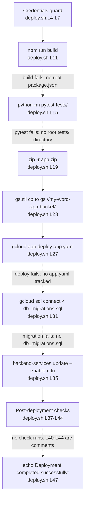

# scripts/

## Purpose

`scripts/` holds two hand-written Bash scripts that automate opposite ends of the development
lifecycle. `setup_dev_environment.sh` provisions a local development machine across 56 lines, and
`deploy.sh` ships a build to Google Cloud across 47 lines. No third file exists in the directory.

Neither script reaches its stated goal against the committed repository.
`setup_dev_environment.sh` fails at `pip install -r requirements.txt`
(`setup_dev_environment.sh:L26`) because the repository tracks no Python manifest. `deploy.sh` prints
`Deployment completed successfully!` (`deploy.sh:L47`) regardless of what happened above, because no
stage checks the exit status of the stage before it.

Three stages do work. The credentials guard exits when `GOOGLE_APPLICATION_CREDENTIALS` is unset
(`deploy.sh:L4-L7`), virtual environment creation succeeds (`setup_dev_environment.sh:L14-L15`), and
the frontend install succeeds because L20 runs `npm install` rather than `npm ci`.

## Key Components

| Component | Type | Location | Description |
|---|---|---|---|
| `setup_dev_environment.sh` | Bash script, 56 lines | `scripts/setup_dev_environment.sh:L1-L56` | Provisions host packages, a virtual environment, dependencies, a PostgreSQL database and an environment file. |
| `deploy.sh` | Bash script, 47 lines | `scripts/deploy.sh:L1-L47` | Builds, packages and deploys to Google App Engine, then updates a database and a Content Delivery Network (CDN). |
| Credentials guard | Conditional block | `scripts/deploy.sh:L4-L7` | Exits 1 when `GOOGLE_APPLICATION_CREDENTIALS` is unset. The only conditional in either script. |
| Frontend build stage | Command | `scripts/deploy.sh:L11` | Runs `npm run build` from the repository root without changing directory first. |
| Backend test stage | Command | `scripts/deploy.sh:L15` | Runs `python -m pytest tests/` against a root-level `tests/` path. |
| Packaging and upload stages | Commands | `scripts/deploy.sh:L19`, `:L23` | Writes `app.zip`, excluding `*.git*`, `node_modules/` and `venv/`, then copies it to `gs://my-word-app-bucket/`. |
| App Engine deploy stage | Command | `scripts/deploy.sh:L27` | Runs `gcloud app deploy app.yaml --quiet`. |
| Migration and CDN stages | Commands | `scripts/deploy.sh:L31`, `:L35` | Pipes `db_migrations.sql` into `gcloud sql connect my-word-app-db --user=root`, then enables Cloud CDN on `my-word-app-backend`. |
| Post-deployment checks | Echo plus comment block | `scripts/deploy.sh:L37-L44` | One echo at L39 and five comment lines at L40-L44. No check executes. |
| Success report | Command | `scripts/deploy.sh:L47` | Echoes success. Runs unconditionally. |
| Host package install | Commands | `scripts/setup_dev_environment.sh:L5-L10` | Runs `apt-get update`, `apt-get upgrade -y`, then installs six unpinned packages. |
| Virtual environment setup | Commands | `scripts/setup_dev_environment.sh:L14-L15` | Creates `backend/venv` and activates it. |
| Dependency installs | Commands | `scripts/setup_dev_environment.sh:L19-L27` | Runs `npm install` inside `frontend/`, then `pip install -r requirements.txt` inside `backend/`. |
| Database provisioning | Six `psql` calls | `scripts/setup_dev_environment.sh:L31-L36` | Creates database `msword_clone`, role `msword_user`, three role settings and one grant. |
| Environment file copy | Command | `scripts/setup_dev_environment.sh:L40` | Copies `.env.example` to `.env`. |
| Django migration stage | Commands | `scripts/setup_dev_environment.sh:L47-L48` | Runs `python manage.py makemigrations` and `python manage.py migrate`. |
| Printed instructions | Four echo lines | `scripts/setup_dev_environment.sh:L53-L56` | Tells the reader how to activate the environment and start both servers. |

## Architecture Fit

Both scripts sit beside the automation tier rather than inside it. No tracked file references
`scripts/`, `deploy.sh` or `setup_dev_environment.sh`, so no workflow, Dockerfile or Terraform
resource invokes either one. A developer runs each script by hand.

`deploy.sh:L27` issues `gcloud app deploy app.yaml --quiet`, the same command that
`.github/workflows/cd.yml:L19` runs on every push to `main`. Two independent deployment paths
therefore target one descriptor, and `cd.yml:L20` adds a second, `dispatch.yaml`. The repository
tracks no `*.yaml` file at all, so both paths deploy files that do not exist.

`setup_dev_environment.sh` overlaps `infrastructure/docker/docker-compose.yml` as a second route to a
PostgreSQL database, and the two disagree on the name. The script creates database `msword_clone`
(`setup_dev_environment.sh:L31`) and role `msword_user` (`:L32`), while Compose creates `wordapp`
(`infrastructure/docker/docker-compose.yml:L33`) under role `postgres` (`:L34`). Both paths set the
same literal password, `password` (`setup_dev_environment.sh:L32`, `docker-compose.yml:L35`), so the
name and the role diverge while the credential does not. `backend/app/core/config.py:L118` requires
`DATABASE_URL` with no default, so nothing reconciles the two names. For the surrounding layer map,
see [`../docs/architecture-overview.md`](../docs/architecture-overview.md).

## Dependencies

### Internal

| Path | Consumed at | Status |
|---|---|---|
| `frontend/package.json` | `setup_dev_environment.sh:L20`, after `cd frontend` at L19 | Tracked |
| `backend/requirements.txt` | `setup_dev_environment.sh:L26`, after `cd backend` at L25 | Absent |
| `.env.example` | `setup_dev_environment.sh:L40` | Absent |
| `backend/manage.py` | `setup_dev_environment.sh:L47-L48` | Absent |
| Root `package.json` | `deploy.sh:L11` | Absent. Only `frontend/package.json` is tracked |
| Root `tests/` directory | `deploy.sh:L15` | Absent. Only `backend/tests/` exists |
| `app.yaml` | `deploy.sh:L27` | Absent |
| `db_migrations.sql` | `deploy.sh:L31` | Absent. No `*.sql` file is tracked |

`deploy.sh:L15` targets the backend suite that `backend/tests/` holds. For the state of that suite,
see [`../backend/tests/README.md`](../backend/tests/README.md).

### External

| Tool | Invoked at | Source |
|---|---|---|
| `apt-get`, through `sudo` | `setup_dev_environment.sh:L5`, `:L6`, `:L10` | Debian package manager |
| `python3`, `python`, and `pytest` as `python -m pytest` | `setup_dev_environment.sh:L14`, `:L47-L48`, `deploy.sh:L15` | Host interpreter. Neither script installs `pytest` |
| `npm` | `setup_dev_environment.sh:L20`, `deploy.sh:L11` | Installed by `setup_dev_environment.sh:L10` |
| `pip` | `setup_dev_environment.sh:L26` | Installed by `setup_dev_environment.sh:L10` |
| `psql`, through `sudo -u postgres` | `setup_dev_environment.sh:L31-L36` | Installed by `setup_dev_environment.sh:L10` |
| `zip` | `deploy.sh:L19` | Host archiver |
| `gsutil` | `deploy.sh:L23` | Google Cloud Software Development Kit (SDK) |
| `gcloud` | `deploy.sh:L27`, `:L31`, `:L35` | Google Cloud SDK |

No script pins a version of any tool above. `README.md:L24` lists the Google Cloud SDK as a
prerequisite, and `setup_dev_environment.sh:L10` does not install it. For the prerequisite list and
the setup sequence that does work, see [`../docs/onboarding.md`](../docs/onboarding.md).

## Configuration

| Value | Read or written at | Status |
|---|---|---|
| `GOOGLE_APPLICATION_CREDENTIALS` | Guarded at `deploy.sh:L4` | DECLARED. `backend/app/core/config.py:L117` declares it as `Optional[str]` |
| `DATABASE_URL` | Set by neither script | READ ELSEWHERE, NEVER SET HERE. `backend/app/core/config.py:L118` requires it |
| `.env` | Written at `setup_dev_environment.sh:L40` | ASSUMED ONLY. Copied from an absent source; `backend/app/core/config.py:L121-L124` points `env_file` at it |
| `my-word-app-bucket`, `my-word-app-db`, `my-word-app-backend` | `deploy.sh:L23`, `:L31`, `:L35` | HARD-CODED. `infrastructure/terraform/main.tf:L51` declares a different bucket, `word-documents-${var.project_id}` |
| `--user=root` | `deploy.sh:L31` | HARD-CODED. Not a PostgreSQL role convention; `infrastructure/docker/docker-compose.yml:L34` uses `postgres` |
| Database `msword_clone` and role `msword_user` | `setup_dev_environment.sh:L31-L36` | HARD-CODED. Compose names `wordapp` under `postgres` at `infrastructure/docker/docker-compose.yml:L33-L34` |
| Password `password` | `setup_dev_environment.sh:L32` | HARD-CODED literal, embedded in the script |
| Role encoding, isolation, timezone | `setup_dev_environment.sh:L33-L35` | HARD-CODED as `utf8`, `read committed` and `UTC` |

Neither script reads a configuration file, and neither accepts an argument or a flag.

## Data Flows

A deployment run reads one environment variable and then executes eight stages in fixed line order,
from `deploy.sh:L4` to `deploy.sh:L47`. Five of those stages fail against the committed repository.
No stage checks the exit status of the one before it, so a failure at `deploy.sh:L11` still reaches
the upload at `:L23` and the deploy at `:L27`.



A setup run moves in one direction, from host packages at `setup_dev_environment.sh:L5` to the printed
instructions at `:L56`. The run fails at `:L26`, then continues into database provisioning at
`:L31-L36`, the environment copy at `:L40` and two Django commands at `:L47-L48`.

## Design Patterns

Both files follow a linear shell pipeline. Each script executes top to bottom with no functions, no
`set -e`, no `trap` handler and no `$?` inspection anywhere. Each stage announces itself with an
`echo` and then runs one command, which keeps the log readable and leaves failures unhandled.

A fail-fast guard appears exactly once, at `deploy.sh:L4-L7`, which tests one environment variable and
exits 1 when the variable is empty. No later stage repeats the pattern.

`deploy.sh` hard-codes cloud resource identifiers rather than parameterising them, embedding a bucket
at L23, a database instance at L31 and a backend service at L35. Host provisioning is unpinned in the
same way: `setup_dev_environment.sh:L10` installs six packages with no version constraint, so the host
distribution decides which runtime versions appear.

## Known Limitations

Both scripts carry defects that stop them against the committed repository. Every entry below cites
the line that establishes it.

`deploy.sh` reports success it did not achieve:

- `deploy.sh:L47` echoes `Deployment completed successfully!` unconditionally. Nothing between L8 and
  L46 checks an exit status, so the message prints after any number of failed stages.
- See the HUMAN ASSISTANCE NEEDED marker at `deploy.sh:L37`: the post-deployment checks were left for
  a human to write. `deploy.sh:L39` prints `Running post-deployment checks...`, and L40-L44 remain
  comments covering responsiveness (L42), database connections (L43) and critical functionality (L44).
- `deploy.sh:L11` runs `npm run build` from the repository root with no `cd frontend` first, and only
  `frontend/package.json` is tracked, so the build fails.
- `deploy.sh:L15` runs `python -m pytest tests/`, and no root `tests/` directory exists. `README.md:L65`
  claims one, alongside a root `docs/` at L64, and both claims are wrong.
- `deploy.sh:L19` packages whatever the earlier stages left on disk, including the output of a failed
  build, because the `zip` call excludes only `*.git*`, `node_modules/` and `venv/`.
- `deploy.sh:L27` deploys `app.yaml`, and the repository tracks no `*.yaml` file anywhere. That one
  check also settles `dispatch.yaml` at `.github/workflows/cd.yml:L20`.
- `deploy.sh:L31` pipes `db_migrations.sql` into `gcloud sql connect`, and no `*.sql` file is tracked.
  The flag `--user=root` names no role that either provisioning path creates.
- `deploy.sh:L23`, `:L31` and `:L35` hard-code three cloud resource names, and
  `infrastructure/terraform/main.tf:L51` declares the only tracked bucket as
  `word-documents-${var.project_id}`, which does not match `:L23`.

`setup_dev_environment.sh` fails at the backend install, and every later stage fails as well:

- `setup_dev_environment.sh:L26` runs `pip install -r requirements.txt` and fails, because no Python
  manifest is tracked. No `requirements.txt`, `pyproject.toml`, `setup.py`, `setup.cfg`, `Pipfile` or
  `tox.ini` exists anywhere in the repository.
- `setup_dev_environment.sh:L40` runs `cp .env.example .env` and fails, because `.env.example` does
  not exist. `backend/app/core/config.py:L121-L124` points `env_file` at that absent `.env`.
- See the HUMAN ASSISTANCE NEEDED marker at `setup_dev_environment.sh:L41` and the TODO below it at
  `:L42`: the environment file still needs production values, which the L40 copy cannot supply.
- `setup_dev_environment.sh:L47` and `:L48` run `manage.py makemigrations` and `manage.py migrate`.
  Both are Django commands in a FastAPI project that imports no Django, and no `manage.py` is
  tracked, so both fail.
- `setup_dev_environment.sh:L55` prints `python manage.py runserver` to start the backend, naming
  Django's server, while `README.md:L55` correctly gives `uvicorn main:app --reload` for FastAPI.
- `setup_dev_environment.sh:L32` embeds the literal password `password` in the script.
- `setup_dev_environment.sh:L5` and `:L6` mutate the host with `sudo apt-get update` and
  `upgrade -y`, which restricts the script to Debian-family Linux.
- `setup_dev_environment.sh` holds no idempotency guard. A second run repeats the `CREATE DATABASE` at
  `:L31` and the `CREATE USER` at `:L32`, and PostgreSQL rejects both as duplicates.

Version floors disagree across five files, and nothing enforces any of them. `README.md:L23` states
Python 3.8 or later, while `infrastructure/docker/backend.Dockerfile:L2` pins `python:3.9-slim`.
`README.md:L22` states Node 14 or later, `.github/workflows/ci.yml:L17` sets `node-version: '14'`, and
`infrastructure/docker/frontend.Dockerfile:L2` pins `node:14-alpine`, while
`setup_dev_environment.sh:L10` pins nothing. Python 3.9 and Node 14 have both passed end of life.

Intended behavior per `documentation/Software Requirements Specifications (SRS).md`, under the QUALITY
heading: L617 calls for Continuous Integration and Continuous Deployment (CI/CD) pipelines built on
Google Cloud Build, and no `cloudbuild.yaml` is tracked. The same heading names Google Kubernetes
Engine at L615, while `deploy.sh:L27` deploys to Google App Engine.
`documentation/Software Project Proposal.md`, under the LIST OF DELIVERABLES heading, names a
"Deployment Guide for IT Administrators" at L436, and
[`../docs/deployment-guide.md`](../docs/deployment-guide.md) describes what these scripts deploy.

For the consolidated defect register across the whole repository, see
[`../docs/troubleshooting.md`](../docs/troubleshooting.md). For the reasoning behind the documentation
choices recorded here, see [`../docs/decision-log.md`](../docs/decision-log.md).

## Usage Examples

Provision a development machine on a Debian-family host:

```bash
cd /path/to/microsoft-word
bash scripts/setup_dev_environment.sh
```

The run installs host packages, creates `backend/venv` and installs the frontend packages, then fails
at `pip install -r requirements.txt` (`setup_dev_environment.sh:L26`) because no `requirements.txt` is
tracked.

Deploy to Google Cloud, which requires a service-account key path in the environment:

```bash
export GOOGLE_APPLICATION_CREDENTIALS=/path/to/service-account-key.json
bash scripts/deploy.sh
```

The guard at `deploy.sh:L4-L7` passes, and the run then fails at `npm run build` (`deploy.sh:L11`)
because no `package.json` exists at the repository root. Every later stage still announces itself and
runs, and `deploy.sh:L47` closes the run by printing success.

Run the same script with the credentials variable unset to exercise the one working check:

```bash
unset GOOGLE_APPLICATION_CREDENTIALS
bash scripts/deploy.sh
```

The guard prints the error at `deploy.sh:L5` and exits 1 at `deploy.sh:L6`, which is the only
stage-level failure either script detects.
