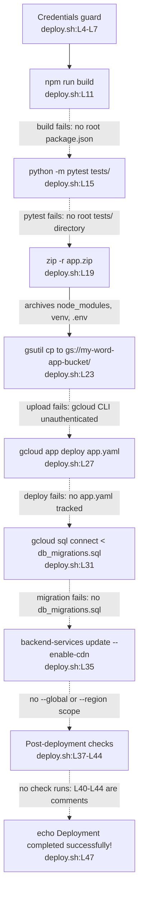

# scripts/

## Purpose

`scripts/` holds two hand-written Bash scripts that automate opposite ends of the development lifecycle. `setup_dev_environment.sh` provisions a local
development machine across 56 lines, and `deploy.sh` ships a build to Google Cloud across 47 lines. No third file exists in the directory.

Neither script reaches its stated goal against the committed repository. Neither declares `set -e`, so every stage runs whatever the stage before it returned,
and each closes by printing success regardless of outcomes: `setup_dev_environment.sh:L52` and `deploy.sh:L47`.

Several stages do work, so a run ends in partial success rather than clean failure. Virtual environment creation succeeds (`setup_dev_environment.sh:L14-L15`), and
the frontend install succeeds because L20 runs `npm install` rather than `npm ci`. The six `psql` calls at `:L31-L36` create database `msword_clone` and role
`msword_user` on a host running PostgreSQL. The backend install at `:L26` fails, and the stages after it fail for their own separate reasons rather than because of
it.

One guard exists, and it is narrower than it looks. `deploy.sh:L4-L7` exits 1 when `GOOGLE_APPLICATION_CREDENTIALS` is empty, and that is all it does. The guard
checks no path, validates no key, authenticates no `gcloud` command-line interface (CLI) session and selects no project.

## Key Components

| Component | Type | Location | Description |
| --- | --- | --- | --- |
| `setup_dev_environment.sh` | Bash script, 56 lines | `scripts/setup_dev_environment.sh:L1-L56` | Provisions host packages, a virtual environment, dependencies, a PostgreSQL database and an environment file. |
| `deploy.sh` | Bash script, 47 lines | `scripts/deploy.sh:L1-L47` | Builds, packages and deploys to Google App Engine, then updates a database and a Content Delivery Network (CDN). |
| Credentials guard | Conditional block | `scripts/deploy.sh:L4-L7` | Exits 1 when `GOOGLE_APPLICATION_CREDENTIALS` is empty. Tests the variable only, and performs no `gcloud` authentication. The only conditional in either script. |
| Build and test stages | Commands | `scripts/deploy.sh:L11`, `:L15` | Runs `npm run build` and `python -m pytest tests/` from the repository root without changing directory first. |
| Packaging and upload stages | Commands | `scripts/deploy.sh:L19`, `:L23` | Writes `app.zip` from the whole working directory with three `-x` patterns, then copies it to `gs://my-word-app-bucket/`. The patterns match only at the archive root, so nested `node_modules/` and `venv/` trees are included. |
| Deploy, migration and CDN stages | Commands | `scripts/deploy.sh:L27`, `:L31`, `:L35` | Runs `gcloud app deploy app.yaml --quiet`, pipes `db_migrations.sql` into `gcloud sql connect my-word-app-db --user=root`, then enables Cloud CDN on `my-word-app-backend`. The CDN command passes neither `--global` nor `--region`, and no `--quiet`. |
| Post-deployment checks | Echo plus comment block | `scripts/deploy.sh:L37-L44` | One echo at L39 and five comment lines at L40-L44. No check executes. |
| Success report | Command | `scripts/deploy.sh:L47` | Echoes success. Runs unconditionally. |
| Host package install | Commands | `scripts/setup_dev_environment.sh:L5-L10` | Runs `apt-get update`, `apt-get upgrade -y`, then installs six unpinned packages. Installs neither the Google Cloud SDK nor `zip`. |
| Virtual environment and dependency installs | Commands | `scripts/setup_dev_environment.sh:L14-L27` | Creates and activates `backend/venv`, runs `npm install` inside `frontend/`, then `pip install -r requirements.txt` inside `backend/`. |
| Database provisioning | Six `psql` calls | `scripts/setup_dev_environment.sh:L31-L36` | Creates database `msword_clone`, role `msword_user`, three role settings and one grant. The one multi-command stage that succeeds. |
| Environment file copy | Command | `scripts/setup_dev_environment.sh:L40` | Copies `.env.example` to `.env`. |
| Django migration stage | Commands | `scripts/setup_dev_environment.sh:L47-L48` | Runs `python manage.py makemigrations` and `python manage.py migrate`. |
| Completion report and instructions | Five echo lines | `scripts/setup_dev_environment.sh:L52-L56` | Prints success unconditionally, then tells the reader how to activate the environment and start both servers. |

## Architecture Fit

Both scripts sit beside the automation tier rather than inside it. No runtime or executable artifact invokes either script: no workflow step, no Dockerfile
instruction, no Terraform resource and no `package.json` script names `scripts/`, `deploy.sh` or `setup_dev_environment.sh`. Documentation under `docs/` and
this README do reference them, and a reference in prose starts nothing. A developer runs each script by hand.

`deploy.sh:L27` issues `gcloud app deploy app.yaml --quiet`, the same command that `.github/workflows/cd.yml:L19` runs on every push to `main`. Two independent
deployment paths therefore target one descriptor, and `cd.yml:L20` adds a second, `dispatch.yaml`. The repository tracks no `*.yaml` file at all, so both paths
deploy files that do not exist.

`setup_dev_environment.sh` overlaps `infrastructure/docker/docker-compose.yml` as a second route to a PostgreSQL database, and the two disagree on the name. The
script creates database `msword_clone` (`setup_dev_environment.sh:L31`) and role `msword_user` (`:L32`), while Compose creates `wordapp`
(`infrastructure/docker/docker-compose.yml:L33`) under role `postgres` (`:L34`). Both set the same literal password, `password` (`setup_dev_environment.sh:L32`,
`docker-compose.yml:L35`), so the name and role diverge while the credential does not. `backend/app/core/config.py:L118` requires `DATABASE_URL` with no
default, and nothing reconciles the two names. For the layer map, see [`../docs/architecture-overview.md`](../docs/architecture-overview.md).

## Dependencies

### Internal

| Path | Consumed at | Status |
| --- | --- | --- |
| `frontend/package.json` | `setup_dev_environment.sh:L20`, after `cd frontend` at L19 | Tracked |
| `backend/requirements.txt` | `setup_dev_environment.sh:L26`, after `cd backend` at L25 | Absent |
| `.env.example` | `setup_dev_environment.sh:L40` | Absent |
| `backend/manage.py` | `setup_dev_environment.sh:L47-L48` | Absent |
| Root `package.json` | `deploy.sh:L11` | Absent. Only `frontend/package.json` is tracked |
| Root `tests/` directory | `deploy.sh:L15` | Absent. Only `backend/tests/` exists |
| `app.yaml` | `deploy.sh:L27` | Absent |
| `db_migrations.sql` | `deploy.sh:L31` | Absent. No `*.sql` file is tracked |

`deploy.sh:L15` targets the backend suite that `backend/tests/` holds. For the state of that suite, see
[`../backend/tests/README.md`](../backend/tests/README.md).

### External

| Tool | Invoked at | Source |
| --- | --- | --- |
| `apt-get`, through `sudo` | `setup_dev_environment.sh:L5`, `:L6`, `:L10` | Debian package manager |
| `python3`, `python`, and `pytest` as `python -m pytest` | `setup_dev_environment.sh:L14`, `:L47-L48`, `deploy.sh:L15` | Host interpreter. Neither script installs `pytest` |
| `npm` | `setup_dev_environment.sh:L20`, `deploy.sh:L11` | Installed by `setup_dev_environment.sh:L10` |
| `pip` | `setup_dev_environment.sh:L26` | Installed by `setup_dev_environment.sh:L10` |
| `psql`, through `sudo -u postgres` | `setup_dev_environment.sh:L31-L36` | Installed by `setup_dev_environment.sh:L10` |
| `zip` | `deploy.sh:L19` | Host archiver. `setup_dev_environment.sh:L10` does not install it, and a minimal Debian or Ubuntu image ships without it, so L19 can fail on `zip: command not found` |
| `gsutil` | `deploy.sh:L23` | Google Cloud Software Development Kit (SDK) |
| `gcloud` | `deploy.sh:L27`, `:L31`, `:L35` | Google Cloud SDK |

No script pins a version of any tool above. Two tools that `deploy.sh` needs are installed by neither script: `README.md:L24` lists the Google Cloud SDK as a
prerequisite and `setup_dev_environment.sh:L10` omits it, and the same line omits `zip`. For the prerequisite list and the setup sequence that does work, see
[`../docs/onboarding.md`](../docs/onboarding.md).

## Configuration

| Value | Read or written at | Status |
| --- | --- | --- |
| `GOOGLE_APPLICATION_CREDENTIALS` | Guarded at `deploy.sh:L4` | DECLARED, AND NOT SUFFICIENT. `backend/app/core/config.py:L117` declares it as `Optional[str]`. The variable configures Application Default Credentials for client libraries, not the `gcloud` CLI, and the script runs no `gcloud auth activate-service-account` |
| `DATABASE_URL` | Set by neither script | READ ELSEWHERE, NEVER SET HERE. `backend/app/core/config.py:L118` requires it |
| `.env` | Written at `setup_dev_environment.sh:L40` | ASSUMED ONLY. Copied from an absent source; `backend/app/core/config.py:L121-L124` points `env_file` at it |
| `my-word-app-bucket`, `my-word-app-db`, `my-word-app-backend` | `deploy.sh:L23`, `:L31`, `:L35` | HARD-CODED. `infrastructure/terraform/main.tf:L51` declares a different bucket, `word-documents-${var.project_id}` |
| `--user=root` | `deploy.sh:L31` | HARD-CODED, AND UNPROVISIONED. Neither provisioning path creates a `root` role: `setup_dev_environment.sh:L32` creates `msword_user` and `infrastructure/docker/docker-compose.yml:L34` creates `postgres` |
| Database `msword_clone` and role `msword_user` | `setup_dev_environment.sh:L31-L36` | HARD-CODED. Compose names `wordapp` under `postgres` at `infrastructure/docker/docker-compose.yml:L33-L34` |
| Password `password` | `setup_dev_environment.sh:L32` | HARD-CODED literal, embedded in the script |
| Role encoding, isolation, timezone | `setup_dev_environment.sh:L33-L35` | HARD-CODED as `utf8`, `read committed` and `UTC` |

Neither script parses a configuration file itself, and neither accepts an argument or a flag. The commands they launch do read configuration: `npm` reads
`package.json` (`setup_dev_environment.sh:L20`, `deploy.sh:L11`), `pip` reads `requirements.txt` (`setup_dev_environment.sh:L26`), `gcloud app deploy` reads
`app.yaml` (`deploy.sh:L27`), `gcloud sql connect` reads `db_migrations.sql` on standard input (`:L31`), and `cp` reads the `.env.example` template
(`setup_dev_environment.sh:L40`). Only `frontend/package.json` is tracked. `requirements.txt`, `app.yaml`, `db_migrations.sql`, `.env.example` and a root
`package.json` are all absent, so the Internal table above records each one.

## Data Flows

A deployment run reads one environment variable and then executes eight stages in fixed line order, from `deploy.sh:L4` to `deploy.sh:L47`. Seven of the eight
fail against the committed repository. No stage checks the exit status of the one before it, so a failure at `deploy.sh:L11` still reaches the upload at `:L23`
and the deploy at `:L27`.



A setup run moves in one direction, from host packages at `setup_dev_environment.sh:L5` to the printed instructions at `:L56`. The run fails at `:L26`, succeeds
at `:L31-L36`, fails at the environment copy `:L40` and the two Django commands `:L47-L48`, then prints success at `:L52`.

## Design Patterns

Both files follow a linear shell pipeline. Each script executes top to bottom with no functions, no `set -e`, no `trap` handler and no `$?` inspection anywhere.
Each stage announces itself with an `echo` and then runs one command, which keeps the log readable and leaves failures unhandled.

`deploy.sh` hard-codes cloud resource identifiers rather than parameterising them, embedding a bucket at L23, a database instance at L31 and a backend service
at L35. Host provisioning is unpinned in the same way: `setup_dev_environment.sh:L10` installs six packages with no version constraint, so the host distribution
decides which runtime versions appear.

Both scripts assume the working directory rather than deriving it. Every path is relative, so `deploy.sh:L11`, `:L15`, `:L19` and every `cd` in
`setup_dev_environment.sh` resolve against wherever the caller happened to be. Running either from `scripts/` rather than the repository root changes which files
it reads and where it writes. `deploy.sh:L19` writes `app.zip` into that same directory, and `zip` updates an existing archive in place rather than replacing it,
so a second run adds to whatever the first left behind and uploads the result at `:L23`.

Every remote stage mutates rather than reconciles. `:L23` overwrites the object, `:L27` creates a new App Engine version, `:L31` replays the whole migration file,
and `:L35` re-applies the CDN flag. Re-running after a partial failure therefore repeats every stage that already succeeded, the migration included.

## Known Limitations

Every entry below cites the line that establishes it.

`deploy.sh` reports success it did not achieve:

| Limitation | Evidence |
| --- | --- |
| `deploy.sh:L47` echoes `Deployment completed successfully!` unconditionally | Nothing between L8 and L46 checks an exit status, so the message prints after any number of failed stages |
| The post-deployment checks were left for a human to write | See the HUMAN ASSISTANCE NEEDED marker at `deploy.sh:L37`. `deploy.sh:L39` prints `Running post-deployment checks...`, and L40-L44 remain comments covering responsiveness (L42), database connections (L43) and critical functionality (L44) |
| The frontend build runs in the wrong directory | `deploy.sh:L11` runs `npm run build` from the repository root with no `cd frontend` first, and only `frontend/package.json` is tracked, so the build fails |
| The test stage names a directory that does not exist | `deploy.sh:L15` runs `python -m pytest tests/`, and no root `tests/` directory exists. `README.md:L65` claims one and remains wrong. The root `docs/` that `README.md:L64` claims does now exist, because this documentation pass created it |
| The archive can carry credentials and dependency trees off the machine | `deploy.sh:L19` packages whatever earlier stages left on disk and `:L23` uploads it. The three `-x` patterns are `*.git*`, `node_modules/*` and `venv/*`, and the last two are anchored at the archive root, so neither matches `frontend/node_modules/` or `backend/venv/`. A machine that ran `setup_dev_environment.sh:L14` and `:L20` first therefore packages both trees. Nothing excludes `.env`, which `:L40` writes into the repository root, and nothing excludes a service-account JSON key left in the tree |
| The App Engine deploy names an absent descriptor | `deploy.sh:L27` deploys `app.yaml`, and the repository tracks no `*.yaml` file anywhere. That one check also settles `dispatch.yaml` at `.github/workflows/cd.yml:L20` |
| The migration stage names an absent file and an absent role | `deploy.sh:L31` pipes `db_migrations.sql` into `gcloud sql connect`, and no `*.sql` file is tracked. The flag `--user=root` names no role that either provisioning path creates |
| The backend-service update names no scope and can block on a prompt | `gcloud compute backend-services update` needs either `--global` or `--region`, and `deploy.sh:L35` passes neither, so the command prompts or errors rather than applying the change unattended. L35 also omits the `--quiet` that `:L27` and `.github/workflows/cd.yml:L19-L20` pass |
| Three cloud resource names are hard-coded, and one contradicts Terraform | `deploy.sh:L23`, `:L31` and `:L35` hard-code them, and `infrastructure/terraform/main.tf:L51` declares the only tracked bucket as `word-documents-${var.project_id}`, which does not match `:L23` |
| The credentials guard authenticates nothing | `deploy.sh:L4-L7` tests only that `GOOGLE_APPLICATION_CREDENTIALS` is non-empty: it checks no path, verifies no key, and runs neither `gcloud auth activate-service-account --key-file` nor `gcloud config set project`. That variable configures Application Default Credentials, which Google client libraries read, while the `gcloud` and `gsutil` CLIs use their own credential store. `gsutil cp` at `:L23` is the first cloud command and where the gap surfaces, so a passing guard predicts nothing about the four cloud stages |

`setup_dev_environment.sh` ends in partial success, and reports unqualified success:

- `setup_dev_environment.sh:L52` echoes `Development environment setup complete!` unconditionally, and L53-L56 then print start-up instructions. The script
  declares no `set -e` and inspects no exit status, so those four lines print after any number of failed stages.
- The stages after the backend install fail on their own causes, not because of it. Database provisioning at `:L31-L36` succeeds on a host where `apt-get
  install postgresql` (`:L10`) started a server. A run therefore leaves a usable database, an activated virtual environment holding no backend packages,
  installed frontend packages, no `.env` and no migrations.
- `setup_dev_environment.sh:L26` runs `pip install -r requirements.txt` and fails, because no Python manifest is tracked. No `requirements.txt`,
  `pyproject.toml`, `setup.py`, `setup.cfg`, `Pipfile` or `tox.ini` exists anywhere in the repository.
- `setup_dev_environment.sh:L40` runs `cp .env.example .env` and fails, because `.env.example` does not exist. `backend/app/core/config.py:L121-L124` points
  `env_file` at that absent `.env`.
- See the HUMAN ASSISTANCE NEEDED marker at `setup_dev_environment.sh:L41` and the TODO below it at `:L42`: the environment file still needs production values,
  which the L40 copy cannot supply.
- `setup_dev_environment.sh:L47` and `:L48` run `manage.py makemigrations` and `manage.py migrate`. Both are Django commands in a FastAPI project that imports
  no Django, and no `manage.py` is tracked, so both fail.
- `setup_dev_environment.sh:L55` prints `python manage.py runserver`, naming Django's server in a FastAPI project. The front-door alternative does not work
  either. `README.md:L54-L55` gives `cd backend` then `uvicorn main:app --reload`, and `backend/` holds no `main.py`: the application object lives at
  `backend/app/main.py`, so the target would have to be `app.main:app`. Correcting it still starts no server, because `import app.main` raises at
  `backend/app/api/auth.py:L81` with `cannot import name 'settings' from 'app.core.config'`. Both printed instructions are non-working.
- `setup_dev_environment.sh:L32` embeds the literal password `password` in the script.
- `setup_dev_environment.sh:L5` and `:L6` mutate the host with `sudo apt-get update` and `upgrade -y`, which restricts the script to Debian-family Linux.
- `setup_dev_environment.sh` holds no idempotency guard. A second run repeats the `CREATE DATABASE` at `:L31` and the `CREATE USER` at `:L32`, and PostgreSQL
  rejects both as duplicates.

Version floors disagree across five files, and nothing enforces any of them. `README.md:L23` states Python 3.8 or later, while
`infrastructure/docker/backend.Dockerfile:L2` pins `python:3.9-slim`. `README.md:L22` states Node 14 or later, `.github/workflows/ci.yml:L17` sets
`node-version: '14'`, and `infrastructure/docker/frontend.Dockerfile:L2` pins `node:14-alpine`, while `setup_dev_environment.sh:L10` pins nothing. Python 3.9
ended support on 31 October 2025 and Node 14 on 30 April 2023, so both are unsupported as of 6 August 2026.

Intended behavior per `documentation/Software Requirements Specifications (SRS).md`, under the QUALITY heading: L617 calls for Continuous Integration and
Continuous Deployment (CI/CD) pipelines on Google Cloud Build, and no `cloudbuild.yaml` is tracked. The same heading names Google Kubernetes Engine at L615,
while `deploy.sh:L27` deploys to Google App Engine.

For the consolidated defect register, see [`../docs/troubleshooting.md`](../docs/troubleshooting.md), and for what these scripts deploy, see
[`../docs/deployment-guide.md`](../docs/deployment-guide.md).

## Usage Examples

**Read this before running anything below.** Both scripts change state outside the repository and
neither is idempotent. `setup_dev_environment.sh:L5-L6` upgrades every package on the host, and its
`CREATE DATABASE` at `:L31` and `CREATE USER` at `:L32` fail on a second run. `deploy.sh` publishes to
App Engine at `:L27`, pipes a migration into Cloud SQL at `:L31` and enables Cloud CDN at `:L35`, all
under whatever identity the ambient `gcloud` configuration holds. Neither script sets `set -e`, so a
failed stage does not stop the run. Treat the first two blocks below as inspection material: run them
only on a disposable virtual machine, against a non-production project, after confirming the active
identity with `gcloud config list account` and `gcloud config get-value project`.

Provision a development machine, on a disposable Debian-family host only:

```bash
# Inspection reference. Upgrades every host package and is not idempotent.
cd /path/to/microsoft-word
bash scripts/setup_dev_environment.sh
```

The run installs host packages, creates `backend/venv` and installs the frontend packages, then fails at `pip install -r requirements.txt`
(`setup_dev_environment.sh:L26`) because no `requirements.txt` is tracked. The run does not stop there. Database provisioning at `:L31-L36` succeeds, the `.env`
copy at `:L40` fails, the two Django commands at `:L47-L48` fail, and `:L52` prints `Development environment setup complete!` anyway. Read the log rather than
the last line.

Deploy to Google Cloud. Setting the variable below satisfies the guard, and does not authenticate the CLI:

```bash
# Inspection reference. Deploys to App Engine and mutates Cloud SQL under the active project.
export GOOGLE_APPLICATION_CREDENTIALS=/path/to/disposable-service-account-key.json
gcloud config set project <disposable-project-id>
bash scripts/deploy.sh
```

The guard at `deploy.sh:L4-L7` passes, and the run then fails at `npm run build` (`deploy.sh:L11`) because no `package.json` exists at the repository root.
Every later stage still announces itself and runs, and `deploy.sh:L47` closes by printing success. The four cloud stages need an authenticated CLI, which the
export above does not provide, so add these two commands before running the script:

```bash
gcloud auth activate-service-account --key-file "$GOOGLE_APPLICATION_CREDENTIALS"
gcloud config set project <project-id>
```

The first cloud command (`gsutil cp` at `:L23`) then reaches the bucket instead of failing on credentials. Running `deploy.sh` with the variable unset instead
exercises the one working check: the guard prints the error at `deploy.sh:L5` and exits 1 at `:L6`, which is the only stage-level failure either script detects.
